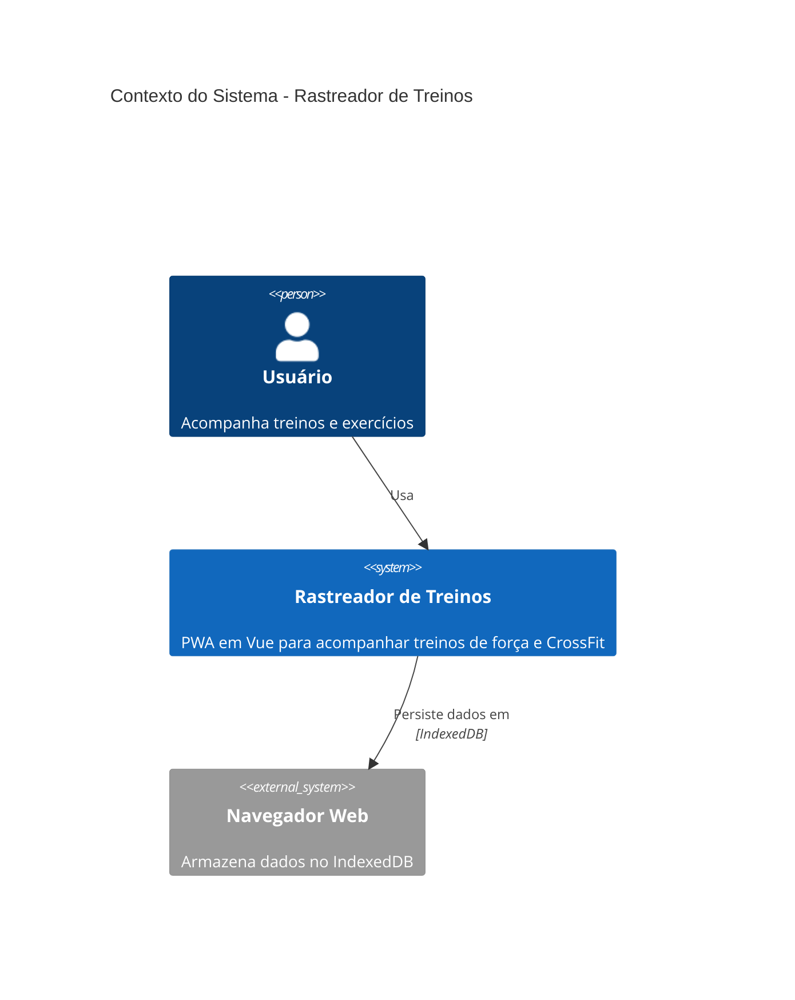
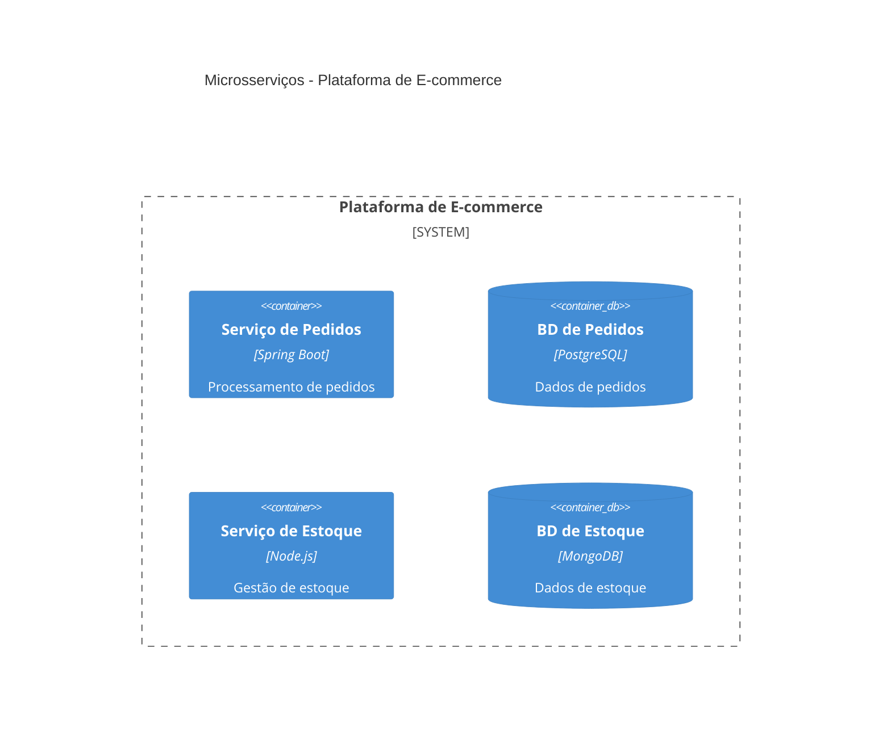
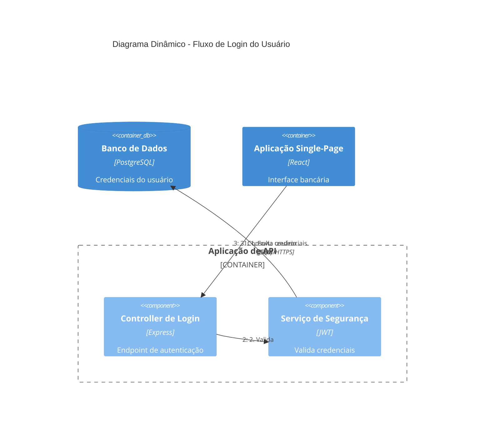

# Skill de Arquitetura C4

Gera documentação de arquitetura de software usando diagramas do modelo C4 em sintaxe Mermaid.

## Propósito

Esta skill ajuda a criar documentação de arquitetura profissional usando o modelo C4 (Context, Container, Component, Code). Ela gera diagramas Mermaid que visualizam a arquitetura do seu sistema em diferentes níveis de abstração, facilitando a comunicação de decisões de design para públicos distintos.

## Quando Usar

Use esta skill quando você precisar:

- Criar diagramas de arquitetura para documentação
- Visualizar a estrutura e as relações do software
- Documentar a arquitetura do sistema para públicos distintos (executivos, desenvolvedores, DevOps)
- Gerar diagramas C4 Context, Container, Component ou Deployment
- Criar diagramas dinâmicos mostrando fluxos de requisição
- Documentar arquiteturas de microsserviços ou orientadas a eventos

**Frases de gatilho**: "diagrama de arquitetura", "diagrama C4", "contexto do sistema", "diagrama de contêiner", "diagrama de componente", "diagrama de deployment", "documentar arquitetura", "visualizar arquitetura"

## Como Funciona

A skill segue um fluxo de trabalho sistemático:

1. **Entender o escopo** - Determina quais níveis C4 são necessários com base no seu público
2. **Analisar o código** - Explora o sistema para identificar componentes, contêineres e relações
3. **Gerar diagramas** - Cria diagramas C4 em Mermaid nos níveis de abstração apropriados
4. **Documentar** - Escreve os diagramas em arquivos markdown com contexto explicativo

### Níveis de Diagrama C4

| Nível | Tipo de Diagrama | Público | Mostra | Quando Criar |
|-------|-------------|----------|-------|----------------|
| 1 | **C4Context** | Todos | Sistema + atores externos | Sempre (obrigatório) |
| 2 | **C4Container** | Técnico | Apps, bancos de dados, serviços | Sempre (obrigatório) |
| 3 | **C4Component** | Desenvolvedores | Componentes internos | Só se agregar valor |
| 4 | **C4Deployment** | DevOps | Nós de infraestrutura | Para sistemas em produção |
| - | **C4Dynamic** | Técnico | Fluxos de requisição (numerados) | Para fluxos complexos |

**Ponto-chave**: "Diagramas de Context + Container são suficientes para a maioria das equipes de desenvolvimento de software." Crie diagramas de Component/Code apenas quando eles realmente agregarem valor.

## Principais Recursos

- **Múltiplos níveis de abstração** - Gera diagramas de Context, Container, Component, Deployment e Dynamic
- **Detalhe adequado ao público** - Seleciona automaticamente o nível de detalhe certo para o seu público
- **Boas práticas embutidas** - Segue as convenções do modelo C4 e os anti-padrões a evitar
- **Suporte a microsserviços** - Tratamento especial para arquiteturas de microsserviços e orientadas a eventos
- **Sintaxe Mermaid** - Usa o formato de diagrama Mermaid, amplamente suportado
- **Referências abrangentes** - Inclui guia de sintaxe, erros comuns e padrões avançados

## Exemplos de Uso

### Exemplo 1: Documentar uma Aplicação Web Simples

**Solicitação**: "Crie diagramas de arquitetura para meu app rastreador de treinos"

**Resultado**: Gera:
- Diagrama de System Context mostrando usuários e sistemas externos
- Diagrama de Container mostrando a SPA em Vue.js, o gerenciamento de estado (Pinia) e o IndexedDB

### Exemplo 2: Documentar uma Arquitetura de Microsserviços

**Solicitação**: "Crie um diagrama de contêiner para nossos microsserviços de e-commerce"

**Resultado**: Gera um diagrama de Container mostrando:
- Serviço de Pedidos com PostgreSQL
- Serviço de Estoque com MongoDB
- Filas de mensagens para comunicação entre serviços

### Exemplo 3: Mostrar um Fluxo de Requisição

**Solicitação**: "Diagrame o fluxo de login do usuário"

**Resultado**: Gera um diagrama Dynamic com passos numerados:

### Exemplo 4: Documentar o Deployment de Produção

**Solicitação**: "Crie um diagrama de deployment para nossa infraestrutura AWS"

**Resultado**: Gera um diagrama de Deployment mostrando:
- Nó de deployment do navegador
- AWS Cloud com nós ECS e RDS
- Relações de infraestrutura

## Local de Saída

A documentação de arquitetura é escrita em `docs/architecture/` com esta convenção de nomes:

- `c4-context.md` - Diagrama de system context
- `c4-containers.md` - Diagrama de container
- `c4-components-{feature}.md` - Diagramas de component por feature
- `c4-deployment.md` - Diagrama de deployment
- `c4-dynamic-{flow}.md` - Diagramas dynamic para fluxos específicos

## Boas Práticas

### Regras Essenciais

1. **Todo elemento deve ter**: Nome, Tipo, Tecnologia (quando aplicável) e Descrição
2. **Use apenas setas unidirecionais** - Setas bidirecionais criam ambiguidade
3. **Rotule as setas com verbos de ação** - "Envia e-mail usando", "Lê de", não apenas "usa"
4. **Inclua rótulos de tecnologia** - "JSON/HTTPS", "JDBC", "gRPC"
5. **Mantenha menos de 20 elementos por diagrama** - Divida sistemas complexos em múltiplos diagramas

### Diretrizes de Clareza

1. **Comece no Nível 1** - Diagramas de Context ajudam a enquadrar o escopo do sistema
2. **Um diagrama por arquivo** - Mantenha os diagramas focados em um único nível de abstração
3. **Aliases significativos** - Use aliases descritivos (por exemplo, `orderService` em vez de `s1`)
4. **Descrições concisas** - Mantenha as descrições com menos de 50 caracteres quando possível
5. **Sempre inclua um título** - "Diagrama de System Context para [Nome do Sistema]"

## Detalhe Adequado ao Público

| Público | Diagramas Recomendados |
|----------|---------------------|
| Executivos | Apenas System Context |
| Gerentes de Produto | Context + Container |
| Arquitetos | Context + Container + Components principais |
| Desenvolvedores | Todos os níveis conforme necessário |
| DevOps | Container + Deployment |

## Referências

A skill inclui documentação de referência abrangente:

- **c4-syntax.md** - Referência completa da sintaxe C4 do Mermaid
- **common-mistakes.md** - Anti-padrões a evitar
- **advanced-patterns.md** - Padrões de microsserviços, orientação a eventos e deployment

## Recursos Adicionais

- [Modelo C4](https://c4model.com/) - Documentação oficial do modelo C4
- [Diagramas C4 do Mermaid](https://mermaid.js.org/syntax/c4.html) - Documentação da sintaxe C4 do Mermaid
