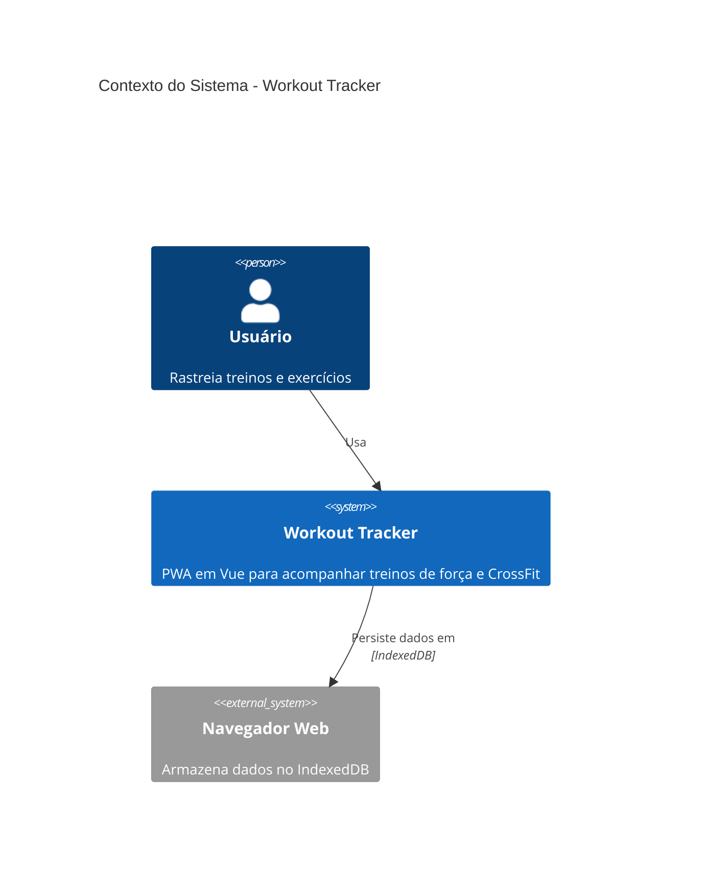
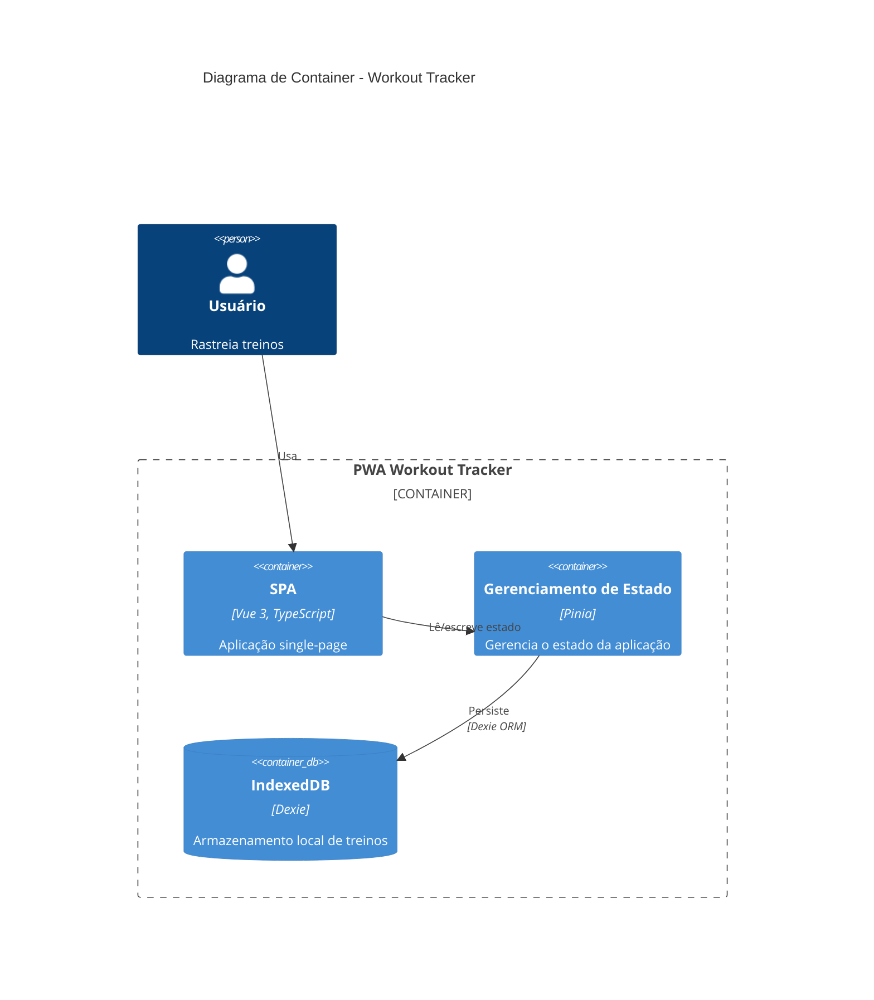
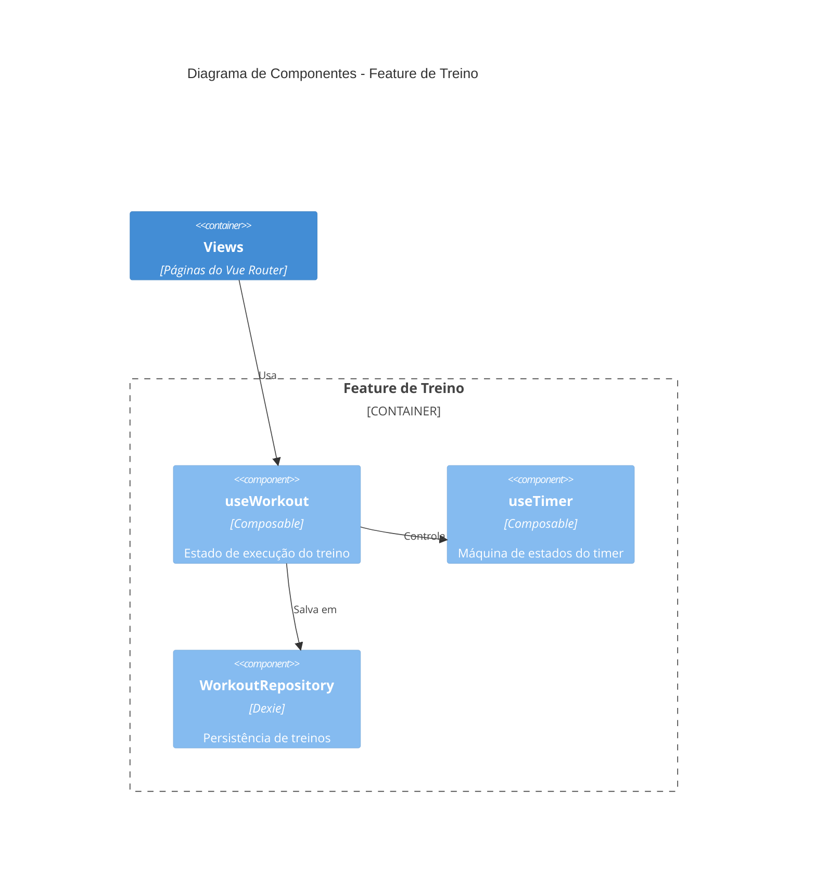
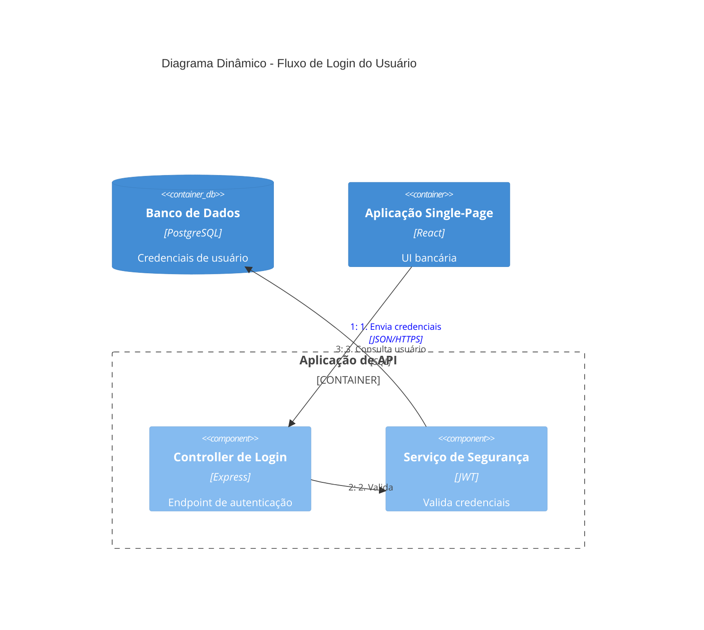
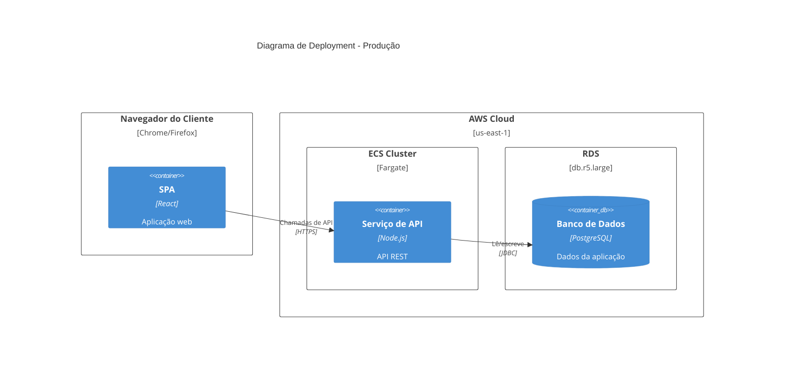
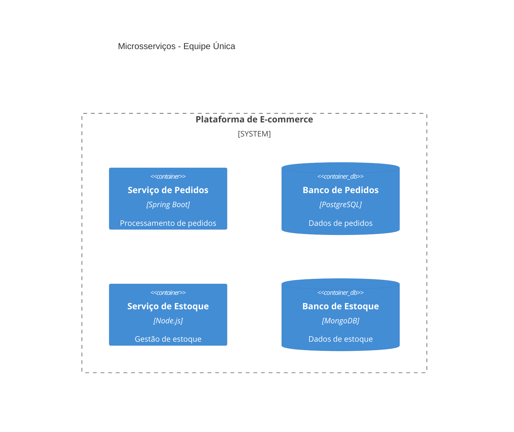
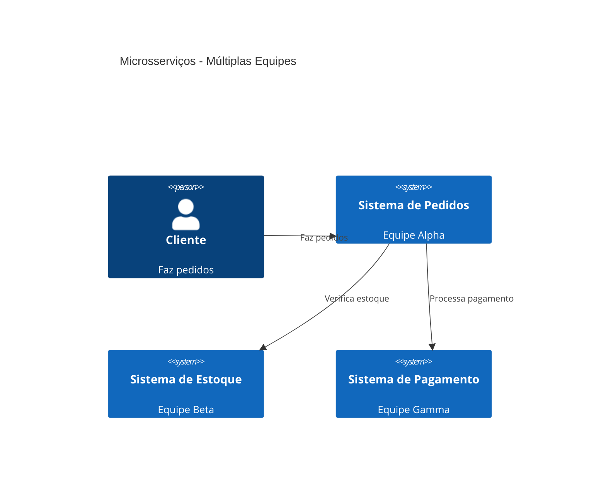
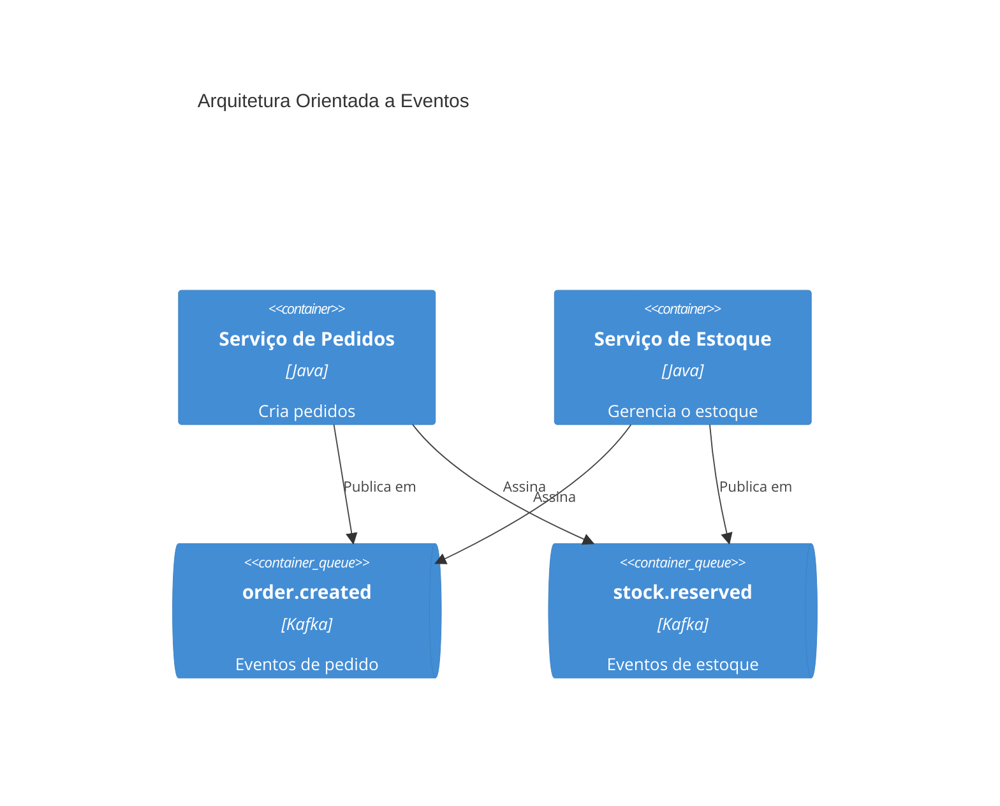

# Documentação de Arquitetura C4

Gera documentação de arquitetura de software usando diagramas do modelo C4 em sintaxe Mermaid.

## Fluxo de trabalho

1. **Entenda o escopo** - Determine quais níveis C4 são necessários com base no público
2. **Analise o codebase** - Explore o sistema para identificar componentes, containers e relacionamentos
3. **Gere os diagramas** - Crie diagramas C4 em Mermaid nos níveis de abstração apropriados
4. **Documente** - Escreva os diagramas em arquivos markdown com contexto explicativo

## Níveis de diagrama C4

Selecione o nível apropriado com base na necessidade de documentação:

| Nível | Tipo de Diagrama | Público | Mostra | Quando Criar |
|-------|-------------|----------|-------|----------------|
| 1 | **C4Context** | Todos | Sistema + atores externos | Sempre (obrigatório) |
| 2 | **C4Container** | Técnicos | Apps, bancos de dados, serviços | Sempre (obrigatório) |
| 3 | **C4Component** | Desenvolvedores | Componentes internos | Apenas se agregar valor |
| 4 | **C4Deployment** | DevOps | Nós de infraestrutura | Para sistemas em produção |
| - | **C4Dynamic** | Técnicos | Fluxos de requisição (numerados) | Para workflows complexos |

**Insight principal:** "Diagramas de Contexto + Container são suficientes para a maioria das equipes de desenvolvimento de software." Só crie diagramas de Componente/Código quando eles agregarem valor de verdade.

## Exemplos rápidos

### Contexto do Sistema (Nível 1)


### Diagrama de Container (Nível 2)


### Diagrama de Componentes (Nível 3)


### Diagrama Dinâmico (Fluxo de Requisição)


### Diagrama de Deployment


## Sintaxe de elementos

### Pessoas e sistemas
```
Person(alias, "Rótulo", "Descrição")
Person_Ext(alias, "Rótulo", "Descrição")       # Pessoa externa
System(alias, "Rótulo", "Descrição")
System_Ext(alias, "Rótulo", "Descrição")       # Sistema externo
SystemDb(alias, "Rótulo", "Descrição")         # Sistema de banco de dados
SystemQueue(alias, "Rótulo", "Descrição")      # Sistema de fila
```

### Containers
```
Container(alias, "Rótulo", "Tecnologia", "Descrição")
Container_Ext(alias, "Rótulo", "Tecnologia", "Descrição")
ContainerDb(alias, "Rótulo", "Tecnologia", "Descrição")
ContainerQueue(alias, "Rótulo", "Tecnologia", "Descrição")
```

### Componentes
```
Component(alias, "Rótulo", "Tecnologia", "Descrição")
Component_Ext(alias, "Rótulo", "Tecnologia", "Descrição")
ComponentDb(alias, "Rótulo", "Tecnologia", "Descrição")
```

### Boundaries
```
Enterprise_Boundary(alias, "Rótulo") { ... }
System_Boundary(alias, "Rótulo") { ... }
Container_Boundary(alias, "Rótulo") { ... }
Boundary(alias, "Rótulo", "tipo") { ... }
```

### Relacionamentos
```
Rel(from, to, "Rótulo")
Rel(from, to, "Rótulo", "Tecnologia")
BiRel(from, to, "Rótulo")                        # Bidirecional
Rel_U(from, to, "Rótulo")                        # Para cima
Rel_D(from, to, "Rótulo")                        # Para baixo
Rel_L(from, to, "Rótulo")                        # Para a esquerda
Rel_R(from, to, "Rótulo")                        # Para a direita
```

### Nós de deployment
```
Deployment_Node(alias, "Rótulo", "Tipo", "Descrição") { ... }
Node(alias, "Rótulo", "Tipo", "Descrição") { ... }  # Forma abreviada
```

## Estilo e layout

### Configuração de layout
```
UpdateLayoutConfig($c4ShapeInRow="3", $c4BoundaryInRow="1")
```
- `$c4ShapeInRow` - Número de formas por linha (padrão: 4)
- `$c4BoundaryInRow` - Número de boundaries por linha (padrão: 2)

### Estilo de elementos
```
UpdateElementStyle(alias, $fontColor="red", $bgColor="grey", $borderColor="red")
```

### Estilo de relacionamentos
```
UpdateRelStyle(from, to, $textColor="blue", $lineColor="blue", $offsetX="5", $offsetY="-10")
```
Use `$offsetX` e `$offsetY` para corrigir rótulos de relacionamento sobrepostos.

## Boas práticas

### Regras essenciais

1. **Todo elemento deve ter**: nome, tipo, tecnologia (quando aplicável) e descrição
2. **Use apenas setas unidirecionais** - Setas bidirecionais criam ambiguidade
3. **Rotule as setas com verbos de ação** - "Envia e-mail usando", "Lê de", não apenas "usa"
4. **Inclua rótulos de tecnologia** - "JSON/HTTPS", "JDBC", "gRPC"
5. **Mantenha menos de 20 elementos por diagrama** - Divida sistemas complexos em vários diagramas

### Diretrizes de clareza

1. **Comece pelo Nível 1** - Diagramas de contexto ajudam a delimitar o escopo do sistema
2. **Um diagrama por arquivo** - Mantenha cada diagrama focado em um único nível de abstração
3. **Aliases significativos** - Use aliases descritivos (por exemplo, `orderService` em vez de `s1`)
4. **Descrições concisas** - Mantenha as descrições com menos de 50 caracteres quando possível
5. **Sempre inclua um título** - "Diagrama de Contexto do Sistema para [Nome do Sistema]"

### O que evitar

Consulte [references/common-mistakes.md](references/common-mistakes.md) para anti-padrões detalhados:
- Confundir containers (deployáveis) com componentes (não deployáveis)
- Modelar bibliotecas compartilhadas como containers
- Representar message brokers como um único container em vez de tópicos individuais
- Adicionar níveis de abstração indefinidos como "subcomponentes"
- Remover rótulos de tipo para "simplificar" os diagramas

## Diretrizes para microsserviços

### Propriedade por uma única equipe
Modele cada microsserviço como um **container** (ou grupo de containers):


### Propriedade por múltiplas equipes
Promova microsserviços a **sistemas de software** quando forem de propriedade de equipes separadas:


### Arquitetura orientada a eventos
Represente tópicos/filas individuais como containers, NÃO uma única caixa "Kafka":


## Local de saída

Escreva a documentação de arquitetura em `docs/architecture/` seguindo a convenção de nomes:
- `c4-context.md` - Diagrama de contexto do sistema
- `c4-containers.md` - Diagrama de container
- `c4-components-{feature}.md` - Diagramas de componente por feature
- `c4-deployment.md` - Diagrama de deployment
- `c4-dynamic-{flow}.md` - Diagramas dinâmicos para fluxos específicos

## Nível de detalhe por público

| Público | Diagramas Recomendados |
|----------|---------------------|
| Executivos | Apenas Contexto do Sistema |
| Product Managers | Contexto + Container |
| Arquitetos | Contexto + Container + Componentes-chave |
| Desenvolvedores | Todos os níveis conforme necessário |
| DevOps | Container + Deployment |

## Referências

- [references/c4-syntax.md](references/c4-syntax.md) - Sintaxe completa do C4 em Mermaid
- [references/common-mistakes.md](references/common-mistakes.md) - Anti-padrões a evitar
- [references/advanced-patterns.md](references/advanced-patterns.md) - Microsserviços, orientação a eventos, deployment
