# Padrões Avançados de Arquitetura C4

Este guia cobre padrões avançados para documentar arquiteturas complexas, incluindo microsserviços, sistemas orientados a eventos, deployments e documentação de APIs.

## Arquitetura de Microsserviços

### Propriedade por Time Único

Quando um único time é dono de todos os microsserviços, modele-os como **containers** dentro de um único sistema:

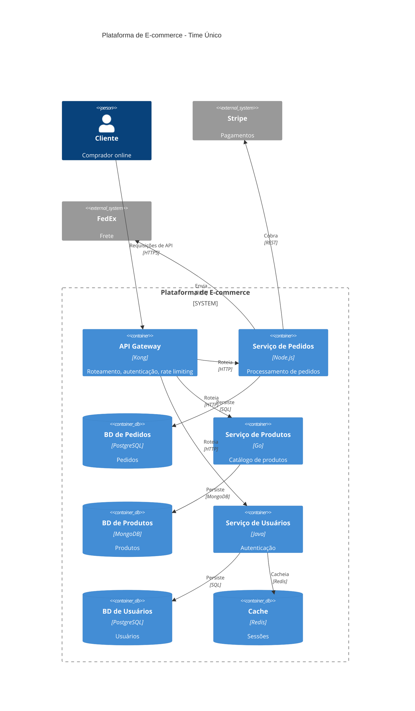

### Propriedade por Múltiplos Times

Quando times distintos são donos dos microsserviços, **promova cada um a um sistema de software**:

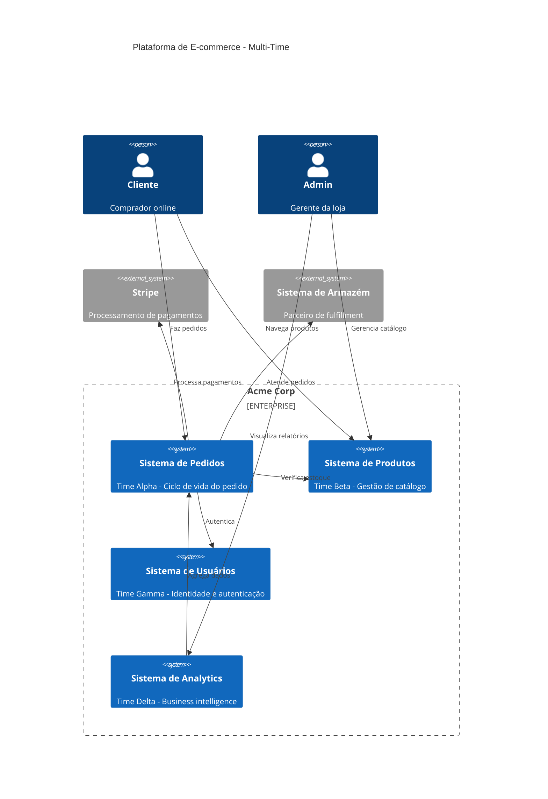

Cada time então cria o próprio diagrama de Container:

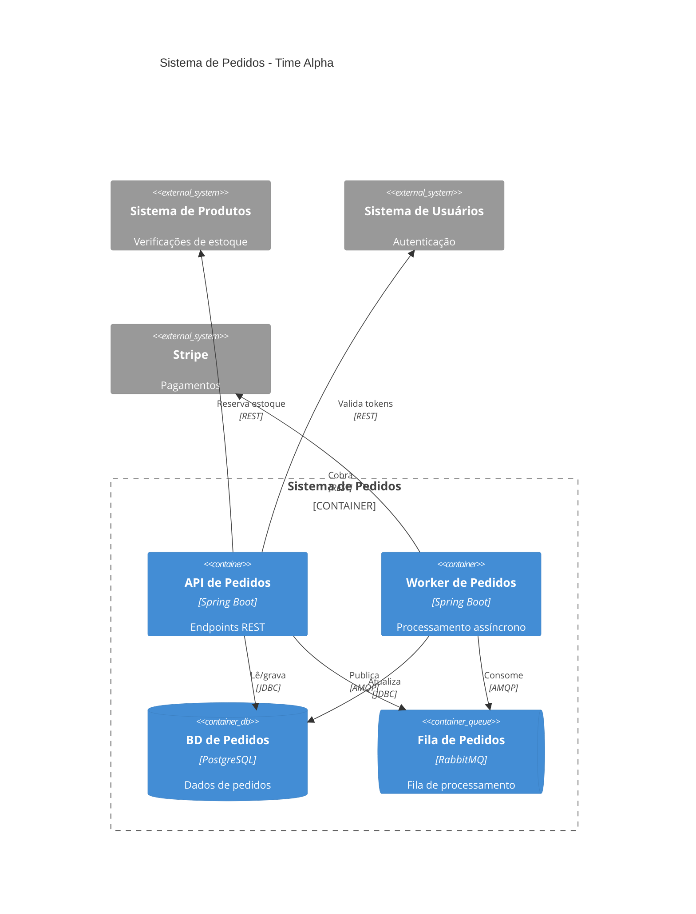

## Arquitetura Orientada a Eventos

### Exibindo Tópicos Individuais

Sempre modele tópicos/filas de mensagens como containers separados:

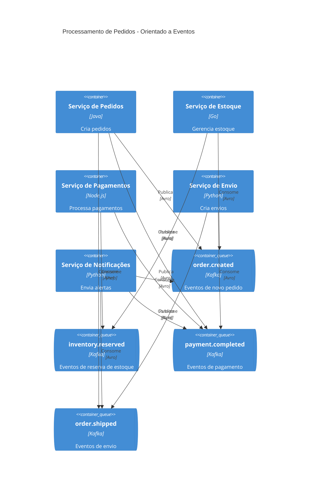

### Fluxo de Eventos com Diagrama Dinâmico

Use diagramas dinâmicos para mostrar a sequência de eventos:

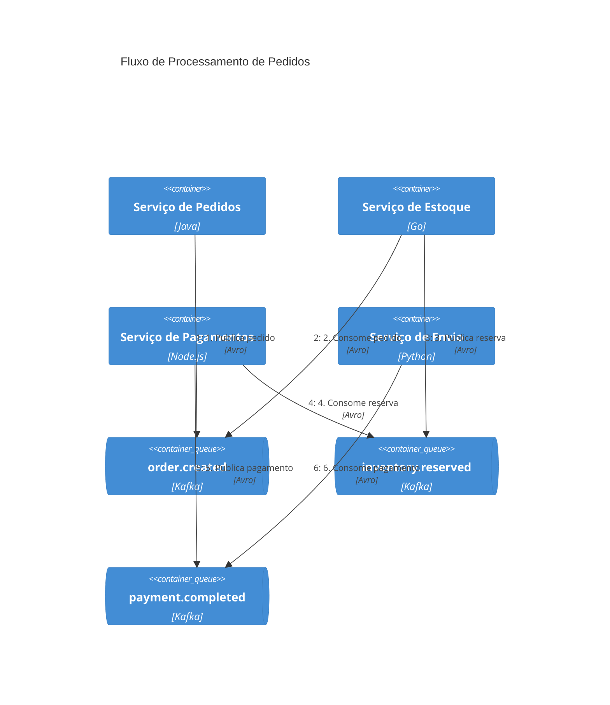

### Padrão CQRS

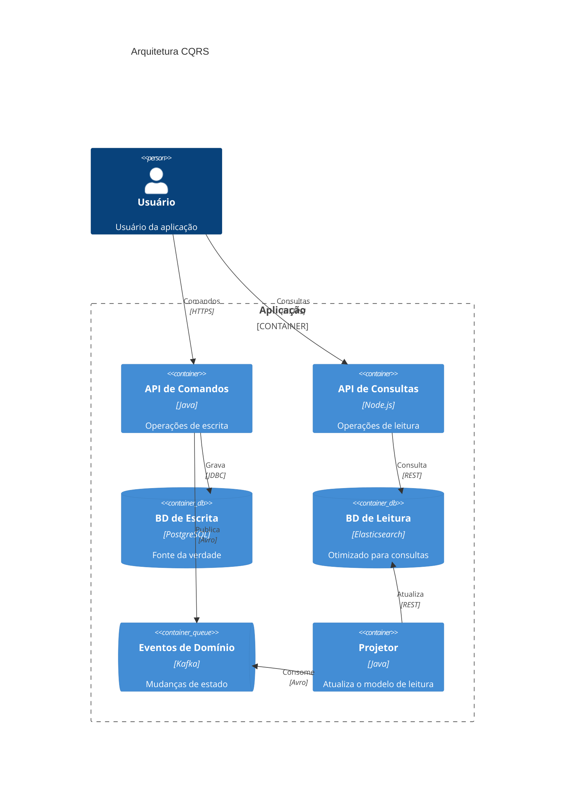

## Padrões de Deployment

### Deployment de Produção na AWS

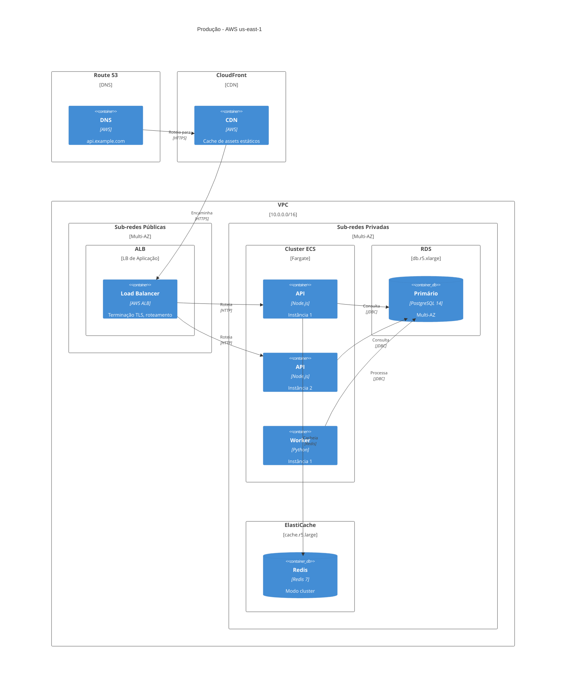

### Deployment em Kubernetes

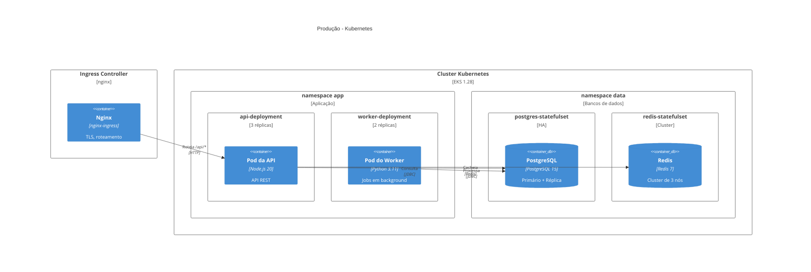

### Deployment Multi-Região

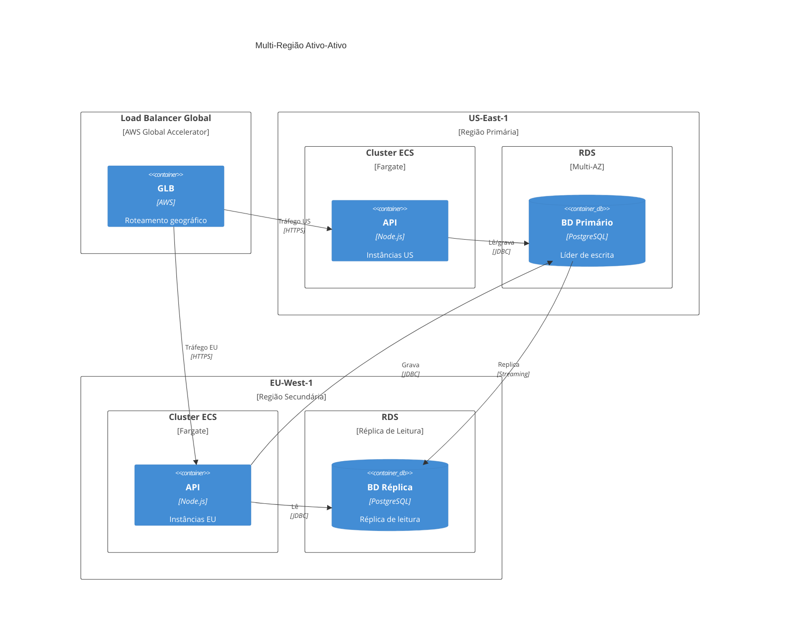

## Padrões de Documentação de API

### Padrão de API Gateway

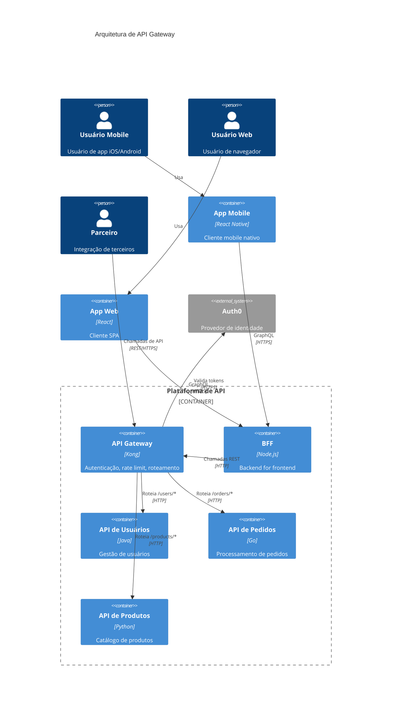

### Detalhe de Componentes da API

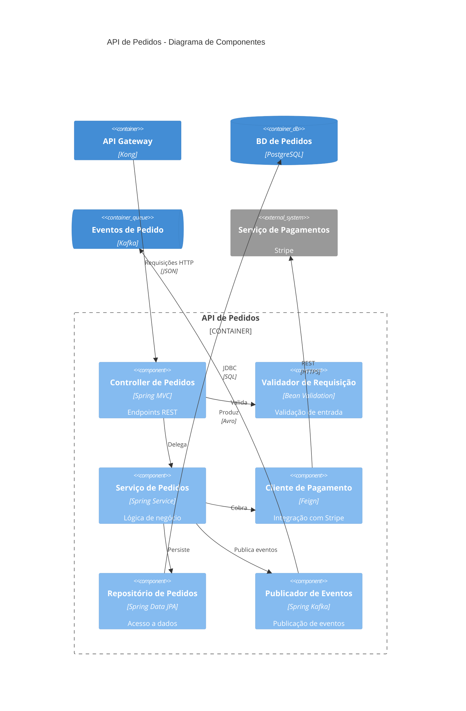

## Padrões de Diagramas Complementares

### Fluxo de Autenticação (Dinâmico)

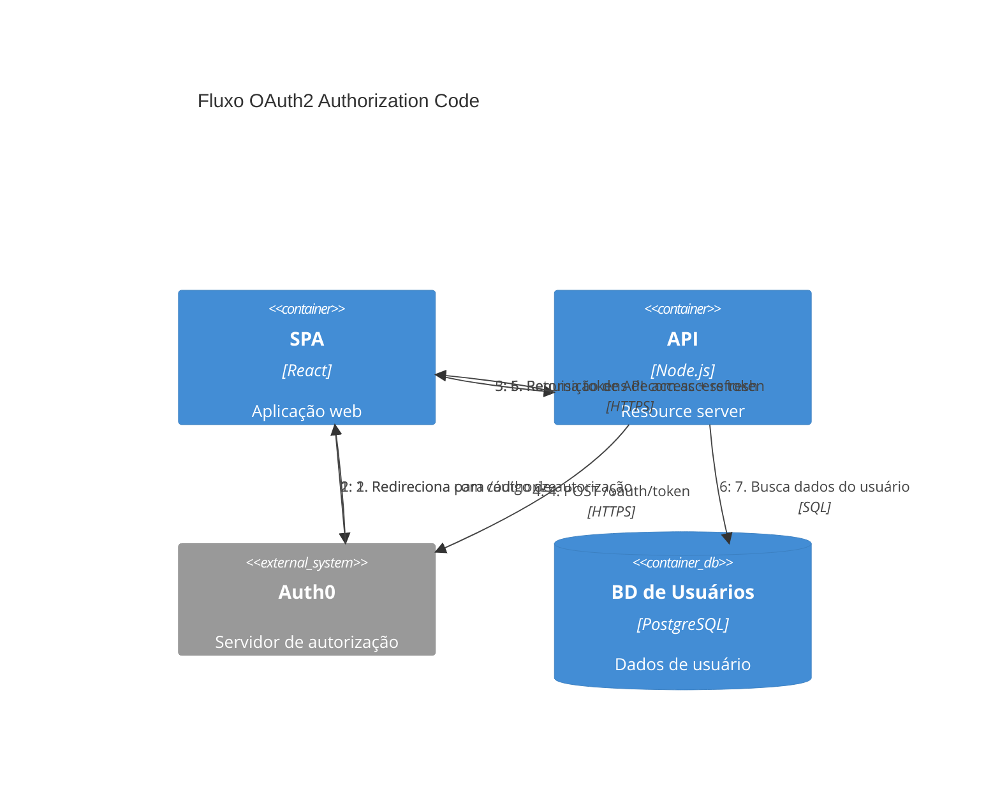

### Fluxo de Tratamento de Erros

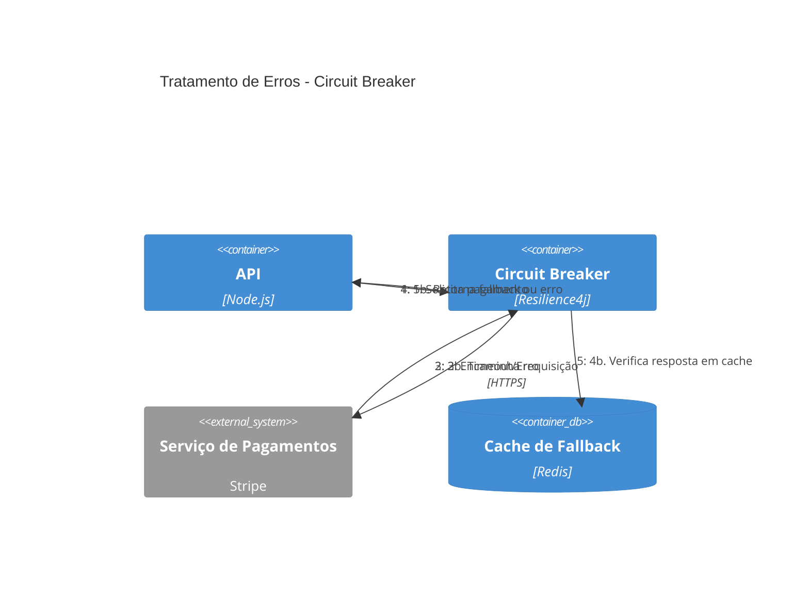

## Integração com Architecture Decision Records

Vincule diagramas C4 a Architecture Decision Records (ADRs):

### Referência a ADR nos Diagramas

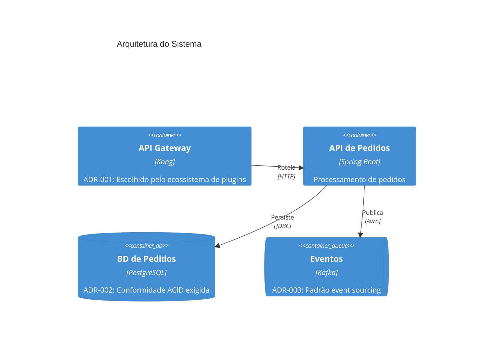

### Estrutura de Diretórios

Organize os diagramas C4 junto com os ADRs:

```text
docs/
├── architecture/
│   ├── c4-context.md
│   ├── c4-containers.md
│   ├── c4-components-order-api.md
│   ├── c4-deployment-production.md
│   └── c4-dynamic-auth-flow.md
└── decisions/
    ├── 001-api-gateway-selection.md
    ├── 002-database-selection.md
    ├── 003-event-driven-architecture.md
    └── template.md
```

## Diagrama de Panorama de Sistemas

Para visões em nível corporativo que exibem múltiplos sistemas:

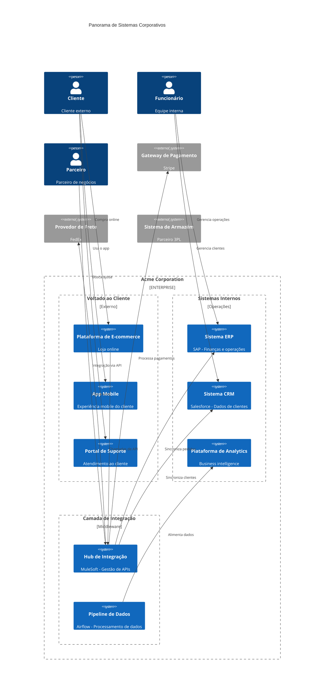

## Resumo de Boas Práticas

1. **Escolha a abstração com base na propriedade**: Time único = containers, Múltiplos times = sistemas
2. **Mostre tópicos de mensagem individuais**: Não use uma única caixa "Kafka" ou "RabbitMQ"
3. **Use diagramas de deployment para infraestrutura**: Mantenha os diagramas de container no plano lógico
4. **Crie diagramas dinâmicos para fluxos complexos**: Autenticação, pagamento, tratamento de erros
5. **Vincule aos ADRs**: Documente por que as decisões foram tomadas
6. **Use o panorama de sistemas para visões corporativas**: Mostre todos os sistemas e suas relações
7. **Mantenha os diagramas focados**: Uma preocupação por diagrama, divida quando ficar complexo
