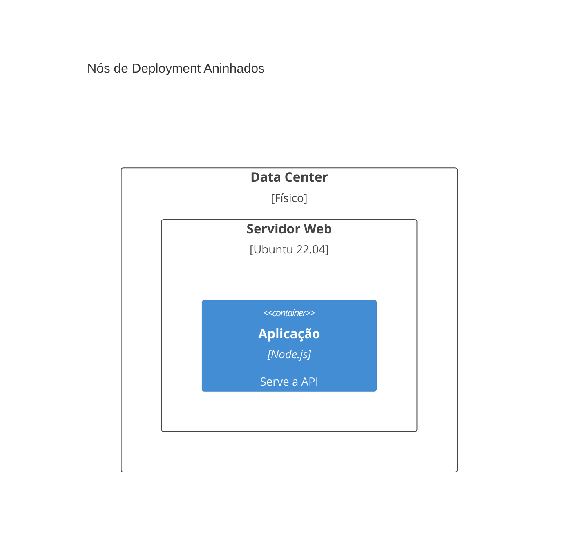
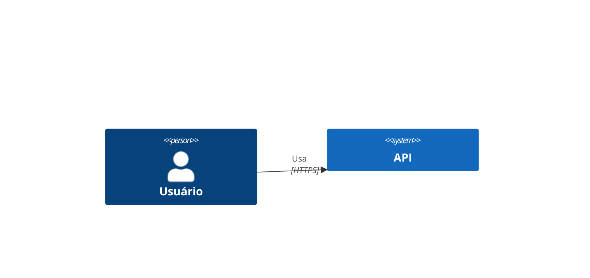
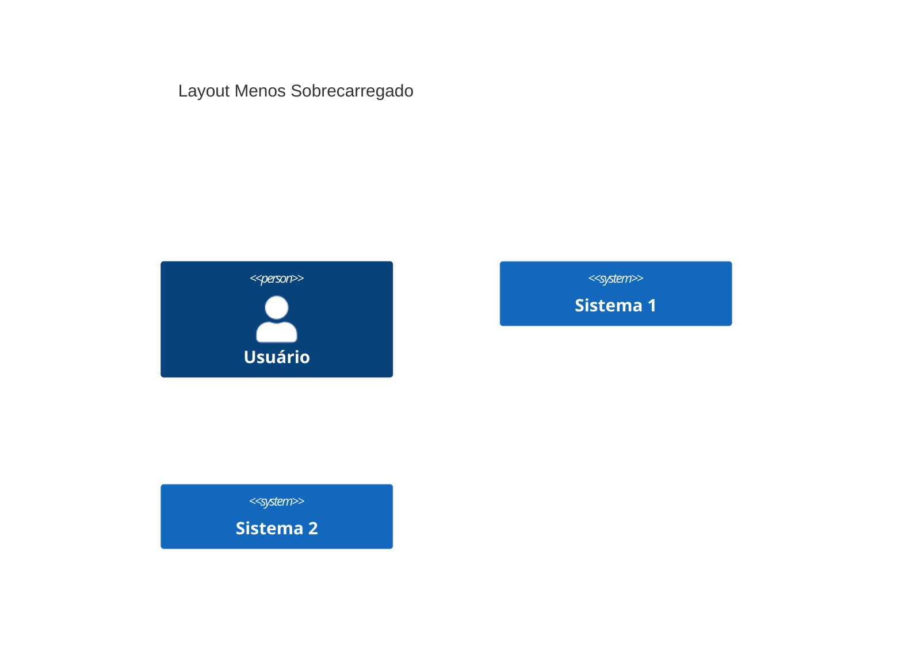
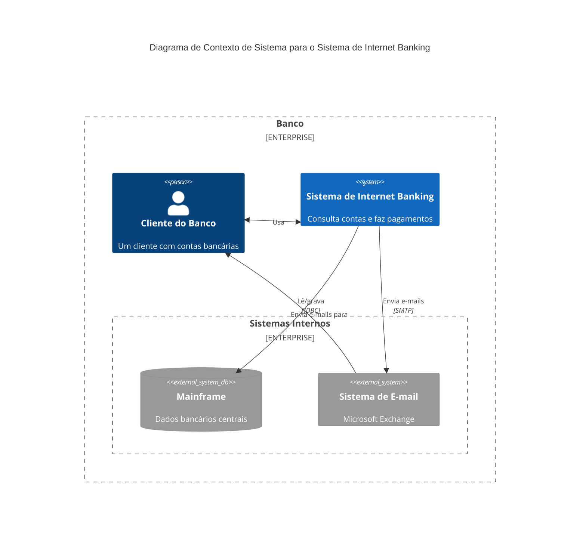
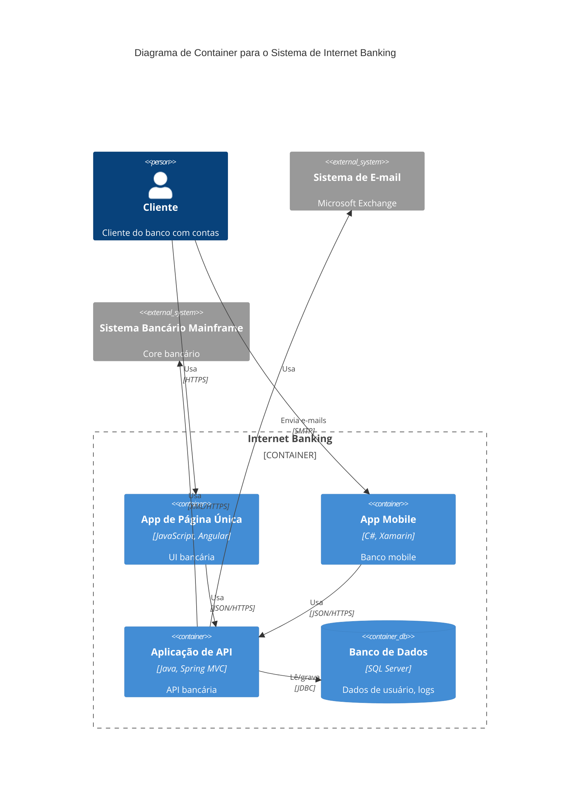
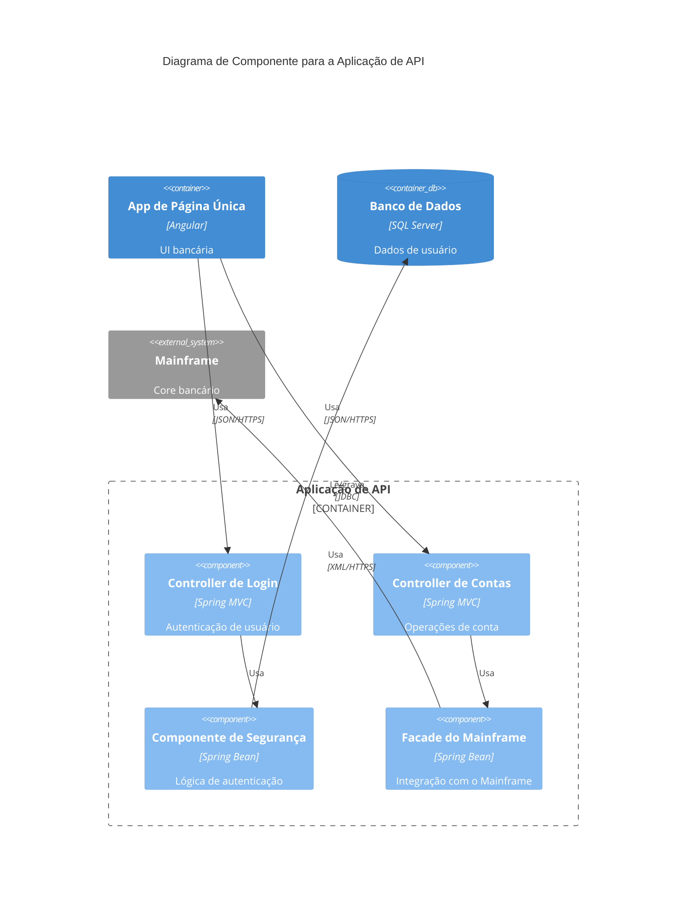
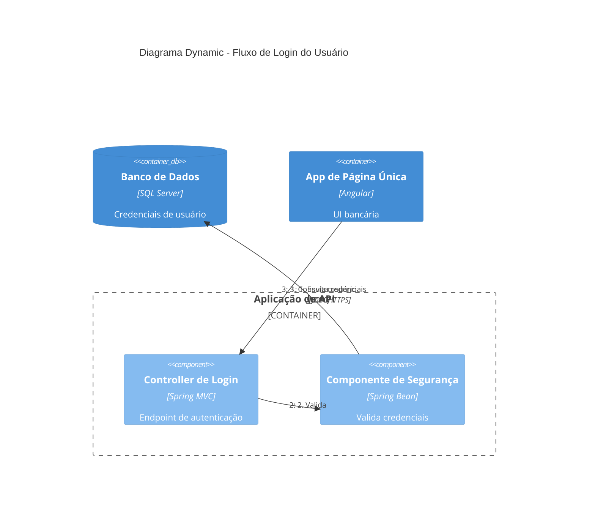
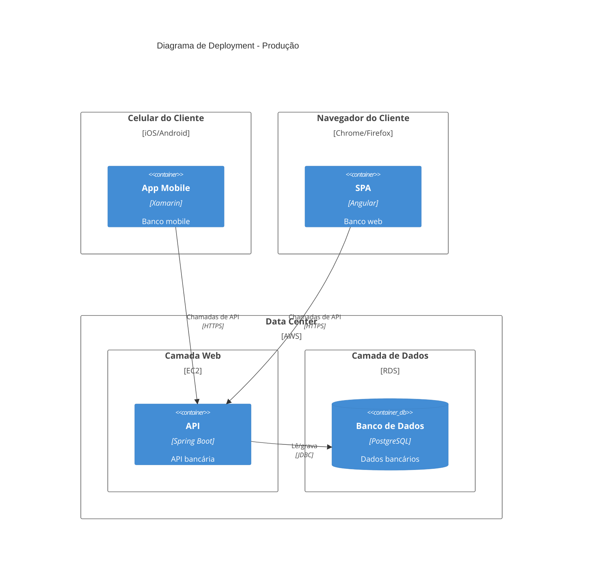
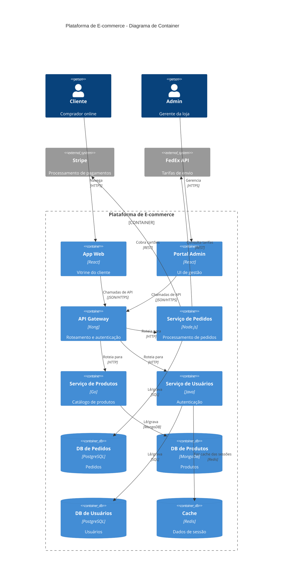
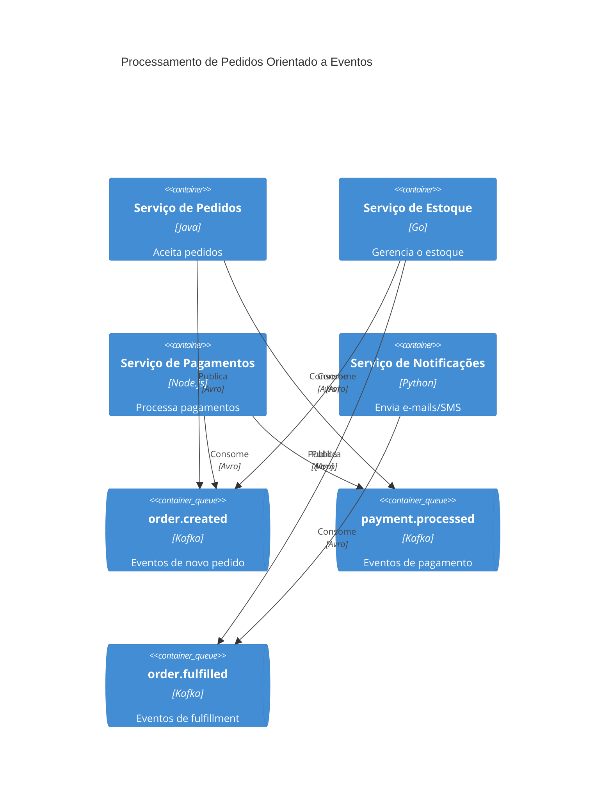

# Referência de Sintaxe de Diagramas C4 em Mermaid

Referência completa de sintaxe para diagramas C4 em Mermaid. Compatível com a sintaxe C4 do PlantUML.

## Índice

1. [Tipos de Diagrama](#tipos-de-diagrama)
2. [Elementos de Contexto de Sistema](#elementos-de-contexto-de-sistema)
3. [Elementos de Container](#elementos-de-container)
4. [Elementos de Componente](#elementos-de-componente)
5. [Elementos de Deployment](#elementos-de-deployment)
6. [Tipos de Relacionamento](#tipos-de-relacionamento)
7. [Boundaries](#boundaries)
8. [Estilização](#estilização)
9. [Configuração de Layout](#configuração-de-layout)
10. [Sintaxe de Parâmetros](#sintaxe-de-parâmetros)
11. [Exemplos Completos](#exemplos-completos)
12. [Limitações do Mermaid](#limitações-do-mermaid)

## Tipos de Diagrama

Inicie cada diagrama com a declaração de tipo apropriada:

| Tipo | Declaração | Propósito |
|------|-------------|---------|
| Contexto de Sistema | `C4Context` | Mostra o sistema em contexto com usuários e sistemas externos |
| Container | `C4Container` | Mostra os blocos técnicos de alto nível |
| Componente | `C4Component` | Mostra os componentes internos de um container |
| Dynamic | `C4Dynamic` | Mostra fluxos de requisição com sequência numerada |
| Deployment | `C4Deployment` | Mostra a infraestrutura e os nós de deployment |

## Elementos de Contexto de Sistema

### Person
```
Person(alias, label, ?descr)
Person_Ext(alias, label, ?descr)    # Pessoa externa
```

### System
```
System(alias, label, ?descr)
System_Ext(alias, label, ?descr)    # Sistema externo
SystemDb(alias, label, ?descr)      # Sistema de banco de dados
SystemDb_Ext(alias, label, ?descr)  # Banco de dados externo
SystemQueue(alias, label, ?descr)   # Fila de mensagens
SystemQueue_Ext(alias, label, ?descr)
```

## Elementos de Container

### Container
```
Container(alias, label, ?techn, ?descr)
Container_Ext(alias, label, ?techn, ?descr)
ContainerDb(alias, label, ?techn, ?descr)
ContainerDb_Ext(alias, label, ?techn, ?descr)
ContainerQueue(alias, label, ?techn, ?descr)
ContainerQueue_Ext(alias, label, ?techn, ?descr)
```

## Elementos de Componente

### Component
```
Component(alias, label, ?techn, ?descr)
Component_Ext(alias, label, ?techn, ?descr)
ComponentDb(alias, label, ?techn, ?descr)
ComponentDb_Ext(alias, label, ?techn, ?descr)
ComponentQueue(alias, label, ?techn, ?descr)
ComponentQueue_Ext(alias, label, ?techn, ?descr)
```

## Elementos de Deployment

### Deployment Node
```
Deployment_Node(alias, label, ?type, ?descr) { ... }
Node(alias, label, ?type, ?descr) { ... }      # Forma abreviada
Node_L(alias, label, ?type, ?descr) { ... }    # Alinhado à esquerda
Node_R(alias, label, ?type, ?descr) { ... }    # Alinhado à direita
```

Nós de deployment podem ser aninhados:


## Tipos de Relacionamento

### Relacionamentos Básicos
```
Rel(from, to, label)
Rel(from, to, label, ?techn)
Rel(from, to, label, ?techn, ?descr)
```

### Bidirecional
```
BiRel(from, to, label)
BiRel(from, to, label, ?techn)
```

### Dicas Direcionais
```
Rel_U(from, to, label)    # Para cima
Rel_Up(from, to, label)   # Para cima (alias)
Rel_D(from, to, label)    # Para baixo
Rel_Down(from, to, label) # Para baixo (alias)
Rel_L(from, to, label)    # Para a esquerda
Rel_Left(from, to, label) # Para a esquerda (alias)
Rel_R(from, to, label)    # Para a direita
Rel_Right(from, to, label)# Para a direita (alias)
Rel_Back(from, to, label) # Direção reversa
```

### Relacionamentos em Diagramas Dynamic
```
RelIndex(index, from, to, label)
```
Nota: o parâmetro Index é ignorado; a sequência é determinada pela ordem das instruções.

## Boundaries

### Enterprise Boundary
```
Enterprise_Boundary(alias, label) {
  # Sistemas e pessoas vão aqui
}
```

### System Boundary
```
System_Boundary(alias, label) {
  # Containers vão aqui
}
```

### Container Boundary
```
Container_Boundary(alias, label) {
  # Componentes vão aqui
}
```

### Generic Boundary
```
Boundary(alias, label, ?type) {
  # Elementos vão aqui
}
```

## Estilização

### Update Element Style
```
UpdateElementStyle(elementAlias, $bgColor, $fontColor, $borderColor, $shadowing, $shape)
```

Parâmetros disponíveis (todos opcionais, use a sintaxe `$name=value`):
- `$bgColor` - Cor de fundo
- `$fontColor` - Cor do texto
- `$borderColor` - Cor da borda
- `$shadowing` - Ativa/desativa a sombra
- `$shape` - Forma do elemento

### Update Relationship Style
```
UpdateRelStyle(from, to, $textColor, $lineColor, $offsetX, $offsetY)
```

Parâmetros disponíveis:
- `$textColor` - Cor do texto do rótulo
- `$lineColor` - Cor da linha
- `$offsetX` - Deslocamento horizontal do rótulo (pixels)
- `$offsetY` - Deslocamento vertical do rótulo (pixels)

**Dica:** use `$offsetX` e `$offsetY` para corrigir rótulos de relacionamento sobrepostos:


## Configuração de Layout

```
UpdateLayoutConfig($c4ShapeInRow, $c4BoundaryInRow)
```

- `$c4ShapeInRow` - Número de formas por linha (padrão: 4)
- `$c4BoundaryInRow` - Número de boundaries por linha (padrão: 2)

**Exemplo - Reduzir aglomeração:**


## Sintaxe de Parâmetros

Duas formas de passar parâmetros opcionais:

### Posicional (em ordem)
```
Rel(customerA, bankA, "Usa", "HTTPS")
UpdateRelStyle(customerA, bankA, "red", "blue", "-40", "60")
```

### Nomeado (com prefixo $, em qualquer ordem)
```
UpdateRelStyle(customerA, bankA, $offsetX="-40", $offsetY="60", $lineColor="blue")
```

## Exemplos Completos

### Exemplo C4Context


### Exemplo C4Container


### Exemplo C4Component


### Exemplo C4Dynamic


### Exemplo C4Deployment


### Exemplo de Microsserviços de E-commerce


### Exemplo de Arquitetura Orientada a Eventos


### Exemplo de Deployment na AWS
```mermaid
C4Deployment
  title Deployment de Produção - AWS

  Deployment_Node(cdn, "CloudFront", "CDN") {
    Container(static, "Assets Estáticos", "S3", "HTML/CSS/JS")
  }

  Deployment_Node(vpc, "VPC", "10.0.0.0/16") {
    Deployment_Node(publicSubnet, "Subnet Pública", "10.0.1.0/24") {
      Deployment_Node(alb, "Application Load Balancer", "ALB") {
        Container(lb, "Load Balancer", "AWS ALB", "Roteia o tráfego")
      }
    }

    Deployment_Node(privateSubnet, "Subnet Privada", "10.0.2.0/24") {
      Deployment_Node(ecs, "Cluster ECS", "Fargate") {
        Container(api1, "Instância de API 1", "Node.js", "API REST")
        Container(api2, "Instância de API 2", "Node.js", "API REST")
      }

      Deployment_Node(rds, "RDS", "Multi-AZ") {
        ContainerDb(primary, "DB Primário", "PostgreSQL", "Banco de dados principal")
        ContainerDb(replica, "Réplica de Leitura", "PostgreSQL", "Escala de leitura")
      }
    }
  }

  Rel(cdn, alb, "Encaminha requisições", "HTTPS")
  Rel(lb, api1, "Roteia para", "HTTP")
  Rel(lb, api2, "Roteia para", "HTTP")
  Rel(api1, primary, "Grava em", "JDBC")
  Rel(api2, replica, "Lê de", "JDBC")
```

## Limitações do Mermaid

Os seguintes recursos do C4 do PlantUML ainda não são suportados no Mermaid:

### Recursos Não Suportados
- `sprite` - Ícones customizados
- `tags` - Marcação de elementos
- `link` - Links clicáveis
- `Legend` - Legendas geradas automaticamente
- `AddElementTag` / `AddRelTag` - Estilização por tag
- `RoundedBoxShape` / `EightSidedShape` - Formas customizadas
- `DashedLine` / `DottedLine` / `BoldLine` - Estilos de linha
- Diretivas de layout (`Lay_U`, `Lay_D`, `Lay_L`, `Lay_R`)

### Soluções Alternativas

**Controle de layout:**
Use `UpdateLayoutConfig` para controlar o posicionamento das formas em vez de diretivas de layout.

**Rótulos sobrepostos:**
Use `UpdateRelStyle` com `$offsetX` e `$offsetY` para mover os rótulos de relacionamento.

**Diagramas complexos:**
Mantenha os diagramas com menos de 15 elementos. Divida arquiteturas complexas em múltiplos diagramas focados.

**Ordenação de elementos:**
Os elementos aparecem na ordem em que são definidos. Reordene as instruções para ajustar o layout.

### Ferramentas Alternativas

Para recursos que o Mermaid não suporta, considere:
- **Structurizr DSL** - suporte C4 completo com geração baseada em modelo
- **C4-PlantUML** - implementação de C4 mais madura
- **IcePanel** - editor visual de diagramas C4
