# Erros Comuns do Modelo C4 a Evitar

Este guia documenta anti-padrões e erros frequentes ao criar diagramas de arquitetura C4, com exemplos do que fazer no lugar.

## Erros de Nível de Abstração

### 1. Confundir Containers e Components

**O problema:**
Containers são **unidades implantáveis** (aplicações, serviços, bancos de dados). Components são **elementos não implantáveis dentro de um container** (módulos, classes, pacotes).

**Errado - classe Java mostrada como container:**
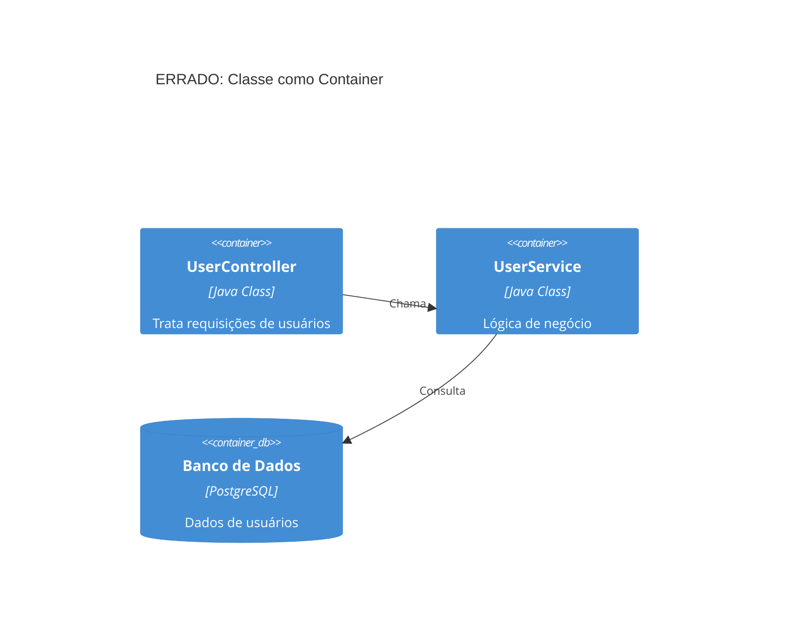

**Correto - classes como components dentro de um container:**
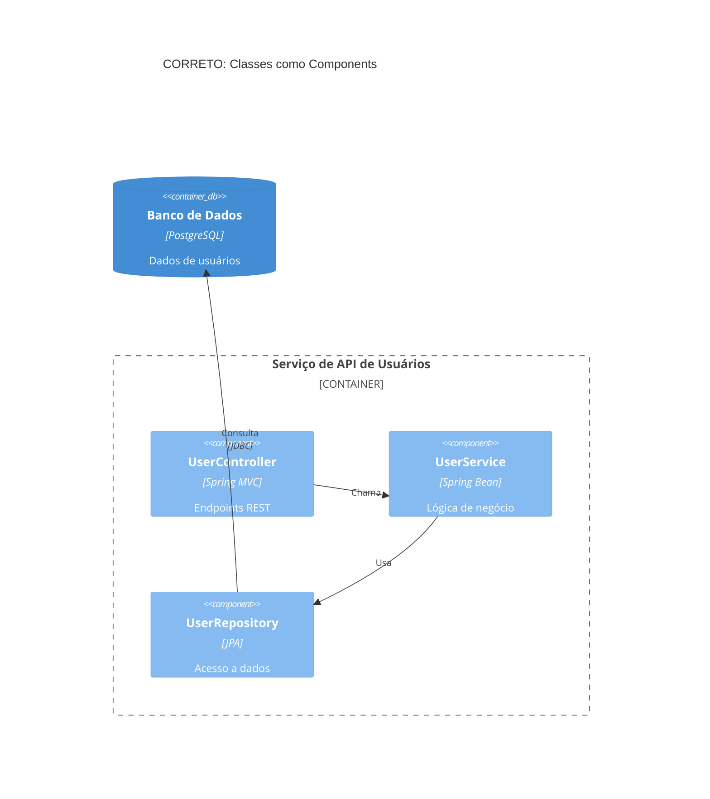

### 2. Adicionar Níveis de Abstração Indefinidos

**O problema:**
O C4 define exatamente quatro níveis. Não invente "subcomponentes", "módulos" ou outros níveis arbitrários.

**Errado:**
- Nível 3.5: "Subcomponentes"
- Nível 2.5: "Grupos de microsserviços"
- Níveis personalizados como "pacotes" ou "módulos"

**Correto:**
Atenha-se a Person, Software System, Container, Component. Se precisar de mais detalhe, você está no Nível 4 (Code), que deve usar diagramas de classe UML.

### 3. Subsistemas Vagos

**O problema:**
"Subsistema" é ambíguo. É um sistema, container ou component?

**Errado:**
```text
Subsystem(orders, "Subsistema de Pedidos", "Trata pedidos")
```

**Correto - seja específico:**
```text
System(orderSystem, "Sistema de Pedidos", "Trata o ciclo de vida dos pedidos")
# OU
Container(orderService, "Serviço de Pedidos", "Java", "API de processamento de pedidos")
# OU
Component(orderProcessor, "Processador de Pedidos", "Spring Bean", "Lógica de negócio de pedidos")
```

## Erro de Bibliotecas Compartilhadas

**O problema:**
Modelar uma biblioteca compartilhada como container dá a entender que ela é um serviço executado de forma independente. Bibliotecas são copiadas para dentro das aplicações, não implantadas separadamente.

**Errado - biblioteca como container separado:**
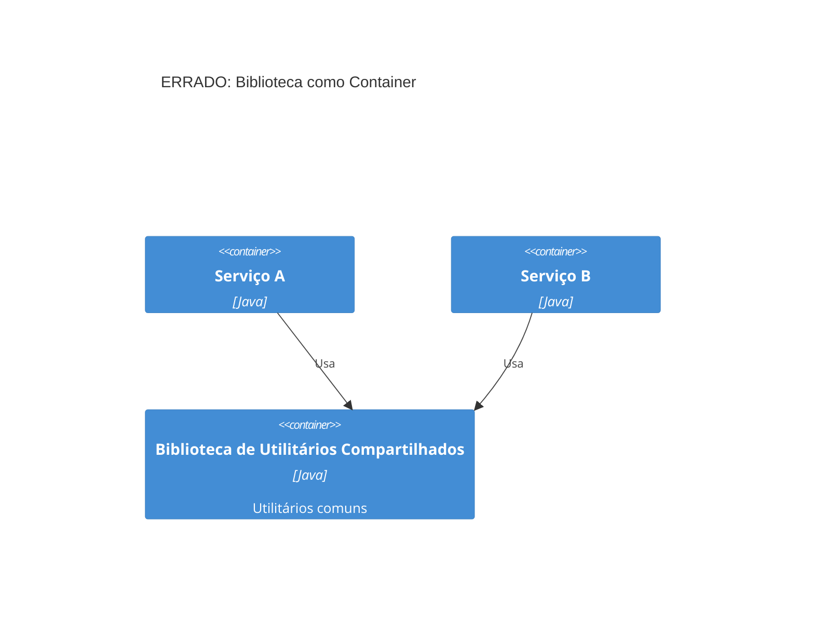

**Correto - mostre a biblioteca dentro de cada serviço:**
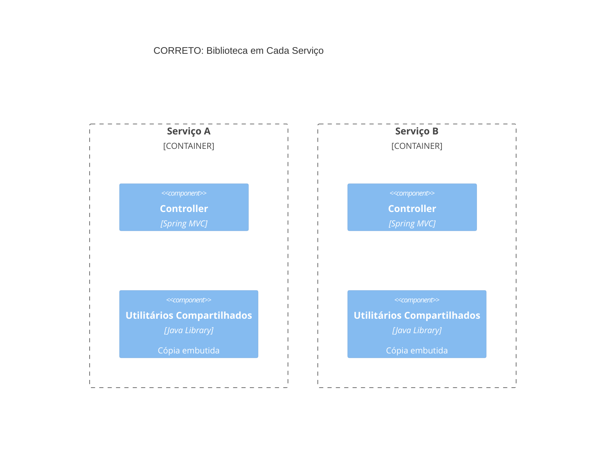

Ou simplesmente omita a biblioteca dos diagramas de arquitetura, já que é um detalhe de implementação.

## Erros de Message Broker

### Anti-Padrão de Barramento de Mensagens Único

**O problema:**
Mostrar Kafka/RabbitMQ como um único container cria um diagrama enganoso de "hub and spoke" que esconde os fluxos de dados reais.

**Errado - barramento de mensagens central:**
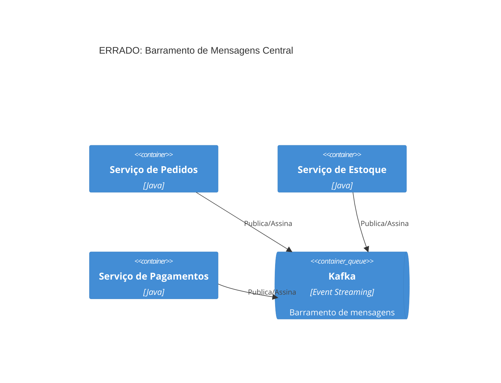

**Correto - tópicos individuais:**
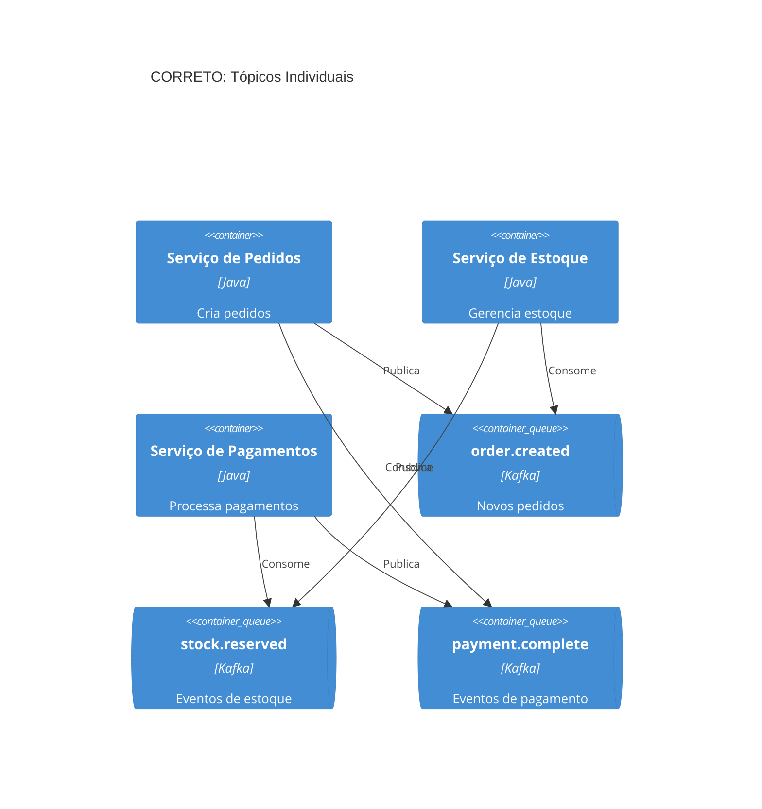

**Alternativa - tópicos nos rótulos dos relacionamentos:**
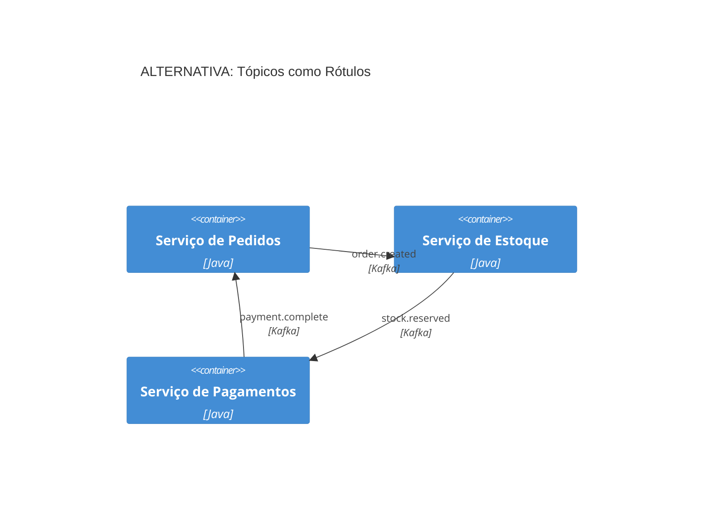

## Erros de Sistemas Externos

### Mostrar Detalhes Internos de Sistemas Externos

**O problema:**
Você não controla sistemas externos. Mostrar seus internos cria acoplamento e fica desatualizado rapidamente.

**Errado - detalhes internos do sistema externo:**
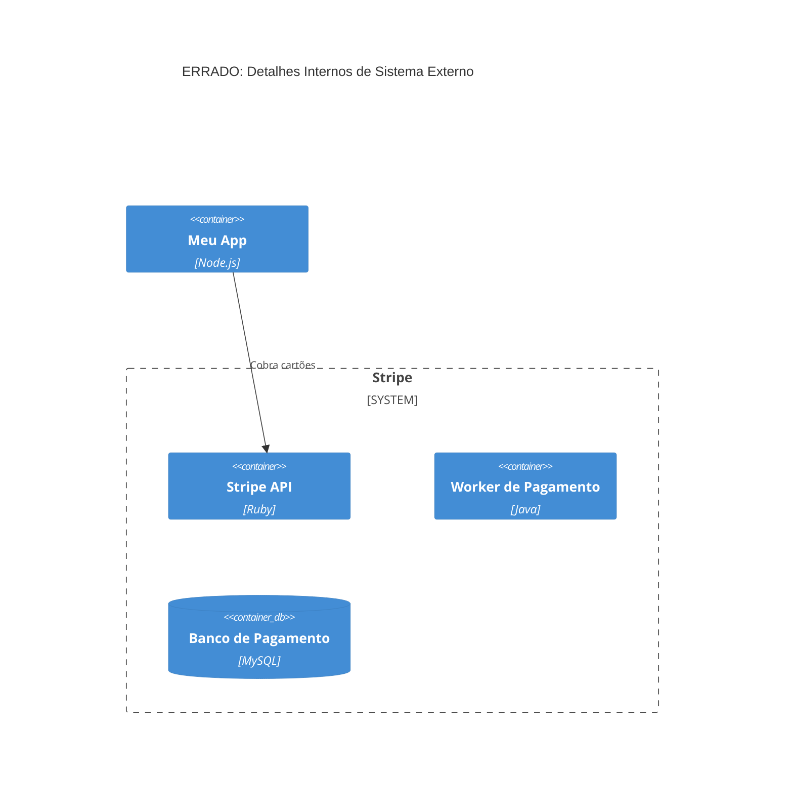

**Correto - sistema externo como caixa-preta:**
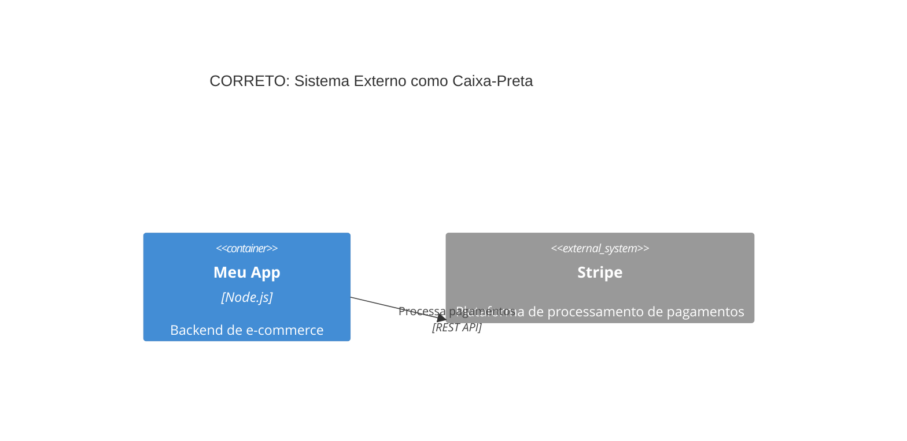

## Erros de Metadados e Documentação

### 1. Remover Rótulos de Tipo

**O problema:**
Remover os rótulos de tipo dos elementos (Container, Component, System) para "simplificar" diagramas cria ambiguidade.

**Errado:**
```text
Box(api, "API")  # O que é isto? System? Container? Component?
```

**Correto:**
```text
Container(api, "Aplicação de API", "Spring Boot", "Backend de API REST")
```

### 2. Descrições Ausentes

**O problema:**
Elementos sem descrição forçam quem vê a adivinhar seu propósito.

**Errado:**
```text
Container(svc, "Serviço", "Java")
```

**Correto:**
```text
Container(orderSvc, "Serviço de Pedidos", "Spring Boot", "Gerencia o ciclo de vida e o fulfillment dos pedidos")
```

### 3. Rótulos de Relacionamento Genéricos

**O problema:**
Rótulos como "usa" ou "se comunica com" não explicam quais dados fluem nem por quê.

**Errado:**
```text
Rel(frontend, api, "Usa")
Rel(api, db, "Acessa")
```

**Correto:**
```text
Rel(frontend, api, "Busca produtos, envia pedidos", "JSON/HTTPS")
Rel(api, db, "Lê/grava dados de pedidos", "JDBC")
```

## Erros de Escopo de Diagrama

### 1. Não Adaptar ao Público

**O problema:**
Mostrar diagramas de código de Nível 4 para executivos, ou apenas o Nível 1 para desenvolvedores que precisam de detalhes de implementação.

| Público | Níveis Apropriados |
|----------|-------------------|
| Executivos | Apenas Nível 1 (Context) |
| Product Managers | Níveis 1-2 |
| Arquitetos | Níveis 1-3 |
| Desenvolvedores | Todos os níveis conforme necessário |
| DevOps | Nível 2 + Deployment |

### 2. Criar os Quatro Níveis por Padrão

**O problema:**
Nem todo sistema precisa dos quatro níveis. O Nível 3 (Component) e o Nível 4 (Code) muitas vezes não agregam valor.

**Orientação:**
- **Sempre crie:** Context (L1) e Container (L2)
- **Crie se agregar valor:** Component (L3) para containers complexos
- **Raramente crie:** Code (L4) - deixe as IDEs gerarem esses

### 3. Elementos Demais por Diagrama

**O problema:**
Diagramas com mais de 20 elementos ficam ilegíveis.

**Conselho de Simon Brown:** "Se um diagrama com uma dúzia de caixas é difícil de entender, não desenhe um diagrama com uma dúzia de caixas!"

**Soluções:**
- Divida por bounded context ou domínio
- Crie diagramas separados por serviço
- Mostre um serviço + suas dependências diretas
- Use vários diagramas focados em vez de um único diagrama abrangente

## Erros de Setas

### 1. Setas Bidirecionais

**O problema:**
Setas bidirecionais são ambíguas. Quem inicia a chamada? O que flui em cada direção?

**Errado:**
```text
BiRel(frontend, api, "Dados")  # Direção ambígua
```

**Correto:**
```text
Rel(frontend, api, "Solicita produtos", "JSON/HTTPS")
Rel(api, frontend, "Retorna dados de produtos", "JSON/HTTPS")
```

Ou mostre a perspectiva de quem inicia:
```text
Rel(frontend, api, "Busca produtos", "JSON/HTTPS")
```

### 2. Setas Sem Rótulo

**O problema:**
Setas sem rótulo forçam quem lê a adivinhar o que flui entre os elementos.

**Errado:**
```text
Rel(orderSvc, paymentSvc)
```

**Correto:**
```text
Rel(orderSvc, paymentSvc, "Solicita autorização de pagamento", "gRPC")
```

## Erros de Diagrama de Deployment

### 1. Detalhes de Deployment em Diagramas de Container

**O problema:**
Diagramas de container devem mostrar a arquitetura lógica, não detalhes de infraestrutura.

**Errado - infraestrutura no diagrama de container:**
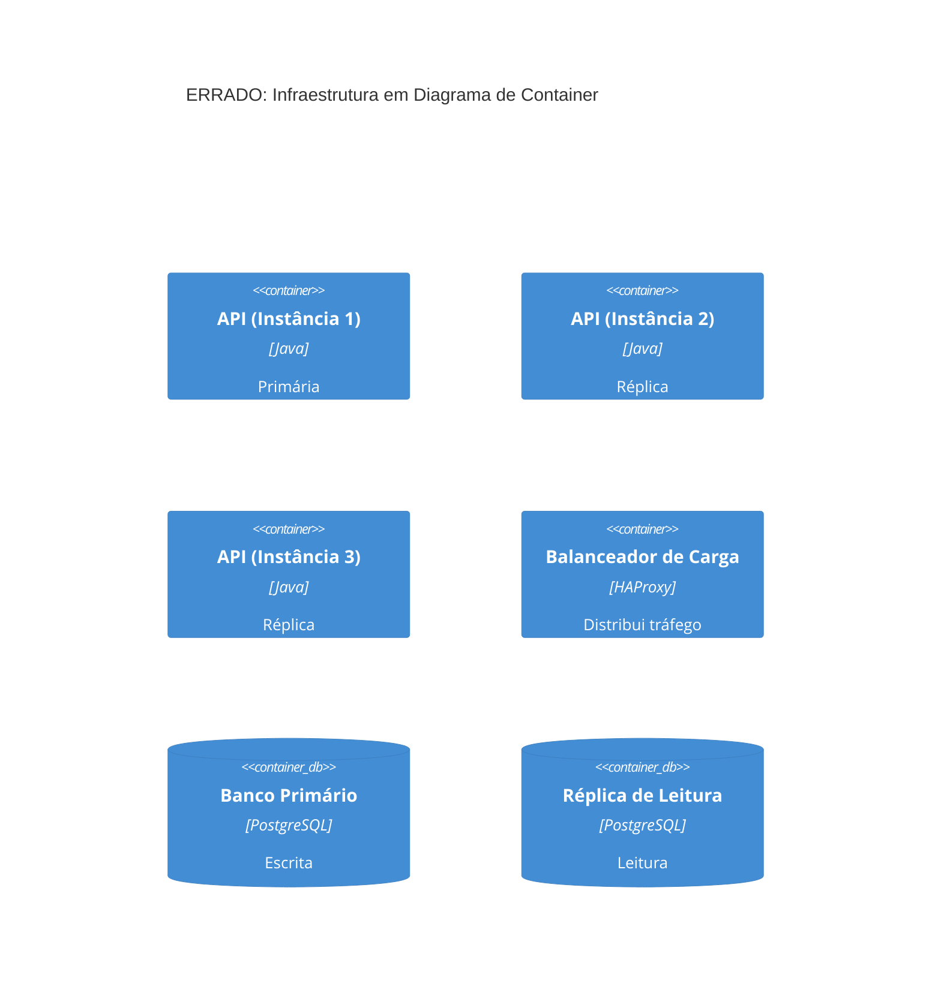

**Correto - use diagrama de Deployment para infraestrutura:**
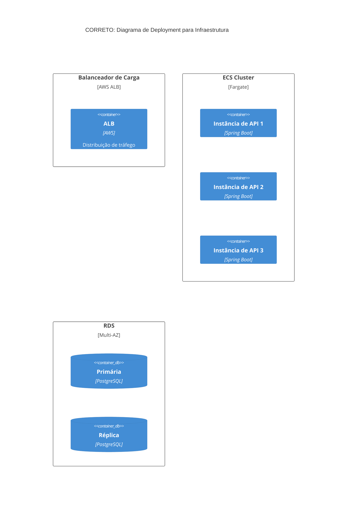

### 2. Contexto de Ambiente Ausente

**O problema:**
Diagramas de deployment devem especificar qual ambiente (produção, staging, dev).

**Errado:**
```text
C4Deployment
  title Diagrama de Deployment  # Qual ambiente?
```

**Correto:**
```text
C4Deployment
  title Diagrama de Deployment - Produção (AWS us-east-1)
```

## Erros de Consistência

### 1. Notação Inconsistente Entre Diagramas

**O problema:**
Usar cores, formas ou terminologia diferentes para os mesmos elementos entre diagramas.

**Errado:**
- Diagrama de contexto: "Sistema de Pagamentos" (azul)
- Diagrama de container: "Serviço de Pagamentos" (verde)
- Diagrama de component: "Módulo de Pagamentos" (vermelho)

**Correto:**
Use nomenclatura, cores e estilo consistentes. Crie um guia de estilo para seu time.

### 2. Sem Legenda

**O problema:**
Presumir que quem vê entende sua notação sem explicação.

**Solução:**
Sempre inclua uma legenda explicando cores, formas e estilos de linha. Mesmo para elementos "óbvios".

## Erros de Documentação de Decisões

### Mostrar o Processo de Decisão nos Diagramas

**O problema:**
Diagramas de arquitetura mostram os **resultados** das decisões, não o processo de tomada de decisão.

**Abordagem errada:**
Incluir anotações do tipo "Opção A vs Opção B" nos diagramas.

**Abordagem correta:**
- Documente as decisões separadamente em Architecture Decision Records (ADRs)
- Vincule os ADRs aos diagramas relevantes
- Diagramas mostram a arquitetura escolhida, ADRs explicam o porquê

## Referência Rápida: Checklist

Antes de finalizar qualquer diagrama C4, verifique:

- [ ] Todo elemento tem: nome, tipo, tecnologia (se aplicável), descrição
- [ ] Todas as setas são unidirecionais com rótulos de verbo de ação
- [ ] Tecnologia/protocolo incluído nos relacionamentos
- [ ] O diagrama tem um título claro e específico
- [ ] Menos de 20 elementos (idealmente menos de 15)
- [ ] Nível apropriado para o público-alvo
- [ ] Containers são implantáveis, components não
- [ ] Sistemas externos mostrados como caixas-pretas
- [ ] Tópicos de mensagens mostrados individualmente (não como um único broker)
- [ ] Sem detalhes de infraestrutura em diagramas de container
- [ ] Consistente com os outros diagramas do conjunto
