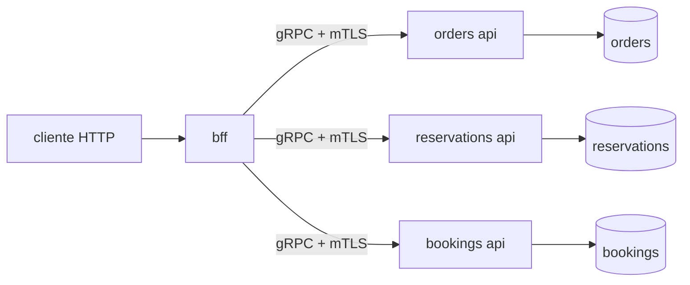

# bff

Única borda REST/JSON pública da topologia de referência do kernel DMPF (ADR-044). Um processo, sem banco, outbox nem consumer: autentica o sujeito, autoriza por permissão e traduz cada rota do contrato OpenAPI em uma chamada gRPC a um dos contextos (`RST-01`, `GRP-01`, `IDN-16`).

| Rota | Contrato | RPC | Permissão |
| --- | --- | --- | --- |
| `POST /orders/{id}/items` | `apps/backend/orders/contract/openapi/v1/openapi.yaml` | `OrdersService/AddItem` | `orders:write` |
| `POST /orders/{id}/place` | idem | `OrdersService/PlaceOrder` | `orders:write` |
| `GET /orders/{id}` | idem | `OrdersService/FindOrder` | `orders:read` |
| `GET /reservations/{order_id}` | `apps/backend/reservations/contract/openapi/v1/openapi.yaml` | `ReservationsService/FindReservation` | `reservations:read` |
| `POST /reservations/{order_id}/reserve` | idem | `ReservationsService/Reserve` | `reservations:write` |
| `POST /reservations/{order_id}/cancel` | idem | `ReservationsService/Cancel` | `reservations:write` |
| `POST /bookings/booking` | `apps/backend/bookings/contract/openapi/v1/openapi.yaml` | `BookingsService/ReserveBooking` | `bookings:write` |
| `GET /bookings/booking?resourceId=` | idem | `BookingsService/FindBookingsByResource` | `bookings:read` |
| `GET /bookings/booking/{id}` | idem | `BookingsService/FindBooking` | `bookings:read` |
| `POST /bookings/booking/{id}/cancel` | idem | `BookingsService/CancelBooking` | `bookings:write` |
| `POST /bookings/resource` | idem | `BookingsService/RegisterResource` | `bookings:write` |

Toda rota exige sujeito e tenant resolvidos (`RequireSubjectAndTenant`); `ValidateEdge` recusa na partida uma rota que exigisse sujeito sem declarar permissão (`IDN-16`, `IDN-17`). Criado pela `docs/specs/SPEC-ACYKBF9V-dmpf-reference-bff-contextos.md`; decisões em `docs/adr/044-bff-rest-e-contextos-grpc-de-referencia.md` e, para autenticação e tenant, na `SPEC-9B6SHEH8` (`docs/adr/049` a `052`).

## Saúde

Fora do contrato e sem autenticação, para as sondas, numa porta de administração própria (`ADMIN_ADDR`, default `:8090`) que nenhum Service publica; a porta pública não serve as duas rotas e responde `404` do `ServeMux` a elas, com span, ponto e registro de acesso como qualquer 404:

| Rota | Responde |
| --- | --- |
| `GET /livez` | `204` enquanto o processo serve HTTP |
| `GET /readyz` | `204` quando os três contextos respondem `SERVING` no `grpc.health.v1`; `503` em até 2 s, com um `warn` `not ready` que leva só o `error.type` (`redact.Error`), sem o nome dos contextos; o resultado vale por 1 s |

O `/readyz` lê o estado do canal gRPC de cada contexto: com o health check do service config (`GRP-13`), o canal só fica `READY` quando algum backend responde `SERVING`. O subcomando `bff healthcheck` consulta o `/readyz` no endereço de `ADMIN_ADDR` e sai com `0` ou `1`; é o `HEALTHCHECK` da imagem, que não tem shell, e também o do Compose, que não publica a porta no host. No Kubernetes, a readiness usa `/readyz` e a liveness usa `/livez`, ambas na porta `admin` (8090) do container, fora do Service `bff`, para um contexto fora do ar tirar o BFF do balanceamento sem reiniciá-lo.

As duas rotas ficam fora do tracing: `GET` e `HEAD` de `/livez` e `/readyz` não abrem span SERVER nem ponto de `http.server.request.duration`, porque o filtro do `otelhttp` da porta de administração pergunta ao `ServeMux` dela que handler atenderia a requisição e só pula as rotas de saúde montadas (`app/api/health.go`). O `405` nesses paths, inclusive o de `OPTIONS` (a porta não tem CORS), e o `404` dos demais continuam com span e ponto e, como toda resposta com SERVER, com um `http request` próprio (seção Cadeia de uma requisição). O registro de acesso `http request` de `GET` e `HEAD` delas, com `http.request.method`, `http.route`, `http.response.status_code` e `dmpf.outcome_category`, sai no máximo uma vez a cada 5 min por rota e processo quando a resposta é 2xx; a resposta fora de 2xx sai sempre, no nível da tabela única de severidade (o `503` em `error`), e não mexe na janela do sucesso.

## Topologia


```mermaid
flowchart LR
  client[cliente HTTP] --> bff[bff]
  bff -->|gRPC + mTLS| orders[orders api]
  bff -->|gRPC + mTLS| reservations[reservations api]
  bff -->|gRPC + mTLS| bookings[bookings api]
  orders --> ordersdb[(orders)]
  reservations --> reservationsdb[(reservations)]
  bookings --> bookingsdb[(bookings)]
```

## Unidade do manifesto

`bff/app`, bloco `app`, `bounded_context` `bff`. O BFF alcança só o contrato gerado de `company.{orders,reservations,bookings}.service.v1` — superfície pública por construção — e o shared kernel: `http`, `grpc`, `transport`, `observability`, `authn` e `ports`. Importar domínio ou aplicação dos contextos reprova no verificador com `DMPF-D002`; o `external` não declara `pgx` nem `franz-go`.

## Cadeia de uma requisição

1. O `otelhttp` envolve todo o handler e abre um span SERVER por requisição, com pai no `traceparent` recebido, quando houver (`TRC-02`), e um ponto de `http.server.request.duration` — também no preflight e em 404/405; só `GET` e `HEAD` de `/livez` e `/readyz` na porta de administração ficam fora, como descreve a seção Saúde (RF-B2 da `SPEC-1TFW24WV`). O `tracestate` do cliente é descartado na extração (`app/api/traceparent.go`): nenhum span do BFF nem chamada gRPC aos contextos o carrega. Dentro dele, `withRecover` protege contra panic; `withRouteDeadline` mede o prazo da requisição a partir do `Budget` da rota e monta o orçamento de retry — nenhum valor do chamador o alarga (`GRP-05`, `RES-24`). O registro de acesso fica logo abaixo do `otelhttp` e envolve o CORS e o `ServeMux`: toda resposta com SERVER sai com exatamente um `http request`, no trace e no span dele. As rotas do contrato e as de saúde escrevem o próprio registro, as primeiras já com o contexto de execução; o preflight respondido pelo CORS, o 404 e o 405 do `ServeMux` e os documentos OpenAPI recebem o da borda, com `http.route` só quando um padrão do `ServeMux` atendeu, como no span. O `http.request.method` do registro é o do span e da métrica: um dos nove métodos do HTTP em maiúsculas, ou `_OTHER` para qualquer outro, sem o valor que o cliente enviou. Os erros do próprio `net/http` (panic fora de `withRecover`, handshake TLS, `Accept`) vão ao `ErrorLog` do servidor, que os emite em `warn` com scope `net/http` e só o enunciado anterior ao primeiro valor: endereço do par, valor do panic, pilha e texto do erro viram `<redacted>` (`DAT-02`, `DAT-23`).
2. `X-Correlation-ID` válido é preservado, senão cunhado, e volta no mesmo header (`CTX-07`); a requisição ganha `request_id` próprio.
3. **Autenticação e autorização** (`ResolveIdentity`, `libs/backend/go/http/identity.go`): sem credencial ou credencial inválida em rota que exige sujeito ou tenant → 401 `unauthenticated`; tenant não resolvido → 403 `tenant-unresolved`; rota sem `Permission` declarada → 403 `permission-undeclared`; sujeito sem a permissão exigida → 403 `permission-denied`. Em seguida, `RefuseAssertedIdentity` recusa com 403 `identity-mismatch` quando `X-Subject-ID`, `X-Tenant-ID` ou o query `tenant_id` divergem do que a verificação resolveu (`CTX-06`) — o cliente nunca pode afirmar uma identidade diferente da autenticada.
4. O contexto de execução de nove campos (`CTX-01`) é montado — sujeito, tenant, permissões, `request_id`, `correlation_id`, `trace_id`, prazo e `locale` (primeira língua de `Accept-Language`, com `en` como default) — e depositado no `context.Context` da requisição, o único caminho até o provider (ADR-049).
5. `Idempotency-Key` obrigatório nos POST, no formato `^[A-Za-z0-9._-]{1,128}$`: sem ele, 400 `missing-idempotency-key`, e fora do formato, 400 `invalid-idempotency-key`, antes de qualquer RPC (`RST-02`, `IDM-01`, `IDM-02`). O BFF envia ao contexto a chave derivada `hex(sha256(sujeito ‖ 0x00 ‖ chave do cliente))`, com 64 caracteres, para que dois sujeitos com a mesma chave nunca dividam uma entrada; o sujeito não atravessa (`CTX-12`, `IDM-03`). O log de acesso registra as duas chaves.
6. O handler converte JSON em Protobuf e chama o contexto por gRPC com mTLS. A metadata leva `x-correlation-id`, `x-causation-id` (o `request_id` do BFF), `x-tenant-id`, `traceparent` do span de cliente e `idempotency-key`.

Todo método, leitura ou comando, é repetido em `UNAVAILABLE`: a leitura não tem efeito, e o comando leva a mesma chave em toda tentativa, que o contexto deduplica pela inbox (`GRP-08`, `GRP-09`, FND-04 §7.6). O prazo de cada método é menor que o da rota (`GRP-17`). O breaker de cada contexto conta só indisponibilidade (`UNAVAILABLE`, `DEADLINE_EXCEEDED`, `RESOURCE_EXHAUSTED`, `INTERNAL`, `UNKNOWN`, `DATA_LOSS` e erro de transporte): um `NOT_FOUND` repetido não o abre (`RES-10`, `RES-12`). A admissão (RES-16/17) roda depois do contexto e é chaveada pelo tenant que ele resolveu, não pela requisição bruta.

| Resultado do contexto | HTTP | `code` |
| --- | --- | --- |
| `Rejection` no `oneof result` | 422 | código de domínio |
| `NOT_FOUND` (inclusive identificador de outro tenant) | 404 | `not-found` |
| `FAILED_PRECONDITION` com reason `REUSED_IDEMPOTENCY_KEY` | 422 | `reused-idempotency-key` |
| `ABORTED` com reason `IN_FLIGHT_IDEMPOTENCY_KEY` | 409 | `in-flight-idempotency-key` |
| `INVALID_ARGUMENT` com reason `MISSING_IDEMPOTENCY_KEY` ou `INVALID_IDEMPOTENCY_KEY` | 400 | `missing-idempotency-key`, `invalid-idempotency-key` |
| `ALREADY_EXISTS` | 409 | `already-exists` |
| `ABORTED` | 409 | `version-conflict` |
| `DEADLINE_EXCEEDED` ou prazo esgotado no BFF | 504 | `deadline-exceeded` |
| `UNAVAILABLE` | 503 | `unavailable` |
| `RESOURCE_EXHAUSTED` | 429 | — |
| demais | 500 | `internal-failure` |

O reason do `ErrorInfo` é lido antes do código gRPC, porque `FAILED_PRECONDITION` e
`ABORTED` também significam outras coisas. Quando o contexto responde com o header
`idempotent-replayed: true`, a resposta REST repete o status e o corpo gravados,
inclusive um 422 de recusa, com `Idempotent-Replayed: true`; a primeira resposta
não leva o header. A entrada vale 24h. O CORS expõe `X-Correlation-ID` e
`Idempotent-Replayed` em `Access-Control-Expose-Headers`.

## Autenticação

O BFF é a única borda que resolve identidade (`ResolveIdentity`, pacote `authn` do kernel): um verificador OIDC (`OIDC_*`) ou o mock de desenvolvimento (`AUTH_DEV_MOCK`), nunca os dois ao mesmo tempo. O sujeito e as permissões não atravessam o fan-out para `orders` e `reservations` (`CTX-12`) — o que chega a cada contexto é o tenant, verificado por mTLS na origem (ver `apps/backend/orders/README.md` e `apps/backend/reservations/README.md`).

## Configuração

| Variável | Obrigatória | Efeito |
| --- | --- | --- |
| `ORDERS_GRPC_TARGET`, `RESERVATIONS_GRPC_TARGET`, `BOOKINGS_GRPC_TARGET` | sim | Alvos gRPC dos contextos (`dns:///host:porta`) |
| `GRPC_INSECURE` | uma das duas | `true` só em desenvolvimento |
| `GRPC_CA_FILE`, `GRPC_SERVER_NAME` | uma das duas | CA que valida os contextos e nome esperado no certificado |
| `GRPC_CLIENT_CERT_FILE`, `GRPC_CLIENT_KEY_FILE` | com `GRPC_CA_FILE` | Certificado de cliente do BFF (URI `spiffe://dmpf/bff`): os contextos só servem workload verificado (ADR-052) |
| `OIDC_ISSUER`, `OIDC_AUDIENCE`, `OIDC_TENANT_CLAIM` | uma das duas linhas de autenticação | Emissor, audiência e claim de tenant do access token |
| `OIDC_PERMISSION_CLAIMS` | não | Caminhos das claims de permissão, separados por vírgula; default `scope,realm_access.roles` (formato Keycloak) |
| `OIDC_DISCOVERY_TIMEOUT_SECONDS` | não | Default 10 |
| `AUTH_DEV_MOCK` | uma das duas linhas de autenticação | `true` lê a identidade declarada no próprio Bearer, sem verificação — só desenvolvimento; não pode coexistir com `OIDC_ISSUER` |
| `HTTP_ADDR` | não | Default `:8080`; `127.0.0.1:0` escolhe porta livre, e o registro `http listening` traz o endereço em `server.address` e `server.port` |
| `ADMIN_ADDR` | não | Porta de administração com `/livez` e `/readyz`; default `:8090`, em `host:porta` (sem porta, a partida falha com exit 2); `127.0.0.1:0` escolhe porta livre, e o registro `admin listening` traz o endereço como o `http listening` |
| `DRAIN_DELAY` | não | Default `0`; no `SIGTERM`, o `/readyz` da porta de administração passa a `503` e o listener público só fecha depois desse tempo (`5s` no Kubernetes); a porta de administração fecha depois da pública. O `terminationGracePeriodSeconds` de 30 s cobre esse atraso, os até 10 s do `Shutdown` HTTP e os até 10 s da telemetria, e o Compose usa `stop_grace_period: 30s` |
| `CORS_ORIGINS` | não | Origens aceitas pelo navegador (Swagger UI local) |
| `METRIC_TENANTS` | não | Tenants que têm bucket de admissão e rótulo de métrica próprios (`MET-07`), separados por vírgula; os demais compartilham `other` |
| `OPENAPI_ORDERS_PATH`, `OPENAPI_RESERVATIONS_PATH`, `OPENAPI_BOOKINGS_PATH` | não | Servem os contratos em `/openapi/<ctx>/v1/openapi.yaml` |
| `OTEL_SERVICE_NAME`, `OTEL_RESOURCE_ATTRIBUTES` | `service.version` e `service.instance.id`, sim | Identidade do recurso OTel (`service.version`, `service.instance.id`, `dmpf.process.role`, `deployment.environment.name`); sem `OTEL_SERVICE_NAME`, o serviço é `bff`; versão e instância não têm default, e sem elas a partida falha com `ErrResourceIncomplete` (exit 1) |
| `OTEL_EXPORTER_OTLP_PROTOCOL`, `OTEL_EXPORTER_OTLP_ENDPOINT` | não | Exportação OTLP; os manifestos declaram `grpc` e `http://<collector>:4317`, e o esquema `http://` desliga o TLS; sem protocolo, vale o `http/protobuf` do `autoexport`, que o Collector não recebe |
| `OTEL_TRACES_SAMPLER_ARG`, `OTEL_LOGS_EXPORTER`, `OTEL_PROPAGATORS`, `OTEL_GO_X_OBSERVABILITY` | não | Os manifestos declaram `1.0`, `otlp`, `tracecontext` e `true`; com `none` em `OTEL_{TRACES,METRICS,LOGS}_EXPORTER`, o sinal não é exportado, como nos harnesses de teste |

Variável obrigatória ausente, ou nenhuma política de transporte gRPC ou de autenticação, encerra a partida com exit 2 nomeando o que falta.

## Rodar localmente

`pnpm nx run bff:serve` sobe a infra local, os papéis dos três contextos (`serve-api`, `serve-relay` e o `serve-consumer` do `reservations`) e o BFF no host, cada processo com o `deploy/.env.example` da app; um `deploy/.env` ao lado sobrepõe os valores. Os contextos ouvem gRPC sem TLS em 9191 (`orders`), 9192 (`reservations`) e 9193 (`bookings`), e o BFF ouve HTTP em 8080, com a porta de administração em 8090.

```bash
pnpm nx run bff:serve
```

A topologia inteira sobe por `docker compose -f infra/local/docker-compose.yml --profile dmpf up -d --build`, com mTLS entre o BFF e os `api` e SASL no Kafka interno (ver `infra/README.md`).

Em containers na rede do host, com os `deploy/.env` de cada app (o target `deploy-env` copia o `.env.example` quando o `.env` não existe), `pnpm nx run bff:docker:run` sobe a infra local e as imagens do BFF e dos papéis de cada contexto: o `docker:run` (papel `api`) e o `docker:run-relay` dos três, e o `docker:run-consumer` do `reservations`. O container do BFF fica `healthy` só depois que os três contextos respondem `SERVING`.

## Targets Nx

`fmt-check`, `vet`, `build`, `test-race`, `govulncheck`, `serve`, `docker:build` e `docker:run`, mais os de infraestrutura do workspace: `infra-up`, `observability-up`, `infra-down`, `infra-budget` e `k8s-render`.

## Testes

- Unitários: rotas e contrato (inclusive o teste estrutural dos três OpenAPI), resolução e recusa de identidade (credencial ausente, expirada, asserção divergente via `X-Subject-ID`/`X-Tenant-ID`/`tenant_id`), mapeamento de status, clientes gRPC contra servidores falsos por `bufconn` (retry por idempotência, prazo decrescente, metadata, mTLS e hierarquia de spans) e partida do binário.
- E2e caixa-preta (build tag `integration`): compila os quatro binários com `-race`, cria três bancos e seis tópicos por execução, sobe os oito processos e fala só HTTP com o BFF. Prova a cadeia de contexto até `ReservationConfirmed` e até o `BookingReserved` que sai do `bookings`, o cancelamento que vence um `OrderPlaced` posterior, a reentrega que termina em `DuplicateIgnored`, uma outbox por contexto e a recusa de uma chamada sem credencial. Exige `PG_DSN` (usuário com `CREATE DATABASE`) e `KAFKA_BROKERS`; o target sobe a infra de testes (`testkit:test-infra-up`) e o `tools/test-env.sh` preenche os dois com o Postgres (15432) e o Redpanda (19092) dela, a partir do `.env.example` da raiz.

```bash
pnpm nx run bff:test-race
```
