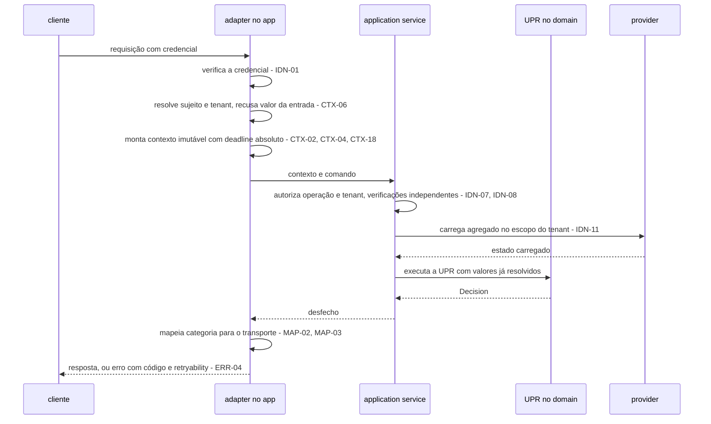
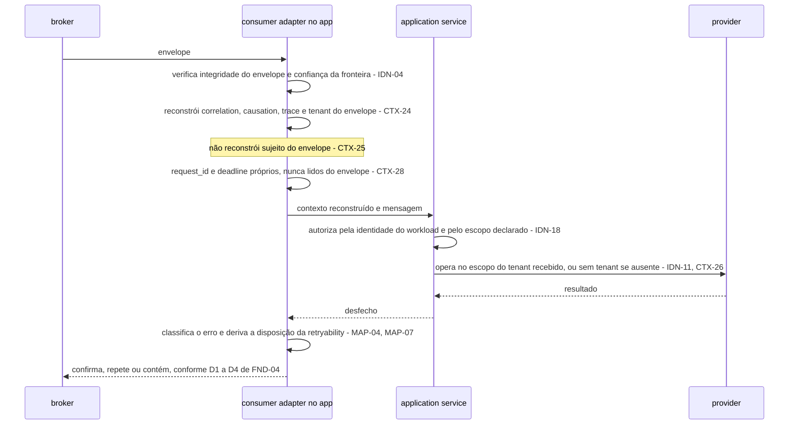

# Contexto de execução, erros, segurança e multi-tenancy — DMPF FND-07

| Campo | Valor |
|-------|-------|
| **Status** | `draft normativo` — promovido para revisão em PR |
| **Adiciona a** | RFC DMPF Foundation v0.1, pela âncora ANC-05 (RFC §12.3) |
| **Owner** | Mateus Macedo Dos Anjos (assignee de ARQ-444) |
| **Épico** | ARQ-436 — Golden Path para Sistemas Orientados a Domínio e Mensagens |
| **Story** | ARQ-444 (DMPF-FND-07) |
| **Spec** | [SPEC-XQWGGAXF](../specs/SPEC-XQWGGAXF-dmpf-contexto-erros-seguranca.md) |
| **Data** | 2026-08-19 |
| **Revisão** | Plataforma e Arquitetura no PR; **um representante de Segurança para §7 e §8, obrigatório** — sem ele o critério de aceite do threat model não é satisfeito; um representante de operação para o baseline de §8 |

> **O que este documento obriga.** As regras rotuladas `normativo` valem para
> todo trabalho novo do DMPF, na mesma força da RFC à qual elas se adicionam.
> Nem todo bloco aqui obriga: §1.3 define as cinco categorias de conteúdo e a
> fronteira de cada uma. Enquanto o status for `draft normativo`, o documento
> está em revisão; a promoção ocorre no aceite do PR.

---

## §1. Fronteira, referência e sucessão

Esta seção vem antes de qualquer regra porque um artefato que adiciona a uma
norma compartilhada precisa dizer, primeiro, **até onde** ele pode obrigar. A
RFC já respondeu a essa pergunta ao registrar a âncora ANC-05; o que segue é a
leitura dessa autorização, a convenção de leitura do texto e o efeito deste
documento sobre a base conceitual a que ele sucede.

Há uma diferença de forma em relação aos três precedentes, e ela condiciona todo
o resto. A ANC-01 recortou um **bloco** e o FND-03 o esgotou. A ANC-02 recortou
um **mecanismo** que atravessa três blocos, e o FND-04 respondeu declarando o
bloco de cada regra. A ANC-03 recortou um bloco cujo assunto era maior do que a
entrega, e o FND-05 declarou a lacuna. A ANC-05 não recorta bloco nem mecanismo:
recorta **três assuntos transversais** — propagação de contexto, taxonomia de
erros e controles de segurança — que incidem sobre todos os blocos e sobre todas
as demais âncoras, sem possuir nenhum deles. §1.3 trata dessa diferença, e ela é
a razão de este artefato declarar, por regra, não só o bloco a que a regra se
aplica, mas também o **sujeito** que ela obriga.

### §1.1 A autorização: âncora ANC-05

`normativo`

Este artefato **adiciona** à RFC DMPF Foundation v0.1 pela âncora ANC-05
(RFC §12.3). Ele não edita a RFC e não incrementa a versão dela: adição por
âncora dentro do escopo permitido é revisão em PR, sem incremento
(RFC §14.2). O conteúdo vive aqui, e a RFC o alcança pelo endereço estável da
âncora (RFC §12.1).

| Campo | Valor, conforme o registro de ANC-05 |
|-------|--------------------------------------|
| Assunto | Contexto de execução, erros e segurança |
| Escopo permitido | Propagação de contexto, taxonomia de erros e controles de segurança |
| Invariantes intocáveis | RFC §9.3 (o domínio recebe valores resolvidos em vez de buscá-los); **P0-1** (domínio sem I/O) |
| Monotonicidade | M1–M4 (RFC §12.2): detalhar e restringir, nunca relaxar, revogar ou reinterpretar |
| Artefato sucessor | Spec e seção própria |
| Condição de fechamento | FND-07 concluída e revisada |
| Impacto de versão na RFC | Nenhum, se dentro do escopo |
| ADR exigido | **Não, salvo alteração de invariante** — a condicional é analisada em §10 |

`normativo` — **Precedência.** Onde este artefato e a RFC divergirem, prevalece
a RFC. Uma divergência não se resolve neste documento: por M4, ela indica que a
fronteira de RFC §1.4 mudou, e mudar fronteira é mudança de versão da RFC, com
o rito de RFC §14.2.

`normativo` — **Precedência entre sub-specs.** Onde este artefato e um artefato
irmão já promovido divergirem sobre matéria que a âncora do irmão possui,
prevalece o irmão. Este documento normatiza assunto transversal, o que o põe em
contato com quase todas as âncoras; a transversalidade autoriza atravessar
blocos, não sobrepor-se a donas. O caminho de uma divergência material é o
mesmo de sempre: nomeá-la e escalá-la, nunca resolvê-la por texto mais recente.

`normativo` — **Monotonicidade em concreto.** As duas invariantes da âncora são
citadas ao longo do texto, e nenhuma regra deste artefato as afrouxa:

| Invariante | Como este artefato a trata | Onde |
|------------|----------------------------|------|
| RFC §9.3 — o domínio recebe valores resolvidos | Reproduzida e **restringida**: o contexto de execução é o veículo dos valores já resolvidos, e o texto nomeia o que o domínio não pode alcançar por ele | §3, §4 |
| **P0-1** — domínio sem I/O | Preservada sem exceção: nenhuma regra deste artefato faz o domínio ler contexto ambiental, emitir log, medir tempo ou alcançar identidade por outro caminho que não o argumento | §3, §4, §5 |

`normativo` — **P0-3 é respeitada, não possuída.** A retryability de §5 toca a
semântica de entrega, mas **P0-3** — at-least-once com efeitos idempotentes,
sem exactly-once fim a fim — é invariante das âncoras ANC-02 e ANC-04. Este
artefato a reafirma como critério de rejeição de redação e não a redefine.
Nenhuma regra daqui promete, sugere ou permite inferir exactly-once.

`rationale` — Declarar as duas precedências no corpo do texto, e não deixá-las
implícitas em M4, é deliberado. Uma sub-spec extensa tende a ser lida
isoladamente por quem implementa; sem a cláusula, um leitor que encontrasse
conflito poderia razoavelmente supor que o documento mais específico vence. Ele
não vence. A segunda cláusula é nova em relação aos precedentes porque o risco
que ela cobre é novo: contexto, erro e segurança aparecem **dentro** do
mecanismo de outro artefato quase sempre, e a tentação de decidir a matéria
alheia de passagem é proporcional a essa frequência.

### §1.2 Convenção de referência

`normativo`

Seis documentos de numeração própria e sobreposta participam desta cadeia,
então toda referência é qualificada:

| Forma | Designa |
|-------|---------|
| `§N` sem prefixo | uma seção **deste artefato** |
| `RFC §N` | uma seção da RFC DMPF Foundation v0.1 |
| `Parte-1 §N` | um capítulo da base conceitual `Parte-1-conceitual.md` |
| `FND-03 §N` | uma seção do artefato `upr-decision-mensagens.md`, promovido sob a ANC-01 |
| `FND-04 §N` | uma seção do artefato `uow-inbox-outbox.md`, promovido sob a ANC-02 |
| `FND-05 §N` | uma seção do artefato `cloudevents-protobuf-buf.md`, promovido sob a ANC-03 |

`normativo` — O prefixo nulo tem referente **local**: dentro deste documento,
`§N` é sempre uma seção deste documento. A convenção difere da de RFC §1.3,
onde o prefixo nulo designa a própria RFC, e segue a de FND-04 §1.2 e FND-05
§1.2, que resolvem o prefixo nulo em si mesmas. Uma citação a este artefato
feita **de fora** dele usa o nome do arquivo mais a seção.

`normativo` — **Regras dos artefatos irmãos são citadas pelo identificador
estável, não pelo número de linha.** `ENV-11`, `ENV-12`, `GAR-11` e `OBX-02`
designam a regra onde ela estiver. Número de linha e número de subseção podem
aparecer como auxílio de localização, nunca como âncora única da citação.

`normativo` — **Desambiguação de dois prefixos próximos.** `CTX-*` é deste
artefato e designa regra sobre o **contexto de execução** (§3). `CTR-*` é de
FND-03 e designa regra sobre os **três níveis de contrato**. Os prefixos se
parecem e os assuntos não se tocam; uma citação nua a `CTR-*` neste documento é
sempre remissão a FND-03.

`rationale` — A sexta forma é necessária porque este artefato é o **devedor** dos
três precedentes: FND-03, FND-04 e FND-05 lhe delegaram obrigações por escrito, e
a matriz de §2 cita as três fontes linha a linha. Citar sempre pelo caminho do
arquivo tornaria a matriz ilegível.

`rationale` — A exigência de citar por ID nasceu de um risco medido durante o
planejamento desta entrega: o FND-05 estava em redação ativa quando as suas
obrigações foram levantadas, e toda citação por linha envelheceu antes do merge.
A regra sobrevive ao episódio porque o problema não era o episódio: um artefato
normativo de milhares de linhas renumera a cada revisão, e uma citação por linha
é uma citação com prazo.

### §1.3 Classificação de força e o sujeito da norma

`normativo`

A ANC-05 autoriza normatizar «propagação de contexto, taxonomia de erros e
controles de segurança». O recorte não é de um bloco, como em ANC-01 e ANC-03,
nem de um mecanismo, como em ANC-02: é de três **assuntos transversais**. Um
contexto de execução que existisse em um só bloco não seria propagação; uma
taxonomia de erros válida em um só bloco não seria taxonomia; e um controle de
segurança confinado a um bloco não protegeria a superfície que o dado atravessa.

Isso amplia a incidência sem ampliar a autoridade, e a distinção é a matéria
desta subseção. O que **não** cabe aqui não é o outro bloco — é o assunto de
outra âncora: a forma do envelope (ANC-03), o mecanismo de atomicidade e
drenagem (ANC-02), a forma da decisão de domínio (ANC-01), as políticas de cada
transporte (ANC-04), o orçamento de retry e o catálogo de telemetria (ANC-06) e o
instrumento de teste (ANC-07) seguem sendo de suas donas, **mesmo quando o
contexto, o erro ou o dado protegido aparecem no meio delas** — o que acontece
quase sempre. Apresentar esse conteúdo com força normativa excederia o escopo da
âncora e seria inválido por M4, ainda que o texto estivesse tecnicamente correto.

A solução tem duas partes. A primeira é a do precedente FND-04: declarar, em cada
regra, o **bloco** a que ela se aplica e a sua **força**.

| Rótulo | Significado | Obriga? |
|--------|-------------|---------|
| `normativo` | Regra que este artefato estabelece sobre contexto, erro ou segurança, no escopo da ANC-05, com bloco e sujeito declarados | **Sim** |
| `recepcionado` | Conteúdo reproduzido da Parte-1 ou de artefato irmão para dar contexto contíguo, sem força nova e sem reabertura | Não — a força permanece a da fonte |
| `encaminhado` | Assunto de outra sub-spec, de provider ou de kernel, citado apenas como fronteira rotulada, com dona explícita | Não — passa a obrigar quando a dona normatizar |
| `rationale` | Justificativa de uma decisão normativa, incluindo alternativas descartadas | Não |
| `registro` | Metodologia declarada (§7), análise de acionamento de ADR (§10) e matriz de rastreabilidade (§11) | Não |

`normativo` não é o rótulo default: um bloco sem rótulo é prosa de ligação e não
obriga nada. Os rótulos `normativo` e `rationale` têm aqui exatamente o sentido de
RFC §1.1. `recepcionado` usa o verbo no mesmo sentido de RFC §1.3; `encaminhado`
nomeia o gesto que RFC §1.4 pratica sem nomear.

`normativo` — **Toda regra `normativo` deste artefato declara o bloco a que se
aplica.** Uma regra sem bloco declarado é defeito de redação, não licença para
aplicá-la a todos: o alcance de uma norma que atravessa blocos precisa ser
verificável linha a linha, e a matriz de RFC §7.4 só pode ser conferida contra
uma atribuição explícita.

`normativo` — **Toda regra `normativo` deste artefato declara também o seu
sujeito**, que é o segundo eixo e a diferença em relação a FND-04. O sujeito é
quem a regra obriga a agir, e as quatro possibilidades são: o **bloco** de código
(`adapter`, `application service`, `provider`, `domain`, `app`), a **plataforma**
que opera a superfície, o **contexto de negócio** que classifica o próprio dado,
ou o **artefato normativo** de outra âncora, caso em que a regra é `encaminhado` e
não `normativo`.

`rationale` — Sem o segundo eixo, boa parte deste documento seria inaplicável sem
parecer inválida. «Dado classificado como sensível permanece cifrado em repouso» é
uma proibição sem endereço se não disser quem cifra, quem classifica e quem
verifica: um leitor de squad concluiria que precisa implementar cifra na
aplicação, e um leitor de plataforma concluiria que a squad já a implementou.
Declarar o sujeito converte a regra em obrigação de alguém — e expõe, na revisão,
a regra cujo sujeito é «outra âncora», que por M4 não podia ter nascido
`normativo`.

`rationale` — **Por que a exigência de bloco não bastou aqui.** No FND-04 o bloco
respondia às duas perguntas ao mesmo tempo, porque o mecanismo normatizado era
código: dizer «isto é do `provider`» já dizia quem age. Segurança do dado não é
só código. Classificação é decisão de negócio, cifra em repouso costuma ser
capacidade de infraestrutura, teto de retenção é frequentemente externo à
engenharia, e nenhuma das três tem bloco. Amarrá-las a um bloco por força de
forma produziria atribuição falsa, que é pior do que atribuição ausente.

### §1.4 O que este artefato não normatiza

`normativo` — espelha RFC §1.4 no recorte que toca contexto, erros e segurança.

Cada tema abaixo aparece neste documento **apenas** como fronteira rotulada
`encaminhado`. Onde ele aparece, o texto diz o que a propagação, a taxonomia ou o
controle fazem até a fronteira, e para: o outro lado é da dona.

| Tema | Dona | Fronteira aparece em |
|------|------|----------------------|
| Forma dos atributos e extensões do envelope — nome, tipo, semântica e o conjunto fechado por `ENV-11`; correspondência de campos de wire; `payload_hash` | FND-05 (ARQ-442), sob ANC-03 | §3, §4, §8 |
| Mecanismo de atomicidade, deduplicação e drenagem; schema da outbox e da inbox; disposição do envelope contido e da DLQ | FND-04 (ARQ-441), sob ANC-02 | §5, §6, §8 |
| Forma da `Decision` e da `Rejection`; conteúdo da application response, inclusive no caminho de sucesso | FND-03 (ARQ-440), sob ANC-01 | §5, §6 |
| Timeout por transporte, binding, comportamento de ACK e convenções de cada broker | FND-06 (ARQ-443), sob ANC-04 | §3, §6 |
| Orçamento de retry, backoff, limiares, políticas de degradação, catálogo de métricas, alarmes e runbook | FND-08 (ARQ-445), sob ANC-06 | §5, §6, §7 |
| Instrumento de teste e oráculo executável, incluída a verificação do isolamento por tenant | FND-09 (ARQ-446), sob ANC-07 | §4, §11 |
| Redação, promoção e aceite de ADR, e a reconciliação da faixa `docs/adr/010`–`024` | FND-11 (ARQ-448) | §10 |

`normativo` — Três fronteiras são fáceis de atravessar por descuido, e por isso
cada uma é enunciada aqui no critério que a decide.

`normativo` — **A fronteira com ANC-06: classificação é deste artefato,
política é de FND-08.** Que cada categoria de erro declare a sua retryability é
propriedade da taxonomia e obriga aqui (§5). Quantas vezes se tenta, com que
espaçamento, sob qual orçamento, com qual limiar de alarme e qual runbook é de
ANC-06 e não obriga aqui, mesmo que este texto o mencione. A distinção sobrevive
ao caso difícil: uma categoria retentável não vira obrigação de tentar de novo.

`normativo` — **A fronteira com ANC-03: o valor é deste artefato, a forma é do
FND-05.** Onde um campo do contexto de execução também é atributo ou extensão do
envelope, este artefato normatiza **a origem do valor e a sua propagação** — de
onde ele pode vir, quem o resolve, o que o preserva, o que o regenera e o que o
rejeita. Nome, tipo e semântica do campo são do FND-05 quando a extensão é
organizacional, e da especificação CloudEvents quando a extensão é adotada — caso
em que nem este artefato nem o FND-05 podem redefini-los. **Este artefato não
acrescenta extensão ao envelope**: `ENV-11` fecha o conjunto, e incluir qualquer
campo novo exige alterar o FND-05.

`normativo` — **A fronteira com o mecanismo de persistência: o resultado é deste
artefato, a técnica é do provider e do kernel.** O isolamento entre tenants é
normatizado aqui como resultado verificável — acesso a dado de outro tenant é
impedido de forma fail-closed, e a imposição não depende de convenção de código.
Qual construção o realiza — constraint composta, row-level security, chave
particionada ou outra — é escolha do provider e dos épicos de kernel; o
instrumento que constata o resultado é de ANC-07.

`rationale` — A terceira fronteira é a única em que este artefato **reduz** o que
a sua própria spec pedia. A spec exigia constraint de banco e isolamento
detectável por teste como entregáveis desta âncora. Ambos são tecnicamente
corretos e nenhum é normatizável aqui: o primeiro prescreve mecanismo de
persistência, o segundo prescreve instrumento de teste, e M4 invalida a adição
fora do escopo ainda que correta. A spec foi reconciliada antes desta redação, e
a exigência sobrevive na forma que a âncora suporta — o resultado, não a técnica.
Nada de defesa em profundidade se perde: um único caminho sem filtro de tenant
continua proibido de devolver linha alheia, e é isso que o teste de ANC-07
constata.

Fora do épico inteiro, por P0-4: kernels Go e TypeScript, adapters e providers de
produção. Este artefato especifica o que o contexto carrega, como o erro se
classifica e o que o controle de segurança precisa garantir; construí-los em cada
stack é dos épicos de kernel.

Fora por decisão da própria spec: a **implementação** da autenticação e a escolha
do provedor de identidade. Este artefato define o critério do que conta como
requisição autenticada (§4) e herda o mecanismo que o satisfaz.

Fora por natureza, com o critério técnico ressalvado: a **política corporativa**
de classificação de dados. Onde ela existir, é consumida como entrada. Este
artefato produz o critério técnico de sensibilidade aplicável aos campos do
próprio mecanismo — obrigação que FND-04 e FND-05 lhe encaminharam por escrito —
e não a taxonomia da organização.

Fora por natureza: **quais** dados de cada bounded context são sensíveis, e qual
é o teto de retenção aplicável a cada um. O documento normatiza que a
classificação exista, quem a declara e o que decorre dela (§8); o conteúdo da
declaração é de cada contexto de negócio e do requisito externo que o alcança.

### §1.5 Sucessão sobre a Parte-1

`normativo` — detalha RFC §1.7 e continua RFC §14.4 no recorte da ANC-05.

RFC §14.4 registra que os capítulos da Parte-1 fora da sua tabela seguem
«vigentes na Parte-1 — cada um tem âncora em §12.3». Esta é a sub-spec
correspondente ao recorte da ANC-05. A tabela abaixo declara o estado de cada
**cláusula** da Parte-1 §§11–14 no escopo desta âncora.

`normativo` — A sucessão é declarada **por cláusula**, e não por subseção como em
FND-04 §1.5. A granularidade é imposta pela fonte: Parte-1 §12.1 é um pipeline de
nove estágios, dos quais **quatro** pertencem a esta âncora e cinco pertencem a
ANC-02, ANC-03, ANC-04 e ANC-06; e Parte-1 §11 é uma lista de nove regras cujo
ownership varia de linha para linha. Consolidar a subseção inteira absorveria
conteúdo alheio e repetiria, em escala menor, a invasão de âncora que M4 proíbe.
A coluna **Ressalva** nomeia, em cada cláusula, o que não é sucedido aqui.

| Cláusula da Parte-1 | Estado | Ressalva — pertence a outra dona |
|---------------------|--------|----------------------------------|
| §11 — a estrutura `ExecutionContext` e os seus nove campos | **Consolidado** em §3 | forma dos campos que também são atributos ou extensões do envelope — ANC-03 / FND-05 |
| §11 — regras 1 a 6: criação no adapter, subject e tenant só após autenticação, header externo nunca confiado sem validação, imutabilidade com passagem explícita, domínio sem contexto global, mecanismo ambiental que não substitui argumento | **Consolidado** em §3 e §4 | — |
| §11 — regra 7: dado sensível não propagado automaticamente | **Consolidado** em §8 | classificação concreta de cada campo — contexto de negócio |
| §11 — regra 8: autorização de acesso no service, invariante de autorização de negócio como policy do domínio | **Consolidado** em §4 | forma da policy no domínio — ANC-01 / FND-03 |
| §11 — regra 9: tenant em queries, constraints e autorização, não só no logging | **Consolidado** em §4, com reconciliação declarada | mecanismo de persistência — provider e épicos de kernel; verificação executável — ANC-07 / FND-09 |
| §12.1 — estágio `authentication/context` | **Consolidado** em §3 e §4 | — |
| §12.1 — estágio `authorization` | **Consolidado** em §4 | — |
| §12.1 — estágio `deadline/cancellation` | **Consolidado** em §3 | valor do timeout por transporte — ANC-04 / FND-06; orçamento e backoff — ANC-06 / FND-08 |
| §12.1 — estágio `error/response mapping` | **Consolidado** em §5 e §6 | conteúdo da application response — ANC-01 / FND-03; comportamento de ACK e convenção de cada broker — ANC-04 / FND-06; disposição na inbox e na DLQ — ANC-02 / FND-04 |
| §12.1 — estágios `transport decode`, `tracing/metrics/logging`, `validation`, `rate limit/idempotency`, `application service`, e as duas notas de fechamento sobre UoW e inbox | **Vigentes** na Parte-1 | decode e validação de envelope — ANC-03 / FND-05 e ANC-04 / FND-06; telemetria — ANC-06 / FND-08; UoW e inbox transacional — ANC-02 / FND-04 |
| §12.2 — decorators de saída | **Vigente** na Parte-1 | a subseção inteira — ANC-06 / FND-08, com o `timeout` também tocando ANC-04 / FND-06 |
| §12.3 — catálogo inicial de providers e os cinco requisitos de cada provider mantido pela plataforma | **Vigente** na Parte-1 | a subseção inteira — não é matéria desta âncora |
| §13 — a tabela das nove categorias de erro | **Consolidado** em §5 e §6, **ampliada** | valores por broker — ANC-04 / FND-06; disposição na inbox e na DLQ — ANC-02 / FND-04 |
| §13 — as seis propriedades de todo erro público | **Consolidado** em §5 | — |
| §13 — a cláusula sobre panic em Go e exceção não classificada em TypeScript | **Consolidado** em §5 | — |
| §14 — o baseline de segurança e governança de dados, cláusula a cláusula | **Parcialmente consolidado**, conforme a matriz declarada em §8 | por cláusula, na matriz: superfície de transporte e privilégio de infraestrutura — plataforma e operação; SBOM, varredura de dependência e política de correção — governança de engenharia |

`normativo` — Não há revogação implícita. Uma cláusula da Parte-1 fora da tabela
acima continua valendo como base conceitual, e uma cláusula marcada `Vigente`
continua sendo a fonte.

`normativo` — Dentro do escopo consolidado, onde este artefato e a Parte-1
divergirem, prevalece este artefato. As divergências materiais são nomeadas na
seção que as reconcilia, e nenhuma é silenciosa: a regra 9 de Parte-1 §11, que
pedia constraint de banco e é reconciliada em §4 como resultado fail-closed; e a
tabela de Parte-1 §13, que este artefato **amplia** — a taxonomia ganha as
categorias que a fonte não previa e a coluna de retryability deixa de admitir
valor indeterminado, ambas reconciliadas em §5.

`rationale` — **Sobre a literalidade de «esta tabela».** RFC §14.4 fecha dizendo
que um capítulo da Parte-1 «só deixa de valer quando esta tabela o declarar
consolidado», e «esta tabela» é a de RFC §14.4. Duas leituras cabem: a
consolidação exigiria editar aquela tabela, ou a cláusula de sucessão vive no
artefato sucessor autorizado pela âncora. Adotou-se a segunda, seguindo o
precedente de FND-03 §1.5, FND-04 §1.5 e FND-05 §1.5, porque a primeira colide
com RFC §12.1 e RFC §14.2, que determinam adição por âncora **sem** editar a RFC
— a primeira leitura tornaria toda sucessão uma mudança de versão, esvaziando o
mecanismo. A escolha está sinalizada aos revisores no PR desta entrega. Se
prevalecer a leitura literal, a atualização de RFC §14.4 é escalada como
alteração própria, com o rito de versão que ela exigir. Não é contornada aqui.

`rationale` — **Por que a granularidade desceu de subseção para cláusula.** O
FND-04 desceu de capítulo para subseção porque Parte-1 §§9–10 misturava mecanismo
e transporte dentro da mesma subseção. Aqui a mistura é mais fina: dentro de uma
única lista de nove itens, Parte-1 §11 tem itens integralmente desta âncora
(criação no adapter, imutabilidade), um item cujo miolo é de segurança do dado
(regra 7), um cuja segunda metade é da ANC-01 (regra 8) e um que pede mecanismo
que M4 põe fora daqui (regra 9). Consolidar «Parte-1 §11» inteira absorveria a
forma da policy de domínio e prescreveria persistência. A escolha custa uma
tabela mais longa e evita duas invasões de âncora.

`registro` — **Pendência aberta: atualizar a tabela de RFC §14.4.** Enquanto a
tabela da RFC listar §§5–18 da Parte-1 como vigentes sem qualificação, quem
implementa não tem como saber, a partir da RFC sozinha, que Parte-1 §§11–14 já
foi sucedida no recorte desta âncora. Fica registrado, no mesmo estatuto das
pendências equivalentes de FND-03 §1.5, FND-04 §1.5 e FND-05 §1.5:

| Item | Estado | Destino |
|------|--------|---------|
| Refletir na tabela de RFC §14.4 a sucessão de Parte-1 §§11–14 declarada acima, preservando §12.2 e §12.3 como vigentes e §14 como parcialmente consolidado | pendente | Revisores desta entrega, no PR; se exigir rito de versão, vira alteração própria da RFC |
| Consolidar em uma única passagem as quatro pendências acumuladas de §14.4 — FND-03, FND-04, FND-05 e esta —, em vez de quatro edições sucessivas da mesma tabela | pendente | Revisores desta entrega, no PR; candidato natural a acompanhar o fechamento do épico |

Até que isso ocorra, a sucessão declarada acima vale por autorização da ANC-05, e
a divergência é conhecida — não silenciosa.

---

## §2. As obrigações herdadas

Este artefato é o **maior devedor** da cadeia. Os três precedentes promovidos —
FND-03, FND-04 e FND-05 — delegaram-lhe **24 obrigações atômicas** por escrito, e
duas delas mantêm hoje uma lacuna aberta em artefato já mergeado: FND-04 §6.4
opera com um placeholder explícito de retryability «até que FND-07 a fixe», e
FND-04 §1.4 declara, sem rodeio, que «este artefato declara onde o dado vive e
**não o protege**».

A matriz existe por causa dessa assimetria. Um artefato que herda vinte e quatro
obrigações de fontes que já não podem ser editadas precisa provar, linha a linha,
que cada uma foi tratada — e provar também, quando não foi, a quem passou e por
quê. Sem a matriz, a cobertura seria uma afirmação; com ela, é conferível.

### §2.1 Os quatro estados e o que cada um exige

`registro`

| Estado | Significado | O que a linha precisa exibir |
|--------|-------------|------------------------------|
| `quitada` | Este artefato **decide** a matéria delegada | ID normativo da regra, predicado ou diagnóstico decidível, e o par de vetores |
| `encaminhada` | Este artefato **não** decide: nomeia a dona e o rito | dona explícita e a seção onde a fronteira aparece |
| `em redação` | A matéria é deste artefato e a seção está prevista, mas a regra ainda não foi escrita | apenas sujeito e seção — é estado de trabalho |
| `bloqueada` | Não decide e não tem a quem encaminhar: falta insumo | o insumo que falta e a pendência que o registra |

`normativo` — **Nenhuma obrigação permanece `em redação` no documento promovido.**
O estado existe porque esta matriz é escrita em duas passadas: a de atribuição,
que nasce com a fronteira (§2.2), e a de prova, que só pode ser preenchida depois
que as regras existem (§2.3). Uma linha `em redação` no aceite do PR é defeito de
entrega, não estado válido.

`normativo` — **Declarar fronteira não quita obrigação.** Uma linha cujo estado
seja `quitada` mas cuja seção apenas nomeie a dona de outro assunto é defeito de
rastreabilidade, e a correção é do artefato — não do estado.

`normativo` — **`quitada` exige o par de vetores.** Uma regra deste artefato é
verificável quando exibe um caso que a satisfaz e um caso que a viola, ambos
reconhecíveis por quem revisa. A exigência é mais estrita do que a dos
precedentes, e a razão é o assunto: «o dado sensível é protegido» e «a autorização
ocorre» são afirmações que qualquer implementação pode alegar cumprir. O vetor
negativo é o que impede a alegação vazia.

`rationale` — O quarto estado (`em redação`) não existia em FND-05 §2.3, e a sua
ausência foi um problema de método aqui. Uma matriz de 24 linhas escrita numa
única passada, antes das seções que ela indexa, só admitiria dois desfechos:
inventar o estado final antes da regra, ou deixar a matriz para o fim e escrever
todo o artefato sem o mapa que organiza o escopo. O estado de trabalho torna a
matriz utilizável durante a redação e explicitamente incompleta enquanto o é.

### §2.2 Matriz de atribuição

`registro` — Cada linha nomeia a fonte pela **subseção** do artefato irmão,
conforme a convenção de §1.2, a obrigação **atômica** que dela decorre, o
**sujeito** que ela obriga entre os quatro tipos de §1.3, a seção que a trata, o
destino previsto e o estado corrente.

| # | ID | Fonte da delegação | Obrigação atômica | Sujeito | Seção | Destino previsto | Estado |
|---|----|--------------------|-------------------|---------|-------|------------------|--------|
| 1 | `EC-1` | FND-03 §2.3 | Propagação do contexto no ciclo de vida por requisição do application service | bloco — `adapter`, `application service` | §3 | `quitada` | `quitada` |
| 2 | `EC-2` | FND-03 §2.3, §4.3 | Semântica do cancelamento propagado pela cadeia | bloco — `adapter`, `application service`, `provider` | §3 | `quitada` | `quitada` |
| 3 | `EC-3` | FND-03 §4.3 | O que o application service recebe como contexto e como deadline | bloco — `adapter` | §3 | `quitada` no campo e na propagação; `encaminhada` no valor do timeout | `quitada`, com o valor do prazo encaminhado |
| 4 | `EC-4` | FND-05 §1.3 | Quem gera o valor de `correlationid` | bloco — `adapter` | §3 | `quitada` | `quitada` |
| 5 | `EC-5` | FND-05 §3.3 | Propagação do contexto de tracing (`traceparent`, `tracestate`) | bloco — `adapter`, `provider` | §3 | `quitada` na propagação e na origem do valor; a **forma** é da especificação CloudEvents | `quitada`, com a forma na especificação CloudEvents |
| 6 | `ID-1` | FND-05 §3.4 | Como a autenticação resolve a identidade de tenant | bloco — `adapter` | §4 | `quitada` no critério; o mecanismo é herdado | `quitada`, com o mecanismo herdado |
| 7 | `ID-2` | FND-05 §3.4 | O critério do que conta como requisição autenticada | bloco — `adapter` | §4 | `quitada` | `quitada` |
| 8 | `MT-1` | FND-03 §4.2; FND-04 §3.2 | Validação de autorização de aplicação — passo 1 do fluxo canônico de escrita | bloco — `application service` | §4 | `quitada` | `quitada` |
| 9 | `MT-2` | FND-03 §4.4 | Controle de acesso por permissão de operação, distinto do controle por tenant | bloco — `application service` | §4 | `quitada` | `quitada` |
| 10 | `MT-3` | FND-05 §1.4 | A autorização que resolve o valor de `tenantid` | bloco — `adapter`, `application service` | §4 | `quitada` | `quitada` |
| 11 | `MT-4` | FND-05 §3.4 | Controle de acesso ao dado por tenant | bloco — `application service`, com o resultado imposto no `provider` | §4 | `quitada` no **resultado** fail-closed; mecanismo de persistência e verificação executável `encaminhados` | `quitada` no resultado, com mecanismo e verificação encaminhados |
| 12 | `TX-1` | FND-04 §1.4; FND-03 §3.6; FND-05 §1.4 | Fixar a taxonomia de erros comum | artefato — vale para todos os blocos | §5 | `quitada` | `quitada` |
| 13 | `TX-2` | FND-03 §3.6 | `DomainRejection` como categoria da taxonomia | bloco — `domain` produz a rejeição, `adapter` a mapeia | §5, §6 | `quitada` na categoria; a **forma** da `Rejection` é de FND-03 | `quitada`, com a forma da `Rejection` em FND-03 |
| 14 | `TX-3` | FND-04 §6.4 | A retryability que separa retentável de não-retentável | artefato — vale para todos os blocos | §5 | `quitada` — **fecha placeholder ativo** em artefato mergeado | `quitada` |
| 15 | `TX-4` | FND-04 §4.1 | Formato do campo de diagnóstico de erro (`last_error`) | artefato fixa o formato; o `app` do relay o preenche | §5 | `quitada` no formato; a **coluna** e a vedação a dado sensível são de FND-04 | `quitada`, com a coluna em FND-04 |
| 16 | `MP-1` | FND-03 §3.6 | Mapeamento por transporte da `DomainRejection` | bloco — `adapter` | §6 | `quitada` | `quitada` |
| 17 | `MP-2` | FND-03 §5.1 | Mapeamento de borda da application response, incluído o caminho de sucesso | bloco — `adapter` | §6 | `quitada` no caminho de erro; `encaminhada` no de sucesso, cujo conteúdo é de FND-03 | `quitada` no erro, `encaminhada` no sucesso |
| 18 | `SEC-1` | FND-04 §1.4; FND-05 §1.4 | Classificação do dado de negócio — `payload` da outbox, envelope preservado na contenção e `data` do envelope | contexto de negócio declara; o artefato fixa o critério e o efeito | §8 | `quitada` no critério e no efeito; a declaração concreta é de cada contexto | `quitada` no critério e no efeito |
| 19 | `SEC-2` | FND-04 §4.1 | O critério do que conta como dado sensível | artefato — vale para todos os blocos | §8 | `quitada` | `quitada` |
| 20 | `SEC-3` | FND-04 §1.4; FND-05 §1.4 | Minimização do dado de negócio | bloco — `application service` | §8 | `quitada` | `quitada` |
| 21 | `SEC-4` | FND-04 §1.4; FND-05 §1.4 | Cifra em repouso do dado de negócio | plataforma | §8 | `quitada` como **pós-condição**; algoritmo, custódia de chave e rotação `encaminhados` | `quitada` como pós-condição |
| 22 | `SEC-5` | FND-04 §1.4 | Controle de acesso ao dado armazenado | plataforma | §8 | `quitada` | `quitada` |
| 23 | `SEC-6` | FND-04 §1.4, §4.3 | Teto de retenção do dado de negócio, prevalecendo sobre o prazo operacional quando mais estrito | contexto de negócio e requisito externo declaram; o artefato fixa a **desigualdade** | §8 | `quitada` como desigualdade verificável | `quitada` como desigualdade |
| 24 | `SEC-7` | FND-04 §4.1; FND-05 §4.1 | Conteúdo admissível de `metadata`, incluída a lacuna dos três atributos obrigatórios sem coluna dedicada | bloco — `application service` | §8 | `quitada` no conteúdo; a **coluna** que os persiste é de FND-04 | `quitada` no conteúdo, com a forma encaminhada |

`normativo` — **A origem de cada obrigação é conferível sem sair da cadeia.** As
três fontes citadas nesta matriz — `upr-decision-mensagens.md`,
`uow-inbox-outbox.md` e `cloudevents-protobuf-buf.md` — estão versionadas em
`docs/dmpf/`, e cada subseção citada contém a delegação nominal a FND-07. Uma
linha desta matriz cuja fonte não resolva é defeito de rastreabilidade.

`normativo` — **Três obrigações têm consequência fora deste artefato**, e por isso
o seu tratamento não é opcional:

| ID | Consequência de não tratar |
|----|----------------------------|
| `TX-3` | O placeholder de FND-04 §6.4 permanece de pé, e cada bounded context segue declarando a própria classificação de retentável — que era exatamente o provisório que a delegação pediu para encerrar |
| `SEC-1` a `SEC-6` | A fronteira que FND-04 §1.4 declarou por escrito («declara onde o dado vive e não o protege») fica pendurada: o dado de negócio tem endereço normatizado e nenhuma proteção normatizada |
| `SEC-7` | A lacuna registrada em FND-05 §4.1 permanece sem destino do lado do conteúdo. FND-05 encaminhou a **forma de persistir** a FND-04 e o **conteúdo admissível** a este artefato; tratar só a coluna deixaria a metade daqui em aberto |

`rationale` — A matriz é atômica de propósito. A tentação era agrupar as sete
obrigações de segurança do dado numa linha, do jeito que a fonte as escreveu —
FND-04 §1.4 as lista numa única célula: «classificação, minimização, cifra em
repouso, controle de acesso e teto de retenção». O agrupamento esconderia que os
sujeitos são diferentes: minimização é do `application service`, cifra em repouso
é de plataforma, classificação é do contexto de negócio e teto de retenção
frequentemente é de requisito externo à engenharia. Numa linha só, o sujeito da
linha teria de ser inventado.

`rationale` — **Por que a coluna de sujeito não existe nos precedentes.** Em
FND-04 e FND-05 a matriz de obrigações herdadas dispensava sujeito porque toda
obrigação delegada era matéria de código, e o bloco respondia por quem age. Aqui
sete das vinte e quatro não têm bloco: elas obrigam a plataforma que opera a
superfície ou o contexto de negócio que classifica o próprio dado. Sem a coluna,
essas sete pareceriam obrigações de squad — e seriam cobradas de quem não as pode
cumprir.

### §2.3 Matriz de prova

`registro` — Segunda passada da matriz, indexada pelo `#` de §2.2. Para cada
obrigação: as **regras** que a quitam, o **predicado ou diagnóstico** que a torna
decidível, e o **par de vetores** — o caso que a satisfaz e o caso que a viola.

| # | ID | Regras | Predicado ou diagnóstico | Vetor positivo | Vetor negativo |
|---|----|--------|--------------------------|----------------|----------------|
| 1 | `EC-1` | `CTX-01`, `CTX-03`, `CTX-14` | o contexto é argumento explícito do application service e não sobrevive à execução | contexto montado no adapter e recebido como parâmetro (§9.1) | service que obtém o contexto de variável de módulo |
| 2 | `EC-2` | `CTX-20`, `CTX-21`, `CTX-22` | o sinal é observável, e nenhuma I/O é iniciada com contexto cancelado ou expirado | provider consulta o sinal antes da chamada remota | chamada remota concluída depois do instante do `deadline`, visível no registro do dependente |
| 3 | `EC-3` | `CTX-18`, `CTX-19` | `deadline` é instante, e o derivado é menor ou igual ao corrente | contexto filho com prazo igual ou menor | duração de 30 s reiniciada a cada salto (contraprova 7) |
| 4 | `EC-4` | `CTX-07` | preserva de fronteira confiável, gera quando ausente, malformado ou de origem não confiável | header preservado de gateway com identidade verificada (exemplo 1) | header preservado de origem cuja confiança não foi estabelecida |
| 5 | `EC-5` | `CTX-09` | o valor propaga na forma da especificação W3C, sem redefinição local | `traceparent` recebido e propagado inalterado | atributo de trace com nome próprio do serviço |
| 6 | `ID-1` | `IDN-01`, `CTX-06` | o tenant tem origem na autenticação desta requisição | tenant resolvido do token verificado | tenant lido de header (contraprova 1) |
| 7 | `ID-2` | `IDN-01`, `IDN-02`, `IDN-04` | credencial apresentada, verificada nesta borda, sujeito resolvido | token verificado na própria requisição | chamada aceita como autenticada por vir da rede interna |
| 8 | `MT-1` | `IDN-07` | a autorização ocorre no passo 1, antes de a Unit of Work iniciar | autorização antes do início da UoW (§9.1) | autorização depois da persistência, ou ausente |
| 9 | `MT-2` | `IDN-08` | as duas verificações são independentes e ambas ocorrem quando aplicáveis | sujeito do tenant correto, sem permissão, é negado | pertencimento ao tenant aceito no lugar da permissão |
| 10 | `MT-3` | `IDN-01`, `CTX-06`, com `ENV-12` | o valor de `tenantid` é identidade resolvida, não informada | `tenantid` resolvido pela autenticação | `tenantid` derivado de campo do payload |
| 11 | `MT-4` | `IDN-11`, `IDN-12`, `IDN-13`, `IDN-14` | acesso a dado de outro tenant não devolve o dado, é registrado, e a imposição não depende de convenção | consulta escopada com imposição fora do código de consulta | repositório cujo isolamento depende de cada autor incluir a condição (contraprova 8) |
| 12 | `TX-1` | `ERR-01`, `ERR-02`, `ERR-08` | todo erro que cruza fronteira de bloco tem exatamente uma categoria do catálogo | falha de dependente classificada `TransientDependency` | exceção atravessando a borda sem categoria |
| 13 | `TX-2` | `ERR-08`, `MAP-01` | `DomainRejection` é categoria própria, com mapeamento literal | `Rejected` → `422`, `FAILED_PRECONDITION`, `R1×D2` | `Rejected` mapeado para `500` |
| 14 | `TX-3` | `ERR-09`, `ERR-10`, `ERR-11` | todo erro concreto resolve para booleano, e condicional sem predicado resolve para falso | prazo excedido sem certeza de efeito → não retentável (exemplo 3) | `Unexpected` marcado retentável por suposição (contraprova 5) |
| 15 | `TX-4` | `ERR-18`, `ERR-19`, `ERR-20`, `ERR-21` | os seis elementos são reconstruíveis, há limite declarado, e as duas projeções diferem | `last_error` com código, categoria, retryability, instante, tentativa e causa sanitizada | `last_error` truncado de modo que o código se perca |
| 16 | `MP-1` | `MAP-01`, linha de `DomainRejection` em §6.2 | valor literal por transporte, não descrição | `422`, `FAILED_PRECONDITION`, `R1×D2` | célula com «erro apropriado» ou «conforme o caso» |
| 17 | `MP-2` | `MAP-01`, `MAP-03`, e a linha `recepcionado — FND-03` | o caminho de erro é mapeado aqui, o de sucesso entra rotulado e sem regra local | linha de sucesso como contraste, fora do critério de cobertura | regra `MAP` emitida sobre o conteúdo da application response |
| 18 | `SEC-1` | `DAT-01`, `DAT-02`, `DAT-03`, `DAT-04` | todo campo das superfícies nomeadas tem classificação, e a ausência fecha | campo com classificação declarada pelo contexto | campo sem classificação tratado como não sensível |
| 19 | `SEC-2` | `DAT-02` | pelo menos um dos quatro testes é satisfeito | credencial classificada como sensível pelo teste próprio | «não é sensível porque não identifica pessoa» aplicado a um token |
| 20 | `SEC-3` | `DAT-05`, `DAT-06`, `DAT-07` | o conteúdo carrega o necessário ao consumidor declarado do contrato | campo removido do `data` por não ter consumidor declarado | «manda tudo, caso precisem depois» |
| 21 | `SEC-4` | `DAT-08`, `DAT-09`, `DAT-10` | pós-condição verificável por inspeção da superfície armazenada | DLQ cifrada no mesmo regime do banco principal | DLQ em claro por ser «infraestrutura operacional» (contraprova 10) |
| 22 | `SEC-5` | `DAT-11`, `DAT-12`, `DAT-13` | o acesso fora da aplicação é nomeado, autorizado e registrado | acesso de plantão nomeado e registrado | console de banco compartilhado, sem registro de quem leu o quê |
| 23 | `SEC-6` | `DAT-14`, `DAT-15`, `DAT-16`, `DAT-17`, `DAT-18` | retenção efetiva menor ou igual ao teto externo, com origem do teto declarada | purga antecipada porque o teto é mais estrito que o prazo operacional | retenção indefinida por não haver teto declarado |
| 24 | `SEC-7` | `DAT-19`, `DAT-20`, `DAT-21` | os três testes de admissibilidade de `metadata` | `metadata` com os três atributos de correlação e nada além (exemplo 6) | dado de negócio copiado para `metadata` (contraprova 9) |

`normativo` — **Duas linhas têm porção `encaminhada` e o estado de §2.2 a declara.**
`MP-2` é quitada no caminho de erro e encaminhada no de sucesso, cujo conteúdo é de
FND-03 sob ANC-01. `SEC-7` é quitada no conteúdo admissível e encaminhada na forma de
persistir, que é de FND-04 sob ANC-02. Nenhuma das duas é `quitada` sem ressalva, e
nenhuma é `bloqueada`: as duas têm dona nomeada do lado que falta.

`normativo` — **Nenhuma obrigação ficou `bloqueada`.** O estado existiria se faltasse
insumo e não houvesse a quem encaminhar. Isso quase ocorreu: seis obrigações citam o
FND-05 como fonte, e no início desta entrega ele ainda não estava mergeado — um
revisor não conseguiria abrir a fonte. Com o merge, as seis passaram a ter fonte
versionada e conferível.

---

## §3. O contexto de execução

Esta seção sucede Parte-1 §11 no recorte da ANC-05 e quita as cinco obrigações
`EC-*` de §2.2. Ela responde a quatro perguntas que a base conceitual formulou sem
fechar: **quais** campos existem, **quem** resolve o valor de cada um, o que
acontece com cada um em **cada fronteira** que a requisição atravessa, e **quando**
o contexto deixa de existir.

A quarta pergunta é a que motiva a seção inteira. Um contexto imutável cujo tempo
de vida não é declarado é indistinguível de uma variável global de vida longa: a
imutabilidade impede que alguém troque o tenant no meio do caminho, e não impede
que a requisição seguinte seja atendida com o tenant da anterior.

### §3.1 Os nove campos e a residência do contexto

`normativo` — bloco: `port` declara, `app` monta, `application service` recebe.

| ID | Regra |
|----|-------|
| `CTX-01` | O contexto de execução tem os **nove** campos de Parte-1 §11 — `request_id`, `correlation_id`, `causation_id`, `trace_context`, `authenticated_subject`, `tenant_id`, `permissions`, `deadline`, `locale` — com a presença declarada em §3.1. Um contexto que omita campo de presença `obrigatória` é defeito de construção, e a operação não prossegue |
| `CTX-02` | O **tipo** do contexto é declarado no `port`; a **instância** é montada no `app`, na borda; o valor que exige I/O para ser resolvido vem de `provider`. Nenhum outro bloco monta contexto |
| `CTX-03` | O contexto é passado **explicitamente** como argumento ao `application service`. A UPR não o recebe: FND-03 `FRT-03` fica preservada, e o que alcança o `domain` são **valores extraídos**, nunca o contexto |
| `CTX-04` | O contexto é **imutável** depois de montado. Nenhum bloco a jusante altera campo. Derivar contexto para uma sub-operação é montar **outro** contexto, cujos campos obedecem à matriz de §3.3 |
| `CTX-05` | Mecanismo ambiental — `AsyncLocalStorage`, valores de `context.Context`, thread-local ou equivalente — **não** é fonte de valor de que a correção dependa. Ele pode enriquecer log e trace; um campo do contexto lido de lá em vez do argumento é defeito |

`normativo` — **Presença por campo.** A coluna vale para o contexto montado no
ingress síncrono; §3.6 declara a do consumidor assíncrono.

| Campo | Presença | Natureza do valor |
|-------|----------|-------------------|
| `request_id` | obrigatória | identificador desta execução, único por requisição recebida |
| `correlation_id` | obrigatória | identificador do fluxo de negócio que atravessa serviços |
| `causation_id` | condicional — presente quando há passo causador identificável | identificador do passo imediatamente anterior na cadeia |
| `trace_context` | obrigatória | contexto de propagação distribuída recebido ou iniciado nesta borda |
| `authenticated_subject` | condicional — presente quando a operação exige identidade | sujeito resolvido pela autenticação desta requisição |
| `tenant_id` | condicional — mesmo predicado de `ENV-12` | identidade de tenant **resolvida** pela autenticação |
| `permissions` | condicional — presente quando `authenticated_subject` está presente | conjunto de permissões efetivas resolvidas para este sujeito |
| `deadline` | obrigatória | instante absoluto a partir do qual a operação não deve prosseguir |
| `locale` | obrigatória | idioma e convenções de formatação aplicáveis à resposta |

`normativo` — **A condicionalidade de `tenant_id` e de `authenticated_subject` não
é licença para omissão conveniente.** O predicado que decide a presença é o de §4,
e a ausência só é válida na cadeia que §4 declara legítima. Ausência em operação
que exige identidade é o caso de negação de §4, não um contexto incompleto
tolerável.

`normativo` — **Nenhum campo novo entra no contexto por acordo local.** Um
bounded context que precise transportar informação adicional pela cadeia usa o
mecanismo de mensagem, não o contexto de execução: o contexto é vocabulário comum
da fundação, e ampliá-lo em um serviço quebra a leitura em todos os outros.
Ampliação do conjunto é alteração deste artefato.

`rationale` — A residência em três blocos (`port` declara, `app` monta, `provider`
resolve) é a leitura conjunta de duas fontes que, isoladas, pareceriam divergir.
RFC §4.6 atribui o execution context a «`port` + `provider`»; Parte-1 §11 diz que
«contexto é criado no adapter», e adapter de protocolo é `app` por RFC §4.6. Não há
conflito: a porta é onde o tipo vive, o adapter é onde a instância nasce, e o
provider é quem busca o que não está na requisição. Declarar os três evita que a
leitura de uma das fontes sozinha produza uma atribuição errada.

### §3.2 Autoria: de onde cada valor pode vir

`normativo` — bloco: `app`.

A tabela é o coração da seção. Para cada campo, ela nomeia a fonte que **não** é
confiável, a autoridade que resolve o valor, e os blocos que o montam e o recebem.

| Campo | Fonte não confiável | Autoridade de resolução | Monta | Recebe |
|-------|---------------------|-------------------------|-------|--------|
| `request_id` | qualquer valor da entrada | o próprio `app`, a cada requisição | `app` | `application service` |
| `correlation_id` | valor de fronteira não confiável | o `app`: preserva o recebido de fronteira confiável, gera quando ausente | `app` | `application service`, e o envelope por `ENV-14` |
| `causation_id` | — | o `app`, a partir do identificador do passo causador | `app` | `application service`, e o envelope por `ENV-14` |
| `trace_context` | valor malformado, de qualquer origem | propagação W3C recebida na borda, ou raiz nova quando ausente | `app` | `application service`, e o envelope por `ENV-14` |
| `authenticated_subject` | **header, query, corpo ou qualquer campo da entrada** | a autenticação da requisição, conforme §4 | `app` | `application service` |
| `tenant_id` | **header, query, corpo ou campo derivado do payload** | a autenticação da requisição, conforme §4 | `app` | `application service`, e o envelope por `ENV-12` |
| `permissions` | qualquer valor da entrada | a autorização, conforme §4 | `app` ou `provider` de política | `application service` |
| `deadline` | valor da entrada que **amplie** o prazo | a política de borda, restringida por §3.5 | `app` | `application service` |
| `locale` | — | preferência declarada na entrada, com default do serviço quando ausente | `app` | `application service` |

| ID | Regra |
|----|-------|
| `CTX-06` | `authenticated_subject` e `tenant_id` **nunca** têm por fonte um campo da entrada. Quando a entrada traz campo com essa semântica e o valor divergir do resolvido, a requisição é **recusada** — a divergência é tratada como tentativa de elevação, não como dado redundante, e produz a categoria de §5 correspondente |
| `CTX-07` | `correlation_id` recebido de **fronteira confiável** e sintaticamente válido é preservado. Ausente, malformado, ou recebido de fronteira não confiável, é gerado nesta borda. O que qualifica uma fronteira como confiável é declarado em §4 |
| `CTX-08` | `causation_id` designa o passo **imediatamente anterior**, e nunca é igual ao `request_id` da execução corrente. Cadeia iniciada por ação externa direta não tem passo anterior e o campo fica ausente |
| `CTX-09` | `trace_context` é propagado na forma da especificação W3C Trace Context, cuja representação no envelope é `traceparent` e `tracestate` por `ENV-08`. **Este artefato normatiza a origem e a propagação do valor, não a sua forma** — a forma é da especificação, e o FND-05 a adota sem redefinir |
| `CTX-10` | `locale` não participa de decisão de autorização, de roteamento ou de regra de negócio. Ele alcança a formatação da resposta e a seleção de mensagem ao usuário; usá-lo como discriminante de comportamento é defeito |

`encaminhado` — A instrumentação derivada do `trace_context` — nome de span,
atributo de span, amostragem, propagador configurado — é de FND-08 sob ANC-06.
Este artefato exige que o valor exista e atravesse; o que se mede com ele é de lá.

`rationale` — A coluna «fonte não confiável» existe porque a regra que ela suporta
é a mais violada do conjunto e a mais fácil de violar com boa intenção. Um header
`X-Tenant-Id` é conveniente em desenvolvimento, invisível em revisão de código e
suficiente para atravessar todo o isolamento entre tenants em produção. Nomear a
fonte proibida por campo, em vez de enunciar «não confie na entrada», converte a
proibição em item conferível linha a linha.

`rationale` — **Por que recusar em vez de ignorar.** Ignorar silenciosamente o
header divergente é tecnicamente seguro e operacionalmente cego: a tentativa não
deixa rastro e o cliente mal configurado nunca descobre que o campo não faz nada.
Recusar torna as duas situações visíveis — a tentativa de elevação e o cliente
enganado. A alternativa descartada foi aceitar quando coincidisse e recusar quando
divergisse, que cria uma dependência do valor externo exatamente no caso em que
ela não se manifesta.

### §3.3 Transição nas fronteiras

`normativo` — bloco: `app` no ingress e no downstream, `application service` no
fan-out, `app` ou `provider` no retry.

| ID | Regra |
|----|-------|
| `CTX-11` | Toda travessia de fronteira resolve, **para cada um dos nove campos**, exatamente uma das quatro ações da matriz abaixo. Uma travessia que deixe campo sem ação definida é defeito de implementação, não caso omisso |

| Ação | Significado |
|------|-------------|
| **preservar** | o valor recebido é o valor usado, sem alteração |
| **regenerar** | o valor é resolvido nesta fronteira, e o recebido — se houver — é descartado |
| **rejeitar** | a presença do valor na entrada, divergindo do resolvido, recusa a operação |
| **reduzir** | o valor não atravessa a fronteira, ou atravessa em forma estritamente menor |

As quatro fronteiras: **ingress** é a borda que recebe ação externa; **fan-out** é
a publicação de evento de integração; **retry** é a reexecução da entrega da mesma
mensagem; **downstream** é a chamada deste serviço a outro.

| Campo | Ingress | Fan-out | Retry | Downstream |
|-------|---------|---------|-------|------------|
| `request_id` | regenerar | reduzir — não é atributo do envelope | regenerar por tentativa | regenerar no destino; o chamador não o impõe |
| `correlation_id` | preservar de fronteira confiável, regenerar se ausente | preservar | preservar | preservar |
| `causation_id` | regenerar | regenerar — aponta o passo corrente | preservar — a causa não muda por reentrega | regenerar |
| `trace_context` | preservar se válido, regenerar raiz se ausente ou malformado | preservar | preservar | preservar |
| `authenticated_subject` | regenerar pela autenticação; **rejeitar** valor da entrada | reduzir — o envelope não porta sujeito nem credencial | reconstruir por §3.6 | reduzir — ver §3.6 e §4 |
| `tenant_id` | regenerar pela autenticação; **rejeitar** valor da entrada | preservar, ou ausente conforme `ENV-12` | preservar | preservar |
| `permissions` | regenerar pela autorização | reduzir — não atravessa o envelope | regenerar | reduzir |
| `deadline` | regenerar pela política de borda | reduzir — não é atributo do envelope | regenerar por tentativa | **reduzir** — o derivado é menor ou igual ao corrente (§3.5) |
| `locale` | preservar se declarado, default do serviço se ausente | reduzir | preservar | preservar |

| ID | Regra |
|----|-------|
| `CTX-12` | `authenticated_subject` e `permissions` **não** atravessam o fan-out nem o downstream como valor do contexto. A identidade com que este serviço chama outro é a sua própria, e a do sujeito original é **proveniência** — informação para auditoria e rastreio, nunca insumo de autorização no destino |
| `CTX-13` | `tenant_id` atravessa o fan-out **preservado**, e a sua ausência no envelope significa cadeia sem sujeito, na forma exata de `ENV-12`. Nenhum bloco substitui a ausência por valor de preenchimento em nenhuma das quatro fronteiras |

`rationale` — `CTX-12` é a regra que impede o problema do delegado confuso. Sem
ela, a leitura natural de «propague o contexto» faz o serviço chamado receber o
sujeito do chamador e autorizar como se fosse ele — e a autorização passa a
depender de uma cadeia de confiança que ninguém declarou. A alternativa descartada
foi permitir a propagação com marcação de origem, que resolve a auditoria e não
resolve a autorização: o destino continuaria decidindo com identidade que não
autenticou.

`rationale` — A célula de `causation_id` no retry é a menos intuitiva da matriz e
por isso é enunciada: a reentrega da mesma mensagem não cria causa nova. Regenerar
ali quebraria a cadeia de causação justamente no caso em que ela é mais útil —
investigar por que uma mensagem foi entregue muitas vezes.

### §3.4 Término do contexto e vedação de reuso

`normativo` — bloco: `app` e `application service`.

| ID | Regra |
|----|-------|
| `CTX-14` | O contexto **termina** com a execução da requisição ou da mensagem que o originou. Depois do término, nenhum campo dele é fonte de valor para trabalho novo |
| `CTX-15` | **Reusar contexto entre requisições é defeito.** Um contexto retido em estrutura de vida mais longa que a execução — pool de objetos, cache de módulo, variável de escopo de processo, closure capturada por handler — viola `CTX-14` mesmo que nenhum campo tenha sido alterado |
| `CTX-16` | Decisão derivada do contexto — resultado de autorização, conjunto de permissões efetivas, identidade resolvida — não sobrevive ao contexto. Cache dessas decisões é permitido com chave que inclua o sujeito e o tenant, e com validade que **não** exceda o término da execução que a produziu |
| `CTX-17` | Trabalho que continua após a resposta ao chamador — publicação, drenagem, tarefa agendada — **não** herda o contexto: ele monta o seu, com autoria conforme §3.2 e §3.6. A cadeia é preservada pelo `correlation_id`, não pelo objeto |

`rationale` — `CTX-15` existe porque a imutabilidade, sozinha, protege menos do que
parece. O bug clássico não é alguém trocar o tenant do contexto: é o contexto
inteiro, correto e imutável, ser reaproveitado na requisição seguinte, de outro
tenant. A imutabilidade não vê esse caso — o objeto nunca foi alterado. O tempo de
vida vê.

`rationale` — `CTX-16` foi formulada como restrição de chave e de validade, e não
como proibição de cache, porque proibir seria irreal: resolver permissão a cada
chamada é caro e o cache é a resposta natural. O que a regra impede é o cache cuja
chave omite tenant ou sujeito — que é como um resultado de autorização de um
usuário passa a valer para outro.

### §3.5 Deadline e cancelamento

`normativo` — bloco: `app` monta, `application service` observa, `provider` respeita.

| ID | Regra |
|----|-------|
| `CTX-18` | `deadline` é **instante absoluto**, não duração. A conversão de uma política expressa em duração ocorre no momento em que o contexto é montado, e o instante resultante é o que atravessa a cadeia |
| `CTX-19` | A propagação é **monotônica**: o `deadline` de um contexto derivado é menor ou igual ao do contexto de origem. Nenhum bloco a estende, nem por configuração local, nem em retry |
| `CTX-20` | O contexto carrega um **sinal de cancelamento** observável, e o `application service` o recebe junto com o `deadline` — a coluna que FND-03 `FRT-03` deixou `encaminhada` fica assim fechada |
| `CTX-21` | `provider` que executa I/O **respeita** o cancelamento e o `deadline`: uma operação remota iniciada com contexto cancelado, ou já expirado, é defeito. Ignorar o sinal e concluir a chamada é a violação típica, e é detectável — a chamada aparece nos registros do dependente depois do instante do `deadline` |
| `CTX-22` | Cancelamento **interrompe trabalho pendente e não desfaz efeito já concluído**. O efeito de negócio já commitado permanece, e a sua reversão, quando necessária, é ação de negócio própria — nunca consequência implícita do cancelamento |
| `CTX-23` | O estouro do `deadline` e o cancelamento têm **categorias próprias** na taxonomia de §5, distintas de indisponibilidade do dependente. Classificar estouro de prazo como falha do dependente atribui a causa ao lugar errado e induz retry onde não cabe |

`encaminhado` — O **valor** do prazo por transporte é de FND-06 sob ANC-04; o
**orçamento** de retry, o backoff e os limiares que consomem o prazo são de FND-08
sob ANC-06. Este artefato fixa o campo, a monotonicidade, o sinal, a obrigação de
respeitá-lo e a categoria do estouro. Quanto tempo é o prazo não é matéria daqui.

`encaminhado` — A relação entre cancelamento e a Unit of Work — se a transação em
curso aborta, e em que passo da sequência canônica — é de FND-04 sob ANC-02.
`CTX-22` declara o resultado observável do lado do contexto e não reabre a
sequência de escrita.

`rationale` — Instante absoluto em vez de duração (`CTX-18`) resolve um erro que
duração produz sozinha: cada salto da cadeia que recebesse «30 segundos»
reiniciaria a contagem, e o prazo total cresceria com a profundidade da chamada. O
instante não tem esse comportamento — ele só pode encurtar.

`rationale` — `CTX-23` corrige uma lacuna herdada. A tabela de Parte-1 §13 não tem
categoria para prazo excedido nem para cancelamento, e sem elas as duas situações
caem em `TransientDependency` ou em `Unexpected`. A primeira é falsa — o
dependente pode estar íntegro — e leva a retry contra um serviço que não falhou; a
segunda esconde uma condição operacional corriqueira dentro da categoria reservada
ao que não se entendeu.

### §3.6 Reconstrução no consumidor assíncrono

`normativo` — bloco: `app` do consumidor.

O ingress síncrono tem requisição, credencial e sujeito vivo. O consumo assíncrono
não tem nenhum dos três: há um envelope, uma fronteira de transporte e um processo
que não foi chamado por ninguém. O contexto, ali, não é resolvido — é
**reconstruído**.

| ID | Regra |
|----|-------|
| `CTX-24` | No consumo de mensagem, o contexto é **reconstruído do envelope**, e a autoridade de representação de cada informação é a de `ENV-14`: `correlation_id`, `causation_id`, `trace_context` e `tenant_id` vêm dos atributos correspondentes, e não de campo do payload |
| `CTX-25` | `authenticated_subject` **não** é reconstruído a partir do envelope como identidade autorizadora. O envelope não porta credencial, e o sujeito que originou a cadeia é **proveniência**. O consumidor opera com a identidade do seu próprio workload, e a autorização segue §4 sobre essa identidade |
| `CTX-26` | `tenant_id` **ausente** no envelope significa cadeia de plataforma sem sujeito, na forma de `ENV-12`. O consumidor **não** o substitui por default, `system` ou tenant sintético; ele trata a operação pelo predicado de cadeia sem sujeito de §4 |
| `CTX-27` | O critério do que conta como **entrada autenticada no consumo** é a integridade do envelope somada à confiança da fronteira de transporte que o entregou, conforme §4. Mensagem que não satisfaça o critério não produz contexto: ela é contida, e a disposição da contenção é de FND-04 |
| `CTX-28` | O contexto reconstruído tem `request_id` **próprio** do consumidor, por tentativa de processamento, e `deadline` próprio, montado pela política do consumidor. Nenhum dos dois é lido do envelope |

`normativo` — **Presença no contexto reconstruído.** `authenticated_subject` e
`permissions` são **ausentes** quando a operação de consumo não exige sujeito, e a
identidade de workload não os preenche: ela é insumo da autorização de §4, não
valor desses campos. `tenant_id` segue o predicado de `ENV-12` como recebido.

`rationale` — `CTX-25` é a regra mais consequente desta subseção, e a sua ausência
seria invisível até o primeiro incidente. Reconstruir o sujeito do envelope e
autorizar com ele parece a continuação natural da cadeia — «a requisição original
era do usuário X, então o consumidor age como X». O efeito real é uma elevação de
privilégio diferida: qualquer produtor que consiga publicar no tópico passa a
escolher com que identidade o consumidor age, e a autenticação que ocorreu na
borda original não cobre isso. A alternativa descartada foi propagar credencial no
envelope, que resolveria a autorização e criaria um problema maior — credencial de
vida longa em mensagem persistida, contra a governança do dado de §8.

`rationale` — A distinção entre proveniência e autorização é o que torna `CTX-25`
aplicável em vez de meramente restritiva. A informação do sujeito original
continua útil e continua atravessando a cadeia: ela responde «quem começou isto»,
que é pergunta de auditoria. O que ela não faz é responder «isto pode ser feito»,
que é pergunta de autorização e se resolve com a identidade que o consumidor de
fato autenticou.

---

## §4. Identidade, autorização e multi-tenancy

Esta seção sucede as regras 8 e 9 de Parte-1 §11 e o estágio `authorization` de
Parte-1 §12.1, e quita as seis obrigações `ID-*` e `MT-*` de §2.2. Ela separa
quatro coisas que a linguagem corrente junta: **quem** é o sujeito, **se** ele pode
executar a operação, **a que tenant** o dado pertence, e **quem** pode alcançar
esse dado quando ele está armazenado.

A quarta fica em §8, não aqui, e a separação é deliberada. Autorização é decisão de
runtime sobre uma operação em curso; controle de acesso ao dado em repouso é
governança de um recurso que existe independentemente de qualquer requisição. Os
dois se parecem em prosa, têm sujeitos diferentes e falham de maneiras diferentes.

### §4.1 O critério de entrada autenticada

`normativo` — bloco: `app`.

| ID | Regra |
|----|-------|
| `IDN-01` | Uma requisição é **autenticada** quando as três condições valem: uma credencial foi **apresentada**; ela foi **verificada** contra a autoridade de autenticação; e a verificação **resolveu um sujeito**. Nenhuma das três é dispensável, e nenhuma é presumida pelas outras |
| `IDN-02` | **Herança de confiança de canal não autentica sujeito.** Ter chegado por rede interna, por gateway, por service mesh ou por fronteira com identidade de workload verificada estabelece a integridade do canal e a identidade do **chamador**; não estabelece a identidade do **sujeito** em nome de quem se age |
| `IDN-03` | Uma fronteira é **confiável** quando a identidade do workload do outro lado é verificada e o trecho está sob domínio administrativo declarado. Fronteira confiável autoriza **preservar** `correlation_id` e `trace_context` (`CTX-07`, `CTX-09`); não autoriza aceitar sujeito nem tenant da entrada (`CTX-06`) |
| `IDN-04` | No consumo assíncrono, a **entrada autenticada** — o critério que `CTX-27` invoca — exige a integridade do envelope recebido e a confiança da fronteira de transporte que o entregou. Mensagem que não satisfaça as duas não produz contexto |

`encaminhado` — O **mecanismo** de verificação da credencial, a escolha do provedor
de identidade, o formato do token e o rito de rotação de chave de assinatura ficam
fora deste artefato, por decisão da própria spec. `IDN-01` fixa o critério que o
mecanismo tem de satisfazer; qual mecanismo o satisfaz é dos épicos de kernel e de
plataforma.

`encaminhado` — Os controles que **realizam** a integridade do canal e do envelope
— TLS, mTLS, identidade de workload, assinatura de mensagem ao cruzar fronteira
não confiável — são cláusulas do baseline tratadas na matriz de §8. `IDN-02` e
`IDN-04` consomem o resultado deles e não os normatizam.

`rationale` — `IDN-02` nomeia o erro mais comum em arquitetura interna madura.
Depois de investir em mTLS e malha de serviço, a conclusão natural é que o tráfego
interno é confiável — e ela está correta a respeito do canal. O salto indevido é
concluir que, por isso, o cabeçalho de sujeito que chega pelo canal confiável pode
ser aceito: o canal garante **de onde** a chamada vem, não **em nome de quem** ela
é feita. Um serviço comprometido dentro da malha continua tendo canal íntegro.

### §4.2 Autenticação e autorização são etapas distintas

`normativo` — bloco: `app` autentica, `application service` autoriza.

| ID | Regra |
|----|-------|
| `IDN-05` | Autenticação resolve **quem**; autorização resolve **se pode**. As duas ocorrem em blocos e etapas distintas, e **sujeito autenticado não é sujeito autorizado**: nenhuma operação trata a presença de `authenticated_subject` no contexto como permissão |
| `IDN-06` | Falha de autenticação e falha de autorização produzem **categorias distintas** na taxonomia de §5, e uma não é usada no lugar da outra. Responder «não autenticado» a quem está autenticado e sem permissão informa o chamador errado sobre o problema errado |

`rationale` — A distinção parece elementar e sobrevive mal ao código real: o ponto
onde as duas se fundem é o middleware que valida o token e, no mesmo passo,
verifica um escopo. Funciona enquanto o escopo é grosseiro e passa a produzir
autorização de granularidade errada assim que a regra depende do recurso — momento
em que a verificação já ocorreu longe do `application service`, que é quem conhece
o recurso.

### §4.3 Autorização de aplicação e permissão de operação

`normativo` — bloco: `application service`.

| ID | Regra |
|----|-------|
| `IDN-07` | A **autorização de aplicação** é o passo 1 do fluxo canônico de escrita de FND-03 §4.2, reafirmado em FND-04 §3.2, e ocorre no `application service` **antes** de a Unit of Work ser iniciada. A coluna que os dois artefatos deixaram `encaminhada` fica assim fechada |
| `IDN-08` | **Permissão de operação e pertencimento a tenant são verificações independentes**, e ambas obrigatórias quando aplicáveis. Um sujeito do tenant correto sem permissão para a operação é negado; um sujeito com a permissão, sobre dado de outro tenant, é negado. Satisfazer uma não dispensa a outra |
| `IDN-09` | **Invariante de negócio expressa sobre o estado do agregado não é controle de acesso.** «Este usuário tem permissão de executar a operação» é autorização de aplicação e vive aqui; «este titular pode movimentar este saldo» é regra da UPR e vive no `domain`, conforme FND-03 §4.4, que fica preservada. Implementar uma como a outra é erro de atribuição nos dois sentidos |
| `IDN-10` | `permissions` no contexto são as permissões **efetivas já resolvidas**. O `application service` decide sobre o valor recebido e não consulta a autoridade de identidade para decidir — o que mantém RFC §9.3 e evita que a decisão de autorização dependa de I/O no meio do caso de uso |

`rationale` — `IDN-09` transcreve uma decisão que o FND-03 já tomou, e a
transcrição tem propósito: a fronteira é atravessada nos dois sentidos e as duas
travessias custam caro. Pôr o controle de acesso na UPR obriga o domínio a conhecer
o modelo de permissões e contamina o teste em memória. Pôr a invariante de negócio
na camada de autorização espalha regra de domínio para fora dele, onde ela deixa
de ser testável junto com o agregado.

`rationale` — `IDN-10` fecha uma porta que a conveniência abre. Consultar o IdP
dentro do caso de uso para «checar se o usuário ainda tem a permissão» parece
prudência e é, na prática, I/O no meio de uma decisão de negócio, com a latência e
o modo de falha que isso traz. A resolução da permissão pertence à borda, e a
frescura do valor é matéria de `CTX-16`.

### §4.4 Isolamento por tenant

`normativo` — bloco: `application service` escopa, `provider` impõe o resultado.

| ID | Regra |
|----|-------|
| `IDN-11` | Toda leitura e toda escrita de dado de negócio é **escopada ao tenant do contexto**. O escopo alcança consulta, comando, agregação, exportação e qualquer caminho que produza dado observável — inclusive relatório, reprocessamento e rotina de correção |
| `IDN-12` | **Acesso a dado de outro tenant nunca devolve o dado.** A tentativa falha e é registrada como evento de segurança com o sujeito, o tenant do contexto e o tenant do dado alcançado |
| `IDN-13` | A **resposta ao chamador** pode ser indistinguível de inexistência do recurso, para não revelar existência a quem não tem acesso. A indistinguibilidade vale para a resposta; **não** vale para o registro interno, que distingue os dois casos |
| `IDN-14` | **A imposição do isolamento não depende de convenção de código.** Um caminho de leitura ou de escrita que omita o escopo de tenant não pode devolver nem alterar dado de outro tenant. Um isolamento cuja correção dependa de cada autor lembrar de acrescentar a condição não satisfaz esta regra, ainda que nenhum caminho esteja errado hoje |

`encaminhado` — **O mecanismo que realiza `IDN-14` é do `provider` e dos épicos de
kernel**: constraint composta, row-level security, chave particionada, cliente de
persistência que injeta o escopo, ou outra construção equivalente. Este artefato
normatiza o resultado, e a escolha entre mecanismos não é matéria da ANC-05 —
prescrevê-la seria excesso por M4.

`encaminhado` — **A verificação executável do isolamento é de FND-09 sob ANC-07.**
O instrumento que constata o resultado de `IDN-12` e `IDN-14`, e o oráculo que o
julga, são de lá. Este artefato declara o resultado que o teste tem de constatar.

`encaminhado` — **Quem, na operação, alcança o dado armazenado** — engenharia de
plantão, administração de banco, ferramenta de análise, processo de extração — é
controle de acesso ao dado em repouso, tratado em §8. `IDN-11` a `IDN-14` obrigam
o caminho da aplicação; não alcançam o acesso direto ao armazenamento, que a
aplicação não intermedeia.

`rationale` — `IDN-13` reconcilia duas exigências que colidem quando enunciadas
sem separar resposta de registro. Segurança pede que a resposta não revele
existência, porque distinguir «não existe» de «existe e não é seu» é um oráculo de
enumeração. Operação pede que a tentativa seja visível, porque acesso cruzado entre
tenants é sinal de incidente ou de defeito. As duas se satisfazem ao mesmo tempo se
a indistinguibilidade for propriedade da resposta e não do sistema.

`rationale` — `IDN-14` é a regra que substitui a exigência de constraint de banco
que a spec desta entrega trazia. A troca preserva o que a exigência protegia — a
defesa que não depende de disciplina — e devolve ao provider a escolha de como
consegui-la. A formulação é deliberadamente exigente no que se pode conferir: não
basta que os caminhos atuais estejam corretos, porque a próxima consulta escrita
sem a condição é o caso que a regra existe para cobrir.

### §4.5 Default-deny qualificado

`normativo` — bloco: `application service`, com a declaração no `app`.

A negação por omissão é o default, e enunciá-la sem qualificação produziria um
erro previsível: rotina de sistema, migração e processo de plataforma **não têm
sujeito** por natureza, e `ENV-12` exige `tenantid` **ausente** neles — não valor
de preenchimento. Um default-deny cego recusaria exatamente os fluxos que o
artefato irmão declara válidos.

| ID | Regra |
|----|-------|
| `IDN-15` | Operação que **exige** identidade ou tenant e não os encontra resolvidos no contexto é **negada**. Ausência não é permissão, e a negação não depende de haver regra explícita para o caso |
| `IDN-16` | **Cada operação declara o que exige**: sujeito, tenant, ambos, ou nenhum dos dois por ser operação de plataforma. A declaração é do `app`, junto da definição da operação, e é o predicado que `IDN-15` avalia |
| `IDN-17` | Operação **sem declaração** é tratada como exigindo sujeito e tenant. O default do default é fechado: a omissão da declaração nega, em vez de liberar |
| `IDN-18` | **Cadeia de plataforma sem sujeito é caso legítimo** e não é negada por ausência. Nela, `authenticated_subject` e `tenant_id` são ausentes na forma de `ENV-12`, e a autorização se dá pela identidade do **workload** que executa a rotina, somada ao escopo declarado dela |
| `IDN-19` | Operação de plataforma **declara o escopo de dado que alcança**. Alcance irrestrito — todos os tenants — é declarado explicitamente e autorizado como tal; nunca é obtido como efeito colateral de o contexto não ter tenant |
| `IDN-20` | Nenhum bloco inventa sujeito nem tenant para satisfazer uma exigência: `system`, `default`, `anonymous`, `unknown` e tenant sintético são proibidos como valor. A forma correta da ausência é a ausência |

`rationale` — `IDN-19` é o ponto em que o default-deny e a exceção de plataforma se
encontram sem se anular. Sem ela, `IDN-18` seria uma porta larga: bastaria executar
sem tenant para alcançar o dado de todos: a ausência de escopo viraria escopo
total. Exigir a declaração inverte o ônus — o alcance amplo continua possível e
passa a ser uma decisão registrada, revisável e auditável.

`rationale` — `IDN-20` repete a vedação de `ENV-12` no vocabulário do contexto de
execução, e a repetição é intencional. O FND-05 a enunciou para o atributo do
envelope; o valor de preenchimento, porém, nasce antes — no contexto montado pelo
adapter — e se propaga dali para o envelope. Vedá-lo só na borda de saída deixaria
o resto da cadeia operando com o tenant sintético que a vedação queria evitar.

---

## §5. A taxonomia de erros

Esta seção sucede Parte-1 §13 e quita as quatro obrigações `TX-*` de §2.2. Uma
delas — `TX-3` — não é acréscimo: é o fechamento de um provisório **em vigor**. O
FND-04 `INB-09` exige que a disposição de uma mensagem derive da classificação
retentável × não retentável, e declara que, «até que FND-07 a fixe, cada contexto
declara a sua». Enquanto esta seção não existir, o critério que decide entre
retentar e conter é local a cada squad, e duas equipes podem classificar a mesma
falha de modos opostos sem violar nada.

`recepcionado` — A tabela de nove categorias de Parte-1 §13 é a base. Esta seção a
**amplia** em duas categorias e **restringe** a coluna de retryability, nos termos
de M1. As duas divergências materiais estão declaradas em §1.5 e reconciliadas
aqui.

### §5.1 Totalidade

`normativo` — bloco: todos. Sujeito: o artefato, e o bloco que produz o erro.

| ID | Regra |
|----|-------|
| `ERR-01` | **Todo erro que atravessa a fronteira de um bloco tem exatamente uma categoria** do catálogo de §5.3. Não há erro sem categoria, e não há erro com duas |
| `ERR-02` | A classificação é **total**: nenhuma falha concreta fica fora do catálogo. O que não se encaixa em categoria específica é `Unexpected` — que existe para isso e não é lacuna |
| `ERR-03` | A categoria é atribuída **onde a falha é conhecida**, e não é reatribuída por conveniência a jusante. Um bloco que recebe erro categorizado e o reclassifica para obter outra disposição está contornando §5.4, não corrigindo a classificação |

`normativo` — **A totalidade é o que torna `ERR-01` conferível.** Um erro sem
categoria não é apenas malformado: ele não tem retryability, logo não tem
disposição decidível em §6, logo o consumidor que o recebe decide por inspeção ad
hoc — exatamente o que FND-04 `INB-09` proíbe.

### §5.2 As propriedades de todo erro

`recepcionado` — de Parte-1 §13, com a nomenclatura preservada.

| ID | Regra |
|----|-------|
| `ERR-04` | Todo erro público carrega as seis propriedades: **código estável**, **categoria**, **mensagem segura**, **detalhes estruturados** quando aplicáveis, **retryability explícita** e **causa técnica preservada apenas internamente** |
| `ERR-05` | A **retryability é explícita no erro**, e não inferida pelo consumidor a partir do código de protocolo. O mesmo status HTTP cobre casos retentáveis e definitivos, e deixar a inferência ao chamador transfere a ele uma decisão que ele não tem informação para tomar |
| `ERR-06` | A **mensagem segura** é destinada a quem recebe o erro e não reproduz dado de negócio, credencial, segredo, identificador interno de infraestrutura nem trecho de stack. A vedação é a mesma de FND-04 `OBX-03`, aplicada à borda |
| `ERR-07` | A **causa técnica** — exceção original, stack, valor que disparou a falha — permanece do lado interno e é projetada conforme §5.6. Ela nunca compõe a resposta ao chamador externo |

### §5.3 O catálogo de categorias

`normativo` — bloco: todos.

| ID | Regra |
|----|-------|
| `ERR-08` | O catálogo abaixo é o conjunto de categorias do DMPF. Acrescentar categoria é alteração deste artefato; um bounded context não cria categoria própria |

| Categoria | Significado | Retryability | Origem |
|-----------|-------------|--------------|--------|
| `Validation` | a entrada é estruturalmente ou sintaticamente inválida | não | Parte-1 §13 |
| `DomainRejection` | a UPR decidiu `Rejected`: regra de negócio violada sobre o estado | não | Parte-1 §13; FND-03 §3.3 |
| `NotFound` | o recurso referido não existe no escopo do contexto | não | Parte-1 §13 |
| `Conflict` | o estado corrente impede a operação como pedida | condicional | Parte-1 §13 |
| `Forbidden` | o sujeito está autenticado e não tem permissão, ou o dado é de outro tenant | não | Parte-1 §13; §4 |
| `Unauthenticated` | a requisição não satisfaz `IDN-01` | não | Parte-1 §13; §4 |
| `TransientDependency` | um dependente falhou de modo que pode não se repetir | sim | Parte-1 §13 |
| `RateLimited` | a operação foi recusada por limite de taxa | sim | Parte-1 §13 |
| `DeadlineExceeded` | o `deadline` do contexto expirou antes da conclusão | condicional | **nova** — §3.5, `CTX-23` |
| `Cancelled` | o sinal de cancelamento do contexto foi observado | não | **nova** — §3.5, `CTX-23` |
| `Unexpected` | a falha não se encaixa em nenhuma categoria acima | condicional, com o default de `ERR-11` | Parte-1 §13 |

`normativo` — **`DeadlineExceeded` e `Cancelled` não são `TransientDependency` nem
`Unexpected`.** Classificar prazo excedido como falha do dependente atribui a causa
a um serviço que pode estar íntegro e induz retry contra ele; classificar
cancelamento como falha inesperada esconde uma condição operacional corriqueira na
categoria reservada ao que não se entendeu.

`normativo` — **`Forbidden` cobre os dois casos de §4** — sujeito sem permissão e
acesso a dado de outro tenant — e a distinção entre eles vive no registro interno,
não na resposta, por `IDN-13`.

`rationale` — As duas categorias novas são a lacuna que a fonte deixou. Parte-1 §13
não tem destino para prazo excedido nem para cancelamento, e os dois desfechos são
inevitáveis em qualquer cadeia com `deadline` — que a própria Parte-1 §11 exige no
contexto. Sem elas, `DEADLINE_EXCEEDED` e `CANCELLED` do gRPC chegariam ao
mapeamento de §6 sem categoria de origem, e a coluna teria de inventar uma.

### §5.4 Retryability, com default fail-closed

`normativo` — bloco: o que produz o erro classifica; o que consome decide a
disposição por §6.

| ID | Regra |
|----|-------|
| `ERR-09` | **Todo erro concreto resolve para um booleano** de retryability. `condicional` é propriedade da **categoria**, nunca de um erro concreto: no erro, o valor está decidido |
| `ERR-10` | Categoria `condicional` só resolve para retentável quando o **predicado declarado** da categoria é satisfeito e verificável no momento da classificação |
| `ERR-11` | **Categoria condicional sem predicado decidível resolve para não retentável.** O default é fechado: na dúvida, não se repete a operação |
| `ERR-12` | A retryability declara se **repetir a operação pode ter desfecho diferente**. Ela não autoriza, ordena nem dimensiona a repetição — quantas vezes, com qual espaçamento e sob qual orçamento é de FND-08 |

`normativo` — **Os predicados das três categorias condicionais:**

| Categoria | Predicado que a torna retentável |
|-----------|----------------------------------|
| `Conflict` | o conflito é de **concorrência** e a operação pode ser reexecutada sobre o estado recarregado, sem repetir decisão de negócio já tomada. Conflito de **unicidade** — o recurso já existe — não satisfaz o predicado |
| `DeadlineExceeded` | o efeito da operação interrompida é **conhecidamente ausente ou idempotente**. Quando não se sabe se o efeito ocorreu, o predicado não é satisfeito |
| `Unexpected` | existe predicado declarado pelo bloco que classificou, verificável, que estabeleça a ausência de efeito parcial. Sem ele, `ERR-11` aplica-se |

`rationale` — `ERR-11` é a regra que de fato fecha o placeholder de FND-04
`INB-09`, e ela substitui uma formulação anterior pior. A tentação era exigir
predicado para **toda** categoria condicional, o que produz predicado artificial
justamente em `Unexpected`: uma falha que, por definição, não se entendeu não tem
como oferecer predicado honesto sobre o seu efeito. Exigir um convida à invenção de
um. O default fechado resolve o mesmo problema sem convidar: quem não sabe, não
repete.

`rationale` — A distinção de `ERR-12` entre classificar e decidir é o que mantém a
fronteira com ANC-06 sem esvaziar esta seção. «Retentável» é uma afirmação sobre a
natureza da falha e pertence a quem a observou; «tente três vezes com espera
crescente» é política operacional e pertence a quem opera. Uma categoria retentável
não obriga ninguém a tentar de novo.

### §5.5 O código de erro como contrato público

`normativo` — bloco: `app` publica; o contexto de negócio nomeia.

| ID | Regra |
|----|-------|
| `ERR-13` | O **código de erro é contrato público**: consumidores tratam por código, e mudar o significado de um código existente é breaking change — não melhoria de texto |
| `ERR-14` | O código é **qualificado pelo bounded context** que o emite, na forma `<contexto>/<identificador>` (por exemplo `orders/empty-order`), o que torna a colisão entre contextos impossível por construção |
| `ERR-15` | **A mensagem não é identificador.** Alterar o texto de uma mensagem segura, traduzi-la ou reescrevê-la não altera o código nem exige versionamento |
| `ERR-16` | Um código que deixa de ser emitido entra em **depreciação declarada**: ele continua documentado, com o substituto nomeado, durante o prazo em que consumidores possam tratá-lo. Remover o código do catálogo sem esse período é remoção de contrato |
| `ERR-17` | A **categoria de um código não muda** ao longo da sua vida. Se a natureza da falha mudou, o código novo é outro — porque a categoria determina a retryability, e mudá-la silenciosamente altera a disposição a jusante em todos os consumidores |

`rationale` — `ERR-17` é a regra menos evidente e a de consequência mais grave. Um
código que migra de `TransientDependency` para `Validation` reclassifica, de uma só
vez, todas as mensagens em voo de todos os consumidores: o que ia para retry passa
a ir para contenção. O efeito não aparece no serviço que fez a mudança e aparece
como incidente em quem consome.

`encaminhado` — O **prazo concreto** de depreciação e o rito que o acompanha seguem
o modelo de depreciação de contrato de FND-05, sob ANC-03, onde o código de erro
compõe o contrato publicado. Esta seção fixa a exigência do período; a sua duração
não é matéria daqui.

### §5.6 O diagnóstico de erro: esquema, limite e projeção

`normativo` — bloco: `app` monta e projeta; o `app` do relay preenche na outbox.

Esta subseção quita `TX-4`. O FND-04 `OBX-03` fixou a **coluna** `last_error` e a
exigência de sanitização, e deixou o **formato** encaminhado a este artefato.

| ID | Regra |
|----|-------|
| `ERR-18` | O diagnóstico de erro tem esquema fixo: **código**, **categoria**, **retryability resolvida**, **instante da falha**, **identificador da tentativa** e **causa técnica em forma textual sanitizada**. Diagnóstico que não permita reconstruir esses seis elementos não satisfaz `OBX-03` |
| `ERR-19` | O diagnóstico tem **limite de tamanho declarado** pelo contexto, e o truncamento preserva os cinco primeiros elementos antes da causa textual. Truncar de modo que o código ou a categoria se perca destrói justamente a parte estruturada |
| `ERR-20` | **Duas projeções, com regras distintas.** A projeção **pública** — resposta ao chamador — carrega código, categoria, retryability e mensagem segura. A projeção **interna** — `last_error`, DLQ, registro operacional — carrega adicionalmente a causa técnica sanitizada. Nenhuma das duas carrega dado de negócio, credencial ou segredo |
| `ERR-21` | A projeção interna **é lida por operação**, e por isso a sanitização vale nela integralmente: `OBX-02` e `OBX-03` do FND-04 não são relaxados por esta seção, e a classificação do que é sensível é a de §8 |

`rationale` — A separação em duas projeções, e não em dois objetos, é o que impede
a divergência entre elas. Um erro com representação pública e outra interna
construídas independentemente acaba com código diferente nas duas, e a correlação
entre o que o cliente viu e o que a operação registrou se perde no momento em que
ela é mais necessária.

### §5.7 Panic e exceção não classificada

`normativo` — bloco: `app` na borda de cada stack.

| ID | Regra |
|----|-------|
| `ERR-22` | **Panic em Go e exceção não classificada em TypeScript são falhas inesperadas, não rejeições de negócio**, e resolvem para `Unexpected` — nunca para `DomainRejection`, `Validation` ou `Conflict` |
| `ERR-23` | A borda de cada stack **converte** a falha não classificada em erro da taxonomia antes de responder ou de dispor da mensagem. Uma falha que atravesse a borda sem categoria viola `ERR-01`, e o comportamento resultante — conexão encerrada, resposta vazia, mensagem reentregue indefinidamente — não é disposição decidida |
| `ERR-24` | A conversão de `ERR-23` **não** infere retryability da natureza da exceção. `Unexpected` sem predicado declarado resolve para não retentável por `ERR-11` |

`rationale` — `ERR-24` fecha a brecha por onde o fail-closed de `ERR-11` seria
contornado sem má intenção. A heurística natural, ao capturar uma exceção
desconhecida na borda, é supor que «provavelmente é transitório» e deixar o retry
resolver. Numa mensagem que já produziu efeito parcial, essa suposição repete o
efeito — e a exceção desconhecida é exatamente o caso em que não se sabe se houve
efeito.

### §5.8 Tradução ao cruzar fronteira de bounded context

`normativo` — bloco: `app` do lado que recebe; `provider` de cliente quando a
chamada é dele.

Um erro que atravessa a fronteira de um bounded context muda de sujeito: a falha
que era de um recurso do produtor passa a ser, para o consumidor, uma falha de
dependência. Traduzir mal essa passagem produz dois defeitos simétricos — vazar
detalhe interno do produtor, ou apagar informação que o consumidor precisa.

| ID | Regra |
|----|-------|
| `ERR-25` | O erro recebido de outro bounded context é **traduzido**, não repassado. O consumidor emite erro do seu próprio catálogo, com código do seu contexto conforme `ERR-14` |
| `ERR-26` | A tradução **preserva a retryability** do erro de origem quando ela é conhecida, e resolve para não retentável quando não é. Traduzir um erro não retentável do produtor em erro retentável do consumidor produz retry contra uma falha definitiva |
| `ERR-27` | A tradução **não expõe** o código de erro do produtor, o seu identificador interno de recurso, o seu stack nem a topologia da chamada na projeção pública do consumidor. Esses elementos vão para a projeção interna de `ERR-20`, que é onde a correlação entre os dois lados é feita |
| `ERR-28` | Erro de negócio do produtor — `DomainRejection` — traduz-se para `DomainRejection` ou `Validation` no consumidor apenas quando a regra violada é do **próprio** consumidor. Quando a regra é do produtor, a categoria no consumidor é `Conflict` ou `Forbidden` conforme o caso, e nunca `Unexpected` |

`rationale` — `ERR-28` é o caso em que a tradução costuma degradar em duas
direções. Repassar `DomainRejection` faz o consumidor afirmar que uma regra sua foi
violada, quando a regra é de outro contexto e o seu chamador não tem como agir sobre
ela. Traduzir para `Unexpected` descarta a informação de que a falha é definitiva, e
`ERR-11` então a classifica corretamente como não retentável — mas o chamador perde
a razão, que era acionável.

---

## §6. Mapeamento por transporte

Esta seção quita `MP-1` e a parte de `MP-2` que é desta âncora. Ela traduz cada
categoria de §5.3 para o vocabulário de cada transporte, e o faz em **dois eixos**,
porque mensageria tem dois momentos de decisão que uma coluna única confundiria.

`normativo` — bloco: `app` — adapter de protocolo na entrada síncrona, consumer
adapter na mensageria.

| ID | Regra |
|----|-------|
| `MAP-01` | O mapeamento é **total**: toda categoria de §5.3 tem linha em §6.2, e o valor de cada célula é literal — não «erro apropriado» nem «conforme o caso» |
| `MAP-02` | O mapeamento ocorre no `app`, na borda, e é a **última** conversão antes da resposta ou da disposição. Nenhum bloco a jusante o refaz |
| `MAP-03` | O mapeamento **não altera** a categoria nem a retryability: ele as representa no vocabulário do transporte. Divergência entre a retryability do erro e a semântica do código emitido é defeito de mapeamento |

### §6.1 Os dois eixos da mensageria

`recepcionado` — de FND-04 §6.4 e §7.4, sem reabertura.

Na mensageria, uma mensagem passa por dois momentos com donos distintos:

| Eixo | Momento | O que decide | Dono |
|------|---------|--------------|------|
| **Contenção** | passo 1 de FND-04 §6.3 — **antes** da Unit of Work e antes de `registrar` | se a mensagem chega a ter porta de inbox: envelope inválido ou schema desconhecido é recusado ali | FND-04 `INB-10`, `GAR-11` |
| **Disposição** | a partir do passo 4 — **depois** do decode e da classificação de recepção | qual dos desfechos `D1` a `D4` se aplica, sob a recepção `R1` | FND-04 `INB-09`, com a classificação desta seção |

| ID | Regra |
|----|-------|
| `MAP-04` | A coluna de mensageria de §6.2 descreve o eixo de **disposição**, sempre sob a recepção `R1` de FND-04. Ela **não** descreve contenção de envelope, que ocorre antes de existir erro da taxonomia |
| `MAP-05` | As recepções `R2`, `R3` e `R4` de FND-04 **curto-circuitam** o eixo de disposição e não produzem erro desta taxonomia: elas são desfechos de idempotência e de colisão de identificador, decididos por FND-04 |

`normativo` — **Contenção não é categoria.** Um envelope inválido não recebe
`Validation`: ele não chegou a ser decodificado, logo não há operação cuja entrada
se possa validar. A distinção importa porque as duas situações terminam no mesmo
lugar físico — quarantine ou DLQ — por caminhos diferentes, e confundi-las faria a
coluna de mensageria mentir sobre o momento da decisão.

`rationale` — A separação em dois eixos corrige um erro que uma coluna única
produziria de forma invisível. «`Validation` → quarantine/DLQ», que é como a
Parte-1 §13 registra, sugere que a validação da mensagem acontece no mesmo lugar em
que se decide o destino dela. Não acontece: FND-04 `INB-10` põe a validação de
envelope antes da inbox, e a validação de entrada da operação depois do decode. A
mensagem que falha na primeira nunca chega à segunda.

### §6.2 A matriz por categoria

`normativo` — bloco: `app`.

| Categoria | HTTP | gRPC | Mensageria — disposição sob `R1` |
|-----------|------|------|----------------------------------|
| `Validation` | `400` | `INVALID_ARGUMENT` | `R1×D4` — falha terminal; quarantine ou DLQ por `GAR-11` |
| `DomainRejection` | `422` | `FAILED_PRECONDITION` | `R1×D2` — confirma o consumo e emite rejection event quando o contrato o previr |
| `NotFound` | `404` | `NOT_FOUND` | `R1×D2` quando o contrato declara a ausência como desfecho de negócio; `R1×D4` quando não |
| `Conflict` | `409` | `ABORTED` na concorrência; `ALREADY_EXISTS` na unicidade | `R1×D3` quando o predicado de `ERR-10` é satisfeito; `R1×D4` quando não |
| `Forbidden` | `403` | `PERMISSION_DENIED` | `R1×D4` — falha terminal |
| `Unauthenticated` | `401` | `UNAUTHENTICATED` | `R1×D4` — falha terminal |
| `TransientDependency` | `503` | `UNAVAILABLE` | `R1×D3` — falha transitória |
| `RateLimited` | `429` | `RESOURCE_EXHAUSTED` | `R1×D3` — falha transitória |
| `DeadlineExceeded` | `504` | `DEADLINE_EXCEEDED` | `R1×D3` quando o predicado de `ERR-10` é satisfeito; `R1×D4` quando não |
| `Cancelled` | sem resposta quando o chamador encerrou a conexão; `499` apenas onde o servidor o suporta | `CANCELLED` | `R1×D4` — falha terminal |
| `Unexpected` | `500` | `INTERNAL` | `R1×D4` por `ERR-11`; `R1×D3` **somente** com o predicado declarado de `ERR-10` |

`recepcionado — FND-03` — **O caminho de sucesso**, para contraste. A linha abaixo
não tem regra `MAP` própria e está fora do critério de cobertura de `MAP-01`: o
conteúdo da application response é de FND-03, sob ANC-01.

| Desfecho | HTTP | gRPC | Mensageria |
|----------|------|------|------------|
| sucesso — a UPR decidiu `Accepted` e os efeitos commitaram | `200`, `201` ou `202` conforme o contrato da operação | `OK` | `R1×D1` — aplicado |

| ID | Regra |
|----|-------|
| `MAP-06` | O `499` de `Cancelled` **não é código registrado na IANA**: é convenção de parte do ecossistema HTTP. Onde o servidor não o suportar, o cancelamento observado pelo chamador não produz resposta, e o registro interno de `ERR-20` é o que preserva o desfecho |
| `MAP-07` | `Conflict` e `DeadlineExceeded` são as duas categorias cuja **célula de mensageria depende do predicado**, e a resolução ocorre no momento da classificação, não na disposição. O consumer adapter recebe o erro com a retryability já resolvida em booleano por `ERR-09` e deriva `D3` ou `D4` dela |

`encaminhado` — **Convenção de cada broker**: nome do tópico de quarantine, uso de
DLQ nativa, cabeçalho de tentativa, política de ACK e `nack`, e comportamento de
reentrega são de FND-06 sob ANC-04. Esta matriz decide `D3` ou `D4`; como cada
transporte realiza a contenção é de lá.

`encaminhado` — **Limite de tentativas, backoff e roteamento operacional da DLQ**
são de FND-08 sob ANC-06. `R1×D3` significa «pode ser repetida», não «repita `n`
vezes».

`encaminhado` — **A forma de preservar o envelope na contenção** — byte-idêntica ou
semanticamente equivalente — é de FND-05 sob ANC-03, como FND-04 `GAR-07` já havia
encaminhado.

`rationale` — A célula de `Conflict` no gRPC tem dois valores literais em vez de um
porque a categoria cobre duas falhas com semântica de repetição oposta. Conflito de
concorrência é `ABORTED` e admite reexecução sobre estado recarregado; violação de
unicidade é `ALREADY_EXISTS` e nunca terá desfecho diferente. Um valor único
forçaria o consumidor a distinguir os dois pelo texto da mensagem, que é
exatamente o que `ERR-13` proíbe.

`rationale` — **Por que o caminho de sucesso entra sem regra própria.** Ele é
necessário para a leitura: uma matriz que só mostra os desfechos de erro não deixa
ver que `D1` é o par de `D2` a `D4` no mesmo eixo, e um implementador pode concluir
que o sucesso segue outra estrutura. Emitir regra `MAP` sobre ele, porém, seria
normatizar o conteúdo da application response — que FND-03 §5.1 possui e apenas
encaminhou a **borda** do mapeamento a este artefato. A linha rotulada resolve as
duas coisas: mostra o contraste e não legisla sobre a matéria alheia.

---

## §7. Threat model

Esta seção satisfaz a cláusula «threat modeling para adapters e fluxos críticos» do
baseline de Parte-1 §14 e cobre os sete vetores que a spec desta entrega nomeia:
**adapters**, **desserialização**, **contratos**, **mensageria**, **secrets**, **PII**
e **permissões**.

`normativo` — **Os identificadores desta seção usam o prefixo `THR`, não `SEC`.** Os
identificadores `SEC-1` a `SEC-7` já designam as **obrigações herdadas** de §2.2, e
reusá-los aqui produziria duas coisas distintas com o mesmo nome. `THR-*` designa
regra deste threat model; `SEC-*` designa obrigação que um artefato irmão delegou.

### §7.1 A metodologia declarada

`registro`

A varredura usa **STRIDE** como lente: para cada vetor, as seis categorias —
*Spoofing*, *Tampering*, *Repudiation*, *Information disclosure*, *Denial of
service* e *Elevation of privilege* — são avaliadas, e a tabela do vetor registra as
que produzem ameaça material. As demais aparecem na linha de **exclusões**, com o
motivo.

`normativo` — **Exclusão declarada é parte do resultado.** Uma categoria ausente sem
justificativa é indistinguível de categoria não avaliada, e a revisão de Segurança
precisa saber a diferença. Toda tabela de vetor traz a linha de exclusões, mesmo
quando ela é curta.

`normativo` — **Nenhuma linha sem owner.** Uma ameaça cuja mitigação não tenha dono
nomeado — regra deste artefato pela ID, artefato irmão pela âncora, ou plataforma —
não está mitigada: está listada.

`registro` — **STRIDE é metodologia nova nesta cadeia.** Nenhum dos três precedentes
conduziu threat model, e RFC §10.2 — que trata de trust model sobre classificação
autodeclarada — não é precedente disto. A escolha de STRIDE, e não de uma matriz
completa de 7 × 6, é deliberada: quarenta e duas células, em que a maioria seria «não
se aplica», inflariam o artefato sem aumentar a cobertura real. A varredura é
sistemática; a saída é tabulada por vetor.

### §7.2 Vetor 1 — Adapters

O adapter é onde o contexto nasce e onde a entrada não confiável é convertida em
valores. É o vetor com mais ameaças materiais porque é a única superfície em que o
atacante fala diretamente com o sistema.

| STRIDE | Ameaça | Mitigação | Owner |
|--------|--------|-----------|-------|
| *Spoofing* | Sujeito ou tenant informado por header, query ou corpo é aceito como identidade | `CTX-06` recusa; `IDN-01` define o que autentica; `IDN-02` nega herança de confiança de canal | este artefato — `app` |
| *Tampering* | Camada intermediária altera tenant ou sujeito depois da borda | `CTX-04` torna o contexto imutável; `CTX-02` restringe quem o monta | este artefato — `app`, `application service` |
| *Elevation of privilege* | Operação sem declaração de exigência é servida sem sujeito nem tenant | `IDN-16` exige a declaração; `IDN-17` fecha a omissão; `IDN-15` nega por ausência | este artefato — `app` |
| *Information disclosure* | Resposta de erro vaza identificador interno, stack ou topologia | `ERR-06` na mensagem segura; `ERR-20` nas duas projeções; `ERR-27` na tradução entre contextos | este artefato — `app` |
| *Repudiation* | Ação sem correlação rastreável até a origem | `CTX-07` e `CTX-08` fixam correlação e causação; `IDN-12` registra a tentativa de acesso cruzado | este artefato — `app` |
| **Exclusões** | *Denial of service* — avaliado, e a mitigação é de FND-08 sob ANC-06 (§7.9) | — | FND-08 |

### §7.3 Vetor 2 — Desserialização

A desserialização é a primeira operação sobre bytes não confiáveis, e ocorre **antes**
de existir operação cuja entrada se possa validar.

| STRIDE | Ameaça | Mitigação | Owner |
|--------|--------|-----------|-------|
| *Tampering* | Payload malformado ou com profundidade abusiva atravessa o decode e corrompe estado | validação de tamanho e profundidade antes do decode — cláusula do baseline, `encaminhada` na matriz de §8.8 | FND-05 sob ANC-03 no contrato; FND-06 sob ANC-04 no transporte |
| *Elevation of privilege* | Tipo de mensagem não previsto é aceito e roteado para caso de uso indevido | allowlist de `message_type` — cláusula do baseline, `encaminhada` | FND-05 sob ANC-03 |
| *Information disclosure* | Erro de decode expõe trecho do payload no diagnóstico | `ERR-06` e `ERR-20`; `DAT-24` estende a redaction à projeção interna | este artefato — `app` |
| *Repudiation* | Mensagem recusada no decode desaparece sem registro | `MAP-04` situa a contenção no eixo correto; FND-04 `GAR-07` exige preservação suficiente para replay | este artefato — `app`; FND-04 sob ANC-02 |
| **Exclusões** | *Spoofing* — o decode não estabelece identidade, que é de §4, vetor 1 e vetor 4. *Denial of service* — decompression bomb e payload excessivo avaliados, mitigação em §7.9 | — | FND-06, plataforma |

### §7.4 Vetor 3 — Contratos

| STRIDE | Ameaça | Mitigação | Owner |
|--------|--------|-----------|-------|
| *Information disclosure* | Contrato publica campo que nenhum consumidor declarado usa, ampliando a superfície de dado exposto | `DAT-05` minimiza por consumidor declarado; `DAT-07` torna a inclusão de campo sensível decisão registrada | este artefato — `application service` |
| *Tampering* | Campo genérico de escape — mapa livre, `bytes` opaco, `Struct` — transporta o que o contrato não declara | FND-05 `ENV-05` veda o campo genérico; `DAT-20` veda usar `metadata` como extensão de contrato | FND-05 sob ANC-03; este artefato |
| *Elevation of privilege* | Significado de um código de erro muda e reclassifica a disposição em todos os consumidores | `ERR-13` e `ERR-17` congelam código e categoria; `ERR-16` exige depreciação declarada | este artefato — `app` |
| **Exclusões** | *Spoofing* e *Repudiation* — o contrato é declaração, não canal: identidade e rastreabilidade são dos vetores 1 e 4. *Denial of service* — §7.9 | — | FND-08 |

### §7.5 Vetor 4 — Mensageria

O consumo assíncrono é o vetor com a ameaça mais consequente do conjunto, porque nele
não há sujeito vivo e a tentação de reconstruir um a partir do envelope é forte.

| STRIDE | Ameaça | Mitigação | Owner |
|--------|--------|-----------|-------|
| *Elevation of privilege* | Sujeito reconstruído do envelope autoriza a operação, e quem publica passa a escolher a identidade com que o consumidor age | `CTX-25` proíbe: sujeito do envelope é proveniência, não autorização; `IDN-04` define a entrada autenticada no consumo | este artefato — `app` do consumidor |
| *Spoofing* | Produtor não autorizado publica no tópico e a mensagem é consumida como legítima | `IDN-04` exige integridade do envelope e confiança da fronteira; `CTX-27` nega contexto a quem não satisfaz | este artefato — `app`; plataforma na fronteira |
| *Tampering* | Envelope alterado em trânsito por fronteira não confiável | assinatura e verificação — cláusula do baseline, `parcialmente consolidada` na matriz de §8.8: o critério de fronteira confiável é `IDN-03`, o mecanismo é de outra dona | este artefato no critério; FND-05, FND-06 e plataforma no mecanismo |
| *Information disclosure* | DLQ e quarantine retêm envelope íntegro, com dado de negócio, por prazo indefinido e sob acesso operacional frouxo | `DAT-10` estende a cifra às superfícies de contenção; `DAT-12` sujeita DLQ e quarantine ao regime de `DAT-11`; `DAT-14` limita a retenção | este artefato; plataforma no mecanismo |
| *Elevation of privilege* | `tenantid` ausente é substituído por `default` e o consumidor passa a operar sobre partição que não é de ninguém | `CTX-26` e `IDN-20` proíbem o valor de preenchimento; `IDN-18` e `IDN-19` tratam a cadeia sem sujeito pelo que ela é | este artefato — `app` do consumidor |
| *Repudiation* | Reentrega repetida sem cadeia de causação preservada | `CTX-11`, célula de `causation_id` no retry: a causa não muda por reentrega | este artefato — `app` |
| **Exclusões** | *Denial of service* — poison message e retry ilimitado avaliados; FND-04 `GAR-08` já os cobre no mecanismo, e o dimensionamento é de FND-08 (§7.9) | — | FND-04, FND-08 |

### §7.6 Vetor 5 — Secrets

| STRIDE | Ameaça | Mitigação | Owner |
|--------|--------|-----------|-------|
| *Information disclosure* | Credencial ou segredo aparece em log, trace, `metadata`, `last_error` ou DLQ | `DAT-02` classifica credencial e material de chave como sensíveis por teste próprio; `DAT-06` veda os campos; `DAT-22` exige redaction na origem | este artefato — `app`, `application service` |
| *Information disclosure* | Segredo versionado em código ou em configuração | secrets fora de código — cláusula do baseline, `Vigente` na Parte-1 | plataforma |
| *Spoofing* | Credencial vazada é usada para autenticar como o titular | rotação e revogação | plataforma |
| *Elevation of privilege* | Credencial de vida longa em mensagem persistida amplia o alcance de quem lê a fila | `CTX-25` remove o motivo de propagá-la; `DAT-06` veda o campo | este artefato |
| **Exclusões** | *Tampering* e *Repudiation* — integridade e auditoria do cofre são de plataforma, fora das âncoras do épico. *Denial of service* — §7.9 | — | plataforma, FND-08 |

### §7.7 Vetor 6 — PII

| STRIDE | Ameaça | Mitigação | Owner |
|--------|--------|-----------|-------|
| *Information disclosure* | Dado pessoal transita para o pipeline de log e é persistido em buffer intermediário | `DAT-22` exige redaction na origem; `DAT-23` mantém a utilidade diagnóstica sem o valor | este artefato — `app` |
| *Information disclosure* | Campo sem classificação é tratado como não sensível e escapa de cifra, retenção e redaction | `DAT-03` fecha por omissão: sem classificação, o dado é sensível | este artefato — contexto de negócio declara |
| *Information disclosure* | Dado pessoal em repouso legível nas superfícies de contenção | `DAT-08` como pós-condição; `DAT-10` estende às superfícies de contenção | plataforma no mecanismo; este artefato na pós-condição |
| *Repudiation* | Acesso a dado pessoal fora da aplicação sem registro | `DAT-11` exige acesso nomeado, autorizado e registrado; `DAT-25` separa auditoria de observabilidade | plataforma; este artefato na exigência |
| *Tampering* | Retenção além do teto externo aplicável | `DAT-14` como desigualdade; `DAT-16` faz o teto prevalecer sobre o prazo operacional; `DAT-18` exige purga com evidência | este artefato na relação; FND-08 no prazo |
| **Exclusões** | *Spoofing* e *Elevation of privilege* — identidade e permissão são dos vetores 1 e 7. *Denial of service* — §7.9 | — | FND-08 |

### §7.8 Vetor 7 — Permissões

| STRIDE | Ameaça | Mitigação | Owner |
|--------|--------|-----------|-------|
| *Elevation of privilege* | Sujeito autenticado é tratado como autorizado | `IDN-05` separa as etapas; `IDN-07` põe a autorização no passo 1 do fluxo canônico | este artefato — `application service` |
| *Elevation of privilege* | Pertencimento a tenant é aceito no lugar de permissão de operação, ou o inverso | `IDN-08` torna as duas verificações independentes e ambas obrigatórias | este artefato — `application service` |
| *Elevation of privilege* | Resultado de autorização em cache é reutilizado para outro sujeito ou outro tenant | `CTX-16` exige chave com sujeito e tenant e validade que não excede a execução; `CTX-15` veda o reuso do contexto | este artefato — `application service` |
| *Information disclosure* | Resposta distingue «não existe» de «existe e é de outro tenant», permitindo enumeração | `IDN-13` torna a resposta indistinguível e mantém o registro interno distinto | este artefato — `app` |
| *Repudiation* | Tentativa de acesso cruzado entre tenants não deixa rastro | `IDN-12` exige registro com sujeito, tenant do contexto e tenant do dado | este artefato — `application service` |
| *Spoofing* | Invariante de negócio implementada como permissão de operação, ou permissão implementada na UPR, deslocando a decisão para onde ela não é auditável | `IDN-09` fixa a atribuição nos dois sentidos, preservando FND-03 §4.4 | este artefato; FND-03 sob ANC-01 |
| **Exclusões** | *Tampering* — a alteração do modelo de permissões é matéria de plataforma e de IdP, fora desta âncora. *Denial of service* — §7.9 | — | plataforma, FND-08 |

### §7.9 O eixo *Denial of service*

`normativo` — **O eixo *D* do STRIDE é avaliado em todos os sete vetores e não gera
norma de disponibilidade neste artefato.**

| ID | Regra |
|----|-------|
| `THR-01` | Nenhuma regra deste artefato normatiza limiar, orçamento, degradação, dimensionamento ou política de contenção de carga. A avaliação de *Denial of service* nos sete vetores acima é registrada e a mitigação é `encaminhada` a FND-08 sob ANC-06 |
| `THR-02` | O que **é** deste artefato, e alcança o eixo *D* indiretamente, são as regras que impedem trabalho inútil de se repetir: `ERR-11` — o default fechado da retryability — e `ERR-24` — a vedação de inferir retryability de exceção desconhecida. Ambas reduzem repetição, e nenhuma das duas é política de resiliência |

`rationale` — Registrar a avaliação e não emitir a norma é o único desfecho
compatível com M4. Resiliência é o assunto declarado da ANC-06, e escrever aqui
«limite as tentativas a três» seria correto e inválido. O registro, porém, é
necessário: sem ele, a revisão de Segurança não saberia se *Denial of service* foi
considerado e descartado ou simplesmente esquecido — e essa distinção é o motivo de a
metodologia estar declarada em §7.1.

### §7.10 O gate da revisão de Segurança

`registro`

| ID | Regra |
|----|-------|
| `THR-03` | Este threat model **não está satisfeito** enquanto não for revisado por Segurança. A revisão incide sobre a varredura das seis categorias em cada um dos sete vetores, sobre as exclusões justificadas e sobre a atribuição de owner de cada linha |

`registro` — **Pendência: o owner nomeado da revisão de Segurança.** O cabeçalho
deste documento declara o **papel** — «um representante de Segurança para §7 e §8,
obrigatório» — e não a pessoa. Enquanto o nome não estiver atribuído, o gate de
`THR-03` não é acionável, e o critério de aceite correspondente da spec desta entrega
não pode ser marcado como satisfeito. O item fica listado em §11.

---

## §8. Governança do dado de negócio

Esta seção sucede Parte-1 §14 e quita as sete obrigações `SEC-*` de §2.2. Ela
existe porque FND-04 §1.4 declarou, por escrito, a metade que não fez: «este
artefato declara onde o dado vive e **não o protege**». O dado de negócio do DMPF
tem endereço normatizado — `payload` da outbox, `data` do envelope, envelope
preservado na contenção — e, até esta seção, nenhuma proteção normatizada.

`normativo` — **Esta seção precede §7 na dependência, e não na numeração.** O threat
model referencia os controles por identificador, logo os controles existem antes
dele. A ordem de leitura é a numérica; a ordem de construção é a inversa.

### §8.1 Classificação e o critério de sensibilidade

`normativo` — sujeito: o **contexto de negócio** declara; o artefato fixa o critério
e o efeito da ausência.

| ID | Regra |
|----|-------|
| `DAT-01` | Todo campo que carrega dado de negócio tem **classificação declarada** pelo contexto que o produz. As superfícies nomeadas são: o `payload` da outbox, o `data` do envelope, o envelope preservado na contenção, `metadata`, `last_error`, o registro de log, o atributo de trace e o armazenamento do agregado |
| `DAT-02` | Um dado é **sensível** quando satisfaz ao menos um dos quatro testes: identifica pessoa natural, direta ou indiretamente; é credencial, segredo, token ou material de chave; a sua divulgação causa dano financeiro, legal ou reputacional ao titular; ou é alcançado por requisito externo de proteção. O critério é técnico e se aplica aos campos do mecanismo |
| `DAT-03` | **Campo sem classificação é tratado como sensível.** A ausência de declaração não libera: ela fecha. A consequência alcança cifra (§8.3), retenção (§8.5) e redaction (§8.7) |
| `DAT-04` | Onde existir **taxonomia corporativa** de classificação de dados, ela prevalece no que cobrir, e o critério de `DAT-02` se aplica ao que ela não cobrir. As duas se compõem; nenhuma anula a outra |

`rationale` — `DAT-02` e `DAT-04` juntos reconciliam um conflito real de fronteira. O
FND-04 e o FND-05 esperavam que este artefato **produzisse** o critério de
sensibilidade; a spec desta entrega punha «classificação de dados da organização» no
escopo fora, como entrada consumida. As duas leituras estão certas sobre coisas
diferentes: a política corporativa é externa à engenharia e não se decide aqui, mas
sem **algum** critério aplicável os campos do mecanismo ficam sem classificação — e
`DAT-03`, sozinho, tornaria tudo sensível por omissão. O critério técnico dá piso; a
taxonomia corporativa dá teto.

`rationale` — `DAT-03` é a regra que faz o resto da seção funcionar. Cifra, retenção
e redaction são todas condicionadas à classificação; se a ausência de classificação
significasse «não sensível», a forma mais simples de escapar de todas as três seria
não classificar. Fechando por omissão, o custo do silêncio recai sobre quem silencia.

### §8.2 Minimização

`normativo` — bloco: `application service`.

| ID | Regra |
|----|-------|
| `DAT-05` | O conteúdo publicado carrega o **necessário ao consumidor declarado do contrato**. Campo que nenhum consumidor declarado usa não entra no `data`, e a conveniência de «já mandar tudo, caso precisem» não é justificativa |
| `DAT-06` | Dado sensível **não** entra em `metadata`, em `last_error`, em log, em atributo de trace nem em chave de partição. A vedação de FND-04 `OBX-02` e `OBX-03` fica assim complementada: eles vedaram o campo, e §8.1 diz o que conta como sensível |
| `DAT-07` | A minimização é avaliada **por contrato publicado**, e a inclusão de campo novo com dado sensível é decisão registrada — não consequência de a estrutura interna ter crescido |

`encaminhado` — A **forma** da conversão que produz o conteúdo publicado é de FND-03
§6.3, e o **bloco** em que ela reside é de FND-04 §2.2 com FND-05 sob ANC-03. Esta
subseção normatiza o que o conteúdo pode carregar, não como ele é montado.

### §8.3 Cifra em repouso, como pós-condição

`normativo` — sujeito: **plataforma**.

| ID | Regra |
|----|-------|
| `DAT-08` | **Pós-condição:** dado cuja classificação exige proteção permanece **cifrado em repouso em todas as superfícies nomeadas em `DAT-01`**. A satisfação é verificável por inspeção da superfície armazenada, e não por inspeção do código que a escreve |
| `DAT-09` | A cifra **não substitui** a minimização de §8.2 nem o controle de acesso de §8.4. Dado cifrado em repouso e legível por qualquer processo que tenha a chave não está protegido pela cifra, e sim pelo controle de acesso que ela pressupõe |
| `DAT-10` | A pós-condição alcança as superfícies de **contenção** — DLQ e quarantine — com a mesma força das superfícies do caminho normal. O envelope preservado por FND-04 `GAR-07` carrega dado de negócio e frequentemente permanece armazenado por mais tempo que o original |

`encaminhado` — **Algoritmo, modo de operação, custódia e rotação de chave, e
chaveamento por tenant** são de plataforma e dos épicos de kernel. `DAT-08` fixa a
propriedade que o mecanismo tem de satisfazer; escolher o mecanismo não é matéria da
ANC-05, e prescrevê-lo seria excesso por M4.

`rationale` — A formulação como pós-condição, e não como prescrição, é o que torna
`DAT-08` normatizável aqui. «Use AES-256-GCM com chaves em KMS» seria uma regra de
plataforma escrita no lugar errado, e M4 a invalidaria mesmo estando correta.
«Permanece cifrado em repouso» é uma propriedade observável da superfície: quem
audita abre o armazenamento e verifica, sem precisar ler o código nem conhecer a
escolha técnica.

`rationale` — `DAT-10` nomeia a superfície que quase sempre escapa. A cifra do banco
principal costuma ser tratada como requisito de infraestrutura desde o primeiro dia;
a DLQ nasce como recurso operacional, é povoada por incidente e retém envelope
íntegro — com o dado de negócio dentro — por prazos que ninguém definiu. É, na
prática, a cópia menos protegida e mais duradoura do mesmo dado.

### §8.4 Acesso ao dado armazenado

`normativo` — sujeito: **plataforma**, com a operação como beneficiária.

| ID | Regra |
|----|-------|
| `DAT-11` | O acesso ao dado armazenado **sem passar pela aplicação** — console de banco, ferramenta de análise, processo de extração, acesso de plantão — é **nomeado, autorizado e registrado**. O princípio de menor privilégio de Parte-1 §14 aplica-se por superfície: banco, tópico, fila e armazenamento de objeto |
| `DAT-12` | **DLQ, quarantine e outbox são superfícies de dado de negócio.** FND-04 declara que elas são lidas por operação; por isso o acesso a elas satisfaz `DAT-11`, e não o regime mais frouxo que a natureza «operacional» sugeriria |
| `DAT-13` | Este controle **não é** o de §4 e nenhum substitui o outro: `IDN-11` a `IDN-14` escopam a operação da aplicação ao tenant do contexto; `DAT-11` governa quem alcança o dado fora da aplicação, onde não existe contexto de execução para escopar |

`rationale` — `DAT-13` separa os dois controles porque a prosa os funde e a
implementação os confunde. Um isolamento por tenant impecável na aplicação não diz
nada sobre o engenheiro que abre o console do banco, e um controle de acesso
operacional rigoroso não impede a consulta sem filtro de tenant dentro do código. As
duas defesas cobrem superfícies disjuntas, e tratá-las como uma deixa uma delas
descoberta — quase sempre a segunda, porque a primeira é a que aparece em revisão de
código.

### §8.5 Teto de retenção, como desigualdade

`normativo` — sujeito: o **contexto de negócio** e o requisito externo declaram o
teto; o artefato fixa a desigualdade.

| ID | Regra |
|----|-------|
| `DAT-14` | **A retenção efetiva do dado de negócio é menor ou igual ao teto externo aplicável.** A desigualdade é a regra; o valor do teto não é fixado aqui |
| `DAT-15` | O teto tem **origem declarada** — requisito legal, obrigação contratual ou política corporativa —, e a declaração acompanha a classificação de `DAT-01` |
| `DAT-16` | Onde o teto for **mais estrito** que o prazo operacional, prevalece o teto. Isto fecha o que FND-04 §4.3 encaminhou: o prazo de purga de `published` é operacional e cede ao teto do dado contido no `payload` |
| `DAT-17` | **Sem classificação não há teto determinável**, e por `DAT-03` o dado é tratado como sensível: aplica-se o teto mais estrito declarado no contexto. Ausência de teto declarado não significa retenção indefinida |
| `DAT-18` | A purga que realiza o teto é **operação com evidência**: o que foi purgado e até qual instante ficam registrados, nos mesmos termos que FND-04 já exige da purga de `published` |

`encaminhado` — O **prazo concreto**, o agendamento da purga e o alarme de
crescimento são de FND-08 sob ANC-06, como FND-04 §4.3 já havia encaminhado. A
desigualdade de `DAT-14` restringe esse prazo por cima; ela não o define.

`rationale` — A desigualdade resolve um problema que um prazo fixo não resolveria. O
teto varia por dado, por jurisdição e por contrato, e nenhum valor escrito aqui
sobreviveria ao primeiro contexto com requisito diferente. A relação, porém, é
invariante: o operacional nunca pode exceder o externo. Escrever a relação em vez do
valor mantém a regra verificável sem torná-la falsa em algum contexto.

### §8.6 `metadata` e a lacuna dos três atributos

`normativo` — bloco: `application service`.

Esta subseção quita `SEC-7`. FND-04 fixou a **vedação** de `metadata` e deixou o
**conteúdo** encaminhado; FND-05 §4.1 registrou, no mesmo campo, uma lacuna
concreta.

| ID | Regra |
|----|-------|
| `DAT-19` | `metadata` carrega **metadado técnico de correlação e proveniência**. Um valor só é admissível ali quando satisfaz os três testes: é técnico, não é dado de negócio, e é necessário à correlação ou à proveniência da mensagem |
| `DAT-20` | `metadata` **não** é campo de extensão de contrato. Informação de negócio que o consumidor precise vai no `data`, sob o contrato publicado; usar `metadata` para transportá-la contorna o versionamento de FND-05 |
| `DAT-21` | Os três atributos obrigatórios do envelope sem coluna dedicada no schema mínimo da outbox — `correlationid`, `causationid` e `traceparent` — satisfazem `DAT-19` e são **conteúdo admissível** de `metadata`. A **coluna** que os persiste, e a forma de persistir, permanecem de FND-04; a lacuna registrada em FND-05 §4.1 fica assim resolvida pelo lado do conteúdo, e aberta pelo lado da forma |

`registro` — **Pendência: a forma de persistir os três atributos.** Este artefato
declara que `metadata` é destino admissível e não decide o schema. O item fica
listado em §11 com destino FND-04, sob ANC-02.

`rationale` — `DAT-19` foi escrita como três testes, e não como lista fechada de
chaves permitidas, porque a lista fechada envelheceria a cada necessidade legítima
de correlação e a pressão para ampliá-la recairia sobre este artefato. Os testes
sobrevivem à ampliação e continuam recusando o caso que importa: o campo de negócio
que alguém quer transportar sem passar pelo contrato.

### §8.7 Redaction na origem

`normativo` — bloco: `app` e `application service`.

| ID | Regra |
|----|-------|
| `DAT-22` | O dado sensível é redigido **na origem**: o valor não é entregue ao pipeline de log, de trace ou de métrica. Filtrar no agregador não satisfaz esta regra, porque nesse ponto o valor já transitou e pode ter sido persistido em buffer intermediário |
| `DAT-23` | A redaction preserva a **utilidade diagnóstica**: o campo aparece identificado e com o valor substituído, não omitido. Um registro que apague a existência do campo dificulta o diagnóstico sem aumentar a proteção |
| `DAT-24` | O diagnóstico de erro obedece às duas projeções de `ERR-20`, e a projeção interna **não** é exceção à redaction: `last_error` e DLQ são lidas por operação, e a classificação do que é sensível é a de §8.1 |
| `DAT-25` | Onde houver requisito regulatório, a **auditoria é separada da observabilidade**: o registro de auditoria tem retenção, controle de acesso e integridade próprios, e não é derivado do pipeline de log |

`rationale` — `DAT-23` corrige o excesso que a redaction produz quando é aplicada
sem critério. Substituir o valor e manter o nome do campo permite diagnosticar «o
CPF estava presente e malformado»; suprimir o campo inteiro transforma o registro em
evidência de nada, e a equipe que investiga passa a pedir acesso ao dado real — que
é o oposto do resultado pretendido.

### §8.8 A matriz do baseline de Parte-1 §14

`registro` — A base conceitual apresenta o baseline como uma lista de **treze
cláusulas**, várias delas compostas. A matriz abaixo as enumera **por texto de
cláusula**, e desdobra a composta quando as partes têm donos diferentes — a contagem
de itens não é critério de cobertura, o texto é.

| Cláusula de Parte-1 §14 | Estado | Dono do que não é consolidado |
|-------------------------|--------|------------------------------|
| TLS em trânsito; mTLS ou identidade de workload em service-to-service | **Vigente** na Parte-1; consumida como insumo por `IDN-02` e `IDN-03` | plataforma |
| Autenticação e autorização antes do service | **Consolidada** em §4 — `IDN-05`, `IDN-07` | — |
| Least privilege para banco, tópicos, filas e storage | **Parcialmente consolidada** em `DAT-11` quanto ao acesso ao dado de negócio | plataforma, quanto ao privilégio de infraestrutura |
| Criptografia em repouso conforme classificação | **Consolidada** em `DAT-08`, como pós-condição | plataforma, quanto a algoritmo, custódia e rotação |
| Secrets fora de código e configuração versionada | **Vigente** na Parte-1; avaliada como vetor em §7 | plataforma |
| Validação de tamanho e profundidade antes da desserialização | **Encaminhada**; avaliada como vetor em §7 | ANC-03 / FND-05 no contrato, ANC-04 / FND-06 no transporte |
| Allowlist de message types | **Encaminhada** | ANC-03 / FND-05, onde o vocabulário de `message_type` é fixado |
| Proteção contra decompression bombs e payloads excessivos | **Encaminhada**; avaliada como vetor em §7 | ANC-04 / FND-06 e plataforma |
| Logs e eventos sem credenciais, tokens ou PII desnecessária | **Consolidada** em §8.7 e em `ERR-06`, `ERR-20` | — |
| Assinatura e verificação quando mensagens cruzarem fronteiras não confiáveis | **Parcialmente consolidada**: o critério de fronteira confiável é `IDN-03` e o de entrada autenticada no consumo é `IDN-04` | ANC-03 / ANC-04 e plataforma, quanto ao mecanismo de assinatura |
| Auditoria separada de observabilidade quando houver requisito regulatório | **Consolidada** em `DAT-25` | — |
| Threat modeling para adapters e fluxos críticos | **Consolidada** em §7 | — |
| SBOM, dependency scanning e política de correção de vulnerabilidades | **Vigente** na Parte-1 | governança de engenharia, fora das âncoras deste épico |

| ID | Regra |
|----|-------|
| `DAT-26` | **Cada cláusula do baseline tem estado declarado nesta matriz.** Uma cláusula marcada `Vigente` ou `Encaminhada` continua obrigando na força da sua fonte ou da sua dona — o estado diz onde a regra vive, nunca que ela deixou de valer |

`rationale` — A enumeração por texto substitui uma formulação anterior que exigia «os
14 itens do baseline». A contagem estava errada — a fonte tem treze bullets — e o
erro era sintomático: contar itens de uma lista com cláusulas compostas produz um
número que ninguém consegue reproduzir, e uma verificação que ninguém consegue
reproduzir não é verificação. Enumerar pelo texto torna a cobertura conferível linha
a linha, e o desdobramento visível onde ele ocorre.

---

## §9. Exemplos e contraprovas

`registro` — Nada nesta seção obriga. Os diagramas são derivados das regras de §3 a
§8 e não as ampliam; onde um diagrama e uma regra divergirem, prevalece a regra.

As duas sequências abaixo existem pelo **contraste**. O ingress síncrono tem
requisição, credencial e sujeito vivo; o consumo assíncrono não tem nenhum dos três,
e a diferença de tratamento que isso impõe é a parte do artefato mais fácil de
implementar errado com boa intenção.

### §9.1 Ingress síncrono

### §9.2 Consumo assíncrono

`registro` — **O que o contraste mostra.** No primeiro diagrama, `authenticated_subject`
nasce de uma credencial verificada nesta requisição. No segundo, ele **não nasce**: o
consumidor autoriza com a identidade do próprio workload, e o sujeito que originou a
cadeia permanece como proveniência. Nenhuma seta do segundo diagrama transporta
credencial, e é isso que `CTX-25` protege.

### §9.3 Exemplos conformes

| # | Situação | Por que é conforme |
|---|----------|--------------------|
| 1 | Requisição chega com `X-Correlation-Id` de um gateway cuja identidade de workload é verificada por mTLS. O adapter preserva o valor e gera `request_id` novo | `CTX-07` autoriza preservar `correlation_id` de fronteira confiável; `IDN-03` define o que a qualifica; `CTX-11` exige `request_id` regenerado no ingress |
| 2 | Rotina noturna de reconciliação executa sem sujeito, com `tenant_id` ausente, declarada como operação de plataforma com alcance de todos os tenants | `IDN-18` reconhece a cadeia sem sujeito; `IDN-16` exige a declaração; `IDN-19` exige que o alcance irrestrito seja declarado, e ele foi |
| 3 | Chamada a um serviço parceiro estoura o `deadline`. O adapter classifica `DeadlineExceeded` e, por não saber se o efeito ocorreu, resolve a retryability como falsa | `ERR-10` traz o predicado; ele não é satisfeito; `ERR-11` fecha para não retentável. Em mensageria, `MAP-07` deriva `R1×D4` |
| 4 | Consumidor recebe envelope com `tenantid` ausente, reconhece cadeia de plataforma e opera sem escopo de tenant, sem substituir por `default` | `CTX-26` e `IDN-20` vedam o valor de preenchimento; o predicado de `ENV-12` é respeitado |
| 5 | Erro vindo de outro bounded context, não retentável na origem, é traduzido para `Conflict` no consumidor, com o código do produtor apenas na projeção interna | `ERR-25` exige tradução; `ERR-26` preserva a retryability; `ERR-27` mantém o código alheio fora da projeção pública |
| 6 | `metadata` da outbox carrega `correlationid`, `causationid` e `traceparent`, e nada além disso | `DAT-19` admite metadado técnico de correlação; `DAT-21` reconhece os três como conteúdo admissível; `DAT-20` mantém a informação de negócio no `data` |

### §9.4 Contraprovas

`registro` — Cada linha descreve o que se **vê** no código ou na superfície, a regra
violada e o sinal que torna a violação reconhecível em revisão. Nenhuma delas é
hipotética a ponto de ser inútil: todas são o caminho de menor resistência para
alguém que não leu esta seção.

| # | O que se vê | Regra violada | Como reconhecer |
|---|-------------|---------------|-----------------|
| 1 | O adapter lê `X-Tenant-Id` do header e usa o valor quando o token não traz tenant | `CTX-06` | Existe caminho em que o valor de `tenant_id` do contexto tem origem na requisição. Basta procurar leituras do header e seguir o destino do valor |
| 2 | O objeto de contexto é obtido de um pool e devolvido no fim do handler, com os campos reescritos a cada requisição | `CTX-15`, e `CTX-04` na reescrita | O contexto tem tempo de vida maior que a execução. O sinal é a existência de qualquer *reset* ou *reuse* aplicado a ele |
| 3 | O consumidor lê o sujeito de um atributo do envelope e o usa para decidir a autorização | `CTX-25` | A decisão de autorização no consumidor depende de valor que veio na mensagem. Quem publica escolhe a identidade com que o consumidor age |
| 4 | Rotina de plataforma publica com `tenantid` igual a `system`, para «manter o campo sempre preenchido» | `IDN-20`, `CTX-26`, e `ENV-12` do FND-05 | Existe um valor de tenant que não corresponde a nenhum tenant. O sinal aparece em qualquer filtro por tenant que precise excluí-lo à mão |
| 5 | A borda captura exceção desconhecida e a marca como retentável, «porque provavelmente é transitório» | `ERR-24`, e `ERR-11` no default | Há atribuição de retryability verdadeira sem predicado declarado. Numa mensagem com efeito parcial, isso repete o efeito |
| 6 | O resultado da autorização é cacheado por identificador de usuário, sem tenant na chave | `CTX-16` | A chave do cache não inclui tenant. Um usuário com acesso a dois tenants carrega a decisão de um para o outro |
| 7 | O `deadline` é propagado como duração — «30 segundos» — e cada serviço reinicia a contagem | `CTX-18`, `CTX-19` | O prazo total cresce com a profundidade da cadeia. O sinal é o campo ser um número de milissegundos, e não um instante |
| 8 | Repositório cujo isolamento depende de cada consulta incluir a condição de tenant, sem nenhuma imposição fora do código de consulta | `IDN-14` | Não há mecanismo que impeça uma consulta nova sem a condição. A ausência de defeito hoje não satisfaz a regra |
| 9 | Dado de negócio é copiado para `metadata` «para facilitar o diagnóstico» | `DAT-06`, `DAT-19`, e `OBX-02` do FND-04 | `metadata` contém valor que também existe no `data`. A duplicação é o sinal |
| 10 | A DLQ não é cifrada, porque «é infraestrutura operacional, não banco de dados» | `DAT-10`, `DAT-12` | Existe superfície com dado de negócio em claro. Em geral é a cópia mais duradoura e menos protegida do mesmo dado |
| 11 | A resposta distingue «não encontrado» de «proibido» para dado de outro tenant | `IDN-13` | Duas respostas diferentes para recurso inexistente e recurso alheio. A diferença é um oráculo de enumeração |
| 12 | Log redige o campo sensível suprimindo-o por completo, sem deixar traço de que existia | `DAT-23` | O registro não permite saber se o campo estava presente. A equipe que investiga passa a pedir acesso ao dado real |

---

## §10. Registro sobre ADR

`registro`

**Este artefato não aciona ADR, porque nenhuma decisão desta entrega altera
invariante.** A afirmação tem duas fontes independentes que convergem, e uma
condicional que a mantém honesta.

### §10.1 As duas fontes

| Fonte | O que ela diz | Consequência |
|-------|---------------|--------------|
| Registro da ANC-05, em RFC §12.3 | «ADR exigido: **Não, salvo alteração de invariante**» | O ADR não é exigido pela âncora; ele é condicionado a um gatilho que não ocorreu |
| RFC §13.3 | Lista as sub-specs que acionarão ADR — FND-05 no codec e no registry, FND-04 no mecanismo de relay, FND-06 nas políticas por transporte, FND-10 no processo de autorização da classificação | **FND-07 não está na lista**. A RFC não previu acionamento por esta âncora |

`registro` — As duas fontes respondem a perguntas diferentes e por isso valem
juntas. A primeira diz **quando** esta âncora acionaria; a segunda mostra que a RFC,
ao enumerar os acionamentos esperados, não incluiu este artefato. Uma sozinha
admitiria dúvida; as duas, lidas em conjunto, não.

### §10.2 A condicional que sustenta a afirmação

`registro` — A afirmação de §10 é **condicional, não absoluta**. Se alguma decisão
deste artefato viesse a relaxar RFC §9.3, **P0-1**, outra constraint P0 ou uma célula
de RFC §7, a adição por âncora estaria interrompida, e o caminho seria o de M1–M4:

| Regra | O que ela determina |
|-------|---------------------|
| M2 | Uma sub-spec **não pode** relaxar, revogar ou reinterpretar invariante listada na âncora |
| M3 | Relaxar constraint P0 ou célula de RFC §7 exige **nova versão da RFC acompanhada de ADR aceito** — os dois, não um em lugar do outro —, e nunca adição por âncora |
| M4 | Adição fora do escopo permitido é inválida ainda que tecnicamente correta; ADR isolado não a cura |

`registro` — **O caminho de M3 é conjuntivo.** Uma formulação anterior desta análise
dizia que alteração de invariante seria «nova versão da RFC, não ADR», o que
contrapunha os dois. O texto literal de M3 exige **nova versão desta RFC acompanhada
de ADR aceito**: são requisitos cumulativos.

### §10.3 O teste de cada decisão candidata

`registro` — Cada decisão substantiva deste artefato foi testada contra o gatilho da
ANC-05. Nenhuma o satisfaz.

| Decisão | Toca invariante? | Análise |
|---------|------------------|---------|
| `CTX-24` a `CTX-28` — reconstrução do contexto no consumidor assíncrono | não | **Detalha** RFC §9.3 no caso que a fonte não descreveu. O domínio continua recebendo valores resolvidos; muda apenas quem os resolve |
| `IDN-14` — isolamento imposto sem depender de convenção de código | não | **Restringe** sob M1, e explicitamente **não** prescreve mecanismo de persistência, que seria excesso por M4 e não relaxamento |
| `ERR-11` — categoria condicional sem predicado resolve para não retentável | não | **Restringe** a coluna de retryability de Parte-1 §13, que é base conceitual e não invariante da âncora. Restringir é M1 |
| `DeadlineExceeded` e `Cancelled` — duas categorias novas | não | **Amplia** o catálogo de Parte-1 §13. Ampliar catálogo de base conceitual não relaxa constraint P0 nem célula de RFC §7 |
| `DAT-08` — cifra em repouso como pós-condição | não | Acrescenta obrigação onde não havia. Mais estrito, nunca mais frouxo |
| `DAT-14` — retenção como desigualdade | não | Restringe o prazo operacional por cima. FND-04 §4.3 já o havia encaminhado |
| `CTX-25` — sujeito do envelope é proveniência, não autorização | não | Fecha uma superfície. Nenhuma invariante da ANC-05 previa o contrário |
| Sucessão de Parte-1 §§11–14 por cláusula (§1.5) | não | Exercício de RFC §1.7 e §14.4. A pendência de refletir na tabela da RFC está registrada em §1.5 e §11 |

### §10.4 A divergência com a story, como pendência nomeada

`registro` — A story ARQ-444 lista
**ADR-012 e ADR-013** entre os entregáveis desta iteração. A análise acima conclui
que o artefato não os aciona. A divergência não é resolvida por este documento: ela
fica **nomeada**, com destino declarado.

| Item | Estado | Destino |
|------|--------|---------|
| A story pede dois ADRs que a ANC-05 dispensa e que RFC §13.3 não previu para esta âncora. Reconciliar o entregável da story com a análise de §10.3 | pendente | Revisores desta entrega, no PR. Se a conclusão for que os ADRs devem existir, o assunto e a numeração são de FND-11 (ARQ-448), dono da faixa `docs/adr/010`–`024` |

`registro` — **Sobre a numeração e as letras.** Este artefato não redige, não numera
e não reserva letra de ADR. As letras `ADR-DMPF-A` a `N` estão consumidas — a RFC
aciona de `A` a `H`, o FND-03 aciona `I` e `J`, o FND-04 aciona `K` e `L`, e o FND-05
aciona `M` e `N`. O registro é feito por rigor, e não altera a conclusão: a próxima
letra livre seria `O`, e nada aqui a reivindica.

`rationale` — O desfecho preserva as duas fontes em vez de escolher uma. Acionar os
dois ADRs por obediência à story produziria ADR que a âncora dispensa e que RFC §13.3
não previu — decisão estrutural registrada sem decisão estrutural correspondente.
Ignorar a story deixaria um entregável em aberto sem análise. Nomear a pendência faz
a RFC decidir o critério e mantém a story auditável.

---

## §11. Rastreabilidade

`registro`

### §11.1 Índice de regras

| Prefixo | Faixa | Seção | Assunto | Sujeito predominante |
|---------|-------|-------|---------|----------------------|
| `CTX` | `CTX-01` a `CTX-28` | §3 | contexto de execução: campos, autoria, transição, término, prazo, reconstrução | bloco — `app`, `application service`, `provider` |
| `IDN` | `IDN-01` a `IDN-20` | §4 | entrada autenticada, autorização, isolamento por tenant, default-deny | bloco — `app`, `application service` |
| `ERR` | `ERR-01` a `ERR-28` | §5 | taxonomia, retryability, código como contrato, diagnóstico, tradução | artefato e bloco |
| `MAP` | `MAP-01` a `MAP-07` | §6 | mapeamento por transporte, nos dois eixos da mensageria | bloco — `app` |
| `THR` | `THR-01` a `THR-03` | §7 | eixo *Denial of service* e o gate da revisão de Segurança | artefato e FND-08 |
| `DAT` | `DAT-01` a `DAT-26` | §8 | classificação, minimização, cifra, acesso, retenção, `metadata`, redaction, baseline | contexto de negócio e plataforma |

**Total: 112 regras `normativo`.** Os identificadores são contíguos por prefixo, sem
lacuna e sem repetição, e nenhuma citação neste documento aponta para regra
inexistente.

`normativo` — Os prefixos deste artefato são `CTX`, `IDN`, `ERR`, `MAP`, `THR` e
`DAT`. Nenhum colide com os dos irmãos — `DEC`, `FRT`, `CTR`, `MSG-N`, `UOW`, `OBX`,
`INB`, `GAR`, `REP`, `ESC`, `ENV`, `PTB`, `BUF`, `BLK`, `INT`. Sobre a proximidade
entre `CTX` e `CTR`, ver a regra de desambiguação de §1.2.

### §11.2 A cadeia de origem

| Origem | Regras que dela derivam | Natureza |
|--------|-------------------------|----------|
| Parte-1 §11 — contexto, identidade e multi-tenancy | `CTX-01` a `CTX-10`, `IDN-09` | sucessão com detalhamento |
| Parte-1 §12.1 — estágios de contexto, autorização, prazo e mapeamento | `CTX-18` a `CTX-23`, `IDN-05`, `IDN-07`, `MAP-01` a `MAP-03` | sucessão parcial, por cláusula |
| Parte-1 §13 — taxonomia de erros | `ERR-01` a `ERR-17` | sucessão com ampliação e restrição |
| Parte-1 §14 — baseline de segurança | `DAT-11`, `DAT-22`, `DAT-25`, `DAT-26`, §7 | sucessão parcial, conforme a matriz de §8.8 |
| RFC §9.3 e **P0-1** — o domínio recebe valores resolvidos, sem I/O | `CTX-03`, `CTX-05`, `IDN-10` | invariante preservada e restringida |
| FND-03, sob ANC-01 | `CTX-20` (fecha a coluna de `FRT-03`), `IDN-07`, `IDN-09`, `ERR-08` na linha de `DomainRejection`, `MAP-01` | obrigação delegada, quitada |
| FND-04, sob ANC-02 | `ERR-11` (fecha o placeholder de `INB-09`), `ERR-18` a `ERR-21` (`TX-4`), `MAP-04`, `MAP-05`, `DAT-08` a `DAT-18` | obrigação delegada, quitada |
| FND-05, sob ANC-03 | `CTX-09`, `CTX-13`, `CTX-26`, `IDN-20`, `DAT-21` | obrigação delegada, quitada; a forma permanece na dona |
| Decisão nova deste artefato | `CTX-14` a `CTX-17`, `CTX-24` a `CTX-28`, `IDN-16`, `IDN-17`, `IDN-19`, `ERR-22` a `ERR-28`, `DAT-08`, `DAT-14`, `THR-01` a `THR-03` | decisão própria, dentro do escopo da ANC-05 |

`normativo` — **Modo de verificação por grupo.** A classificação segue o vocabulário
de RFC §14.5:

| Grupo | Modo | Como se verifica |
|-------|------|------------------|
| `CTX-02`, `CTX-03`, `CTX-05`, `IDN-10` | `import-verifiable` e `structurally reviewable` | inspeção de onde o contexto é montado e de como ele chega ao service; ausência de leitura ambiental |
| `CTX-06`, `CTX-07`, `CTX-11` a `CTX-13`, `IDN-01` a `IDN-08` | `structurally reviewable` | inspeção da borda: origem de cada valor e presença das duas verificações independentes |
| `CTX-15` a `CTX-17`, `CTX-21`, `CTX-22`, `IDN-11` a `IDN-14` | `runtime-testable` | exigem execução: tempo de vida do contexto, respeito ao cancelamento, e o resultado fail-closed do isolamento |
| `ERR-01` a `ERR-28`, `MAP-01` a `MAP-07` | `structurally reviewable`, com parte `runtime-testable` | o catálogo e o mapeamento se conferem por inspeção; a totalidade de `ERR-02` e o default de `ERR-11` exigem exercício das bordas |
| `DAT-08`, `DAT-10`, `DAT-14` | `runtime-testable` por inspeção de superfície | abrir o armazenamento e verificar a pós-condição e a retenção efetiva |
| `DAT-01` a `DAT-07`, `DAT-19` a `DAT-26` | `structurally reviewable` | inspeção da declaração de classificação e do conteúdo dos campos |

`encaminhado` — **O instrumento que realiza a verificação `runtime-testable` é de
FND-09 sob ANC-07.** Esta subseção declara o modo e o que se constata; o oráculo
executável e o pipeline que o roda são de lá.

### §11.3 Checklist de monotonicidade

`registro`

| Regra | Situação nesta entrega |
|-------|----------------------|
| **M1** — detalhar ou restringir dentro do escopo | Cumprida. **Detalhou**: os nove campos de Parte-1 §11 ganharam autoria, transição por fronteira, término e reconstrução assíncrona; a taxonomia ganhou duas categorias. **Restringiu**: a retryability perdeu o valor indeterminado (`ERR-09`, `ERR-11`); `metadata` ganhou testes de admissibilidade; a retenção ganhou teto |
| **M2** — nenhuma invariante da âncora relaxada | Cumprida. RFC §9.3 e **P0-1** estão preservadas, e a tabela de §1.1 mostra onde cada uma é tratada. Nenhuma regra faz o domínio buscar valor, ler contexto ambiental ou alcançar I/O |
| **M3** — relaxar constraint P0 ou célula de RFC §7 exige nova versão da RFC **com** ADR aceito | Não acionada. §10.3 testa cada decisão substantiva contra o gatilho; nenhuma o satisfaz. O caminho conjuntivo está declarado em §10.2 para o caso de vir a ser acionado |
| **M4** — adição fora do escopo é inválida, ainda que correta | Cumprida, com duas **reduções** deliberadas: o mecanismo de persistência do isolamento (§4.4) e o instrumento de teste (§11.2) foram encaminhados em vez de prescritos, embora a spec desta entrega os pedisse. Os demais encaminhamentos estão tabulados em §1.4 |
| **P0-3** — at-least-once, sem exactly-once fim a fim | Respeitada e não possuída. §1.1 a reafirma como critério de rejeição de redação. Nenhuma regra deste artefato promete, sugere ou permite inferir exactly-once |

### §11.4 Pendências abertas

`registro` — As cinco pendências desta entrega, consolidadas. Nenhuma delas bloqueia
a promoção do artefato; todas têm destino nomeado.

| # | Pendência | Onde nasce | Destino |
|---|-----------|------------|---------|
| 1 | Refletir na tabela de RFC §14.4 a sucessão de Parte-1 §§11–14, preservando §12.2 e §12.3 como vigentes e §14 como parcialmente consolidado | §1.5 | Revisores desta entrega, no PR; se exigir rito de versão, vira alteração própria da RFC |
| 2 | Consolidar numa única passagem as quatro pendências acumuladas de RFC §14.4 — FND-03, FND-04, FND-05 e esta — em vez de quatro edições sucessivas da mesma tabela | §1.5 | Revisores desta entrega; candidato natural a acompanhar o fechamento do épico |
| 3 | A **forma** de persistir `correlationid`, `causationid` e `traceparent` no schema mínimo da outbox. Este artefato resolveu o lado do conteúdo (`DAT-21`); a coluna permanece aberta | §8.6 | FND-04 (ARQ-441), sob ANC-02. A lacuna também está registrada em FND-05 §4.1 |
| 4 | O **owner nomeado** da revisão de Segurança. O cabeçalho declara o papel; sem a pessoa, o gate de `THR-03` não é acionável e o critério de aceite correspondente da spec não pode ser marcado | §7.10 | Revisores desta entrega, no PR |
| 5 | A divergência entre a story ARQ-444, que lista ADR-012 e ADR-013 como entregáveis, e a análise de §10.3, que conclui que o artefato não aciona ADR | §10.4 | Revisores desta entrega; se os ADRs devem existir, assunto e numeração são de FND-11 (ARQ-448) |

### §11.5 Termos deste artefato

`registro` — Termos que este documento fixa ou qualifica. Os demais mantêm o
significado da RFC §14.1 e da Parte-1.

| Termo | Significado aqui |
|-------|------------------|
| **contexto de execução** | o conjunto dos nove campos de §3.1, montado no `app`, imutável, com tempo de vida igual à execução |
| **requisição autenticada** | credencial apresentada, verificada nesta borda, com sujeito resolvido (`IDN-01`) |
| **fronteira confiável** | fronteira com identidade de workload verificada e domínio administrativo declarado (`IDN-03`). Autoriza preservar correlação e trace; não autoriza aceitar sujeito nem tenant |
| **proveniência** | informação sobre quem originou a cadeia, destinada a auditoria e rastreio, que nunca é insumo de autorização (`CTX-12`, `CTX-25`) |
| **cadeia de plataforma sem sujeito** | rotina de sistema, migração ou processo interno, em que a ausência de sujeito e de tenant é legítima e declarada (`IDN-18`, `IDN-19`) |
| **retryability** | afirmação sobre a natureza da falha — repetir pode ter desfecho diferente. Não é política de repetição (`ERR-12`) |
| **contenção** × **disposição** | contenção recusa o envelope antes do decode; disposição decide o desfecho depois dele. Momentos distintos, donos distintos (§6.1) |
| **dado sensível** | dado que satisfaz ao menos um dos quatro testes de `DAT-02`, ou cuja classificação está ausente (`DAT-03`) |
| **pós-condição de cifra** | propriedade observável da superfície armazenada, verificável sem inspecionar o código que a escreve (`DAT-08`) |
| **teto de retenção** | limite externo, de origem declarada, que a retenção efetiva não excede (`DAT-14`, `DAT-15`) |

---
