# DMPF — diagramas da metodologia construtiva e dos fluxos de runtime

Guia visual derivado dos artefatos promovidos do DMPF. O objetivo é mostrar como
as entradas são transformadas em decisões de arquitetura, implementação,
evidência e operação, com zoom nos fluxos síncronos e assíncronos.

Este documento **não cria norma**. Quando um diagrama divergir de um artefato
dono, prevalecem a regra com ID estável e a seção citada na matriz de
rastreabilidade ao final. O [README](./README.md) continua sendo o índice do
estado de promoção; o [mapa de navegação](./navegacao.md), a entrada temática; e
o [ledger de reconciliação](./reconciliacao.md), a autoridade sobre o estado
vigente das pendências cruzadas.

## 1. A metodologia como sistema de transformação

O DMPF constrói software em duas passagens. A fundação primeiro transforma
evidência e necessidades em regras decidíveis; depois, os épicos de execução
transformam essas regras em sistemas, provas e operação. Um documento normativo
não é apresentado como implementação executada.

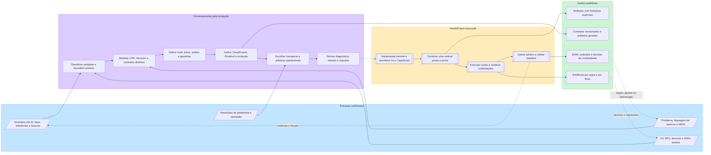

### Leitura construtiva

| Estágio | Entrada | Processamento | Saída |
|---------|---------|---------------|-------|
| Fundação factual | Repositórios, práticas, ausência e evidência | Separar `Fato`, `Inferência` e `Lacuna` | Baseline candidato e deltas explícitos |
| Fundação normativa | P0, blocos, bounded contexts e âncoras | Tornar cada obrigação decidível, com owner e fronteira | Regras com ID estável e sem segunda fonte de verdade |
| Desenho executável | Casos de uso, contratos e failure modes | Definir fluxo, estados, contenção e observabilidade | Especificação implementável por stack |
| Prova | Regra e modo de verificação | Diagnóstico, positivo, negativo, cenário e oráculo | Evidência discriminatória, ou `não verificado` |
| Adoção | Vertical candidata, BOM e gates | Certificar combinação, operar piloto e medir delta | Decisão formal de continuidade |

## 2. Uma vertical pelos seis blocos arquiteturais

As setas sólidas abaixo representam chamada ou fluxo de dados em runtime. As
setas tracejadas com `usa contrato` representam dependência sobre o wire. Elas
não são uma cópia da matriz de imports da RFC. Em particular, a UPR não recebe
Protobuf, contexto de execução, provider ou transporte.

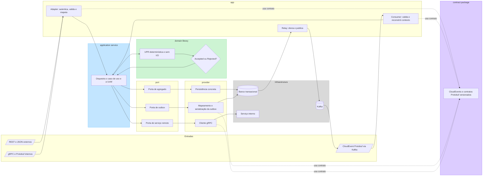

O desenho separa três modelos que evoluem em ritmos diferentes:

```text
mensagem de domínio  !=  request/response de aplicação  !=  contrato de wire
```

O mapeamento `domain event -> integration event` ocorre fora da UPR. Na escrita
assíncrona, o provider da outbox faz o mapeamento e a serialização dentro da
transação, congelando os bytes contemporâneos ao fato.

## 3. Chamada síncrona interna por gRPC

O fluxo mostra um caso de uso de escrita. Para consulta, a UoW de escrita e a
outbox não entram. O request Protobuf é traduzido na borda; a UPR recebe tipos e
valores de domínio já resolvidos.

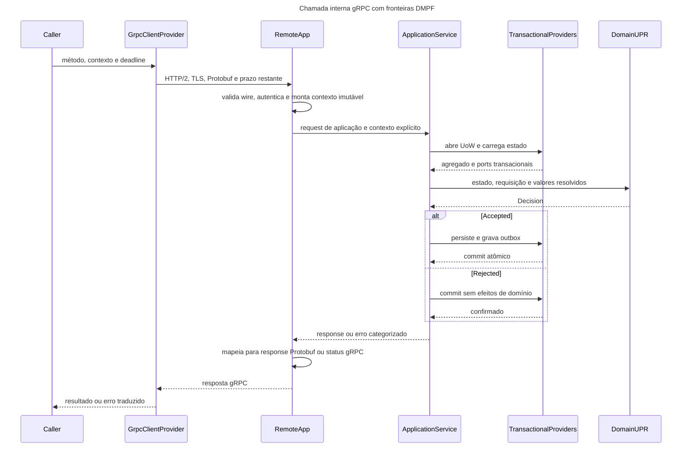

Regras que governam o fluxo:

- o deadline é obrigatório, propaga-se de forma monotônica e não é reiniciado;
- no wire gRPC trafega a duração restante; no contexto de execução vive o
  instante absoluto;
- cancelamento interrompe trabalho pendente, mas não desfaz efeito já commitado;
- retry automático só existe para método comprovadamente idempotente, erro
  retentável, orçamento e prazo suficientes;
- `Rejected` carrega uma `Rejection` tipada da `Decision`; a borda a classifica
  como `DomainRejection` e a representa em código gRPC;
- Protobuf existe no wire e no `contract package`, nunca como estado ou mensagem
  da UPR.

## 4. Escrita, outbox, relay e publicação em Kafka

O broker não participa da transação do caso de uso. Estado de negócio e intenção
de publicação tornam-se visíveis juntos; a publicação ocorre depois, por outro
processo.

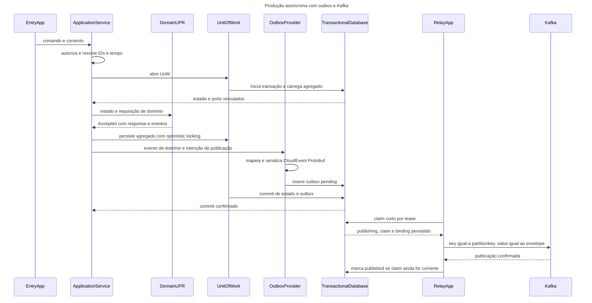

Na janela entre a confirmação do Kafka e a marcação `published`, um crash causa
republicação. Essa duplicata é prevista pela semântica `at-least-once`; o
consumidor deve absorvê-la. O endereço concreto do tópico é estado persistido
antes do primeiro I/O, para que uma tentativa incerta não seja repetida em outro
transporte ou tópico após recarga de configuração.

## 5. Consumo Kafka, inbox e ACK depois do commit

O primeiro corte acontece antes da UoW: envelope inválido, schema desconhecido ou
limite de forma violado vai para contenção e nunca recebe uma disposição da
inbox. O segundo corte acontece dentro da UoW, pela classificação R1 a R4.

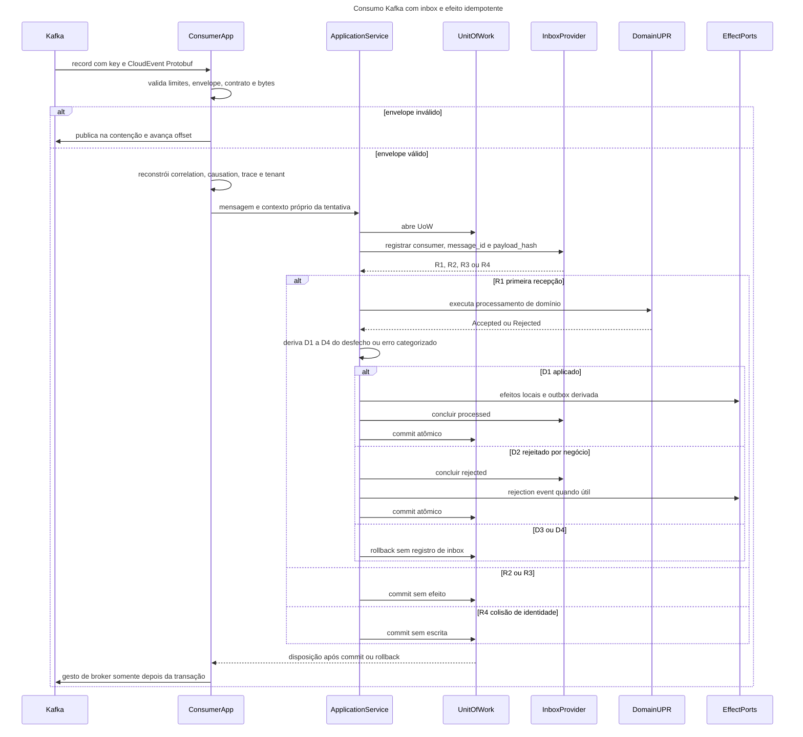

| Disposição | Transação local | Gesto Kafka |
|------------|-----------------|-------------|
| `R1xD1` | commit com `processed`, efeitos e outbox derivada | commit de offset |
| `R1xD2` | commit com `rejected`; rejection event no máximo uma vez | commit de offset |
| `R1xD3` | rollback, sem linha de inbox | retry inline, ou `pause` e `seek`; sem avanço do offset |
| `R1xD4` | rollback, sem linha de inbox | publica na DLQ e só então avança o offset |
| `R2` | commit sem escrita; efeito já aplicado | commit de offset |
| `R3` | commit sem escrita; não reemite rejection event | commit de offset |
| `R4` | commit sem escrita; payload divergente não é aplicado | publica na contenção e só então avança o offset |

`consumer_name` é identidade lógica do consumidor, não o nome do grupo Kafka.
O contexto reconstruído não ganha `authenticated_subject` a partir do envelope:
o consumidor autoriza com a identidade do próprio workload, e o sujeito original
é apenas proveniência.

## 6. Estados e decisões operacionais

### 6.1 Registro de outbox

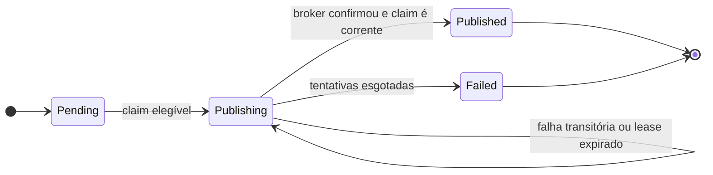

O laço em `Publishing` representa permanência de estado e nova elegibilidade por
`available_at` e `locked_until`; ele **não** representa escrita de volta para
`pending`. `Failed` é terminal para o ciclo automático e só sai por operação
auditada. Uma transição final só é aceita se `locked_by` ainda identifica o claim
corrente.

### 6.2 Classificação da inbox e as sete disposições

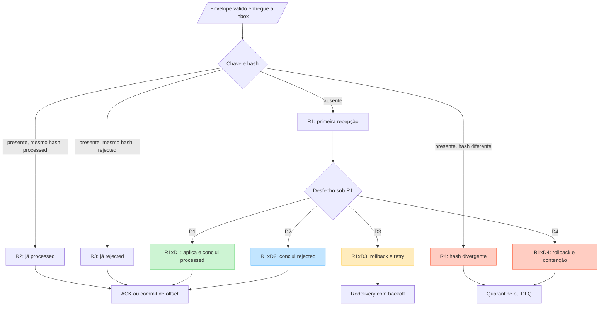

A inbox persistida não tem estado `processing`: ou a UoW commita uma linha
terminal `processed`/`rejected` junto com os efeitos, ou faz rollback e a linha
não existe.

## 7. Contratos Protobuf e governança Buf

### 7.1 Entrada, processamento e saída de uma mudança de contrato

```mermaid
flowchart LR
    proposal[/PR com .proto, motivo e owner/]
    format[buf format]
    lint[buf lint STANDARD]
    baseline{Baseline estabelecido?}
    bootstrap[Bootstrap autorizado por terceiro]
    breaking[buf breaking contra referência protegida]
    generate[Gerar Go e TypeScript duas vezes]
    oracles{Reprodutível e sem drift?}
    fixture[Golden fixture de evento]
    review[Revisão do owner do bounded context]
    merge[Merge com proto e gerados no mesmo commit]
    go[/gen/go/]
    ts[/gen/ts/]
    contracts[/Contrato versionado e fixture única/]

    proposal --> format --> lint --> baseline
    baseline -->|não, primeiro conteúdo| bootstrap --> generate
    baseline -->|sim| breaking --> generate
    generate --> oracles
    oracles -->|não| proposal
    oracles -->|sim| review --> fixture --> merge
    merge --> go
    merge --> ts
    merge --> contracts

    style proposal fill:#C2E5FF,stroke:#3DADFF
    style bootstrap fill:#FFECBD,stroke:#FFC943
    style merge fill:#CDF4D3,stroke:#66D575
```

O produto do mapeamento assíncrono é `io.cloudevents.v1.CloudEvent` com
`proto_data` em `google.protobuf.Any`. O `payload_hash` v1 é SHA-256, em
hexadecimal minúsculo, calculado sobre `Any.value` exatamente como transportado,
sem desserializar ou reserializar. Um Schema Registry de runtime é condicional a
ADR; não substitui Buf como autoridade local, nem vira pré-requisito de
desserialização.

### 7.2 Bootstrap do baseline Buf

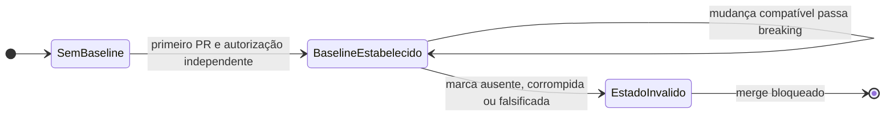

A ausência de baseline só dispensa `buf breaking` no bootstrap verdadeiro. Format,
lint e geração continuam obrigatórios. Depois da transição, não existe caminho de
volta para `sem baseline`.

## 8. A construção da prova

### 8.1 Pirâmide de testes

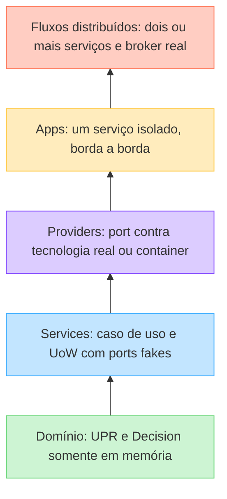

O custo e a infraestrutura crescem para cima; a quantidade de testes deve crescer
para baixo. Só a camada distribuída prova redelivery real, corrida de inbox, ordem
de ACK e efeito idempotente sob `at-least-once`.

### 8.2 Regra até evidência

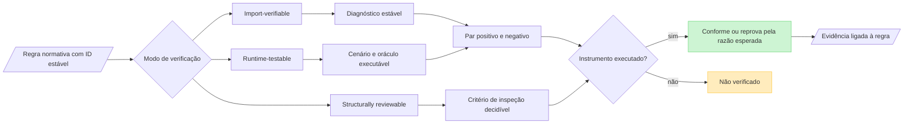

Um positivo sozinho não prova a regra: um mecanismo que aprova tudo também passa
em todos os positivos. O negativo mínimo, com o diagnóstico esperado, é o que
distingue uma implementação correta de uma permissiva. Para round-trip Go e
TypeScript, os três oráculos são reportados separadamente: equivalência semântica,
igualdade do `payload_hash` da mesma mensagem e identidade de bytes apenas no
escopo que exige preservação.

### 8.3 Resiliência e observabilidade na fronteira de I/O

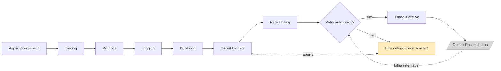

O retry só é autorizado quando erro retentável, operação idempotente ou efeito
ausente, orçamento e prazo remanescente são simultaneamente verdadeiros. Ele
repete a operação remota específica, nunca o caso de uso inteiro. Timeout,
breaker, bulkhead, retry e sinais são compostos no `app`/`provider`; nenhum
decorator entra em `domain` ou `port`. A telemetria acompanha três fluxos: entrada
síncrona e commit da outbox, drenagem pelo relay, e consumo com inbox e ACK.

## 9. Governança, certificação e pilotos

### 9.1 Máquina de estados de uma entrada do BOM

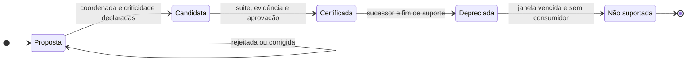

Uma combinação `certificada` referencia evidência imutável por URI e digest,
declara `compatible_with`, aprovador, data e validade. O BOM referencia os
registros autoritativos de contrato, toolchain e telemetria; não copia os valores
normativos desses registros. Validade expirada ou troca de biblioteca exige nova
execução e recertificação; a evidência anterior não é reaproveitada.

### 9.2 Piloto como ciclo de aprendizagem

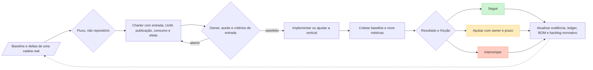

O baseline distingue `medido`, `não medido`, `não existe` e `a coletar`;
`não medido` é estado da coleta, nunca valor de partida — o campo
`baseline_value` permanece ausente enquanto o status não for `medido`.
A seleção vigente usa dois fluxos para cobertura
dual-stack, não como prova de interoperabilidade. A especificação de faseamento
`ADO-01` a `ADO-08` está escrita, mas sua força permanece suspensa até a ampliação
do escopo da ANC-09; o diagrama não a apresenta como norma vigente.

## 10. Matriz de rastreabilidade visual

| Vista | Fontes donas principais | O que a vista demonstra |
|-------|-------------------------|--------------------------|
| §1 — método construtivo | [FND-01](./inventario-as-is.md), [RFC](./rfc-dmpf-foundation-v0.1.md), FND-03 a FND-10 e [ledger](./reconciliacao.md) | Entrada factual, decisão normativa, handoff, prova e feedback |
| §2 — seis blocos | RFC §4, §5 e §7; [FND-03](./upr-decision-mensagens.md) §4 e §6; [FND-04](./uow-inbox-outbox.md) §2 | Fronteiras entre domínio, aplicação, portas, providers, app e wire |
| §3 — gRPC | [FND-06](./politicas-transporte.md) §8 e §10; [FND-07](./contexto-erros-seguranca.md) §3, §5 e §6; FND-03 §2 a §4 | Protobuf no wire, contexto explícito, deadline e Decision |
| §4 — produção Kafka | FND-04 §2 a §5; [FND-05](./cloudevents-protobuf-buf.md) §3 a §5; FND-06 §4, §5 e §11 | Atomicidade local, serialização na escrita e publicação posterior |
| §5 — consumo Kafka | FND-04 §6 e §7; FND-06 §6, §11 e §13; FND-07 §3.6 e §6 | Inbox, sete disposições, contexto reconstruído e ACK após commit |
| §6 — estados | FND-04 §4.2, §5, §6.1 e §6.4 | Estados persistidos e decisões que não devem virar estados falsos |
| §7 — Protobuf e Buf | FND-05 §4 a §8; [FND-09](./testes-interop.md) §5 e §6 | Evolução, bootstrap fail-closed, geração e round-trip |
| §8 — prova | FND-09 §2, §4, §8, §10 e §13 | Pirâmide, diagnóstico, vetores, cenários e `não verificado` |
| §8.3 — runtime transversal | [FND-08](./resiliencia-observabilidade.md) §3 a §6 e §10 | Composição de resiliência, retry conjuntivo e sinais dos três fluxos |
| §9 — governança | [FND-10](./governanca-bom-pilotos.md) §3, §4, §6 e §7; ledger | Certificação, piloto mensurável e decisão de continuidade |

## 11. Resumo de decisões que os diagramas não podem apagar

1. A semântica assíncrona é `at-least-once` com efeitos idempotentes; não há
   promessa de `exactly-once` fim a fim.
2. Inbox deduplica a mesma mensagem durante a sua retenção; idempotência de efeito
   por chave natural é outra camada e é permanente.
3. Estado de negócio e outbox commitam juntos; broker e banco nunca formam uma
   transação distribuída.
4. ACK, delete ou commit de offset ocorre depois do desfecho da transação local.
5. O payload que alimenta a inbox preserva `Any.value` byte a byte; reserialização
   pode transformar redelivery legítima em R4.
6. gRPC é o padrão síncrono interno quando as duas pontas são da organização;
   Kafka é o alvo prospectivo para evento interno novo, sujeito à revisão de
   infraestrutura; SNS/SQS continua normatizado para o acervo e casos próprios.
7. Um canal lógico usa um transporte por vez; troca de binding é migração com
   backlog drenado ou transferido, não recarga de configuração.
8. O domínio permanece executável em memória, sem I/O, Protobuf, contexto de
   transporte, logger ou telemetria.
9. Gate verde sem o instrumento adequado não prova conformidade: o resultado
   correto é `não verificado`.
10. Piloto é a cadeia `entrada -> caso de uso -> persistência -> publicação ->
    consumidor -> efeito`, nunca o repositório inteiro.
