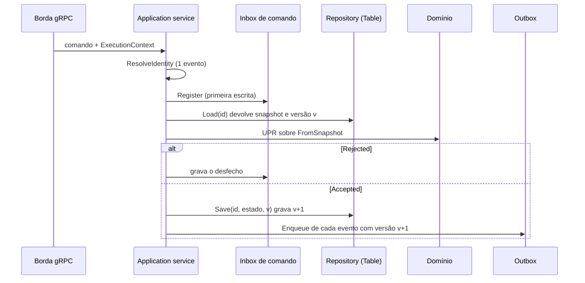
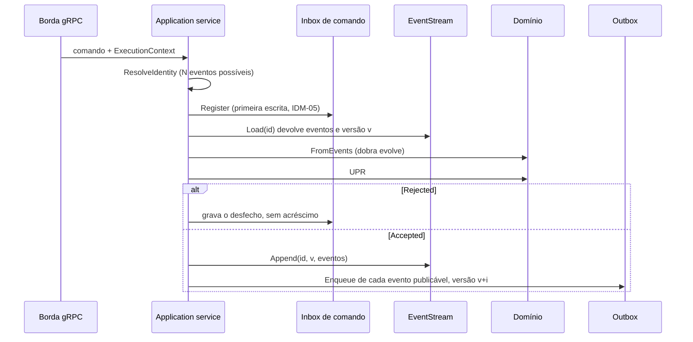

# Event Sourcing no DMPF — análise e proposta de design

> **Status:** parecer de design, **não normativo**. Nada aqui obriga: em conflito,
> vale a norma do acervo. As regras de §6 são **propostas** e só passam a valer se
> forem aceitas por ADR e spec próprias.
>
> **Pergunta:** como incluir Event Sourcing (ES) no framework DMPF sem revogar
> nenhuma regra vigente e sem impô-lo aos contextos que não o adotarem?
>
> **Data:** 2026-10-04 | **Base:** `develop` em `8f544bc0` | **Fontes:** §12.

## Convenção deste documento

- Normas são citadas pela âncora semântica (`FND-03 §7.4`, `ESC-05`), como manda
  o README do acervo.
- Código é citado por **símbolo e caminho**, sem número de linha. Por exemplo,
  `postgres.Table` em `libs/backend/go/postgres/table.go`. O símbolo sobrevive à
  edição do arquivo; a linha, não.
- "Contexto" é bounded context. "Fluxo" é o *stream* de eventos de um agregado,
  como em FND-03 §7.4.
- **Marcado como [inferência]:** o que este parecer conclui sem que a norma o diga.

---

## §1. Resumo executivo

1. **A norma já autoriza ES.** FND-03 §7 o define como extensão opt-in:
   - `ESC-01` e `ESC-03`: estado é o padrão, e a adoção é decisão de cada contexto;
   - `ESC-02`: ES não flexibiliza nenhuma regra de UPR, desfecho ou mensagem.
   - O que falta é a **mecânica**, que FND-03 §7.4 encaminha à aplicação e à
     infraestrutura, com a parte transacional entregue a FND-04. FND-04 não tem
     texto algum sobre ES.
2. **O kernel cobre metade do caminho sem mudança.** Já servem como estão:
   - `Accepted[R]` como desfecho de `decide`;
   - `ports.Version` com `ErrVersionConflict`, que é a semântica de "acréscimo com
     versão esperada";
   - `UnitOfWork` como transação única;
   - outbox, relay, inbox e `RunIdempotent` como caminho de integração e de
     idempotência.
3. **A outra metade não existe.** Faltam:
   - uma porta de fluxo;
   - um adaptador Postgres escopado por tenant;
   - um codec bidirecional de evento de domínio;
   - a função `evolve` por agregado;
   - uma suíte de conformidade de provider;
   - a política de evolução de esquema de evento.
4. **`Repository[ID,S]` e `postgres.Table` não servem.** Os dois são semântica de
   sobrescrita de uma linha por agregado. A outbox também não serve: guarda o
   contrato de integração, não tem tenant (ADR-050) e é pública por natureza
   (`ESC-05`).
5. **Recomendação de localização (Opção A):** estender os módulos existentes em
   vez de criar um módulo novo.
   - `ports.EventStream`;
   - `postgres.Stream` com a capacidade `postgres.EventStore`;
   - o fluxo em `memory`;
   - `providerkit.EventStream`.
   - **Motivo:** o fluxo precisa entrar na mesma transação da outbox. Um módulo
     externo exigiria exportar a conexão de `postgres.Tx` e reabriria o
     *choke point* de tenant do ADR-051.
6. **A UPR não muda.** `decide` continua sendo a UPR atual, que devolve
   `(Accepted[R], *Rejection)`. O contexto event-sourced acrescenta `evolve` e um
   oráculo novo de coerência: aplicar os eventos ao estado anterior reproduz o
   estado que a UPR produziu.
7. **Há três ajustes transversais de aplicação:**
   - a versão do agregado na outbox passa a ser **por evento**;
   - `maxEventsPerCommand` deixa de ser 1 por premissa;
   - o mapper ganha **eventos internos declarados**, para que um evento sem
     contrato de integração não reverta a UoW.
8. **Piloto recomendado: `orders`.**
   - A favor: é o único agregado com histórico real (itens acrescentados e
     fechamento), não tem consulta por coluna e fica fora do golden de
     regeneração.
   - Ressalva: FND-03 §7.6 exige requisito real de replay, auditoria temporal ou
     reconstrução histórica. Esse requisito precisa ser declarado na spec do
     piloto; sem ele, o piloto é verificação de framework e deve dizer isso (§8).
9. **Esforço estimado:** kernel G, tooling M e piloto M, em cinco fases (§9).
   Ficam adiados os marcos de estado (snapshots), as projeções assíncronas com
   posição global e a cifra por titular.
10. **Sete decisões precisam de dono antes da spec** (§10). A primeira é a forma
    normativa: ADR com spec, ou artefato irmão com âncora nova (RFC §12).

---

## §2. Ponto de partida normativo

### §2.1 O que FND-03 §7 já decidiu

| Regra | Conteúdo | Consequência para o design |
|-------|----------|----------------------------|
| `ESC-01` | Nenhuma regra pressupõe ES ou CQRS físico | O kernel só **oferece**; contexto por estado não muda nada |
| `ESC-02` | Adotar ES não revoga regra de FND-03 §2, §3, §5 e §6 | A UPR, o desfecho e a taxonomia de mensagens ficam intactos |
| `ESC-03` | A adoção é do contexto e não se impõe a outros | Opt-in por contexto, nunca por kernel nem por template padrão |
| `ESC-04` | Rejeição não é sequência vazia de eventos | `Rejected` nunca acrescenta ao fluxo |
| `ESC-05` | A durabilidade não torna o evento contrato público | O fluxo é privado; a integração continua pela conversão de FND-03 §6.3 |
| `ESC-06` | Manter eventos antigos legíveis não versiona o evento de domínio no sentido de FND-03 §6.4 | O upcasting é privado do provider, sem versão no nome |
| `ESC-07` | Query não exige carregar o alvo nem executar UPR | A leitura pode vir de modelo derivado |
| `ESC-08` | Query respondida por UPR obedece a FND-03 §2 | Sem mudança |
| `ESC-09` | Separar escrita e leitura é lógico por padrão; o físico é decisão de contexto | Projeção assíncrona é opt-in dentro do opt-in |

FND-03 §7.2 fixa as duas modalidades:

- `decide(estado, comando) -> Decision` é uma UPR;
- `evolve(estado, evento) -> estado` é código de domínio puro.

A assinatura `decide -> events` da Parte-1 é recusada, porque não tem onde pôr a
resposta nem o ramo `Rejected`.

### §2.2 O que FND-03 §7.4 encaminhou sem dono

FND-03 §7.4 encaminha a mecânica de persistência à aplicação e à infraestrutura:
acréscimo ao fluxo, marcos de estado, controle de versão e leitura de eventos
gravados sob forma antiga. A parte transacional vai a FND-04. FND-04 §3.2 ainda
descreve o passo 6 como "persiste o agregado" e não menciona fluxo. Essa lacuna é
o objeto deste parecer.

### §2.3 Quando adotar

FND-03 §7.6 recepciona Parte-1 §5.4: ES só se justifica com **replay** de
decisões, **auditoria temporal** ou **reconstrução histórica**. Notificar outros
contextos, rastrear para depurar e uniformizar estilo **não** justificam. Este
critério condiciona a escolha do piloto (§8).

### §2.4 Restrições duras que o design herda

| Restrição | Fonte | Consequência |
|-----------|-------|--------------|
| Domínio puro, sem I/O, sem erro não tipado, sem `panic`, sem `encoding/*` | RFC §2.3 (P0-1), FND-03 §2.2, ADR-018, `.golangci.yml` | `evolve` é total e puro; o codec mora no provider |
| O agregado não guarda coleção de eventos pendentes; o desfecho é o único canal | `DEC-07`, `DEC-08`, oráculo `ORA-37` em `testkit/domainkit` | Fica proibido o `AggregateRoot` clássico com `PullEvents()` |
| Uma transação local, um recurso; estado e outbox commitam juntos; sem retry automático | FND-04 §3.2, FND-04 §3.3 (`UOW-01`, `UOW-02`, `UOW-09`, `UOW-10`) | Fluxo e outbox no mesmo banco e na mesma UoW |
| Mapeamento de evento no provider, serializado na escrita | FND-04 §2.2 (`BLK-03`) | O codec do fluxo e o mapper de integração são do provider do contexto |
| A inbox é o único registro de idempotência de comando; o registro é a primeira escrita | ADR-056, FND-04 §7.6 (`IDM-05`) | A versão esperada do fluxo é concorrência, não idempotência (`GAR-03`) |
| Escopo de tenant que não dependa de convenção; SQL só no kernel | FND-07 §4.4 (`IDN-11` a `IDN-14`), ADR-051 (gate `context-provider` nega `pgx`) | A tabela de eventos tem `tenant_id` na chave, e o SQL é escrito pelo kernel |
| Só `outbox`, `inbox` e `quarantine` são isentas de tenant | ADR-050 | **[inferência]** O fluxo é dado de negócio e fica sob `IDN-11` |
| Layout canônico, DDL por capacidade, nomes de tabela sem prefixo | ADR-048, ADR-053 | O DDL do fluxo é capacidade do kernel, com tabela `events` |
| Libs só de kernel de reuso | ADR-046 | Sobe o que é igual por natureza (porta, adaptador, suíte); `evolve` fica no contexto |
| Retenção com teto e purga registrada; cifra em repouso | FND-07 §8.3, FND-07 §8.5 (`DAT-08`, `DAT-14` a `DAT-18`) | Fluxo imutável e dado pessoal entram em tensão (§5.12) |

---

## §3. Estado atual do kernel

### §3.1 O fluxo de escrita de hoje



### §3.2 O que já serve a ES sem mudança

| Peça | Onde | Por que serve |
|------|------|---------------|
| Desfecho `Accepted[R]` e `Rejection` | `libs/backend/go/domain` (`Accept`, `Accepted.Events`) | É o contrato de `decide`; `Events()` é exatamente o que um acréscimo consome |
| Concorrência otimista | `ports.Version`, `ErrVersionConflict`, `ErrAlreadyExists` | Já é a semântica de versão esperada; `expected == 0` cria |
| Transação única | `ports.UnitOfWork[R]`, `postgres.NewUnitOfWork` com `bind` | Um recurso novo entra em `R` e commita com a outbox |
| Identidade antes da transação | `application.ResolveIdentity` (`OccurredAt`, `MessageIDs`) | Fornece o id e o instante de cada evento gravado |
| Idempotência de comando | `application.RunIdempotent`, `postgres.Tx.CommandInbox` | Fica intacta (ADR-056) |
| Integração | `ports.Outbox`, `postgres.EventMapper`, `app/relay`, `app.Consumer` | O caminho público continua o mesmo (`ESC-05`) |
| Escopo de tenant | `tenantOf`, `ErrTenantUnresolved`, `ports.CrossTenantAccess` em `postgres/table.go` | É o padrão a reproduzir no adaptador de fluxo |
| DDL por capacidade | `postgres.Capability`, `postgres.Migrate`, `tb/pg` | Acomoda uma capacidade `EventStore` |
| Molde de suíte de conformidade | `providerkit.Repository` e `Verdict` | Serve de molde para `providerkit.EventStream` (FND-09 §8.1.1) |

### §3.3 O que falta

| Peça | Situação hoje |
|------|---------------|
| Porta de fluxo (carregar e acrescentar) | Inexistente; `Repository[ID,S]` é sobrescrita de estado |
| Adaptador Postgres de fluxo | Inexistente; `Table` assume uma linha por `(tenant, id)` |
| Codec bidirecional de evento de domínio | Inexistente; `EventMapper` só vai de domínio para proto de integração |
| `evolve` e reidratação por eventos | Inexistentes; só há `FromSnapshot` |
| Evolução de esquema de evento gravado | Inexistente; `EventName()` estável é o único discriminador (`MSG-N02`, `MSG-N03`) |
| Projeções e reconstrução | Inexistentes; não há posição global nem *subscription* |
| Marcos de estado | Inexistentes |
| Oráculo de `evolve` | Inexistente; `ORA-30` a `ORA-40` cobrem o desfecho, não a coerência com `evolve` |

---

## §4. Riscos de acoplamento que dirigem o desenho

1. **`Repository[ID,S]` é sobrescrita.** `Save(state, expected)` não expressa
   acréscimo, e forçar o fluxo nessa interface esconderia a semântica. É preciso
   uma porta própria.
2. **`postgres.Table` é de uma linha.** O `UPDATE ... WHERE version = $3` não se
   aplica a N linhas por agregado. Nenhum statement é reaproveitável, e o ADR-051
   obriga o SQL novo a nascer no kernel.
3. **A outbox não é event store.** Ela guarda o proto de integração congelado,
   não tem `tenant_id` (ADR-050) e não tem unicidade por
   `(aggregate_id, aggregate_version)`. Sua claim ordena globalmente por
   `available_at, id`. Usá-la como fluxo violaria `ESC-05`.
4. **O mapper reverte evento sem contrato.** `EventMapper.Map` devolve
   `ErrUnmappedEvent` para evento não registrado, e a UoW reverte. Um fluxo guarda
   eventos internos que não são de integração (por exemplo, a abertura de um
   pedido com o limite de itens), e hoje todo evento passado a `Enqueue` precisa
   ter proto.
5. **"Um evento por comando" está embutido nos contextos.**
   `maxEventsPerCommand = 1` aparece em `orders`, `bookings` e `reservations`, e
   `enqueueAll` grava a mesma versão (`stored+1`) em todos os eventos. Sob ES, a
   versão é por evento.
6. **O `AggregateRoot` clássico colide com o kernel.** Um agregado que acumula
   eventos e expõe `PullEvents()` reprova `ORA-37` no `domainkit` e viola
   `DEC-08`. O desfecho continua sendo o único canal.
7. **O tenant muda de natureza.** A outbox é tabela de plataforma (ADR-050); o
   fluxo é dado de negócio, com tenant na chave e sonda de acesso cruzado.
8. **Posição global é ordenada por inserção, não por commit.** Sob
   `ReadCommitted` (`postgres.NewUnitOfWork`), um leitor por posição global pode
   pular eventos de transações concorrentes. Isso adia as projeções assíncronas
   (§5.10).
9. **Não há trilho de migração.** `postgres.Migrate` é só `IF NOT EXISTS`, e o
   ADR-053 recusou migração versionada. O esquema da tabela de eventos precisa
   nascer estável.
10. **Dois termos colidem.**
    - *Snapshot* já significa o estado `jsonb` do ADR-053 e o `FromSnapshot` do
      domínio.
    - *Replay* já significa reprocessar DLQ ou quarantine em FND-04 §7.4.
    - O §11 fixa o vocabulário.
11. **`aggregateversion` é `int32` no envelope.** O relay recusa versão acima de
    `math.MaxInt32` (`relay.ErrAggregateVersionOutOfRange`). Com várias versões
    por comando o teto chega mais cedo, embora continue distante na prática.

---

## §5. Proposta de design

### §5.1 Princípios

1. **Opt-in por contexto e por agregado.** Nenhum símbolo novo é exigido de quem
   não adota (`ESC-01`, `ESC-03`).
2. **A UPR não muda.** `decide` é a UPR atual, e ES acrescenta `evolve` sem tocar
   no desfecho (`ESC-02`).
3. **O fluxo é privado.** Sua forma gravada é do provider, e a integração continua
   pela outbox (`ESC-05`, `ESC-06`).
4. **O SQL é do kernel e o tenant está na chave** (ADR-051, `IDN-14`).
5. **Uma transação.** Inbox de comando, fluxo e outbox commitam juntos
   (`UOW-01`).
6. **Começar pelo mínimo certificável.** Marcos de estado, projeção assíncrona e
   cifra por titular entram quando houver necessidade medida.

### §5.2 Decisão D1 — onde a capacidade mora

| Critério | **Opção A — estender módulos existentes** (recomendada) | Opção B — módulo novo `libs/backend/go/eventsourcing` |
|----------|---------------------------------------------------------|-------------------------------------------------------|
| Atomicidade com a outbox | Natural: `postgres.Stream` usa a conexão de `postgres.Tx`, como `Table` | Exige exportar a conexão de `postgres.Tx`, o que reabre o *choke point* de tenant (ADR-051) |
| Atomicidade em memória | O fluxo entra na cópia de `memory.Tx` ao abrir e no commit | Exige gancho público em `memory.Tx` |
| Manifesto e baseline | Sem unidade nova: tipos novos em unidades existentes | Unidade nova, `--write-baseline` e entrada em `shared_kernel_units` |
| Superfície de `ports` | Cresce em uma interface e um tipo | Inalterada |
| Leitura de `ESC-03` | **[inferência]** Uma porta opcional não impõe adoção; ratificar no ADR | Isolamento máximo |

A Opção A vence pelo critério que não admite troca: a atomicidade de `UOW-01` sem
abrir o driver. O custo, uma interface a mais em `ports`, é declarativo e não
cria dependência nova para quem não usa.

### §5.3 Decisão D2 — a porta

Esboço em `libs/backend/go/ports/stream.go`, com capacidade `pure`:

```go
type Recorded struct {
	ID         MessageID
	OccurredAt Instant
	Event      domain.DomainEvent
}

type EventStream[ID comparable] interface {
	Load(ctx context.Context, id ID) ([]domain.DomainEvent, Version, error)
	Append(ctx context.Context, id ID, expected Version, events []Recorded) error
}
```

- `Version` é a posição do **último** evento do fluxo; zero significa fluxo
  inexistente. Um acréscimo de N eventos sobre `expected` grava as posições de
  `expected+1` a `expected+N`.
- `Append` com `expected` divergente devolve `ErrVersionConflict` e não grava
  nada. A distinção com `ErrAlreadyExists` continua sendo do caso de uso, como em
  `Repository.Save`.
- O `ID` do evento gravado é o mesmo `MessageID` que a outbox usa quando o evento
  é publicado. Assim, o `id` CloudEvents rastreia de volta à linha do fluxo.
- `Load` sem eventos devolve `ErrNotFound`, e o caso de uso decide a criação, como
  faz hoje com `loadOrCreate`.
- Fica de fora do MVP uma leitura parcial (`LoadFrom(id, after Version)`), que só
  os marcos de estado exigem (§5.11).

### §5.4 Decisão D3 — realização Postgres

`postgres.Stream[ID ~string]` é análogo a `postgres.Table`. O contexto declara o
tipo do fluxo e o codec; o kernel escreve todo o SQL:

```go
type EventCodec interface {
	Encode(event domain.DomainEvent) (name string, schema int, payload []byte, err error)
	Decode(name string, schema int, payload []byte) (domain.DomainEvent, error)
}

type Stream[ID ~string] struct {
	Type  string
	Codec EventCodec
}

func (s Stream[ID]) Repository(tx *Tx) ports.EventStream[ID]
```

Uma nova capacidade, `postgres.EventStore`, traz o DDL embutido, ao lado de
`Outbox` e `Inbox`:

```sql
CREATE TABLE IF NOT EXISTS events (
    tenant_id      text        NOT NULL,
    stream_type    text        NOT NULL,
    stream_id      text        NOT NULL,
    version        bigint      NOT NULL,
    event_id       text        NOT NULL,
    event_name     text        NOT NULL,
    schema_version integer     NOT NULL,
    payload        jsonb       NOT NULL,
    metadata       jsonb       NOT NULL,
    occurred_at    timestamptz NOT NULL,
    recorded_at    timestamptz NOT NULL DEFAULT now(),
    CONSTRAINT events_pkey PRIMARY KEY (tenant_id, stream_type, stream_id, version),
    CONSTRAINT events_event_id_key UNIQUE (event_id)
);
```

- **Uma tabela por banco de contexto.** O banco já é por app (ADR-053), e
  `stream_type` separa os agregados. O nome segue ADR-053, item 2, e entra no
  conjunto de tabelas do kernel que `tools/dmpf-context-check.sh` proíbe no DDL do
  contexto.
- **Acréscimo.** Um único `INSERT ... SELECT` grava as N linhas, condicionado a
  `coalesce(max(version), 0) = expected` no mesmo statement. Os desfechos:
  - zero linhas: `expected` está à frente do fluxo, e o retorno é
    `ErrVersionConflict`;
  - violação de `events_pkey`: corrida entre transações com o mesmo `expected`, e
    o retorno também é `ErrVersionConflict`. O kernel já reconhece violação de
    unicidade (`isUniqueViolation`, em `postgres/outbox.go`);
  - violação de `events_event_id_key`: defeito de identidade, e o erro é
    devolvido sem tradução.
- **Tenant.** O kernel escreve o predicado e a chave; sem tenant no portador, o
  resultado é `ErrTenantUnresolved`. Um fluxo existente em outro tenant devolve
  `CrossTenantAccess`, pela mesma sonda de `Table`.
- **Metadados.** Para o fluxo bastam `correlationid`, `causationid` e
  `traceparent`, extraídos do portador como em `encodeMetadata`. O tenant já está
  na coluna.
- **Observabilidade.** Cada statement novo é declarado em `declare()`
  (`postgres/dbtrace.go`), como exige FND-08.
- **Payload.** Recomenda-se `jsonb`, com DTO privado do provider e tags estáveis,
  o mesmo padrão do `snapshot` do ADR-053. Protobuf daria ao evento interno a
  aparência de contrato versionado, que é o que `ESC-06` afasta.

### §5.5 Decisão D4 — realização em memória

`memory.Store` ganha os fluxos por chave `(tenant, tipo, id)`, incluídos na cópia
que `memory.Tx` faz ao abrir e no commit. Assim o rollback descarta o acréscimo,
como já descarta as tabelas.

- **Custo.** A cópia integral por transação cresce com o volume de eventos, o que
  é aceitável para testes.
- **Concorrência.** `txMu` serializa as transações. O conflito concorrente se
  prova na suíte Postgres; em memória, injeta-se com um dublê, como já faz
  `orders/application/doubles_test.go`.

### §5.6 Decisão D5 — o domínio do contexto event-sourced

A UPR é a de hoje. O contexto acrescenta duas coisas:

```go
func evolve(s Snapshot, e kernel.DomainEvent) Snapshot

func FromEvents(events []kernel.DomainEvent) *Order
```

- **`evolve` é total e puro.** É um `switch` sobre o conjunto fechado de eventos
  do agregado, sem erro, sem `panic` e sem relógio (UPR-L). O evento desconhecido
  nunca chega ao domínio, porque o codec o recusa no provider.
- **`FromEvents` dobra `evolve` sobre o estado inicial.** É o par de
  `FromSnapshot`; não executa UPR nem produz evento.
- **Invariante de coerência (proposta `EVS-06`).** Para todo desfecho `Accepted`,
  dobrar `evolve` sobre o estado anterior e os eventos do desfecho produz o mesmo
  estado que a UPR produziu ao mutar o receptor. É o que permite manter a UPR
  intacta e ainda garantir que reidratar e decidir não divergem.
- **Todo campo de estado nasce de um evento.** No piloto `orders`, `itemLimit`
  não está em evento algum, e a criação é implícita (`loadOrCreate`). Sob ES, a
  abertura precisa ser um evento interno (`OrderOpened{Order, ItemLimit, At}`).
  Há duas saídas, a decidir na spec do piloto:
  - a primeira UPR emite dois eventos;
  - existe um comando explícito de abertura.

### §5.7 Decisão D6 — o caso de uso



- **A sequência canônica é a de FND-04 §3.2.** O passo 6 passa a ser lido como
  "acrescenta ao fluxo", e os passos 6 e 7 commitam juntos.
- **A versão é por evento.** A versão publicada em `aggregate_version` é a posição
  do evento no fluxo (`v+i`), não a do comando. `enqueueAll` passa a receber a
  versão base e a incrementar por evento.
- **A identidade cobre N eventos.** `maxEventsPerCommand` é o máximo que a UPR
  pode emitir, e `ResolveIdentity` resolve N identificadores. A guarda atual
  continua valendo, pois produzir mais eventos que identificadores é defeito de
  programação.
- **O retry é política do caso de uso.** Ao receber `ErrVersionConflict`, quem
  decide é o caso de uso, como hoje (`UOW-09`, `UOW-10`).
- **A idempotência não muda.** A inbox de comando continua sendo o único registro
  (ADR-056). A versão esperada do fluxo é concorrência, não deduplicação
  (`GAR-03`).

### §5.8 Decisão D7 — integração e eventos internos

- **Eventos internos declarados.** O `EventMapper` do contexto passa a declarar
  quais eventos são internos. `Outbox.Enqueue` trata o evento declarado interno
  como nada a enfileirar, e o evento **desconhecido** continua revertendo a UoW
  com `ErrUnmappedEvent`. A garantia atual ("o que ninguém pode publicar não chega
  à outbox") se preserva, e o fluxo pode guardar o que não é de integração.
- **Por que no provider.** A decisão de publicar é do provider, porque a conversão
  de FND-03 §6.3 mora lá. O domínio não marca eventos como publicáveis, pois isso
  seria vocabulário de transporte no domínio (`MSG-N03`).
- **Lacunas em `aggregateversion`.** Com eventos internos, a sequência publicada
  tem lacunas (a posição 1 é interna, a posição 2 sai como versão 2). A proposta
  `EVS-13` declara a semântica: monotônica por agregado, com lacunas admitidas.
  Nenhum consumidor detecta lacunas hoje: `aggregateversion` só é gravado,
  empacotado e lido em teste. A declaração explícita evita que um consumidor
  futuro presuma contiguidade.

### §5.9 Decisão D8 — codec e evolução do esquema de evento

- **Identidade do evento gravado.** O par `(event_name, schema_version)`
  identifica a forma gravada. `event_name` é o `EventName()` estável, sem versão
  (`MSG-N02`); `schema_version` vive fora do nome, como `ESC-06` permite.
- **Upcasting.** O codec do provider registra um decodificador por par. A leitura
  de uma forma antiga converte para o tipo Go atual. O evento gravado nunca é
  reescrito (proposta `EVS-04`), e o upcasting acontece só na leitura.
- **Prova de legibilidade.** Cada forma já gravada ganha uma fixture de payload
  versionada, e o CI decodifica todas (proposta `EVS-10`). O padrão de fixtures já
  existe em `contract/fixtures`.
- **Mudança incompatível.** Ou ganha decodificador novo, ou exige evento novo com
  nome novo. Nunca há edição do histórico.

### §5.10 Decisão D9 — leitura e projeções

- **Padrão: CQRS lógico.**
  - Consulta por id: carrega o fluxo e dobra `evolve`, fora da UoW e em
    autocommit, como `Table.Reader` faz hoje (FND-04 §3.4).
  - Consulta por coluna: um modelo de leitura em `postgres.Table` atualizado na
    **mesma UoW** do acréscimo. É síncrono, consistente e não precisa de posição
    global. Satisfaz `ESC-07`.
- **Adiado: projeção assíncrona.**
  - É CQRS físico, decisão de contexto por `ESC-09`.
  - Exige posição global ordenada por commit (risco 8 de §4) e checkpoint por
    projeção. Fica para quando um contexto tiver o requisito.
  - Uma projeção que precise atravessar contextos já tem caminho: o
    `Integration event`, consumido por inbox.

### §5.11 Decisão D10 — marcos de estado

- **Adiados.** Só entram com medida, por exemplo o p95 de eventos por fluxo acima
  de um limiar declarado na spec.
- **Natureza.** Quando entrarem, serão cache derivável (proposta `EVS-14`):
  apagá-los não muda desfecho algum, e a forma do estado em cache tem versão
  própria, de modo que uma mudança de forma descarta os marcos antigos.
- **Nome.** O termo é "marco de estado" (FND-03 §7.4), nunca *snapshot* (risco 10
  de §4).

### §5.12 Decisão D11 — retenção e dado pessoal

A imutabilidade do fluxo tensiona com FND-07 §8.5, que impõe teto de retenção com
purga registrada, e com FND-07 §8.3, a cifra em repouso. Nenhuma norma cobre
apagamento em fluxo imutável. Proposta `EVS-12`:

1. O evento gravado não carrega dado sensível no sentido de FND-07 §8.1. Ele
   referencia o titular, e o dado fica em tabela de estado sujeita à purga comum.
2. Se o contexto precisar gravar dado sensível no evento, ele declara o mecanismo
   **antes** de adotar ES. As duas opções são:
   - o expurgo do fluxo inteiro ao atingir o teto;
   - a cifra por titular com destruição da chave (*crypto-shredding*), que fica
     adiada.
3. O expurgo é a única exceção à imutabilidade de `EVS-04`, é feito pelo kernel e
   fica registrado.

### §5.13 Decisão D12 — testes e oráculos

| Camada (FND-09 §2) | O que se acrescenta |
|--------------------|---------------------|
| Domínio | Oráculo de coerência `decide`/`evolve` (`EVS-06`) e de não acréscimo em `Rejected` (`EVS-08`) no `domainkit`, sobre as fixtures de projeção já existentes |
| Services | Dublê de fluxo no `serviceskit`; cenários de conflito de versão e de retry como política do caso de uso |
| Providers | `providerkit.EventStream`, rodado contra `postgres` e `memory`, com cláusulas para: ida e volta; criação com zero; acréscimo de N eventos atômico; ordem preservada; conflito por `expected` atrasado e adiantado; unicidade de `event_id`; tenant ausente, isolado e cruzado; rollback junto da UoW |
| Apps | Ida e volta pela borda do piloto; os contratos publicados não mudam, e o e2e do `bff` segue verde sem alteração (ADR-053, item 6) |
| Fluxos distribuídos | Evento interno não chega ao broker; o evento publicado leva a posição do fluxo em `aggregateversion` |

---

## §6. Regras propostas

As regras abaixo são **propostas**. O prefixo `EVS` está livre no acervo e no
verificador, e a força e o dono dependem da decisão 1 de §10.

| ID | Regra | Modo de verificação | Deriva de |
|----|-------|---------------------|-----------|
| `EVS-01` | Um agregado event-sourced tem o fluxo como **única** fonte de verdade; uma tabela do mesmo agregado só existe como modelo de leitura derivado | structurally reviewable, com check no `dmpf-context-check` | `ESC-02`, FND-03 §7.4 |
| `EVS-02` | O acréscimo ao fluxo ocorre na mesma UoW que registra o comando e enfileira na outbox | runtime-testable | `UOW-01`, FND-04 §3.2 |
| `EVS-03` | O acréscimo declara a versão esperada do fluxo; a divergência devolve `ErrVersionConflict` e não grava nada; não há retry automático | runtime-testable | `UOW-09`, `UOW-10` |
| `EVS-04` | O evento gravado é imutável; o kernel não expõe atualização nem remoção de evento, salvo o expurgo de `EVS-12` | import-verifiable | FND-03 §7.4 |
| `EVS-05` | Todo fluxo é escopado por tenant pelo kernel, com tenant na chave e recusa sem tenant | runtime-testable | `IDN-11` a `IDN-14`, ADR-051 |
| `EVS-06` | Para todo `Accepted`, dobrar `evolve` sobre o estado anterior e os eventos reproduz o estado produzido pela UPR | runtime-testable | `ESC-02`, `DEC-10` |
| `EVS-07` | `evolve` é puro e total sobre o conjunto fechado de eventos do agregado | structurally reviewable, com lint de domínio | UPR-L, RFC §2.3 |
| `EVS-08` | `Rejected` nunca acrescenta ao fluxo | runtime-testable | `ESC-04`, `DEC-11` |
| `EVS-09` | A forma gravada do evento é privada do provider; nenhum contexto lê o fluxo de outro | import-verifiable (`DMPF-D002`) | `ESC-05`, `CTR-03` |
| `EVS-10` | Toda forma de evento já gravada continua decodificável, com fixture por `(nome, versão de esquema)` decodificada em CI | runtime-testable | `ESC-06` |
| `EVS-11` | O evento sem contrato de integração é declarado interno no mapper; o evento desconhecido continua revertendo a UoW | runtime-testable | `BLK-03`, FND-03 §6.3 |
| `EVS-12` | O evento não carrega dado sensível, ou o contexto declara expurgo de fluxo ou cifra por titular antes de adotar ES | structurally reviewable | FND-07 §8.1, FND-07 §8.5 |
| `EVS-13` | O `aggregateversion` publicado por contexto event-sourced é a posição do evento no fluxo, monotônica por agregado e com lacunas admitidas | runtime-testable | FND-04 §2.3 |
| `EVS-14` | O marco de estado, quando existir, é cache derivável: apagá-lo não muda desfecho algum | runtime-testable | FND-03 §7.4 |

---

## §7. Impacto no tooling e na governança

| Área | Onde | Mudança | Esforço |
|------|------|---------|---------|
| Porta | `libs/backend/go/ports` | `EventStream`, `Recorded` | P |
| Adaptador Postgres | `libs/backend/go/postgres` | `Stream`, `EventCodec`, capacidade `EventStore` com `events.sql` embutido, statements em `declare()` | G |
| Mapper | `libs/backend/go/postgres` (`EventMapper`, `Outbox.Enqueue`) | Evento interno declarado, sem enfileirar | P |
| Memória | `libs/backend/go/memory` | Fluxos no `Store`, com cópia e commit em `Tx` | M |
| Suítes | `libs/backend/go/testkit` | `providerkit.EventStream`, oráculos no `domainkit`, dublê no `serviceskit` | M |
| Banco de teste | `libs/backend/go/testkit/tb/pg` | Capacidade nova em `postgres.Tables(caps)` | P |
| Template de spec | `.agents/skills/dmpf-bounded-context/references/template-bounded-context.md` | Campo `Persistência: estado \| event-sourced` em "Borda e persistência"; em ES, a seção de eventos cobre todo campo de estado | P |
| Comando e agente | `.claude/commands/dmpf-new-context.md`, `.claude/agents/dmpf-context-author.md`, `SKILL.md` e `golden-path.md` da skill | Ramo ES condicional; hoje fixam a persistência híbrida | M |
| Regra de contexto | `.claude/rules/dmpf-bounded-context.md`, `AGENTS.md` | "Persistência híbrida" passa a ser o padrão, com ES opt-in | P |
| Generator | `tools/dmpf-plugin` (gerador `bounded-context`: `schema.json`, templates de `schema.sql`, `pool.go` e `wiring.go`) | Opção `persistence`, templates condicionais e caso ES no `dmpf-generator-check.sh` | M |
| Gate de contexto | `tools/dmpf-context-check.sh` | `events` no conjunto de tabelas do kernel; check do contexto ES; sabotagens no self-test | P |
| Detecção declarativa | `docs/nx-reference/tasks.md` | Tag Nx `persistence:event-sourced`, a registrar na taxonomia | P |
| Conformance | `tools/dmpf-conformance` | Nada, se a Opção A for adotada: os tipos novos ficam em unidades existentes, e `ESC-05` já é coberto por `DMPF-D002` | — |
| Harness e evidência | `tools/dmpf-harness-check.sh`, `testkit/cmd/evidence` | Nada no piloto `orders`; parametrizar só se `bookings` virar o piloto | — ou G |
| ADR | `docs/adr/059-*` | Decisão de ES no kernel e emenda do item 4 do ADR-053 (híbrida deixa de ser universal) | P |
| Norma | FND-04 §3.2 ou artefato irmão | Ler o passo 6 como acréscimo ao fluxo; ver a decisão 1 de §10 | P a M |
| BOM | `bom/` | A entrada de kernel segue o release group `go-libs` (ADR-047), sem unidade nova pela Opção A | P |

---

## §8. Contexto piloto

**Recomendado: `orders`.**

- **Histórico real.** É o único agregado com coleção e com histórico
  (`ItemAdded` repetido, depois `OrderPlaced`), o que dá conteúdo a "estado em uma
  data".
- **Sem consulta por coluna.** Dispensa modelo de leitura no MVP.
- **Contratos intactos.** Os protos `item_added` e `order_placed` não mudam, e
  `bff` e `reservations` ficam intocados (`ESC-03`).
- **Fora do golden.** A prova de regeneração (`bookings`) não é tocada.
- **Exercita a lacuna mais difícil.** A abertura com `itemLimit` exige um evento
  interno (§5.6), o que prova `EVS-11` e `EVS-13` de verdade.
- **Mesma forma de UPR.** `Order` é o agregado-exemplo de FND-03 §8. A UPR não
  muda, então os testes de §8 seguem válidos sem edição; essa é a primeira prova
  de `ESC-02`.

**Ressalva obrigatória.** FND-03 §7.6 recusa a adoção sem requisito real. A spec
do piloto precisa escolher entre dois caminhos:

- declarar o requisito de negócio, por exemplo auditoria temporal: "qual era o
  pedido na data X";
- declarar-se **piloto de verificação de framework**, cuja justificativa é
  certificar a capacidade do kernel no BOM, e não a necessidade do contexto.

O segundo caminho é honesto, mas é uma leitura nova de FND-03 §7.6 e deve constar
do ADR.

**Alternativa: `bookings`.** Semanticamente é a melhor adequação, porque todo o
estado deriva de reserva e cancelamento. É também o único que exercitaria o
modelo de leitura síncrono (`FindBookingByResource`). O custo é alto: é o golden
de regeneração e da evidência do BOM, e trocá-lo exige parametrizar o harness e
o `evidence` (esforço G).

**Descartado: `reservations`.** O agregado é mínimo, não tem evento de criação e
mistura o piloto com o caminho de consumo (inbox e `distkit`).

---

## §9. Plano faseado

| Fase | Entrega | Gate de saída | Esforço |
|------|---------|---------------|---------|
| F0 — Decisão | ADR-059 e spec do kernel: Opção A, porta, regras `EVS`, forma normativa e piloto com o requisito declarado | Decisões de §10 fechadas; spec aprovada | P |
| F1 — Kernel | `ports.EventStream`; `postgres.Stream` com a capacidade `EventStore`; evento interno no mapper; fluxo em `memory`; `providerkit.EventStream`; oráculos `EVS-06` e `EVS-08` no `domainkit` | Suíte verde em `postgres` e `memory`; cadeia Go dos módulos tocados (`fmt-check`, `vet`, `test-race`, `govulncheck`); conformance sem achado | G |
| F2 — Tooling | `dmpf-context-check` (tabela `events` e check ES); tag `persistence:event-sourced`; campo no template de spec; ramo ES no comando, no agente e na skill | Self-test do context-check com sabotagens ES; `dmpf-context-check` verde nos três contextos atuais | M |
| F3 — Piloto `orders` | `evolve`, `FromEvents` e o evento de abertura; caso de uso ES com versão por evento; codec e mapper com evento interno; capacidade `EventStore` no wiring; fixtures de forma gravada | Testes do contexto e e2e do `bff` verdes sem alteração; carga de fumaça (`load:smoke`) sem regressão | M |
| F4 — Certificação | Evidência do kernel no BOM (`candidata`); guias (`docs/guides/dmpf-composicao.md`, README do `postgres` e do `testkit`); índice deste acervo | Entrada de kernel no BOM com evidência reproduzível | P |
| F5 — Adiados | Marcos de estado; projeção assíncrona com posição global; cifra por titular; golden ES no generator | Cada item entra com spec própria e necessidade medida | — |

As fases F1 e F2 são independentes entre si e podem correr em paralelo. A F3
depende de ambas.

---

## §10. Decisões em aberto

1. **Forma normativa.** Há duas opções:
   - (a) ADR-059 com spec, com as regras `EVS` como regras de kernel, e FND-04
     §3.2 lido por remissão;
   - (b) artefato irmão no acervo com âncora nova, o que pela RFC §12 e pela RFC
     §14.2 abre a versão menor 0.2, com ADR e registro do prefixo no
     verificador.
   - **Recomendação:** (a) agora. (b) quando um segundo contexto adotar ES.
2. **Localização (D1).** A Opção A é a recomendada, com ratificação, no ADR, da
   leitura de `ESC-03` sobre a porta opcional em `ports`.
3. **Piloto.** `orders`, com requisito de negócio ou como verificação de
   framework (§8), ou `bookings` com o custo do golden.
4. **Abertura do pedido no piloto.** A primeira UPR emite dois eventos, ou existe
   um comando explícito de abertura.
5. **Payload do fluxo.** `jsonb` com DTO privado (recomendado) ou `bytea` com
   protobuf.
6. **Dado pessoal.** Confirmar `EVS-12` como restrição de entrada do ES, ou exigir
   já a cifra por titular.
7. **Detecção do contexto ES no tooling.** Tag Nx (recomendada), metadado no
   manifesto ou campo na spec lido pelo gate.

---

## §11. Vocabulário

| Termo | Sentido neste parecer | Colisão evitada |
|-------|-----------------------|-----------------|
| Fluxo | Sequência ordenada e imutável dos eventos de domínio de um agregado | — |
| Acréscimo | Gravação de eventos ao fim do fluxo com versão esperada | — |
| Posição | Versão de um evento no fluxo, contada a partir de 1 | — |
| Reidratação | Reconstrução do estado dobrando `evolve` sobre o fluxo | *Replay*, que em FND-04 §7.4 é reprocessar DLQ ou quarantine |
| Marco de estado | Cache derivável do estado numa posição do fluxo | *Snapshot*, que é o `jsonb` do ADR-053 e o `FromSnapshot` do domínio |
| Evento interno | Evento de domínio gravado no fluxo e sem contrato de integração | — |
| Forma gravada | Par `(event_name, schema_version)` com o payload do provider | Versão de contrato de FND-03 §6.4 |

---

## §12. Fontes consultadas

- **Normas:**
  - FND-03 §2, §3, §5, §6 e §7 (`upr-decision-mensagens.md`);
  - FND-04 §2.2, §2.3, §3.2, §3.3, §3.4, §7.4 e §7.6 (`uow-inbox-outbox.md`);
  - FND-07 §4.4 e §8 (`contexto-erros-seguranca.md`);
  - FND-09 §2 e §8 (`testes-interop.md`);
  - FND-10 §4 e §6 (`governanca-bom-pilotos.md`);
  - RFC §2, §7, §12 e §14.
- **ADRs:** 018, 034, 046, 047, 048, 050, 051, 053, 056 e 058 (`docs/adr/`).
- **Kernel** (`libs/backend/go`):
  - `domain` (`DomainEvent`, `Accepted`);
  - `ports` (`Repository`, `Version`, `UnitOfWork`, `Outbox`, `Inbox`);
  - `application` (`ResolveIdentity`, `RunIdempotent`);
  - `postgres` (`Table`, `NewUnitOfWork`, `EventMapper`, `Migrate`, `outbox.sql`,
    `inbox.sql`);
  - `memory` (`Store`, `Tx`);
  - `contracts/envelope`;
  - `app/relay`, `app` (`Consumer`);
  - `testkit` (`providerkit`, `domainkit`, `serviceskit`, `tb/pg`).
- **Contextos:** `apps/backend/orders`, `apps/backend/bookings` e
  `apps/backend/reservations`, nos blocos `domain`, `application`, `provider` e
  `app`.
- **Tooling e configuração:**
  - `tools/dmpf-context-check.sh`, `tools/dmpf-harness-check.sh`,
    `tools/dmpf-conformance`, `tools/dmpf-plugin`;
  - `.golangci.yml`, `docs/nx-reference/tasks.md`;
  - a skill e o agente `dmpf-bounded-context` e `dmpf-context-author`.
