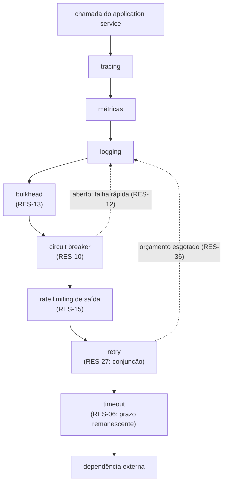
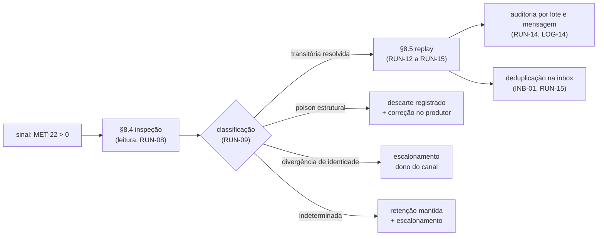

# Resiliência, observabilidade e operação — DMPF FND-08

| Campo | Valor |
|-------|-------|
| **Status** | `draft normativo` — promovido para revisão em PR |
| **Adiciona a** | RFC DMPF Foundation v0.1, pela âncora ANC-06 (RFC §12.3) |
| **Owner** | Mateus Macedo Dos Anjos (assignee de ARQ-445) |
| **Épico** | ARQ-436 — Golden Path para Sistemas Orientados a Domínio e Mensagens |
| **Story** | ARQ-445 (DMPF-FND-08) |
| **Spec** | [SPEC-E15TBHCD](../specs/SPEC-E15TBHCD-dmpf-resiliencia-observabilidade.md) |
| **Data** | 2026-08-20 |
| **Revisão** | Plataforma e Arquitetura no PR; **SRE/Cloud** para §6 e §8, sem cuja validação o runbook e os limiares não passam de proposta — a story o exige em §7 e §10; o owner da ARQ-441 para a revisão cruzada de §4 com a semântica transacional |

> **O que este documento obriga.** As regras rotuladas `normativo` valem para todo
> trabalho novo do DMPF, na mesma força da RFC à qual elas se adicionam. Nem todo
> bloco aqui obriga: §1.2 define as categorias de conteúdo e a fronteira de cada
> uma, e §1.3 define o **sujeito** que uma regra deste artefato pode ter — leitura
> obrigatória antes de qualquer regra, porque as duas invariantes da âncora que o
> autoriza são precisamente proibições de sujeito. Enquanto o status for
> `draft normativo`, o documento está em revisão; a promoção ocorre no aceite do PR.

---

## §1. Fronteira, referência e sucessão

Esta seção vem antes de qualquer regra porque um artefato que adiciona a uma norma
compartilhada precisa dizer, primeiro, **até onde** ele pode obrigar. A RFC já
respondeu a essa pergunta ao registrar a âncora ANC-06; o que segue é a leitura
dessa autorização, a convenção de leitura do texto e o efeito deste documento
sobre a base conceitual a que ele sucede.

Duas assimetrias em relação aos quatro precedentes condicionam todo o resto.

A primeira é de **volume**. A ANC-01 recortou um bloco e o FND-03 o esgotou. A
ANC-02 recortou um mecanismo que atravessa três blocos. A ANC-03 recortou um bloco
cujo assunto era maior do que o FND-05 entregava. A ANC-04 recortou um bloco e
recebeu obrigações cujo sujeito era outro. A ANC-06 é a que **mais recebeu**: são
30 obrigações herdadas, contra 24 do FND-07, vindas dos cinco artefatos já
promovidos. Não é acidente. Toda vez que um precedente fixou um mecanismo, ele
precisou dizer que o mecanismo é observável e parou antes de nomear a métrica —
e essa parada tem um só destinatário, que é este artefato. §2 as trata uma a uma.

A segunda é de **recorte**. As âncoras anteriores recortaram bloco ou mecanismo;
a ANC-06 recorta um **assunto transversal**, e o registro dela tem um assunto
(«resiliência e observabilidade») mais amplo que o escopo permitido («baselines
de telemetria, políticas de retry e degradação»). Pela disciplina M4, o excedente
não é normatizável aqui ainda que tecnicamente correto: §1.4 o marca
`encaminhado`, com dona nomeada, em vez de o resolver por silêncio.

### §1.1 A autorização: âncora ANC-06

`normativo`

Este artefato **adiciona** à RFC DMPF Foundation v0.1 pela âncora ANC-06
(RFC §12.3). Ele não edita a RFC e não incrementa a versão dela: adição por
âncora dentro do escopo permitido é revisão em PR, sem incremento (RFC §14.2). O
conteúdo vive aqui, e a RFC o alcança pelo endereço estável da âncora (RFC §12.1).

| Campo | Valor, conforme o registro de ANC-06 |
|-------|--------------------------------------|
| Assunto | Resiliência e observabilidade |
| Escopo permitido | Baselines de telemetria, políticas de retry e degradação |
| Invariantes intocáveis | RFC §6.2 — `observability` **não** é permitida em `domain` nem em `port`; princípio 11 da Parte-1 |
| Monotonicidade | M1–M4 (RFC §12.2): detalhar e restringir, nunca relaxar, revogar ou reinterpretar |
| Artefato sucessor | Spec e seção própria |
| Condição de fechamento | FND-08 concluída e revisada |
| Impacto de versão na RFC | Nenhum, se dentro do escopo |
| ADR exigido | **Não, salvo alteração de invariante** — a leitura desse campo, e o que ele não dispensa, está em §12 |

`normativo` — **Precedência.** Onde este artefato e a RFC divergirem, prevalece a
RFC. Uma divergência não se resolve neste documento: por M4, ela indica que a
fronteira de RFC §1.4 mudou, e mudar fronteira é mudança de versão da RFC, com o
rito de RFC §14.2.

`normativo` — **Monotonicidade em concreto.** As invariantes da âncora são citadas
ao longo do texto, e nenhuma regra deste artefato as afrouxa:

| Invariante | Como este artefato a trata | Onde |
|------------|----------------------------|------|
| RFC §6.2 — `observability` não é permitida em `domain` nem em `port`, «ainda que a biblioteca de logging seja tecnicamente pura» (`rfc-dmpf-foundation-v0.1.md:784`) | Convertida em regra de sujeito: `RES-01` fixa que nenhuma regra daqui obriga `domain` ou `port`, e cada bloco normativo declara o seu sujeito | §1.3, e o cabeçalho de sujeito de §3 a §8 |
| Princípio 11 da Parte-1 — «observabilidade sem contaminar o domínio: telemetry é incorporada nos adapters, pipelines e providers» | Reproduzido e **restringido**: a instrumentação vive em `app`, `provider` e `application service`, e a telemetria de um caso de uso é responsabilidade do decorator, nunca do tipo de domínio | §1.3, §5, §6, §7 |
| Princípio 9 — «concorrência limitada: backpressure, limites e ordenação são parte do contrato operacional» | Usado como fundamento da metade de resiliência: o limite não é ajuste de operação, é contrato | §3, §4, §8 |
| M1 — não esvaziar regra vigente | `ERR-11` e `ERR-12` do FND-07, `OBX-12`, `OBX-13`, `INB-17` e `GAR-05` a `GAR-12` do FND-04 são **recepcionados** e parametrizados, nunca redefinidos | §2.4, §4, §6, §8 |
| M4 — não exceder o escopo da âncora | O excedente entre o assunto e o escopo permitido sai `encaminhado` com dona, por `RES-02` | §1.4 |

### §1.2 Classificação de força

`normativo`

| Rótulo | Significado | Obriga? |
|--------|-------------|---------|
| `normativo` | Regra que este artefato estabelece sobre resiliência, telemetria ou operação, no escopo da ANC-06 e sob o sujeito admissível de §1.3 | **Sim** |
| `recepcionado` | Conteúdo reproduzido da Parte-1, da RFC ou de um artefato precedente para dar contexto contíguo, sem força nova e sem reabertura | Não — a força permanece da fonte |
| `encaminhado` | Assunto de outra sub-spec, citado apenas como fronteira rotulada, com dona explícita | Não — passa a obrigar quando a dona normatizar |
| `rationale` | Justificativa de uma decisão normativa, incluindo alternativas descartadas | Não |
| `registro` | Matriz de obrigações e de prova (§2), rastreabilidade dos failure modes (§9), acionamento de ADR (§12), rastreabilidade e pendências (§13) | Não |

### §1.3 O sujeito das regras deste artefato

`normativo`

As duas invariantes da ANC-06 não são restrições de conteúdo: são restrições de
**sujeito**. RFC §6.2 e o princípio 11 dizem, cada um à sua maneira, onde a
telemetria pode viver — e o lugar proibido é justamente o centro da arquitetura.
Uma regra que obrigasse o domínio a emitir métrica seria tecnicamente exequível,
provavelmente conveniente, e inadmissível.

`recepcionado` — RFC §7 define a capability `observability` como «logger, tracer,
métricas, APM» (`rfc-dmpf-foundation-v0.1.md:755`), e RFC §6.2 declara que ela
«merece regra própria, porque é a exceção que mais se pede» (`:784`).

`normativo` `RES-01` — **O sujeito de uma regra `normativo` deste artefato é
`app`, `provider` ou `application service`.** Nenhuma regra daqui obriga `domain`
nem `port`, e nenhuma se satisfaz por instrumentação colocada num deles. Onde a
regra alcança um mecanismo que atravessa blocos, o bloco obrigado é declarado no
cabeçalho da subseção.

| Bloco | Pode ser sujeito? | O que lhe é exigível aqui |
|-------|-------------------|---------------------------|
| `app` | **Sim** | Pipeline de entrada, adapters, span de borda, campos de log, gesto operacional do relay e do consumer |
| `provider` | **Sim** | Decorators de saída de §3, instrumentação do cliente remoto, sinais do mecanismo que implementa |
| `application service` | **Sim** | Orçamento de retry da execução, correlação do caso de uso, distinção entre retry remoto e reexecução |
| `port` | **Não** | Nada. Uma porta declara a operação, não a sua telemetria |
| `domain` | **Não** | Nada. O tipo de domínio não emite, não recebe e não configura telemetria |

`normativo` `RES-02` — **O excedente entre o assunto e o escopo permitido da
ANC-06 sai `encaminhado`, com dona nomeada.** O assunto registrado é «resiliência
e observabilidade»; o escopo permitido é «baselines de telemetria, políticas de
retry e degradação». Matéria que caiba no primeiro e não no segundo não é
normatizada aqui, ainda que este artefato tenha o material para a normatizar.
§1.4 é a lista, e ela é exaustiva por construção: um assunto que apareça no texto
sem estar lá é defeito de fronteira.

`rationale` — A alternativa era normatizar o assunto inteiro e tratar o escopo
permitido como resumo aproximado dele. Foi descartada porque converte a âncora em
formalidade: se o campo «escopo permitido» não recorta, ele não faz nada, e a
próxima sub-spec herda a mesma licença. O custo da disciplina é visível — SLO por
serviço, modelagem de cache e dashboards ficam de fora, e a operação continuará a
precisar deles —, e é o custo certo: um item fora do escopo, entregue aqui, teria
de ser revogado por rito de RFC quando a dona real o normatizasse.

### §1.4 O que este artefato encaminha

`registro` — Assuntos que aparecem no texto como fronteira rotulada, com dona:

| Assunto | Dona | Onde é citado |
|---------|------|---------------|
| Valor de **prazo** por método e por transporte, e o método que o deriva (`GRP-16` a `GRP-18`) | FND-06 — `politicas-transporte.md`, **publicado**, sob ANC-04 | §3 — aqui o orçamento transversal e a regra de composição |
| **Gesto** da repetição em cada transporte: `maxReceiveCount`, redrive policy, commit de offset, visibilidade | FND-06, **publicado** | §4, §8 — aqui a política transversal que compõe com ele |
| Retry específico de cada transporte, commit de offset, visibilidade e redrive policy | FND-06, **publicado** | §4, §8 |
| Classificação de erro e a sua retryability | FND-07 — `contexto-erros-seguranca.md`, **publicado** (`ERR-09` a `ERR-12`), sob ANC-05 | §4 — aqui só a política: quantas vezes, com que espaçamento, sob qual orçamento |
| Campo do prazo no contexto, monotonicidade da propagação e sinal de cancelamento | FND-07, **publicado** (`CTX-18` a `CTX-23`) | §3, §5 — aqui só o que se mede sobre eles |
| Forma do `trace_context` no envelope: `traceparent` e `tracestate` | FND-05 — `cloudevents-protobuf-buf.md`, **publicado** (`ENV-08`) | §5 — aqui a instrumentação derivada, não a forma |
| Existência dos mecanismos de outbox, inbox, relay, quarantine e DLQ, e a disposição que os aciona | FND-04 — `uow-inbox-outbox.md`, **publicado** | §6, §8 — aqui o catálogo e o procedimento |
| Instrumento executável de verificação dos critérios desta baseline, e o oráculo cross-stack | FND-09 (ARQ-446), sob ANC-07 | §13 — os critérios daqui são encaminhados como verificáveis |
| Redação, numeração definitiva e aceite do ADR acionado | FND-11 (ARQ-448) | §12 |
| **SLO por serviço**, e a meta de cada indicador | Serviço concreto, com a plataforma no método | §6 — aqui o que se mede, não a meta |
| **Dashboards, alertas em ambiente produtivo e escolha de vendor de telemetria** | Épicos de kernel e providers, com plataforma e SRE | §6, §8 — excluídos pelo §6.2 do épico |
| **Modelagem de cache**: consistência, invalidação e coerência entre réplicas | Épicos de kernel e providers | §3 — aqui o cache aparece só como redução de pressão em degradação |
| **Instrumentação**: bibliotecas, SDK, exportador, agente e o mapeamento para o backend | Épicos de kernel e providers | todo o artefato |
| Fixação da versão das *semantic conventions* de mensageria no BOM | Plataforma, no BOM (Parte-1 §17.2) | §5 — a convenção é adotada, a versão é governada lá |
| Cronograma e faseamento da adoção da baseline nos serviços do acervo | FND-10 (ARQ-447), sob ANC-09 | §13 |

`rationale` — Os quatro itens em negrito são o excedente de `RES-02`, e são
exatamente aqueles que um leitor esperaria encontrar aqui. Definir SLO exigiria
conhecer o serviço; desenhar alerta exigiria conhecer o backend; modelar cache
excederia «baselines de telemetria, políticas de retry e degradação» por um
assunto inteiro. O que este artefato pode fazer por eles, e faz, é entregar o
catálogo sobre o qual cada um se apoia.

### §1.5 Sucessão sobre a Parte-1

`registro` — **Esta tabela é uma proposta de sucessão, não a sua efetivação.** A
RFC §14.4 é explícita: «não há revogação implícita; um capítulo da Parte-1 só
deixa de valer quando esta tabela o declarar consolidado» — e a tabela da RFC
lista os capítulos §5 a §18 como **vigentes**
(`rfc-dmpf-foundation-v0.1.md:1794-1808`). Nenhuma sub-spec pode consolidá-los
por conta própria, e as quatro anteriores registraram o mesmo realinhamento como
pendência. A coluna abaixo diz, portanto, o estado que este artefato **propõe**
para a tabela da RFC; até que ela seja alterada pelo rito de §14.2, a Parte-1
continua valendo no que lá está declarado, e onde as duas divergirem prevalece o
que este artefato normatiza dentro da ANC-06, por autorização da própria âncora.

`registro` — Este artefato propõe a sucessão das subseções abaixo da base
conceitual — a `Parte-1-conceitual.md` que a RFC recepciona em §1.3, cuja convenção
de citação (`Parte-1 §N`) ela fixa ali mesmo, e cujos capítulos já substituídos ela
enumera em §1.4 (`rfc-dmpf-foundation-v0.1.md:59-68`, `:152-156`). A base não é
versionada neste repositório, e por isso **a referência estável a ela é a própria
RFC**: é lá que se lê o que a Parte-1 é, o que dela já foi consolidado e a regra de
que «não há revogação implícita». Onde a coluna diz `consolidação proposta`, o
conteúdo daqui prevalece; onde diz `vigente`, a Parte-1 segue valendo e este
artefato não a substituiu.

| Subseção da Parte-1 | Estado | Observação |
|---------------------|--------|------------|
| §15.1 Tracing | `consolidação proposta` em §5 | A subseção inteira: os três fluxos mínimos são recepcionados sem alteração e ganham span, atributo, amostragem e continuidade assíncrona |
| §15.2 Métricas obrigatórias | `consolidação proposta` em §6 | A subseção inteira: as 13 métricas ganham nome, unidade e fórmula, e passam a ser rastreadas por componente |
| §15.3 Logging | `consolidação proposta` em §7 | A subseção inteira: os 7 itens ganham campo obrigatório, política de redaction por `DAT-22` e canal de auditoria por `DAT-25` |
| §12.2 Decorators de saída | `consolidação proposta` em §3 e §4 | A subseção **inteira**, como o FND-07 registrou ao mantê-la vigente e encaminhá-la (`contexto-erros-seguranca.md:316`); o `timeout` também toca ANC-04, e o **valor** por transporte permanece com FND-06 |
| §12.1 — estágio `tracing/metrics/logging` | `consolidação proposta` em §5, §6 e §7 | Apenas a telemetria do pipeline de entrada, como o FND-07 atribuiu (`contexto-erros-seguranca.md:315`); os demais estágios daquela linha permanecem com as suas donas |
| §10.4 Relay | `consolidação parcial proposta` em §6 e §8 | O mecanismo é de FND-04 §5; vêm para cá os nomes de métrica, os limiares, os alarmes e o runbook (`uow-inbox-outbox.md:225`) |
| §10.9 Retry, DLQ e quarantine | `consolidação parcial proposta` em §4, §6 e §8 | Consolidada em FND-04 §7.4 quanto ao mecanismo e em FND-06 §11 e §12 quanto ao retry por transporte; vêm para cá a operação da DLQ e o runbook (`uow-inbox-outbox.md:230`; `politicas-transporte.md:189`) |
| §10.10 Sagas e process managers | `consolidação parcial proposta` em §6 e §8 | Recepcionada em FND-04 §7.5; vêm para cá os timeouts observáveis, a telemetria e o replay assistido (`uow-inbox-outbox.md:231`) |
| §12.1 — estágio `deadline/cancellation` | `vigente` na Parte-1, consolidado em FND-07 §3 | O FND-07 já a declarou consolidada; deste artefato vêm o **orçamento** e o **backoff** que aquele encaminhou (`contexto-erros-seguranca.md:313`), sem reabrir a subseção |
| §12.1 — estágio `rate limit/idempotency` | `consolidação parcial proposta` em §3.5 | Apenas a metade de **rate limit**: `RES-16` e `RES-17` normatizam a admissão na borda, por rota e por tenant, antes de decode e validação — o conteúdo daquele estágio. A autorização vem de `THR-01` (`contexto-erros-seguranca.md:1380`), não da subseção, mas a substituição material ocorre e declará-la vigente por inteiro revogaria por silêncio. A metade **`idempotency` permanece vigente**, com FND-04 |
| §12.3 Catálogo inicial de providers | `vigente` na Parte-1 | Não sucedida, embora nomeie «logger, tracer e meter» e exija «métricas e health indicators» de cada provider: aquilo é catálogo de provider, matéria de RFC §7 e dos épicos de kernel |
| §17.1 Entregáveis da plataforma | `vigente` na Parte-1 | Não sucedida. A baseline daqui é insumo do entregável, não o entregável |

`rationale` — **Por que quatro sucessões ficam parciais e três subseções não são
sucedidas.** Declarar Parte-1 §10 e §12 inteiros consolidados seria mais simples
de ler e falso em pontos verificáveis. §10.4, §10.9 e §10.10 descrevem mecanismo
antes de descreverem operação, e o mecanismo já tem dona: absorvê-los inteiros
revogaria por descuido regra de FND-04 e de FND-06 que continua vigente — o que
M1 proíbe. §12.1 `rate limit/idempotency` é a quarta parcial, e o caso mais fácil
de errar nos **dois** sentidos: o estágio empacota duas coisas de donas diferentes,
de modo que consolidá-lo inteiro atropelaria a idempotência de FND-04, e
declará-lo vigente inteiro esconderia que `RES-16` e `RES-17` substituem a metade
de admissão. §12.3 e §17.1 mencionam telemetria sem a normatizar. Declarar consolidado o que não foi
substituído revoga norma por silêncio, e revogação silenciosa é o pior defeito
possível num documento cuja função é ser a referência de quem implementa.

---

## §2. As obrigações herdadas e o critério que as decide

### §2.1 O critério de fronteira: capacidade e catálogo

`recepcionado` — O FND-04 enuncia, uma única vez, o critério que decide toda a
fronteira com este artefato (`uow-inbox-outbox.md:167`):

> A fronteira com FND-08 é a mais fácil de atravessar por descuido, e por isso é
> enunciada uma vez, aqui, no critério que a decide: **capacidade é deste
> artefato; catálogo é de FND-08.**

E dá o exemplo literal do que se espera aqui (`uow-inbox-outbox.md:889`):

> Dizer que a métrica se chama `dmpf_outbox_lag_seconds` e que alarme dispara
> acima de trinta segundos é catálogo, e catálogo é de ANC-06.

`normativo` `RES-03` — **O catálogo não redefine o mecanismo.** Uma regra deste
artefato nomeia, dimensiona, alarma e opera aquilo que outro artefato fixou; ela
não altera a existência, a semântica nem a disposição do mecanismo. Onde o
catálogo parecer exigir comportamento diferente do fixado, a divergência é
defeito deste artefato, não licença: por M1, o mecanismo prevalece.

`rationale` — A regra existe porque o vetor de violação é atrativo. Ao escrever o
runbook de replay é natural concluir que a DLQ deveria preservar mais um campo, ou
que a inbox deveria aceitar espera maior. As duas conclusões podem estar certas e
nenhuma se implementa aqui: elas são pedidos de alteração a `GAR-07` e a `INB-17`,
e passam pelo rito da âncora que os detém.

`normativo` `RES-04` — **Toda obrigação herdada tem estado declarado e fonte que
resolve.** O estado é `quitada`, `encaminhada` ou `condicionada`, e a fonte é
`arquivo:linha` de artefato presente na branch base. Obrigação sem estado é
omissão; fonte que não resolve é rastreabilidade aparente, e as duas equivalem a
não ter recebido a obrigação.

### §2.2 Matriz de atribuição das obrigações herdadas

`registro` — A unidade desta matriz é o **predicado independentemente
verificável**, não a ocorrência de texto. Um predicado encaminhado por várias
linhas dos precedentes aparece aqui uma vez, com todas as fontes convergentes.
São 30 predicados, vindos dos cinco artefatos promovidos.

| # | Predicado herdado | Fonte | Sujeito | Onde | Estado |
|---|-------------------|-------|---------|------|--------|
| 1 | Resiliência e observabilidade, como assunto encaminhado por inteiro | `upr-decision-mensagens.md:133` | `app`, `provider`, `application service` | todo o artefato | `quitada` |
| 2 | Rastro de execução para depuração não justifica campo de domínio: a trilha é telemetria, não modelo | `upr-decision-mensagens.md:1095` | `app` | §7 | `quitada` |
| 3 | Os **nomes** das métricas | `uow-inbox-outbox.md:163`, `:881` | `app`, `provider` | §6 | `quitada` |
| 4 | Os **limiares** | `uow-inbox-outbox.md:163`, `:881` | operação | §6, §8 | `quitada` — sob o limiar condicional de `MET-05` |
| 5 | Os **alarmes** | `uow-inbox-outbox.md:163`, `:881` | operação | §6, §8 | `quitada` |
| 6 | Runbook de DLQ e replay | `uow-inbox-outbox.md:163`, `:881` | operação | §8 | `quitada` |
| 7 | Nome e unidade dos quatro sinais do relay que `OBX-12` obriga a expor — `pending`, `lag`, `attempts`, `failures` | `uow-inbox-outbox.md:169`, `:881` | `app` (relay) | §6.3 | `quitada` |
| 8 | Parte-1 §10.4 (relay): nomes de métrica, limiares, alarmes e runbook | `uow-inbox-outbox.md:225` | `app` (relay) | §6.3, §8 | `quitada` |
| 9 | Parte-1 §10.9: a operação de DLQ e o runbook | `uow-inbox-outbox.md:230`; `politicas-transporte.md:189` | operação | §8 | `quitada` |
| 10 | Parte-1 §10.10 (sagas e process managers): timeouts, observabilidade e replay assistido | `uow-inbox-outbox.md:231` | `application service` | §6.7, §8.6 | `quitada` |
| 11 | Purga da outbox e **alarme de crescimento** | `uow-inbox-outbox.md:754` | operação | §6.3, §8.3 | `quitada` |
| 12 | O **valor** do teto de espera da inbox, cujo estouro é R1×D3 e não erro terminal (`INB-17`) | `uow-inbox-outbox.md:1104`, `:1121` | `application service` | §3.2, §6.4 | `quitada` |
| 13 | Catálogo dos sinais de `GAR-12`: profundidade de DLQ e de quarantine, taxa de recusa | `uow-inbox-outbox.md:1647` | `app` (consumer adapter) | §6.5 | `quitada` |
| 14 | Replay e repair de sagas e process managers | `uow-inbox-outbox.md:1687` | operação | §8.6 | `quitada` |
| 15 | Catálogo, limiares e alarmes sobre **falha de validação** de contrato | `cloudevents-protobuf-buf.md:178`, `:1339` | `app` | §6.6, §8.4 | `quitada` |
| 16 | Idem sobre **drift de código gerado**, incluída a frequência | `cloudevents-protobuf-buf.md:178`, `:1339` | plataforma (CI) | §6.6, §8.4 | `quitada` |
| 17 | Idem sobre **reprovação de gate** de contrato | `cloudevents-protobuf-buf.md:178`, `:1339` | plataforma (CI) | §6.6, §8.4 | `quitada` |
| 18 | Telemetria derivada do contexto de trace: nome de span, atributo, amostragem, propagador configurado | `cloudevents-protobuf-buf.md:566`; `contexto-erros-seguranca.md:617-619` | `app`, `provider` | §5 | `quitada` |
| 19 | **Orçamento** de retry | `contexto-erros-seguranca.md:224` | `application service` | §4.3 | `quitada` |
| 20 | **Backoff** | `contexto-erros-seguranca.md:224` | `provider`, `app` | §4.4 | `quitada` |
| 21 | **Limiares** de tentativa e de alarme sobre repetição | `contexto-erros-seguranca.md:224`, `:1380` | `provider`, operação | §4.4, §6.8 | `quitada` |
| 22 | Políticas de **degradação** | `contexto-erros-seguranca.md:224`, `:1380` | `app`, `provider` | §4.5 | `quitada` |
| 23 | **Política de retryability**: quantas vezes se tenta, com que espaçamento, sob qual orçamento, com qual limiar de alarme e qual runbook | `contexto-erros-seguranca.md:224`, `:231`, `:1035` | `application service`, `provider` | §4.2, §4.3, §8 | `quitada` |
| 24 | Parte-1 §12.1, estágio `deadline/cancellation`: o orçamento e o backoff que o FND-07 encaminhou | `contexto-erros-seguranca.md:313` | `app`, `application service` | §3.2, §4.3 | `quitada` |
| 25 | Parte-1 §12.1, estágio `tracing/metrics/logging`: a telemetria do pipeline de entrada | `contexto-erros-seguranca.md:315` | `app` | §5.2, §6.2, §7 | `quitada` |
| 26 | Parte-1 §12.2, decorators de saída: **a subseção inteira** | `contexto-erros-seguranca.md:316` | `provider` | §3, §4 | `quitada` |
| 27 | Circuit breaker, bulkhead, degradação e o runbook de operação de DLQ | `politicas-transporte.md:156` | `provider`, operação | §3.3, §3.4, §4.5, §8 | `quitada` |
| 28 | Parte-1 §10.9, pela via do transporte: a parte de operação e runbook | `politicas-transporte.md:189` | operação | §8 | `quitada` |
| 29 | Retenção da DLQ e rito de replay | `politicas-transporte.md:269`, `:1757` | operação | §8.4, §8.5 | `quitada` |
| 30 | Limiar de tentativas, prazos de backoff, retenção da DLQ e runbook de operação, na fronteira do Kafka | `politicas-transporte.md:1186-1188` | `provider`, operação | §4.4, §8.4 | `quitada` |

`registro` — **Nenhuma obrigação fica `encaminhada` ou `condicionada`.** É a
primeira vez na cadeia que isso ocorre, e a razão é estrutural: as obrigações
desta âncora são todas de catálogo, e catálogo não depende de decisão de terceiro
para existir. As duas que estiveram perto de ficar condicionadas — 29 e 30, cuja
fonte foi produzida por FND-06 — resolveram quando a ARQ-443 entrou em `develop`,
e são citadas por `arquivo:linha` estável como as demais.

`registro` — **O cluster do eixo *Denial of service* tem nove fontes
convergentes.** Os predicados 21 e 22 recebem, além do encaminhamento genérico de
`contexto-erros-seguranca.md:224`, o registro de `THR-01` (`:1380`) e a avaliação
do eixo nos sete vetores do threat model daquele artefato (`:1301`, `:1314`,
`:1323`, `:1338`, `:1348`, `:1359`, `:1371`), mais o índice de famílias que o
declara partilhado entre artefato e FND-08 (`:1793`). Nenhum dos sete emite norma:
todos registram que o eixo foi avaliado e que a mitigação é daqui. É o cluster com
mais fontes de toda a cadeia, e é o que autoriza §3.5 a normatizar admissão e
contenção de carga.

### §2.3 Matriz de prova

`registro` — Para cada predicado herdado: a regra que o satisfaz, o critério
verificável, e o **par de vetores** — o caso que satisfaz e o caso que viola.
Nenhuma linha de §2.2 fica sem contraparte aqui.

| # | Regra que satisfaz | Critério verificável | Vetor que satisfaz | Vetor que viola |
|---|--------------------|----------------------|--------------------|-----------------|
| 1 | Todo o artefato, sob `RES-01` | Existe regra `normativo` para limites, tracing, métricas, logging e operação, e nenhuma com sujeito `domain` ou `port` | Baseline com as cinco famílias e sujeito declarado por subseção | Artefato que normatize telemetria obrigando o tipo de domínio a emiti-la |
| 2 | `LOG-02`, `LOG-11` | A trilha de execução é registro de telemetria com correlação, não campo de entidade | Alteração rastreada por log estruturado correlacionado | Campo `updated_by_trace` acrescentado à entidade para depurar |
| 3 | `MET-02`, `MET-03` | Toda métrica obrigatória tem nome estável no formato de `MET-02` | `dmpf_outbox_lag_seconds` declarado no catálogo | Métrica descrita como «lag da outbox», sem nome |
| 4 | `MET-05`, `MET-05a` | O limiar de **valor** existe onde é derivado de invariante, e onde não é, o catálogo nomeia owner e parâmetro local; condição de **forma** é parâmetro local declarado | `retenção_inbox` não inferior à `janela_redelivery`, como limiar derivado | Limiar universal de latência de serviço fixado aqui |
| 5 | `MET-06`, `RUN-03` | Todo alarme nomeia o sinal, a condição e o procedimento que dispara | Alarme de idade da outbox apontando §8.3 | Alarme declarado sem procedimento associado |
| 6 | `RUN-08` a `RUN-13` | Existe procedimento de inspeção, decisão, execução e auditoria de replay | Rito de replay com proteção contra duplicidade | Instrução «reprocessar a DLQ» sem gesto nem auditoria |
| 7 | `MET-14` a `MET-17` | Os quatro sinais de `OBX-12` têm nome, unidade e fórmula | `dmpf_outbox_pending`, `_lag_seconds`, `_attempts`, `_failures_total` | Relay que exponha `lag` sem unidade declarada |
| 8 | `MET-14` a `MET-18`, `RUN-03` | Relay observável e operável pelo catálogo, sem redefinir `OBX-12` nem `OBX-13` | Catálogo do relay mais procedimento de relay parado | Catálogo que redefina o gesto de shutdown do relay |
| 9 | `RUN-08` a `RUN-14` | A operação da DLQ está normatizada, e o retry por transporte não é reaberto | Runbook de DLQ referenciando `KFK-12` sem o alterar | Runbook que fixe retry de Kafka contrariando FND-06 |
| 10 | `MET-27`, `RUN-15`, `RUN-16` | Saga tem timeout observável, telemetria e replay assistido declarado | Métrica de passo de saga vencido e procedimento assistido | Saga cujo passo pendente não apareça em métrica nenhuma |
| 11 | `MET-19`, `RUN-05` | Existe sinal de crescimento e procedimento de purga | Alarme de crescimento sustentado com purga agendada | Contagem de pendentes sem sinal de crescimento |
| 12 | `RES-08`, `MET-21` | O teto de espera tem valor declarado e o estouro é observado como transitório | Teto declarado, estouro contado como R1×D3 | Estouro do teto contado como erro terminal |
| 13 | `MET-22` a `MET-24` | Profundidade de DLQ, de quarantine e taxa de recusa nomeadas | Três sinais distintos, com o mapeamento de `GAR-11` | DLQ e quarantine somadas num único gauge |
| 14 | `RUN-15`, `RUN-16` | O replay assistido de saga é procedimento, não desfecho automático | Procedimento com decisor nomeado, por `GAR-05` | Replay de saga descrito como recuperação automática |
| 15 | `MET-25`, `RUN-11a` | Falha de validação de contrato tem sinal próprio, alarme e procedimento de correção na origem | `dmpf_contract_validation_failures_total` por contrato | Falha de validação diluída no contador de erro do serviço |
| 16 | `MET-26`, `RUN-11a` | Drift tem sinal, **frequência** observável, alarme e destinatário nomeado | Contador de drift com janela de frequência e alarme dirigido ao dono do repositório | Drift detectado apenas por inspeção manual do CI |
| 17 | `MET-26`, `RUN-11a` | Reprovação de gate é observável no mesmo eixo do drift, com alarme e procedimento | Reprovação de gate por repositório e por causa | Gate reprovado visível só no log do runner |
| 18 | `TRC-03` a `TRC-09` | Nome de span, atributos, amostragem e propagador derivam do contexto de trace sem redefinir a sua forma | Span de consumo ligado ao produtor por `traceparent` recebido de fronteira confiável | Instrumentação que redefina a representação do `traceparent` |
| 19 | `RES-30`, `RES-31` | O orçamento é por execução e inclui a espera de backoff | Execução que aborta por orçamento esgotado antes do teto de tentativas | Orçamento contado por chamada, permitindo soma ilimitada |
| 20 | `RES-32`, `RES-33` | Backoff exponencial com jitter e teto de tentativas obrigatórios | Backoff com jitter declarado e teto por dependência | Retry imediato em laço, sem espaçamento |
| 21 | `RES-33`, `MET-28`, `RUN-18a` | Limiar de tentativa declarado nos dois caminhos, taxa de repetição alarmável e com procedimento | Alarme de taxa de retry acima do declarado na ficha, tratado pela política conjunta | Repetição sem limiar e sem sinal |
| 22 | `RES-37`, `RES-38` | Cada dependência declara o seu modo de degradação, e degradar não silencia erro | Leitura degradada servida de cache com obsolescência declarada | Falha absorvida em silêncio, resposta indistinguível da normal |
| 23 | `RES-27` a `RES-30`, `RUN-09` | A política declara conjunção, orçamento, espaçamento, limiar e runbook | Retry autorizado só sob a conjunção de `RES-27` | Retry disparado por retryability isolada |
| 24 | `RES-06`, `RES-07`, `RES-31` | O orçamento e o backoff compõem com o prazo do contexto sem reabrir `CTX-18` a `CTX-23`, e o orçamento entra no mínimo do timeout efetivo | Tentativa recusada por prazo ou por orçamento insuficiente para ela e para o seu backoff | Retry que estenda o prazo original da execução |
| 25 | `TRC-02`, `MET-08`, `LOG-04` | O estágio de telemetria do pipeline de entrada tem span, métrica e campos definidos | Borda com span, latência e correlação | Pipeline instrumentado só no serviço, sem borda |
| 26 | `RES-05` a `RES-24` | Os nove decorators têm regra própria e sujeito declarado | Cada decorator com pelo menos uma regra `RES` | Decorator citado sem regra nem sujeito |
| 27 | `RES-10` a `RES-14`, `RES-37`, `RUN-08` | Breaker, bulkhead e degradação normatizados aqui, e a operação da DLQ também | Breaker no `provider` com estado observável | Breaker no `application service`, misturando política e caso de uso |
| 28 | `RUN-08` a `RUN-14` | A operação e o runbook de §10.9 existem como procedimento | Procedimento por sintoma, com sinal de disparo | Runbook que dependa de conhecimento tácito da equipe |
| 29 | `RUN-11`, `RUN-14` | Retenção da DLQ declarada e rito de replay auditável | Retenção com prazo e replay registrado em auditoria | Replay sem registro, indistinguível de tráfego novo |
| 30 | `RES-32`, `RES-33`, `RUN-11` | Limiar, backoff e retenção têm valor declarado aqui e compõem com o gesto de cada transporte sem o reabrir | Teto de 5 tentativas configurado no `maxReceiveCount` do canal | Redação que devolva o valor a FND-06, deixando o assíncrono sem teto |

### §2.4 Regras que este artefato recepciona

`registro` — Regras dos precedentes usadas como restrição, sem redefinição. A
citação é a forma de cumprir M1: detalhar sem reabrir.

| Regra | Fonte | O que impõe a este artefato |
|-------|-------|------------------------------|
| `OBX-12` | FND-04 | O relay **expõe** `pending`, `lag`, `attempts` e `failures`. A capacidade obriga lá; aqui vêm nome, unidade e fórmula (§6.3) |
| `OBX-13` | FND-04 | Graceful shutdown é parar de reivindicar, concluir ou liberar claims, e então encerrar. §8.7 o **observa** e reage; não o redefine |
| `INB-17` | FND-04 | A espera da porta tem teto e o estouro é R1×D3, falha transitória. §3.2 fixa o valor; a disposição permanece de lá |
| `GAR-05` | FND-04 | Todo failure mode declara desfecho automático: recuperação ou contenção. Reparação assistida não é desfecho automático — é o que separa §8.5 de §8.6 |
| `GAR-06` | FND-04 | Toda contenção nomeia o que ficou pendente e quem decide. É o critério que §9 usa para escolher entre gauge e trace |
| `GAR-07` | FND-04 | A contenção preserva informação suficiente para um replay conforme. É o insumo do rito de §8.5 |
| `GAR-08` | FND-04 | Poison message não bloqueia partição nem grupo FIFO, e o limite de tentativas é obrigatório. §8.4 opera sobre isso |
| `GAR-11` | FND-04 | Quarantine e DLQ são distintos e quem implementa os dois declara o mapeamento. Por isso `MET-22` e `MET-23` são sinais separados |
| `GAR-12` | FND-04 | O lado de consumo expõe profundidade e taxa de recusa. Nome e unidade em §6.4 |
| `UOW-09`, `UOW-10` | FND-04 | A UoW não repete o callback automaticamente, e retry de conflito é política explícita, só em operação comprovadamente idempotente. É o limite de `RES-34` e `RES-35` |
| `ERR-11` | FND-07 | Categoria condicional sem predicado decidível resolve para **não** retentável. Default fail-closed herdado, parametrizado por `RES-29`, nunca invertido |
| `ERR-12` | FND-07 | A retryability declara se repetir **pode** ter desfecho diferente; ela «não autoriza, ordena nem dimensiona a repetição». É a base de `RES-27` e `RES-28` |
| `CTX-07` | FND-07 | `correlation_id` recebido de fronteira confiável é preservado; fora dela, é gerado na borda. É o critério de `LOG-04` e de `TRC-06` |
| `CTX-09` | FND-07 | `trace_context` é propagado na forma W3C, e aquele artefato normatiza origem e propagação, não a forma. `TRC-03` deriva sem redefinir |
| `CTX-24` a `CTX-28` | FND-07 | O contexto do consumo é reconstruído do envelope, com `request_id` e `deadline` próprios. É o que torna `TRC-07` verificável |
| `DAT-22` | FND-07 | O dado sensível é redigido **na origem**: o valor não é entregue ao pipeline de log, de trace **ou de métrica**. Alcança as três famílias, não só `LOG` |
| `DAT-23` | FND-07 | A redaction preserva utilidade diagnóstica: campo identificado, valor substituído, não omitido |
| `DAT-24` | FND-07 | A projeção interna de diagnóstico não é exceção à redaction — `last_error` e DLQ são lidas por operação |
| `DAT-25` | FND-07 | Auditoria separada da observabilidade, com retenção, acesso e integridade próprios, não derivada do pipeline de log |
| `THR-01` | FND-07 | Nenhuma regra daquele artefato normatiza limiar, orçamento, degradação, dimensionamento ou contenção de carga: é a autorização expressa de §3.5 e §4 |
| `ENV-08` | FND-05 | `traceparent` obrigatório e `tracestate` opcional no envelope, em formato W3C. É o veículo da continuidade de `TRC-07` |
| `KFK-12` | FND-06 | Cada canal tem DLQ nomeada e a publicação nela precede o avanço do offset. §8.4 opera sobre esse mecanismo sem o alterar |
| `GRP-16` a `GRP-18` | FND-06 | O prazo é declarado **por método**, é menor que o do chamador com folga, e é derivado do requisito de quem chama — nunca da latência observada. `RES-06` e `RES-09` compõem com essa regra em vez de fixar valor |
| `TRP-49` a `TRP-51` | FND-06 | Teto de tamanho da mensagem, limite de expansão de conteúdo comprimido e limite de profundidade de aninhamento, verificados antes do decode. São os limites de **forma**; `RES-18` fixa que aqui só se normatiza o limite de **taxa** |

---

## §3. Limites por dependência

`normativo` — blocos `provider` (decorators de saída) e `app` (admissão na borda);
consolidação proposta de Parte-1 §12.2.

Esta seção normatiza a subseção que o FND-07 encaminhou por inteiro: os nove
decorators de saída de Parte-1 §12.2. O gesto é sempre o mesmo — a chamada a uma
dependência externa é envolvida por uma política declarada, e a ausência de
política é ela mesma uma política, a pior delas. Onde a Parte-1 diz que providers
remotos «podem ser decorados», este artefato fixa quais decorators são obrigatórios,
qual é o sujeito de cada um e o que se declara sobre ele.

Uma fronteira atravessa a seção inteira e é declarada uma vez: o **valor** de um
prazo por método e por transporte é de FND-06 (`GRP-16` a `GRP-18`); daqui vêm a
composição, o orçamento e a obrigatoriedade.

### §3.1 Os nove decorators e a fronteira por mecanismo

`recepcionado` — Parte-1 §12.2 enumera os nove decorators e fixa a regra que §4
desenvolve: «retry é aplicado à operação remota específica; reexecutar
automaticamente o service inteiro pode repetir decisões de negócio e é proibido
sem idempotência comprovada».

`normativo` `RES-05` — **Nenhuma chamada a dependência externa ocorre sem timeout
e sem política de falha declarada.** «Dependência externa» é toda saída que
atravessa processo: banco, broker, HTTP, gRPC, SDK de nuvem, cache remoto e
serviço de terceiro. Chamada sem timeout não é otimista: é uma espera de duração
desconhecida ocupando recurso finito, e o seu efeito sob carga é indistinguível de
indisponibilidade.

| Decorator de Parte-1 §12.2 | Onde é normatizado | Fronteira |
|----------------------------|--------------------|-----------|
| timeout | §3.2 — `RES-05` a `RES-09` | Composição e orçamento aqui; **valor** por método e transporte em FND-06 (`GRP-16` a `GRP-18`) |
| retry | §4 — `RES-25` a `RES-36` | Autorização, orçamento, espaçamento e teto aqui; gesto por transporte em FND-06; classificação do erro em FND-07 |
| circuit breaker | §3.3 — `RES-10` a `RES-12` | Integralmente aqui, por encaminhamento de `politicas-transporte.md:156` |
| bulkhead | §3.4 — `RES-13`, `RES-14` | Integralmente aqui, pelo mesmo encaminhamento |
| rate limiting | §3.5 — `RES-15` a `RES-18` | Limite de **taxa** aqui, nos dois sentidos; limites de **forma** em FND-06 (`TRP-49` a `TRP-51`) |
| cache-aside | §3.6 — `RES-19`, `RES-20` | Apenas como redução de pressão e leitura degradada; modelagem de consistência e invalidação é dos épicos de kernel (§1.4) |
| tracing | §5 — `TRC-01` a `TRC-16` | Instrumentação aqui; forma do contexto propagado em FND-05 (`ENV-08`) e FND-07 (`CTX-09`) |
| métricas | §6 — `MET-01` a `MET-30` | Catálogo aqui; existência do sinal no mecanismo em FND-04 (`OBX-12`, `GAR-12`) |
| logging estruturado | §7 — `LOG-01` a `LOG-14` | Formato, campos e canal aqui; classificação do dado sensível em FND-07 (`DAT-01` a `DAT-25`) |

`normativo` `RES-21` — **Cada dependência externa tem uma ficha de resiliência
declarada**, versionada junto da configuração do cliente que a acessa. A ficha
cobre os **seis mecanismos** de §3 — timeout, retry, circuit breaker, bulkhead,
rate limiting e cache —, mais o orçamento, o backoff, o teto e o modo de degradação
de §4, e cada um recebe um valor ou a marca «não se aplica» com o motivo. Ficha com campo em branco não
satisfaz a regra: a ausência de decisão é o que ela existe para impedir.

| Campo da ficha | Conteúdo | Regra |
|----------------|----------|-------|
| Prazo | Valor por método, com a folga do salto | `RES-06`, e o método de derivação de `GRP-16` a `GRP-18` |
| Retry | Autorizado ou não, com o predicado que o autoriza | `RES-27` |
| Orçamento | Fração do prazo remanescente gastável em espera | `RES-30`, `RES-31` |
| Backoff | Base, fator, jitter e teto por tentativa | `RES-32` |
| Teto de tentativas | Número, ou o limite do transporte quando o gesto é dele | `RES-33` |
| Circuit breaker | Janela, limiar, cooldown e sondas de meia-abertura | `RES-10` |
| Bulkhead | Tamanho do pool, teto da fila e prazo de aquisição | `RES-13`, `RES-14` |
| Rate limit de saída | Limite declarado, ou o motivo de não haver | `RES-15` |
| Cache | Uso como redução de pressão, com a janela de obsolescência aceitável, ou «não se aplica» | `RES-19`, `RES-20` |
| Degradação | Modo declarado quando a dependência falta | `RES-37` |

`normativo` `RES-22` — **A ordem de composição dos decorators é declarada e
estável.** A ordem canônica, de fora para dentro, é: tracing → métricas →
logging → bulkhead → circuit breaker → rate limiting → retry → timeout → chamada.
Um serviço que precise de outra ordem a declara com o motivo; a ordem
indeterminada é defeito, porque muda o significado de todo sinal emitido pelos
decorators de fora.

`rationale` — A ordem não é estética. Com timeout **dentro** do retry, cada
tentativa tem prazo próprio e o orçamento de `RES-30` é verificável; com timeout
fora, o retry compete com o prazo total e o comportamento sob pressão depende de
qual dos dois vence a corrida. Com métricas fora do retry, a latência medida é a
que o chamador percebeu, incluindo espera de backoff — que é o número
operacionalmente útil; medir por dentro esconde exatamente o custo que o retry
introduz.

`normativo` `RES-23` — **Todo decorator instalado é observável.** Cada um expõe ao
menos um sinal do catálogo de §6: o timeout expõe estouro, o retry expõe
tentativa, o breaker expõe estado, o bulkhead expõe saturação e espera, o rate
limit expõe recusa, o cache expõe acerto e obsolescência. Decorator silencioso é
indistinguível de decorator ausente durante um incidente, que é justamente quando
a distinção importa.

`normativo` `RES-24` — **Nenhum decorator é instalado em `domain` nem em `port`.**
A composição ocorre no composition root de `app` ou na construção do `provider`.
Uma porta que declare parâmetro de retry, prazo ou política de falha na própria
assinatura viola RFC §6.2 pelo caminho mais discreto: sem importar biblioteca
nenhuma, ela passa a carregar a política.

### §3.2 Timeout e o orçamento de prazo

`recepcionado` — O contexto de execução já tem prazo: `CTX-18` a `CTX-23` do
FND-07 fixam o campo, a monotonicidade da propagação, o sinal de cancelamento e a
categoria do estouro. `GRP-16` a `GRP-18` do FND-06 fixam que o prazo é declarado
por método, é menor que o do chamador com folga, e deriva do requisito de quem
chama — nunca da latência observada.

`normativo` `RES-06` — **O prazo de uma etapa é derivado do prazo remanescente do
contexto, não de valor fixo isolado.** O timeout efetivo de uma chamada é o menor
entre o valor declarado para o método e o prazo que resta na execução corrente.
**Quando a chamada é uma repetição, o orçamento de `RES-30` entra no mesmo mínimo**,
descontada a espera de backoff já reservada para ela: o limite efetivo é
`min(prazo_do_método, prazo_remanescente, orçamento_restante − backoff_reservado)`.
Um cliente que use sempre o valor declarado ignora o prazo herdado e transforma a
monotonicidade de `CTX-19` em promessa não verificável; um que ignore o orçamento
torna `RES-30` inverificável, porque uma única tentativa longa o excede sem que
nada a interrompa.

`normativo` `RES-07` — **A soma dos orçamentos das etapas a jusante não excede o
prazo remanescente, com folga declarada para o próprio salto.** Onde a soma
exceder, a configuração está errada e o erro é detectável antes da execução: é
verificação de composição, não de latência.

`normativo` `RES-08` — **O teto de espera da porta de inbox tem valor declarado, e
o default da plataforma é 2 segundos.** É o valor que `INB-17` encaminhou. O
estouro permanece o que aquela regra fixa — R1×D3, transação abandonada e mensagem
devolvida ao transporte com backoff —, e não é reclassificado aqui. O valor é
overridável por consumidor, com o motivo declarado na ficha de `RES-21`.

`rationale` — Dois segundos não é medida de conforto: é o ponto em que a espera
por `registrar` deixa de ser mais barata que a redelivery. `INB-07` põe
deduplicação, efeitos locais e outbox derivada na mesma transação, então esperar
mais significa manter a transação aberta mais tempo, aumentando a janela de
conflito para todos os demais consumidores. Devolver ao transporte custa uma
redelivery e libera o recurso imediatamente. O valor é conservador de propósito, e
o override existe para o consumidor que meça o contrário no seu caso.

`normativo` `RES-09` — **Este artefato não fixa o valor do prazo por método nem
por transporte.** Ele fixa a obrigatoriedade (`RES-05`), a derivação (`RES-06`), a
composição (`RES-07`) e o orçamento de repetição (§4.3). O valor é de FND-06, pela
regra de derivação de `GRP-16` a `GRP-18`, e um número fixado aqui excederia a
ANC-06 por invadir a ANC-04.

`encaminhado` — A **observação** do estouro de prazo — que ele tenha sinal próprio
e seja distinguível de falha da dependência — é catálogo, e está em `MET-29`. A
categoria do estouro permanece a que `CTX-23` fixa.

### §3.3 Circuit breaker

`normativo` `RES-10` — **Toda dependência externa cuja indisponibilidade seja
tolerável por degradação tem circuit breaker, com estado observável.** A ficha de
`RES-21` declara janela de avaliação, limiar de falha, número mínimo de amostras,
prazo de cooldown e quantidade de sondas em meia-abertura. Os defaults da
plataforma são: janela de 30 segundos, limiar de 50% de falha, mínimo de 20
amostras na janela, cooldown de 30 segundos e uma sonda em meia-abertura.

`rationale` — O mínimo de amostras é o parâmetro que mais falta nas
implementações e o que evita o pior comportamento do breaker: com três chamadas na
janela, uma falha isolada abre o circuito e converte um erro transitório em
indisponibilidade autoinfligida de trinta segundos. O limiar percentual sem piso
de amostras é matematicamente correto e operacionalmente perigoso.

`normativo` `RES-11` — **O breaker vive no `provider`, nunca no `application
service`.** O limite pertence à fronteira de I/O, e o caso de uso não decide se a
dependência está degradada — ele decide o que fazer quando está, por `RES-37`.
Breaker no caso de uso mistura política de infraestrutura com regra de aplicação e
duplica estado quando o mesmo provider é usado por dois serviços.

`normativo` `RES-12` — **Breaker aberto falha rápido, com erro categorizado, e não
espera o timeout.** A resposta é imediata e a categoria é distinguível de falha da
dependência: o chamador precisa saber que **não** houve tentativa. Um breaker que
devolva o mesmo erro da chamada real torna a sua própria atuação invisível.

### §3.4 Bulkhead

`normativo` `RES-13` — **Cada dependência externa tem pool de recursos próprio,
com limite declarado.** Conexões, permissões de concorrência e threads de trabalho
são particionadas por dependência, e o limite consta da ficha de `RES-21`. Pool
compartilhado propaga a lentidão de uma dependência para todas as outras, e é o
mecanismo pelo qual uma integração secundária derruba o fluxo principal.

`normativo` `RES-14` — **A fila de espera por recurso do pool é limitada, e a
saturação é rejeição rápida.** O default da plataforma é fila de tamanho igual ao
do pool e prazo de aquisição de 100 milissegundos. Fila ilimitada não aumenta a
capacidade: ela converte falta de recurso em latência crescente, e latência
crescente sem limite é a forma mais eficiente de esgotar memória.

### §3.5 Rate limiting: proteção da dependência e admissão

`normativo` — Esta subseção emite a norma que `THR-01` do FND-07 registrou e não
emitiu. A autorização é literal: «nenhuma regra deste artefato normatiza limiar,
orçamento, degradação, dimensionamento ou política de contenção de carga [...] a
mitigação é `encaminhada` a FND-08 sob ANC-06»
(`contexto-erros-seguranca.md:1380`).

`normativo` `RES-15` — **O rate limit de saída é declarado por dependência, ou o
motivo de não haver é declarado.** O limite protege a dependência de um cliente
que a sature — cenário típico de replay, de migração e de job em lote — e é o
único mecanismo desta seção cujo beneficiário está fora do processo.

`normativo` `RES-16` — **Toda borda de entrada exposta a chamador não controlado
tem limite de taxa e limite de concorrência, declarados por rota e por tenant.**
Sem limite por tenant, um único inquilino consome a capacidade de todos, e a
multi-tenancy de FND-07 fica preservada no dado e violada no recurso.

`normativo` `RES-17` — **A recusa por admissão é categorizada, observável e
barata.** Ela ocorre antes de o pipeline consumir recurso a jusante — antes de
decode, de validação e de acesso a banco —, tem categoria própria e produz sinal
por rota e por tenant (`MET-12`). Recusa que só apareça no total de erros do
serviço é indistinguível de falha da aplicação.

`normativo` `RES-18` — **Aqui se normatiza o limite de taxa; os limites de forma
permanecem de FND-06.** Teto de tamanho da mensagem (`TRP-49`), limite de expansão
de conteúdo comprimido (`TRP-50`) e limite de profundidade de aninhamento
(`TRP-51`) são verificados antes do decode e não são reabertos: os três protegem
contra uma mensagem, e `RES-16` protege contra o volume delas.

`rationale` — A separação entre forma e taxa é o que evita duplicar norma sobre o
mesmo assunto com dois donos. Uma decompression bomb é problema de forma e cabe
num único pedido conforme; dez mil pedidos conformes por segundo são problema de
taxa e nenhum limite de forma os detém. Os dois são vetores de *Denial of
service*, e o threat model do FND-07 registrou ambos — o primeiro já coberto por
FND-06, o segundo pendente até aqui.

### §3.6 Cache como redução de pressão

`normativo` `RES-19` — **O cache-aside desta baseline reduz pressão de leitura e
não é fonte de verdade.** Uma decisão de negócio não se apoia em valor de cache
sem revalidação, e nenhuma regra deste artefato autoriza servir dado de cache como
se fosse leitura consistente.

`normativo` `RES-20` — **Leitura degradada servida de cache declara a janela de
obsolescência aceitável e é observável como degradada.** O consumidor da resposta
sabe que ela é degradada, e a métrica de `MET-13` separa acerto normal de acerto em
degradação. Servir dado obsoleto silenciosamente é o modo de falha mais difícil de
diagnosticar, porque o sistema parece saudável.

`encaminhado` — Modelagem de cache — política de invalidação, consistência entre
réplicas, chave e coerência com a transação — excede «baselines de telemetria,
políticas de retry e degradação» e é dos épicos de kernel e providers, por
`RES-02`.

---

## §4. Retry, orçamento, backoff e degradação

`normativo` — blocos `application service` (orçamento e distinção entre retry e
reexecução) e `provider` (gesto da repetição); consolidação proposta de Parte-1
§12.2 na parte de retry, e de §10.9 na parte de política.

Esta é a seção que a cadeia mais esperou. FND-07 fixou **se** repetir uma operação
pode ter desfecho diferente e disse, na mesma linha, que aquilo não autoriza a
repetição; FND-04 fixou que a UoW não repete callback sozinha; FND-06 fixou o
gesto de cada transporte. Faltava a política: quantas vezes, com que espaçamento,
sob qual orçamento, com qual limiar de alarme e sob qual runbook.

### §4.1 Retry remoto não é reexecução do caso de uso

`recepcionado` — Parte-1 §12.2: «retry é aplicado à operação remota específica.
Reexecutar automaticamente o service inteiro pode repetir decisões de negócio e é
proibido sem idempotência comprovada.»

`normativo` `RES-25` — **Retry é da chamada remota, dentro da mesma execução.** Ele
não reabre a unidade de trabalho, não repete a decisão de negócio e não reexecuta o
caso de uso. O que se repete é a tentativa de atravessar a fronteira de I/O, e o
estado da execução permanece o que era antes dela.

`normativo` `RES-26` — **A reexecução do caso de uso ocorre por redelivery da
mensagem, e a sua convergência depende das duas camadas de FND-04.** A inbox
deduplica por identidade de mensagem enquanto o registro existir; a idempotência
do **efeito de negócio**, por chave natural, é do domínio e é a única camada
permanente. `GAR-03` fixa que a primeira não substitui a segunda, e `GAR-04` que é
a segunda que sustenta V32. Não existe, nesta baseline, mecanismo que reexecute
automaticamente um caso de uso síncrono após falha: o chamador decide se repete,
com o seu próprio contexto e o seu próprio prazo.

`rationale` — A confusão entre os dois é o defeito mais caro que esta seção
previne, e a sua forma habitual é inocente: um decorator de retry instalado em
volta do handler em vez de em volta do cliente. Nos dois casos o código «tenta de
novo»; no primeiro, cada tentativa reaplica os efeitos já commitados — debita duas
vezes, emite dois eventos, cria dois registros. A distinção não é de grau, é de
natureza, e por isso ela vive numa regra própria em vez de numa observação.

### §4.2 A autorização de retry é uma conjunção

`recepcionado` — `ERR-12` do FND-07 (`contexto-erros-seguranca.md:1035`): a
retryability «declara se repetir a operação pode ter desfecho diferente. Ela não
autoriza, ordena nem dimensiona a repetição». `ERR-11` (`:1034`): categoria
condicional sem predicado decidível resolve para **não** retentável.

`normativo` `RES-27` — **Uma tentativa de repetição é autorizada se, e somente se,
os quatro fatores abaixo forem simultaneamente verdadeiros.** A conjunção é
verificada antes de cada tentativa, não apenas antes da primeira.

| # | Fator | Fonte do predicado | Se falso |
|---|-------|--------------------|----------|
| 1 | O erro está classificado como **retentável** | `ERR-09` a `ERR-12` do FND-07 | Não se repete: a repetição é inútil por construção |
| 2 | A operação é **idempotente**, ou o seu efeito é **conhecidamente ausente** na tentativa que falhou | Declaração do método na ficha de `RES-21`; para UoW, `UOW-10` | Não se repete: pode duplicar efeito |
| 3 | Há orçamento de repetição **suficiente** para a tentativa e para o seu backoff — não apenas saldo acima de zero | `RES-30`, `RES-31`, e o mínimo de `RES-06` | Não se repete: o desfecho é o de `RES-36` |
| 4 | Há **prazo remanescente** suficiente para a tentativa e para o seu backoff | `RES-06`, `RES-07` | Não se repete: a tentativa estouraria o prazo herdado |

`normativo` `RES-28` — **Retryability não é autorização.** Uma implementação que
dispare repetição a partir da classificação do erro, sem verificar os outros três
fatores, viola `ERR-12` e esta regra. A classificação é condição necessária e não
suficiente.

`normativo` `RES-29` — **O default fail-closed de `ERR-11` é herdado e apenas
parametrizado.** Onde o fator 1 for indeterminado, ele é falso. Nenhuma
configuração desta baseline inverte esse default: «retentar por padrão quando não
se sabe» não é opção de configuração, é violação de M1.

`rationale` — O fator 2 é o que mais se perde na prática, e o motivo é a assimetria
de informação: o cliente HTTP sabe que recebeu um timeout, e não sabe se o servidor
aplicou o efeito. Um `POST` sem chave de idempotência que estoure o prazo é
exatamente o caso em que a retryability diz «pode ter desfecho diferente» e a
prudência diz «pode ter aplicado». `ERR-11` já resolveu essa tensão a favor do
fechamento, e `RES-27` a exibe como fator explícito em vez de a deixar implícita
numa nota.

### §4.3 O orçamento de repetição

`normativo` `RES-30` — **O orçamento de repetição é por execução, não por
chamada.** Ele limita o tempo total que uma execução pode gastar em tentativas
repetidas somadas às esperas de backoff, e é consumido por todas as dependências
que ela acessa. O default da plataforma é **metade do prazo remanescente** no
instante da primeira falha.

`normativo` `RES-31` — **A espera de backoff consome orçamento.** Contar apenas o
tempo das tentativas, e não o das esperas entre elas, torna o orçamento
inobservável na única situação em que ele importa — a de muitas falhas seguidas.

`normativo` `RES-36` — **O esgotamento do orçamento tem desfecho declarado, e o
desfecho é observável.** No caminho síncrono, a execução falha com a categoria do
erro que provocou a última tentativa, e o esgotamento aparece como atributo do
span e como sinal em `MET-28`. No consumo assíncrono, o desfecho é a disposição
que FND-04 fixa para o caso — nunca uma decisão nova tomada aqui.

`rationale` — O orçamento por execução, e não por chamada, é o que impede o efeito
multiplicativo. Três dependências com três tentativas cada, sob orçamento por
chamada, produzem nove tentativas e oito esperas dentro de um prazo dimensionado
para uma passagem — e o chamador percebe indisponibilidade, não resiliência. Com
orçamento por execução, a terceira dependência simplesmente não retenta, porque a
primeira já gastou o que havia.

### §4.4 Backoff, teto e a fronteira do transporte

`normativo` `RES-32` — **O espaçamento entre tentativas é exponencial e tem jitter
obrigatório.** Os defaults da plataforma são: base de 100 milissegundos, fator 2,
jitter total sobre o intervalo calculado e teto de 5 segundos por espera. Backoff
sem jitter sincroniza os clientes que falharam junto e reconstrói a rajada que o
espaçamento existia para dissolver.

`normativo` `RES-33` — **O teto de tentativas é obrigatório e declarado, e o valor
é desta baseline nos dois caminhos.** O default é **3 tentativas no caminho
síncrono**, contando a original, e **5 no consumo assíncrono**, contando a entrega
original — o assíncrono tolera mais porque a redelivery é barata e o teto compõe
com `GAR-08`, que exige limite para poison message. Onde o **gesto** da repetição é
do transporte, ele permanece de FND-06 — `maxReceiveCount` no SQS, a política de
cada canal —, e o que se configura ali é este valor: o FND-06 encaminhou
explicitamente «limiar de tentativas, prazos de backoff, retenção da DLQ e o
runbook» a esta âncora (`politicas-transporte.md:1186-1188`), como o FND-04 §7.4 já
havia feito (`uow-inbox-outbox.md:1645-1648`).

`rationale` — A redação anterior devolvia o valor a FND-06 e produzia delegação
circular: os dois artefatos encaminhavam o número um ao outro e nenhum o fixava, de
modo que a obrigação aparecia `quitada` sem que o caminho assíncrono tivesse teto
declarado em lugar nenhum. A separação correta é a que o FND-04 já enunciou — o
mecanismo de cada transporte é de FND-06, o parâmetro é daqui.

`normativo` `RES-34` — **Retry não atravessa fronteira de commit.** Uma vez
commitada a unidade de trabalho, a repetição da chamada que falhou depois do
commit não é retry da execução: é operação nova, com o seu próprio contexto, ou é
a drenagem da outbox fazendo o seu trabalho. Repetir por cima de um commit é
reexecução disfarçada, vedada por `RES-25`.

`normativo` `RES-35` — **Retry de conflito de escrita é política explícita, nos
termos de `UOW-09` e `UOW-10`.** A UoW não repete o callback automaticamente, e a
repetição só é admissível em operação comprovadamente idempotente. Esta seção
fornece o espaçamento e o teto; a admissibilidade permanece de FND-04.

`recepcionado` — A fronteira com FND-06 é a inversa da que se supõe. O FND-06
**encaminhou a esta âncora** «limiar de tentativas, prazos de backoff, retenção da
DLQ e o runbook de operação» (`politicas-transporte.md:1186-1188`), e o FND-04 fez o
mesmo antes dele (`uow-inbox-outbox.md:1645-1648`), retendo apenas «o mecanismo de
retry específico de cada transporte». O **valor** é, portanto, deste artefato — nos
dois caminhos —, e de FND-06 vem o **gesto** que o aplica em cada canal: onde
configurar, com que primitiva e sob que limite do próprio broker.

`encaminhado` — Permanecem de FND-06, sob ANC-04, o gesto do retry de cada
transporte, o commit de offset, a visibilidade e a redrive policy — a forma de
executar a repetição, não quantas vezes ela ocorre.

### §4.5 Degradação

`normativo` `RES-37` — **Cada dependência externa declara o seu modo de degradação:
o que o sistema faz quando ela falta.** Os modos admissíveis são quatro, e a ficha
de `RES-21` nomeia qual se aplica.

| Modo | Significado | Quando é admissível |
|------|-------------|---------------------|
| `falha` | A operação falha com erro categorizado | Dependência sem a qual a resposta não tem valor |
| `degrada` | A operação conclui com resultado reduzido, declarado como tal | Leitura que tolera obsolescência (`RES-20`), enriquecimento opcional |
| `difere` | O efeito é registrado para execução posterior | Efeito que a outbox de FND-04 já cobre — e o mecanismo é o dela |
| `ignora` | A chamada é omitida sem efeito no resultado | Telemetria e notificação não essencial, com o motivo declarado |

`normativo` `RES-38` — **Degradar não silencia erro.** O modo `degrada` produz
resposta distinguível da normal para o chamador, e sinal próprio em `MET-13`; o
modo `ignora` produz sinal de omissão. Uma degradação indistinguível do caminho
saudável transfere para o incidente seguinte o custo de descobrir que ela existia.

`normativo` `RES-39` — **A contenção de repetição é conjunta: retry, breaker e
admissão compõem uma política única.** Um serviço que declare retry generoso,
breaker permissivo e admissão ausente não tem três decisões independentes — tem uma
retry storm configurada em três lugares. A ficha de `RES-21` é avaliada como
conjunto, e a avaliação consta da revisão de mudança de configuração.

`normativo` `RES-40` — **Todo override de um default desta seção é declarado,
versionado e observável.** A ficha registra o valor, o motivo e a data; o valor
efetivo em uso é exposto como metadado de telemetria. Default alterado em runtime
sem registro converte a baseline em documento decorativo, porque o que vale passa
a ser inauditável.

`rationale` — Os defaults desta seção são conservadores de propósito, e vão
apertar em algum caso concreto. `RES-40` existe para que o aperto seja resolvido
por override registrado em vez de por exceção silenciosa — e para que a próxima
revisão da baseline possa usar os overrides acumulados como evidência de que um
default estava errado.

---

## §5. Tracing

`normativo` — blocos `app` (borda, pipeline de entrada, adapter de consumo) e
`provider` (cliente remoto); consolidação proposta de Parte-1 §15.1 e do estágio
`tracing/metrics/logging` de §12.1.

Duas obrigações convergem aqui. FND-05 fixou que o envelope carrega `traceparent`
obrigatório e `tracestate` opcional, em formato W3C (`ENV-08`), e declarou que «a
telemetria derivada dela é de FND-08» (`cloudevents-protobuf-buf.md:566`). FND-07
fixou origem e propagação do `trace_context` (`CTX-09`) e encaminhou explicitamente
a instrumentação: «nome de span, atributo de span, amostragem, propagador
configurado — é de FND-08 sob ANC-06. Este artefato exige que o valor exista e
atravesse; o que se mede com ele é de lá»
(`contexto-erros-seguranca.md:617-619`).

### §5.1 Os três fluxos críticos

`recepcionado` — Parte-1 §15.1 declara os fluxos mínimos:

```text
REST/gRPC receive -> application service -> database transaction -> outbox
outbox claim -> broker publish
broker receive -> inbox -> application service -> commit -> ACK
```

`normativo` `TRC-01` — **Os três fluxos são traçados de ponta a ponta, e cada um
tem os atributos mínimos da tabela abaixo.** «Ponta a ponta» significa que existe
um trace em que todos os saltos do fluxo aparecem, ligados por relação de
parentesco ou de link, sem interrupção no salto de processo.

| Fluxo | Nome | Extensão | Atributos mínimos, além dos comuns de `TRC-04` |
|-------|------|----------|-----------------------------------------------|
| F1 | Entrada síncrona | `receive` → `application service` → transação → escrita na outbox | Rota ou método, código de desfecho, identificador do agregado alvo, contagem de linhas escritas na outbox |
| F2 | Drenagem | `claim` do lote → publicação no broker | Tamanho do lote, identificador do claim, canal de destino, tentativa corrente, desfecho por mensagem |
| F3 | Consumo | recepção → inbox → `application service` → commit → ACK | Canal de origem, `message_id`, disposição da inbox, resultado do commit, gesto de ACK executado |

`rationale` — F2 é o fluxo cuja instrumentação mais se erra, porque a sua unidade
natural é o lote e a do trace é a mensagem. Um span por lote perde a mensagem que
falhou; um span por mensagem, filho do span de request original, mente sobre a
relação — a drenagem é assíncrona e pode ocorrer minutos depois. `TRC-08` resolve
com link em vez de parentesco.

### §5.2 O span de borda e o pipeline de entrada

`normativo` `TRC-02` — **A borda abre span no estágio `tracing/metrics/logging` do
pipeline de entrada, antes da validação e da autorização.** Um span aberto depois
da validação não observa a rejeição por validação, que é justamente o caso em que
o cliente reclama de erro que o serviço não registra.

`normativo` `TRC-05` — **O span do transporte é distinto do span do application
service.** O primeiro mede o que o cliente esperou, incluindo decode, admissão e
autorização; o segundo mede o caso de uso. Colapsá-los num só impede distinguir
lentidão de infraestrutura de lentidão de regra.

### §5.3 Nome de span, atributos e a versão da convenção

`normativo` `TRC-03` — **Nome de span e atributos seguem as *semantic conventions*
do OpenTelemetry, na versão fixada no BOM da plataforma.** Este artefato adota a
convenção; a **versão** é governada no BOM (Parte-1 §17.2), como a própria Parte-1
já advertia ao notar que as convenções de mensageria ainda evoluem. Migração de
versão é mudança governada, não ajuste local de serviço.

`normativo` `TRC-04` — **Todo span dos três fluxos carrega os atributos comuns
abaixo.** Eles são o mínimo que torna o trace utilizável para diagnóstico sem
acesso a dado sensível — que é o requisito não funcional da spec desta entrega.

| Atributo | Origem | Observação |
|----------|--------|------------|
| `correlation_id` | Contexto de execução, por `CTX-07` | Preservado de fronteira confiável, gerado na borda fora dela |
| `request_id` | Contexto de execução; próprio por tentativa no consumo, por `CTX-28` | Nunca lido do envelope |
| `tenant_id` | Contexto de execução, por `CTX-06` | Ausente em cadeia de plataforma sem sujeito, por `CTX-26` — ausência é informação, não zero |
| Identificador do serviço e da versão | Configuração de deploy | Permite separar comportamento entre versões durante rollout |
| Categoria de desfecho | Taxonomia de erro de FND-07 | A categoria, nunca a mensagem crua |

`normativo` `TRC-06` — **`correlation_id` é atributo de span em todos os três
fluxos.** É o que satisfaz o requisito de diagnosticar uma falha sem ler PII: o
identificador liga trace, log e métrica sem transportar dado do titular.

`normativo` `TRC-11` — **Cada tentativa de uma operação repetida é observável
individualmente**, como span próprio ou como evento datado no span da operação,
com o número da tentativa e o motivo da anterior. Um retry invisível no trace
transforma três falhas e duas esperas numa única linha lenta e inexplicável.

`normativo` `TRC-12` — **Erro no span é registrado por status e categoria, sem
payload.** A mensagem de diagnóstico obedece às duas projeções de `ERR-20` e à
redaction de `DAT-24`; o trace não é canal de exceção à classificação de dados.

### §5.4 Continuidade no salto assíncrono

`normativo` `TRC-07` — **A continuidade do trace no salto assíncrono usa o
`traceparent` do envelope, e apenas sob fronteira confiável.** Preservar o valor
recebido exige que o critério de `CTX-27` seja satisfeito — integridade do
envelope somada à confiança da fronteira de transporte que o entregou. Fora dele,
o consumidor **inicia** trace novo e registra o valor recebido como atributo de
proveniência, nunca como parentesco.

`rationale` — Propagar `traceparent` sem esse predicado parece conformidade e é
vetor: aceitar o contexto de trace de uma fronteira não confiável permite que um
produtor externo injete relação de parentesco no trace do consumidor, poluindo o
diagnóstico e, em backend com cobrança por span, o custo. O FND-07 já resolveu a
mesma tensão para `correlation_id` em `CTX-07`, e a regra aqui é a aplicação do
mesmo critério ao contexto de trace.

`normativo` `TRC-08` — **Quando a relação entre spans é de lote, o vínculo é
link, não parentesco.** O span de drenagem de um lote referencia por link cada
mensagem que publica; o span de consumo referencia por link o span de produção
quando a distância temporal torna o parentesco enganoso. Parentesco declara
«ocorreu dentro de»; link declara «tem relação causal com» — e a segunda é a
verdade em F2.

`normativo` `TRC-09` — **O propagador é configurado explicitamente, na forma W3C
Trace Context.** Nenhuma detecção automática de formato, nenhum fallback
silencioso para formato proprietário. `ENV-08` fixa a representação no envelope, e
`CTX-09` fixa que a forma é da especificação — a configuração apenas a honra.

`normativo` `TRC-10` — **O span do consumo abre com `request_id` próprio, por
tentativa de processamento.** É o que `CTX-28` já exige do contexto, e o trace
reflete: duas tentativas do mesmo `message_id` são dois spans distintos, ligados
ao mesmo `correlation_id`.

### §5.5 Amostragem

`normativo` `TRC-13` — **A amostragem é declarada por classe de tráfego, não por
serviço.** As classes desta baseline são quatro, e cada uma tem taxa declarada na
configuração da plataforma.

| Classe | Conteúdo | Taxa default |
|--------|----------|--------------|
| Erro e desfecho anômalo | Qualquer trace com span em estado de erro, estouro de prazo, breaker aberto ou recusa por admissão | 100% |
| Operação de escrita | F1 com efeito transacional, F2, F3 | 10% |
| Leitura | Consulta sem efeito | 1% |
| Operação de manutenção | Replay, purga, migração, job em lote | 100% |

`normativo` `TRC-14` — **Erro é sempre amostrado.** Onde a decisão de amostragem
ocorrer antes de o desfecho ser conhecido, a implementação usa decisão tardia
(*tail-based*) ou mantém o trace de erro por regra equivalente. Amostragem
uniforme na cabeça descarta justamente o trace raro que interessa ao diagnóstico —
e é a alternativa que esta regra descarta explicitamente.

### §5.6 Redaction no pipeline de trace

`normativo` `TRC-15` — **O conjunto de atributos de span é uma allowlist.** Um
atributo entra por declaração; nenhuma implementação copia o corpo da requisição,
o envelope inteiro ou o resultado da consulta para o span. `DAT-22` alcança o
pipeline de trace com a mesma força com que alcança o de log: o valor sensível não
é entregue ao pipeline, e filtrar no agregador não satisfaz a regra.

`normativo` `TRC-16` — **Nenhuma instrumentação de trace vive em `domain` nem em
`port`.** Span de regra de negócio, quando útil, é aberto pelo `application
service` que a invoca, nunca pelo tipo que a implementa.

---

## §6. Métricas: o catálogo por componente

`normativo` — blocos `app`, `provider` e `application service`, conforme declarado
por subseção; consolidação proposta de Parte-1 §15.2 e da parte de catálogo de
§10.4.

Esta seção é a maior dívida da cadeia, e o critério que a governa foi enunciado
por quem a criou: «capacidade é deste artefato; catálogo é de FND-08»
(`uow-inbox-outbox.md:167`). Onde os precedentes exigiram que um mecanismo fosse
observável, aqui se diz como o sinal se chama, em que unidade, por qual fórmula e
sob qual alarme.

### §6.1 Convenção de nome, unidade, fórmula e limiar

`normativo` `MET-01` — **O catálogo obrigatório é o mínimo que torna cada failure
mode observável.** Métrica além do mínimo é opcional e local; métrica que nenhum
failure mode exija não entra no catálogo obrigatório. §9 faz a verificação em
sentido inverso, um failure mode por vez.

`normativo` `MET-02` — **O nome segue a convenção `dmpf_<componente>_<sinal>[_<unidade>]`,
em minúsculas e com `snake_case`.** O prefixo `dmpf_` marca a origem na fundação;
o componente é um dos desta seção; o sufixo de unidade é obrigatório onde a unidade
não é adimensional, e `_total` marca contador monotônico.

`normativo` `MET-03` — **Toda métrica obrigatória declara nome, unidade e
fórmula.** «Fórmula» é a definição operacional do valor: o que se conta, entre
quais instantes se mede, e o que **não** entra na conta. Métrica sem fórmula é
nome com aparência de definição, e duas implementações a calculam diferente sem
que ninguém perceba.

`normativo` `MET-04` — **O conjunto de labels é uma allowlist, e `DAT-22` alcança o
pipeline de métrica.** Nenhum valor sensível vira label, e a proibição não é
mitigável por agregação posterior: a série temporal persiste o label no momento da
escrita.

`normativo` `MET-05` — **Limiar condicional: o valor de um limiar é fixado aqui
quando, e somente quando, ele é derivado de invariante já normatizada.** Nos
demais casos, o catálogo declara o **owner** do valor e o parâmetro local, sem o
fixar.

| Situação | Exemplo | O que este artefato faz |
|----------|---------|-------------------------|
| Limiar derivado de invariante | Retenção da inbox não inferior à janela de redelivery (`INB-14`) | Fixa o limiar: violação é defeito verificável |
| Limiar derivado de default desta baseline | Estouro do teto de espera da porta, 2 s (`RES-08`) | Fixa o limiar, com override por `RES-40` |
| Contador sem limiar intrínseco | Throughput, tentativas, publicações | Não fixa valor: declara que o sinal existe e quem define a meta |
| Meta de qualidade de serviço | Latência aceitável de um endpoint | Não fixa valor: é SLO por serviço, `encaminhado` em §1.4 |

`rationale` — Exigir valor universal para todo limiar produziria números
inventados e contradiria o escopo fora da própria spec desta entrega, que exclui
SLO por serviço. A alternativa oposta — não fixar limiar nenhum — esvaziaria a
obrigação 4 recebida de FND-04, que pede limiares explicitamente. O limiar
condicional é o que satisfaz as duas restrições: onde há invariante, há número;
onde não há, há owner.

`normativo` `MET-05a` — **Condição de forma não é limiar de valor, e a sua
persistência é parâmetro local declarado.** Um alarme pode disparar por
**valor** — o sinal cruza um número — ou por **forma** — o sinal sustenta uma
tendência ao longo de janelas consecutivas de coleta. `MET-05` governa o primeiro.
O segundo é critério de detecção, existe para separar tendência de ruído, e o
**número de janelas é parâmetro local**, declarado pela operação junto do intervalo
de coleta. Onde este artefato escreve «persistência declarada», o valor default
sugerido é de três janelas, e quem o altera o registra por `RES-40`.

`rationale` — A distinção evita dois erros opostos. Tratar «três janelas» como
limiar de valor faria `MET-05` proibir o próprio critério de detecção, já que
nenhuma invariante da cadeia deriva o número três. Tratá-lo como número universal
fixaria, por descuido, uma cadência de coleta que este artefato não conhece: três
janelas de dez segundos e três de cinco minutos são regimes de alarme
incomparáveis.

`normativo` `MET-06` — **Todo alarme declara o sinal, a condição e o procedimento
que dispara.** A condição é expressa sobre a fórmula da métrica, e o procedimento
é uma subseção de §8. Alarme sem procedimento produz interrupção sem ação, e a
resposta previsível da operação é silenciá-lo.

`normativo` `MET-07` — **Cardinalidade é limitada por declaração.** Identificador
de mensagem, de correlação, de requisição, de agregado e de usuário **não** são
labels de métrica — eles vivem em trace e em log, que são amostrados. `tenant_id`
é label admissível apenas onde a quantidade de inquilinos é limitada e declarada;
acima do limite declarado, o sinal por tenant é obtido de trace ou de log.

`rationale` — A story registra o risco de «definir métricas demais» pelo custo de
cardinalidade, e a mitigação que ela própria propõe é a de `MET-01`. `MET-07`
acrescenta o outro lado: o custo raramente vem do número de métricas, vem do
número de séries que cada uma gera. Uma única métrica com `message_id` como label
produz mais séries que todo o resto deste catálogo somado.

### §6.2 Services

`normativo` — bloco `app` (borda) e `application service`.

`normativo` `MET-08` — **`dmpf_service_request_duration_seconds`** — histograma de
latência por serviço e operação, medida na borda. Fórmula: intervalo entre o início do estágio de telemetria do pipeline
de entrada e a emissão da resposta, incluindo espera de backoff de retry interno —
é o que o chamador percebeu. Unidade: segundos. Labels: serviço, operação,
categoria de desfecho.

`normativo` `MET-09` — **`dmpf_service_requests_total`** — contador de throughput
por serviço e operação. Fórmula: contagem de execuções concluídas, por desfecho. Sem limiar
intrínseco, por `MET-05`.

`normativo` `MET-10` — **`dmpf_service_errors_total`** — contador de erro por
categoria da taxonomia de FND-07, com a categoria como label. Unidade: ocorrências. A categoria é a de §5 daquele
artefato; a mensagem de erro não é label nem valor. É este sinal que distingue
falha de validação, falha de autorização e falha técnica sem consultar log.

`normativo` `MET-11` — **Saturação do próprio serviço**: `dmpf_service_pool_utilization`
— gauge de utilização do pool de trabalho, e `dmpf_service_queue_depth` — gauge da
profundidade da fila interna, conforme Parte-1 §15.2. Fórmula da
utilização: ocupação média na janela dividida pela capacidade declarada. Unidade:
razão adimensional e contagem.

`normativo` `MET-12` — **`dmpf_service_admission_rejections_total`** — contador de
recusa por admissão, com label de rota e de tenant, sob o limite de `MET-07`.
Unidade: recusas. É o sinal que `RES-17` exige, e é o
que separa «o serviço recusou por política» de «o serviço falhou».

`normativo` `MET-13` — **Degradação**: `dmpf_service_degraded_total` — contador de
respostas servidas em modo degradado, e `dmpf_service_omitted_total` — contador de
chamadas omitidas pelo modo `ignora`, ambos com a dependência como label.
Fórmula: uma contagem por resposta afetada, não por chamada evitada. É o sinal que
torna `RES-38` verificável.

### §6.3 Outbox e relay

`normativo` — bloco `app` (relay); catálogo dos sinais cuja exposição `OBX-12`
obriga.

`normativo` `MET-14` — **`dmpf_outbox_pending`** — gauge. Fórmula: contagem de
linhas da outbox em estado elegível ou em espera, excluídas as já publicadas e
marcadas. Unidade: linhas. Sem limiar universal: volume alto e saudável é
indistinguível de volume represado, e é `MET-15` que os separa.

`normativo` `MET-15` — **`dmpf_outbox_lag_seconds`** — gauge, e o **indicador
primário de relay parado**. Fórmula: instante atual menos o instante de criação da
linha elegível mais antiga. Unidade: segundos. Limiar de alarme: crescimento
monotônico pela persistência declarada de `MET-05a`, ou valor acima do prazo de
lease declarado para o relay — o segundo é derivado de invariante, porque acima do
lease uma linha elegível deveria ter sido reivindicada.

`rationale` — É a métrica que a spec desta entrega nomeia como sinal primário, e a
razão está na fórmula: ela não depende de conhecer o volume normal do sistema. Uma
outbox com dez mil linhas pendentes e lag de dois segundos está saudável; com dez
linhas e lag de uma hora, o relay está parado. Alarmar por `MET-14` exigiria
calibrar por serviço; alarmar por `MET-15` não.

`normativo` `MET-16` — **`dmpf_outbox_attempts`** — histograma de tentativas por
linha publicada, e gauge do máximo corrente entre as pendentes. Fórmula: contagem
de tentativas registradas na linha. Unidade: tentativas. O sinal expõe a
aproximação ao teto de `RES-33` antes de o esgotamento ocorrer.

`normativo` `MET-17` — **`dmpf_outbox_failures_total`** — contador, com a categoria
de erro como label. Fórmula: contagem de tentativas de publicação malsucedidas.
Unidade: tentativas. **Acompanham-no `dmpf_outbox_failed` — gauge de linhas em
estado `failed`, e `dmpf_outbox_failed_oldest_seconds` — idade da mais antiga.**
O contador registra o evento; o par de gauges registra o **pendente**, que é o que
`GAR-06` exige nomear: `MET-14` conta apenas linhas elegíveis ou em espera, então
sem estes dois o fato que saiu do ciclo automático em `failed`
(`uow-inbox-outbox.md:1543`) fica invisível, embora permaneça retomável. Alarme:
gauge acima de zero por mais de uma janela, com procedimento em §8.3.

`normativo` `MET-18` — **Leases do relay**: `dmpf_relay_claims_active` — gauge de
claims ativos, e `dmpf_relay_leases_expired_total` — contador de leases expirados
sem conclusão. Fórmula do segundo: contagem de claims cujo prazo
venceu com a linha ainda não marcada como publicada. Unidade: claims. É o sinal do
failure mode 4, e o que distingue relay lento de relay morto. **Um terceiro sinal
compõe a regra: `dmpf_outbox_fencing_rejections_total`** — contador de escritas
recusadas por claim substituído. Fórmula: uma contagem por tentativa de marcação
cujo claim já não é o corrente. É o sinal próprio do failure mode 5: sem ele, a
escrita tardia rejeitada pelo fencing de FND-04 não se distingue de um lease que
simplesmente venceu.

`normativo` `MET-19` — **Crescimento sustentado e purga**: `dmpf_outbox_pending_rate`
— gauge da derivada de `MET-14` na janela declarada, e `dmpf_outbox_purged_total` —
contador de linhas purgadas. Fórmula da derivada:
variação de pendentes por minuto. Alarme: derivada positiva sustentada por três
pela persistência declarada de `MET-05a`. Satisfaz o alarme de crescimento que
`uow-inbox-outbox.md:754` encaminhou,
junto do agendamento de purga de §8.3.

`normativo` `MET-20` — **Publicações por lote e desfecho por mensagem**:
`dmpf_relay_batch_size` — histograma do tamanho do lote reivindicado, e
`dmpf_relay_message_outcomes_total` — contador de desfechos por mensagem dentro do
lote, com o desfecho como label. Fórmula: um registro por mensagem, não por lote — sem isso, a mensagem que
falhou dentro de um lote bem-sucedido fica invisível.

### §6.4 Inbox e consumo

`normativo` — blocos `app` (consumer adapter) e `application service`.

`normativo` `MET-21` — **O catálogo de consumo é o conjunto abaixo, e a espera na
porta da inbox tem limiar derivado do default de `RES-08`.**

| Nome | Sinal | Tipo | Fórmula | Unidade | Limiar |
|------|-------|------|---------|---------|--------|
| `dmpf_inbox_register_duration_seconds` | Espera na porta de `registrar` | histograma | Intervalo entre a chamada e o retorno da porta | segundos | Estouro acima do teto de `RES-08`; o estouro é R1×D3 por `INB-17`, contado como transitório e **não** como erro terminal |
| `dmpf_inbox_duplicates_total` | Duplicatas descartadas | contador | Contagem de mensagens rejeitadas pela chave `(consumer_name, message_id)` de `INB-01` | mensagens | Sem limiar: duplicata é condição normal em at-least-once |
| `dmpf_consumer_lag` | Lag de consumo | gauge | Distância entre a posição publicada e a consumida no canal | mensagens ou offsets | Crescimento sustentado pela **persistência declarada** (`MET-05a`) |
| `dmpf_consumer_oldest_pending_seconds` | Idade da mensagem mais antiga não consumida | gauge | Instante atual menos o instante de publicação da mais antiga pendente | segundos | Acima da janela de redelivery declarada pelo transporte |
| `dmpf_consumer_redeliveries_total` | Redeliveries | contador | Contagem de entregas subsequentes do mesmo `message_id` | entregas | Aproximação ao teto de `GAR-08` |
| `dmpf_consumer_ack_duration_seconds` | Tempo até o ACK | histograma | Intervalo entre a recepção e o gesto de ACK | segundos | Acima da visibilidade aplicada pelo transporte |

`rationale` — A espera na porta é a única linha com limiar de **valor** fixado, e a
razão é a de `MET-05`: os 2 segundos são default desta baseline, portanto
deriváveis. As demais dependem de dimensionamento de canal, que é dos épicos de
infraestrutura. O lag traz condição de **forma**, não de valor — a distinção está
em `MET-05a`.

### §6.5 Contenção: DLQ, quarantine e recusa

`normativo` — bloco `app` (consumer adapter) e operação; catálogo dos sinais cuja
exposição `GAR-12` obriga.

`normativo` `MET-22` — **Profundidade e idade da DLQ**: `dmpf_dlq_depth` — gauge de
mensagens retidas, `dmpf_dlq_oldest_seconds` — gauge da idade da mais antiga, e
`dmpf_dlq_replays_total` — contador de mensagens efetivamente reprocessadas, com a
zona de `RUN-15` como label. Fórmula da idade: instante atual menos o instante de
entrada na DLQ; fórmula do replay: uma contagem por mensagem reentregue, não por
lote autorizado — o lote é do registro de auditoria de `RUN-14`, o sinal é do
catálogo. Unidade: mensagens e segundos. Alarme: qualquer mensagem retida além da retenção declarada
em `RUN-11`, e crescimento na persistência declarada de `MET-05a`.

`normativo` `MET-23` — **`dmpf_quarantine_depth`** — gauge da profundidade da
quarantine, como sinal separado da DLQ. Unidade: mensagens.
`GAR-11` fixa que os dois mecanismos são distintos e que quem implementa ambos
declara o mapeamento; somá-los num gauge único apagaria a distinção que aquela
regra criou.

`normativo` `MET-24` — **`dmpf_consumer_rejections_total`** — contador de recusa no
consumo por disposição, com as disposições R1×D4 e R4 de FND-04 como labels. Fórmula: contagem de mensagens
recusadas por disposição, sobre o total recebido na janela. É o segundo sinal que
`GAR-12` exige, e é o que expõe rajada de colisão de identificador.

### §6.6 Contrato e geração de código

`normativo` — bloco `app` na validação, e plataforma na integração contínua.

`normativo` `MET-25` — **`dmpf_contract_validation_failures_total`** — contador de
falha de validação de contrato, com labels de contrato e de causa. Fórmula: contagem de mensagens ou requisições
recusadas por violação de contrato ou de perfil de envelope. Unidade: ocorrências.
Alarme: primeira ocorrência em canal que estava limpo, porque a falha de validação
em produção indica produtor fora do contrato — não carga.

`normativo` `MET-26` — **Drift de código gerado e reprovação de gate**:
`dmpf_codegen_drift_total` e `dmpf_codegen_gate_failures_total` — contadores por
repositório e por causa, mais `dmpf_codegen_drift_ratio` — gauge da **frequência**
de drift na janela declarada. Fórmula da frequência: ocorrências de drift divididas
por execuções de gate na janela. Unidade: ocorrências e razão adimensional. Alarme:
drift acima de zero na janela, ou reprovação de gate, com **destinatário no dono do
repositório** e procedimento de correção na origem, por `RUN-03` — não é alarme de
plantão. É a obrigação que `cloudevents-protobuf-buf.md:1339` encaminhou nomeando a
frequência, e não apenas a ocorrência.

### §6.7 Sagas e process managers

`normativo` — bloco `application service`.

`normativo` `MET-27` — **Passo de saga pendente, vencido e compensado**:
`dmpf_saga_steps_pending` — gauge dos pendentes por tipo de saga,
`dmpf_saga_steps_overdue` — gauge dos que excederam o prazo declarado do passo, e
`dmpf_saga_compensations_total` — contador de compensações executadas. Fórmula do vencido: instante atual menos o
início do passo, comparado ao prazo declarado. É o que torna `GAR-06` verificável
em saga: a contenção nomeia o pendente, e o pendente aparece como número.

### §6.8 Repetição, prazo e recursos

`normativo` — blocos `provider` e `app`.

`normativo` `MET-28` — **Repetição e estado do breaker**:
`dmpf_dependency_retries_total` — contador de tentativas repetidas por dependência
e por categoria de erro, `dmpf_dependency_budget_exhausted_total` — contador de
execuções que esgotaram o orçamento de `RES-30`, e `dmpf_dependency_breaker_state`
— gauge do estado do breaker por dependência.
Fórmula do estado: valor discreto entre fechado, meio-aberto e aberto. Alarme:
taxa de repetição por dependência acima do declarado na ficha de `RES-21`, e
breaker aberto por mais de um cooldown consecutivo.

`normativo` `MET-29` — **Estouro de prazo e cancelamento**:
`dmpf_dependency_deadline_exceeded_total` e `dmpf_dependency_cancellations_total` —
contadores separados para prazo excedido e para cancelamento propagado, por
dependência e por operação.
Fórmula: contagem de operações encerradas por cada causa. A separação é obrigatória
porque as duas têm diagnóstico oposto — a primeira é lentidão local, a segunda é
desistência do chamador — e a Parte-1 §15.2 as agrupava numa linha só.

`normativo` `MET-30` — **Recursos e contenção de escrita**: `dmpf_pool_connections_in_use`
e `dmpf_pool_connections_waiting` — gauges de conexões em uso e em espera,
`dmpf_pool_acquire_duration_seconds` — histograma do tempo de espera por recurso de
pool, e `dmpf_uow_write_conflicts_total` — contador de conflitos de escrita otimista. Fórmula da espera: intervalo entre o
pedido de recurso e a sua concessão. É o sinal do failure mode 1, e o que
distingue contenção de banco de lentidão de consulta.

`registro` — **Cobertura de Parte-1 §15.2.** As treze métricas obrigatórias
herdadas resolvem assim: duração e throughput em `MET-08` e `MET-09`; sucesso e
erro por categoria em `MET-10`; retries e estado do breaker em `MET-28`; mensagens
duplicadas em `MET-21`; outbox pending, attempts e lag em `MET-14`, `MET-16` e
`MET-15`; inbox processing e rejeições em `MET-21` e `MET-24`; profundidade e idade
da DLQ em `MET-22`; consumer lag de Kafka e idade da mensagem no SQS em `MET-21`,
sem repetir a norma por transporte; utilização de worker pool e fila interna em
`MET-11`; tempo de espera por conexão em `MET-30`; conflitos de lock otimista em
`MET-30`; prazo excedido e cancelamento em `MET-29`.

---

## §7. Logging e auditoria

`normativo` — blocos `app` e `application service`; consolidação proposta de
Parte-1 §15.3.

`recepcionado` — Parte-1 §15.3 fixa sete itens: JSON estruturado; correlação
automática; códigos de erro estáveis; sem payload completo por padrão; sampling e
redaction configuráveis; logs técnicos fora do domínio; eventos de auditoria em
canal próprio quando exigido. Esta seção os converte em regra verificável, e a
classificação do que é dado sensível permanece a de FND-07 §8.

### §7.1 Formato e campos

`normativo` `LOG-01` — **O log de aplicação é estruturado, em JSON, com um evento
por registro.** Linha livre não é log de aplicação: ela é aceitável em saída de
processo de inicialização e em ferramenta de linha de comando, e não é consumida
como sinal operacional.

`normativo` `LOG-02` — **Todo registro carrega os campos obrigatórios abaixo.** É
o conjunto que satisfaz o requisito de diagnosticar sem ler dado do titular, e é
também o que fecha a obrigação recebida de FND-03: o rastro de execução é
telemetria com correlação, e não justifica campo de auditoria no tipo de domínio
(`upr-decision-mensagens.md:1095`).

| Campo | Origem | Ausência admissível? |
|-------|--------|----------------------|
| Instante, em UTC e com resolução de milissegundo | Relógio do processo | Não |
| Severidade | Emissor | Não |
| `correlation_id` | Contexto, por `CTX-07` | Não, em execução com contexto |
| `request_id` | Contexto, por `CTX-28` no consumo | Não, em execução com contexto |
| `tenant_id` | Contexto, por `CTX-06` | Sim — cadeia de plataforma sem sujeito, por `CTX-26`; a ausência é registrada como tal, nunca substituída por default |
| Serviço, versão e instância | Configuração de deploy | Não |
| Código de erro estável | Taxonomia de FND-07 | Não, em registro de erro |
| `trace_id` e `span_id` | Contexto de trace ativo | Não, onde há trace |

`normativo` `LOG-03` — **O código de erro é estável e independente da mensagem.**
A mensagem é texto para humano e pode mudar; o código é contrato de diagnóstico e
não muda sem versionamento. Filtro de operação e alarme referenciam o código.

`normativo` `LOG-04` — **A correlação é automática, não manual.** O `correlation_id`
e os identificadores de trace são injetados pelo contexto no ponto de emissão; um
emissor que dependa de o autor lembrar de passar o campo produzirá registros órfãos
exatamente no caminho de erro, que é o menos exercitado.

### §7.2 O que não entra no log

`normativo` `LOG-05` — **Payload completo não é registrado por padrão.** O
registro identifica o objeto por chave e por tipo; o conteúdo entra somente por
campo declarado na allowlist do serviço, e sob a redaction de `DAT-22`.

`normativo` `LOG-06` — **`DAT-22` é cumprida na origem, e a origem é o ponto de
emissão.** O valor sensível não é entregue ao pipeline: não basta o agregador
filtrar, porque nesse ponto o valor já transitou e pode ter sido persistido em
buffer intermediário. A regra vale igualmente para log, trace e métrica, e é aqui
que ela aparece por inteiro.

`normativo` `LOG-07` — **A redaction preserva a utilidade diagnóstica, por
`DAT-23`.** O campo aparece identificado, com o valor substituído por marcador —
nunca suprimido em silêncio. Um registro que apague a existência do campo dificulta
o diagnóstico sem aumentar a proteção, e produz o pedido seguinte de acesso ao dado
real.

`normativo` `LOG-08` — **A projeção interna de diagnóstico não é exceção à
redaction, por `DAT-24`.** `last_error`, o diagnóstico anexado à DLQ e qualquer
campo lido por operação obedecem à mesma classificação. É a regra que mais se
esquece, porque «é só para nós» é exatamente o argumento que `DAT-24` recusa.

`normativo` `LOG-09` — **Segredo, credencial e material de chave nunca são
registrados, em nenhuma severidade e em nenhum ambiente.** Não há nível de log que
os autorize: `DAT-02` os classifica como sensíveis por teste próprio e `DAT-06`
veda os campos. Um `debug` que os imprima em ambiente de desenvolvimento vaza no
dia em que aquele nível for habilitado em produção para investigar um incidente.

### §7.3 Severidade e amostragem

`normativo` `LOG-10` — **A severidade é declarada por significado, não por
intensidade.** As faixas desta baseline: `error` para falha que exige ação humana
ou automática; `warn` para desvio absorvido por política declarada — degradação,
recusa, retry esgotado; `info` para marco de negócio e de ciclo de vida; `debug`
para detalhe de implementação, desabilitado por default em produção.

`normativo` `LOG-11` — **Log técnico fica fora do domínio.** O tipo de domínio não
recebe logger, não o injeta e não o expõe em assinatura — nem por parâmetro
opcional. A trilha do que uma regra decidiu é registrada pelo `application service`
que a invocou, com o contexto que só ele tem.

`normativo` `LOG-12` — **A amostragem de log é declarada por classe de tráfego, nas
mesmas classes de `TRC-13`, e `error` nunca é amostrado.** Alinhar as classes é o
que permite cruzar log e trace do mesmo evento; amostrar erro produz o pior
resultado possível, que é ter o trace de uma falha sem o seu registro.

### §7.4 Auditoria

`normativo` `LOG-13` — **Onde houver requisito regulatório, a auditoria é canal
separado da observabilidade, por `DAT-25`.** O registro de auditoria tem retenção,
controle de acesso e integridade próprios, e **não** é derivado do pipeline de log:
derivá-lo submeteria a auditoria à amostragem de `LOG-12` e à retenção do log
operacional.

`normativo` `LOG-14` — **O evento de auditoria é emitido pelo `application
service`, com o sujeito, o objeto, a ação, o desfecho e o instante.** Ele registra
o acesso a dado pessoal que `DAT-11` exige nomeado, autorizado e registrado, e as
operações de manutenção de §8 — replay, purga e alteração de override — que
alteram estado sem passar por caso de uso de negócio.

`rationale` — A separação de canais custa infraestrutura e é a única forma de
satisfazer as duas exigências ao mesmo tempo. A observabilidade quer volume alto,
retenção curta e acesso amplo à equipe de plantão; a auditoria quer volume baixo,
retenção longa e acesso restrito. Um canal único força a escolher: retenção longa
sobre todo o volume operacional, ou auditoria que expira antes do prazo
regulatório.

---

## §8. Runbook mínimo

`normativo` — operação, com `app` e `application service` como executores dos
gestos automatizáveis; consolidação proposta da parte de operação de Parte-1
§10.4, §10.9 e §10.10.

O núcleo autorizado pela spec desta entrega é a inspeção de DLQ, a decisão de
replay e a execução do replay. Os demais procedimentos desta seção — backlog de
outbox, poison message, encerramento ordenado e backpressure — são **derivados**
desse núcleo: eles operam sobre mecanismos que outros artefatos já fixaram, e
aqui recebem o gesto e o sinal de disparo, nunca uma norma nova sobre o mecanismo.

### §8.1 O que é runbook nesta baseline

`normativo` `RUN-01` — **Um procedimento de runbook é executável por quem está de
plantão, sem conhecimento tácito.** Ele nomeia o sintoma, o sinal que o confirma,
os passos, a decisão que exige autorização humana e o registro que produz.
Procedimento que dependa de saber a quem perguntar não é runbook: é lista de
contatos.

`normativo` `RUN-02` — **O runbook não cria nem altera mecanismo.** Ele opera o que
existe. Um passo que exija capacidade inexistente é um pedido de alteração ao
artefato que detém o mecanismo, por `RES-03`, e fica registrado como pendência em
vez de descrito como procedimento.

`normativo` `RUN-03` — **Todo procedimento declara o sinal que o dispara, e todo
alarme de §6 aponta um procedimento.** A correspondência é verificável nas duas
direções: alarme sem procedimento é interrupção sem ação, e procedimento sem sinal
é conhecimento que ninguém aciona no momento certo. O destinatário do procedimento
é declarado, e nem todo alarme é de plantão: um sinal de **integração** — validação
de contrato, drift de código gerado, reprovação de gate — tem por destinatário o
dono do repositório, e o seu procedimento é a correção na origem, não uma ação de
runtime. A distinção é de destinatário, nunca de dispensa: o índice de §8.2 lista
os dois.

`normativo` `RUN-04` — **Toda operação de manutenção é auditada, por `LOG-14`.**
Replay, purga, alteração de override e intervenção manual em estado de mecanismo
produzem evento de auditoria com o operador, o alvo, o instante e o resultado.

### §8.2 Índice de procedimentos por sintoma

`registro` — A tabela é o índice de plantão. A coluna do sinal é o gatilho; a
coluna de origem diz de quem é o mecanismo sobre o qual o procedimento atua.

| Sintoma | Sinal de disparo | Procedimento | Mecanismo de origem |
|---------|------------------|--------------|---------------------|
| Relay parado ou lento | `MET-15` acima do lease, ou crescimento na persistência declarada | §8.3 | FND-04 §5 (`OBX-12`, `OBX-13`) |
| Outbox crescendo | `MET-19` com derivada positiva sustentada | §8.3 | FND-04 §5 |
| DLQ com mensagens | `MET-22` acima de zero | §8.4 | FND-04 §7.4; FND-06 (`KFK-12`) |
| Poison message | `MET-21` com redeliveries junto ao teto | §8.4 | FND-04 (`GAR-08`) |
| Colisão de identificador | `MET-24` com rajada de R4 | §8.4 | FND-04 §6.4 |
| Necessidade de reprocessar | Decisão sobre `MET-22`, após §8.4 | §8.5 | FND-04 (`GAR-07`) |
| Saga com passo vencido | `MET-27` com vencidos acima de zero | §8.6 | FND-04 §7.5 |
| Encerramento com claims vivos | `MET-18` com claims ativos no encerramento | §8.7 | FND-04 (`OBX-13`) |
| Pressão de entrada | `MET-12` com recusas, `MET-11` com fila alta | §8.7 | §3.5 desta baseline |
| Breaker aberto | `MET-28` com breaker aberto além de um cooldown | §8.7 | §3.3 desta baseline |
| Repetição excessiva (retry storm) | `MET-28` com taxa de repetição acima da declarada na ficha de `RES-21` | §8.7 | §4 desta baseline (`RES-39`) |
| Publicação em `failed` | `MET-17` com gauge de `failed` acima de zero | §8.3 | FND-04 §5.4 |
| Falha de validação de contrato | `MET-25` na primeira ocorrência em canal limpo | §8.4 | FND-05 (`BUF-09`); destinatário: dono do repositório produtor |
| Drift de código gerado ou gate reprovado | `MET-26` com drift acima de zero na janela, ou gate reprovado | §8.4 | FND-05 (`BUF-09`); destinatário: dono do repositório |

### §8.3 Backlog de outbox e relay parado

`normativo` `RUN-05` — **O procedimento de backlog de outbox tem quatro passos, e
a purga é agendada, não reativa.**

1. Confirmar pelo par `MET-14` e `MET-15` se o backlog é volume alto e saudável
   ou represamento — pendentes altos com lag baixo é o primeiro caso.
2. Verificar `MET-18`: claims ativos sem progresso indicam relay vivo e travado;
   ausência de claims indica relay ausente.
3. Verificar `MET-17` por categoria: falha concentrada numa categoria aponta a
   dependência, não o relay.
4. Registrar o desfecho e, quando o backlog era represamento resolvido, agendar a
   purga das linhas já publicadas — a purga é rotina agendada, e executá-la
   durante incidente remove evidência.

`normativo` `RUN-06` — **Relay travado é reiniciado, não desbloqueado à mão.** O
lease expira e o registro volta ao pool, como `OBX-13` descreve; alterar
`locked_until` diretamente no armazenamento contorna a elegibilidade de `OBX-09` e
pode produzir dois publicadores para a mesma linha.

`normativo` `RUN-07` — **Nenhum procedimento marca linha de outbox como publicada
sem evidência de publicação.** O desfecho «publicou e não marcou» é resolvido pela
idempotência do consumo, nunca por edição manual do estado — a edição
transformaria uma duplicata tratável numa mensagem perdida.

### §8.4 DLQ, poison message e inspeção

`normativo` `RUN-08` — **A inspeção da DLQ precede qualquer decisão sobre ela**, e
o que se inspeciona é o envelope preservado mais o diagnóstico que `GAR-07` exige.
A inspeção é leitura: ela não consome, não move e não reordena a fila.

`normativo` `RUN-09` — **A inspeção classifica cada mensagem retida em um dos
quatro desfechos abaixo, e o desfecho determina o procedimento.**

| Classificação | Critério | Desfecho |
|---------------|----------|----------|
| Transitória resolvida | A causa registrada em `last_error` não se aplica mais | Replay, por §8.5 |
| Poison estrutural | A mensagem viola contrato ou perfil de envelope | Descarte registrado; correção é do produtor |
| Divergência de identidade | Colisão de `message_id` com payload divergente (R4) | Escalonamento: decide **quem opera o produtor**, porque o defeito está na origem (`GAR-06`), nunca o plantão |
| Indeterminada | A causa não é decidível pelo diagnóstico | Retenção mantida e escalonamento; o replay «para testar» é vedado |

`normativo` `RUN-10` — **Poison message é contida sem bloquear a partição nem o
grupo FIFO.** O mecanismo é o de `GAR-08` e não é redefinido, e a **disposição é a
que o contexto declarou** por `GAR-11`: há contexto que implementa apenas DLQ e
contexto que implementa as duas e mapeia qual situação vai para qual. O
procedimento confirma pelo sinal de `MET-21` que o teto de tentativas atuou e
verifica, **no sinal do destino declarado** — `MET-22` para DLQ, `MET-23` para
quarantine —, que a mensagem saiu de circulação. Exigir aqui um destino único
reprovaria contexto conforme e redefiniria `GAR-11`.

`normativo` `RUN-11` — **A DLQ tem retenção declarada, e o default da plataforma é
14 dias.** A retenção é maior que o prazo de resposta operacional esperado e menor
que o prazo em que o replay deixa de ser seguro — uma mensagem de negócio retida
por meses pode reintroduzir efeito cuja premissa já mudou. O valor por canal é
declarado com o motivo, e o **valor** é desta baseline: o FND-06 encaminhou a
retenção da DLQ a FND-08 (`politicas-transporte.md:1186-1188`), retendo o **gesto**
de a configurar em cada transporte.

`rationale` — Catorze dias cobrem dois fins de semana consecutivos com folga, que
é o pior caso de detecção tardia num regime de plantão comum. Retenção infinita
parece prudente e produz o efeito oposto: a DLQ cresce, perde a função de fila de
trabalho e o alarme de `MET-22` deixa de significar «há algo a fazer».

`normativo` `RUN-11a` — **Sinal de integração é tratado na origem, e o
procedimento é o mesmo do desfecho «poison estrutural» de `RUN-09`.** Falha de
validação de contrato (`MET-25`), drift de código gerado e reprovação de gate
(`MET-26`) não se resolvem no consumo: a mensagem retida é descartada com registro,
e a correção é do produtor, sob a autoridade de validação que `BUF-09` do FND-05
fixa. O procedimento é: identificar o contrato e o repositório pelos labels do
sinal, abrir a correção na origem, e só então decidir sobre as mensagens retidas
por `RUN-09`. Reprocessar antes de corrigir a origem reproduz a falha.

### §8.5 Replay

`normativo` `RUN-12` — **O replay exige ferramenta, autorização e proteção contra
duplicidade** — os três, e nenhum é dispensável. A ferramenta é a única via: replay
por reinjeção manual no canal não passa pelas verificações e não produz auditoria.

`normativo` `RUN-13` — **O replay preserva o envelope original byte a byte.** A
preservação é a de `ENV-24` do FND-05 e de `TRP-13` do FND-06; reserializar, mudar
o `message_id` ou «corrigir» o payload durante o replay produz mensagem nova
disfarçada de reprocessamento, e derrota a deduplicação da inbox.

`normativo` `RUN-14` — **O replay é auditado por lote e por mensagem.** O registro
identifica o operador, a autorização, o conjunto reprocessado, o instante e o
desfecho por mensagem. Sem esse registro, o efeito do replay é indistinguível de
tráfego novo no diagnóstico seguinte — e a operação perde a única evidência de que
o reprocessamento ocorreu.

`recepcionado` — O FND-04 declara **duas zonas de proteção** para o replay
(`uow-inbox-outbox.md:1378-1385`): dentro da retenção da inbox a proteção é dupla —
deduplicação por identidade de mensagem **e** idempotência de efeito, e a mensagem
curto-circuita como R2 ou R3; **além** da retenção a proteção é única — apenas a
idempotência de efeito, e a mensagem é classificada R1 e o efeito é reexecutado.
`INB-15` obriga toda operação de replay a declarar em qual zona opera.

`normativo` `RUN-15` — **O replay declara a sua zona, e a proteção disponível
depende dela.** A ferramenta não decide se um efeito já foi aplicado: ela
reentrega. Dentro da retenção, a deduplicação por `(consumer_name, message_id)` de
`INB-01` faz o trabalho. **Além da retenção, a inbox não protege**: `GAR-03` é
explícito em que ela não substitui a idempotência de efeito, que é do domínio e é
permanente. O procedimento apura a zona **antes** de executar e **recusa** o replay
na segunda zona sobre efeito que não seja idempotente por chave natural — o caso
que `INB-15` declara que nenhum mecanismo de FND-04 impede. A ferramenta não cria
deduplicação própria, porque duplicar a responsabilidade a faria divergir do
consumidor.

### §8.6 Sagas e process managers

`normativo` `RUN-16` — **O replay assistido de saga é reparação, não recuperação
automática.** `GAR-05` separa os dois, e a distinção tem consequência operacional:
o procedimento nomeia o decisor humano, o passo a partir do qual se retoma e a
compensação já aplicada. Retomar do início uma saga parcialmente compensada é o
erro que esta regra existe para impedir.

### §8.7 Encerramento, pressão e degradação

`normativo` `RUN-17` — **O encerramento ordenado é observado e tratado, nunca
redefinido.** `OBX-13` fixa o gesto — parar de reivindicar, concluir ou liberar
claims, e então encerrar. O procedimento verifica em `MET-18` se o encerramento
deixou claims vivos e, se deixou, registra o atraso esperado de drenagem pelo
prazo do lease. Nenhum passo aqui altera o gesto de encerramento.

`normativo` `RUN-18` — **Sob pressão de entrada, a ordem de atuação é: confirmar a
recusa por admissão, verificar a saturação própria, e só então considerar
capacidade.** A sequência importa porque `MET-12` alto com `MET-11` baixo é
proteção funcionando; os dois altos indicam capacidade insuficiente; `MET-11` alto
com `MET-12` zero indica que a admissão de `RES-16` não está configurada — e
aumentar capacidade nesse estado apenas adia o mesmo incidente.

`normativo` `RUN-18a` — **Sob repetição excessiva, a ficha de `RES-21` é avaliada
como conjunto, nunca mecanismo a mecanismo.** O procedimento confirma em `MET-28` a
taxa por dependência, verifica se o orçamento de `RES-30` está sendo atingido antes
do teto de tentativas, e atua na composição que `RES-39` descreve — retry, breaker
e admissão juntos. Reduzir apenas o teto de tentativas de uma dependência desloca a
pressão para a seguinte, porque o defeito é da política conjunta, não do número.

`registro` — **O que este runbook deliberadamente não contém**: escalonamento por
severidade e rotação de plantão, que são de operação; construção de painel e de
alerta no backend de telemetria, `encaminhado` em §1.4; e procedimento de
recuperação de desastre da base de dados, que excede a ANC-06 por inteiro.

---

## §9. Rastreabilidade dos failure modes

`registro` — A story ARQ-445 exige rastreabilidade **1:1**: cada failure mode
declarado por FND-04 §7.3 é observável por métrica ou trace nomeada nesta
baseline. A tabela abaixo faz a verificação um a um.

Duas regras de FND-04 governam a escolha do sinal. `GAR-05` — todo failure mode
declara desfecho automático, recuperação ou contenção, e reparação assistida não é
desfecho automático. `GAR-06` — toda contenção nomeia o que ficou pendente e quem
decide. A consequência é que **contenção exige sinal do pendente**, não apenas
contagem de erro; e que a forma do sinal depende de onde o pendente existe: onde
há backlog materializado, gauge; onde o pendente existe apenas no chamador, trace,
log ou código de erro estável.

| # | Failure mode | Momento | Desfecho (`GAR-05`) | Sinal que o torna observável | Pendente nomeado (`GAR-06`) |
|---|--------------|---------|---------------------|------------------------------|-----------------------------|
| 1 | UoW de escrita não commita | escrita | Contenção | `MET-30` (conflito de escrita otimista, espera por recurso) e `MET-10` pela categoria; span de F1 com o desfecho | A escrita não aplicada. Decide o **chamador**, que recebe erro categorizado — não há backlog durável, e inventar um seria criar mecanismo que FND-04 não tem |
| 2 | Crash após commit, antes de publicar | drenagem | Recuperação | `MET-14` e `MET-15` — a linha permanece pendente e o lag cresce | — (recuperação automática pelo relay) |
| 3 | Publicou e não marcou | drenagem | Recuperação | `MET-16` (tentativas por linha) e `MET-21` (duplicatas descartadas no consumo) | — (duplicata absorvida pela inbox) |
| 4 | Lease expirado com worker vivo | drenagem | Recuperação | `MET-18` (leases expirados sem conclusão) | — (a linha volta ao pool) |
| 5 | Claimant expirado escreve tarde | drenagem | Recuperação | `MET-18`, pelo contador de **rejeições por claim substituído**, com `MET-20` no desfecho por mensagem do lote | — (a escrita tardia é rejeitada pelo fencing de FND-04) |
| 6 | Crash após commit, antes do ACK | consumo | Recuperação | `MET-21` (redeliveries) | — (redelivery, com deduplicação) |
| 7 | Duplicata concorrente na inbox | consumo | Recuperação | `MET-21` (duplicatas descartadas) | — |
| 8 | Colisão de `message_id` com payload divergente | consumo | Contenção | `MET-24` (taxa de recusa, com a disposição R4 como label) | A mensagem divergente, retida. Decide **quem opera o produtor**, porque o defeito está na origem (`uow-inbox-outbox.md:1540`) — nunca o plantão |
| 9 | Poison message | consumo | Contenção | `MET-22` e `MET-23` (profundidade de DLQ e de quarantine), com `MET-21` mostrando a aproximação ao teto | A mensagem retida na DLQ ou quarantine. Decide a **operação**, por §8.4 |
| 10 | Replay conduzido a partir da DLQ | operação | Reparação assistida | `MET-22` (profundidade e idade) e o registro de auditoria de `RUN-14`; a **zona** apurada por `RUN-15` determina se a proteção é dupla ou apenas a idempotência de efeito | O conjunto a reprocessar. Decide o **operador autorizado**, por §8.5. Não é desfecho automático, por `GAR-05` |
| 11 | Publicação esgota as tentativas | drenagem | Contenção | `MET-17`, pelo **gauge de linhas em `failed` e a idade da mais antiga**, com o contador de falhas por categoria e `MET-16` nas tentativas; `MET-22` se a mensagem for encaminhada à DLQ | O fato commitado em `failed`, retomável. Decide a **operação**, por §8.3 e §8.4 |
| 12 | Falha transitória de consumo que depois sucede | consumo | Recuperação | `MET-21` (redeliveries) e `MET-28` (repetição por dependência) | — |

`registro` — **Cobertura**: 12 de 12. Os cinco cenários que `GAR-06` obriga a
nomear pendente — 1, 8, 9, 10 e 11 — têm decisor declarado, e quatro deles têm
gauge do pendente: 8 em `MET-24`, 9 em `MET-22` e `MET-23`, 10 em `MET-22` e 11 no
gauge de `failed` de `MET-17`. O cenário 1 é o único cujo pendente não é
materializado em lugar nenhum: a escrita simplesmente não ocorreu, e o único lugar onde o pendente
existe é o chamador. Declará-lo observável por gauge exigiria inventar estado
durável que o mecanismo de FND-04 não tem — e inventar mecanismo é o que `RES-03`
proíbe. O sinal correto ali é a categoria do erro devolvido, que `MET-10` conta e
`LOG-03` torna estável.

---

## §10. Diagramas derivados

`registro` — Os diagramas desta seção são **derivados** das regras anteriores e não
acrescentam norma. Onde um diagrama e uma regra divergirem, prevalece a regra.

### §10.1 Os três fluxos e os seus spans

```mermaid
flowchart LR
  subgraph F1["F1 — entrada síncrona"]
    A["span: receive<br/>(TRC-02, na borda)"] --> B["span: application service<br/>(TRC-05)"]
    B --> C["span: db transaction"]
    C --> D["escrita na outbox"]
  end
  subgraph F2["F2 — drenagem"]
    E["span: outbox claim<br/>(link para F1, TRC-08)"] --> G["span: broker publish"]
  end
  subgraph F3["F3 — consumo"]
    H["span: broker receive<br/>(traceparent, TRC-07)"] --> I["span: inbox"]
    I --> J["span: application service<br/>(request_id próprio, TRC-10)"]
    J --> K["commit"] --> L["ACK"]
  end
  D -.->|"traceparent no envelope (ENV-08)"| E
  G -.->|"mesmo trace, sob fronteira confiável"| H
```



`registro` — As duas setas tracejadas são os pontos em que a continuidade se
perde na prática. A primeira depende de o envelope carregar o contexto — que
`ENV-08` garante. A segunda depende do predicado de fronteira confiável de
`CTX-27`: fora dele, `TRC-07` obriga trace novo, e o diagrama passa a ter dois
traces ligados por atributo de proveniência.

### §10.2 A composição dos decorators



`registro` — A ordem é a de `RES-22`, e as duas setas de retorno tracejadas são o
motivo pelo qual ela importa: breaker aberto e orçamento esgotado devolvem sem
tocar a dependência, e precisam ser contados pelos decorators de telemetria que
estão **fora** deles. Invertida a ordem, os dois desfechos ficariam invisíveis.

### §10.3 O ciclo operacional da contenção



`registro` — O ramo `indeterminada` é o que separa este ciclo de um fluxo
ingênuo: sem ele, a saída natural para «não sei a causa» seria o replay
exploratório, que `RUN-09` veda.

---

## §11. Exemplos e contraprovas

`registro` — Pares aplicados às decisões desta baseline que mais se erram na
implementação. O exemplo satisfaz; a contraprova viola, e a regra violada é
nomeada.

**Exemplo 1 — retry da chamada remota.** Um caso de uso debita uma conta e
notifica um serviço de antifraude. A chamada ao antifraude estoura o prazo; o
decorator de retry do cliente repete a chamada, que sucede na segunda tentativa. O
caso de uso conclui uma vez, a UoW não reabre e o débito não é reaplicado.
Satisfaz `RES-25`.

**Contraprova 1 — retry do caso de uso.** O mesmo cenário, com o decorator de
retry instalado em volta do handler. A segunda execução debita a conta outra vez.
Viola `RES-25` e, por consequência, a proibição de Parte-1 §12.2 sobre reexecutar
o service sem idempotência comprovada.

**Exemplo 2 — a conjunção nega o retry.** Uma escrita `POST` sem chave de
idempotência estoura o prazo. O erro é classificado retentável pela taxonomia, o
orçamento tem folga e o prazo remanescente é suficiente — mas o fator 2 é falso: a
operação não é idempotente e o efeito não é conhecidamente ausente. Não se repete.
Satisfaz `RES-27` e o default de `ERR-11`.

**Contraprova 2 — retryability como autorização.** A mesma chamada é repetida
porque «o erro é retentável». Viola `RES-28` e `ERR-12`, que declara
expressamente que a classificação «não autoriza, ordena nem dimensiona a
repetição».

**Exemplo 3 — orçamento por execução.** Uma execução acessa três dependências.
A primeira falha duas vezes e consome, entre tentativas e backoff, metade do prazo
remanescente. Quando a terceira falha, o fator 3 é falso e não há repetição: a
execução falha com a categoria do último erro, e `MET-28` conta o esgotamento.
Satisfaz `RES-30` e `RES-36`.

**Contraprova 3 — orçamento por chamada.** As três dependências repetem três
vezes cada, dentro de um prazo dimensionado para uma passagem. O chamador recebe
timeout depois de nove tentativas e oito esperas. Viola `RES-30`, e o efeito
agregado é o que `RES-39` chama de retry storm configurada em três lugares.

**Exemplo 4 — continuidade sob fronteira confiável.** Um consumidor recebe
mensagem de um tópico interno, com integridade verificada e fronteira classificada
como confiável por `CTX-27`. Ele preserva o `traceparent`, abre span filho e gera
`request_id` próprio. Produtor e consumidor aparecem no mesmo trace. Satisfaz
`TRC-07` e `TRC-10`.

**Contraprova 4 — propagação sem predicado.** O mesmo consumidor, exposto a um
canal alimentado por parceiro externo, preserva o `traceparent` recebido porque
«o campo existe no envelope». Um produtor externo passa a injetar relação de
parentesco no trace do consumidor. Viola `TRC-07`.

**Exemplo 5 — limiar derivado.** O catálogo fixa que a retenção da inbox não é
inferior à janela de redelivery, porque `INB-14` já o estabelece como invariante.
Violação é defeito verificável, sem calibração por serviço. Satisfaz `MET-05`.

**Contraprova 5 — limiar inventado.** O catálogo fixa «latência de serviço acima
de 300 ms dispara alarme», valor que nenhuma invariante deriva. Viola `MET-05` e
invade o SLO por serviço, `encaminhado` em §1.4 e excluído pelo escopo da spec.

**Exemplo 6 — redaction na origem, inclusive em métrica.** O serviço expõe
`dmpf_service_errors_total` com labels de serviço, operação e categoria. O
identificador do cliente afetado fica no trace, amostrado, e no log, com o valor
redigido conforme a classificação. Satisfaz `MET-04`, `MET-07` e `LOG-06`.

**Contraprova 6 — dado sensível como label.** O mesmo contador ganha o documento
do cliente como label «para facilitar a investigação». Viola `DAT-22` — o valor
foi entregue ao pipeline de métrica — e `MET-07`, e a série temporal persiste o
valor por toda a retenção.

**Exemplo 7 — degradação declarada.** O enriquecimento por um serviço de
terceiros falha. A dependência declara o modo `degrada`; a resposta é servida sem
o campo enriquecido, marcada como degradada, e `MET-13` conta a ocorrência.
Satisfaz `RES-37` e `RES-38`.

**Contraprova 7 — degradação silenciosa.** A mesma falha é absorvida num
`try/catch` que devolve o campo vazio. A resposta é indistinguível do caminho
saudável, nenhum sinal é emitido, e a descoberta ocorre por reclamação de
usuário. Viola `RES-38`.

**Exemplo 8 — o runbook opera o mecanismo.** O plantão detecta lag alto na
outbox, confirma claims ativos sem progresso e reinicia o relay; o lease expira e
as linhas voltam ao pool. Satisfaz `RUN-06` e preserva `OBX-09`.

**Contraprova 8 — o runbook altera o mecanismo.** O plantão edita `locked_until`
diretamente no armazenamento para «liberar» as linhas. Dois publicadores passam a
disputar a mesma linha. Viola `RUN-06` e `RES-03`, e é o modo pelo qual um
procedimento operacional revoga uma invariante de outro artefato.

**Exemplo 9 — replay conforme.** Uma indisponibilidade de dependência encheu a
DLQ. Resolvida a causa, o operador autorizado reprocessa o lote pela ferramenta,
com o envelope preservado byte a byte; a inbox descarta as que já haviam sido
aplicadas, e a auditoria registra o desfecho por mensagem. Satisfaz `RUN-12` a
`RUN-15`.

**Contraprova 9 — replay exploratório.** Diante de mensagens cuja causa o
diagnóstico não decide, o plantão reprocessa «para ver o que acontece». Viola
`RUN-09`, que classifica o caso como indeterminado e obriga escalonamento — e, se
o payload for corrigido no caminho, viola também `RUN-13`.

**Exemplo 10 — sujeito admissível.** A telemetria do caso de uso é emitida pelo
`application service` que o orquestra, e o tipo de domínio permanece sem logger,
sem tracer e sem meter. Satisfaz `RES-01` e a invariante RFC §6.2.

**Contraprova 10 — a porta carrega a política.** Uma porta de repositório declara
`retryPolicy` e `timeout` na assinatura do método. Nenhuma biblioteca de
observabilidade é importada, e a violação existe: a porta passou a carregar
política de infraestrutura. Viola `RES-24` e o espírito de RFC §6.2, que a
declara proibida «ainda que a biblioteca de logging seja tecnicamente pura».

---

## §12. Acionamento de ADR estrutural

### §12.1 Os dois atos, e qual deles é deste artefato

`recepcionado` — RFC §13.1 define o gesto, e este artefato o repete sem alteração:
acionar é **nomear** o ADR, **definir o seu assunto**, **registrar a origem** e
**encaminhar** ao FND-11 (ARQ-448),
a quem cabem a redação, a promoção para a faixa reservada em `docs/adr/` e o
aceite.

`recepcionado` — A tabela de cadência de
[SPEC-DBTRMM3X](../specs/SPEC-DBTRMM3X-dmpf-adrs-minimos.md) atribui o grupo
«resiliência, observabilidade» a **FND-08**, na seção
«Cadência de emissão». O acionamento é, portanto, desta
sub-spec; a redação não é.

`normativo` — **Nenhum ADR é redigido, promovido ou aceito aqui.** O registro de
§12.3 fica no estado `acionado`, e o identificador continua a série que o FND-06
deixou em `ADR-DMPF-P`.

### §12.2 A leitura do campo «ADR exigido: não»

`registro` — O registro de ANC-06 declara «ADR exigido: **não**, salvo alteração
de invariante», e a lista de RFC §13.3 — quem aciona ADR fora da própria RFC — não
inclui FND-08. As duas afirmações são verdadeiras e nenhuma dispensa o
acionamento, por três razões.

A primeira é de leitura do campo. Ele diz que o ADR **não é requisito de validade
da adição por âncora**: sem ele, esta sub-spec ainda é uma adição válida, e não há
incremento de versão da RFC. Não diz que a sub-spec não aciona.

A segunda é a atribuição expressa de `SPEC-DBTRMM3X`, em «Cadência de
emissão», que nomeia FND-08 como acionador do grupo desta âncora. Onde a lista
da RFC §13.3 e a tabela de cadência divergem, a divergência é de abrangência —
a primeira enumera o que era conhecido quando foi escrita — e não de sentido.

A terceira é o critério local de abertura de ADR (`docs/adr/README.md:7-15`):
padrão arquitetural que afeta múltiplos módulos, e alternativas descartadas que
precisam ficar rastreáveis. As decisões de §12.4 satisfazem os dois.

`registro` — **Sobre o precedente do FND-07.** Aquele artefato enfrentou o mesmo
conflito com ADR-012 e ADR-013 e registrou a divergência como pendência, sem
redigir nem aceitar ADR (`contexto-erros-seguranca.md:1756`). O precedente é de
**escalonamento de conflito**, não de dispensa aceita: nada nele autoriza tratar
«não redigir aqui» como «não acionar». Este artefato segue o precedente na parte
que ele decidiu — não redigir — e resolve a parte que ele deixou aberta, acionando
e nomeando.

### §12.3 Registro de acionamento

| ID provisório | Nome | Assunto | Origem | Destino | Owner | Estado |
|---------------|------|---------|--------|---------|-------|--------|
| `ADR-DMPF-Q` | Baseline de resiliência e observabilidade, com OpenTelemetry como convenção | Adotar OpenTelemetry como convenção de tracing, métricas e correlação, com a versão das *semantic conventions* fixada no BOM; fixar a autorização de retry como conjunção verificada por tentativa, com orçamento por execução; adotar limiar condicional no catálogo de métricas, fixando valor apenas onde derivado de invariante; e separar auditoria de observabilidade em canais próprios | §3, §4, §5, §6, §7; exigido pela tabela de cadência de `SPEC-DBTRMM3X` e pelo critério de `docs/adr/README.md:7-15` | ARQ-448 | FND-11 | `acionado` |

`normativo` — O identificador `ADR-DMPF-Q` é **provisório**, pela regra de RFC
§13.2: «a numeração definitiva na faixa `docs/adr/010`–`024` é atribuída pelo
FND-11 na promoção. Referenciar um ADR desta tabela por número definitivo antes da
promoção é erro de rastreabilidade»
(`rfc-dmpf-foundation-v0.1.md:1712-1714`).

`registro` — A story ARQ-445 pede, na sua descrição, o identificador `ADR-014`, e
ele **não** é utilizável aqui pelo mesmo motivo que FND-04, FND-05 e FND-06
registraram para as suas faixas: a atribuição definitiva é do FND-11.
`ADR-DMPF-Q` corresponde ao que a story chama de ADR-014.

`registro` — Alternativas descartadas e insumos, obrigatórios na redação
(RFC §13.2):

| Decisão | Alternativas descartadas | Onde estão registradas |
|---------|--------------------------|------------------------|
| OpenTelemetry com versão fixada no BOM | Adotar a convenção sem fixar versão, aceitando a evolução das *semantic conventions* de mensageria; padronizar formato proprietário do backend escolhido | `TRC-03`; Parte-1 §15.1 e §17.2 |
| Autorização de retry como conjunção | Derivar a repetição da retryability isolada; deixar a decisão ao critério de cada serviço; inverter o default de `ERR-11` para «retentar quando não se sabe» | `RES-27` a `RES-29`; §4.2 `rationale`; contraprova 2 |
| Orçamento por execução | Orçamento por chamada; teto de tentativas sem orçamento de tempo; não contar a espera de backoff | `RES-30`, `RES-31`; §4.3 `rationale`; exemplo 3 e contraprova 3 |
| Limiar condicional no catálogo | Exigir valor de limiar para toda métrica; não fixar limiar nenhum | `MET-05`; §6.1 `rationale`; exemplo 5 e contraprova 5 |
| Auditoria em canal separado | Canal único com retenção longa; auditoria derivada do pipeline de log | `LOG-13`, `LOG-14`; §7.4 `rationale` |
| Amostragem por classe de tráfego | Amostragem uniforme na cabeça; taxa por serviço | `TRC-13`, `TRC-14` |

### §12.4 Teste de cada decisão substantiva contra o gatilho de invariante

`registro` — O campo da âncora condiciona o ADR a «alteração de invariante». Cada
decisão substantiva desta entrega foi testada contra esse gatilho, e **nenhuma o
satisfaz** — o que confirma que a adição permanece dentro do escopo, sem
incremento de versão da RFC. O acionamento de §12.3 decorre do critério local de
ADR, não do gatilho de invariante.

| Decisão | Altera invariante? | Verificação |
|---------|--------------------|-------------|
| Sujeito restrito a `app`, `provider`, `application service` (`RES-01`) | Não | **Implementa** RFC §6.2 e o princípio 11 em vez de os alterar |
| Conjunção de autorização de retry (`RES-27`) | Não | Aditiva sobre `ERR-11` e `ERR-12`: acrescenta condições, não relaxa nenhuma (M1 preservada) |
| Teto de espera da inbox em 2 s (`RES-08`) | Não | Preenche o **valor** que `INB-17` encaminhou; a disposição R1×D3 permanece de lá |
| Limiar condicional (`MET-05`) | Não | Satisfaz a obrigação de limiares sem invadir SLO por serviço |
| Sucessão declarada como proposta (§1.5) | Não | O contrário — declarar consolidação — é que alteraria RFC §14.4 |
| Separação de auditoria (`LOG-13`) | Não | Reafirma `DAT-25`, com o canal explicitado |
| Runbook não altera mecanismo (`RES-03`, `RUN-02`) | Não | Regra que existe para impedir alteração de invariante alheia |

---

## §13. Rastreabilidade e pendências

### §13.1 Regras por família

| Família | Faixa | Seções | Assunto | Sujeito |
|---------|-------|--------|---------|---------|
| `RES` | `RES-01` a `RES-40` | §1, §2, §3, §4 | Sujeito e fronteira; limites por dependência; retry, orçamento, backoff e degradação | `app`, `provider`, `application service` |
| `TRC` | `TRC-01` a `TRC-16` | §5 | Fluxos, spans, atributos, continuidade assíncrona, amostragem e redaction de trace | `app`, `provider` |
| `MET` | `MET-01` a `MET-30`, com `MET-05a` | §6 | Convenção, catálogo por componente, limiar condicional e cardinalidade | `app`, `provider`, `application service` |
| `LOG` | `LOG-01` a `LOG-14` | §7 | Formato, campos, redaction, severidade, amostragem e auditoria | `app`, `application service` |
| `RUN` | `RUN-01` a `RUN-18`, com `RUN-11a` e `RUN-18a` | §8 | Runbook: DLQ, replay, backlog, poison, saga, encerramento e pressão | operação, com `app` nos gestos automatizáveis |

`registro` — 121 regras `normativo`. Nenhuma tem `domain` ou `port` como sujeito,
o que é a verificação direta da invariante da âncora. Três recebem sufixo de letra
— `MET-05a`, `RUN-11a` e `RUN-18a` — pela convenção que o FND-06 já usa em
`SQS-08b`: a regra foi acrescentada entre duas existentes na revisão, e renumerar a
faixa invalidaria referência cruzada já publicada.

### §13.2 Os critérios de aceite da ARQ-445

| # | Critério de aceite | Estado | Onde é satisfeito |
|---|--------------------|--------|-------------------|
| 1 | Timeout, retry, circuit breaker, bulkhead, rate limiting e cache com limites de aplicação definidos | **satisfeito** | §3 inteira, com um mecanismo por subseção; a ficha de `RES-21` reúne os seis por dependência, o campo de cache incluído |
| 2 | Retry de dependência remota não implica reexecução automática do caso de uso | **satisfeito** | `RES-25`, `RES-26`, `RES-34`; exemplo 1 e contraprova 1 |
| 3 | Fluxos de tracing e atributos mínimos para os 3 fluxos críticos | **satisfeito** | `TRC-01` (tabela dos três fluxos), `TRC-04` (atributos comuns), §10.1 |
| 4 | Métricas obrigatórias para services, inbox, outbox, relay, consumers, DLQ e pools | **satisfeito** | §6.2 a §6.8, com **nome canônico, tipo, fórmula e unidade** por sinal, na convenção de `MET-02`; a cobertura de Parte-1 §15.2 está no registro final de §6 |
| 5 | Logging estruturado, redaction, sampling e separação de auditoria especificados | **satisfeito** | §7 inteira; `LOG-06` a `LOG-09`, `LOG-12`, `LOG-13` |
| 6 | Cada failure mode da ARQ-441 observável pelas métricas ou traces definidos, 1:1 | **satisfeito** | §9 — 12 de 12, com desfecho e pendente nomeado, e sinal **próprio** por cenário: o fencing em `MET-18` e o estado `failed` em `MET-17` |
| 7 | Runbook validado por SRE/Cloud | **gate externo, aberto** | §8 está escrito e a validação não ocorreu. Ver pendência 2 |
| 8 | ADR-014 registrado com contexto, alternativas, trade-offs e consequências | **gate externo, aberto** | §12 aciona e nomeia (`ADR-DMPF-Q`), com alternativas e insumos registrados. A redação e o aceite são de FND-11. Ver pendência 3 |

`registro` — **Os dois gates externos não são satisfeitos por esta entrega e não
equivalem a pendência resolvida.** O artefato pode ser revisado e aprovado com
ambos abertos; a **ARQ-445 não fecha** enquanto não houver validação por SRE e
aceite do ADR, ou mudança formal do critério de aceite. Dizer «critério satisfeito
por pendência» seria incorreto.

### §13.3 Entregáveis e Definition of Done da ARQ-445

| Item | Estado |
|------|--------|
| Entregável 1 — capítulo de resiliência | **entregue**: §3 e §4 |
| Entregável 2 — capítulo de observabilidade | **entregue**: §5, §6 e §7 |
| Entregável 3 — runbook mínimo | **entregue** em §8; **validação por SRE pendente** |
| Entregável 4 — ADR aceito | **acionado** em §12; redação e aceite são de FND-11 |
| DoD — capítulos integrados ao repositório canônico | Este arquivo, alcançado pela âncora ANC-06 |
| DoD — runbook publicado e validado por SRE | Publicado; validação pendente |
| DoD — ADR com status Aceito | Pendente em FND-11 |
| DoD — métricas e traces encaminhados como critérios verificáveis à ARQ-446 | §13.5 |

### §13.4 Pendências nomeadas

| # | Pendência | Dona | Bloqueia o quê |
|---|-----------|------|----------------|
| 1 | Atualizar RFC §14.4 para refletir as sucessões propostas em §1.5 | FND-11, ou a passagem única que consolide as pendências acumuladas da cadeia | Nada nesta entrega. Enquanto não ocorrer, a Parte-1 permanece vigente no que lá está declarado |
| 2 | Validação do runbook de §8 por SRE/Cloud, **com owner nomeado** | A nomear — a story exige a participação, sem nomear a pessoa | Critério de aceite 7 e o fechamento da ARQ-445 |
| 3 | Redação, numeração definitiva e aceite de `ADR-DMPF-Q` | FND-11 (ARQ-448) | Critério de aceite 8 e o fechamento da ARQ-445 |
| 4 | Dimensionamento dos limiares que `MET-05` deixou com owner local — capacidade de canal, janela de redelivery por transporte, limite de admissão por tenant | Épicos de kernel e providers, com infraestrutura | Nada nesta entrega; os sinais existem e os valores são locais |

`registro` — A pendência 2 recebe o mesmo tratamento que o FND-07 deu ao gate da
revisão de Segurança em `THR-03`: um gate sem owner nomeado não é acionável, e
declará-lo satisfeito por «será revisado no PR» esvaziaria a exigência da story.

`registro` — A pendência 1 é a quarta da série na cadeia. Cada sub-spec propôs
sucessão sobre a Parte-1 e nenhuma pôde consolidá-la, porque RFC §14.4 reserva o
gesto à própria RFC. O acúmulo reforça a sugestão que o FND-06 já registrou:
consolidar as quatro numa passagem única, em vez de por sub-spec.

### §13.5 Encaminhamento a FND-09

`registro` — Os critérios abaixo são verificáveis por instrumento e ficam
encaminhados ao catálogo de testes de FND-09
(ARQ-446), conforme o DoD da
story: nome, unidade e fórmula presentes em toda métrica obrigatória; ausência de
label de alta cardinalidade; presença dos atributos comuns de `TRC-04` nos três
fluxos; continuidade do trace no salto assíncrono sob fronteira confiável;
inexistência de sujeito `domain` ou `port` em regra desta baseline; e presença dos
campos obrigatórios de `LOG-02` em todo registro estruturado.

### §13.6 Índice de termos

| Termo | Significado nesta baseline | Onde |
|-------|---------------------------|------|
| Ficha de resiliência | Declaração, por dependência, dos seis mecanismos com valor ou «não se aplica» justificado | `RES-21` |
| Orçamento de repetição | Tempo total que uma execução pode gastar em tentativas e esperas somadas | `RES-30` |
| Conjunção de autorização | Os quatro fatores simultâneos que autorizam uma tentativa | `RES-27` |
| Limiar condicional | Valor fixado apenas quando derivado de invariante já normatizada | `MET-05` |
| Modo de degradação | Um de `falha`, `degrada`, `difere`, `ignora` | `RES-37` |
| Classe de tráfego | Unidade de declaração da amostragem de trace e de log | `TRC-13`, `LOG-12` |
| Consolidação proposta | Estado de sucessão que este artefato propõe e que só a RFC efetiva | §1.5 |
| Gate externo | Exigência da story que esta entrega não pode satisfazer por si | §13.2 |

### §13.7 Checklist de fronteira

`registro` — Verificações que um revisor aplica para detectar violação de
fronteira nesta baseline:

- Alguma regra tem `domain` ou `port` como sujeito? (`RES-01`)
- Alguma regra fixa valor de prazo por método ou por transporte? (`RES-09`)
- Alguma regra redefine existência, semântica ou disposição de mecanismo de
  FND-04 ou de FND-06? (`RES-03`, `RUN-02`)
- Algum limiar é fixado sem invariante que o derive? (`MET-05`)
- Alguma métrica tem label de alta cardinalidade? (`MET-07`)
- Algum assunto aparece no texto sem constar de §1.4? (`RES-02`)
- Alguma subseção da Parte-1 é declarada consolidada em vez de proposta? (§1.5)
- Algum ADR é referenciado por número definitivo? (§12.3)

---
