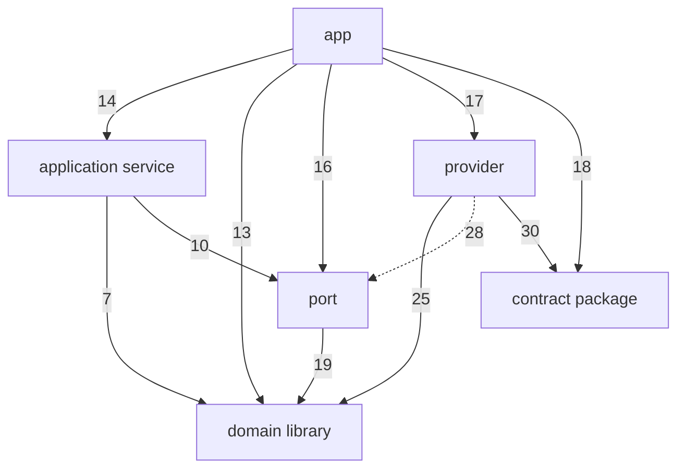
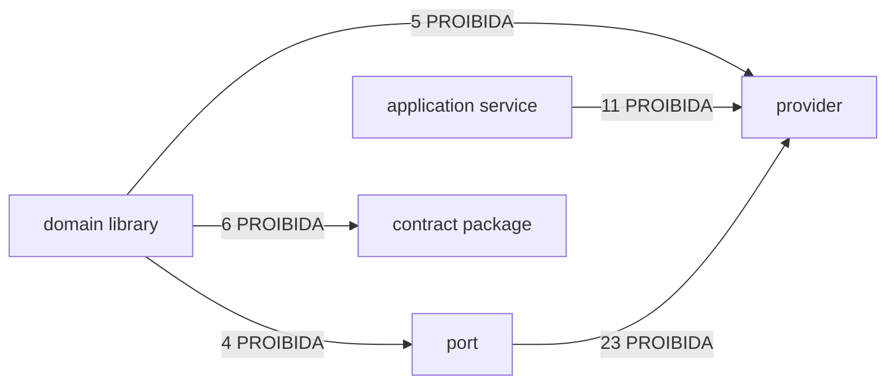
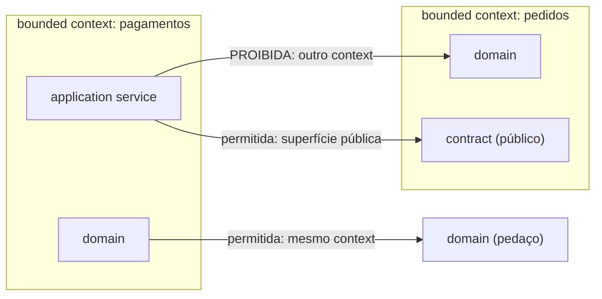

# RFC DMPF Foundation v0.1 — limites arquiteturais e regra de dependência

| Campo | Valor |
|-------|-------|
| **Status** | `normativo` — aceito em 2026-08-14 |
| **Versão** | 0.1 |
| **Owner** | Mateus Macedo Dos Anjos (assignee de [ARQ-439](https://lider-cap.atlassian.net/browse/ARQ-439)) |
| **Épico** | [ARQ-436](https://lider-cap.atlassian.net/browse/ARQ-436) — Golden Path para Sistemas Orientados a Domínio e Mensagens |
| **Story** | [ARQ-439](https://lider-cap.atlassian.net/browse/ARQ-439) (DMPF-FND-02) |
| **Spec** | [SPEC-8YVF0RR5](../specs/SPEC-8YVF0RR5-dmpf-rfc-limites-deps.md) |
| **Data** | 2026-08-14 |
| **Revisão** | Arquitetura, Segurança, Plataforma e um representante por stack (Go, TypeScript) — aberta em §14 |

> **O que significa `normativo`.** O documento obriga: as regras aqui escritas
> valem para todo trabalho novo do DMPF. A v0.1 foi **aceita** em 2026-08-14 e
> promovida de `draft normativo` para `normativo` por decisão, com as duas
> condições de §14.3 tratadas como aceitas — inclusive a reconciliação com a
> versão aprovada do inventário AS-IS, que **não** ocorreu, porque o artefato do
> FND-01 permanece `baseline candidato`. §1.5 registra a consequência disso.

---

## §1. Fronteira normativa e escopo

Esta seção existe antes de qualquer regra porque a maior fonte de erro em um
documento normativo compartilhado é a dúvida sobre o que nele obriga. Cada
afirmação desta RFC pertence a exatamente uma das quatro categorias abaixo, e
todo bloco de conteúdo é rotulado com a sua.

### §1.1 Categorias de conteúdo

| Rótulo | Significado | Obriga? |
|--------|-------------|---------|
| `normativo` | Regra que esta RFC estabelece ou recepciona, e que trabalho novo deve cumprir | **Sim** |
| `rationale` | Justificativa de uma decisão normativa, incluindo alternativas descartadas | Não |
| `evidência` | Observação datada sobre o estado atual do código, usada para lastrear ou calibrar uma decisão | Não |
| `registro de extensão` | Ponto de ID estável onde uma sub-spec futura adiciona conteúdo (§12) | Não |

`normativo` não é o rótulo default. Um glossário, um diagrama derivado ou uma
tabela de evidência não obrigam nada por si — eles servem a regras que estão em
outro lugar. Rotular tudo como norma diluiria a própria noção de obrigação.

### §1.2 O que esta RFC normatiza

O FND-02 é responsável por tornar a regra de dependência **mecanicamente
verificável**. Concretamente, esta RFC estabelece:

1. A unidade arquitetural e sua identidade canônica, por stack (§3)
2. Os seis blocos, com pertencimento, exclusão e classificação total (§4)
3. Onde as portas vivem e a identidade de bounded context (§5)
4. A política de capabilities externas, por bloco (§6)
5. A regra de dependência como função de decisão (§7)
6. O critério de domínio executável em memória (§9)
7. O contrato que um verificador precisa cumprir para implementar tudo acima (§10)
8. Os vetores de conformidade que distinguem um verificador correto de um incorreto (§11)

### §1.3 O que esta RFC apenas recepciona

Os princípios de design e a política normativa da `Parte-1-conceitual.md`
(capítulos 3, 19 e 20 **daquele** documento) são **recepcionados** aqui, em §2 —
reproduzidos com força normativa, sem reabertura. Recepcionar não é reescrever:
se houver divergência entre o texto de §2 e o da Parte-1, prevalece esta RFC, e a
divergência deve ser registrada como pendência.

> **Convenção de referência.** As duas fontes usam numeração própria e
> sobreposta, então a referência é sempre qualificada: `§N` **sem prefixo**
> designa uma seção desta RFC; um capítulo da base conceitual aparece sempre
> prefixado, como `Parte-1 §N`. Sem essa convenção, `§4` seria ambíguo entre a
> regra de dependência desta RFC e o modelo arquitetural daquela.

### §1.4 O que esta RFC não normatiza

Os temas abaixo pertencem a outras sub-specs do épico. Esta RFC **não** os
decide, e também **não** reserva seções vazias para eles — cada um tem um
registro em §12, com ID estável, dona e condição de fechamento, onde a sub-spec
correspondente adiciona conteúdo quando concluir.

| Tema | Dona |
|------|------|
| UPR, `Decision` e taxonomia de mensagens | FND-03 ([ARQ-440](https://lider-cap.atlassian.net/browse/ARQ-440)) |
| Unit of Work, inbox, outbox e relay | FND-04 ([ARQ-441](https://lider-cap.atlassian.net/browse/ARQ-441)) |
| Protobuf, CloudEvents, OpenAPI e AsyncAPI | FND-05 ([ARQ-442](https://lider-cap.atlassian.net/browse/ARQ-442)) |
| Políticas por transporte | FND-06 ([ARQ-443](https://lider-cap.atlassian.net/browse/ARQ-443)) |
| Contexto de execução, erros e segurança | FND-07 ([ARQ-444](https://lider-cap.atlassian.net/browse/ARQ-444)) |
| Resiliência e observabilidade | FND-08 ([ARQ-445](https://lider-cap.atlassian.net/browse/ARQ-445)) |
| Testes e interoperabilidade | FND-09 ([ARQ-446](https://lider-cap.atlassian.net/browse/ARQ-446)) |
| Governança, BOM e pilotos | FND-10 ([ARQ-447](https://lider-cap.atlassian.net/browse/ARQ-447)) |
| Redação, promoção e aceite dos ADRs | FND-11 ([ARQ-448](https://lider-cap.atlassian.net/browse/ARQ-448)) |

Fora do épico inteiro: a **implementação** dos linters, o arquivo real de
baseline, a proteção de branch, o workflow de aprovação e a adoção do metadado
nos repositórios existentes. Esta RFC especifica o contrato; construí-lo é dos
épicos de kernel.

### §1.5 Base factual e sua ressalva

`evidência`

Esta RFC é lastreada no inventário AS-IS produzido pelo FND-01
([ARQ-438](https://lider-cap.atlassian.net/browse/ARQ-438)):

| Item | Valor |
|------|-------|
| Artefato consolidado | [`inventario-as-is.md`](./inventario-as-is.md) |
| Commit de promoção | `54f48aa` |
| Data da consolidação | 2026-08-13 (levantamento dos cortes) / 2026-08-14 (consolidação) |
| Cobertura | 13 relatórios, 10 repositórios únicos, em [`docs/specs/SPEC-K9H204F1/`](../specs/SPEC-K9H204F1/) |
| **Status do artefato** | **`baseline candidato`** — aprovação de Plataforma/Arquitetura pendente em PR |

**Condição registrada, e como ela foi tratada.** O inventário não é um baseline
aprovado. Enquanto permanecer candidato, esta RFC o cita como **snapshot
datado**, sempre por `repo@commit` acrescido de `caminho:linha`.

A versão original desta seção condicionava a promoção de status à reconciliação
com a versão aprovada do inventário. Essa condição **não foi satisfeita**: a RFC
foi promovida a `normativo` em 2026-08-14 por decisão, com o inventário ainda em
`baseline candidato`. A obrigação não desaparece — ela muda de momento:

> `normativo` — Se a aprovação do inventário AS-IS alterar denominadores,
> inferências ou conclusões, cada decisão desta RFC que cite a evidência afetada
> **deve ser revisitada**, e a divergência tratada como mudança normativa
> (§14.2). O que a promoção antecipou foi o status, não a verificação.

`rationale` — Registrar isso em vez de apagar a condição é deliberado. Uma norma
que se apoia em evidência não aprovada continua se apoiando nela depois de
promovida; esconder o fato tornaria impossível saber, no futuro, quais decisões
precisam de nova checagem se o baseline mudar.

### §1.6 A evidência lastreia; ela não cria a norma

`normativo`

O inventário declara-se descritivo, "sem prescrever TO-BE"
([`inventario-as-is.md:146`](./inventario-as-is.md)). Essa fronteira é adotada
aqui como regra de leitura:

- A presença de uma prática no parque prova **ocorrência**, não correção
- A ausência de uma prática prova apenas que ela **não foi encontrada no corte**
- Nenhuma das duas, por si, determina qual deve ser a norma

Por isso, cada regra desta RFC declara separadamente a sua **fonte normativa**
(uma constraint P0, a spec, a Parte-1 recepcionada, ou uma decisão nova tomada
aqui) e a sua **evidência AS-IS** (conformidade, violação, lacuna, ou `não
observado no universo`). O caso que torna a distinção óbvia: Protobuf está
ausente em 10 de 10 repositórios, e ainda assim "Protobuf apenas no wire" é uma
constraint P0 — a norma vem da spec, não do parque.

### §1.7 Sucessão por escopo

`normativo`

Esta RFC substitui a `Parte-1-conceitual.md` **apenas** nos capítulos que
consolida explicitamente (os capítulos 3, 4, 19 e 20 da Parte-1, mais o seu
glossário). Os
demais capítulos da Parte-1 seguem vigentes como base conceitual até que a
sub-spec dona os consolide. Não há revogação implícita.

---

## §2. Princípios e constraints P0

### §2.1 Princípios de design

`normativo` — recepcionados da `Parte-1-conceitual.md` §3.

1. **Domínio independente** — regras e invariantes não dependem de transporte, persistência, observabilidade, cloud ou frameworks
2. **Alta coesão** — cada biblioteca de domínio representa um bounded context ou módulo coeso; cada service representa um caso de uso
3. **Dependências apontam para dentro** — camadas externas implementam portas definidas pelas camadas consumidoras
4. **Contratos explícitos** — tipos internos, mensagens de aplicação e contratos de wire são modelos distintos
5. **Composição sobre mágica** — wiring explícito no composition root; decorators e middlewares pequenos e inspecionáveis
6. **Semântica antes do transporte** — command, query e event são definidos pelo propósito, não pelo protocolo
7. **At-least-once com efeitos idempotentes** — duplicação é condição normal de sistemas distribuídos
8. **Determinismo no domínio** — tempo, identificadores e dados externos entram como valores já resolvidos ou por políticas puras
9. **Concorrência limitada** — backpressure, limites e ordenação são parte do contrato operacional
10. **Paridade conceitual, implementação idiomática** — Go e TypeScript compartilham políticas e schemas, não abstrações artificiais
11. **Observabilidade sem contaminar o domínio** — telemetria vive nos adapters, pipelines e providers
12. **Plataforma como produto** — APIs, documentação, migrações, suporte e métricas de adoção são entregáveis

O princípio 10 é a autorização explícita para que esta RFC tenha **um contrato
abstrato único** de unidade arquitetural com **bindings físicos distintos** por
stack (§3). Paridade conceitual não exige unidade física idêntica.

### §2.2 Modos de verificação

`normativo`

Nem toda regra desta RFC é verificável pelo mesmo mecanismo. Confundir os modos
produz duas falhas simétricas: prometer que um linter garante o que ele não
alcança, e abandonar uma regra só porque o linter não a alcança. Toda cláusula
normativa declara o seu modo:

| Modo | Significado | Instrumento |
|------|-------------|-------------|
| `import-verifiable` | Decidível pela análise estática do grafo de imports e do metadado declarado | Linter de dependências (§10) |
| `structurally reviewable` | Decidível pela inspeção da estrutura do código ou da configuração, sem executá-lo, mas não redutível a uma regra de import | Revisão de código, checagem estrutural |
| `runtime-testable` | Só demonstrável executando o sistema | Teste de integração, teste de propriedade |

### §2.3 As quatro constraints P0

`normativo`

As quatro restrições abaixo são inegociáveis e vêm da
[`SPEC-8YVF0RR5`](../specs/SPEC-8YVF0RR5-dmpf-rfc-limites-deps.md). Cada uma tem
cláusula dona nesta RFC, alcance declarado e modo de verificação — nenhuma fica
sem responsável.

#### P0-1 — Domínio sem I/O

> O domínio não importa Protobuf, OpenAPI, ORM, broker, SDK de cloud, HTTP,
> logger, tracing, cache ou framework de execução.

| Campo | Valor |
|-------|-------|
| Cláusula dona | §6 (capabilities externas) e §7 (regra de dependência) |
| Alcance | Todo módulo classificado como `domain` |
| Modo | `import-verifiable` |
| Complemento | §9 acrescenta o teste de executabilidade em memória, que é `runtime-testable` |

#### P0-2 — Protobuf apenas no wire

> Tipos gerados de Protobuf nunca são o modelo interno de domínio.

| Campo | Valor |
|-------|-------|
| Cláusula dona | §4 (bloco `contract package`) e §7 (aresta `domain → contract`) |
| Alcance | Todo módulo `domain`; o bloco `contract package` é o único lugar dos tipos de wire |
| Modo | `import-verifiable` |
| Evidência | Protobuf está ausente em 10/10 repositórios ([`inventario-as-is.md:77`](./inventario-as-is.md)) — a norma é prospectiva, não descritiva |

#### P0-3 — At-least-once com efeitos idempotentes

> A semântica oficial de entrega é at-least-once com efeitos idempotentes.
> Nenhum componente, documento, configuração ou contrato pode prometer
> exactly-once fim a fim.

| Campo | Valor |
|-------|-------|
| Cláusula dona | **Esta seção (§2.3), integralmente** |
| Alcance | Toda comunicação assíncrona do DMPF. O detalhamento dos mecanismos (inbox, outbox, relay, deduplicação) é de FND-04; as políticas por transporte são de FND-06. A **vedação** e a **semântica oficial** são fixadas aqui e não podem ser relaxadas por sub-spec (§12) |
| Modo | `structurally reviewable` para a vedação — nenhum documento, README, contrato ou configuração do DMPF pode declarar ou sugerir exactly-once E2E; `runtime-testable` para o efeito idempotente sob redelivery |
| Nota | Esta é a única constraint P0 que **não** é `import-verifiable`. Um linter de imports não a prova, e §11 registra vetores que a exercitam pelos modos corretos, sem fingir o contrário |

`evidência` — a prática atual é heterogênea: `shared-titulos-services` tem outbox
transacional e inbox com chave única; `rendafacil-services` tem delete-on-error
que pode perder mensagem; `telesena-ativavel-services` registra lacuna de
idempotência no consumer ([`inventario-as-is.md:175-183`](./inventario-as-is.md)).
A distância até a norma é material e conhecida.

#### P0-4 — Kernels e providers de produção fora do escopo normativo

> Kernels Go e TypeScript, adapters e providers de produção não são entregues
> nem especificados por este épico. Ele entrega fundação normativa.

| Campo | Valor |
|-------|-------|
| Cláusula dona | §1.4 (fronteira) |
| Alcance | Todo o épico ARQ-436 |
| Modo | `structurally reviewable` — verificável pela ausência de entregável de implementação nas sub-specs |

### §2.4 Precedência

`normativo`

Em caso de conflito entre cláusulas desta RFC, a ordem de precedência é:

1. As constraints P0 (§2.3)
2. As regras de §7 (regra de dependência)
3. As demais seções normativas
4. Os princípios recepcionados (§2.1)

Conflito entre esta RFC e a `Parte-1-conceitual.md`: prevalece esta RFC, nos
capítulos que ela consolida (§1.7). Conflito entre esta RFC e uma sub-spec:
prevalece esta RFC, salvo nova versão acompanhada de ADR (§12).

---

## §3. Unidade arquitetural e resolução do grafo

Uma regra de dependência só é verificável se houver resposta inequívoca para
duas perguntas: *que coisa* é classificada em um bloco, e *como* se descobre a
qual coisa um arquivo pertence. Esta seção responde às duas.

### §3.1 Quatro conceitos, não um

`normativo`

A palavra "módulo" é usada informalmente para coisas distintas, e tratá-las como
uma só é a origem de boa parte da ambiguidade. Esta RFC separa quatro conceitos:

| Conceito | Definição | Serve para |
|----------|-----------|------------|
| `ownership_module` | Menor artefato com ciclo de vida próprio — versionado, publicado e possuído de forma independente | Ownership, release, versionamento |
| `verification_unit` | Menor conjunto de código a que uma classificação de bloco se aplica **integralmente** | Ser o vértice do grafo de dependências |
| `metadata_container` | Artefato físico onde a classificação de uma `verification_unit` é declarada | Portar `block` e `bounded_context` |
| `canonical_key` | Identificador estável e único de uma `verification_unit` dentro do universo | Ser a chave do baseline e das arestas |

`normativo` — Os quatro são independentes. Em particular, **`ownership_module` e
`verification_unit` não coincidem**, e presumir que coincidem é erro: em Go, uma
lib é um módulo com uma camada, mas um app é um módulo com todas as camadas. A
classificação nunca se aplica ao `ownership_module`.

### §3.2 Invariantes da `verification_unit`

`normativo`

Qualquer binding físico proposto por uma stack deve satisfazer as seis
invariantes abaixo. Elas são o critério de aceitação de um binding — não
preferências.

| # | Invariante | Enunciado |
|---|------------|-----------|
| I1 | **Cobertura total** | Todo arquivo de produção do universo pertence a exatamente uma `verification_unit` |
| I2 | **Não sobreposição** | Nenhum arquivo pertence a duas unidades |
| I3 | **Independência de tooling** | O binding funciona sem depender de um build system específico |
| I4 | **Opacidade a alias** | A unidade de um arquivo não muda conforme a forma sintática usada para importá-lo |
| I5 | **Move/rename explícito** | Mover ou renomear um arquivo não pode reclassificá-lo silenciosamente |
| I6 | **Determinismo** | Duas execuções sobre a mesma árvore produzem a mesma atribuição |

`rationale` — I5 é a invariante que mais separa as alternativas. Um binding que
deriva a classificação da posição do arquivo transforma um `git mv` em uma
mudança normativa sem intenção declarada e sem revisão — o mesmo vetor de
reclassificação silenciosa que §10 combate no metadado.

### §3.3 Binding em Go

`normativo`

Em Go, a `verification_unit` é o **package** (diretório).

| Conceito | Binding em Go |
|----------|---------------|
| `ownership_module` | O módulo — diretório com `go.mod` |
| `verification_unit` | O package (diretório) |
| `metadata_container` | Ver §10 (a forma do metadado é do contrato do verificador) |
| `canonical_key` | O import path completo do package |

`rationale` — O package é a unidade que o próprio compilador reconhece e sobre a
qual a análise de imports opera nativamente; o import path já é um identificador
estável e único, sem necessidade de convenção adicional. As seis invariantes são
satisfeitas por construção da linguagem, com uma ressalva em I5: mover um arquivo
entre diretórios muda o package, e portanto a unidade — mas em Go isso é uma
mudança visível, porque a cláusula `package` no topo do arquivo precisa mudar
junto e o compilador recusa a incoerência.

`evidência` — O binding é compatível com os quatro repositórios Go inventariados,
inclusive nos dois layouts que convivem: hexagonal com
`internal/{domain,application,ports,infra}` (`shared-ro-sync-services`) e camadas
sob `src/` (`backoffice-procap-services`). Em `rendafacil-services`, que não tem
camada `domain` alguma, o binding continua aplicável — os packages existem e são
classificáveis; o que falta lá é a classificação, não a unidade.

### §3.4 Binding em TypeScript

O projeto **não** serve como `verification_unit` em TypeScript.

`evidência` — `telesena-titulos-services/apps/api` é um único projeto Nx que
contém `src/{domain,application,infra}`: a fronteira de camada não é fronteira de
projeto. E `rendafacil-bff` não usa Nx — é projeto único, sem `domain/`. Um
binding que dependesse do projeto violaria I1 no primeiro caso (a unidade
conteria três blocos) e I3 no segundo.

#### Alternativas avaliadas

| Alternativa | I1 | I2 | I3 | I4 | I5 | I6 | Veredicto |
|-------------|:--:|:--:|:--:|:--:|:--:|:--:|-----------|
| **A.** Pasta de camada (`src/domain/**`) | ~ | ✔ | ✔ | ✔ | ✘ | ✔ | Falha I5: `git mv` reclassifica em silêncio. Falha I1 onde não há convenção de pasta |
| **B.** Manifesto de roots | ✔ | ✔ | ✔ | ✔ | ✔ | ✔ | **Escolhida** |
| **C.** Pacote npm | ✘ | ✔ | ✔ | ✔ | ✔ | ✔ | Falha I1: grosso demais — é exatamente o caso de `apps/api` com três camadas |
| **D.** TS project references | ✔ | ✔ | ✔ | ✔ | ✔ | ✔ | Satisfaz tudo, mas exige reestruturar os repositórios em subprojetos. Adotada como evolução opcional, não como exigência |
| **E.** Conjunto explícito de arquivos | ✔ | ✔ | ✔ | ✔ | ✔ | ✔ | Satisfaz tudo e é inviável em escala: manutenção proporcional ao número de arquivos |

#### Decisão

`normativo` — Em TypeScript, a `verification_unit` é o **root declarado em
manifesto**.

Um manifesto por `ownership_module` declara conjuntos de caminhos disjuntos, cada
um com a sua classificação:

```jsonc
// dmpf-units.json — na raiz do ownership_module
{
  "units": [
    { "id": "pedidos/domain",      "include": ["src/domain/**"] },
    { "id": "pedidos/application", "include": ["src/application/**"] },
    { "id": "pedidos/infra",       "include": ["src/infra/**"] }
  ]
}
```

| Conceito | Binding em TypeScript |
|----------|----------------------|
| `ownership_module` | O pacote — diretório com `package.json` |
| `verification_unit` | O root declarado no manifesto |
| `metadata_container` | O próprio manifesto (ver §10 para o schema) |
| `canonical_key` | `<nome do pacote>#<id da unidade>` |

`rationale` — O manifesto é o único candidato que satisfaz as seis invariantes
**sem** exigir reestruturação prévia dos repositórios. Ele é adotável sobre o
layout que já existe, e é a única alternativa em que I5 vale por construção: um
arquivo movido para fora de todos os `include` deixa de pertencer a qualquer
unidade e, por §3.6, **falha fechado**. A reclassificação passa a exigir uma
edição visível no manifesto, que é revisável em PR — que é precisamente a
propriedade que o binding por pasta não tem.

A alternativa D permanece registrada como caminho de evolução: um repositório que
já use project references pode derivar o manifesto deles, e a RFC não o proíbe.
O que ela não faz é **exigir** a reestruturação como condição de conformidade.

`normativo` — O manifesto é declaração, não descoberta. Um caminho não coberto
por nenhum `include` não é classificado por inferência, e sobreposição entre dois
`include` é erro de configuração, não ambiguidade a resolver por precedência.

### §3.5 Resolução de origem e destino

`normativo`

Uma aresta do grafo liga duas `verification_unit`. Dado um import, a resolução é:

1. **Origem** — a unidade a que pertence o arquivo que contém a instrução de import
2. **Destino** — resolver a especificação do import até um **caminho de arquivo
   real**, e então determinar a unidade desse arquivo

`normativo` — A resolução do destino ocorre **antes** da classificação, e sobre
o arquivo resolvido, nunca sobre o texto do import. Disso decorre I4: importar o
mesmo arquivo por caminho relativo, por alias de `tsconfig`, por subpath de
`exports` ou por barrel produz **a mesma aresta**. Um barrel que reexporta de
outra unidade não fabrica nem esconde arestas — a aresta é para a unidade do
arquivo que define o símbolo.

Imports que não resolvem para um arquivo do universo são **dependências
externas**, e seguem §6, não a matriz de §7. A semântica completa da resolução —
o que conta como import, versões e entrypoints, código condicional, imports
dinâmicos, exclusões por stack — é do contrato do verificador, em §10.

### §3.6 Casos degenerados

`normativo` — Todos falham fechados. Nenhum é resolvido por inferência.

| Caso | Comportamento |
|------|---------------|
| Arquivo de produção não coberto por nenhuma unidade | **Reprova** — viola I1 |
| Arquivo coberto por duas unidades | **Reprova** — viola I2 |
| Import cujo destino não resolve para arquivo nem para dependência externa declarada | **Reprova** — a aresta não pode ser classificada |
| `canonical_key` duplicada no universo | **Reprova** — a chave deixa de identificar |
| Manifesto ausente em `ownership_module` que contém código de produção | **Reprova** |

`rationale` — Falhar fechado é o que impede que uma lacuna de configuração seja
lida como conformidade. Um verificador que ignore o arquivo não classificado
reporta verde para o caso em que menos sabe.

## §4. Blocos, classificador total e mapa de responsabilidades

Esta seção **é** o mapa de responsabilidades do DMPF. Ela responde a duas
perguntas distintas: o que cada bloco faz e não faz (§4.1), e como decidir a que
bloco uma `verification_unit` pertence (§4.3).

### §4.0 O que o classificador é, e o que ele não é

`normativo`

A classificação de uma `verification_unit` é **declarada** no seu
`metadata_container` (§10), não inferida pelo verificador. O classificador desta
seção é o critério normativo que determina **qual declaração é correta** — ele
é o instrumento de quem escreve e de quem revisa a declaração.

Disso decorre uma limitação que esta RFC declara abertamente, em vez de
dissimular:

> `normativo` — O verificador prova que os imports de uma unidade são
> **compatíveis com a classificação declarada**. Ele não prova que a
> classificação declarada corresponde à responsabilidade real do código. Essa
> correspondência é responsabilidade da revisão humana, apoiada por §4.3, e o
> mecanismo que a protege de alteração oportunista está em §10.

### §4.1 Os seis blocos

`normativo`

| Bloco | Responsabilidade | Pertence | **Não** pertence |
|-------|------------------|----------|------------------|
| **domain library** | Estado, invariantes, policies, specifications, UPRs e eventos de domínio | Código que expressa regra de negócio, é determinístico e não realiza nem descreve I/O | Qualquer coisa que execute ou descreva I/O; DTO de transporte; tipo gerado de wire; entidade de ORM; tipo de driver; decorator de framework |
| **application service** | Orquestrar um caso de uso: autorização, transação, sequência, persistência por porta e gravação da outbox | Coordenação de um caso de uso ponta a ponta | Regra de negócio (é `domain`); conhecimento de broker, driver, tabela, tópico ou fila; instanciação de provider concreto |
| **app** | Adaptar protocolo, autenticar, validar entrada, mapear, compor dependências e gerir lifecycle | Adapter de entrada, composition root, wiring, configuração de runtime | Regra de negócio; orquestração de caso de uso que caiba em `application service` |
| **port** | Expressar a capacidade requerida pela camada consumidora | Interface ou contrato de saída, definido pelo consumidor, cuja assinatura usa apenas tipos do consumidor | Implementação; tipo de driver, SDK ou wire na assinatura; interface genérica que não expressa um caso de uso real |
| **provider** | Implementar uma ou mais portas com tecnologia concreta | Adapters, drivers, clientes de SDK, repositórios, publishers | Regra de negócio; decisão de caso de uso; definição da porta que implementa |
| **contract package** | Definir contratos de wire versionados | Schemas, tipos gerados, envelopes, registries de rota | Lógica de negócio; orquestração; I/O |

### §4.2 Precedência de desempate

`normativo`

Quando uma unidade parece satisfazer o pertencimento de mais de um bloco, a
decisão segue três regras, nesta ordem:

1. **Exclusão vence pertencimento.** Se a unidade satisfaz a coluna "não
   pertence" de um bloco, ela não é daquele bloco — mesmo que satisfaça o
   pertencimento. As exclusões são absolutas.
2. **Responsabilidade dominante.** Persistindo o empate, vence o bloco que
   descreve o que a unidade faz de mais consequente para o sistema, não o que ela
   faz em maior volume de linhas.
3. **Divisão.** Persistindo o empate após (1) e (2), a unidade está mal
   dimensionada e **deve ser dividida** em unidades cujo pertencimento seja
   único. Empate irredutível não é resolvido por escolha — é sintoma de que a
   `verification_unit` agrega responsabilidades distintas.

`rationale` — A regra 3 é o que preserva a exigência de pertencimento único da
spec sem forçar uma escolha arbitrária. Uma unidade que é genuinamente `domain` e
`provider` ao mesmo tempo não tem classificação correta; tem tamanho errado.

### §4.3 Classificador total

`normativo`

Aplicado a uma `verification_unit`, na ordem. A primeira condição satisfeita
determina o bloco.

| Ordem | Condição | Bloco |
|:-----:|----------|-------|
| 1 | Define apenas contratos de wire versionados — schemas, tipos gerados, envelopes — sem lógica | `contract package` |
| 2 | Executa ou encapsula I/O concreto, ou depende de driver, SDK, broker ou framework de infraestrutura, implementando capacidade declarada em outro lugar | `provider` |
| 3 | É o ponto de entrada do processo, adapta protocolo ou compõe dependências concretas | `app` |
| 4 | Declara capacidades requeridas, sem implementá-las, com assinaturas em tipos do consumidor | `port` |
| 5 | Orquestra um caso de uso — sequência, transação, autorização — delegando o I/O a portas | `application service` |
| 6 | Expressa regra de negócio determinística, sem I/O | `domain library` |
| — | Nenhuma condição satisfeita | **Reprova** — a unidade não é classificável e §3.6 se aplica |

`normativo` — A ordem importa e não é arbitrária: as condições mais restritivas
e mais objetivamente observáveis vêm primeiro. Uma unidade que executa I/O é
`provider` ainda que contenha regra de negócio embutida — e nesse caso a regra de
negócio está no lugar errado, o que §4.2 regra 3 manda corrigir por divisão.

`normativo` — A classificação **total** significa que nenhuma unidade de produção
fica sem bloco. A linha final é fail-closed, não escape.

### §4.4 O nome não classifica

`normativo`

Nenhuma decisão de classificação pode ser derivada do nome de um diretório, de um
arquivo ou de um pacote.

`evidência` — No universo inventariado, o diretório `domain/` designa **três
coisas diferentes**:

| Repositório | O que `domain/` contém | Bloco correto |
|-------------|------------------------|---------------|
| `backoffice-procap-services` (`apps/api/src/domain/**`) | Entidades e invariantes de negócio, sem gin/pgx/aws/otel | `domain library` |
| `golibs` (`packages/goauth/domain`, `gocache/domain`) | Modelo da *capability técnica* da própria biblioteca | não é `domain library` de negócio |
| `telesena-live-services` (`apps/api/src/domain/**/types`) | DTOs com `@nestjs/swagger` e `class-validator` | `contract package` ou `app` |

Um classificador que lesse o nome do diretório marcaria os três como
`domain library`, e erraria em dois. É por isso que a classificação é declarada
e revisada, nunca inferida do layout.

`evidência` — O caso inverso também ocorre: `rendafacil-services` não tem
diretório `domain` algum, e ainda assim contém regra de negócio — distribuída em
`apps/*/modules/**` junto de GORM, SQS e HTTP. A ausência do nome não prova
ausência do bloco; prova que o bloco não está isolado.

### §4.5 Regra anti-bypass

`normativo`

As exclusões do universo verificável existem para não auditar o que não é
produção. Usá-las para esconder uma aresta é violação.

1. **Dependência sobre elemento excluído.** Código de produção não pode depender,
   em runtime, de elemento excluído do universo, salvo exceção nominal registrada
   na RFC ou no manifesto, com justificativa.
2. **Código gerado.** Código gerado que é consumido em runtime segue as regras do
   bloco que o consome. Gerar não isenta.
3. **Testes.** Teste não altera a classificação do código sob teste. Um teste que
   importa um driver não torna a unidade testada um `provider`, e uma unidade
   `domain` não deixa de sê-lo por ter teste que usa infraestrutura — embora §9
   proíba que ela **precise** de infraestrutura para ser testada.
4. **Rotulagem oportunista.** Marcar código de produção como gerado, como
   migration ou como teste para escapar da regra é violação da RFC,
   independentemente de o verificador detectá-la.

`rationale` — A regra 4 existe porque as três primeiras criam categorias de
exclusão, e toda categoria de exclusão é um incentivo. Declará-la fecha o caminho
mais barato de burla: mover a aresta proibida para dentro de algo que o
verificador não olha.

### §4.6 Casos-limite resolvidos

`normativo` — Os casos abaixo são recorrentes e ficam decididos aqui.

| Caso-limite | Bloco dono | Observação |
|-------------|-----------|------------|
| **Validação** de invariante de negócio | `domain library` | É regra, não formato |
| **Validação** de formato de entrada | `app` | Pertence ao adapter de protocolo |
| **Mapeamento** wire ↔ domínio | `app` ou `provider` | Nunca `domain` — mapear pressupõe conhecer o formato externo |
| **Cache** | `port` + `provider` | A capacidade é porta; a tecnologia é provider |
| **Retry** e backoff | `provider` ou `app` | Política operacional, não regra de negócio |
| **Kernel** técnico do framework | `provider`, ou fora do universo se for dependência externa | §6 decide; a natureza não muda por ser interno |
| **Execution context** (tenant, correlação, identidade) | `port` + `provider` | O domínio recebe valores já resolvidos (princípio 8) |
| **Código gerado** de wire | `contract package` | §4.5 regra 2 |
| **Testes** | Excluídos do universo de produção | §4.5 regra 3 |
| **Migrations** | `provider`, ou excluídas | Lógica de negócio em migration é violação de §4.5 regra 4 |
| **Configuração** | `app` | Composition root |
| **Outbox** | Ver §7 | A escrita e a drenagem têm donos distintos; decidido na regra de dependência |

`evidência` — O caso do outbox foi deferido a §7 por ter estrutura real
observada: em `shared-titulos-services`, a tabela `backoffice_outbox` é escrita
dentro da transação do caso de uso, e drenada por apps dispatcher dedicados
(`premiacao-dispatch`, `pedido-site-dispatch`). Escrita e drenagem são
responsabilidades distintas e não podem receber o mesmo bloco por conveniência.

## §5. Ownership de portas e bounded context

### §5.1 Onde as portas vivem

`normativo` — recepcionado da `Parte-1-conceitual.md` §4.3.

As interfaces ficam próximas de quem as consome:

- Policies e domain services puramente computacionais **vivem no domínio**
- Repositórios, transações, outbox, cache e clientes externos vivem na camada de
  aplicação ou em um módulo de portas compartilhadas
- Providers implementam essas interfaces
- Uma interface pequena e específica, que expresse o caso de uso, é preferível a
  uma interface genérica de framework

### §5.2 A aresta `domain → port` é proibida

`normativo`

Uma `verification_unit` classificada como `domain library` **não pode** importar
uma unidade classificada como `port`. A aresta é `PROIBIDA`, sem condicional e
sem exceção.

`rationale` — Esta decisão resolve uma ambiguidade que, mantida, tornaria a regra
inverificável. O raciocínio tem três passos:

**1. "Policies computacionais vivem no domínio" significa que elas *são* `domain`.**
A leitura oposta — de que o domínio poderia importar um bloco `port` desde que a
porta fosse "computacional" — introduz uma distinção que o verificador não
consegue observar. Diante de `domain → port`, um linter vê dois blocos e nada
mais; ele não tem como decidir se a porta do outro lado é computacional ou de
infraestrutura. Permitir a aresta deixaria passar a porta de infraestrutura que a
spec proíbe nominalmente; proibi-la mataria a exceção. Não há terceira saída com
os campos disponíveis.

**2. O bloco `port` fica reservado a capacidades de fronteira.** Uma interface que
expressa apenas computação determinística não é `port` — é `domain`. §4.1 já
define assim: `port` é "a capacidade requerida pela camada consumidora" para o
que ela não faz sozinha, e o que o domínio faz sozinho é computar.

**3. O caso residual é fechado pelo princípio 8.** Restaria perguntar de que o
domínio precisaria por porta sem ser I/O — relógio, gerador de identificador,
fonte de aleatoriedade. O princípio 8 (determinismo no domínio) já responde:
"tempo, identificadores e dados externos entram como valores já resolvidos ou por
políticas puras". O domínio não pede a hora; ele a recebe. Com isso, não sobra
caso legítimo em que o domínio precise importar `port`.

`normativo` — Consequência operacional: uma interface hoje colocada em uma
unidade `port` que seja puramente computacional está **mal classificada**. A
correção é reclassificá-la como `domain`, não abrir exceção na matriz.

`evidência` — O caso real é `golibs/packages/goservice`, cuja unidade `domain`
declara a porta `EventPublisher`. Publicar evento é I/O, logo `EventPublisher` é
`port` de infraestrutura, logo a unidade que a declara não é `domain library`.
Pela §4.2 regra 3, a unidade está mal dimensionada e deve ser dividida. Este é um
caso de **violação observada**, não uma autorização derivada do layout — o
diretório chamar-se `domain/` não o torna `domain` (§4.4).

### §5.3 Por que não uma subclasse de porta

`rationale`

Foi considerada a introdução de uma subclasse normativa fechada — por exemplo
`port_kind: computational | infrastructure` — que tornaria `domain → port`
decidível por um campo adicional. Descartada por três razões:

1. **Superfície.** Um campo novo exige gramática, cardinalidade, herança,
   cobertura no baseline, comportamento em ausência e valor desconhecido, e
   vetores próprios — todo o aparato de §10 duplicado para uma distinção que a
   §5.2 elimina.
2. **Redundância.** Uma porta "computacional" é, pela definição de §4.1,
   `domain`. A subclasse nomearia como variante de `port` algo que já tem bloco.
3. **Superfície de burla.** Um campo que relaxa uma aresta P0 é o alvo natural de
   reclassificação oportunista — exatamente o risco que §10 precisa conter. Não
   criar o campo é a mitigação mais barata.

### §5.4 Identidade canônica de bounded context

`normativo`

Toda `verification_unit` declara um `bounded_context` no seu
`metadata_container`, junto do `block`. O valor é uma **string estável e única no
universo**, e obedece a:

| Regra | Enunciado |
|-------|-----------|
| Declarada | O `bounded_context` é declarado, nunca inferido de diretório, nome de pacote ou topologia de fila |
| Obrigatória | Toda unidade de produção tem exatamente um; ausência **reprova** (§3.6) |
| Estável | Renomear um `bounded_context` é mudança normativa, sujeita a §10 |
| Ortogonal ao bloco | Um mesmo `bounded_context` tem unidades de vários blocos; um mesmo bloco aparece em vários contexts |

`evidência` — Nenhum dos dez repositórios inventariados nomeia bounded contexts à
moda DDD. As aproximações existentes são heterogêneas e nenhuma serve como fonte
canônica: `shared-ro-sync-services` separa por `entity_type` (clientes, títulos,
pedidos), materializado no `FilterPolicy` de SNS→SQS e em um worker por tipo;
`telesena-titulos-services` tem subpastas `domain/{combination,promocoes,quiz,titulos}`;
`rendafacil-bff` e `rendafacil-services` usam feature folders sem contrato que os
sustente. Declarar o campo é, portanto, adoção nova — e é por isso que §1.4 deixa
a implantação para os épicos de kernel.

### §5.5 Dependências entre bounded contexts

`normativo` — recepcionado da `Parte-1-conceitual.md` §4.2 e tornado verificável.

Uma unidade **não pode** importar a `domain library` de outro `bounded_context`.
A interação entre contexts ocorre por contrato de integração ou API pública.

Disso decorre que a regra de dependência **não é função apenas do par de blocos**:
a mesma aresta `domain → domain` é permitida dentro de um context e proibida entre
contexts. §7 formaliza isso com os predicados `same_bounded_context` e
`public_integration_surface`.

`normativo` — `public_integration_surface` qualifica a unidade de **destino**: uma
unidade é superfície pública de integração quando é `contract package`, ou quando
é explicitamente declarada como API pública do seu context no
`metadata_container`. Uma unidade não declarada é interna ao seu context, e
importá-la de fora é violação — o default é privado.

## §6. Política de capabilities externas

A matriz de §7 governa arestas **entre unidades do universo**. Ela não alcança um
import de `mssql`, de GORM ou do AWS SDK — esses não são unidades classificadas,
são dependências externas. Sem esta seção, a regra mais consequente do DMPF
ficaria sem cobertura: um `application service` poderia importar um driver
concreto e passar verde na matriz.

### §6.1 O que é dependência externa

`normativo`

Uma dependência é **externa** quando o import não resolve para um arquivo do
universo verificável (§3.5). Toda dependência externa é atribuída a uma
**capability** — a natureza do acesso que ela dá ao código:

| Capability | Exemplos |
|------------|----------|
| `io.storage` | Driver de banco, ORM, cliente de objeto |
| `io.messaging` | SDK de broker, cliente de fila ou tópico |
| `io.network` | Cliente HTTP, gRPC, cliente de serviço externo |
| `io.filesystem` | Acesso a disco |
| `io.clock` | Relógio de parede, temporizador |
| `io.random` | Fonte de entropia não determinística |
| `runtime.framework` | Framework de execução, injeção de dependência, decorators de servidor |
| `wire.codec` | Toolchain de serialização e schema |
| `observability` | Logger, tracer, métricas, APM |
| `pure` | Computação determinística sem efeito externo |

`normativo` — A atribuição de capability é declarada na allowlist (§6.3), nunca
inferida do nome do pacote.

### §6.2 Política por bloco

`normativo`

| Bloco | Política | Capabilities permitidas |
|-------|----------|-------------------------|
| `domain library` | **default deny** | Apenas `pure` |
| `port` | **default deny** | Apenas `pure` — a assinatura de uma porta não expõe tipo de driver, SDK ou wire |
| `application service` | default deny com exceção nominal | `pure`; nenhuma capability `io.*`, `runtime.framework` nem `wire.codec` |
| `contract package` | restrita | `pure` e `wire.codec` |
| `provider` | permissiva | Qualquer capability correspondente à porta que implementa |
| `app` | permissiva no composition root | Qualquer capability; a instanciação de provider concreto ocorre **apenas** no composition root |

`normativo` — A política de `application service` é a que mais diverge da prática
observada e a que menos admite flexibilização: um caso de uso não conhece broker,
driver, tabela, tópico ou fila. Precisar de I/O significa precisar de uma porta.

`evidência` — Violação observada: `shared-titulos-services`, em
`admin-api-go/.../virar_campanha.usecase.go`, importa GORM na camada de
aplicação. Conformidade observada: os workers Go de `shared-ro-sync-services`
declaram `internal/ports/{inbound,outbound}` e mantêm o acesso concreto em
`internal/infra/*`.

`normativo` — `observability` merece regra própria, porque é a exceção que mais
se pede: telemetria **não** é permitida no domínio nem na porta, ainda que a
biblioteca de logging seja tecnicamente pura. O princípio 11 é explícito —
observabilidade vive nos adapters, pipelines e providers.

### §6.3 Allowlist e pureza transitiva

`normativo`

Uma dependência externa só é utilizável por um bloco `default deny` se constar de
uma **allowlist** que declare, por entrada: o identificador do pacote, a faixa de
versões, os entrypoints permitidos e a capability atribuída.

A **pureza** de uma entrada é transitiva: um pacote declarado `pure` que
introduza, por qualquer caminho do seu fechamento, uma capability diferente de
`pure`, **deixa de ser** `pure` — e o uso dele passa a violar a política do bloco.

`normativo` — O fechamento transitivo é computado com estas regras:

| Questão | Regra |
|---------|-------|
| A partir de quê | Dos **entrypoints declarados** na allowlist, não do pacote inteiro. Um pacote com subpath puro e subpath impuro pode ter apenas o primeiro declarado |
| Em qual versão | Na faixa declarada. Mudança de versão que altere o fechamento **reprova** até a allowlist ser revista |
| Dependências opcionais | Contam para o fechamento se puderem ser resolvidas na configuração de build usada em produção |
| Builtins da linguagem | Recebem capability como qualquer outra dependência. `net/http` é `io.network`; `crypto` é `pure` |
| Imports dinâmicos | Contam quando o alvo for estaticamente determinável. Quando não for, **reprova** — §3.6 |
| Código gerado | Conta pelo que ele importa em runtime, não pelo gerador (§4.5 regra 2) |
| Dependência não resolvida | **Reprova** — não é tratada como ausente |

`rationale` — A regra dos entrypoints é o que torna a allowlist utilizável na
prática. Sem ela, qualquer pacote grande o bastante seria impuro por conter, em
algum subpath, um acesso a I/O — e a política viraria proibição total de
biblioteca externa no domínio.

### §6.4 Exceção nominal

`normativo`

Uma exceção à política de um bloco é válida apenas se for **nominal**: registrada
com o par (unidade, dependência), justificativa, owner e data de revisão. Exceção
por categoria, por prefixo de pacote ou por diretório é proibida — ela deixa de
ser exceção e vira política paralela não revisada.

## §7. Regra de dependência

### §7.1 A decisão é uma função, não uma célula

`normativo`

Uma matriz 6×6 de blocos **não** expressa a regra do DMPF. A mesma aresta
`domain → domain` é permitida dentro de um bounded context e proibida entre
contexts (§5.5) — uma célula não diz as duas coisas. A decisão é, portanto, uma
função de cinco argumentos:

```text
decide(source_block, target_block, source_bc, target_bc, target_surface)
    → PERMITIDA | PROIBIDA
```

`normativo` — A função é a conjunção de duas condições **independentes**. A
aresta é permitida se, e somente se, as duas forem satisfeitas:

| Condição | Definição |
|----------|-----------|
| **C1 — bloco** | O par `(source_block, target_block)` é `PERMITIDA` na matriz de §7.3 |
| **C2 — contexto** | `same_bounded_context` **ou** `public_integration_surface(destino)` |

Reprovar em qualquer uma reprova a aresta. C1 falhando emite `DMPF-D001`; C2
falhando emite `DMPF-D002` (§10.3).

### §7.2 Os predicados

`normativo`

| Predicado | Definição | Observável em |
|-----------|-----------|---------------|
| `same_bounded_context` | `source_bc == target_bc`, comparação exata de strings | `bounded_context` das duas unidades (§10.1) |
| `public_integration_surface` | A unidade de destino é `contract package`, **ou** declara `public_integration_surface: true` | `metadata_container` do destino |

`normativo` — **Uma `domain library` nunca é superfície pública de integração.**
Declarar `public_integration_surface: true` em unidade de bloco `domain` é
inválido e emite `DMPF-M002`. Sem essa cláusula, o campo seria o caminho trivial
para burlar §5.5: bastaria marcar o domínio como público para que outro context
o importasse.

`rationale` — Separar C1 de C2 é o que torna a regra inter-context verificável
sem multiplicar a matriz por contexto. A matriz responde "esse tipo de código
pode depender daquele tipo de código?"; o predicado responde "essas duas partes
do sistema podem se falar?". São perguntas distintas, e tratá-las como uma só era
o defeito da matriz pura.

### §7.3 Matriz de blocos (condição C1)

`normativo` — Leitura: linha é origem, coluna é destino. `P` = permitida,
`✗` = proibida.

| De ↓ / Para → | domain | application | app | port | provider | contract |
|---------------|:------:|:-----------:|:---:|:----:|:--------:|:--------:|
| **domain**      | P | ✗ | ✗ | ✗ | ✗ | ✗ |
| **application** | P | P | ✗ | P | ✗ | ✗ |
| **app**         | P | P | P | P | P | P |
| **port**        | P | ✗ | ✗ | P | ✗ | ✗ |
| **provider**    | P | ✗ | ✗ | P | P | P |
| **contract**    | ✗ | ✗ | ✗ | ✗ | ✗ | P |

`normativo` — Toda aresta marcada `P` continua sujeita a C2 (§7.1) e à política de
capabilities externas (§6). `P` na matriz não é autorização final.

### §7.4 Decisão por célula

`normativo` — As 36 células, com decisão, fonte normativa, evidência e razão.
Fonte `P0-n` remete a §2.3; `Parte-1` remete ao capítulo recepcionado; `RFC` marca
decisão nova tomada neste documento.

| # | De → Para | Decisão | Fonte | Evidência AS-IS | Razão |
|---|-----------|---------|-------|-----------------|-------|
| 1 | domain → domain | **P** + C2 | Parte-1 §4.2 | Não observado (nenhum repo declara bounded context) | Coesão dentro do context; entre contexts, só por contrato |
| 2 | domain → application | ✗ | Parte-1 §4.2 | Não observado | Dependência apontaria para fora |
| 3 | domain → app | ✗ | Parte-1 §4.2 | Não observado | Idem |
| 4 | domain → port | ✗ | RFC §5.2 | Violação: `golibs/goservice/domain` declara `EventPublisher` | Interface computacional é `domain`; porta é fronteira |
| 5 | domain → provider | ✗ | **P0-1** | Violação: `telesena-ativavel shared/core/src/domain/order.ts:1` importa broker; `domain/types/*.ts` importam `@prisma/client`; `golibs/goweb/domain/http_request.go:6` importa `net/http` | Aresta P0 — domínio sem I/O |
| 6 | domain → contract | ✗ | **P0-2** | Violação: `telesena-live apps/api/src/domain/**/types` importam `@nestjs/swagger`; `telesena-titulos domain/**` idem, em 12 arquivos | Aresta P0 — wire nunca é modelo interno |
| 7 | application → domain | **P** + C2 | Parte-1 §4.1 | Conformidade: workers de `shared-ro-sync` orquestram sobre domínio puro | O caso de uso opera sobre o domínio |
| 8 | application → application | **P** + C2 | RFC | Não observado | Composição de casos de uso no mesmo context |
| 9 | application → app | ✗ | Parte-1 §4.2 | Não observado | Apontaria para fora |
| 10 | application → port | **P** + C2 | Parte-1 §4.1 | Conformidade: `telesena-ativavel shared/core/src/ports/queue/IQueue.client.ts:3-8` | O caso de uso pede I/O por porta |
| 11 | application → provider | ✗ | Parte-1 §4.2 | Violação: `shared-titulos admin-api-go/.../virar_campanha.usecase.go` importa GORM | Caso de uso não conhece driver, tabela nem fila |
| 12 | application → contract | ✗ | **P0-2** | Não observado | Contrato de wire é do adapter; contrato de aplicação é outro artefato |
| 13 | app → domain | **P** + C2 | Parte-1 §4.1 | Conformidade: `backoffice apps/api` mapeia sobre domínio isolado | O adapter mapeia entrada para o domínio |
| 14 | app → application | **P** + C2 | Parte-1 §4.1 | Conformidade generalizada nos repos com camada de aplicação | O app invoca o caso de uso |
| 15 | app → app | **P** + C2 | RFC | Não observado | Composição interna do adapter |
| 16 | app → port | **P** + C2 | Parte-1 §4.2 | Conformidade: composition roots dos workers Go de `shared-ro-sync` | Composition root conhece as portas que liga |
| 17 | app → provider | **P** + C2 | Parte-1 §4.2 | Conformidade: `golibs/gocqrs` liga porta a 4 providers | Instanciação concreta ocorre no composition root |
| 18 | app → contract | **P** + C2 | Parte-1 §4.1 | Conformidade: `@telesena-monorepo/backend-contracts` consumido pelo BFF | O adapter fala o protocolo |
| 19 | port → domain | **P** + C2 | RFC §4.1 | Não observado | A assinatura da porta usa tipos do consumidor |
| 20 | port → application | ✗ | RFC | Não observado | Porta não conhece quem a orquestra |
| 21 | port → app | ✗ | RFC | Não observado | Idem |
| 22 | port → port | **P** + C2 | RFC | Não observado | Composição de contratos de saída |
| 23 | port → provider | ✗ | Parte-1 §4.2 | Violação: `telesena-titulos domain/quiz/ports/quiz-repository.port.ts:8` importa `IResult, Request` de `mssql` | A porta é a abstração; conhecer o driver a anula |
| 24 | port → contract | ✗ | **P0-2** | Não observado | Assinatura de porta não expõe tipo de wire |
| 25 | provider → domain | **P** + C2 | RFC | Conformidade: repositórios de `shared-ro-sync/internal/infra` sobre domínio próprio | Implementar a porta exige os tipos que ela expõe |
| 26 | provider → application | ✗ | Parte-1 §4.2 | Não observado | Provider não decide caso de uso |
| 27 | provider → app | ✗ | Parte-1 §4.2 | Não observado | Apontaria para fora |
| 28 | provider → port | **P** + C2 | Parte-1 §4.1 | Conformidade: `golibs/gocqrs infra/watermill/{amqp,sqs,sql,inmemory}`; `telesena-monorepo ObservabilityPort → NewRelic\|Noop` | Provider implementa a porta |
| 29 | provider → provider | **P** + C2 | RFC | Não observado | Composição de adapters |
| 30 | provider → contract | **P** + C2 | Parte-1 §4.1 | Conformidade: `shared-ro-sync node-web` recebe `.proto` no adapter de infra | Serializar é papel do provider |
| 31 | contract → domain | ✗ | **P0-2** | Não observado | Contrato não conhece modelo interno |
| 32 | contract → application | ✗ | RFC | Não observado | Idem |
| 33 | contract → app | ✗ | RFC | Não observado | Idem |
| 34 | contract → port | ✗ | RFC | Não observado | Idem |
| 35 | contract → provider | ✗ | RFC | Não observado | Contrato é declaração, não implementação |
| 36 | contract → contract | **P** + C2 | RFC | Conformidade: `@telesena-monorepo/backend-contracts` compõe envelopes e registries | Composição e versionamento de contratos |

`normativo` — Nenhuma célula fica sem decisão e sem fonte. As células marcadas
`Não observado` **não** têm lastro no universo inventariado, e isso é registrado
em vez de suprido por exemplo inventado. Ausência de evidência não enfraquece a
decisão: a fonte normativa é a coluna que a sustenta (§1.6).

`evidência` — Das 36 células, 11 têm conformidade observada, 5 têm violação
observada e 20 não foram observadas (17 permitidas e 19 proibidas, no eixo da
decisão). A concentração de violações nas células 4, 5, 6, 11 e 23 — todas
envolvendo `domain`, `application` ou `port` importando infraestrutura ou wire —
é o retrato da distância entre o parque e a norma. Que 20 células não tenham
amostra é esperado: metade da matriz descreve arestas que ninguém tentaria, e a
outra parte depende de `bounded_context` declarado, que nenhum repositório tem.

### §7.5 O bloco dono do outbox

`normativo` — decisão deferida em §4.6.

O padrão outbox tem **duas responsabilidades distintas**, e elas recebem blocos
distintos:

| Responsabilidade | Bloco | Razão |
|------------------|-------|-------|
| **Escrita** da mensagem na mesma transação do estado | `application service` | É parte do caso de uso: a atomicidade entre estado e mensagem é decisão de orquestração |
| **Persistência** concreta da tabela e do claim | `provider` | Tabela, `SKIP LOCKED` e backoff são tecnologia |
| **Drenagem** e publicação | `app` | É um processo próprio, com composition root e lifecycle |

`normativo` — O `application service` grava a outbox **por uma porta**, nunca
tocando a tabela: a célula 11 (`application → provider`) permanece proibida, e a
gravação da outbox não é exceção a ela.

`evidência` — `shared-titulos-services` é o único caso real do universo e
corresponde a esta decomposição: a tabela `backoffice_outbox` e o inbox
`inbound_event` são escritos na mesma transação do caso de uso, com HTTP 201
emitido só após o commit, e a drenagem ocorre em apps dispatcher dedicados
(`premiacao-dispatch`, `pedido-site-dispatch`), com claim por `FOR UPDATE SKIP
LOCKED`. A correspondência é forte, mas os relatórios não usam o vocabulário de
blocos desta RFC — a atribuição acima é decisão normativa, não leitura direta do
código.

## §8. Diagramas derivados

`normativo` — Os diagramas desta seção são **derivados** de §7. Eles não
estabelecem regra: quando um diagrama divergir da matriz, prevalece a matriz, e
a divergência é defeito do diagrama.

### §8.1 Semântica das setas

`normativo` — Um diagrama de arquitetura sem semântica de seta declarada é
ambíguo: a mesma flecha pode significar dependência de código, invocação em
runtime ou fluxo de dado, e essas três coisas têm regras distintas. Cada seta
desta RFC pertence a um dos quatro tipos:

| Tipo | Notação | Significado | Governada por |
|------|---------|-------------|---------------|
| `import` | `-->` | A origem depende do código do destino em tempo de compilação | §7 (matriz) |
| `implements` | `-.->` | A origem provê a implementação do contrato declarado no destino | §7, célula 28 |
| `runtime call` | `==>` | A origem invoca o destino em execução, sem depender do seu código | §7 não se aplica |
| `data flow` | `~~~>` | Dado trafega da origem para o destino | §7 não se aplica |

`normativo` — Apenas setas `import` e `implements` são verificáveis pelo linter.
`runtime call` e `data flow` descrevem comportamento e são
`structurally reviewable`.

### §8.2 Diagrama de blocos — derivado da matriz

`import` e `implements`. Toda seta corresponde a uma célula `PERMITIDA` de §7.4,
e o número da célula rotula a aresta.



`normativo` — As seis células reflexivas (1, 8, 15, 22, 29 e 36) não são
desenhadas: composição interna a um bloco é permitida sob C2 e desenhá-la
poluiria o diagrama sem acrescentar regra.

`normativo` — **Nenhuma aresta proibida aparece neste diagrama.** As arestas P0 —
5 (`domain → provider`), 6 (`domain → contract`), 4 (`domain → port`), 11
(`application → provider`) e 23 (`port → provider`) — estão ausentes por
construção, não por omissão. O diagrama a seguir as mostra explicitamente
marcadas, para uso em revisão.

### §8.3 Diagrama das arestas proibidas de maior risco

`normativo` — Mesmas setas `import`, marcadas como proibidas. Este diagrama
existe porque as violações observadas no parque se concentram nestas cinco
arestas (§7.4).



### §8.4 Diagrama de contexto — a condição C2

`import`. Ilustra §7.1 C2: a mesma aresta de blocos muda de veredicto conforme o
`bounded_context`.



`normativo` — A leitura: a aresta `application → domain` (célula 7, `PERMITIDA`
em C1) é reprovada por C2 quando cruza contexts, e a interação legítima entre
contexts passa pelo `contract package`, que é superfície pública por definição
(§7.2).

### §8.5 Fluxo de uma requisição

`runtime call` e `data flow`. Este diagrama **não** é derivado da matriz — ele
descreve execução, não dependência de código, e por isso suas setas não são
verificáveis pelo linter.

```mermaid
flowchart LR
    EXT["cliente ou broker"] ==> APP["app"]
    APP ==> SVC["application service"]
    SVC ==> DOM["domain library"]
    DOM ~~~> SVC
    SVC ==> PORT["port"]
    PORT ==> PRV["provider"]
    PRV ~~~> INF["banco, broker, serviço externo"]
```

`normativo` — Note a assimetria proposital: em runtime, o `application service`
invoca o `domain` e recebe a decisão de volta (`data flow`), mas em tempo de
compilação a dependência é unidirecional (célula 7). Fluxo de dado bidirecional
não autoriza dependência bidirecional de código.

### §8.6 Regra de rastreabilidade

`normativo` — Todo diagrama desta RFC que use setas `import` ou `implements`
satisfaz as três condições abaixo. Violá-las é defeito do documento, verificável
em revisão:

| # | Condição |
|---|----------|
| G1 | Toda seta `import`/`implements` corresponde a uma célula de §7.4, e é rotulada com o número dela |
| G2 | Nenhuma seta desenhada como permitida corresponde a célula `PROIBIDA`; arestas proibidas só aparecem com o rótulo `PROIBIDA` |
| G3 | Alteração em §7.4 exige revisão dos diagramas na mesma mudança |

`rationale` — G3 existe porque a deriva entre norma e diagrama é silenciosa: o
diagrama continua legível e passa a mentir. Amarrar a revisão à mudança da matriz
é mais barato que auditar os dois artefatos separadamente.

## §9. Domínio executável em memória

### §9.1 O critério

`normativo`

Uma `domain library` deve ser **executável e testável em memória**: exercitar
qualquer comportamento dela não pode exigir processo externo, rede, banco de
dados, broker, sistema de arquivos, relógio de parede nem fonte de entropia.

O critério tem duas metades, e as duas são necessárias:

| Metade | Enunciado | Modo |
|--------|-----------|------|
| **Estática** | O fechamento transitivo de imports da unidade contém apenas capability `pure` (§6) | `import-verifiable` |
| **Dinâmica** | Executar seus testes não inicia processo, não abre socket, não toca disco e não depende de horário | `runtime-testable` |

`rationale` — A metade estática sozinha é insuficiente: uma unidade pode importar
apenas pacotes puros e ainda assim ler uma variável de ambiente ou chamar o
relógio por um caminho que o grafo de imports não distingue. A metade dinâmica
sozinha também é insuficiente: um teste pode passar por acaso, sem exercitar o
caminho que toca I/O.

### §9.2 Mocks de infraestrutura não satisfazem o critério

`normativo`

Substituir uma dependência de infraestrutura por um mock, fake ou stub **não**
torna a unidade conforme. Se o domínio precisa de um duplo de teste para um
repositório, um broker ou um cliente HTTP, é porque ele depende dessa
infraestrutura — e a dependência é a violação, não a ausência do duplo.

`rationale` — Esta cláusula existe porque a mockabilidade é o argumento mais
comum para legitimar a dependência que a regra proíbe. "O domínio depende do
repositório, mas isso não é problema porque o repositório é mockável" inverte a
regra: a facilidade de substituir o I/O não elimina o acoplamento a ele, apenas o
torna confortável. A `SPEC-8YVF0RR5` antecipa exatamente este caso ao exigir a
demonstração "inclusive quando a dependência proibida seria mockável".

`normativo` — A distinção operacional: um duplo de teste para uma **porta** é
legítimo e ocorre na camada de aplicação, que é quem possui a porta. Um duplo de
teste **dentro** da `domain library`, para viabilizar sua execução, é sintoma de
violação de §6.2.

### §9.3 O que o domínio recebe em vez de buscar

`normativo` — decorrência do princípio 8.

| O domínio precisa de | Como obtém |
|----------------------|------------|
| Hora atual | Recebe o instante como valor de entrada |
| Identificador novo | Recebe o identificador já gerado, ou o deriva por política pura |
| Aleatoriedade | Recebe a semente ou o valor sorteado |
| Dado de outro agregado | Recebe o dado já carregado pela camada de aplicação |
| Configuração | Recebe os parâmetros como valores, resolvidos pelo `app` |

`rationale` — Esta tabela é o que fecha §5.2: não sobra caso em que o domínio
precise de uma porta. Cada linha aqui é uma porta que não precisa existir.

### §9.4 Evidência do universo

`evidência`

| Repositório | Observação |
|-------------|------------|
| `backoffice-procap-services` | `apps/api/src/domain/**` verificado sem gin, pgx, aws ou otel — apenas `uuid` e stdlib. Conformidade com a metade estática |
| `telesena-monorepo` | `libs/shared/money` — VO `Money` dependendo apenas de `decimal.js`. Conformidade |
| `shared-titulos-services` | `worker/internal/domain/entities/pedido.go` — apenas stdlib. Conformidade |
| `telesena-ativavel-services` | `shared/core/src/domain/types/*.ts` importam `@prisma/client`; `domain/order.ts:1` importa `Payload` do message-broker. Violação da metade estática |
| `telesena-live-services` | `apps/api/src/domain/**/types/*.ts` importam `@nestjs/swagger` e `class-validator`. Violação |
| `telesena-titulos-services` | `domain/**` importa `@nestjs/swagger` em 12 arquivos; `domain/quiz/ports/quiz-repository.port.ts:8` importa `IResult, Request` de `mssql`. Violação, e a mais grave: atinge a assinatura de uma porta |

A distância entre a norma e o parque é material e está medida. A RFC não a
dissimula: §1.4 deixa a adoção para os épicos de kernel, e esta tabela é o
ponto de partida para priorizá-la.

## §10. Contrato do verificador

Esta seção define o que um verificador precisa cumprir para implementar esta RFC.
Ela tem três partes independentes: o **schema** do metadado (§10.1), o **trust
model** que protege esse metadado (§10.2) e a **semântica do grafo** de imports
(§10.3). Construir o verificador é dos épicos de kernel (§1.4); aqui está o
contrato que ele deve satisfazer.

### §10.1 Schema do metadado

`normativo`

Cada `ownership_module` com código de produção contém um `metadata_container`: um
manifesto que declara as `verification_unit` daquele módulo e a classificação de
cada uma.

```jsonc
{
  "schema": "dmpf/units@1",
  "units": [
    {
      "id": "pedidos/domain",
      "block": "domain",
      "bounded_context": "pedidos",
      "public_integration_surface": false,
      "include": ["src/domain/**"]        // TS: globs | Go: import paths
    }
  ],
  "external": [
    {
      "package": "decimal.js",
      "versions": ">=10 <11",
      "entrypoints": ["."],
      "capability": "pure"
    }
  ],
  "exceptions": [
    {
      "unit": "pedidos/application",
      "dependency": "legacy-sdk",
      "reason": "migração em curso",
      "owner": "<time>",
      "review_by": "2026-12-31"
    }
  ]
}
```

| Campo | Cardinalidade | Valores | Ausente |
|-------|---------------|---------|---------|
| `block` | exatamente 1 por unidade | `domain`, `application`, `app`, `port`, `provider`, `contract` | **reprova** |
| `bounded_context` | exatamente 1 por unidade | string estável, única no universo (§5.4) | **reprova** |
| `public_integration_surface` | exatamente 1 por unidade | booleano; default `false` | assume `false` |
| `include` | ≥ 1 por unidade | globs (TS) ou import paths (Go) | **reprova** |
| `external[]` | 0..n | allowlist de §6.3 | bloco `default deny` sem entrada aplicável **reprova** o uso |
| `exceptions[]` | 0..n | exceções nominais de §6.4 | — |

`normativo` — **Herança não existe.** Cada unidade declara os seus campos por
completo. Uma unidade não herda `block` nem `bounded_context` de diretório pai,
de módulo, nem de outra unidade. Herança criaria classificação implícita, que
§4.4 proíbe.

`normativo` — **Duplicidade reprova.** Duas unidades com o mesmo `id` no mesmo
módulo, ou duas `canonical_key` iguais no universo, invalidam o manifesto. Não há
regra de precedência que resolva — a chave deixou de identificar.

`normativo` — **Valor desconhecido reprova.** Um `block` fora do conjunto fechado
de seis valores não é ignorado nem tratado como não classificado: reprova. O
conjunto é fechado por §4.1.

`normativo` — O mesmo formato vale para Go e TypeScript. O que muda é o binding
de `include` (import paths em Go, globs em TS, conforme §3.3 e §3.4), não o
schema. Um
verificador por stack, um contrato só.

`evidência` — As tags Nx de `shared-ro-sync-services/libs/node`
(`layer:domain|application|infrastructure`, mais `type`, `scope` e `runtime`) são
o precedente interno de que declarar papel arquitetural em metadado é exequível —
o padrão roda hoje em 17 pacotes. Elas **não** são o `metadata_container` desta
RFC: codificam três camadas, e os blocos são seis, sem distinguir `port`,
`provider` e `contract package`. Um repositório que já as use pode derivar delas
o manifesto; a RFC não as adota como fonte canônica.

### §10.2 Trust model

O problema que esta subseção resolve: o metadado é **auto-declarado**. A unidade
declara a classificação que deveria restringi-la. Comparar o manifesto com um
baseline detecta divergência **acidental** — mas não impede que o autor altere os
dois no mesmo commit, deixando a comparação verde e liberando imports antes
proibidos.

`normativo` — Requisitos que esta RFC estabelece:

| # | Requisito |
|---|-----------|
| T1 | O manifesto é a **fonte canônica** da classificação. O baseline é uma cópia independente, mantida fora do `ownership_module` que descreve |
| T2 | O baseline cobre `block` **e** `bounded_context` de cada `canonical_key`, mais um digest do conjunto |
| T3 | Divergência entre manifesto e baseline **reprova** |
| T4 | Alteração de `block` ou de `bounded_context` de uma unidade existente é **mudança normativa** e exige autorização distinta da autoria da mudança |
| T5 | Ausência de evidência de autorização em uma mudança que satisfaça T4 **reprova** — fail-closed |
| T6 | Criação de unidade nova e remoção de unidade seguem T4 |

`normativo` — **O que esta RFC não define, e por quê.** Quem detém a autoridade
aprovadora, por qual processo ela se manifesta e qual artefato constitui
"evidência de autorização" são questões de governança, atribuídas ao **FND-10**
([ARQ-447](https://lider-cap.atlassian.net/browse/ARQ-447)). Esta RFC fixa o
**requisito** (T4–T6) e deixa o **processo** para lá, com registro em §12.

`normativo` — **Comportamento até o FND-10 concluir.** O requisito não fica
inerte no intervalo. Até que o FND-10 defina o processo, vale o mecanismo mínimo:
toda mudança que satisfaça T4 é apresentada em commit próprio, separado de
mudanças de código, e a evidência de autorização é a aprovação desse commit por
revisor distinto do autor. Um verificador que não consiga avaliar essa condição
deve reportá-la como **não verificada**, nunca como conforme.

`normativo` — **Declaração de alcance do R1.** Com T1–T6, o risco de
reclassificação oportunista fica **parcialmente mitigado**: o ataque deixa de ser
silencioso e passa a exigir uma mudança visível, isolada e aprovada por terceiro.
Ele **não** fica eliminado — um aprovador desatento, ou conluio entre autor e
aprovador, continua suficiente. Esta RFC não promete resistência que não tem, e a
mitigação completa depende do processo do FND-10.

`evidência` — O contexto que torna T4–T6 necessários: `CODEOWNERS` está ausente
em 10 de 10 repositórios inventariados, e o inventário registra `owner não
identificado` como valor padrão. Não há hoje autoridade de aprovação estabelecida
sobre a qual a RFC pudesse se apoiar — razão adicional para especificar o
requisito aqui e o processo em outro lugar, em vez de presumir uma estrutura
inexistente.

### §10.3 Semântica do grafo

`normativo` — O verificador constrói o grafo pelas regras abaixo. Divergência
entre implementações aqui produz veredictos diferentes para o mesmo código, e é
por isso que a semântica é normativa e não fica a critério do implementador.

#### O que conta como aresta

| Situação | Conta? |
|----------|--------|
| Import estático que resolve para arquivo do universo | Sim — aresta entre `verification_unit` |
| Import estático que resolve para dependência externa | Não é aresta; é capability (§6) |
| Import dinâmico com alvo estaticamente determinável | Sim |
| Import dinâmico com alvo não determinável | **Reprova** |
| Reexport (barrel) | Aresta para a unidade que **define** o símbolo, não para o barrel (§3.5) |
| Import apenas de tipo (`import type`) | **Sim** — a dependência de contrato é real, ainda que apagada na compilação |
| Referência em comentário, string ou documentação | Não |

`rationale` — `import type` conta deliberadamente. Um domínio que importa o tipo
de uma entidade de ORM está acoplado ao ORM, mesmo que o import desapareça no
build: mudar o ORM quebra o domínio. Apagar o import em runtime não desfaz o
acoplamento de design.

#### Exclusões do universo

`normativo` — Fechadas por stack. Nenhuma outra exclusão é válida sem alteração
desta RFC.

| Stack | Excluído |
|-------|----------|
| **Go** | Arquivos `_test.go`; `testdata/`; `vendor/`; arquivos sob build tag não usada em produção |
| **TypeScript** | Arquivos de teste conforme padrão declarado no manifesto; fixtures; artefatos de build |
| **Ambas** | Nada mais |

`normativo` — Código **gerado** não é excluído. Ele participa do grafo pelo que
importa em runtime (§4.5 regra 2).

`normativo` — Build tags e código condicional: uma configuração de build usada em
produção define o universo. Código sob condição que **pode** ser ativada em
produção conta; código sob condição exclusiva de teste é excluído pela regra
acima.

#### Diagnósticos estáveis

`normativo` — Cada classe de falha tem código estável, para que a mensagem do
verificador seja rastreável até esta RFC e testável por vetor (§11).

| Código | Classe |
|--------|--------|
| `DMPF-U001` | Arquivo de produção não coberto por nenhuma unidade |
| `DMPF-U002` | Arquivo coberto por mais de uma unidade |
| `DMPF-U003` | `canonical_key` duplicada no universo |
| `DMPF-U004` | Manifesto ausente em módulo com código de produção |
| `DMPF-M001` | Campo obrigatório ausente no manifesto |
| `DMPF-M002` | Valor fora do conjunto fechado |
| `DMPF-M003` | Unidade duplicada no manifesto |
| `DMPF-T001` | Divergência entre manifesto e baseline |
| `DMPF-T002` | Mudança normativa sem evidência de autorização |
| `DMPF-D001` | Aresta proibida entre blocos (§7) |
| `DMPF-D002` | Aresta proibida entre bounded contexts (§7) |
| `DMPF-E001` | Capability externa não permitida para o bloco (§6) |
| `DMPF-E002` | Dependência declarada `pure` com fechamento impuro |
| `DMPF-E003` | Import não resolvido |
| `DMPF-E004` | Import dinâmico com alvo não determinável |

### §10.4 Limitações declaradas

`normativo` — Um verificador conforme a esta RFC **não** prova:

1. Que a classificação declarada corresponde à responsabilidade real do código
   (§4.0). Ele prova compatibilidade entre imports e declaração
2. Que a unidade `app` respeita a restrição de instanciar provider concreto
   apenas no composition root — a unidade de classificação não distingue o
   composition root dos demais arquivos do `app`. Essa cláusula é
   `structurally reviewable` (§6.2)
3. Nenhuma propriedade de runtime, incluindo a metade dinâmica de §9 e o efeito
   idempotente de P0-3

`rationale` — Declarar as limitações é o que impede que o verde do verificador
seja lido como conformidade total. As três acima são cobertas por revisão humana
ou por teste, e §11 registra vetores nos modos corretos.

## §11. Vetores de conformidade

### §11.1 Cobertura por classe, não por contagem

`normativo`

A suite de conformidade é derivada por **rastreabilidade**: toda classe normativa
desta RFC tem ao menos um vetor **positivo** (caso conforme que deve passar) e um
**negativo** (caso violador que deve reprovar), pareados entre Go e TypeScript.

`normativo` — Contagem não é critério de cobertura. Uma suite de doze cenários
que exercite oito classes e repita quatro é menos discriminatória que uma de dez
que cubra dez. O critério é a tabela de §11.2 estar completa; o volume é
consequência.

`rationale` — Um vetor positivo sozinho não prova nada: um verificador que
aprovasse tudo passaria em todos eles. O par positivo/negativo é o que distingue
um verificador correto de um permissivo — e o negativo é o que a maioria das
suites esquece.

### §11.2 Matriz de rastreabilidade

`normativo` — `P0` na coluna Origem marca vetor que exercita constraint P0.
Todos os vetores são pareados Go/TS, salvo indicação em contrário.

`normativo` — Dois pares desta tabela estão **distribuídos entre linhas
adjacentes**, porque o positivo e o negativo da mesma classe são cenários
independentes e não variações de um só: V18 é o positivo de que V19 é o negativo
(predicado de contexto em `domain → domain`), e V29 é o positivo de que V30 é o
negativo (exclusão legítima × exclusão usada para esconder aresta). Onde a coluna
traz `—`, o par está na linha vizinha, e não há classe sem os dois lados.

| # | Regra verificada | Origem | Diagnóstico | Vetor positivo | Vetor negativo |
|---|------------------|--------|-------------|----------------|----------------|
| V01 | Cobertura total das unidades | §3.6 | `DMPF-U001` | Todo arquivo de produção coberto por um `include` | Arquivo de produção fora de todo `include` |
| V02 | Não sobreposição | §3.6 | `DMPF-U002` | `include` disjuntos | Dois `include` cobrindo o mesmo arquivo |
| V03 | Unicidade da chave | §3.6 | `DMPF-U003` | `canonical_key` únicas no universo | Duas unidades com a mesma chave |
| V04 | Manifesto obrigatório | §3.6 | `DMPF-U004` | Módulo com código de produção e manifesto | Módulo com código de produção e sem manifesto |
| V05 | Campo obrigatório | §10.1 | `DMPF-M001` | Unidade com `block` e `bounded_context` | Unidade sem `bounded_context` |
| V06 | Conjunto fechado de blocos | §10.1 | `DMPF-M002` | `block` entre os seis valores | `block: "core"` |
| V07 | Domínio não é superfície pública | §7.2 | `DMPF-M002` | `public_integration_surface` em `contract` | `public_integration_surface: true` em unidade `domain` |
| V08 | Ausência de herança | §10.1 | `DMPF-M001` | Cada unidade declara os próprios campos | Unidade omitindo campo por existir no módulo pai |
| V09 | Duplicidade no manifesto | §10.1 | `DMPF-M003` | `id` únicos | Dois `id` iguais |
| V10 | Baseline íntegro | §10.2 T3 | `DMPF-T001` | Manifesto e baseline coincidem | `block` alterado só no manifesto |
| V11 | **Reclassificação conjunta** — adversarial | §10.2 T4–T5 | `DMPF-T002` | Mudança de `block` em commit próprio, aprovada por revisor distinto | `block` alterado no manifesto **e** no baseline, no mesmo commit, sem evidência de autorização |
| V12 | **Baseline intacto, metadado alterado** — adversarial | §10.2 T3 | `DMPF-T001` | Manifesto e baseline atualizados juntos, com autorização | `block` alterado só no manifesto, baseline intacto: deve reprovar mesmo que os imports novos sejam compatíveis com a classificação nova |
| V13 | Domínio sem I/O | §7 c.5 · **P0-1** | `DMPF-D001` | `domain` importando apenas `domain` do mesmo context | `domain` importando `provider` |
| V14 | Wire fora do domínio | §7 c.6 · **P0-2** | `DMPF-D001` | `contract` isolado, consumido por `app` | `domain` importando `contract package` |
| V15 | Domínio não importa porta | §7 c.4 | `DMPF-D001` | Policy computacional classificada como `domain` | `domain` importando unidade `port` |
| V16 | Aplicação não conhece driver | §7 c.11 | `DMPF-D001` | `application` acessando I/O por `port` | `application` importando `provider` |
| V17 | Porta não conhece driver | §7 c.23 | `DMPF-D001` | Assinatura de porta em tipos do consumidor | Porta com tipo de driver na assinatura |
| V18 | `domain → domain` intra-context | §7.1 C2 | — | Duas unidades `domain` com o mesmo `bounded_context` | — |
| V19 | `domain → domain` inter-context | §7.1 C2 | `DMPF-D002` | — | Unidade importando `domain` de outro `bounded_context` |
| V20 | Integração por superfície pública | §7.2 | — | Unidade importando `contract` de outro context | Unidade importando `application` não pública de outro context |
| V21 | Capability externa por bloco | §6.2 | `DMPF-E001` | `domain` importando dependência `pure` da allowlist | `application` importando SDK de broker |
| V22 | Pureza transitiva | §6.3 | `DMPF-E002` | Pacote `pure` cujo fechamento é `pure` | Pacote declarado `pure` cujo fechamento alcança `io.network` |
| V23 | Entrypoint fora da allowlist | §6.3 | `DMPF-E001` | Import do subpath declarado | Import de subpath impuro do mesmo pacote |
| V24 | Import não resolvido | §10.3 | `DMPF-E003` | Todos os imports resolvem | Import para módulo inexistente |
| V25 | Import dinâmico indeterminável | §10.3 | `DMPF-E004` | Import dinâmico com alvo literal | Import dinâmico com alvo computado em runtime |
| V26 | Alias e barrel não mudam a aresta | §3.5 · I4 | `DMPF-D001` | Mesmo arquivo importado por caminho relativo e por alias produz a mesma aresta | Aresta proibida alcançada via barrel: deve reprovar igual ao import direto |
| V27 | `import type` conta | §10.3 | `DMPF-D001` | `domain` fazendo `import type` de tipo do próprio `domain` | `domain` fazendo `import type` de entidade de ORM |
| V28 | Código gerado não isenta | §4.5 r2 | `DMPF-D001` | Código gerado de wire classificado como `contract` | Aresta proibida em arquivo gerado consumido em runtime |
| V29 | Teste não reclassifica o SUT | §4.5 r3 | — | Teste de unidade `domain` usando infraestrutura, sem alterar a classificação | — |
| V30 | Exclusão não esconde aresta | §4.5 r4 | `DMPF-D001` | Arquivo de teste genuíno excluído | Código de produção rotulado como teste para escapar da regra |
| V31 | **Vedação a exactly-once E2E** | **P0-3** | — | Documento ou configuração declarando at-least-once com efeito idempotente | Documento, README, contrato ou configuração prometendo exactly-once fim a fim |
| V32 | Efeito idempotente sob redelivery | **P0-3** | — | Reentrega produz o mesmo efeito final | Reentrega duplica o efeito |

### §11.3 Vetores que não são `import-verifiable`

`normativo` — Três vetores da tabela **não** são executáveis por linter de
imports, e a suite deve tratá-los pelo modo correto (§2.2), sem simular
verificação que não ocorre:

| Vetor | Modo | Instrumento |
|-------|------|-------------|
| V11 | `structurally reviewable` | Inspeção do histórico: a mudança está isolada em commit próprio e tem aprovação de terceiro? |
| V31 | `structurally reviewable` | Varredura de documentação, contratos e configuração por promessa de exactly-once |
| V32 | `runtime-testable` | Teste de integração com reentrega deliberada |

`normativo` — Um verificador que reporte V11, V31 ou V32 como "aprovado" por não
ter meio de avaliá-los está incorreto. O resultado correto é **não verificado**
(§10.2).

### §11.4 Pareamento Go / TypeScript

`normativo` — Cada vetor tem realização nas duas stacks. Onde o mecanismo difere,
o par é:

| Vetor | Go | TypeScript |
|-------|-----|------------|
| V01–V04 | Package sem entrada no manifesto | Arquivo fora de todo glob `include` |
| V22 | Módulo cujo fechamento alcança `net/http` | Pacote cujo fechamento alcança `node:net` ou `axios` |
| V25 | Import indireto por `plugin` ou reflexão | `import()` com especificador computado |
| V26 | Import por path completo × alias de `go.work` | Caminho relativo × path alias de `tsconfig` × barrel |
| V27 | Não se aplica — Go não tem `import type` | `import type { Entity } from 'typeorm'` em unidade `domain` |
| V28 | Arquivo gerado por `go:generate` consumido em runtime | Cliente gerado de OpenAPI consumido em runtime |
| V30 | Produção sob sufixo `_test.go` | Produção sob padrão de teste declarado no manifesto |

`normativo` — V27 é o único vetor sem par: Go não possui import apagado em
compilação. A assimetria é registrada, não dissimulada — e não enfraquece a
paridade conceitual, porque a regra que ele protege (acoplamento de contrato
conta como dependência) vale nas duas stacks; o que muda é a existência do
mecanismo de burla.

### §11.5 Vetores derivados de violação observada

`evidência` — Sete vetores negativos têm caso real no universo inventariado e
podem ser instanciados a partir dele:

| Vetor | Caso real |
|-------|-----------|
| V13 | `telesena-ativavel shared/core/src/domain/order.ts:1` importa `Payload` do message-broker |
| V13 | `golibs/packages/goweb/domain/http_request.go:6` importa `net/http` |
| V14 | `telesena-live apps/api/src/domain/**/types/*.ts` importam `@nestjs/swagger` |
| V14 | `telesena-titulos apps/api/src/domain/**` importa `@nestjs/swagger` em 12 arquivos |
| V15 | `golibs/packages/goservice/domain` declara a porta `EventPublisher` |
| V16 | `shared-titulos admin-api-go/.../virar_campanha.usecase.go` importa GORM |
| V17 | `telesena-titulos .../domain/quiz/ports/quiz-repository.port.ts:8` importa `IResult, Request` de `mssql` |
| V27 | `telesena-ativavel shared/core/src/domain/types/*.ts` importam `@prisma/client` |

`rationale` — Vetor derivado de violação real tem uma vantagem sobre o
sintético: se o verificador não o reprova, existe prova imediata de que ele
deixaria passar código que hoje está em produção.

## §12. Registro de âncoras de extensão

### §12.1 O que é uma âncora

`normativo`

Uma **âncora de extensão** é um ponto de identificador estável onde uma sub-spec
futura **adiciona** conteúdo a esta RFC. Ela não é uma seção vazia: não há
promessa de texto por vir, não há heading sem conteúdo, e a RFC é completa sem
ela. O que a âncora oferece é um endereço citável e um contrato de como a adição
pode ocorrer.

`rationale` — A alternativa considerada e descartada era reservar seções vazias
para cada tema deferido, declaradas "a consolidar por FND-XX". Ela dava às
sub-specs o alvo de citação de que precisavam, mas ao custo de um documento em que a
maioria das seções não obrigava nada — e um documento assim não é uma norma, é um
índice. A âncora entrega o mesmo alvo estável sem fingir conteúdo, e inverte a
relação: a sub-spec **adiciona** à RFC, em vez de **preencher** um vazio que ela
deixou.

### §12.2 Monotonicidade

`normativo` — A propriedade que impede a âncora de degenerar em escape hatch.

| # | Regra |
|---|-------|
| M1 | Uma sub-spec pode **detalhar** (acrescentar especificidade) ou **restringir** (tornar mais estrita) dentro do escopo permitido da âncora |
| M2 | Uma sub-spec **não pode** relaxar, revogar ou reinterpretar qualquer invariante listada na âncora |
| M3 | Relaxar uma constraint P0 ou uma célula de §7 exige **nova versão desta RFC** acompanhada de ADR aceito — nunca adição por âncora |
| M4 | Adição que exceda o escopo permitido da âncora é inválida, ainda que tecnicamente correta: o excesso indica que a fronteira de §1.4 mudou, e mudar fronteira é mudança de versão |

`rationale` — ID estável garante endereçabilidade, não compatibilidade
normativa. Sem M1–M4, uma sub-spec poderia "adicionar" texto que, na prática,
esvazia uma regra desta RFC — e o faria pelo caminho de menor resistência, sem
passar por versionamento nem por ADR.

### §12.3 Registro

`registro de extensão`

| Campo | Conteúdo |
|-------|----------|
| **ANC-01** | |
| Assunto | UPR, `Decision` e taxonomia de mensagens |
| Owner / autoridade | FND-03 — [ARQ-440](https://lider-cap.atlassian.net/browse/ARQ-440) |
| Escopo permitido | Definir a unidade de processamento, a forma da decisão e a taxonomia de mensagens **dentro** do bloco `domain library` |
| Invariantes | P0-1 (domínio sem I/O); célula 5 e célula 6 de §7.4; §9 |
| Artefato sucessor | Spec e seção própria em `docs/dmpf/` |
| Condição de fechamento | FND-03 concluída e revisada |
| Impacto de versão | Nenhum, se dentro do escopo |
| ADR exigido | Não, salvo se propuser alteração de invariante |
| **ANC-02** | |
| Assunto | Unit of Work, inbox, outbox e relay |
| Owner / autoridade | FND-04 — [ARQ-441](https://lider-cap.atlassian.net/browse/ARQ-441) |
| Escopo permitido | Mecanismos de atomicidade, deduplicação e drenagem, respeitando a atribuição de blocos de §7.5 |
| Invariantes | §7.5 (escrita é `application service`, persistência é `provider`, drenagem é `app`); célula 11; **P0-3** |
| Artefato sucessor | Spec e seção própria |
| Condição de fechamento | FND-04 concluída e revisada |
| Impacto de versão | Nenhum, se dentro do escopo |
| ADR exigido | Sim — escolha de mecanismo de relay (polling × CDC) |
| **ANC-03** | |
| Assunto | Protobuf, CloudEvents, OpenAPI e AsyncAPI |
| Owner / autoridade | FND-05 — [ARQ-442](https://lider-cap.atlassian.net/browse/ARQ-442) |
| Escopo permitido | Formato, versionamento e evolução dos contratos **dentro** do bloco `contract package` |
| Invariantes | **P0-2**; células 6, 12, 24, 31; §6.2 (contract limitado a `wire.codec`) |
| Artefato sucessor | Spec e seção própria |
| Condição de fechamento | FND-05 concluída e revisada |
| Impacto de versão | Nenhum, se dentro do escopo |
| ADR exigido | Sim — escolha de codec e de registry |
| **ANC-04** | |
| Assunto | Políticas por transporte |
| Owner / autoridade | FND-06 — [ARQ-443](https://lider-cap.atlassian.net/browse/ARQ-443) |
| Escopo permitido | Políticas específicas de cada transporte, no bloco `provider` |
| Invariantes | **P0-3** (a vedação a exactly-once E2E não é relaxável por transporte); §6.2 |
| Artefato sucessor | Spec e seção própria |
| Condição de fechamento | FND-06 concluída e revisada |
| Impacto de versão | Nenhum, se dentro do escopo |
| ADR exigido | Sim — por transporte adotado |
| **ANC-05** | |
| Assunto | Contexto de execução, erros e segurança |
| Owner / autoridade | FND-07 — [ARQ-444](https://lider-cap.atlassian.net/browse/ARQ-444) |
| Escopo permitido | Propagação de contexto, taxonomia de erros e controles de segurança |
| Invariantes | §9.3 (o domínio recebe valores resolvidos); P0-1 |
| Artefato sucessor | Spec e seção própria |
| Condição de fechamento | FND-07 concluída e revisada |
| Impacto de versão | Nenhum, se dentro do escopo |
| ADR exigido | Não, salvo alteração de invariante |
| **ANC-06** | |
| Assunto | Resiliência e observabilidade |
| Owner / autoridade | FND-08 — [ARQ-445](https://lider-cap.atlassian.net/browse/ARQ-445) |
| Escopo permitido | Baselines de telemetria, políticas de retry e degradação |
| Invariantes | §6.2 (`observability` proibida em `domain` e `port`); princípio 11 |
| Artefato sucessor | Spec e seção própria |
| Condição de fechamento | FND-08 concluída e revisada |
| Impacto de versão | Nenhum, se dentro do escopo |
| ADR exigido | Não, salvo alteração de invariante |
| **ANC-07** | |
| Assunto | Testes e interoperabilidade |
| Owner / autoridade | FND-09 — [ARQ-446](https://lider-cap.atlassian.net/browse/ARQ-446) |
| Escopo permitido | Estratégia de testes e critérios de interoperabilidade entre stacks |
| Invariantes | §9 (domínio em memória); §4.5 regra 3 (teste não reclassifica o SUT) |
| Artefato sucessor | Spec e seção própria |
| Condição de fechamento | FND-09 concluída e revisada |
| Impacto de versão | Nenhum, se dentro do escopo |
| ADR exigido | Não |
| **ANC-08** | |
| Assunto | **Processo de autorização da classificação** — quem aprova mudança de `block` e `bounded_context`, por qual rito, e o que constitui evidência de autorização |
| Owner / autoridade | FND-10 — [ARQ-447](https://lider-cap.atlassian.net/browse/ARQ-447) |
| Escopo permitido | Definir autoridade, rito e artefato de evidência que satisfaçam T4–T6 de §10.2 |
| Invariantes | T1–T6 de §10.2 permanecem; o mecanismo mínimo de §10.2 vale até o fechamento |
| Artefato sucessor | Spec de governança e seção própria |
| Condição de fechamento | FND-10 concluída e revisada; até lá, R1 permanece **parcialmente mitigado** |
| Impacto de versão | Menor — esta RFC passa a citar o processo definido |
| ADR exigido | **Sim** — a autoridade de classificação é decisão estrutural |
| **ANC-09** | |
| Assunto | Governança, BOM e pilotos |
| Owner / autoridade | FND-10 — [ARQ-447](https://lider-cap.atlassian.net/browse/ARQ-447) |
| Escopo permitido | Matriz de versões certificadas, escape hatches e seleção de pilotos |
| Invariantes | §12.2 M1–M4; escape hatch não pode contornar constraint P0 |
| Artefato sucessor | Spec e seção própria |
| Condição de fechamento | FND-10 concluída e revisada |
| Impacto de versão | Nenhum, se dentro do escopo |
| ADR exigido | Não |
| **ANC-10** | |
| Assunto | Adoção do metadado nos repositórios existentes |
| Owner / autoridade | Épicos de kernel |
| Escopo permitido | Implantar `metadata_container`, baseline e linter; **não** alterar o schema de §10.1 |
| Invariantes | §10.1 (schema), §10.3 (semântica do grafo), §11 (vetores) |
| Artefato sucessor | Implementação dos linters Go e TS |
| Condição de fechamento | Verificador conforme passando nos 32 vetores de §11 |
| Impacto de versão | Nenhum |
| ADR exigido | Não |

`normativo` — O registro acima é fechado. Uma sub-spec sem âncora correspondente
não adiciona conteúdo a esta RFC; ela abre nova versão, com ADR.

## §13. Acionamento dos ADRs estruturais

### §13.1 O que "acionar" significa

`normativo`

Esta RFC **aciona** os ADRs estruturais: nomeia cada um, define o seu assunto,
registra a origem da decisão e encaminha ao FND-11
([ARQ-448](https://lider-cap.atlassian.net/browse/ARQ-448)), que responde pela
**redação**, pela promoção para `docs/adr/` na faixa `010`–`024` e pelo
**aceite**.

`rationale` — A separação existe porque o contexto de uma decisão se perde
rápido. Nomear o ADR enquanto a decisão está viva preserva o assunto e as
alternativas; redigir e aceitar depois evita transformar o FND-11 em gargalo de
nove histórias. As sub-specs FND-03…FND-10 dependem desta RFC, **não** do aceite
dos ADRs.

`normativo` — O acionamento **não** antecipa o conteúdo do ADR. Um ADR acionado
aqui pode, na redação, concluir de forma diferente da decisão registrada nesta
RFC — nesse caso, a divergência é resolvida por nova versão desta RFC (§12.2 M3),
não por sobreposição silenciosa.

### §13.2 Registro de acionamento

`normativo` — Estado `acionado` significa: nomeado, com assunto definido e
encaminhado. Nenhum destes ADRs está redigido ou aceito.

| ID provisório | Nome | Assunto | Origem | Destino | Owner | Estado |
|---------------|------|---------|--------|---------|-------|--------|
| `ADR-DMPF-A` | Regra de dependência e os seis blocos | Adotar seis blocos com pertencimento único e dependência apontando para dentro, expressa como função de decisão com bounded context | §4, §7 | ARQ-448 | FND-11 | `acionado` |
| `ADR-DMPF-B` | Unidade arquitetural e binding por stack | Adotar contrato abstrato único de `verification_unit` com bindings idiomáticos: package em Go, manifesto de roots em TypeScript | §3 | ARQ-448 | FND-11 | `acionado` |
| `ADR-DMPF-C` | Classificação por metadado declarado | Ancorar a classificação em metadado declarado pelo módulo, recusando inferência por convenção de diretório | §3.4, §4.4, §10.1 | ARQ-448 | FND-11 | `acionado` |
| `ADR-DMPF-D` | Autoridade sobre a classificação | Exigir autorização distinta da autoria para mudança de `block` e `bounded_context`, com fail-closed na ausência de evidência | §10.2 | ARQ-448 | FND-11 | `acionado` |
| `ADR-DMPF-E` | `domain → port` proibida | Reservar o bloco `port` a capacidades de fronteira e classificar interfaces computacionais como `domain`, tornando a aresta proibida sem condicional | §5.2 | ARQ-448 | FND-11 | `acionado` |
| `ADR-DMPF-F` | Capabilities externas por bloco | Adotar `default deny` no domínio e na porta, com allowlist por entrypoint e pureza transitiva | §6 | ARQ-448 | FND-11 | `acionado` |
| `ADR-DMPF-G` | Domínio executável em memória | Adotar o critério de duas metades (estática e dinâmica) e recusar mock de infraestrutura como satisfação | §9 | ARQ-448 | FND-11 | `acionado` |
| `ADR-DMPF-H` | Identidade de bounded context | Adotar `bounded_context` declarado e obrigatório, com interação entre contexts apenas por superfície pública | §5.4, §5.5, §7.2 | ARQ-448 | FND-11 | `acionado` |

`normativo` — Os IDs acima são **provisórios**. A numeração definitiva na faixa
`docs/adr/010`–`024` é atribuída pelo FND-11 na promoção. Referenciar um ADR
desta tabela por número definitivo antes da promoção é erro de rastreabilidade.

`normativo` — A alternativa descartada de cada decisão está registrada na seção
de origem, em bloco `rationale`, e é insumo obrigatório da redação: um ADR que
omita a alternativa considerada perde a função de registro.

### §13.3 O que não é acionado aqui

`normativo` — Decisões estruturais que pertencem a outras sub-specs e serão
acionadas por elas: escolha de codec de wire e registry (FND-05), mecanismo de
relay da outbox (FND-04), políticas por transporte (FND-06) e processo de
autorização da classificação (FND-10, via ANC-08). Esta RFC aciona o que ela
mesma decide.

## §14. Governança, glossário e evolução

### §14.1 Glossário

`rationale` — Este glossário não obriga: ele fixa o vocabulário com que as
cláusulas normativas são lidas. Termos recepcionados da `Parte-1-conceitual.md`
mantêm o significado de lá.

| Termo | Significado nesta RFC |
|-------|----------------------|
| **domain library** | Bloco que expressa regra de negócio, determinístico e sem I/O (§4.1) |
| **application service** | Bloco que orquestra um caso de uso (§4.1) |
| **app** | Bloco de adapter de entrada e composition root (§4.1) |
| **port** | Bloco que declara capacidade de fronteira requerida pelo consumidor (§4.1, §5.2) |
| **provider** | Bloco que implementa uma porta com tecnologia concreta (§4.1) |
| **contract package** | Bloco de contratos de wire versionados (§4.1) |
| **ownership_module** | Menor artefato com ciclo de vida próprio (§3.1) |
| **verification_unit** | Menor conjunto de código a que uma classificação se aplica integralmente (§3.1) |
| **metadata_container** | Artefato onde a classificação é declarada (§3.1, §10.1) |
| **canonical_key** | Identificador estável e único de uma unidade (§3.1) |
| **bounded context** | Fronteira de negócio declarada, não inferida (§5.4) |
| **capability** | Natureza do acesso que uma dependência externa concede (§6.1) |
| **pureza transitiva** | Propriedade de uma dependência cujo fechamento não introduz capability além de `pure` (§6.3) |
| **âncora de extensão** | Ponto de ID estável onde uma sub-spec adiciona conteúdo (§12.1) |
| **UPR** | Unidade de Processamento de Requisição — recepcionado da Parte-1; especificação em FND-03 |
| **Decision** | Resposta explícita da UPR com os eventos de domínio — recepcionado da Parte-1 |
| **outbox** | Persistência atômica de mensagens a publicar (§7.5) |
| **inbox** | Deduplicação transacional de mensagens recebidas |
| **at-least-once** | Semântica de entrega oficial do DMPF (P0-3) |

### §14.2 Versionamento e evolução

`normativo`

| Tipo de mudança | Exige | Versão |
|-----------------|-------|--------|
| Correção de redação, exemplo ou evidência | Revisão em PR | Sem incremento |
| Adição por âncora, dentro do escopo (§12.2 M1) | Revisão em PR | Sem incremento |
| Nova regra normativa que não relaxe nenhuma existente | Revisão em PR + ADR | Menor (`0.2`) |
| Alteração de célula de §7.4, do schema de §10.1 ou de invariante de âncora | Revisão + ADR aceito | Menor (`0.2`) |
| Relaxamento de constraint P0 | Revisão + ADR aceito + aprovação das quatro áreas | Maior (`1.0`) |

`normativo` — Toda mudança normativa cita a seção afetada e a razão. Mudança que
altere §7.4 revisa os diagramas na mesma alteração (§8.6 G3).

### §14.3 Promoção de status

`evidência` — A v0.1 previa duas condições de promoção. Ambas foram **tratadas
como aceitas** por decisão em 2026-08-14, e o documento foi promovido a
`normativo`.

| # | Condição prevista | Como foi tratada |
|---|-------------------|------------------|
| PR1 | Revisão formal pelas quatro áreas, com pendências resolvidas ou externalizadas | **Aceita por decisão** — a revisão por área não ocorreu (§14.6) |
| PR2 | Reconciliação com a versão **aprovada** do inventário AS-IS | **Aceita por decisão** — o inventário permanece `baseline candidato` (§1.5) |

`normativo` — Para as versões seguintes, as duas condições voltam a valer como
originalmente escritas: promoção de `0.2` em diante exige revisão por área e
reconciliação com baseline aprovado. O aceite de 2026-08-14 vale para a `0.1`.

`rationale` — A distinção entre *aceitar* e *satisfazer* fica registrada porque
ela tem consequência prática. Satisfazer PR2 seria atestar que a evidência
citada resistiu à aprovação do inventário; aceitar PR2 é decidir seguir sem esse
atestado. As decisões continuam válidas e obrigatórias — mas se o baseline mudar
na aprovação, §1.5 manda revisitar as que citam a evidência afetada.

### §14.4 Sucessão por escopo

`normativo` — detalha §1.7.

| Capítulo da Parte-1 | Estado |
|---------------------|--------|
| §3 Princípios de design | **Consolidado** em §2.1 — a Parte-1 deixa de ser fonte |
| §4 Modelo arquitetural e regra de dependência | **Consolidado** em §4, §5, §7 |
| cap. 19 Decisões consolidadas | **Parcialmente consolidado** — as decisões de dependência e blocos estão aqui; as de UPR, contratos e transporte seguem vigentes na Parte-1 até as sub-specs correspondentes |
| cap. 20 Política normativa | **Consolidado** em §2.3 e §2.4 |
| Glossário | **Consolidado** em §14.1, ampliado |
| Demais capítulos (§1–2, §5–18) | **Vigentes** na Parte-1 — cada um tem âncora em §12.3 |

`normativo` — Não há revogação implícita. Um capítulo da Parte-1 só deixa de
valer quando esta tabela o declarar consolidado.

### §14.5 Rastreabilidade

`normativo` — Cadeia que liga cada regra à sua origem e à sua verificação:

```text
constraint P0 / Parte-1 / decisão nova
        ↓  §2.3, §7.4 coluna "Fonte"
    cláusula normativa
        ↓  §10.3 diagnóstico estável
    código de erro do verificador
        ↓  §11.2
    vetor positivo + vetor negativo, pareados Go/TS
```

`normativo` — Um elo quebrado é defeito do documento: regra sem fonte, regra sem
diagnóstico quando `import-verifiable`, ou diagnóstico sem vetor.

### §14.6 Aceite da v0.1

`evidência`

A **v0.1 foi aceita em 2026-08-14**. O documento foi integrado em `develop` pelo
PR #4 (merge commit `8732c8d`) e aceito na mesma data.

A revisão por área que esta seção previa **não chegou a ocorrer** — nenhum
parecer foi registrado no PR. O aceite se deu por decisão, não por conclusão do
rito previsto:

| Área | Escopo que estava previsto | Parecer registrado |
|------|---------------------------|--------------------|
| Arquitetura | §4, §5, §7 — blocos, ownership de portas e regra de dependência | nenhum |
| Segurança | §6, §10.2 — capabilities externas e trust model | nenhum |
| Plataforma | §3, §10, §11 — unidade, contrato do verificador e vetores | nenhum |
| Representante Go | §3.3, §11.4 — binding e pareamento de vetores em Go | nenhum |
| Representante TypeScript | §3.4, §11.4 — manifesto de roots e pareamento em TS | nenhum |

`normativo` — O aceite vale para a **v0.1**. A revisão por área volta a ser
exigida em qualquer mudança que altere §7.4, o schema de §10.1 ou uma invariante
de âncora (§14.2), e continua exigida para relaxar constraint P0.

`rationale` — Manter esta seção em vez de apagá-la é deliberado. As cinco
decisões abaixo foram aceitas sem contraditório técnico e permanecem as de maior
risco do documento — quem as encontrar depois precisa saber que elas obrigam,
mas não foram contestadas por ninguém:

1. **§5.2** — `domain → port` proibida sem condicional; a alternativa `port_kind`
   foi avaliada e descartada em §5.3. Reverter muda a matriz e o schema juntos
2. **§10.2** — o trust model define requisito, não processo. O risco de
   reclassificação oportunista está declarado **parcialmente mitigado**, com a
   lacuna nomeada em ANC-08 (FND-10)
3. **§3.4** — o manifesto de roots é adoção nova em TypeScript; nenhum dos dez
   repositórios inventariados o tem hoje
4. **§7.5** — a atribuição de blocos do outbox é decisão normativa, não leitura
   direta do código
5. **§1.5** — a RFC apoia-se em inventário que se declara `baseline candidato`

#### Pontos que merecem atenção específica dos revisores

`rationale` — Registrados por serem decisões de alto impacto ou com alternativa
viável descartada:

1. **§5.2** — `domain → port` proibida sem condicional. A alternativa
   (`port_kind`) foi descartada em §5.3; se a decisão for revertida, a matriz e o
   schema mudam juntos
2. **§10.2** — o trust model define **requisito**, não processo. R1 fica
   parcialmente mitigado, e a lacuna está nomeada em ANC-08
3. **§3.4** — o manifesto de roots é adoção nova em TypeScript; nenhum dos
   repositórios inventariados o tem hoje
4. **§7.5** — a atribuição de blocos do outbox é decisão normativa, não leitura
   direta do código; `shared-titulos-services` corresponde a ela, mas não a
   determina
5. **§1.5** — a RFC apoia-se em baseline candidato, e a promoção de status exige
   reconciliação
