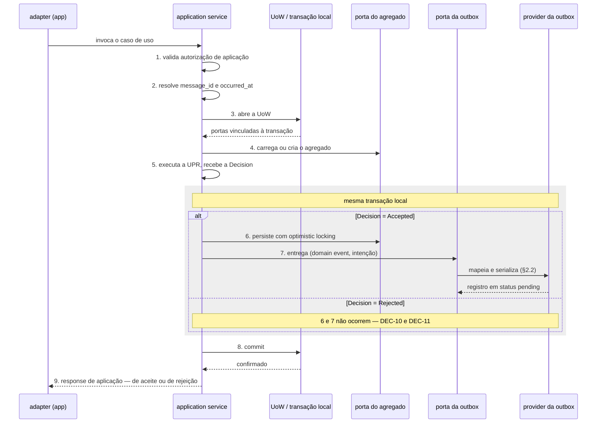
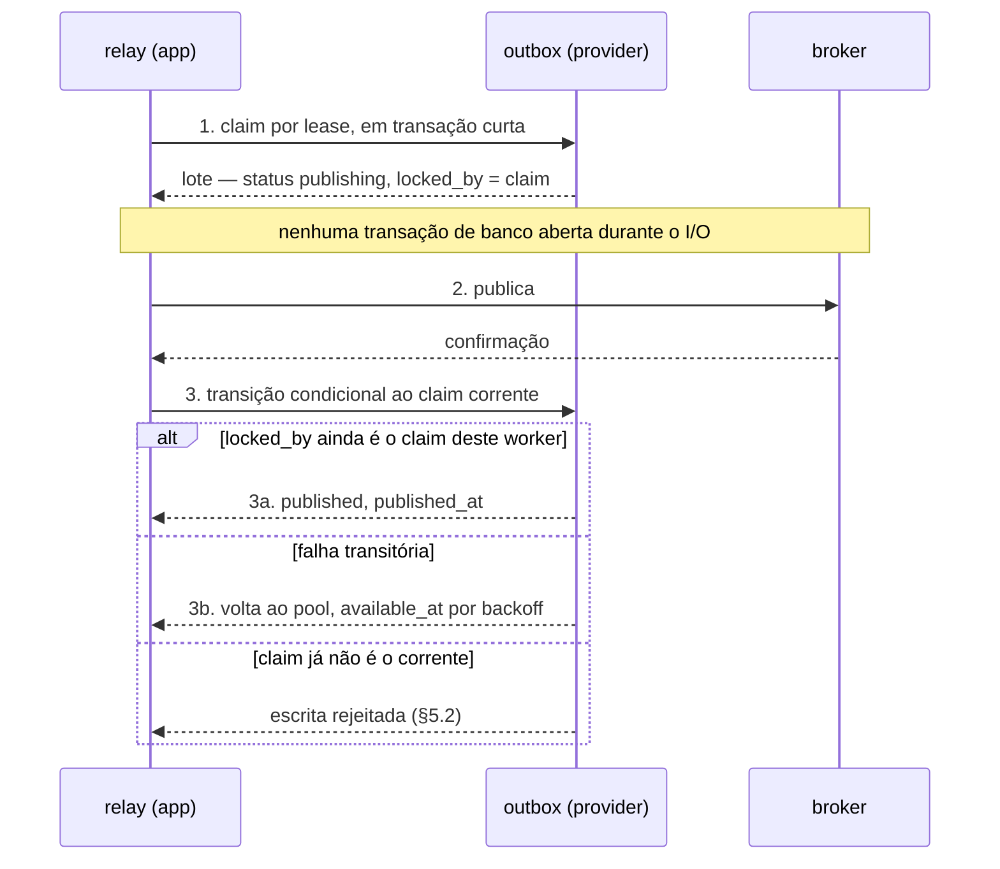

# Unit of Work, inbox, outbox e garantias de entrega — DMPF FND-04

| Campo | Valor |
|-------|-------|
| **Status** | `draft normativo` — promovido para revisão em PR |
| **Adiciona a** | RFC DMPF Foundation v0.1, pela âncora ANC-02 (RFC §12.3) |
| **Owner** | Mateus Macedo Dos Anjos (assignee de ARQ-441) |
| **Épico** | ARQ-436 — Golden Path para Sistemas Orientados a Domínio e Mensagens |
| **Story** | ARQ-441 (DMPF-FND-04) |
| **Spec** | [SPEC-7PJ5WVCS](../specs/SPEC-7PJ5WVCS-dmpf-uow-inbox-outbox.md) |
| **Data** | 2026-08-18 |
| **Revisão** | Plataforma e Arquitetura no PR; um representante de dados para os schemas mínimos de §4 e §6; um representante de operação para §7.4 |

> **O que este documento obriga.** As regras rotuladas `normativo` valem para
> todo trabalho novo do DMPF, na mesma força da RFC à qual elas se adicionam.
> Nem todo bloco aqui obriga: §1.3 define as cinco categorias de conteúdo e a
> fronteira de cada uma. Enquanto o status for `draft normativo`, o documento
> está em revisão; a promoção ocorre no aceite do PR.

---

## §1. Fronteira, referência e sucessão

Esta seção vem antes de qualquer regra porque um artefato que adiciona a uma
norma compartilhada precisa dizer, primeiro, **até onde** ele pode obrigar. A
RFC já respondeu a essa pergunta ao registrar a âncora ANC-02; o que segue é a
leitura dessa autorização, a convenção de leitura do texto e o efeito deste
documento sobre a base conceitual a que ele sucede.

Há uma diferença de forma em relação ao precedente FND-03, e ela condiciona
todo o resto: a ANC-01 autoriza normatizar **dentro** de um bloco, e a ANC-02
autoriza normatizar um **mecanismo** que atravessa três. §1.3 trata dessa
diferença.

### §1.1 A autorização: âncora ANC-02

`normativo`

Este artefato **adiciona** à RFC DMPF Foundation v0.1 pela âncora ANC-02
(RFC §12.3). Ele não edita a RFC e não incrementa a versão dela: adição por
âncora dentro do escopo permitido é revisão em PR, sem incremento
(RFC §14.2). O conteúdo vive aqui, e a RFC o alcança pelo endereço estável da
âncora (RFC §12.1).

| Campo | Valor, conforme o registro de ANC-02 |
|-------|--------------------------------------|
| Assunto | Unit of Work, inbox, outbox e relay |
| Escopo permitido | Mecanismos de atomicidade, deduplicação e drenagem, respeitando a atribuição de blocos de RFC §7.5 |
| Invariantes intocáveis | RFC §7.5 (escrita é `application service`, persistência é `provider`, drenagem é `app`); célula 11 de RFC §7.4; **P0-3** |
| Monotonicidade | M1–M4 (RFC §12.2): detalhar e restringir, nunca relaxar, revogar ou reinterpretar |
| Artefato sucessor | Spec e seção própria |
| Condição de fechamento | FND-04 concluída e revisada |
| Impacto de versão na RFC | Nenhum, se dentro do escopo |
| ADR exigido | **Sim** — escolha de mecanismo de relay (polling × CDC). Acionado em §10 |

`normativo` — **Precedência.** Onde este artefato e a RFC divergirem, prevalece
a RFC. Uma divergência não se resolve neste documento: por M4, ela indica que a
fronteira de RFC §1.4 mudou, e mudar fronteira é mudança de versão da RFC, com
o rito de RFC §14.2.

`normativo` — **Monotonicidade em concreto.** Três invariantes da âncora são
citadas ao longo do texto, e nenhuma regra deste artefato as afrouxa:

| Invariante | Como este artefato a trata | Onde |
|------------|----------------------------|------|
| RFC §7.5 — atribuição de blocos | Reproduzida e **restringida**: a escrita ocorre por porta, e o texto nomeia o que cada bloco não pode fazer | §2.1, §3.1, §4 |
| Célula 11 de RFC §7.4 (`application → provider`) | Preservada sem exceção: a outbox não é caso especial | §2.1, §2.2, §3.2 |
| **P0-3** — at-least-once, sem exactly-once fim a fim | Reafirmada como semântica oficial e usada como critério de rejeição de redação | §7.1 |

`rationale` — Declarar a precedência aqui, e não deixá-la implícita em M4, é
deliberado. Uma sub-spec extensa tende a ser lida isoladamente por quem
implementa; sem a cláusula no corpo do próprio texto, um leitor que encontrasse
conflito poderia razoavelmente supor que o documento mais específico vence. Ele
não vence.

### §1.2 Convenção de referência

`normativo`

Quatro documentos de numeração própria e sobreposta participam desta cadeia,
então toda referência é qualificada:

| Forma | Designa |
|-------|---------|
| `§N` sem prefixo | uma seção **deste artefato** |
| `RFC §N` | uma seção da RFC DMPF Foundation v0.1 |
| `Parte-1 §N` | um capítulo da base conceitual `Parte-1-conceitual.md` |
| `FND-03 §N` | uma seção do artefato `upr-decision-mensagens.md`, promovido sob a ANC-01 |

`normativo` — O prefixo nulo tem referente **local**: dentro deste documento,
`§N` é sempre uma seção deste documento. A convenção difere da de RFC §1.3,
onde o prefixo nulo designa a própria RFC. Não há ambiguidade entre as duas,
porque cada documento resolve o prefixo nulo em si mesmo e prefixa toda
referência externa. Uma citação a este artefato feita **de fora** dele usa o
nome do arquivo mais a seção.

`rationale` — A quarta forma não existia no precedente e é necessária aqui. O
FND-03 delegou a esta entrega uma obrigação por escrito (§2.2), e o artefato o
cita com frequência bastante para que `FND-03 §6.3` valha mais do que repetir o
caminho do arquivo a cada remissão. A alternativa — citar sempre pelo nome do
arquivo — foi descartada por peso, não por ambiguidade: as duas resolvem.

### §1.3 Classificação de força

`normativo`

A ANC-02 autoriza normatizar **mecanismos** — atomicidade, deduplicação e
drenagem — «respeitando a atribuição de blocos de RFC §7.5». O recorte não é o
de um bloco, como em ANC-01: é o de um mecanismo cuja própria definição
atravessa `application service`, `provider` e `app`. A âncora só é coerente
assim, porque uma outbox descrita dentro de um único bloco não é uma outbox.

Isso desloca a fronteira, sem alargá-la. O que **não** cabe aqui não é o outro
bloco — é o assunto de outra âncora: o formato do envelope publicado (ANC-03),
as políticas de cada transporte (ANC-04) e o catálogo de telemetria (ANC-06)
seguem sendo de suas donas, mesmo quando incidem sobre uma tabela ou um passo
que este artefato normatiza. Apresentar esse conteúdo com força normativa
excederia o escopo da âncora e seria inválido por M4 — ainda que o texto
estivesse tecnicamente correto.

A solução é a do precedente: declarar, em cada regra, o **bloco** a que ela se
aplica e a sua **força**.

| Rótulo | Significado | Obriga? |
|--------|-------------|---------|
| `normativo` | Regra que este artefato estabelece sobre o mecanismo, no escopo da ANC-02, com o bloco declarado | **Sim** |
| `recepcionado` | Conteúdo reproduzido da Parte-1 para dar contexto contíguo, sem força nova e sem reabertura | Não — a força permanece a da Parte-1 |
| `encaminhado` | Assunto de outra sub-spec, citado apenas como fronteira rotulada, com dona explícita | Não — passa a obrigar quando a dona normatizar |
| `rationale` | Justificativa de uma decisão normativa, incluindo alternativas descartadas | Não |
| `registro` | Acionamento de ADR (§10) e matriz de rastreabilidade (§11) | Não |

`normativo` não é o rótulo default: um bloco sem rótulo é prosa de ligação e
não obriga nada. Os rótulos `normativo` e `rationale` têm aqui exatamente o
sentido de RFC §1.1. `recepcionado` usa o verbo no mesmo sentido de RFC §1.3;
`encaminhado` nomeia o gesto que RFC §1.4 pratica sem nomear.

`normativo` — **Toda regra `normativo` deste artefato declara o bloco a que se
aplica.** Uma regra sem bloco declarado é defeito de redação, não licença para
aplicá-la a todos: o alcance de uma norma que atravessa blocos precisa ser
verificável linha a linha, e a matriz de RFC §7.4 só pode ser conferida contra
uma atribuição explícita.

`rationale` — Sem essa exigência, o alargamento de escopo seria indistinguível
da própria natureza da âncora. Uma âncora que abrange três blocos pode, por
descuido, normatizar qualquer coisa que aconteça neles — inclusive o que
pertence a ANC-03, ANC-04 ou ANC-06. Amarrar cada regra a um bloco não impede o
erro, mas o torna visível na revisão, que é o que M4 exige na prática.

### §1.4 O que este artefato não normatiza

`normativo` — espelha RFC §1.4 no recorte que toca a UoW, a outbox e a inbox.

Cada tema abaixo aparece neste documento **apenas** como fronteira rotulada
`encaminhado`. Onde ele aparece, o texto diz o que o mecanismo faz até a
fronteira, e para: o outro lado é da dona.

| Tema | Dona | Fronteira aparece em |
|------|------|----------------------|
| Formato do envelope publicado; codec, registry e versionamento de wire; algoritmo e canonicalização do `payload_hash` | FND-05 (ARQ-442), sob ANC-03 | §2.3, §4, §6.5 |
| Políticas por transporte: convenções de Kafka, SNS e SQS, e o retry específico de cada | FND-06 (ARQ-443), sob ANC-04 | §6.4, §7.4 |
| Contexto de execução, taxonomia de erros e autorização | FND-07 (ARQ-444) | §3.2, §6.4, §7.3 |
| Classificação, minimização, cifra em repouso, controle de acesso e teto de retenção do dado de negócio — no `payload` da outbox, no envelope preservado na DLQ e em qualquer campo de conteúdo | FND-07 (ARQ-444) | §4.1, §4.3, §7.4 |
| Catálogo de métricas, limiares, alarmes e runbook de DLQ e replay | FND-08 (ARQ-445), sob ANC-06 | §5.3, §7.4 |
| Testes e interoperabilidade entre stacks, incluindo a verificação cross-stack do `payload_hash` | FND-09 (ARQ-446) | §6.5, §7.3, §11.5 |
| Redação, promoção e aceite dos ADRs acionados | FND-11 (ARQ-448) | §10 |

`normativo` — A fronteira com FND-08 é a mais fácil de atravessar por descuido,
e por isso é enunciada uma vez, aqui, no critério que a decide: **capacidade é
deste artefato; catálogo é de FND-08.** Que o drenador exponha `pending`,
`lag`, `attempts` e `failures` é propriedade do mecanismo e obriga aqui (§5.3).
Como a métrica se chama, qual limiar dispara alarme, quem é notificado e o que
o runbook manda fazer é de ANC-06 e não obriga aqui, mesmo que este texto o
mencione.

`normativo` — **A existência de um campo neste artefato não isenta a obrigação
de protegê-lo.** `OBX-02` e `OBX-03` vedam dado sensível em `metadata` e em
`last_error` porque esses dois campos não deveriam carregá-lo por natureza. O
`payload` da outbox e o envelope preservado na DLQ **carregam** dado de negócio
por projeto, e a proteção deles — classificação, minimização, cifra em repouso,
controle de acesso e teto de retenção — é de FND-07, não deste artefato. Este
artefato declara onde o dado vive (§4.1, §4.3, §7.4) e não o protege.

`rationale` — A assimetria era falsa cobertura: sanitizar cuidadosamente os dois
campos laterais e não dizer nada sobre o campo que de fato carrega o conteúdo
sugere ao leitor que a proteção está tratada. Normatizar cifra ou classificação
aqui excederia a ANC-02 — é matéria de segurança, não de atomicidade,
deduplicação ou drenagem. Nomear a dona é o gesto que M4 permite e que a lacuna
exige.

Fora do épico inteiro, por P0-4: kernels Go e TypeScript, adapters e providers
de produção. Este artefato especifica a semântica transacional e as garantias
de entrega; construí-las em cada stack é dos épicos de kernel. Também fica fora,
por decisão da própria spec, a **implementação** de CDC — a escolha entre
polling e CDC é acionada como ADR em §10; o mecanismo concreto de captura, não.

Fora por natureza: **quais** efeitos de negócio são idempotentes em cada
bounded context. O documento normatiza que a idempotência de efeito exista e
onde ela vive (§7.2); qual é a chave natural de cada operação é decisão de cada
squad sobre o seu domínio.

### §1.5 Sucessão sobre a Parte-1

`normativo` — detalha RFC §1.7 e continua RFC §14.4 no recorte da ANC-02.

RFC §14.4 registra que as decisões de transporte «seguem vigentes na Parte-1
até as sub-specs correspondentes». Esta é a sub-spec correspondente ao recorte
da ANC-02. A tabela abaixo declara o estado de cada subseção da Parte-1 §§9–10
no escopo desta âncora.

`normativo` — A sucessão é declarada **por subseção**, e não por capítulo.
Várias subseções da fonte têm ownership misto por dentro: descrevem o mecanismo
que esta âncora normatiza e, na mesma linha, um assunto que pertence a ANC-03,
ANC-04 ou ANC-06. Consolidar o capítulo inteiro absorveria esse conteúdo alheio
e repetiria, em escala menor, a invasão de âncora que M4 proíbe. A coluna
**Ressalva** nomeia, em cada subseção, o que não é sucedido aqui.

| Subseção da Parte-1 | Estado | Ressalva — pertence a outra âncora |
|---------------------|--------|------------------------------------|
| Parte-1 §9.1 Responsabilidade | **Consolidado** em §3.2 | passos de autorização, de tempo e identificadores e de execução da UPR — FND-07 e FND-03; formato da conversão — ANC-03 / FND-05 |
| Parte-1 §9.2 Transação explícita | **Consolidado** em §3.1 e §3.3 | — |
| Parte-1 §9.3 Queries | **Recepcionado** em §3.4, sem consolidação | separação física de bancos é decisão de contexto, não de fundação |
| Parte-1 §10.1 Semântica oficial | **Consolidado** em §7.1 e §7.2 | — |
| Parte-1 §10.2 Fluxo de produção | **Consolidado** em §3.2 e §5.4 | — |
| Parte-1 §10.3 Outbox mínima | **Consolidado** em §4 | `message_type`, `schema_version` e a natureza do `payload` — ANC-03 / FND-05 |
| Parte-1 §10.4 Relay | **Consolidado** em §5 | nomes de métrica, limiares, alarmes e runbook — ANC-06 / FND-08 |
| Parte-1 §10.5 Fluxo de consumo | **Consolidado** em §6.3 e §6.4 | validação de envelope e comportamento de ACK do adapter — ANC-04 / FND-06 |
| Parte-1 §10.6 Inbox mínima | **Consolidado** em §6.1 | `message_id` como identificador do envelope e `message_type` como contrato recebido — ANC-03 / FND-05 |
| Parte-1 §10.7 Kafka | **Vigente** na Parte-1 | a subseção inteira — ANC-04 / FND-06 |
| Parte-1 §10.8 SNS e SQS | **Vigente** na Parte-1 | a subseção inteira — ANC-04 / FND-06 |
| Parte-1 §10.9 Retry, DLQ e quarantine | **Consolidado** em §7.4 | retry específico de cada transporte — ANC-04 / FND-06; operação de DLQ e runbook — ANC-06 / FND-08 |
| Parte-1 §10.10 Sagas e process managers | **Recepcionado** em §7.5, sem consolidação | timeouts, observabilidade e replay assistido — ANC-06 / FND-08 |

`normativo` — Não há revogação implícita. Uma subseção da Parte-1 fora da
tabela acima continua valendo como base conceitual, e uma subseção marcada
`Vigente` continua sendo a fonte.

`normativo` — Dentro do escopo consolidado, onde este artefato e a Parte-1
divergirem, prevalece este artefato. As divergências materiais são **três**, e
nenhuma é silenciosa: a atribuição do mapeamento e da serialização, reconciliada
em §2.2; o colapso dos passos 7 e 8 do fluxo de escrita, reconciliado em §3.2; e
o estado `processing` da inbox, reconciliado em §6.1.

`rationale` — **Sobre a literalidade de «esta tabela».** RFC §14.4 fecha
dizendo que um capítulo da Parte-1 «só deixa de valer quando esta tabela o
declarar consolidado», e «esta tabela» é a de RFC §14.4. Duas leituras cabem: a
consolidação exigiria editar aquela tabela, ou a cláusula de sucessão vive no
artefato sucessor autorizado pela âncora. Adotou-se a segunda, seguindo o
precedente de FND-03 §1.5, porque a primeira colide com RFC §12.1 e RFC §14.2,
que determinam adição por âncora **sem** editar a RFC — a primeira leitura
tornaria toda sucessão uma mudança de versão, esvaziando o mecanismo. A escolha
está sinalizada aos revisores no PR desta entrega. Se prevalecer a leitura
literal, a atualização de RFC §14.4 é escalada como alteração própria, com o
rito de versão que ela exigir. Não é contornada aqui.

`rationale` — **Por que a coluna de ressalva não existia no precedente.** A
ANC-01 recortava um bloco, e os capítulos que o FND-03 sucedeu eram, por
construção, do bloco `domain library`. Uma subseção inteira cabia ou não cabia.
Aqui o recorte é por mecanismo, e a Parte-1 §§9–10 mistura, dentro da mesma
subseção, o mecanismo e o transporte que o carrega. Sem a coluna, Parte-1 §10.3
e Parte-1 §10.6 absorveriam campos de wire que são de ANC-03, e Parte-1 §10.4
absorveria o catálogo de telemetria que é de ANC-06.

`registro` — **Pendência aberta: atualizar a tabela de RFC §14.4.** Enquanto a
tabela da RFC listar os capítulos de transporte da Parte-1 como vigentes sem
qualificação, quem implementa não tem como saber, a partir da RFC sozinha, que
Parte-1 §§9–10 já foi sucedida no recorte desta âncora. Fica registrado, no
mesmo estatuto da pendência equivalente de FND-03 §1.5:

| Item | Estado | Destino |
|------|--------|---------|
| Refletir na tabela de RFC §14.4 a sucessão de Parte-1 §§9–10 declarada acima, preservando Parte-1 §10.7 e §10.8 como vigentes | pendente | Revisores desta entrega, no PR; se exigir rito de versão, vira alteração própria da RFC |

Até que isso ocorra, a sucessão declarada acima vale por autorização da ANC-02,
e a divergência é conhecida — não silenciosa.

---

## §2. Blocos, mapeamento e autoria

O padrão outbox não cabe em um bloco. Antes de descrever qualquer sequência,
esta seção fixa quem faz o quê — porque é a atribuição de blocos que torna
verificável tudo o que vem depois, e é ela a invariante que a ANC-02 declara
intocável.

### §2.1 As três responsabilidades

`normativo` — blocos `application service`, `provider` e `app`; recepciona e
restringe RFC §7.5.

O padrão outbox tem três responsabilidades e cada uma pertence a um bloco
distinto. A atribuição é invariante da ANC-02, não escolha deste artefato:

| Responsabilidade | Bloco | Consequência normativa |
|------------------|-------|------------------------|
| **Escrita** da mensagem na mesma transação do estado | `application service` | Grava **por uma porta**; a atomicidade entre estado e mensagem é decisão de orquestração |
| **Persistência** concreta da tabela e do claim | `provider` | Tabela, índices, `FOR UPDATE SKIP LOCKED` e backoff são tecnologia |
| **Drenagem** e publicação | `app` | Processo próprio, com composition root e lifecycle próprios |

`normativo` `BLK-01` — bloco `application service`. O caso de uso grava a outbox **por
uma porta**, nunca tocando a tabela: a célula 11 de RFC §7.4
(`application → provider`) permanece proibida, e a gravação da outbox **não é
exceção a ela**. Um caso de uso que importe o driver, o cliente do banco ou o
tipo da linha da tabela viola a célula 11, ainda que o faça «só para a outbox».

`normativo` `BLK-02` — bloco `app`. A drenagem não roda dentro do processo que atende
requisições. O relay tem composition root, configuração de concorrência e
lifecycle próprios (§5).

`rationale` — Separar drenagem de atendimento não é preferência de deploy. São
dois perfis de carga com falhas independentes: a latência do broker passaria a
competir com o caminho de request, e um pico de publicação consumiria o pool de
conexões que serve o usuário. Rodar o relay no mesmo processo é admissível em
ambiente de desenvolvimento, e é o tipo de conveniência que não sobrevive a
produção.

`registro` — **Discrepância de contagem na fonte.** RFC §7.5 abre dizendo que o
padrão outbox tem «**duas** responsabilidades distintas» e, na tabela imediata,
lista **três**: escrita, persistência e drenagem. A tabela é a parte substantiva
e é inequívoca — atribui bloco e razão a cada uma das três. Este artefato adota
as três, e registra a discrepância sem editar a RFC: corrigir a frase de
abertura é correção de redação (RFC §14.2, sem incremento de versão) e cabe aos
revisores, não a uma adição por âncora.

### §2.2 O bloco em que o mapeamento reside

`normativo` — bloco `provider`; decide a obrigação delegada por FND-03 §6.3.

O FND-03 fechou a sua §6.3 delegando explicitamente a esta entrega: «Ficam com
FND-04 […] a gravação na outbox dentro da mesma transação e **o bloco em que o
mapeamento reside**, escolhido dentro do que a matriz de RFC §7.4 permite». A
delegação existe porque o FND-03 recusou a atribuição da Parte-1 §6.3 — «um
mapper na camada de aplicação» —, que colide com a célula 12.

Quatro blocos poderiam hospedar a conversão `domain event → integration event`.
A matriz de RFC §7.4 elimina dois deles:

| Aresta necessária | Célula | Decisão na matriz | Razão registrada na matriz |
|-------------------|--------|-------------------|----------------------------|
| `application → contract` | 12 | ✗ **P0-2** | «Contrato de wire é do adapter; contrato de aplicação é outro artefato» |
| `port → contract` | 24 | ✗ **P0-2** | «Assinatura de porta não expõe tipo de wire» |
| `provider → contract` | 30 | **P** + C2 | «Serializar é papel do provider» |
| `app → contract` | 18 | **P** + C2 | «O adapter fala o protocolo» |

`normativo` — A matriz **não** determina sozinha a resposta. Ela reduz o espaço
de escolha de quatro candidatos a dois: `provider` e `app` são ambos admissíveis
para conhecer o `contract package`, sujeitos à condição C2 de RFC §7.1. O que
distingue os dois não é permissão, é **momento**: no `provider` da outbox, a
conversão ocorre na escrita, dentro da transação; no `app` do relay, ocorreria
na drenagem, depois do commit.

`normativo` `BLK-03` — bloco `provider`. **O mapeamento reside no `provider` da outbox e
a serialização ocorre na escrita.** A porta da outbox recebe
`(domain event, intenção de publicação)` — tipos de domínio e de aplicação — e o
provider que a implementa mapeia e serializa dentro da transação vinculada à
UoW.

A cadeia de dependências que essa decisão exige atravessa apenas células
permitidas, e nenhuma proibida:

```text
application service ──(célula 10, P+C2)──> port
                                            │
provider ──(célula 25, P+C2)──> domain      │ implementa
provider ──(célula 30, P+C2)──> contract ───┘

não atravessa: 11 (application → provider)
               12 (application → contract)
               24 (port → contract)
```

`rationale` — **Por que na escrita, e não na drenagem.** A alternativa era a
outbox guardar o fato em forma neutra e o relay converter ao publicar, no bloco
`app` sob a célula 18. Ela é legal na matriz e foi descartada por uma razão de
correção, não de estilo: entre a escrita e a drenagem pode haver deploy, e com
ele um schema de wire novo. Serializar na drenagem faria um fato antigo sair sob
o contrato vigente no momento da publicação, e não sob o vigente quando o fato
ocorreu. Serializar na escrita congela os bytes no commit, de modo que **a
mensagem publicada é contemporânea do fato**. O custo é conhecido e aceito: uma
correção de contrato não alcança o que já está na outbox, e o que já está na
outbox é justamente o que não deveria mudar.

`rationale` — **Por que não a porta.** Manter o mapeamento fora do provider,
expondo o integration event na assinatura da porta, foi descartado pela célula
24: uma porta que expõe tipo de wire deixa de ser abstração de saída e passa a
ser o próprio contrato, arrastando `application service` para o
`contract package` por transitividade. A porta expõe tipo de domínio; quem
conhece o wire é quem a implementa.

`encaminhado` — Ficam com FND-05, sob ANC-03: o formato do integration event, o
codec, o registry, o namespacing, a política de compatibilidade e a assinatura
concreta do mapeamento. Este artefato decide **onde** o mapeamento reside e
**quando** ele ocorre; não decide em que ele resulta.

`registro` — A decisão desta subseção altera qual bloco conhece qual, e por isso
é acionada como ADR em §10 (`ADR-DMPF-L`), com a alternativa descartada acima
como insumo obrigatório da redação (RFC §13.2).

### §2.3 Autoria dos campos da outbox

`normativo` — blocos `application service`, `provider` e `app`.

Decidido o bloco do mapeamento, resta dizer quem preenche cada campo. A regra
que organiza a tabela é uma só: **roteamento é decisão de orquestração; formato
é decisão de wire.**

| Grupo | Campos | Autor |
|-------|--------|-------|
| Identidade e tempo do fato | `message_id`, `occurred_at` | `application service` |
| Roteamento | `destination`, `partition_key` | `application service`, pela intenção de publicação |
| Origem de negócio | `aggregate_type`, `aggregate_id`, `aggregate_version` | `application service`, derivados do domain event |
| Wire | `message_type`, `schema_version`, `payload` | `provider` |
| Estado de drenagem — **valor inicial** | `status`, `available_at`, `attempt_count` | schema, por default declarado (§4.2) |
| Estado de drenagem — **transições** | `status`, `available_at`, `attempt_count`, `locked_by`, `locked_until`, `published_at`, `last_error` | `app` (relay) |

`normativo` `BLK-04` — bloco `application service`. `destination` é o destino **lógico**
da publicação — o nome do fluxo de integração —, nunca o nome de um tópico, de
uma fila ou de um ARN. A tradução do destino lógico para o endereço concreto do
transporte é `encaminhado` a FND-06, sob ANC-04.

`normativo` `BLK-05` — bloco `application service`. Nenhum campo do grupo de estado de
drenagem é preenchido na escrita além do valor inicial que o schema declara
(§4). Estado de drenagem é do relay.

`rationale` — **Por que o roteamento não é derivado do tipo do evento.** A
alternativa era o provider resolver o destino a partir do `message_type`, por um
registro no composition root. Ela é mais enxuta e foi descartada por perda de
expressividade: dois casos de uso que emitem o **mesmo** evento de domínio para
destinos distintos — um para o fluxo transacional, outro para um consumidor
analítico — ficariam sem como divergir, porque a única informação disponível ao
provider seria o tipo, que é idêntico nos dois. Manter o destino na intenção de
publicação preserva no caso de uso uma decisão que é dele.

`rationale` — **Por que a identidade nasce no application service.** `message_id`
e `occurred_at` fixam a identidade e o instante do fato, e são exatamente os
valores de que a deduplicação a jusante depende (§6.1). Gerá-los no provider
significaria que uma reexecução do caso de uso produziria identidades novas para
o mesmo fato; gerá-los no domínio exigiria relógio dentro da UPR, o que `P0-1`
proíbe. O application service é o único bloco em que os dois requisitos se
encontram.

---

## §3. A Unit of Work

### §3.1 A UoW não é a transação local

`normativo` — bloco `application service`.

Os dois termos são usados como sinônimos com frequência bastante para que a
distinção precise ser declarada antes de qualquer regra que dependa dela:

| Termo | O que é | Onde vive |
|-------|---------|-----------|
| **transação local** | O mecanismo do banco: `BEGIN`, `COMMIT`, `ROLLBACK`, com as suas garantias de atomicidade e isolamento | `provider` |
| **Unit of Work (UoW)** | A fronteira de aplicação que envolve uma transação local e entrega ao callback as portas a ela vinculadas | `application service` |

`normativo` `UOW-01` — Uma UoW tem **exatamente uma** transação local. Não há UoW sem
transação, não há UoW que abranja duas transações, e não há transação de escrita
de caso de uso fora de uma UoW.

`normativo` `UOW-02` — Uma UoW **não** abrange dois recursos transacionais distintos.
Toda garantia deste artefato se apoia em transação local única sobre um único
banco; estender a fronteira a um segundo banco ou ao broker exigiria transação
distribuída, que §7.1 veda.

`normativo` `UOW-03` — A UoW é **visível no service**. Transações não são iniciadas por
decorator genérico em torno de qualquer handler, e a correção do fluxo não
depende de `AsyncLocalStorage`, thread-local, contexto global ou service
locator. O callback recebe os recursos vinculados à transação como parâmetro:

```text
UnitOfWork.within(contexto, recursos -> {
    recursos.pedidos.save(...)
    recursos.outbox.enqueue(...)
})
```

`recepcionado` — Parte-1 §9.2 enuncia a mesma exigência e nomeia o que ela
evita: transação armazenada em contexto global; repository aparentemente não
transacional; commits parciais entre estado e outbox; e dependência de
`AsyncLocalStorage`, thread-local ou service locator para correção. Este
artefato consolida aquela subseção (§1.5) e acrescenta a distinção entre UoW e
transação local, que a fonte não fazia.

`normativo` `UOW-04` — Uma porta usada dentro do callback e **não** recebida por ele está
fora da fronteira transacional, e escrever por ela é defeito: o efeito não
participa do commit. É o caso concreto do repository que parece transacional
porque a assinatura não denuncia a diferença.

`rationale` — A distinção entre UoW e transação local não é terminológica. Sem
ela, três regras deste artefato ficam sem enunciado possível: que a inbox, os
efeitos locais e a outbox derivada compartilham **uma** fronteira (§6.3); que o
relay opera em transações curtas que **não** são UoW de caso de uso (§5.1); e
que a UoW não repete o callback (§3.3), o que é propriedade da fronteira de
aplicação, não do mecanismo do banco — um retry de serialização do driver é
outra coisa, e a fonte já os confundia.

### §3.2 Sequência canônica de escrita

`normativo` — bloco `application service`; consolida Parte-1 §9.1.

```text
1. valida autorização de aplicação
2. resolve tempo e identificadores (message_id, occurred_at)
3. abre a UoW, recebendo as portas vinculadas à transação
4. carrega ou cria o agregado
5. executa a UPR e recebe a Decision
6. sob Accepted, persiste o agregado com optimistic locking ──┐
7. sob Accepted, entrega (domain event, intenção de           │  MESMA
   publicação) à porta da outbox — o provider mapeia e        │  transação
   serializa (§2.2). Sob Rejected, 6 e 7 não ocorrem        ──┘
8. commit
9. devolve a response de aplicação — de aceite ou de rejeição
```

`normativo` `UOW-05` — bloco `application service`. **O ramo do desfecho decide os
passos 6 e 7.** A `Decision` de FND-03 §3.1 é a união exaustiva
`Accepted(response, events) | Rejected(rejection)`, e os dois ramos têm
consequências transacionais distintas:

| Ramo | Passos 6 e 7 | Fundamento |
|------|--------------|------------|
| `Accepted` | Persiste o agregado e entrega os domain events à porta da outbox | O fato ocorreu e produziu eventos |
| `Rejected` | **Não ocorrem.** Nada é persistido e nada é enfileirado | FND-03 `DEC-10` (o estado observável é idêntico ao de antes da chamada) e `DEC-11` (`Rejected` não carrega eventos de domínio) |

`normativo` `UOW-06` — Um caso de uso que persista o agregado ou grave a outbox sob
`Rejected` viola `DEC-10` ou `DEC-11`, ainda que o commit ocorra sem erro. A
rejeição de negócio não é falha técnica: o passo 8 commita normalmente — uma
transação vazia de efeitos — e o passo 9 devolve a rejeição tipada ao chamador.

`rationale` — O passo 8 permanece na sequência sob `Rejected` de propósito. A
alternativa era abortar a UoW no ramo rejeitado, o que parece equivalente e não
é: um rollback transformaria a rejeição em indistinguível de falha técnica no
lado do chamador, e é exatamente o que FND-03 `DEC-04` proíbe. Commitar sem
efeito preserva a distinção — e, quando o caso de uso escolher registrar a
própria rejeição, o registro entra nessa transação.

`normativo` `UOW-07` — Os passos 6 e 7 ocorrem na **mesma** transação local, e o passo 8
é o único ponto em que o estado de negócio e a intenção de publicar se tornam
visíveis. Não há caminho em que um commite sem o outro.

`normativo` `UOW-08` — Nenhum passo desta sequência publica no broker. A publicação é da
sequência de drenagem (§5.4), que é outro bloco, outro processo e outro ciclo de
vida.

`registro` — **Divergência declarada com a fonte.** Parte-1 §9.1 tem **dez**
passos; esta sequência tem **nove**. A fonte separa «mapear domain events para
integration events» (passo 7) de «serializar e inserir outbox na mesma
transação» (passo 8), e atribui os dois ao application service. A matriz proíbe
ambos ali — célula 12 —, e FND-03 §6.3 já recusara essa atribuição. Do ponto de
vista do caso de uso, os dois passos colapsam em um: entregar à porta. O
mapeamento e a serialização continuam existindo, no `provider`, dentro da mesma
transação (§2.2).

`encaminhado` — O passo 1 (autorização de aplicação) e a taxonomia de erro que
ele produz são de FND-07. O passo 5 executa a UPR definida em FND-03 e devolve a
`Decision` de FND-03 §3; este artefato consome esse desfecho e não o redefine.

### §3.3 Optimistic locking e ausência de retry automático

`normativo` — blocos `application service` e `provider`.

O passo 6 persiste o agregado com **optimistic locking**: a escrita declara a
versão sobre a qual a decisão foi tomada, e falha se a versão corrente divergir.
A alternativa — lock pessimista mantido do carregamento ao commit — é admissível
como decisão de contexto, mas não é o default da fundação.

`normativo` `UOW-09` — **A UoW não repete automaticamente o callback transacional.** Uma
repetição implícita criaria novos identificadores, novas decisões ou novos
efeitos sem que o service tivesse optado por isso.

`normativo` `UOW-10` — Retry de conflito de serialização, de deadlock ou de versão é
**política explícita** do caso de uso, aplicada somente a operação
comprovadamente idempotente, e o autor do caso de uso a declara. Um framework de
UoW que ofereça retry transparente configurável não satisfaz esta regra: o
default é não repetir.

`rationale` — O risco que esta regra previne é silencioso. Sob retry automático,
um caso de uso não idempotente que falhe no commit por conflito de versão é
reexecutado do passo 4, gera um `message_id` novo no passo 2 — ou, pior, reusa o
antigo com payload diferente — e o resultado é duplicidade que a inbox do
consumidor não deduplica, porque a identidade mudou. A duplicação nasce dentro
da fronteira que existia para impedi-la, e não aparece em nenhum log de erro.

### §3.4 Queries fora da UoW de escrita

`recepcionado` — Parte-1 §9.3, sem consolidação.

Queries não são obrigadas a carregar agregados. Um query service pode usar read
repository, projeção, view materializada, busca especializada ou cache. Isso é
**CQRS lógico**.

`normativo` `UOW-11` — bloco `application service`. Uma query não abre UoW de escrita e
não grava outbox. Um fluxo que precise fazer as duas coisas é um caso de uso de
escrita que também consulta, não uma query.

Bancos fisicamente separados para leitura são decisão de contexto, não exigência
desta fundação — e é por isso que esta subseção é `recepcionado` e não
`normativo`: o que a fundação obriga é a fronteira da UoW, não o desenho do lado
de leitura.

---

## §4. A outbox

### §4.1 Schema mínimo

`normativo` — bloco `provider`; consolida Parte-1 §10.3.

**Mínimo** quer dizer que os campos abaixo existem; um provider pode acrescentar
colunas ao seu schema concreto, e nenhuma delas pode substituir o papel de um
campo desta tabela. A coluna **Autor** aplica §2.3; a coluna **Força** diz o que
este artefato obriga sobre o campo.

| Campo | Propósito | Autor | Força |
|-------|-----------|-------|-------|
| `id` | chave técnica monotônica | `provider` | `normativo` |
| `message_id` | identificador global único da mensagem | `application service` | `normativo` |
| `message_type` | tipo lógico do contrato | `provider` | `encaminhado` — ANC-03 |
| `schema_version` | versão do payload | `provider` | `encaminhado` — ANC-03 |
| `aggregate_type` / `aggregate_id` | origem de negócio | `application service` | `normativo` |
| `aggregate_version` | ordenação e detecção de gaps | `application service` | `normativo` |
| `partition_key` | chave de roteamento | `application service` | `normativo` |
| `destination` | destino **lógico** | `application service` | `normativo` |
| `payload` | o integration event serializado | `provider` | `encaminhado` — ANC-03 |
| `metadata` | metadados não sensíveis | `application service` | `normativo` na vedação; `encaminhado` no conteúdo — FND-07 |
| `occurred_at` | instante do fato | `application service` | `normativo` |
| `available_at` | próxima elegibilidade para claim | default no schema; depois `app` (relay) | `normativo` |
| `attempt_count` | tentativas de publicação | default no schema; depois `app` (relay) | `normativo` |
| `status` | estado de drenagem (§4.2) | default no schema; depois `app` (relay) | `normativo` |
| `locked_by` / `locked_until` | lease cooperativo (§5.1) | `app` (relay) | `normativo` |
| `published_at` | confirmação de publicação | `app` (relay) | `normativo` |
| `last_error` | diagnóstico sanitizado | `app` (relay) | `normativo` na sanitização; `encaminhado` no formato — FND-07 |

`normativo` `OBX-01` — bloco `provider`. `message_id` é **único** na tabela. A unicidade
é do schema, não convenção de quem escreve: é ela que torna a republicação
detectável a jusante (§6.1).

`normativo` `OBX-02` — bloco `application service`. `metadata` **não** carrega dado
sensível, credencial ou segredo. O que conta como sensível e como o dado é
classificado é `encaminhado` a FND-07; a vedação, não.

`normativo` `OBX-03` — bloco `app`. `last_error` guarda diagnóstico **sanitizado**: uma
mensagem de erro que reproduza payload de negócio, credencial ou stack trace com
dado de usuário viola a vedação acima, porque a outbox é lida por operação.

`encaminhado` — A natureza do `payload`, o vocabulário de `message_type` e a
política de `schema_version` são de FND-05, sob ANC-03. Este artefato exige que
os três campos existam e que o `payload` seja escrito **na transação da escrita**
(§2.2); não diz em que formato.

`rationale` — Os campos de identidade e de origem de negócio são separados de
propósito. `message_id` identifica **a mensagem**; `aggregate_id` identifica **o
fato de negócio**. Confundi-los quebra os dois lados: a deduplicação da inbox
opera sobre o primeiro (§6.1), e a idempotência de efeito opera sobre chave
natural derivável do segundo (§7.2). São camadas distintas, e o schema precisa
sustentar as duas.

### §4.2 Estados do registro

`normativo` — bloco `app` (relay); consolida os estados de Parte-1 §10.3.

| Estado | Significado | Quem escreve |
|--------|-------------|--------------|
| `pending` | gravado e elegível para claim a partir de `available_at` | escrita (valor inicial) |
| `publishing` | reivindicado por um claim vivo, publicação em curso | relay, na transação de claim |
| `published` | confirmado pelo broker | relay, após o I/O |
| `failed` | tentativas esgotadas; não retorna ao pool sem intervenção | relay |

```text
              claim (§5.1)                publish OK (§5.2)
   pending ──────────────────> publishing ──────────────────> published
                                 │     ^
                                 │     │  re-elegível ao claim quando
                                 │     │  locked_until e available_at
                                 │     └─ vencem — SEM reescrita de estado
                                 │
                                 │  tentativas esgotadas
                                 └───────────────────────────> failed
```

`normativo` `OBX-04` — Não existe transição de `publishing` para `pending`. Lease
expirado e falha transitória devolvem o registro ao pool pela **comparação de
prazos** de §5.1, não por uma escrita que o rebaixe de estado. O laço no
diagrama é ausência de transição, não uma transição para si mesmo.

`normativo` `OBX-05` — **Os valores iniciais são declarados pelo schema, e um
registro recém-escrito nasce elegível ao claim:**

| Campo | Valor inicial | Consequência |
|-------|---------------|--------------|
| `status` | `pending` | Entra no pool de elegíveis |
| `available_at` | `occurred_at` | **Já passou** no instante do commit — a drenagem não espera |
| `attempt_count` | zero | A primeira publicação é a tentativa 1 |

A escrita (§3.2, passo 7) não produz registro em nenhum outro estado e **não**
preenche `locked_by`, `locked_until` nem `published_at`.

`rationale` — O valor inicial de `available_at` precisa ser declarado, e não
deixado ao provider. `OBX-09` decide a elegibilidade por «`available_at` já
passou»: um registro gravado com o campo nulo nunca satisfaz a condição, o relay
nunca o reivindica, e **a outbox deixa de drenar sem produzir erro algum** — o
único sinal é `pending` subindo (`OBX-12`). Dois providers conformes com o
schema mínimo, um usando `DEFAULT now()` e outro deixando nulo, teriam
comportamentos incompatíveis, e um deles com o mecanismo inteiro parado.

`rationale` — Ancorar em `occurred_at` e não em `now()` é deliberado: os dois
coincidem na prática, mas `occurred_at` é do fato e já está no registro, o que
torna a regra conferível por leitura da linha em vez de depender do relógio de
quem inseriu.

`normativo` — Um registro em `publishing` cujo lease expirou volta a ser
elegível ao claim, **sem** que nenhum processo precise reescrevê-lo para
`pending`: a elegibilidade é decidida pela comparação com `locked_until`, não
por um estado intermediário. Um relay que dependa de uma varredura de
«desbloqueio» para devolver registros ao pool tem um segundo caminho de escrita
sobre o estado, e é exatamente esse caminho que §5.2 fecha.

`normativo` `OBX-06` — `failed` é terminal para o ciclo automático. Retomar um registro
`failed` é operação, com evidência (§7.4).

`rationale` — Diferente da inbox (§6.1), a outbox **tem** estado intermediário
observável, e isso não é incoerência: são duas fronteiras transacionais
diferentes. A inbox nasce dentro de uma transação única que ou commita inteira
ou não existe, e por isso não há meio-termo a observar. A outbox é drenada por
outro processo, em duas transações curtas separadas por I/O de rede — e o
intervalo entre elas é justamente o que `publishing` nomeia.

### §4.3 Retenção da outbox

`normativo` `OBX-17` — blocos `provider` e `app` (operação).

Toda escrita conforme (§3.2) grava uma linha na outbox. Sem política de
retenção, a tabela cresce indefinidamente, e o custo não é apenas disco: a
elegibilidade ao claim (`OBX-09`) é decidida por consulta sobre a mesma tabela,
de modo que o volume de registros já concluídos degrada a drenagem dos
pendentes.

| Estado | Retenção |
|--------|----------|
| `published` | **Purgável** após a confirmação de publicação. O fato já está no broker, e a proteção contra duplicidade a jusante é da inbox do consumidor (§6), não desta linha |
| `failed` | **Não purgável** pelo ciclo automático: é o registro de uma contenção (§7.3, cenário 11), e purgá-lo perde o que a retomada precisa |
| `pending`, `publishing` | Não purgáveis: são trabalho não concluído |

`normativo` — A purga de `published` é **operação com evidência**, nos mesmos
termos de `INB-16`: o que foi purgado e até qual instante ficam registrados.

`normativo` — A retenção da outbox **não** tem invariante análoga à de `INB-14`.
A assimetria é deliberada e tem razão: a linha da inbox é a proteção contra
duplicidade e purgá-la cedo reabre a janela; a linha `published` da outbox já
cumpriu o seu papel no commit da publicação, e ninguém a relê.

`encaminhado` — O prazo concreto de retenção de `published`, o agendamento da
purga e o alarme de crescimento são de FND-08, sob ANC-06. O **teto** de
retenção do dado de negócio contido no `payload` é de FND-07 (§1.4) e pode ser
mais estrito que qualquer prazo operacional — nesse caso, prevalece o mais
estrito.

`rationale` — Esta subseção não existia, e a lacuna era assimétrica: a inbox
ganhou §6.6 inteira sobre retenção, e a outbox — que é a tabela de maior volume
do mecanismo e a única que guarda o `payload` — não tinha uma linha. A omissão
não era neutra: sem dizer que `published` é purgável, um implementador cauteloso
retém tudo, e o `payload` de todo evento de negócio já publicado permanece
indefinidamente.

---

## §5. O relay

### §5.1 Claim por lease

`normativo` — bloco `app` (relay).

O relay reivindica um lote de registros elegíveis por **lease com prazo**,
publica e libera. Um lease expirado devolve o registro ao pool.

`normativo` `OBX-07` — **Nenhum lock de banco é mantido durante o I/O com o broker.** A
transação de claim abre, marca o lote e fecha; a publicação ocorre fora de
qualquer transação. `FOR UPDATE SKIP LOCKED` é admitido **somente durante o
claim**.

`normativo` `OBX-16` — A transação de claim escreve, **no mesmo commit**:
`status` para `publishing`, `locked_by` com a identidade do claim,
`locked_until` com o prazo do lease, e incrementa `attempt_count`. A
atomicidade é correção-crítica: um `status` em `publishing` sem `locked_until`
gravado junto quebraria a elegibilidade que `OBX-09` define, e o registro ficaria
reivindicado por ninguém, sem prazo para voltar ao pool.

`normativo` `OBX-08` — **`locked_by` identifica a execução do claim, não o processo.** Um
mesmo worker que readquira o mesmo registro depois recebe identidade nova. Sem
isso, a comparação de §5.2 não distingue o claim corrente de um claim anterior
do mesmo worker, e a proteção que ela oferece desaparece no caso mais provável
de ocorrer.

`normativo` `OBX-09` — Um registro é elegível ao claim quando `status` é `pending`, ou
quando `status` é `publishing` e `locked_until` já passou — e, nos dois casos,
quando `available_at` já passou.

`rationale` — Lease cooperativo em vez de lock pessimista mantido: segurar
`SELECT FOR UPDATE` durante o publish prenderia uma conexão do pool pela
latência do broker. Sob carga, o pool esgota antes do broker saturar, e a falha
aparece no caminho de request — que é o lugar onde ela não deveria aparecer,
justamente porque §2.1 separou os processos para evitar isso.

### §5.2 Transição condicional ao claim corrente

`normativo` `OBX-10` — bloco `app` (relay). Após o retorno do broker, o worker
só transiciona o registro **se `locked_by` ainda for o seu claim**. A escrita de
um claim que não é mais o corrente é rejeitada e não altera o registro.

`normativo` — A rejeição não é erro do sistema: é o desfecho previsto de um
lease expirado. O worker registra o ocorrido e segue; não republica e não tenta
forçar a escrita.

`rationale` — **O cenário que esta regra fecha.** O worker A adquire o lease e
começa a publicar. O lease expira sem que A morra — GC longo, pausa de rede,
relógio adiantado. O worker B adquire o registro, publica e marca `published`.
A retorna do broker e escreve a sua transição sobre um registro já concluído.

A duplicação da publicação é aceitável sob at-least-once e o consumidor a
deduplica (§6). O que **não** é aceitável é a segunda consequência: a escrita de
A repõe `locked_by` e `locked_until` antigos sobre um registro `published`, ou
o devolve a `pending`, e o registro volta ao pool a cada ciclo — uma mensagem
já entregue republicada indefinidamente, sem erro visível em lugar nenhum.

`rationale` — **Por que não um fencing token em campo próprio.** A alternativa
canônica é um contador monotônico de fencing, comparado no destino. Foi
descartada por dois motivos: o ganho sobre a comparação de `locked_by` só
aparece sob desalinhamento de relógio que o próprio lease já assume tolerável, e
ela acrescentaria um campo ao schema mínimo que a fonte não tem. A comparação
com o claim corrente obtém a mesma propriedade — **uma escrita só vale se quem a
faz ainda detém o direito de fazê-la** — sem alterar o schema.

`normativo` `OBX-11` — A propriedade que esta subseção estabelece é enunciável sozinha, e
é ela que os testes de §11.3 conferem: **nenhum claim substituído altera o
estado de um registro.**

`normativo` — A propriedade é sobre **substituição**, não sobre expiração, e a
diferença é material. Um claim que expirou e **não** foi readquirido por
ninguém ainda satisfaz `locked_by == meu claim`, e a sua escrita é aceita — o
registro que ele publicou é marcado `published`, que é o desfecho correto.
Enunciar «nenhum claim expirado escreve» prometeria mais do que a comparação com
`locked_by` entrega, e exigiria validar o prazo do lease no momento da escrita.

`rationale` — Validar o prazo na escrita final foi descartado. Ele introduziria
dependência de relógio no ponto mais sensível do fluxo: um worker cuja
publicação foi confirmada pelo broker teria a marcação recusada por um
milissegundo de deriva, e o registro voltaria ao pool — produzindo exatamente a
republicação em ciclo que §7.3, cenário 5, existe para impedir. A condição sobre
`locked_by` protege o caso que importa, que é a **corrida** entre dois claims, e
deixa passar o caso inofensivo, que é o claim expirado sem sucessor.

### §5.3 Capacidades do drenador e exposição de sinais

`normativo` — bloco `app` (relay); consolida Parte-1 §10.4.

O drenador suporta, obrigatoriamente:

| Capacidade | Por quê |
|------------|---------|
| Paginação | O pool de pendentes não cabe em memória sob backlog |
| Batch configurável | O tamanho ótimo depende do transporte e da carga |
| Claim concorrente entre workers, sem lock mantido durante o I/O (§5.1) | Dois workers não reivindicam o mesmo registro, e o pool não fica preso à latência do broker |
| Lease com expiração | Recuperação automática de worker morto |
| Retry com backoff exponencial e jitter | Evita sincronização de tentativas entre workers |
| Limite de concorrência | O relay não é a fonte de saturação do broker nem do banco |
| **Exposição** dos sinais `pending`, `lag`, `attempts` e `failures` | Sem eles, backlog e falha sistemática são invisíveis |
| Graceful shutdown | Encerrar sem abandonar claim vivo nem publicar pela metade |

`normativo` — A tabela lista **propriedades**, não realizações. `FOR UPDATE SKIP
LOCKED` é a realização admitida do claim concorrente no baseline PostgreSQL
(§5.1) e **não é exigida**: qualquer mecanismo que reivindique sem manter lock
durante o I/O satisfaz a linha. Exigir o comando amarraria a fundação a uma
família de banco, contra a neutralidade de vendor que §11.3 declara.

`normativo` `OBX-12` — **A exposição dos quatro sinais é propriedade do mecanismo e
obriga aqui.** Um relay que não permita observar `pending`, `lag`, `attempts` e
`failures` não satisfaz esta seção, ainda que funcione.

`encaminhado` — Os **nomes** das métricas, as unidades, os limiares, os alarmes,
o catálogo por componente e o runbook de DLQ e replay são de FND-08, sob ANC-06.
Este artefato não os define e não os antecipa.

`rationale` — É a fronteira que o §1.4 enuncia, aplicada ao caso concreto que
mais a tensiona. Exigir que o drenador exponha `lag` é dizer que o mecanismo é
observável — propriedade sem a qual o relay não é operável e que, portanto,
pertence a quem normatiza o relay. Dizer que a métrica se chama
`dmpf_outbox_lag_seconds` e que alarme dispara acima de trinta segundos é
catálogo, e catálogo é de ANC-06. A primeira afirmação sobrevive a qualquer
escolha de stack de telemetria; a segunda, não.

`normativo` `OBX-13` — Graceful shutdown significa: parar de reivindicar novos lotes,
concluir ou liberar os claims vivos, e só então encerrar. Um relay que encerre
com claims vivos não perde mensagem — o lease expira e o registro volta ao pool
—, mas atrasa a drenagem pelo prazo do lease sem necessidade.

### §5.4 Sequência de drenagem

`normativo` — bloco `app` (relay); consolida Parte-1 §10.2.

A sequência de drenagem é numerada **à parte** da sequência de escrita (§3.2):
outro bloco, outro processo, outro ciclo de vida. Não há passo comum às duas, e
nenhuma numeração daqui se refere a um passo de lá.

```text
1. claim por lease de um lote elegível, em transação curta (§5.1)
2. publica no broker, fora de qualquer transação de banco
3. marca o registro, condicionalmente ao claim ainda ser seu (§5.2):
   3a. sucesso              -> published, published_at
   3b. falha transitória    -> permanece publishing; available_at recalculado
                               por backoff E locked_until liberado no mesmo
                               commit, de modo que o backoff — e não o resto do
                               lease — governe o próximo claim (§4.2)
   3c. tentativas esgotadas -> failed
```

`normativo` `OBX-18` — **No passo 3b, `locked_until` é liberado junto com o
recálculo de `available_at`.** Sem isso o backoff não governa: `OBX-09` só
devolve ao pool um registro `publishing` quando `locked_until` **e**
`available_at` já passaram, de modo que um backoff menor que o lease seria
inerte e a próxima tentativa esperaria o lease restante, não o backoff. A
liberação ocorre no mesmo commit da transição, sob a condição de `OBX-10`.

`normativo` — Entre o passo 2 e o passo 3 existe uma janela em que a mensagem
já foi publicada e o registro ainda não foi marcado. Uma falha nessa janela
produz **republicação** no ciclo seguinte. A duplicata é aceitável e esperada: é
a origem concreta do at-least-once (§7.1), e é o consumidor que a absorve
(§6.4).

`normativo` `OBX-14` — O relay **não** interpreta o conteúdo do `payload` e não decide
publicar ou não com base nele. Se o registro existe, o fato ocorreu e commitou;
a decisão de publicar já foi tomada no caso de uso.

### §5.5 Polling e CDC

`normativo` — bloco `app` (relay).

**Polling com leasing é o mecanismo padrão** desta fundação: simples,
independente de broker e de recurso exclusivo de banco, e suficiente para o
volume observado no universo inventariado (§9).

`normativo` `OBX-15` — **CDC é extensão**, não substituição, admitida para alto volume ou
baixa latência. Um contexto que adote CDC continua obrigado a tudo o que §4 e §7
estabelecem: a outbox continua sendo escrita na mesma transação, e as garantias
de entrega não mudam. O que muda é apenas **como** o registro é descoberto.

`normativo` — Nenhum dos dois mecanismos altera a semântica de entrega. CDC não
entrega exactly-once fim a fim, e um texto de projeto que o afirme viola P0-3
(§7.1).

`registro` — A escolha entre polling e CDC é decisão estrutural exigida pela
própria ANC-02 («ADR exigido: Sim — escolha de mecanismo de relay (polling ×
CDC)») e confirmada por RFC §13.3. É acionada como ADR em §10
(`ADR-DMPF-K`), e este artefato não a redige nem a aceita.

---

## §6. A inbox e o consumo

### §6.1 Schema mínimo

`normativo` — bloco `provider`; consolida Parte-1 §10.6.

| Campo | Propósito | Força |
|-------|-----------|-------|
| `consumer_name` | identidade lógica estável do consumidor | `normativo` |
| `message_id` | identificador do envelope recebido | `encaminhado` na origem — ANC-03 |
| `message_type` | contrato recebido | `encaminhado` — ANC-03 |
| `payload_hash` | detecta reutilização indevida do identificador (§6.5) | `normativo` nas propriedades; `encaminhado` na fórmula — ANC-03 |
| `received_at` | primeira recepção | `normativo` |
| `processed_at` | conclusão | `normativo` |
| `status` | `processed` ou `rejected` — e apenas esses | `normativo` |
| `last_error` | diagnóstico sanitizado | `normativo` na sanitização |

```text
UNIQUE (consumer_name, message_id)
```

`normativo` `INB-01` — bloco `provider`. A chave de deduplicação é
`(consumer_name, message_id)`, e a unicidade é do schema. `consumer_name` é uma
identidade **lógica e estável**: não é hostname, não é ID de instância e não
muda em deploy ou em escala horizontal. Dois processos do mesmo consumidor
lógico compartilham a chave — é isso que faz a deduplicação funcionar quando o
consumidor tem réplicas.

`registro` — **Ressalva para réplicas heterogêneas.** A chave compartilhada
resolve a identidade; o `payload_hash` ainda precisa coincidir para que a
reentrega seja classificada R2 ou R3, e não R4 (§6.4). Enquanto FND-05 não fixar
a canonicalização, réplicas do mesmo consumidor lógico em **stacks diferentes**
podem produzir hashes distintos para o mesmo conteúdo, e a reentrega roteada
para a outra stack vira R4 — contida, e não aplicada. A consequência está
registrada em §6.5, e a verificação cross-stack é de FND-09.

`normativo` `INB-02` — **O `status` da inbox admite exatamente dois valores:
`processed` e `rejected`. Ambos são terminais.**

`registro` — **Divergência declarada com a fonte.** Parte-1 §10.6 lista três
estados: `processing`, `processed` e `rejected`. Este artefato remove
`processing`.

A razão é estrutural, não de preferência. §6.3 estabelece que a deduplicação, os
efeitos locais e a outbox derivada compartilham **uma** transação. Sob transação
única não existe meio-termo observável: ou tudo commita, e o registro nasce
terminal, ou nada commita, e não há registro. Um estado `processing` persistido
só é alcançável com escrita em duas fases — gravar a chave, commitar, processar,
commitar de novo —, e essa escrita reabre exatamente a janela de duplicidade que
a fronteira transacional única existe para fechar: entre os dois commits, um
crash deixa a chave gravada sem o efeito aplicado, e a redelivery seguinte é
classificada como duplicata de algo que nunca aconteceu.

`normativo` `INB-03` — Propriedade derivada, e verificável: **a inbox só contém
mensagens cujo processamento commitou.** Um registro `processed` prova que o
efeito foi aplicado; um registro `rejected` prova que a rejeição foi decidida.
Nenhum registro descreve intenção.

`rationale` — A remoção de `processing` não deixa o sistema sem representar
«processamento em curso». Ele é representado onde de fato está: na transação
aberta e no lock do banco sobre a linha, que são mecanismos do `provider` e não
precisam de coluna. O que a coluna acrescentaria seria uma segunda fonte de
verdade sobre o mesmo fato, capaz de divergir da primeira.

### §6.2 A porta de inbox

`normativo` — blocos `application service` e `port`.

A porta de inbox expõe **duas** operações, e as duas ocorrem dentro da mesma
UoW. A primeira tem semântica de **`insert-if-absent` com retorno**; a segunda
fixa o estado terminal do registro que a primeira criou:

```text
inbox.registrar(consumer_name, message_id, payload_hash) -> classificação
inbox.concluir(processed | rejected)
```

`normativo` `INB-04` — **A operação devolve resultado; nunca sinaliza erro de
constraint.** Registrar uma chave já presente é um desfecho previsto e
informativo, não uma falha. A transação permanece **viva** após a chamada, em
qualquer classificação.

`normativo` — **`registrar` não decide o estado terminal, porque no momento em
que ele executa o desfecho ainda não é conhecido.** O eixo 2 de §6.4 só é
avaliado depois, quando os efeitos locais já foram tentados. Por isso a porta
tem duas operações: `registrar` reserva a chave e serializa concorrentes;
`concluir` fixa `processed` ou `rejected`. As duas commitam juntas.

`normativo` `INB-05` — `concluir` é obrigatória sob **R1**, e somente sob R1: em R2, R3 e
R4 o service curto-circuita e nada é escrito na inbox (§6.4). Uma transação que
chame `registrar` e receba R1 sem chamar `concluir` antes do commit é defeito —
produziria na inbox um registro sem estado terminal, que §6.1 proíbe.

`normativo` — O estado entre `registrar` e `concluir` **não é observável fora da
transação**: ele existe apenas dentro da escrita não commitada. É por isso que
`processing` não é um valor de `status` (§6.1) — o transitório é a transação
aberta, não uma coluna.

`rationale` — A alternativa era `registrar` receber o desfecho já pronto, numa
chamada única ao fim do processamento. Ela foi descartada porque a serialização
entre concorrentes precisa acontecer **antes** dos efeitos locais, não depois:
com uma chamada só, as duas transações executariam o efeito em paralelo e só
descobririam a duplicata na hora de gravar — tarde demais, com o efeito já
aplicado duas vezes.

`normativo` — O valor devolvido é a classificação da recepção — o eixo 1 de
§6.4 —, e é sobre ele que o application service decide o que fazer em seguida.
A assinatura da porta e o eixo 1 são a mesma enumeração, deliberadamente.

`normativo` — bloco `provider`. Como o provider obtém essa semântica é
tecnologia e não é normatizado aqui: `INSERT ... ON CONFLICT DO NOTHING` seguido
de leitura, `MERGE`, savepoint interno ou outro recurso equivalente são todos
admissíveis, desde que a propriedade externa — retorno em vez de erro,
transação viva — seja preservada.

`rationale` — **Por que não depender do erro de constraint.** A redação
intuitiva seria: tenta inserir; se a constraint única falhar, é duplicata; então
consulta o registro e decide. Ela não é implementável no baseline. Em PostgreSQL
um erro dentro de um bloco de transação **aborta o bloco**, e todo comando
seguinte é ignorado até o `ROLLBACK` — de modo que a transação perdedora não
teria como consultar o registro nem aplicar disposição alguma. O caminho que
restaria seria um savepoint em torno do insert; normatizar savepoint amarraria a
fundação a uma família de tecnologia, quando o que importa é a propriedade.

`rationale` — Fazer o eixo 1 coincidir com o retorno da porta tem uma
consequência prática: a enumeração das classificações deixa de ser prosa e passa
a ser um tipo. Um consumidor que não trate uma das classificações é detectável
pela própria assinatura, na stack que tenha união exaustiva — que é a mesma
propriedade que FND-03 §3 obteve para a `Decision`.

`normativo` `INB-06` — **Sob concorrência, a operação serializa na chave.** Quando duas
transações registram a mesma `(consumer_name, message_id)` ao mesmo tempo, a
segunda **aguarda** o desfecho da primeira antes de receber a sua classificação,
e o valor devolvido depende desse desfecho:

| Desfecho da primeira transação | O que a segunda recebe |
|--------------------------------|------------------------|
| Commit com `processed` | **R2** — reentrega de aplicada |
| Commit com `rejected` | **R3** — reentrega de rejeitada |
| Rollback (R1×D3 ou R1×D4) | **R1** — primeira recepção; nada foi aplicado |

`normativo` — A espera é propriedade exigida da porta, não efeito colateral
tolerado: sem ela, as duas transações receberiam R1 e o efeito seria aplicado
duas vezes. Um provider que resolva `insert-if-absent` por consulta prévia sem
serialização na chave **não** satisfaz §6.2.

`normativo` `INB-17` — **A espera tem teto, e o estouro é falha transitória.**
Um consumidor declara o limite de tempo que a chamada a `registrar` pode
aguardar; ao estourá-lo, a disposição é **R1×D3** — a transação é abandonada e a
mensagem volta pelo transporte, com backoff. Espera sem teto não é conformidade
maior: é um modo de falha.

`rationale` — O custo é real e o artefato o reconhece em vez de o ignorar.
`INB-07` põe deduplicação, efeitos locais e outbox derivada na **mesma**
transação, então o desfecho da primeira só é conhecido depois de todos os
efeitos de negócio. A segunda fica bloqueada na chave por todo esse tempo,
segurando uma conexão. Sob visibility timeout menor que o tempo de
processamento, a redelivery começa enquanto a primeira ainda processa, N
duplicatas empilham na mesma chave e o pool do consumidor esgota — travando
**todo** o consumo, inclusive o de mensagens não duplicadas. É o espelho exato
do risco que `OBX-07` e `BLK-02` engenheiram para o lado do relay, e ficaria sem
uma linha se não fosse enunciado aqui.

`encaminhado` — O **valor** do teto é de FND-08, sob ANC-06, como os demais
prazos operacionais. O que obriga aqui é que ele exista e que o estouro seja
classificado como D3, e não como erro terminal.

`normativo` `INB-18` — **A classificação devolvida é sempre de transação
commitada.** A segunda transação recebe R2 ou R3 apenas depois de a primeira
commitar, e R1 apenas depois de ela abortar. Nenhuma classificação é devolvida
com base em escrita não commitada.

`normativo` — bloco `provider`. `INB-18` fixa uma **propriedade**, e a
realização precisa entregá-la sob o nível de isolamento em que a UoW de consumo
roda. No baseline PostgreSQL, `INSERT ... ON CONFLICT DO NOTHING` seguido de
leitura entrega a propriedade sob `READ COMMITTED`; sob `REPEATABLE READ` ou
`SERIALIZABLE` o mesmo comando levanta erro de serialização e **aborta o bloco**,
reintroduzindo exatamente a falha que §6.2 existe para evitar. Um consumidor que
rode em isolamento superior usa outra realização — savepoint, advisory lock ou
equivalente —, e a escolha é do provider.

`rationale` — O artefato não fixava nível de isolamento em lugar nenhum, e a
realização sugerida três parágrafos acima só funciona sob um deles. Dois
implementadores conformes obteriam comportamentos incompatíveis, e a divergência
só apareceria sob concorrência real — que é o único momento em que a regra
importa. Fixar a propriedade e nomear a condição da realização resolve sem
amarrar a fundação a um nível de isolamento.

`rationale` — A linha de rollback é a que costuma faltar nas descrições do
padrão, e é a que preserva a correção: se a primeira transação falhou, nenhum
efeito foi aplicado, e tratar a segunda como duplicata perderia a mensagem. A
propriedade de §6.1 — a inbox só contém o que commitou — é o que torna essa
resposta derivável em vez de arbitrária.

### §6.3 Sequência canônica de consumo

`normativo` — blocos `app` (consumer adapter) e `application service`;
consolida Parte-1 §10.5.

```text
1. o consumer adapter valida envelope e payload
   -> envelope inválido NÃO entra na UoW: contenção direta (§6.4, fora do
      espaço das disposições), e os passos 2 a 7 não ocorrem
2. o adapter invoca um application service específico de consumo
3. o service abre a UoW, incluindo a porta de inbox e as demais        ──┐
   portas transacionais                                                 │
4. chama registrar na porta de inbox com                                │
   (consumer_name, message_id, payload_hash) e RECEBE a                 │ MESMA
   classificação da recepção (§6.2)                                     │ transação
5. ramifica pela classificação e, sob R1, pelo desfecho (§6.4):         │
   R1xD1  -> aplica efeitos locais, grava a outbox derivada             │
             e chama concluir(processed)                                │
   R1xD2  -> chama concluir(rejected) e, quando útil, grava o           │
             rejection event na outbox derivada                         │
   R1xD3  -> abandona a UoW                                             │
   R1xD4  -> abandona a UoW                                             │
   R2, R3 -> curto-circuita; nenhuma escrita na inbox                   │
   R4     -> curto-circuita; nenhuma escrita na inbox                 ──┘
6. encerra a transação: commit em R1xD1, R1xD2, R2, R3 e R4;
   rollback em R1xD3 e R1xD4
7. o adapter aplica o efeito de broker da disposição (§6.4), sempre
   depois do retorno do passo 6
```

`normativo` `INB-07` — **A deduplicação, os efeitos locais e a outbox derivada
constituem uma única fronteira transacional.** A inbox não é middleware externo
que abra transação diferente da usada pelo service.

`normativo` `INB-08` — O passo 7 é ordenado: **o efeito de broker vem depois do desfecho
da transação, nunca antes.** Isso vale para a confirmação e para as demais
disposições. Confirmar antes do commit troca duplicidade — que o sistema
absorve — por perda — que ele não absorve.

`normativo` — O passo 5 é o único ponto de ramificação, e ele é **exaustivo**:
toda mensagem que chega ao passo 4 sai por exatamente uma das sete disposições
de §6.4. O passo 6 é consequência mecânica do ramo escolhido, não uma segunda
decisão.

`normativo` — Uma falha entre o passo 6 e o passo 7 produz redelivery. Ela é
esperada e é reconhecida pela inbox como reentrega de aplicada (§6.4, R2).

`registro` — **Divergência declarada com a fonte.** Parte-1 §10.5 tem **oito**
passos; esta sequência tem **sete**. A fonte separa «insere inbox com chave» (4)
de «em duplicata, compara `payload_hash` e devolve a disposition apropriada»
(5). Com a porta de §6.2, os dois são uma operação só: a inserção condicional
**é** a comparação, e o retorno **é** a disposição. Manter os dois passos
descreveria um fluxo em que a comparação acontece depois de uma inserção que
falhou — que é precisamente o caminho que §6.2 mostra não ser implementável.

`encaminhado` — A validação de envelope do passo 1 e o gesto concreto de ACK,
nack ou extensão de visibilidade do passo 7 são de FND-06, sob ANC-04: cada
transporte os expressa de forma própria. O que este artefato fixa é a **ordem**
— confirmação depois do commit — e o **efeito pretendido** em cada disposição
(§6.4).

### §6.4 As sete disposições de consumo

`normativo` — bloco `application service`.

A enumeração das disposições é **exaustiva e decidível sobre o que ocorre a
partir do passo 4 de §6.3** — isto é, sobre toda mensagem que chegou à porta de
inbox. O que é recusado antes disso, no passo 1, não é disposição: é contenção
de envelope, tratada em §7.4 e enunciada ao fim desta subseção.

A enumeração é organizada em dois eixos com precedência declarada. Uma lista
plana não serviria: uma primeira recepção pode terminar aplicada, rejeitada, em
falha transitória ou em falha terminal, de modo que os casos de uma lista única
não seriam mutuamente exclusivos.

**Eixo 1 — classificação da recepção**, devolvida pela porta de inbox (§6.2):

| | Condição | Curto-circuita o eixo 2 | Origem |
|---|----------|------------------------|--------|
| **R1** | chave ausente — primeira recepção | não | Parte-1 §10.5 passo 4 |
| **R2** | chave presente, hash igual, `processed` — reentrega de aplicada | **sim** | Parte-1 §10.5 passo 5 |
| **R3** | chave presente, hash igual, `rejected` — reentrega de rejeitada | **sim** | decisão nova — deriva do status `rejected` de §6.1 |
| **R4** | chave presente, hash divergente — colisão de identificador | **sim** | Parte-1 §10.6 |

`registro` — **R3 é decisão nova, e a atribuição de fonte foi corrigida.**
Parte-1 §10.9 estabelece, para a rejeição de negócio, «ACK e, quando útil,
rejection event» — o tratamento da **primeira** recepção. Ela não define estado
`rejected` persistido, não define a reentrega de uma mensagem já rejeitada, e
não veda a reemissão. R3 só existe porque §6.1 tornou `rejected` um estado
terminal registrado, e as suas consequências são decididas aqui.

**Eixo 2 — desfecho do processamento**, avaliado **somente sob R1**:

| | Desfecho | Predicado |
|---|----------|-----------|
| **D1** | aplicado | os efeitos locais commitaram |
| **D2** | rejeitado por negócio | a UPR devolveu `Rejected` (FND-03 §3.3) |
| **D3** | falha transitória | a falha é classificada como **retentável** pela taxonomia de erros |
| **D4** | falha terminal | a falha é classificada como **não retentável** pela taxonomia de erros |

`normativo` `INB-09` — **A fronteira entre D3 e D4 é decidida pela classificação do
erro, não por julgamento caso a caso.** D1 e D2 são decidíveis pelo próprio
desfecho da UPR; D3 e D4 exigem que a falha técnica chegue classificada. Um
consumidor que decida entre retentar e conter por inspeção ad hoc da mensagem
de erro não satisfaz esta subseção.

`encaminhado` — A **taxonomia de erros** que produz a classificação
retentável × não retentável é de FND-07
(ARQ-444). Este artefato exige
que a classificação exista e que a disposição derive dela; não a define. Até que
FND-07 a fixe, cada contexto declara a sua, e a declaração é parte da conformidade
com esta subseção.

`normativo` `INB-10` — **Envelope inválido não é D4.** A validação de envelope ocorre no
passo 1 de §6.3, no `consumer adapter`, **antes** da UoW e antes de `registrar`:
uma mensagem com envelope inválido nunca recebe classificação de recepção, e
portanto não cai em nenhuma das sete disposições. O seu tratamento é a contenção
direta de §7.4 — quarantine ou DLQ, sem loop —, e o espaço das disposições
enumera apenas o que aconteceu **depois** do passo 4.

`normativo` `INB-11` — **Precedência.** O eixo 1 é avaliado primeiro e decide sozinho em
R2, R3 e R4. O eixo 2 só existe sob R1. Não há combinação de R2, R3 ou R4 com
qualquer D.

As sete disposições, cada uma com o seu efeito completo:

| Disposição | Efeito na inbox | Efeito no broker | Produz mensagem derivada? |
|------------|-----------------|------------------|---------------------------|
| **R1×D1** | commit, `status = processed` | confirma (ACK) | **sim**, se o caso de uso emitir — na mesma transação |
| **R1×D2** | commit, `status = rejected` | confirma (ACK) | **sim**, quando útil: um rejection event, na mesma transação |
| **R1×D3** | rollback — nenhum registro | não confirma; redelivery com backoff e jitter | não |
| **R1×D4** | rollback — nenhum registro | retira do fluxo normal para quarantine ou DLQ, sem loop | não |
| **R2** | nenhuma escrita; o registro permanece `processed` | confirma (ACK) | não |
| **R3** | nenhuma escrita; o registro permanece `rejected` | confirma (ACK) | **não** — ver abaixo |
| **R4** | nenhuma escrita | retira do fluxo normal para quarantine ou DLQ, sem loop | não |

`normativo` `INB-12` — **R3 não reemite o rejection event.** A rejeição já foi decidida e
o seu evento derivado, se houve, já está na outbox da primeira recepção — e a
entrega dele é garantida pelo relay (§5). Reemitir produziria um evento com
`message_id` novo, que o consumidor a jusante **não** deduplicaria, duplicando o
efeito lá e violando V32 no elo seguinte.

`rationale` — R3 é a disposição que a fonte não distinguia e a que mais engana.
A leitura intuitiva é que uma mensagem rejeitada, ao voltar, deve produzir de
novo o aviso de rejeição — afinal o produtor pode não tê-lo recebido. Mas o
canal que garante a entrega desse aviso é o relay, não a redelivery da mensagem
original: são dois fluxos independentes, e tratar a redelivery do primeiro como
gatilho do segundo acopla os dois e transforma um retry de transporte em
duplicação de efeito de negócio.

`normativo` — **D3 e D4 são distintos, e a distinção é obrigatória.** D3 é falha
transitória: o mesmo processamento, repetido depois, pode ter sucesso, e a
mensagem volta ao fluxo. D4 é falha terminal: repetir não muda o desfecho, e
insistir produz loop. Uma implementação que trate as duas como «erro» ou perde a
mensagem recuperável, ou faz uma poison message bloquear o consumo (§7.4).

`normativo` — Em R1×D3 e R1×D4 **nada é gravado na inbox**, porque a transação
não commita. É por isso que a propriedade de §6.1 se sustenta: a inbox só
contém mensagens cujo processamento commitou.

`encaminhado` — O gesto concreto de cada efeito no broker — nack, extensão de
visibilidade, `redrive policy`, commit de offset — é de FND-06, sob ANC-04. Esta
tabela fixa o **efeito pretendido**, não o comando.

### §6.5 Propriedades do `payload_hash`

`normativo` — bloco `provider`.

O `payload_hash` é o que separa R2 e R3 — redelivery legítima — de R4 —
reutilização indevida do identificador. Ele carrega, sozinho, toda a decisão do
eixo 1 nos casos em que a chave já existe.

`normativo` `INB-13` — Duas propriedades, e nenhuma fórmula:

| # | Propriedade | O que ela impede |
|---|-------------|------------------|
| **H1** | **Estável sob serializações equivalentes** — o mesmo conteúdo de negócio produz o mesmo hash em qualquer stack | Que uma redelivery legítima vinda de outra stack seja classificada R4, fazendo o efeito nunca se aplicar |
| **H2** | **Restrito ao conteúdo de negócio** — metadados de transporte, tracing e contadores de tentativa ficam fora | Que **toda** reentrega tenha hash diferente da primeira, disparando R4 sempre e desligando a deduplicação |

`rationale` — As duas propriedades existem porque R4 falha nos **dois** sentidos,
e cada falha é silenciosa à sua maneira. Sem H1, o sistema fica seguro demais:
nada é reaplicado, inclusive o que deveria ser, e a mensagem some sem erro. Sem
H2, o sistema fica permissivo ao contrário: como o hash muda a cada tentativa —
o contador de tentativa está dentro dele —, nenhuma reentrega é reconhecida como
duplicata, e a deduplicação existe sem funcionar. O segundo caso é o pior dos
dois, porque a tabela de inbox fica cheia e passa a impressão de estar operando.

`normativo` — H2 é enunciada por **exclusão nomeada**, e não por lista fechada
do que entra: o conteúdo de negócio de cada mensagem é do contrato dela, e
enumerá-lo aqui seria normatizar o que é de ANC-03.

`encaminhado` — O algoritmo, a canonicalização, o escopo exato dos bytes e o
versionamento do `payload_hash` são de FND-05, sob ANC-03. A verificação
cross-stack — provar que H1 vale de fato entre Go e TypeScript — é de FND-09,
que já usa o hash como detector de divergência de serialização.

`registro` — **Consequência conhecida, e não uma regra adicional.** Enquanto
FND-05 não fixar a canonicalização, duas stacks do mesmo consumidor lógico podem
satisfazer H1 cada uma internamente e ainda assim divergir entre si — e a
divergência aparece como R4 sobre uma redelivery legítima. Isso não é resolvido
aqui: exigir que cada contexto declare a sua canonicalização seria normatizar
justamente a matéria que o bloco acima encaminha a ANC-03, e M4 invalida o
excesso ainda que ele seja tecnicamente correto. O que este artefato faz é
nomear a consequência e apontar as donas — FND-05 para a fórmula, FND-09 para a
verificação cross-stack.

### §6.6 Retenção da inbox

`normativo` — blocos `provider` e `app` (operação).

A inbox cresce indefinidamente sem política de purga. Purgar, porém, remove a
proteção: uma chave apagada volta a ser classificada R1 na próxima recepção.

`normativo` `INB-14` — **Invariante de retenção:**

```text
retenção_inbox  ≥  janela_redelivery
```

Purgar uma chave antes de o transporte esgotar a própria janela de redelivery é
**erro de operação**. A regra é enunciada como desigualdade para ser conferível:
os dois lados são prazos declarados, e a comparação não depende de julgamento.

`encaminhado` — O valor concreto de `janela_redelivery` é de cada transporte e é
de FND-06, sob ANC-04. A invariante vale sobre qualquer valor que ele assuma.

`normativo` — O replay conduzido a partir da DLQ (§7.4) pode ultrapassar
qualquer retenção finita. Em vez de dimensionar a inbox para o maior horizonte
de replay concebível, este artefato declara **duas zonas de proteção**:

| Zona | Proteção ativa | Consequência |
|------|----------------|--------------|
| Replay **dentro** da retenção da inbox | dupla: deduplicação por inbox **e** idempotência de efeito (§7.2) | A mensagem é classificada R2 ou R3 e curto-circuita |
| Replay **além** da retenção | única: apenas idempotência de efeito | A mensagem é classificada R1 e o efeito é reexecutado — a convergência depende inteiramente de §7.2 |

`normativo` `INB-15` — **Toda operação de replay declara em qual zona opera.** Um replay
na segunda zona sobre um efeito que não seja idempotente por chave natural
duplica o efeito, e nenhum mecanismo deste artefato o impede.

`normativo` `INB-16` — A purga é operação com evidência: o que foi purgado, de
qual consumidor e até qual instante ficam registrados. Purga silenciosa torna
indiagnosticável a diferença entre «esta mensagem nunca chegou» e «esta mensagem
chegou e a sua chave foi removida».

`rationale` — Esta subseção existe porque a alternativa é uma armadilha comum: a
inbox é apresentada como a solução da idempotência, cresce, alguém adiciona uma
purga por prazo curto para conter o disco, e a duplicidade volta meses depois
sem que ninguém relacione as duas coisas. Nomear a invariante e as zonas torna a
purga uma decisão com consequência declarada, em vez de uma tarefa de
manutenção.

---

## §7. Garantias de entrega e operação

### §7.1 A semântica oficial

`normativo` — todos os blocos; consolida Parte-1 §10.1 e reafirma **P0-3**.

> **Entrega at-least-once com efeitos efetivamente idempotentes.**

`normativo` `GAR-01` — **Esta fundação não promete exactly-once fim a fim, e nenhum
documento, contrato, README ou configuração produzido sob ela pode prometê-lo.**
A vedação é a constraint P0-3, listada entre as invariantes intocáveis da
ANC-02 (§1.1): ela não é relaxável por transporte, por broker, por recurso de
banco nem por sub-spec.

`normativo` `GAR-02` — As garantias deste artefato são obtidas com **transação local mais
outbox**, nunca com transação distribuída ou two-phase commit sobre banco e
broker. Um broker não participa da transação do banco, e nenhuma configuração o
faz participar.

`rationale` — A razão é a de Parte-1 §10.1, e ela é estrutural: garantias de
broker não coordenam atomicamente um banco externo, a publicação e **todos** os
consumidores. O que alguns brokers oferecem sob o nome de exactly-once é
atomicidade dentro do próprio broker, entre consumo e produção no mesmo cluster.
Isso é real e é útil; não é a mesma proposição que «o efeito de negócio ocorre
uma vez», e é a segunda que importa a quem lê a promessa.

`normativo` — As origens concretas da duplicata neste desenho estão
identificadas, e são **duas** — as duas janelas em que um efeito já ocorreu e o
seu registro ainda não:

| Janela | Onde | O que produz |
|--------|------|--------------|
| Entre publicar e marcar | drenagem, passos 2 e 3 (§5.4) | **Republicação** da mesma mensagem pelo relay |
| Entre commitar e confirmar | consumo, passos 6 e 7 (§6.3) | **Redelivery** da mesma mensagem pelo broker |

`normativo` — Nenhuma das duas é eliminável sem transação distribuída, que §7.1
veda. As duas são absorvidas do lado do consumidor: a redelivery pela inbox
(§6.4, R2), e a republicação também — porque uma mensagem republicada chega ao
consumidor com o **mesmo** `message_id`. A idempotência de efeito (§7.2) é a
camada que sustenta os casos em que a inbox não alcança.

Os dois vetores de RFC §11 que incidem sobre esta seção, com o modo de
verificação que RFC §11.3 lhes atribui:

| Vetor | Regra verificada | Modo | Instrumento |
|-------|------------------|------|-------------|
| **V31** | Vedação a exactly-once E2E | `structurally reviewable` | Varredura de documentação, contratos e configuração por promessa de exactly-once |
| **V32** | Efeito idempotente sob redelivery | `runtime-testable` | Teste de integração com reentrega deliberada |

`normativo` — Um verificador que reporte V31 ou V32 como «aprovado» sem ter meio
de avaliá-los está incorreto; o resultado correto é **não verificado**
(RFC §11.3). Em particular, **V32 não é satisfeito por revisão de código**: só a
reentrega executada demonstra o efeito.

`encaminhado` — O instrumento concreto dos dois vetores — a suite, o harness de
reentrega e a verificação cross-stack — é de FND-09.

### §7.2 Idempotência de negócio é outra camada

`normativo` — blocos `domain library` e `application service`.

Parte-1 §10.1 lista **três** obrigações quando há efeitos persistentes: «inbox,
idempotência de negócio e outbox». A inbox é **uma** delas, não as três.

`normativo` — A deduplicação por inbox e a idempotência do efeito de negócio são
camadas distintas, e efeito persistente exige **as duas**:

| Camada | Escopo | Vida | Mecanismo |
|--------|--------|------|-----------|
| Deduplicação por identidade de **mensagem** | `(consumer_name, message_id)` | limitada pela retenção (§6.6) | inbox |
| Idempotência do efeito de **negócio** | chave natural da operação no domínio | **permanente** | do domínio: constraint natural, verificação de estado, ou operação convergente |

`normativo` `GAR-03` — **A primeira não substitui a segunda.** A inbox impede reaplicar a
mesma identidade de mensagem enquanto o registro existir, e não protege contra
nenhum destes três casos:

| Caso | Por que a inbox não alcança |
|------|-----------------------------|
| O mesmo efeito lógico chega com `message_id` novo | A chave é outra; a classificação é R1 |
| Purga seguida de replay (§6.6, segunda zona) | O registro não existe mais; a classificação é R1 |
| Duas mensagens **distintas** representam a mesma operação de negócio | São dois `message_id` legítimos; ambas são R1 |

`normativo` `GAR-04` — **É a idempotência de efeito que sustenta V32**, não a inbox. Um
contexto que implemente a inbox e não a idempotência de negócio falha V32 nos
três casos acima, e falha silenciosamente — o teste de reentrega mais óbvio, que
reenvia a **mesma** mensagem, passa.

`normativo` `GAR-10` — bloco `domain library`. **A chave natural existe e é
permanente.** Ela é do domínio e é declarada por quem o modela: este artefato
exige a sua existência e a sua permanência, e não diz qual é. É esta regra, e
não `GAR-03`, que o vetor V32 verifica em cada contexto.

`rationale` — A confusão entre as duas camadas é o erro mais frequente do padrão
e o mais caro de descobrir tarde, porque o sistema funciona em todos os testes
que alguém pensa em escrever. O caso que o expõe é banal: uma reprocessagem
operacional que reemite os fatos do dia com identificadores novos. A inbox não
vê duplicata nenhuma — e tem razão, do ponto de vista dela. O efeito duplica.

`rationale` — Manter a idempotência de efeito **permanente**, e não limitada por
janela, é o que fecha a segunda zona de §6.6. Uma proteção que expira junto com
a inbox não acrescentaria camada alguma: seria a mesma proteção com outro nome.

### §7.3 Catálogo de failure modes

`normativo` — todos os blocos.

Cada cenário declara uma **categoria de desfecho**. Sem essa coluna, «foi para a
DLQ» satisfaria «recuperação automática», e a exigência ficaria vacuamente
verdadeira justamente nos cenários que mais importam.

| Categoria | Enunciado | O efeito pretendido ocorre? |
|-----------|-----------|-----------------------------|
| **Recuperação** | O sistema volta sozinho ao estado correto | **Sim** |
| **Contenção** | O sistema isola sozinho e sem perda | **Não** — e o que ficou pendente é nomeado |
| **Reparação assistida** | Exige decisão humana para concluir | Depende da decisão |

`normativo` `GAR-05` — **Todo failure mode declara um desfecho automático: recuperação ou
contenção.** Um cenário sem desfecho automático é lacuna do mecanismo, não
categoria. **Reparação assistida não é desfecho automático** — é a continuação
de uma contenção, e aparece no catálogo porque o caminho completo de um fato
contido faz parte da evidência exigida.

`normativo` `GAR-06` — **Toda contenção nomeia o que ficou pendente e quem decide.**
Conter sem nomear o pendente produz um sistema que não perde e não conclui, e
que não avisa nenhum dos dois.

| # | Falha | Momento | Desfecho | Categoria |
|---|-------|---------|----------|-----------|
| 1 | A UoW de escrita não commita: crash antes do passo 8, conflito de optimistic locking no passo 6, ou falha de mapeamento e serialização no passo 7 | escrita (§3.2) | Nada persistiu — nem estado, nem outbox, nem efeito parcial. **Pendente:** a operação de negócio, que não ocorreu. **Decide:** o chamador do caso de uso, que pode reexecutá-lo | **Contenção** |
| 2 | Crash após o commit, antes de o relay publicar | drenagem (§5.4) | O registro está `pending`; o relay o reivindica no ciclo seguinte e publica | **Recuperação** |
| 3 | Publicou e não marcou | drenagem, entre os passos 2 e 3 | Republicação no ciclo seguinte; o consumidor deduplica pela inbox (R2) | **Recuperação** |
| 4 | Lease expirado com worker vivo | drenagem (§5.1) | O registro volta ao pool e outro worker publica; a republicação é duplicata aceitável | **Recuperação** |
| 5 | **Claimant expirado escreve tarde** | drenagem, passo 3 (§5.2) | A transição é condicional ao claim corrente: a escrita do claim morto é rejeitada e o registro publicado não retorna ao pool | **Recuperação** |
| 6 | Crash após o commit, antes do ACK | consumo, passo 7 (§6.3) | Redelivery; a inbox classifica R2 e o adapter confirma | **Recuperação** |
| 7 | **Duplicata concorrente (corrida de inbox)** | consumo, passo 4 (§6.3) | As duas transações chamam `insert-if-absent`: uma recebe R1 e aplica o efeito, a outra recebe R2 e curto-circuita. Ambas permanecem vivas | **Recuperação** |
| 8 | Colisão de `message_id` com payload divergente | consumo, passo 4 | Classificação R4; o efeito **não** é aplicado sob identificador reutilizado, e a mensagem sai do fluxo normal. **Pendente:** o efeito da mensagem divergente. **Decide:** quem opera o produtor, porque o defeito está na origem | **Contenção** |
| 9 | Mensagem sempre falha (poison message) | consumo (§7.4) | Tentativas esgotadas levam a quarantine ou DLQ, sem loop e sem bloquear partição ou grupo FIFO. **Pendente:** o efeito daquela mensagem. **Decide:** operação, por replay ou descarte auditado | **Contenção** |
| 10 | Replay conduzido a partir da DLQ | operação (§7.4) | Reexecução auditada; a zona de retenção (§6.6) determina se a proteção é dupla ou apenas a idempotência de efeito | **Reparação assistida** |
| 11 | Publicação esgota as tentativas | drenagem, passo 3c (§5.4) | O registro vai a `failed` e sai do ciclo automático, sem perda: o fato commitado permanece na outbox e é retomável. **Pendente:** a publicação daquela mensagem. **Decide:** operação, por retomada auditada (§7.4) | **Contenção** |
| 12 | Falha transitória de consumo que depois sucede | consumo, R1×D3 (§6.4) | O rollback não deixou registro na inbox; a redelivery seguinte é classificada R1 e o efeito é aplicado | **Recuperação** |

`rationale` — **Por que o cenário 1 é contenção, e não recuperação.** A
classificação intuitiva é «recuperação»: nada persistiu, basta repetir. Mas o
critério desta subseção pergunta se **o efeito pretendido ocorre**, e nesse
cenário ele não ocorre: a operação de negócio simplesmente não aconteceu, e
nenhuma norma deste artefato obriga o chamador a reexecutar o caso de uso —
§3.3 até proíbe que a UoW o faça sozinha. Chamar isso de recuperação
automática apoiaria a categoria em um comportamento externo que não está
especificado. O sistema conteve sem perda; quem decide o que fazer com o
pendente é o chamador.

`rationale` — **O cenário 5 não estava catalogado na fonte e é material.** O
worker A adquire o lease e começa a publicar; o lease expira sem que A morra; o
worker B adquire, publica e marca `published`; A retorna do broker e escreve
sobre o registro já concluído. A duplicação da publicação é aceitável sob
at-least-once — é o cenário 3, com outro gatilho. O que não é aceitável é a
sobrescrita: um claim morto devolveria ao pool um registro já publicado, e a
mensagem seria republicada a cada ciclo, indefinidamente, sem erro em lugar
nenhum. §5.2 existe por causa deste cenário.

`rationale` — **O cenário 7 foi reescrito em relação à redação intuitiva.** A
formulação anterior dizia que a constraint única faz a transação perdedora
falhar na inserção, e que ela então resolve pela disposição de duplicata. Isso
não é implementável no baseline: em PostgreSQL um erro de constraint aborta o
bloco de transação, e todo comando seguinte é ignorado até o `ROLLBACK` — de
modo que a transação perdedora não teria como consultar o registro nem aplicar
disposição alguma. Com a porta de §6.2 as duas transações permanecem vivas, e o
cenário deixa de depender de um comportamento que o banco não oferece.

`normativo` — Nenhum dos doze cenários resulta em **perda** de fato commitado. A
perda só é possível fora deste desenho: publicando no broker dentro da transação
do caso de uso, ou confirmando o consumo antes do commit — os dois caminhos que
§7.1 e §6.3 vedam.

`encaminhado` — Este catálogo é insumo declarado de FND-09, que dele deriva o
catálogo de testes distribuídos. Os cenários 1 a 7, 11 e 12 são
`runtime-testable`; 8 e 9 são `runtime-testable` com produtor instrumentado; 10
é operação e verifica-se por evidência de execução, não por teste automatizado.

### §7.4 Retry, DLQ, quarantine e replay

`normativo` — blocos `app` e operação; consolida Parte-1 §10.9.

| Situação | Disposição (§6.4) | Tratamento |
|----------|-------------------|------------|
| Envelope inválido ou schema desconhecido | **nenhuma** — recusado no passo 1 de §6.3, antes da UoW | Quarantine ou DLQ, **sem loop infinito** |
| Falha transitória | R1×D3 | Retry limitado, com backoff exponencial e **jitter** |
| Falha terminal do processamento | R1×D4 | Quarantine ou DLQ, **sem loop infinito** |
| Rejeição de negócio esperada | R1×D2 | Confirma, e emite rejection event quando útil |
| Falha técnica com tentativas esgotadas | R1×D3 esgotado | DLQ, com o envelope preservado e erro sanitizado |
| Publicação esgotada na drenagem | — (produção, §5.4 passo 3c) | Registro em `failed`; retomada é operação |

`normativo` `GAR-11` — **Quarantine e DLQ são mecanismos distintos e o artefato
não os confunde.** Quarantine retém a mensagem para inspeção, fora do fluxo de consumo,
sem reentrega automática. DLQ é o destino terminal do transporte para mensagens
que esgotaram o ciclo. Um contexto pode implementar apenas DLQ; um contexto que
implemente os dois declara qual situação vai para qual.

`normativo` `GAR-07` — **A contenção preserva informação suficiente para um replay
conforme.** Uma mensagem contida cuja representação na DLQ não permita
reprocessá-la sob as mesmas regras não foi contida: foi perdida com registro. É
essa a propriedade que §7.3, cenários 9, 10 e 11, pressupõem.

`encaminhado` — **Se a preservação precisa ser byte-idêntica ou apenas
semanticamente equivalente é decisão de FND-05, sob ANC-03.** Truncar,
reserializar ou enriquecer o envelope são operações sobre o objeto de wire, e
normatizá-las aqui excederia a ANC-02 — ainda que a preocupação seja legítima.
Este artefato fixa o requisito de suficiência; a dona do contrato fixa a forma.

`normativo` — O erro anexado é **sanitizado**, pelos mesmos motivos e com a
mesma vedação de §4.1: DLQ é lida por operação.

`normativo` `GAR-08` — **Uma poison message não bloqueia indefinidamente uma partição nem
um grupo FIFO.** Em transporte com ordenação por chave, o retry ilimitado de uma
única mensagem trava todas as mensagens seguintes da mesma chave. O limite de
tentativas é obrigatório, e o efeito de retirá-la do fluxo é a contenção do
cenário 9.

`normativo` `GAR-09` — **O replay exige ferramenta, auditoria e proteção contra
duplicidade.** Reprocessar da DLQ por reenvio manual, sem registro do que foi
reenviado, por quem e quando, não satisfaz esta seção.

`normativo` — Toda operação de replay declara a zona de proteção em que opera
(§6.6). Dentro da retenção da inbox a proteção é dupla; fora dela a única
proteção é a idempotência de efeito (§7.2), e replay nessa zona sobre efeito não
idempotente duplica.

`normativo` `GAR-12` — blocos `app` (consumer adapter) e operação. **O lado de
consumo também expõe sinais.** No mínimo: a **profundidade** da DLQ e da
quarantine, e a **taxa de recusa** — as disposições R1×D4 e R4 (§6.4). É a mesma
propriedade que `OBX-12` estabelece para o drenador, aplicada ao outro lado do
mecanismo.

`rationale` — `OBX-12` cobria apenas a drenagem da outbox. Com só aqueles quatro
sinais, um incidente a jusante é invisível: poison messages acumulando na DLQ
(cenário 9), rajada de recusas por colisão de identificador (R4), ou a inbox
crescendo além da janela de retenção. O relay estaria verde e o consumo,
parado — e nenhum sinal obrigatório mostraria a diferença. Um mecanismo com dois
lados precisa ser observável nos dois.

`encaminhado` — Os limiares de tentativa, os prazos de backoff, os nomes e
limites das filas de DLQ, os alarmes e o runbook de operação de DLQ e replay são
de FND-08, sob ANC-06. Vale para os sinais de `GAR-12` o mesmo de `OBX-12`: a
capacidade de expor obriga aqui, o catálogo é de lá. O mecanismo de retry específico de cada transporte é de
FND-06, sob ANC-04. Este artefato fixa que os mecanismos existam, o que cada um
preserva e qual disposição os aciona.

`rationale` — A fronteira desta subseção é a mais estreita do artefato, e vale
enunciá-la: dizer «existe DLQ, o envelope é preservado íntegro e o replay é
auditado» é propriedade do mecanismo de garantia de entrega, sem a qual a
contenção não tem saída. Dizer «a DLQ retém por catorze dias e alarma acima de
cem mensagens» é catálogo de operação. A primeira afirmação é o que faz o
cenário 10 existir; a segunda é o que o torna operável, e é de outra dona.

### §7.5 Sagas e process managers

`recepcionado` — Parte-1 §10.10, sem consolidação.

Fluxos distribuídos de longa duração **não** usam transação distribuída. A
política é referenciada aqui, não implementada:

- **choreography** é adequada para reações simples e independentes;
- **process manager / saga** é preferível quando o fluxo tem estado, timeouts,
  múltiplas etapas, compensações ou responsabilidade clara de coordenação;
- o estado da saga é persistido;
- commands emitidos pela saga usam **outbox**;
- eventos recebidos usam **inbox**;
- compensação é ação de negócio explícita, não rollback técnico;
- cada etapa permanece idempotente;
- correlação e causação são preservadas.

Uma saga pertence à camada de aplicação ou a um módulo de processo dedicado, e
não transforma agregados de bounded contexts distintos em um agregado
distribuído.

`normativo` — bloco `application service`. O único ponto em que este artefato
obriga sobre sagas é a consequência direta das suas próprias seções: uma etapa
de saga que emita command é uma escrita, e portanto grava outbox na UoW da etapa
(§3.2); uma etapa que receba evento é um consumo, e portanto passa pela inbox
(§6.3). Uma saga não tem caminho privilegiado que contorne nenhuma das duas.

`encaminhado` — Timeouts de saga, observabilidade do fluxo e a operação de
replay e repair são de FND-08, sob ANC-06. A escolha entre choreography e
process manager em cada fluxo é decisão de contexto, não de fundação.

`rationale` — Esta subseção é `recepcionado` e não `normativo` porque a ANC-02
autoriza mecanismos de atomicidade, deduplicação e drenagem — e uma saga é
composição de casos de uso, não um quarto mecanismo. O que dela **é** desta
âncora já está normatizado acima, e é o parágrafo `normativo` desta subseção.
Normatizar o resto invadiria o desenho de processo de negócio, que não tem dona
nesta RFC porque é de cada contexto.

---

## §8. Diagramas derivados

### §8.1 Como ler estes diagramas

`normativo` — Os diagramas desta seção são **derivados** do texto normativo das
seções anteriores. Eles não estabelecem regra: quando um diagrama divergir das
sequências de §3.2, §5.4 ou §6.3, prevalece o texto, e a divergência é defeito
do diagrama. É o mesmo tratamento que RFC §8 dá aos seus próprios diagramas.

`normativo` — Todos são `sequenceDiagram`: descrevem **ordem de acontecimentos
no tempo**. A semântica de setas de RFC §8.1 — `import`, `implements`,
`runtime call`, `data flow` — governa diagramas de **dependência** e não se
aplica aqui. A dependência entre blocos está em §2 e na matriz de RFC §7.4, não
nestes desenhos.

`normativo` — A numeração dos passos dentro de cada diagrama é a da seção que
ele ilustra. Não há numeração comum entre a sequência de escrita e a de
drenagem (§5.4).

### §8.2 Escrita: o caso de uso

Deriva de §3.2.



Nenhum passo publica no broker. O broker não aparece neste diagrama porque não
participa desta transação — é a proposição de §7.1 em forma de desenho.

O ramo `Rejected` commita: uma transação sem efeitos. Abortá-la tornaria a
rejeição de negócio indistinguível de falha técnica, que FND-03 `DEC-04` proíbe
(§3.2).

### §8.3 Drenagem: o relay

Deriva de §5.4 e §5.2.



A janela entre o passo 2 e o passo 3 é a origem concreta da duplicata (§7.1).

### §8.4 Consumo: a inbox

Deriva de §6.3 e §6.4.

```mermaid
sequenceDiagram
    participant BR as broker
    participant AD as consumer adapter (app)
    participant AS as application service de consumo
    participant IN as porta de inbox
    participant EF as portas de efeito e outbox derivada

    BR->>AD: entrega
    AD->>AD: 1. valida envelope e payload
    alt envelope inválido
        AD->>BR: contenção direta — quarantine ou DLQ (§7.4)
        Note over AD,BR: não entra na UoW; sem disposição (§6.4)
    else envelope válido
        AD->>AS: 2. invoca o service de consumo
        rect rgb(238, 238, 238)
            Note over AS,EF: mesma transação local
            AS->>AS: 3. abre a UoW
            AS->>IN: 4. registrar(consumer_name, message_id, payload_hash)
            IN-->>AS: classificação da recepção
            alt R1 e desfecho D1 — aplicado
                AS->>EF: 5. aplica efeitos locais e grava a outbox derivada
                AS->>IN: 5. concluir(processed)
            else R1 e desfecho D2 — rejeitado por negócio
                AS->>IN: 5. concluir(rejected)
                AS->>EF: 5. rejection event, quando útil
            else R1 e desfecho D3 ou D4 — falha
                Note over AS,EF: 5. abandona a UoW; nenhuma escrita sobrevive
            else R2, R3 ou R4
                Note over AS,IN: 5. curto-circuita; nenhuma escrita na inbox
            end
        end
        alt R1xD1, R1xD2, R2, R3 ou R4
            AS->>AS: 6. commit
        else R1xD3 ou R1xD4
            AS->>AS: 6. rollback
        end
        AS-->>AD: disposição
        AD->>BR: 7. efeito de broker da disposição (§6.4),
        AD->>BR: sempre após o retorno do passo 6
    end
```

A ordem do passo 7 é normativa: aplicar o efeito de broker antes do desfecho da
transação trocaria duplicidade, que o sistema absorve, por perda, que ele não
absorve.

O diagrama mostra os sete desfechos de §6.4 e os dois desfechos de transação.
Onde ele divergir da tabela de §6.4, prevalece a tabela (§8.1).

### §8.5 Failure modes críticos

Derivam de §7.3, cenários 5 e 7 — os dois que a fonte não catalogava.

**Cenário 5 — claimant expirado escreve tarde** (§5.2):

```mermaid
sequenceDiagram
    participant A as worker A
    participant DB as outbox
    participant B as worker B
    participant BR as broker

    A->>DB: claim — locked_by = cA, locked_until = t1
    A->>BR: publica
    Note over A: pausa longa; o lease expira em t1 sem que A morra
    B->>DB: claim — elegível porque locked_until passou
    DB-->>B: locked_by = cB
    B->>BR: publica (duplicata aceitável sob at-least-once)
    B->>DB: transição — locked_by == cB
    DB-->>B: published
    BR-->>A: confirmação tardia
    A->>DB: transição — locked_by == cA?
    DB-->>A: rejeitada; o claim corrente é cB
```

Sem a condição de §5.2, a última escrita reporia o estado de um registro já
publicado e ele voltaria ao pool a cada ciclo.

**Cenário 7 — corrida de inbox** (§6.2):

```mermaid
sequenceDiagram
    participant T1 as consumo 1
    participant T2 as consumo 2
    participant IN as inbox (provider)

    T1->>IN: insert-if-absent(c, K, h)
    IN-->>T1: R1 — primeira recepção
    T2->>IN: insert-if-absent(c, K, h)
    Note over T2,IN: aguarda o desfecho de T1 — a chave está sob escrita não commitada
    T1->>T1: aplica os efeitos locais
    T1->>IN: commit — status processed
    IN-->>T2: R2 — reentrega de aplicada
    T2->>T2: curto-circuita; commit sem efeito
```

As duas transações permanecem vivas, e o efeito é aplicado uma única vez. Se T1
tivesse feito rollback, T2 receberia **R1** e aplicaria o efeito — a tabela de
§6.2 cobre os três desfechos.

---

## §9. Exemplos e contraprovas

### §9.1 Como ler estes exemplos

`normativo` — Os exemplos **ilustram** regras já escritas nas seções anteriores
e não emitem norma nova. Onde um exemplo e uma regra divergirem, prevalece a
regra; o exemplo é o defeito.

O pseudocódigo abaixo não é Go nem TypeScript, e nenhuma escolha de sintaxe dele
é normativa. As convenções de leitura são estas:

| Convenção | Motivo |
|-----------|--------|
| Nenhum exemplo nomeia driver, ORM, broker ou SDK | A escolha é de contexto; nomeá-la sugeriria realização |
| O tipo do integration event nunca aparece na assinatura da porta | Célula 24; é exatamente o que §2.2 decide |
| Transação e commit aparecem como fronteira explícita, não como decorator | §3.1 |
| Nomes de tabela aparecem apenas nas contraprovas e nos casos reais | Em código conforme, o caso de uso não os conhece |

`normativo` — As contraprovas de §9.5 e §9.6 descrevem **serviços reais** do
universo inventariado. Elas ilustram o que a norma passa a proibir, e não
imputam defeito a quem as escreveu: os serviços são anteriores a esta fundação,
e é justamente por isso que servem de calibragem. O inventário as registra como
`Fato` e `Lacuna`, com evidência datada.

### §9.2 Exemplo 1 — a escrita conforme

Ilustra §2.1, §2.2, §2.3, §3.1 e §3.2.

```text
// CONFORME
funcao AprovarPagamento(entrada):
    autorizar(entrada)                                  // passo 1
    id  = novo_identificador()                          // passo 2
    ts  = agora()

    UnitOfWork.within(contexto, recursos ->             // passo 3
        pagamento = recursos.pagamentos.carregar(entrada.id)   // passo 4
        decisao   = UPR(pagamento, entrada.comando)            // passo 5

        escolher decisao:
            caso Accepted(resposta, eventos):
                recursos.pagamentos.salvar(pagamento, versao_esperada)  // passo 6
                recursos.outbox.enfileirar(                             // passo 7
                    eventos,
                    intencao{ destino: "pagamentos.aprovados",  // destino LÓGICO
                              chave_particao: pagamento.id,
                              message_id: id,
                              occurred_at: ts }
                )
            caso Rejected(rejeicao):
                nada        // DEC-10: estado inalterado; DEC-11: sem eventos
    )                                                   // passo 8 — commit

    retornar resposta_de_aplicacao(decisao)             // passo 9
```

| O que o exemplo mostra | Regra |
|------------------------|-------|
| A UoW é visível no service e as portas chegam pelo callback | §3.1 |
| O desfecho é ramificado: só `Accepted` persiste e enfileira | §3.2; FND-03 `DEC-10`, `DEC-11` |
| `Rejected` commita sem efeito, e não vira exceção | §3.2; FND-03 `DEC-04` |
| O caso de uso entrega o **domain event**, nunca um tipo de wire | §2.2; célula 24 |
| O destino é lógico, e vem da intenção de publicação | §2.3 |
| `message_id` e `occurred_at` nascem no application service | §2.3 |
| Estado e outbox commitam juntos, no mesmo passo 8 | §3.2 |
| Nada é publicado no broker aqui | §5.4 |

`rationale` — Ramificar no `escolher` e não em um `se decisao.rejeitada` é
deliberado: a união exaustiva de FND-03 §3.1 só entrega a sua garantia quando o
consumidor a desestrutura. Acessar `decisao.eventos` sem ramificar é o erro que
o ramo `Rejected` torna impossível — lá não existe esse campo.

### §9.3 Exemplo 2 — o consumo conforme

Ilustra §6.2, §6.3, §6.4 e §7.2.

```text
// CONFORME
funcao ConsumirPagamentoAprovado(envelope):            // chamado pelo adapter
    UnitOfWork.within(contexto, recursos ->
        recepcao = recursos.inbox.registrar(            // passo 4
            "faturamento", envelope.message_id, envelope.payload_hash)

        escolher recepcao:
            caso R1:                                    // passo 5
                efeito = recursos.faturas.emitir_se_ausente(   // idempotência
                    chave_natural(envelope))                   // de NEGÓCIO
                se efeito.rejeitado_por_negocio:
                    recursos.inbox.concluir(rejected)   // R1xD2
                    recursos.outbox.enfileirar(evento_de_rejeicao)
                senao:
                    recursos.inbox.concluir(processed)  // R1xD1
                    recursos.outbox.enfileirar(efeito.eventos)
                // D3 e D4: a falha classificada propaga para fora do callback,
                // a UoW é abandonada e NADA acima sobrevive — inclusive o
                // registrar do passo 4. A disposição decide o efeito de broker
            caso R2, R3, R4:
                nada                                    // curto-circuito
    )                                                   // passo 6 — commit ou rollback
    // passo 7: o efeito de broker é do adapter, depois do retorno do passo 6
```

| O que o exemplo mostra | Regra |
|------------------------|-------|
| A porta devolve classificação; não há `try/catch` sobre constraint | §6.2 |
| `registrar` reserva e `concluir` fecha, na mesma UoW | §6.2 |
| Inbox, efeito e outbox derivada estão na **mesma** UoW | §6.3 |
| O eixo 2 só é avaliado sob R1 | §6.4 |
| D3 e D4 abandonam a UoW; nada é gravado, nem a chave | §6.3, passo 6 |
| `emitir_se_ausente` sobre chave natural é a segunda camada | §7.2 |
| O efeito de broker não aparece dentro da transação | §6.3, passo 7 |

`rationale` — O exemplo mostra as duas camadas de idempotência lado a lado
justamente porque elas parecem redundantes quando se lê o código: a inbox já
filtrou a duplicata, então `emitir_se_ausente` parece defensivo demais. Ele não
é. É o que sustenta V32 quando a chave da inbox foi purgada (§6.6) ou quando o
mesmo fato chega com `message_id` novo (§7.2).

### §9.4 Contraprova 1 — a outbox escrita pela tabela

Ilustra §2.1 e é a contraprova do cenário de matriz da especificação.

```text
// NÃO CONFORME — contraexemplo
funcao AprovarPagamento(entrada):
    tx = banco.iniciar()                          // o caso de uso conhece o banco
    pagamento = repositorio.carregar(tx, entrada.id)
    decisao   = UPR(pagamento, entrada.comando)
    repositorio.salvar(tx, pagamento)

    tx.executar("INSERT INTO outbox (message_id, message_type, payload) ...",
                id, "pagamentos.Aprovado.v1", serializar(decisao.eventos))
    tx.commit()
```

| Por que é recusado | Regra |
|--------------------|-------|
| O application service conhece a tabela e o driver | Célula 11 de RFC §7.4; §2.1 |
| O application service serializa o integration event | Célula 12; §2.2 |
| O nome do contrato de wire aparece no caso de uso | Célula 12; `P0-2` |
| A transação é manipulada diretamente, sem UoW visível como fronteira | §3.1 |

`normativo` — A gravação da outbox **não é exceção** à célula 11. Este
contraexemplo é o caso que mais tenta a exceção, porque a outbox «é só uma
tabela do próprio serviço» — e é por isso que a invariante está escrita na
própria ANC-02.

A forma conforme é a de §9.2: o caso de uso entrega o domain event a uma porta,
e quem conhece tabela e contrato é o provider que a implementa.

### §9.5 Contraprova 2 — publicar dentro da transação

Ilustra §7.1 e §5.4. É contraprova **real**: o inventário registra, para
`legado-rendas-services` (SQS), «`delete-on-error` pode perder mensagem» e
«publish-in-TX documentado; idempotência não garantida E2E»
(`docs/dmpf/inventario-as-is.md` §3.3.1).

```text
// NÃO CONFORME — contraexemplo
UnitOfWork.within(contexto, recursos ->
    recursos.pagamentos.salvar(pagamento)
    broker.publicar(topico, mensagem)      // I/O de rede DENTRO da transação
)
```

| Por que é recusado | Regra |
|--------------------|-------|
| O broker não participa da transação do banco: publicação confirmada com commit revertido publica um fato que não ocorreu | §7.1 |
| Commit confirmado com publicação falha perde o evento, sem registro | §7.1; §4.2 |
| A transação permanece aberta durante I/O de rede | §5.1 |

`rationale` — O contraexemplo é atraente porque parece **mais** atômico: as duas
coisas estão no mesmo bloco. O erro é supor que o bloco é uma transação para os
dois participantes. Ele é para um só. A outbox existe exatamente para converter
esse par em uma escrita única e local, e adiar a publicação para depois do
commit — que é o que o cenário 2 de §7.3 descreve.

`rationale` — O segundo achado do mesmo serviço — `delete-on-error` — é a face
simétrica: remover a mensagem do broker no caminho de erro descarta o que
deveria ser reentregue. É a perda que §6.3 fecha ao ordenar o ACK **depois** do
commit.

### §9.6 Contraprova 3 — consumo sem idempotência

Ilustra §6 e §7.2. É contraprova **real**: o inventário registra, para
`legado-ativavel-services` (SQS), o padrão `poll → process → delete` e que «a
evidência registra lacuna de idempotência no consumer»
(`docs/dmpf/inventario-as-is.md` §3.3.1). O mesmo serviço não aparece na linha
de «idempotência pontual» de §1.3 do inventário.

```text
// NÃO CONFORME — contraexemplo
para cada mensagem em fila.poll():
    processar(mensagem)          // aplica efeito sem deduplicar
    fila.remover(mensagem)       // ACK
```

| Por que é recusado | Regra |
|--------------------|-------|
| Não há inbox: uma redelivery reaplica o efeito | §6.1; §6.3 |
| Não há idempotência de efeito: nem a segunda camada protege | §7.2 |
| Sob at-least-once, redelivery **vai** ocorrer — não é hipótese remota | §7.1 |

`normativo` — Este é o padrão que V32 reprova, e a reprovação só aparece em
tempo de execução: o código não tem erro estrutural visível, e uma revisão de
código pode aprová-lo. É a razão de RFC §11.3 classificar V32 como
`runtime-testable` e de §7.1 exigir reentrega deliberada como instrumento.

### §9.7 O caso conforme no universo inventariado

`evidência` — `legado-titulos-shared-services` é o único serviço do universo
inventariado com outbox e inbox nomeados: as tabelas `backoffice_outbox` e
`inbound_event` (`docs/dmpf/inventario-as-is.md` §1.3). Em §3.3.1 o inventário
registra, para o mesmo serviço, «worker lê outbox após commit» e
«ADR/estratégias documentadas». RFC §7.5 acrescenta que a drenagem ocorre em
apps dispatcher dedicados, com claim por `FOR UPDATE SKIP LOCKED`, e que a
resposta HTTP é emitida somente após o commit.

| O que o caso real já satisfaz | Seção |
|-------------------------------|-------|
| Estado e outbox na mesma transação | §3.2 |
| Drenagem em processo próprio, e não no que atende requisições | §2.1 |
| Claim com `SKIP LOCKED`, e leitura da outbox após o commit | §5.1 |
| Confirmação ao cliente depois do commit | §6.3, por analogia |
| Inbox nomeada, e não dedupe em cache | §6.1 |

`evidência` — O inventário também registra a contrapartida: «Sem outbox/inbox
nomeados» em 9 dos 10 cortes inventariados (`docs/dmpf/inventario-as-is.md`
§1.3). A norma deste artefato descreve, portanto, um padrão que existe e funciona
no universo — e que é exceção nele.

`normativo` — Nenhuma linha desta subseção obriga. Ela é `evidência` no sentido
de RFC §1.1: lastreia as decisões acima em observação datada, e não as
substitui. Onde o caso real divergir deste artefato, é o caso real que está fora
de conformidade — a evidência calibra a norma, não a revoga.

---

## §10. Acionamento de ADRs estruturais

### §10.1 O que este artefato aciona

`recepcionado` — RFC §13.1 define o gesto e este artefato o repete sem
alteração: acionar é **nomear** o ADR, **definir o seu assunto**, **registrar a
origem** e **encaminhar** ao FND-11
(ARQ-448), a quem cabem a
redação, a promoção para `docs/adr/` na faixa `010`–`024` e o aceite.

`normativo` — Nenhum ADR é redigido nem aceito aqui. Os dois registros de §10.2
continuam a série, que o FND-03 deixou em `ADR-DMPF-J`, e ficam no estado
`acionado`.

`normativo` — Os IDs `ADR-DMPF-K` e `ADR-DMPF-L` são **provisórios**, pela regra
de RFC §13.2: a numeração definitiva na faixa `docs/adr/010`–`024` é atribuída
pelo FND-11 na promoção, e citar um deles por número definitivo antes disso é
erro de rastreabilidade.

`registro` — FND-04 e FND-05 correm em paralelo no grafo do épico, e dois
acionamentos podem circular com o mesmo sufixo provisório em branches distintas.
A reconciliação é do FND-11, que detém a atribuição; este artefato não
estabelece convenção própria de desempate.

`normativo` — O acionamento não antecipa a conclusão. Um destes ADRs pode, na
redação, decidir de forma diferente do que este artefato normatiza; nesse caso a
divergência se resolve por nova versão deste artefato, nunca por sobreposição
silenciosa.

`registro` — A numeração `ADR-006` a `ADR-009`, pedida pela descrição da
ARQ-441, não é utilizável: `docs/adr/006`, `007`, `008` e `009` já existem e
tratam de outros assuntos. É por isso que RFC §13.1 reserva a faixa `010`–`024`
aos ADRs estruturais do DMPF.

### §10.2 Registro de acionamento

`registro` — mesmo formato de RFC §13.2.

| ID provisório | Nome | Assunto | Origem | Destino | Owner | Estado |
|---------------|------|---------|--------|---------|-------|--------|
| `ADR-DMPF-K` | Mecanismo de relay da outbox | Adotar polling com leasing como mecanismo padrão e CDC como extensão para alto volume ou baixa latência, sem que a escolha altere a semântica de entrega | §5.1, §5.5; exigido pelo registro de ANC-02 e confirmado por RFC §13.3 | ARQ-448 | FND-11 | `acionado` |
| `ADR-DMPF-L` | Bloco do mapeamento e momento da serialização | Adotar o `provider` da outbox como bloco em que o mapeamento `domain event → integration event` reside, com a serialização ocorrendo na escrita e a porta expondo tipo de domínio | §2.2; obrigação delegada por FND-03 §6.3; matriz de RFC §7.4, células 12, 18, 24, 25 e 30 | ARQ-448 | FND-11 | `acionado` |

`registro` — Alternativas descartadas, insumo obrigatório da redação
(RFC §13.2):

| ID | Alternativas descartadas | Onde estão registradas |
|----|--------------------------|------------------------|
| `ADR-DMPF-K` | CDC como mecanismo padrão, com polling como legado; relay embutido no processo que atende requisições; lock pessimista mantido durante o publish; fencing token em campo próprio do schema | §2.1 `rationale`; §5.1 `rationale`; §5.2 `rationale`; §5.5 |
| `ADR-DMPF-L` | Mapear e serializar na drenagem, no bloco `app`, sob a célula 18 (legal na matriz); expor o integration event na assinatura da porta; derivar o destino do tipo do evento no provider | §2.2 `rationale`; §2.3 `rationale` |

### §10.3 Por que estes dois, e não mais

`rationale` — Este artefato toma dezesseis decisões com alternativa registrada,
e apenas duas viram ADR. O critério que as separa é o de RFC §13.1: um ADR
estrutural registra decisão que altera **qual bloco conhece qual** — a matriz de
dependências em uso — ou que a própria RFC exige por âncora. As demais alteram o
**conteúdo** da norma dentro de uma atribuição de blocos que já estava dada.

| Decisão | Por que não é ADR |
|---------|-------------------|
| Status da inbox restrito a estados terminais (§6.1) | Restringe o conteúdo de um campo; nenhum bloco passa a conhecer outro |
| Porta de inbox com retorno de classificação (§6.2) | Altera a assinatura de uma porta dentro da célula 10, que já era permitida |
| Disposições em dois eixos (§6.4) | Organiza uma enumeração; não move responsabilidade |
| Idempotência de negócio como camada distinta (§7.2) | Reafirma uma obrigação que Parte-1 §10.1 já listava |
| Invariante de retenção e zonas de replay (§6.6) | Fixa relação entre dois prazos operacionais |
| Transição condicional ao claim corrente (§5.2) | É propriedade interna do relay, no bloco que já era dele |

`normativo` — `ADR-DMPF-K` é acionado porque a **própria ANC-02 o exige** («ADR
exigido: Sim — escolha de mecanismo de relay»), independentemente do critério
acima. `ADR-DMPF-L` é acionado porque satisfaz o critério: mover o mapeamento
para o `provider` faz o `provider` conhecer o `contract package` como parte do
caminho de escrita, e descarta uma alternativa que a matriz **permitia** —
serializar no `app` sob a célula 18. Um ADR cuja alternativa fosse proibida
seria registro, não decisão.

---

## §11. Rastreabilidade

### §11.1 A cadeia

`recepcionado` — RFC §14.5 fixa a cadeia que liga cada regra à origem e à
verificação. Instanciada para este artefato, com o elo que ainda não existe
declarado como pendente:

```text
constraint P0 / RFC / Parte-1 / decisão nova
        ↓  declaração de fonte e de bloco em cada regra (§1.3)
    cláusula normativa deste artefato
        ↓  §11.2
    ID estável da regra — BLK, UOW, OBX, INB, GAR
        ↓  §11.3
    critério de aceite da spec, e AC-07 do épico ARQ-436
        ↓  §11.5 — pendente: diagnóstico estável e vetores, por regra
    vetores V31 e V32, verificados pelo instrumento de FND-09
```

`registro` — A fonte de cada regra é declarada **na seção onde ela é enunciada**,
não em uma coluna uniforme: cada bloco `normativo` nomeia o bloco arquitetural a
que se aplica (§1.3), e a ancoragem na RFC, na Parte-1 ou em decisão nova aparece
no rótulo `recepcionado` ou na prosa da subseção.

`normativo` — O último elo da cadeia é o único aberto. Os doze cenários de §7.3
são a matéria-prima dele e os IDs de §11.2 são o seu endereçamento; §11.5
registra o handoff.

### §11.2 As regras, por família

`registro` — Cada regra `normativo` substantiva deste artefato tem **ID
estável**, marcado no próprio bloco em que ela é enunciada. O ID é o endereço
citável da regra: é por ele que FND-09 nomeia o cenário que a verifica, e é por
ele que um artefato futuro a refere sem depender do número da seção, que pode
mudar.

`normativo` — Os IDs são **estáveis**. Uma regra removida não tem o seu ID
reaproveitado, e uma regra reescrita mantém o ID enquanto a obrigação for a
mesma. Mudança de obrigação é regra nova, com ID novo.

`registro` — Nem todo bloco `normativo` recebe ID. Ficam sem ID os blocos que
governam a **leitura do documento** — convenção de referência, classificação de
força, precedência da RFC, fronteira de âncora — porque não são obrigações sobre
o mecanismo e não há o que verificar em runtime. Eles obrigam do mesmo jeito.

**`BLK` — blocos e atribuição** (§2)

| ID | Regra | Onde |
|----|-------|------|
| `BLK-01` | A escrita da outbox ocorre **por uma porta**; a célula 11 de RFC §7.4 não tem exceção | §2.1 |
| `BLK-02` | A drenagem roda em `app` dedicado, com composition root e lifecycle próprios | §2.1 |
| `BLK-03` | O mapeamento reside no `provider` da outbox, e a serialização ocorre **na escrita** | §2.2 |
| `BLK-04` | `destination` é destino **lógico**, nunca nome de tópico, fila ou endereço concreto | §2.3 |
| `BLK-05` | A escrita não preenche campo de estado de drenagem além do valor inicial | §2.3 |

**`UOW` — Unit of Work** (§3)

| ID | Regra | Onde |
|----|-------|------|
| `UOW-01` | Uma UoW tem **exatamente uma** transação local | §3.1 |
| `UOW-02` | Uma UoW não abrange dois recursos transacionais distintos | §3.1 |
| `UOW-03` | A UoW é visível no service; a correção não depende de contexto global | §3.1 |
| `UOW-04` | Porta não recebida pelo callback está fora da fronteira transacional | §3.1 |
| `UOW-05` | O ramo da `Decision` decide os passos 6 e 7 | §3.2 |
| `UOW-06` | Sob `Rejected` nada é persistido nem enfileirado — `DEC-10` e `DEC-11` | §3.2 |
| `UOW-07` | Os passos 6 e 7 commitam juntos; o passo 8 é o único ponto de visibilidade | §3.2 |
| `UOW-08` | Nenhum passo da sequência de escrita publica no broker | §3.2 |
| `UOW-09` | A UoW **não** repete automaticamente o callback transacional | §3.3 |
| `UOW-10` | Retry de conflito é política explícita, só em operação comprovadamente idempotente | §3.3 |
| `UOW-11` | Query não abre UoW de escrita e não grava outbox | §3.4 |

**`OBX` — outbox e relay** (§4 e §5)

| ID | Regra | Onde |
|----|-------|------|
| `OBX-01` | `message_id` é único na tabela, por schema | §4.1 |
| `OBX-02` | `metadata` não carrega dado sensível, credencial ou segredo | §4.1 |
| `OBX-03` | `last_error` guarda diagnóstico sanitizado | §4.1 |
| `OBX-04` | **Não existe** transição de `publishing` para `pending` | §4.2 |
| `OBX-05` | O estado inicial de todo registro é `pending` | §4.2 |
| `OBX-06` | `failed` é terminal para o ciclo automático | §4.2 |
| `OBX-07` | Nenhum lock de banco é mantido durante o I/O com o broker | §5.1 |
| `OBX-08` | `locked_by` identifica a **execução do claim**, não o processo | §5.1 |
| `OBX-09` | A elegibilidade ao claim é decidida por estado e prazos vencidos | §5.1 |
| `OBX-10` | A transição final é condicional ao claim corrente | §5.2 |
| `OBX-11` | **Nenhum claim substituído altera o estado de um registro** | §5.2 |
| `OBX-12` | O drenador **expõe** `pending`, `lag`, `attempts` e `failures` | §5.3 |
| `OBX-13` | Graceful shutdown conclui ou libera os claims vivos antes de encerrar | §5.3 |
| `OBX-14` | O relay não interpreta o `payload` nem decide publicar com base nele | §5.4 |
| `OBX-15` | CDC é extensão, não substituição, e não altera a semântica de entrega | §5.5 |
| `OBX-16` | A transação de claim escreve `status`, `locked_by`, `locked_until` e `attempt_count` no mesmo commit | §5.1 |
| `OBX-17` | `published` é purgável após a confirmação; `failed`, `pending` e `publishing` não são | §4.3 |
| `OBX-18` | A falha transitória libera `locked_until` junto do recálculo de `available_at` | §5.4 |

**`INB` — inbox e consumo** (§6)

| ID | Regra | Onde |
|----|-------|------|
| `INB-01` | A chave é `(consumer_name, message_id)`; `consumer_name` é lógico e estável | §6.1 |
| `INB-02` | O `status` admite exatamente `processed` e `rejected`, ambos terminais | §6.1 |
| `INB-03` | A inbox só contém mensagens cujo processamento commitou | §6.1 |
| `INB-04` | A porta devolve classificação; **nunca** sinaliza erro de constraint | §6.2 |
| `INB-05` | `concluir` é obrigatória em toda transação R1 que **commita** — R1×D1 e R1×D2 —, e somente nessas | §6.2 |
| `INB-06` | Sob concorrência, a operação **serializa na chave** | §6.2 |
| `INB-07` | Deduplicação, efeito local e outbox derivada são uma única fronteira transacional | §6.3 |
| `INB-08` | O efeito de broker vem depois do desfecho da transação, nunca antes | §6.3 |
| `INB-09` | D3 e D4 são decididos pela classificação do erro, não por julgamento | §6.4 |
| `INB-10` | Envelope inválido **não** é D4: é recusado antes da UoW | §6.4 |
| `INB-11` | O eixo 1 precede o eixo 2, e o eixo 2 só existe sob R1 | §6.4 |
| `INB-12` | R3 **não** reemite o rejection event | §6.4 |
| `INB-13` | `payload_hash` cumpre H1 (estável) e H2 (só conteúdo de negócio) | §6.5 |
| `INB-14` | `retenção_inbox ≥ janela_redelivery` | §6.6 |
| `INB-15` | Toda operação de replay declara a zona de proteção em que opera | §6.6 |
| `INB-16` | A purga da inbox é operação com evidência | §6.6 |
| `INB-17` | A espera da porta tem teto; o estouro é R1×D3 | §6.2 |
| `INB-18` | A classificação devolvida é sempre de transação commitada | §6.2 |

**`GAR` — garantias e operação** (§7)

| ID | Regra | Onde |
|----|-------|------|
| `GAR-01` | Nenhum artefato produzido sob esta fundação promete exactly-once fim a fim | §7.1 |
| `GAR-02` | As garantias usam transação local mais outbox, nunca transação distribuída | §7.1 |
| `GAR-03` | A deduplicação por inbox **não substitui** a idempotência de efeito | §7.2 |
| `GAR-04` | É a idempotência de efeito que sustenta V32 | §7.2 |
| `GAR-05` | Todo failure mode declara desfecho automático: recuperação ou contenção | §7.3 |
| `GAR-06` | Toda contenção nomeia o que ficou pendente e quem decide | §7.3 |
| `GAR-07` | A contenção preserva informação suficiente para um replay conforme | §7.4 |
| `GAR-08` | Poison message não bloqueia partição nem grupo FIFO | §7.4 |
| `GAR-09` | O replay exige ferramenta, auditoria e proteção contra duplicidade | §7.4 |
| `GAR-10` | A chave natural da operação de negócio existe e é permanente | §7.2 |
| `GAR-11` | Quarantine e DLQ são distintos; quem implementa os dois declara o mapeamento | §7.4 |
| `GAR-12` | O lado de consumo expõe profundidade de DLQ/quarantine e taxa de recusa | §7.4 |

`registro` — **64 regras com ID** — `BLK` 5, `UOW` 11, `OBX` 18, `INB` 18,
`GAR` 12. A distribuição não é acidental: `INB` e `OBX` concentram 36 delas
porque a deduplicação e a drenagem são onde o mecanismo tem estado persistente
e, portanto, onde uma norma vaga vira defeito silencioso.

`normativo` — O modo de verificação de cada regra segue RFC §2.2. As de `BLK`
são `structurally reviewable` contra a matriz de RFC §7.4; as demais são
`runtime-testable`, com as exceções declaradas: `GAR-01` é
`structurally reviewable` por varredura (é V31), e `OBX-02`, `OBX-03`, `GAR-06`,
`GAR-10` e `GAR-11` são `structurally reviewable` por inspeção.

`encaminhado` — O **diagnóstico estável** por regra e o par de vetores positivo
e negativo que RFC §14.5 pede são de FND-09. Esta tabela entrega o elo que
faltava — o ID citável —, e o handoff de §11.5 passa a poder nomear a regra em
vez de descrever o cenário.

### §11.3 Os critérios de aceite, e onde cada um é satisfeito

`registro` — A tabela é auditável sem sair do repositório: a coluna final diz o
que conferir no próprio artefato.

| # | Critério da spec | Onde | Como conferir |
|---|------------------|------|---------------|
| 1 | Sequências e failure modes de AC-07 documentados | §3.2, §5.4, §6.3, §7.3 | Três sequências numeradas à parte e um catálogo de doze cenários |
| 2 | At-least-once explícito; exactly-once E2E proibido | §7.1 | A semântica está no bloco de citação que abre §7.1; toda menção a «exactly-once» no artefato ocorre no contexto da vedação de P0-3 — §1.1, §5.5, §7.1, §11.2 (`GAR-01`) e esta tabela — e nenhuma promete a garantia |
| 3 | Autorização pela ANC-02 declarada, com escopo, invariantes, monotonicidade e precedência | §1.1 | Tabela com os oito campos do registro, mais os blocos de precedência e de monotonicidade em concreto |
| 4 | Atribuição de blocos de RFC §7.5 honrada, escrita por porta, célula 11 preservada | §2.1, §3.2, §9.4 | Tabela das três responsabilidades; a contraprova §9.4 mostra a violação recusada |
| 5 | Schemas mínimos de outbox e inbox, com a chave e o `payload_hash` | §4.1, §6.1 | Outbox: 17 linhas de schema e 19 identificadores, porque duas linhas agrupam pares (`aggregate_type`/`aggregate_id` e `locked_by`/`locked_until`), como na fonte. Inbox: 8 campos, com `UNIQUE (consumer_name, message_id)` |
| 6 | Disposições em dois eixos com precedência — 7 disposições, cada uma com efeito na inbox, efeito no broker e se produz derivada | §6.4 | Duas tabelas de eixo com predicado declarado, a regra de precedência e a tabela das sete disposições com as três colunas exigidas. A exaustividade é escopada ao que ocorre a partir do passo 4 de §6.3; o envelope inválido é recusado antes e está fora do espaço, com a exclusão declarada |
| 7 | Bloco do mapeamento decidido e justificado, com a cadeia de células explicitada | §2.2 | Tabela das quatro arestas candidatas e o diagrama da cadeia 10 → 25 → 30 |
| 8 | Autoria dos campos da outbox por grupo, separando roteamento de formato | §2.3, §4.1 | Tabela de cinco grupos; a coluna «Autor» reaparece no schema |
| 9 | Porta de inbox com retorno de classificação, não erro de constraint | §6.2 | As duas assinaturas (`registrar` e `concluir`), o bloco `normativo` do retorno, a obrigatoriedade de `concluir` sob R1 e a tabela de concorrência |
| 10 | Status da inbox restrito a `{processed, rejected}`, com a divergência declarada | §6.1 | Bloco `registro` da divergência com Parte-1 §10.6 |
| 11 | Transição do relay condicional ao claim corrente, com `locked_by` identificando a execução do claim | §5.1, §5.2 | Dois blocos `normativo` em §5.1 e a propriedade enunciada ao fim de §5.2 |
| 12 | Idempotência de negócio como camada distinta da inbox | §7.2 | Tabela de duas camadas e a tabela dos três casos que a inbox não alcança |
| 13 | `payload_hash` com as duas propriedades, sem definir algoritmo | §6.5 | H1 e H2 na tabela; o algoritmo aparece só no bloco `encaminhado` |
| 14 | Invariante `retenção_inbox ≥ janela_redelivery` e as duas zonas de replay | §6.6 | A desigualdade em bloco próprio e a tabela de zonas |
| 15 | Failure modes com categoria de desfecho declarada | §7.3 | Coluna «Categoria» nos doze cenários; a tabela de definição precede o catálogo |
| 16 | Fronteira com FND-08 respeitada: capacidade aqui, catálogo lá | §1.4, §5.3, §7.4 | O critério está enunciado uma vez em §1.4 e aplicado nos dois pontos de risco |
| 17 | Dois ADRs acionados no formato de 7 colunas, com alternativa descartada | §10.2 | Tabela de acionamento com as sete colunas na ordem de RFC §13.2, mais a tabela de alternativas |
| 18 | Sucessão por subseção, com coluna de ressalva e pendência de RFC §14.4 | §1.5, §11.5 | Treze linhas; Parte-1 §10.7 e §10.8 marcadas `Vigente`; a pendência em §11.5 |
| 19 | Diagramas de sequência presentes, em Mermaid e declarados derivados | §8 | Cinco `sequenceDiagram`; a regra de força está em §8.1 |
| 20 | Janela de retenção declarada, com a relação com o prazo de redelivery | §6.6 | A invariante é a própria relação, escrita como desigualdade conferível |
| 21 | Corrida de inbox com semântica implementável no baseline PostgreSQL | §6.2, §7.3 cenário 7, §8.5 | A tabela de concorrência de §6.2 e o `rationale` do cenário 7 |
| 22 | Sobrescrita tardia por claimant expirado coberta no catálogo | §5.2, §7.3 cenário 5, §8.5 | Cenário 5 com categoria «Recuperação» e o diagrama de §8.5 |
| 23 | Índice de termos publicado, ligando cada termo à seção que o define | §11.4 | Vinte termos, cada um com a seção de definição |
| 24 | Baseline PostgreSQL + Kafka/SNS/SQS viável sem recurso exclusivo de vendor | §4.1, §5.1, §5.3, §6.2 | A tabela de capacidades de §5.3 lista **propriedades**, não comandos, e o bloco seguinte declara `SKIP LOCKED` como realização admitida e não exigida; a semântica da porta de inbox é declarada por propriedade, não por recurso de banco |
| 25 | Catálogo de failure modes encaminhado como insumo de ARQ-446 | §7.3, §11.5 | Bloco `encaminhado` ao fim de §7.3 e a pendência de handoff |
| 26 | Política de sagas e process managers referenciada, sem implementação | §7.5 | A subseção é `recepcionado`; o único bloco `normativo` deriva de §3.2 e §6.3 |

`normativo` — Um critério cuja coluna «Como conferir» não puder ser executada
por um revisor lendo apenas este artefato é defeito de rastreabilidade, e a
correção é do artefato — não do critério.

### §11.4 Índice de termos

`registro` — Os vinte termos que este artefato introduz ou redefine, cada um ligado à
seção que o define. Os que ainda não constam de RFC §14.1 estão marcados; o
recolhimento é pendência de §11.5.

| Termo | Definido em | Em RFC §14.1? |
|-------|-------------|----------------|
| Unit of Work (UoW) | §3.1 | a recolher |
| transação local | §3.1 | a recolher |
| intenção de publicação | §2.3 | a recolher |
| destino lógico | §2.3 | a recolher |
| claim | §5.1 | a recolher |
| lease | §5.1 | a recolher |
| execução do claim | §5.1 | a recolher |
| transição condicional ao claim corrente | §5.2 | a recolher |
| `insert-if-absent` | §6.2 | a recolher |
| classificação da recepção (R1–R4) | §6.4 | a recolher |
| desfecho do processamento (D1–D4) | §6.4 | a recolher |
| disposição de consumo | §6.4 | a recolher |
| `payload_hash` — propriedades H1 e H2 | §6.5 | a recolher |
| invariante de retenção | §6.6 | a recolher |
| zona de proteção do replay | §6.6 | a recolher |
| idempotência de negócio | §7.2 | a recolher |
| categoria de desfecho | §7.3 | a recolher |
| quarantine, distinta de DLQ | §7.4 | a recolher |
| purgabilidade por estado, na outbox | §4.3 | a recolher |
| teto de espera da porta de inbox | §6.2 | a recolher |

`normativo` — Um termo desta tabela usado em outro artefato do DMPF com sentido
diferente do daqui é divergência a registrar, não licença de reinterpretação.

### §11.5 Pendências abertas

`registro` — Três elos ficam abertos ao fim desta entrega. Nenhum é contornado
no texto; todos são escalados.

| # | Pendência | Estado | Destino |
|---|-----------|--------|---------|
| 1 | Refletir na tabela de RFC §14.4 a sucessão de Parte-1 §§9–10 declarada em §1.5, preservando Parte-1 §10.7 e §10.8 como vigentes | pendente | Revisores desta entrega, no PR; se exigir rito de versão, vira alteração própria da RFC |
| 2 | Recolher os vinte termos de §11.4 no glossário de RFC §14.1 | pendente | Próxima versão da RFC que abrir o glossário; até lá, §11.4 é a fonte |
| 3 | Converter os doze cenários de §7.3 em catálogo de cenários executáveis, com diagnóstico estável e par de vetores por regra de §11.2 | pendente | FND-09 (ARQ-446), que já declara dependência desta spec |

`normativo` — Enquanto a pendência 1 não for resolvida, a sucessão de §1.5 vale
por autorização da ANC-02, e a divergência com a tabela da RFC é conhecida.

### §11.6 Checklist de fronteira

`normativo` — Verificação das quatro regras de monotonicidade de RFC §12.2 e da
fronteira de RFC §1.4, exigida pela âncora ANC-02.

| Regra | Como este artefato a respeita |
|-------|-------------------------------|
| **M1** — detalhar ou restringir dentro do escopo | Todas as regras `normativo` têm por sujeito a fronteira transacional da escrita, a persistência e o claim da outbox, a drenagem, ou a deduplicação e as disposições do consumo — os mecanismos de atomicidade, deduplicação e drenagem que a ANC-02 permite. Cada uma declara o bloco a que se aplica (§1.3), e todas acrescentam especificidade ou restringem: o status da inbox passa de três valores para dois (`INB-02`); a porta de inbox ganha semântica de retorno (`INB-04`); a transição do relay ganha condição (`OBX-10`). As 64 regras estão tabuladas com ID em §11.2, o que torna a verificação de M1 conferível **regra a regra**, e não por impressão geral do texto |
| **M2** — não relaxar nem reinterpretar invariante da âncora | As três invariantes estão tabuladas em §1.1 com o ponto em que cada uma é tratada. RFC §7.5 é reproduzida e restringida, nunca reescrita — inclusive a discrepância de contagem foi **registrada** em vez de corrigida (§2.1). A célula 11 é preservada sem exceção, e a contraprova §9.4 existe para tornar a violação reconhecível. P0-3 é reafirmada em §7.1 e usada como critério de rejeição de redação |
| **M3** — relaxar P0 exige nova versão da RFC | Nenhuma regra relaxa constraint P0. As decisões novas — distinção entre UoW e transação local (§3.1), disposições em dois eixos (§6.4), zonas de replay (§6.6), categorias de desfecho (§7.3) — tratam de matéria que a RFC não cobre, ou são mais estritas que a fonte conceitual |
| **M4** — não exceder o escopo da âncora | O que pertence a outra âncora sai marcado `encaminhado`, com dona nomeada e tabulado em §1.4: FND-05 sob ANC-03 (envelope, codec, algoritmo do `payload_hash`), FND-06 sob ANC-04 (políticas por transporte, gesto de ACK, `janela_redelivery`), FND-07 (autorização e taxonomia de erros), FND-08 sob ANC-06 (catálogo de métricas, limiares, runbook), FND-09 (instrumento dos vetores) e FND-11 (redação dos ADRs). A sucessão de §1.5 é declarada **por subseção** justamente para não absorver Parte-1 §10.7 e §10.8, que são de ANC-04 |

`normativo` — A fronteira mais tensionada desta entrega é a de ANC-06, porque o
mecanismo de drenagem não é descritível sem falar de observação. O critério que
a resolve está enunciado uma única vez, em §1.4, e aplicado em §5.3 e §7.4:
**capacidade é deste artefato; catálogo é de FND-08.**

`rationale` — Uma âncora que abrange três blocos corre um risco que a ANC-01 não
corria: o de normatizar por adjacência, alcançando tudo o que toca o caminho de
uma mensagem. As duas defesas contra isso são estruturais e estão no início do
texto — a exigência de declarar o bloco em cada regra (§1.3) e a coluna de
ressalva da tabela de sucessão (§1.5). Ambas existem para tornar o excesso
visível na revisão, que é onde M4 se aplica na prática.
