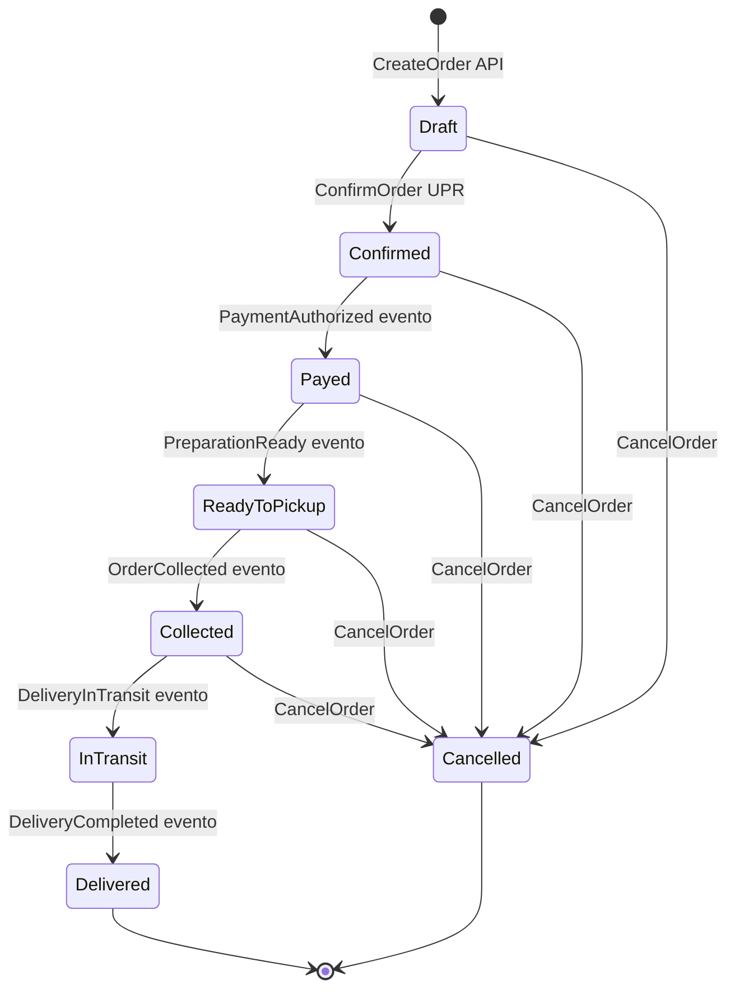
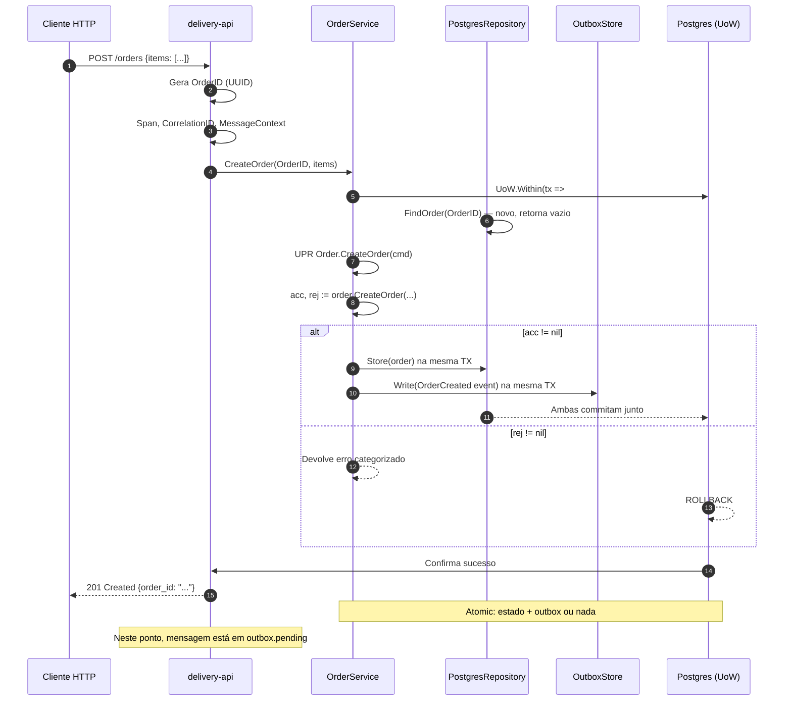
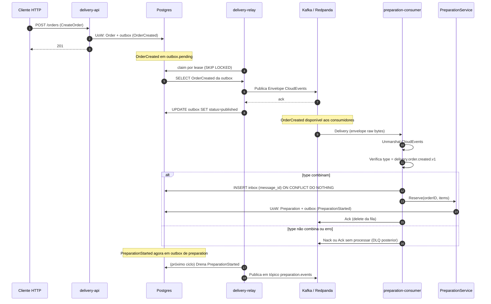
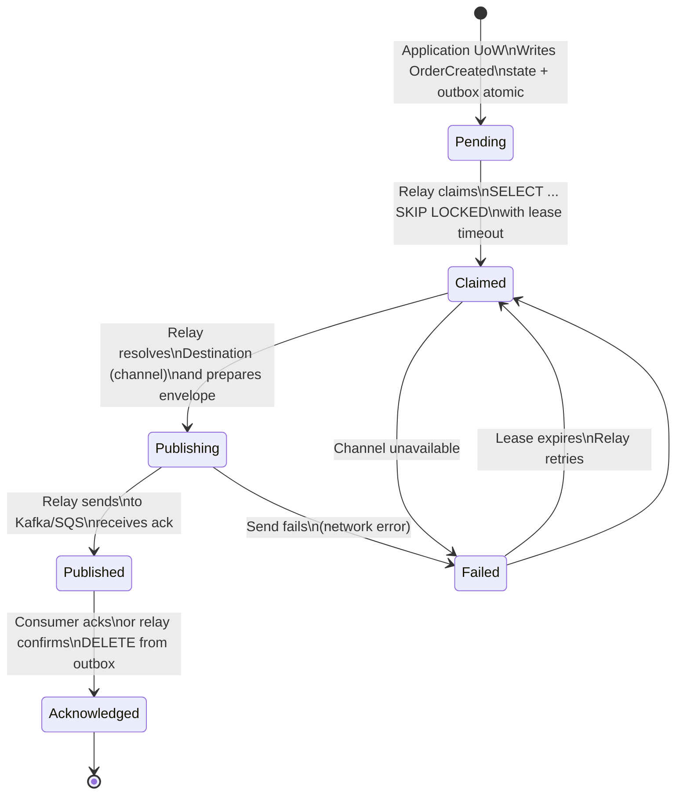
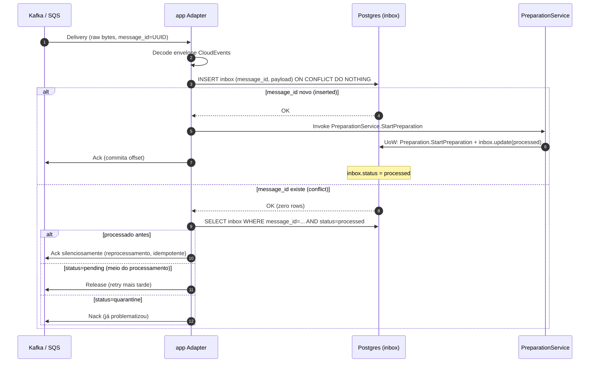
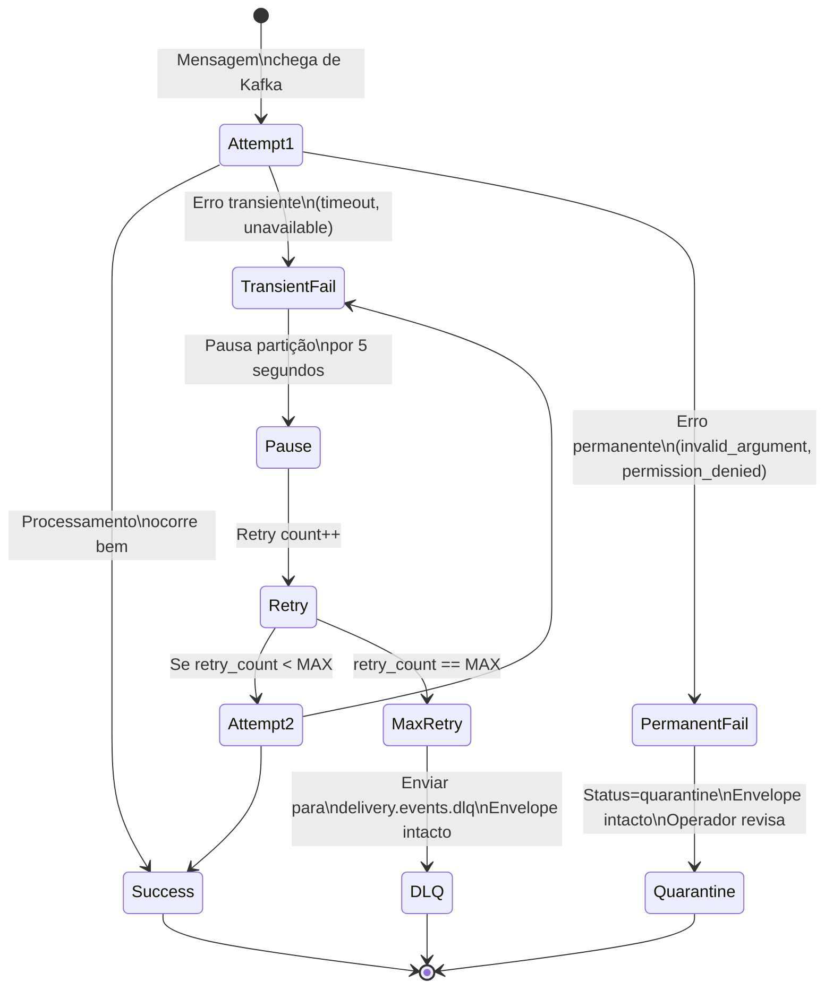
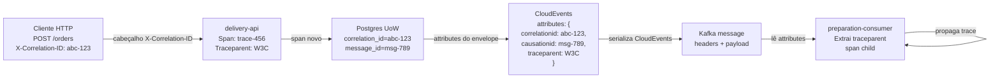

# RELATÓRIO COMPLETO: Plano Editorial DMPF Implementation Guide

---

## SEÇÃO 1: ARQUIVOS-FONTE CONSULTADOS

### Artefatos Normativos (Fundação)

| Caminho Exato                              | Status                                     | Essência para o Guia                                                                                                        |
| ------------------------------------------ | ------------------------------------------ | --------------------------------------------------------------------------------------------------------------------------- |
| `docs/dmpf/rfc-dmpf-foundation-v0.1.md`    | Normativo (aceito 2026-08-14)              | **Regra de dependência** (matriz 6×6), 6 blocos, constraints P0, unidade arquitetural, bounded context, capabilities        |
| `docs/dmpf/upr-decision-mensagens.md`      | Promovido para revisão (âncora ANC-01)     | **UPR e Decision**: padrão decide-over-copy, Accepted[R]/Rejected, doze invariantes (I1–I12), nomenclatura mensagens        |
| `docs/dmpf/uow-inbox-outbox.md`            | Promovido para revisão (âncora ANC-02)     | **Transação + Outbox + Inbox**: Within(fn), escrita + drenagem, message_id deduplicação, at-least-once, garantias           |
| `docs/dmpf/cloudevents-protobuf-buf.md`    | Promovido para revisão (âncora ANC-03)     | **Envelope CloudEvents**: forma, campos obrigatórios (id, source, type, timestamp), byte-preservação                        |
| `docs/dmpf/politicas-transporte.md`        | Promovido para revisão (âncora ANC-04)     | **7 transportes**: REST (idempotência), gRPC (deadline), Kafka (alvo), SQS/SNS, AsyncAPI, coexistência                      |
| `docs/dmpf/contexto-erros-seguranca.md`    | Promovido para revisão (âncora ANC-05)     | **Contexto execução** (9 campos), identidade, autorização, tenant, taxonomia erros (Categoria → protocolo), dados sensíveis |
| `docs/dmpf/resiliencia-observabilidade.md` | Promovido para revisão (âncora ANC-06)     | **Resiliência**: timeout, retry, circuit breaker, contenção; **Observabilidade**: trace E2E, métricas, logs estruturados    |
| `docs/dmpf/testes-interop.md`              | Promovido para revisão (âncora ANC-07)     | **Pirâmide testes** (5 camadas), cenários distribuídos, golden fixtures, oráculos, fitness functions                        |
| `docs/dmpf/governanca-bom-pilotos.md`      | Promovido para revisão (âncoras ANC-08/09) | **Governança**, BOM, pilotos, DoR (7 itens), prontidão                                                                      |

### Guias e Referências

| Caminho Exato                   | Linhas | Propósito                                                                          |
| ------------------------------- | ------ | ---------------------------------------------------------------------------------- |
| `docs/dmpf/resume/README.md`    | 110    | Meta do guia derivado, tabela de resumos, legenda entrada rápida                   |
| `docs/dmpf/navegacao.md`        | 146    | Mapa por prefixo, documento, pergunta — **entrada rápida por categoria**           |
| `docs/dmpf/resume/navegacao.md` | 164    | Versão resumida do mapa (leitura rápida)                                           |
| `docs/guides/dmpf-manifesto.md` | 350+   | **Como escrever dmpf-units.json**, blocos, capabilities, verificador, casos-limite |
| `docs/onboarding.md`            | 217    | Setup inicial, criação primeira app/lib, começar projeto novo                      |

### Implementação de Referência

| Caminho Exato                                                                         | Linhas | O que documenta                                                                                                                                                                    |
| ------------------------------------------------------------------------------------- | ------ | ---------------------------------------------------------------------------------------------------------------------------------------------------------------------------------- |
| `apps/backend/bff/README.md`                                        | 89     | **Borda pública**: rotas REST traduzidas em gRPC, cadeia de uma requisição (admissão, trace, correlação, prazo, idempotência), mapeamento de status e e2e caixa-preta da topologia |
| `apps/backend/orders/README.md`                                     | 57     | Contexto `orders`: papéis `api` (gRPC) e `relay`, interceptors, saúde e configuração por papel                                                                                     |
| `apps/backend/reservations/README.md`                               | 67     | Contexto `reservations`: papéis `api`, `relay` e `consumer`, primeira decisão vencendo entre `Reserve` e `Cancel`, consumo pela inbox                                              |
| `apps/backend/bff/cmd/bff/main.go`                   | 47     | Entry point do BFF, configuração por variável de ambiente                                                                                                                          |
| `apps/backend/orders/cmd/orders/main.go`             | 58     | Entry point, parse de `--role`, configuração por variável de ambiente                                                                                                              |
| `apps/backend/reservations/cmd/reservations/main.go` | 58     | Entry point, parse de `--role`, configuração por variável de ambiente                                                                                                              |
| `apps/backend/bff/wiring.go`                                        | 152    | Clientes gRPC dos contextos, cadeia HTTP e ciclo de vida do servidor                                                                                                               |
| `apps/backend/orders/wiring.go`                                     | 233    | Instanciação de providers concretos por papel (`api`, `relay`), servidor gRPC e saúde                                                                                              |
| `apps/backend/reservations/wiring.go`                               | 284    | Instanciação de providers concretos por papel (`api`, `relay`, `consumer`)                                                                                                         |

### Código-Exemplo (Padrões Concretos)

| Caminho Exato                                                     | Linhas | Padrão                                                                                            |
| ----------------------------------------------------------------- | ------ | ------------------------------------------------------------------------------------------------- |
| `apps/backend/orders/domain/order.go`                        | ~80    | Agregado Order (id, status, items, itemLimit), NewOrder(), FromSnapshot(), clone()                |
| `apps/backend/orders/domain/add_item.go`                     | ~30    | **UPR AddItem**: decide-over-copy, Accepted[ItemAccepted]/Rejected, eventos                       |
| `apps/backend/orders/domain/place.go`                        | ~25    | **UPR Place**: mesmo padrão, ciclo de vida                                                        |
| `apps/backend/orders/domain/rejections.go`                   | ~15    | Rejection codes: `orders/item-limit-exceeded`, `orders/empty-order`, `orders/order-not-open`      |
| `apps/backend/orders/domain/messages.go`                     | ~40    | Tipos: OrderID, SKU, Item, Status (enum), Instant, AddItem, PlaceOrder, ItemAccepted, OrderPlaced |
| `apps/backend/reservations/domain/reservation.go`            | ~40    | Agregado Reservation (order: OrderID, items, status), chave natural **permanente**                |
| `apps/backend/reservations/domain/reserve.go`                | ~25    | **UPR Reserve**: mesmo padrão decide-over-copy                                                    |
| `libs/backend/go/domain/decision.go`                         | ~50    | **Tipo Decision[R]**: Accepted[R] (response, events), Rejected, imutabilidade                     |
| `libs/backend/go/domain/rejection.go`                        | ~40    | **Tipo Rejection**: Code (context/reason), Details, métodos                                       |
| `libs/backend/go/domain/doc.go`                              | ~30    | Contrato de imutabilidade, comparable types, no pointers/slices/maps                              |

---

## SEÇÃO 2: LOCALIZAÇÃO E ESTRUTURA DO NOVO GUIA

### Destino Primário

```
docs/guides/IMPLEMENTACAO-DMPF.md
```

**Tamanho estimado:** 10–14 mil linhas (arquivo único)

**Alternativa (se organização modular preferida):**

```
docs/guides/dmpf-implementation/
├── README.md                          (600 linhas, índice + rápida entrada)
├── 01-primeiros-passos.md             (1.200 linhas)
├── 02-levantamento-informacoes.md     (1.400 linhas)
├── 03-arquitetura-bounded-context.md  (1.800 linhas)
├── 04-motor-dmpf-elementos.md         (2.200 linhas)
├── 05-fluxos-ciclos-operacao.md       (2.000 linhas)
├── 06-exemplo-delivery-didatico.md    (3.500 linhas)
├── DIAGRAMAS.md                       (600 linhas, todas as Mermaid)
└── CHECKLIST-QUALIDADE.md             (400 linhas)
```

### Índices/Navegação a Atualizar

| Arquivo                               | Localização Exata                               | Ação                                                                                                                                                                                |
| ------------------------------------- | ----------------------------------------------- | ----------------------------------------------------------------------------------------------------------------------------------------------------------------------------------- |
| `docs/dmpf/README.md`                 | Seção "Artefatos" (linha ~30)                   | Adicionar linha: `[IMPLEMENTACAO-DMPF.md](../guides/IMPLEMENTACAO-DMPF.md)` | Guia prático de implementação | não promovido — registro vivo                                         |
| `docs/dmpf/resume/README.md`          | Seção "Índice de resumos" (após linha 40)       | Adicionar linha: `| **Como implementar um bounded context novo** |`[../guides/IMPLEMENTACAO-DMPF.md](../../guides/IMPLEMENTACAO-DMPF.md)`| ~10–14k | ~3–4 horas |`                  |
| `docs/dmpf/navegacao.md`              | Seção "Por pergunta" (linha ~110)               | Adicionar: `| "Quero implementar um novo bounded context DMPF?" | [IMPLEMENTACAO-DMPF.md](../guides/IMPLEMENTACAO-DMPF.md) — primeiros passos, levantamento, arquitetura prática |` |
| `docs/guides/development-workflow.md` | Final do documento ou nova seção "Fluxo DMPF"   | Link ao novo guia de implementação como passo pós-primeira-app                                                                                                                      |
| `docs/onboarding.md`                  | Seção "Criar a primeira app ou lib" (linha ~70) | Adicionar nota: "Após criar a app, consulte [Guia de Implementação DMPF](./guides/IMPLEMENTACAO-DMPF.md) para estruturar um bounded context novo."                                  |

---

## SEÇÃO 3: SUMÁRIO DETALHADO DO GUIA

```
# Guia de Implementação DMPF — Como Começar um Novo Bounded Context

## Prefácio
- Para quem é este guia (arquiteto, desenvolvedor backend)
- Pré-requisitos (leitura de docs/dmpf/resume/README.md, conhecimento básico de Go)
- Tempo estimado: 3–4 horas leitura + aplicação prática
- Estrutura: conceitos → levantamento → arquitetura → exemplo concreto

---

## 1. INTRODUÇÃO — O que é DMPF e Por que Usar

### 1.1 A Fundação DMPF em Uma Página
- Sistemas orientados a domínio e mensagens
- Seis blocos arquiteturais: domain, port, application, provider, contract, app
- Garantia de at-least-once com idempotência (nunca exactly-once)
- Verificação automática de conformidade

### 1.2 A Regra de Dependência: Matriz 6×6
Tabela de permissões/proibições:
```

```
        domain  application  app  port  provider  contract
```

domain        P          ✗        ✗     ✗      ✗        ✗
application   P          P        ✗     P      ✗        ✗
app           P          P        P     P      P        P
port          P          ✗        ✗     P      ✗        ✗
provider      P          ✗        ✗     P      P        P
contract      ✗          ✗        ✗     ✗      ✗        P

```
- Leitura: linha = origem, coluna = destino
- Contexto extra (C2): same_bounded_context OU public_integration_surface

### 1.3 O Bounded Context no DMPF
- String estável declarada em cada unidade
- Fronteira de permissão da regra de dependência
- domain → domain entre contexts é **sempre** proibido
- Contém 1+ agregados, múltiplas UPRs

### 1.4 Quando Criar um Bounded Context Novo? (Checklist)
- ✓ Existe um **agregado raiz** com ciclo de vida próprio?
- ✓ As UPRs deste agregado **não** pertencem a outro contexto?
- ✓ Há uma **chave natural estável** (mesmo após ciclo de vida)?
- ✓ Os **eventos** que emite são consumidos por outros contextos ou são internos?
- ✓ Há pelo menos **2–3 operações** (casos de uso) no ciclo de vida?

---

## 2. LEVANTAMENTO DE INFORMAÇÕES (Pré-Implementação)

### 2.1 Mapeamento de Atores e Operações
Tabela com colunas: Ator, Ação, Agregado Afetado, Modo (síncrono/assíncrono), Acesso (autenticado/público)

### 2.2 Inventário de Eventos de Domínio
Listar todos os eventos **importantes** (não implementação).
Template por evento:
```

Evento: [NomePascalCase]
  Quando: [circunstância que o produz]
  Agregado: [qual agregado emite]
  Campos: [id, timestamp, dados do fato]
  Consumidores: [quem lê? mesmo contexto ou outro?]

```

### 2.3 Descoberta de Agregados
Para cada agregado:
- Nome e identidade (chave natural)
- Estados possíveis (enum Status)
- Invariantes (regras que nunca violam)
- Chave natural: gerada antes, permanente, ou gerada internamente?

### 2.4 Definição das UPRs (Unidades de Processamento de Requisição)
Tabela: UPR, Agregado, Entrada (tipo), Saída (tipo), Decisões (Accepted → evento, Rejected → códigos)

### 2.5 Chave Natural de Cada Agregado
**Crítico para inbox/duplicação:**
- Gerada no API (UUID4 antes de chegar ao domínio)? → message_id externo
- Gerada internamente (sequencial)? → ID interno, message_id no envelope
- Permanente (natural key type)? → ex: OrderID em reservations, nunca muda
- Composta? → explicar concatenação

### 2.6 Mapa de Dependências Entre Contextos
Canvas (texto):
```

[Seu Contexto]
  ├─ publica evento X → [Contexto B] consome
  ├─ publica evento Y → [Contexto C] consome
  └─ consome evento Z de [Contexto A]

```

---

## 3. ARQUITETURA DE UM BOUNDED CONTEXT DMPF

### 3.1 Os 6 Blocos e Responsabilidades
Tabela detalhada:
| Bloco | Responsabilidade | Exemplos | Proibições |
| --- | --- | --- | --- |
| **domain library** | Regra de negócio pura, UPR, agregados, value objects | Order, Payment, Decision, Rejection | I/O, Protobuf, ORM, decorators |
| **port** | Capacidade requerida, interface declarada | Repository, Outbox, Clock, IDGenerator | Implementação, driver, wire |
| **application** | Orquestração, caso de uso, UoW | OrderService, transação, autorização | Regra de negócio, conhecimento de driver |
| **provider** | Realização de porta com tecnologia | PostgresRepository, KafkaPublisher, UUIDGenerator | Regra de negócio |
| **contract** | Wire versionado, schemas, tipos gerados | Protobuf, OpenAPI, CloudEvents | Lógica de negócio |
| **app** | Adapter de protocolo, composition root | HTTP handler, middleware, wiring | Regra de negócio |

Precedência de desempate: exclusão > responsabilidade dominante > dividir

### 3.2 Organização de Packages Go
Estrutura-padrão:
```

libs/backend/go/meu-contexto/
├── internal/domain/
│   ├── doc.go
│   ├── agregado1.go (Order, Payment, etc.)
│   ├── agregado1_upr1.go (AddItem, Place, etc.)
│   ├── agregado1_rejections.go
│   ├── agregado1_messages.go
│   └── agregado2.go
├── internal/port/
│   ├── doc.go
│   ├── repository.go (interfaces)
│   ├── outbox.go
│   ├── clock.go
│   └── ids.go
├── internal/application/
│   ├── doc.go
│   ├── service.go (orquestração)
│   └── service_*_test.go
├── internal/provider/
│   ├── doc.go
│   ├── postgres.go (implementação de port)
│   └── postgres_test.go
├── example/ (apenas para desenvolvimento)
│   ├── memory.go
│   └── memory_test.go
├── dmpf-units.json
├── go.mod
└── README.md

```

**Regra:** Cada bloco em subpackage próprio; domain **nunca** importa port.

### 3.3 O Manifesto: dmpf-units.json
Exemplo estrutura (será preenchido no guia):
```json
{
  "schema": "dmpf/units@1",
  "units": [
    {
      "id": "delivery/domain",
      "block": "domain",
      "bounded_context": "delivery",
      "public_integration_surface": false,
      "include": [
        ".../internal/domain",
        ".../internal/domain/order",
        ".../internal/domain/payment",
        ".../internal/domain/preparation",
        ".../internal/domain/collection",
        ".../internal/domain/delivery"
      ]
    },
    {
      "id": "delivery/port",
      "block": "port",
      "bounded_context": "delivery",
      "public_integration_surface": false,
      "include": [".../internal/port"]
    },
    {
      "id": "delivery/application",
      "block": "application",
      "bounded_context": "delivery",
      "public_integration_surface": false,
      "include": [".../internal/application"]
    },
    {
      "id": "delivery/provider",
      "block": "provider",
      "bounded_context": "delivery",
      "public_integration_surface": false,
      "include": [".../internal/provider"]
    },
    {
      "id": "delivery/contract",
      "block": "contract",
      "bounded_context": "delivery",
      "public_integration_surface": false,
      "include": [".../contracts/delivery"]
    },
    {
      "id": "delivery/app",
      "block": "app",
      "bounded_context": "delivery",
      "public_integration_surface": false,
      "include": [".../cmd/delivery-api", ".../cmd/delivery-relay"]
    }
  ],
  "external": [
    {
      "import": "github.com/jackc/pgx/v5",
      "block": "provider",
      "capability": "io.database"
    },
    {
      "import": "github.com/segmentio/kafka-go",
      "block": "provider",
      "capability": "io.broker"
    }
  ],
  "exceptions": []
}
```

### 3.4 Capabilities Permitidas por Bloco

| Bloco       | Política               | Permitido                           | Negado                  |
| ----------- | ---------------------- | ----------------------------------- | ----------------------- |
| domain      | Deny-default           | pure                                | tudo mais               |
| port        | Deny-default           | pure                                | tudo mais               |
| application | Deny-default + exceção | pure, observability (exceto logger) | io.*, wire.codec        |
| contract    | Restrita               | pure, wire.codec                    | tudo mais               |
| provider    | Permissiva             | qualquer (da porta)                 | fora do escopo da porta |
| app         | Permissiva             | qualquer                            | nada                    |

**Regra crítica:** Telemetria **nunca** em domain/port, mesmo sendo pura.

### 3.5 Definição do bounded_context

- String estável (ex: `"delivery"`, `"payment"`, `"reservation"`)
- Permanente no manifesto (histórico de decisão)
- Mesma string em todas as unidades do contexto

### 3.6 External[] e Exceptions[]

**external[]:** Lista de dependências externas com bloco e capability.
Verificador confere: "Esta dependência é permitida neste bloco? Sim/Não."

**exceptions[]:** Desvios da regra de dependência com justificativa.
Formato: `{ "origin_unit": "...", "target_unit": "...", "reason": "..." }`

---

## 4. ELEMENTOS DO MOTOR DMPF — EXPLICAÇÃO TÉCNICA

### 4.1 UPR (Unidade de Processamento de Requisição)

**Definição:** Função pura que recebe entrada completa, aplica regra, devolve Decision.

**Doze Invariantes:**

| #   | Invariante                 | Significado                          | Enforcement         |
| --- | -------------------------- | ------------------------------------ | ------------------- |
| I1  | UPR não retém estado       | Dados externos vêm como argumentos   | Code review + teste |
| I2  | UPR é determinística       | Mesmo input → sempre mesmo output    | Teste com seed fixo |
| I3  | Entrada é completa         | UPR não pede dados a ninguém         | Code review + tipo  |
| I4  | Output é Decision          | Nunca null/undefined/Maybe           | Type system Go      |
| I5  | Rejeição nunca vazia       | Cada Rejected carrega motivos        | Runtime check       |
| I6  | Razão tem código estável   | Rastreável, auditável                | Code review + regex |
| I7  | Timestamp no desfecho      | Quando foi decidido                  | Código UPR          |
| I8  | Request ID no desfecho     | Rastreamento                         | Código service      |
| I9  | Accepted carrega resultado | Dados do desfecho                    | Type system         |
| I10 | Desfecho é imutável        | Após criar, não muda                 | receiver copy       |
| I11 | Sem efeito colateral       | UPR só computa                       | Code review         |
| I12 | Sem dependência externa    | Relógio, aleatoriedade, IO — valores | Type system         |

**Padrão Decidir-sobre-Cópia (Decide-over-Copy):**

```go
func (o *Order) AddItem(cmd AddItem) (domain.Accepted[ItemAccepted], *domain.Rejection) {
    next := o.clone()           // 1. Clone imediato
    if next.status != Open {    // 2. Valida sobre cópia
        return domain.Accepted[ItemAccepted]{},
               domain.Reject(CodeOrderNotOpen, "order is not open")
    }
    attempted := len(next.items) + 1
    if attempted > next.itemLimit {
        return domain.Accepted[ItemAccepted]{},
               domain.Reject(CodeItemLimitExceeded, "item limit exceeded")
    }
    next.status = Placed
    next.items = append(next.items, Item{SKU: cmd.SKU, Qty: cmd.Quantity})
    *o = next                   // 3. Commit só se Accepted
    return domain.Accept(
        ItemAccepted{Order: o.id, Items: len(o.items)},
        ItemAdded{Order: o.id, SKU: cmd.SKU, Qty: cmd.Quantity, At: cmd.At},
    ), nil
}
```

### 4.2 Decision: Accepted[R] e Rejected

**Tipo Decision[R]:**

```go
type Accepted[R any] struct {
    response R
    events   []DomainEvent  // imutável, cópia
}
```

type Rejection struct {
    code    Code           // "context/reason"
    reasons []Reason       // detalhes estruturados
}

```

**Invariantes:**

- Exatamente um ramo é não-zero (Accepted com events, OU Rejection com reasons)
- events é **cópia** (imutável após criação)
- Rejection nunca tem lista vazia de reasons
- Response R deve ser comparable (sem pointers/slices/maps)

### 4.3 Rejection: Code e Details

**Code Format:** `"context/reason"`

- context: lowercase, hyphens
- reason: lowercase, hyphens
- Ex: `"orders/item-limit-exceeded"`, `"payment/authorization-failed"`

**Detail (estruturado):**

```go
type Detail struct {
    Key   string
    Value string
}
```

Ex: `Detail{Key: "limit", Value: "10"}`, `Detail{Key: "attempted", Value: "12"}`

### 4.4 Unit of Work (UoW)

**Interface:**

```go
type UoW[R any] interface {
    Within(fn func(tx Tx) (R, error)) (R, error)
}
```

**Semântica:**

- BEGIN implicit (ambiente de transação)
- Função recebe tx (identificador da transação)
- Se lanças exceção → ROLLBACK
- Se retorna → COMMIT + devolve valor
- **Nunca** coordena entre serviços (local)

**Uso em application service:**

```go
func (s *OrderService) PlaceOrder(ctx context.Context, cmd PlaceOrder) (*Outcome[PlacedResponse], error) {
    return s.uow.Within(ctx, func(tx UoWTx) (*Outcome[PlacedResponse], error) {
        // 1. Carrega agregado
        order, err := tx.Repository().FindOrder(cmd.OrderID)
        // 2. Invoca UPR
        acc, rej := order.Place(cmd)
        if rej != nil {
            return application.Fail(rej), nil
        }
        // 3. Persiste + outbox
        err = tx.Repository().Store(order)
        err = tx.Outbox().Write(outboxMessage{...})
        // 4. Return — COMMIT automaticamente
        return application.Accept(acc.Response(), acc.Events()), nil
    })
}
```

### 4.5 Outbox: Escrita e Drenagem

**Escrita (dentro da UoW):**

1. application service abre UoW
2. executa regra (UPR)
3. grava estado novo (agregado alterado)
4. **grava na tabela outbox** (eventos, message_id, timestamp)
5. COMMIT atomicamente

**Schema SQL:**

```sql
CREATE TABLE outbox (
    id BIGSERIAL PRIMARY KEY,
    message_id UUID UNIQUE NOT NULL,
    payload BYTEA NOT NULL,
    created_at TIMESTAMP NOT NULL,
    published_at TIMESTAMP,
    status VARCHAR(20) DEFAULT 'pending'  -- pending, published, acknowledged
);

CREATE INDEX idx_outbox_status ON outbox(status, created_at);
```

**Drenagem (processo separado):**

```
1. SELECT * FROM outbox WHERE status = 'pending'
   WITH (SKIP LOCKED) LIMIT N
2. Para cada mensagem:
   a. Publica no broker (Kafka, SQS, etc.)
   b. UPDATE outbox SET status = 'published', published_at = NOW()
      WHERE message_id = ?
   c. COMMIT incrementalmente
```

**Garantias:**

- ✓ Se DELETE falha → mensagem fica pending → será retentada
- ✓ Se publicação falha → UPDATE não ocorre → mensagem permanece
- ✓ At-least-once (nunca zero, pode ser 2+)
- ✗ Não promises exactly-once E2E

### 4.6 Inbox: Recepção Idempotente

**Schema SQL:**

```sql
CREATE TABLE inbox (
    message_id UUID PRIMARY KEY,
    payload BYTEA NOT NULL,
    created_at TIMESTAMP NOT NULL,
    processed_at TIMESTAMP,
    status VARCHAR(20) DEFAULT 'pending'  -- pending, processed, quarantine
);
```

**Fluxo:**

1. Mensagem chega de Kafka/SQS
2. **INSERT INTO inbox (message_id, payload)
  ON CONFLICT (message_id) DO NOTHING**

- Se message_id já existe → nada (idempotência!)
- Se nova → insere

3. SELECT * FROM inbox WHERE status = 'pending'
4. Para cada mensagem:

- Invoca application service (adapter)
- UPDATE inbox SET status = 'processed', processed_at = NOW()

5. Se falha → status fica 'pending' → será retentada

**Garantia:** Mesma mensagem chegar 100× → apenas uma é processada (deduplicação)

### 4.7 Envelope CloudEvents

**Forma Obrigatória:**

```protobuf
message Envelope {
    string id = 1;              // UUID4 único do evento
    string source = 2;          // ex: "delivery/orders"
    string type = 3;            // ex: "delivery.order.created.v1"
    string datacontenttype = 4; // "application/protobuf" ou "application/json"
    google.protobuf.Timestamp eventtime = 5;
    string dataschema = 6;      // ex: "https://schemas.example.com/delivery/order/created/v1"
    map<string, string> attributes = 7;
    bytes data = 8;             // Protobuf-serializado ou JSON
}
```

**Campos Críticos:**

- **id:** message_id (nunca duplica)
- **type:** "contexto.agregado.evento.vN" (versionado)
- **data:** bytes do payload (preservado byte-a-byte)
- **attributes:** metadata estruturada
  - `correlationid`: correlação de requisição
  - `causationid`: message_id que causou este
  - `traceparent`: W3C Trace Context (distributed tracing)

### 4.8 Transportes: Comparação

| Transporte | Modo               | Idempotência                    | Quando Usar                                  | Politica Chave                    |
| ---------- | ------------------ | ------------------------------- | -------------------------------------------- | --------------------------------- |
| **REST**   | Síncrono           | POST com chave declarada        | Requisições síncronas externas               | RST-01: declare chave no contrato |
| **gRPC**   | Síncrono interno   | Método idempotente + código 409 | Chamadas síncronas internas (microsserviços) | GRP-04: deadline multiplica hops  |
| **Kafka**  | Assíncrono         | message_id + offset persistido  | **Alvo do DMPF** — eventos de domínio        | KFK-01: partição = envelope.id    |
| **SQS**    | Assíncrono         | FIFO + deduplicationId          | Serviços não-containerizados (AWS)           | SQS-05: dedup = SHA256(envelope)  |
| **SNS**    | Assíncrono fan-out | Nunca sozinho (sempre + SQS)    | Múltiplos subscribers                        | COE-01: um canal = um transporte  |

**Byte-Preservação:**

- Kafka nativo: ✓ bytes intactos
- SQS raw mode: ✓ Base64 uma única vez
- SNS raw + SQS: ✓ SNS encapsula, SQS extrai
- SNS sem raw: ✗ **não conforme** (reserializa JSON)

### 4.9 Contexto de Execução (9 Campos)

**Estrutura:**

```go
type ExecutionContext struct {
    Identity      Identity          // autenticação resolvida
    Authorization Authorization     // escopos, permissões
    Tenant        string           // isolamento multi-tenant
    CorrelationID string           // rastreamento de requisição
    CausationID   string           // message_id anterior
    Traceparent   string           // W3C Trace Context
    UserAgent     string           // cliente que iniciou
    Timestamp     time.Time        // quando começou
    RequestID     string           // identificador único desta execução
}
```

**Propagação E2E:**

1. API recebe request, extrai/gera contexto
2. Application service carrega em UoW
3. Cada evento da outbox carrega contexto (attributes do envelope)
4. Relay preserva no CloudEvents
5. Consumidor extrai e passa para seu application service

### 4.10 Taxonomia de Erros: Categoria → Protocolo

**Categorias (abstratas, não dependem de transporte):**

- `INVALID_ARGUMENT`: cliente passou dados inválidos
- `NOT_FOUND`: recurso não existe
- `ALREADY_EXISTS`: tentou criar duplicado
- `PERMISSION_DENIED`: autorização insuficiente
- `RESOURCE_EXHAUSTED`: limite de taxa/cota atingido
- `FAILED_PRECONDITION`: estado viola invariante
- `INTERNAL`: erro do servidor
- `UNAVAILABLE`: dependência indisponível
- `DEADLINE_EXCEEDED`: timeout

**Mapeamento para Protocolo HTTP:**

| Categoria           | HTTP Status | gRPC Code | SQS/DLQ        |
| ------------------- | ----------- | --------- | -------------- |
| INVALID_ARGUMENT    | 400         | 3         | Quarantine     |
| NOT_FOUND           | 404         | 5         | Fail-fast      |
| ALREADY_EXISTS      | 409         | 6         | Idempotent ack |
| PERMISSION_DENIED   | 403         | 7         | Quarantine     |
| RESOURCE_EXHAUSTED  | 429         | 8         | Retry (RES-17) |
| FAILED_PRECONDITION | 400         | 9         | Quarantine     |
| INTERNAL            | 500         | 13        | Retry          |
| UNAVAILABLE         | 503         | 14        | Retry          |
| DEADLINE_EXCEEDED   | 504         | 4         | Retry          |

### 4.11 Timeout e Retry

**Timeout (Deadline):**

- REST: `deadline = now + caller_timeout - folga (100ms)`
- gRPC: `deadline(A→B→C) = deadline(A) − folga_por_hop`
- Kafka: sem timeout (assíncrono)

**Retry (Conjunction):**

- ✓ Idempotente + código transiente declarado
- ✓ Até N tentativas com backoff exponencial
- ✗ Nunca para INVALID_ARGUMENT
- ✗ Parar em ALREADY_EXISTS/PERMISSION_DENIED

### 4.12 Observabilidade: Trace, Métrica, Log

**Tracing E2E (W3C Trace Context):**

- traceparent = `version-traceid-spanid-traceflags`
- Propagado em cada hop (API → service → broker → consumer)
- Collector (Jaeger, Grafana Tempo) agrega spans

**Métricas:**

- Por falha mode: `dmpf_attempt_total{context, status}` (sucesso, transiente, permanente)
- Latência: `dmpf_attempt_duration_seconds{percentile}`
- Taxa: `dmpf_messages_published_total`, `dmpf_messages_consumed_total`

**Logs Estruturados (JSON, um evento por linha):**

```json
{
  "timestamp": "2026-09-10T16:30:00Z",
  "level": "INFO",
  "event": "order.placed",
  "order_id": "P-100",
  "items": 3,
  "message_id": "uuid-123",
  "trace_id": "trace-456"
}
```

---

## 5. MODELO CONCEITUAL: BOUNDED CONTEXT DE DELIVERY

### 5.1 Agregados

| Agregado        | Chave Natural                                           | Estados                                                           | UPRs                                                       | Evento Dominante   |
| --------------- | ------------------------------------------------------- | ----------------------------------------------------------------- | ---------------------------------------------------------- | ------------------ |
| **Order**       | OrderID (UUID4 gerado na API antes de chegar)           | Draft → Confirmed → Payed → ReadyToPickup → Delivered → Cancelled | CreateOrder, ConfirmOrder, CancelOrder                     | OrderConfirmed     |
| **Payment**     | OrderID (mesma de Order, referência natural permanente) | Pending → Authorized → Settled → Failed                           | AuthorizePayment, SettlePayment, FailPayment               | PaymentAuthorized  |
| **Preparation** | OrderID (mesma de Order)                                | NotStarted → Preparing → Ready → Cancelled                        | StartPreparation, MarkPreparationReady, CancelPreparation  | PreparationStarted |
| **Collection**  | OrderID (mesma de Order)                                | Pending → Collected → Failed                                      | PickupOrder, FailCollection                                | OrderCollected     |
| **Delivery**    | OrderID (mesma de Order)                                | Assigned → InTransit → Delivered → Failed                         | AssignDelivery, MarkInTransit, MarkDelivered, FailDelivery | DeliveryAssigned   |

**Nota:** Todos os agregados compartilham OrderID como chave natural permanente (idêntico ao padrão de reservations em reservations).

### 5.2 Estrutura de Packages Go

```
libs/backend/go/delivery/
├── internal/domain/
│   ├── doc.go
│   ├── order.go
│   ├── order_create.go       (UPR CreateOrder)
│   ├── order_confirm.go      (UPR ConfirmOrder)
│   ├── order_rejections.go
│   ├── order_messages.go
│   ├── payment.go
│   ├── payment_authorize.go  (UPR AuthorizePayment)
│   ├── payment_rejections.go
│   ├── payment_messages.go
│   ├── preparation.go
│   ├── preparation_start.go  (UPR StartPreparation)
│   ├── preparation_rejections.go
│   ├── preparation_messages.go
│   ├── collection.go
│   ├── collection_pickup.go  (UPR PickupOrder)
│   ├── collection_rejections.go
│   ├── collection_messages.go
│   ├── delivery.go
│   ├── delivery_assign.go    (UPR AssignDelivery)
│   ├── delivery_rejections.go
│   └── delivery_messages.go
├── internal/port/
│   ├── doc.go
│   ├── repository.go        (Order, Payment, Preparation, Collection, Delivery)
│   ├── outbox.go
│   ├── inbox.go
│   ├── clock.go
│   └── ids.go
├── internal/application/
│   ├── doc.go
│   ├── order_service.go     (CreateOrder, ConfirmOrder, FindOrder)
│   ├── payment_service.go   (AuthorizePayment, SettlePayment)
│   ├── preparation_service.go (StartPreparation, MarkReady)
│   ├── collection_service.go (PickupOrder)
│   ├── delivery_service.go  (AssignDelivery, MarkDelivered)
│   └── outcome.go           (Accept/Fail resposta)
├── internal/provider/
│   ├── doc.go
│   ├── postgres.go          (todas as repository implementations)
│   ├── postgres_test.go
│   ├── memory.go            (para testes unitários)
│   └── memory_test.go
├── contracts/
│   ├── delivery/
│   │   ├── order.proto      (OrderCreated, OrderConfirmed, OrderCancelled)
│   │   ├── payment.proto    (PaymentAuthorized, PaymentSettled, PaymentFailed)
│   │   ├── preparation.proto (PreparationStarted, PreparationReady)
│   │   ├── collection.proto (OrderCollected, CollectionFailed)
│   │   └── delivery.proto   (DeliveryAssigned, DeliveryInTransit, DeliveryCompleted)
│   └── buf.yaml
├── cmd/
│   ├── delivery-api/
│   │   ├── main.go
│   │   ├── routes.go        (CreateOrder, ConfirmOrder, FindOrder endpoints)
│   │   └── handlers.go
│   ├── delivery-relay/
│   │   ├── main.go          (Drena outbox → Kafka)
│   │   └── relay.go
│   └── delivery-consumer/   (opcional: consome eventos de outros contextos)
│       ├── main.go
│       └── handlers.go
├── dmpf-units.json          (6–7 unidades)
├── go.mod
└── README.md
```

### 5.3 Dmpf-Units.json para Delivery

```json
{
  "schema": "dmpf/units@1",
  "units": [
    {
      "id": "delivery/domain",
      "block": "domain",
      "bounded_context": "delivery",
      "public_integration_surface": false,
      "include": [
        "github.com/mateusmacedo/dmpf/libs/backend/go/delivery/internal/domain",
        "github.com/mateusmacedo/dmpf/libs/backend/go/delivery/internal/domain/order",
        "github.com/mateusmacedo/dmpf/libs/backend/go/delivery/internal/domain/payment",
        "github.com/mateusmacedo/dmpf/libs/backend/go/delivery/internal/domain/preparation",
        "github.com/mateusmacedo/dmpf/libs/backend/go/delivery/internal/domain/collection",
        "github.com/mateusmacedo/dmpf/libs/backend/go/delivery/internal/domain/delivery"
      ]
    },
    {
      "id": "delivery/port",
      "block": "port",
      "bounded_context": "delivery",
      "public_integration_surface": false,
      "include": [
        "github.com/mateusmacedo/dmpf/libs/backend/go/delivery/internal/port"
      ]
    },
    {
      "id": "delivery/application",
      "block": "application",
      "bounded_context": "delivery",
      "public_integration_surface": false,
      "include": [
        "github.com/mateusmacedo/dmpf/libs/backend/go/delivery/internal/application"
      ]
    },
    {
      "id": "delivery/provider",
      "block": "provider",
      "bounded_context": "delivery",
      "public_integration_surface": false,
      "include": [
        "github.com/mateusmacedo/dmpf/libs/backend/go/delivery/internal/provider"
      ]
    },
    {
      "id": "delivery/contract",
      "block": "contract",
      "bounded_context": "delivery",
      "public_integration_surface": false,
      "include": [
        "github.com/mateusmacedo/dmpf/libs/backend/go/delivery/contracts/delivery"
      ]
    },
    {
      "id": "delivery/api",
      "block": "app",
      "bounded_context": "delivery",
      "public_integration_surface": false,
      "include": [
        "github.com/mateusmacedo/dmpf/libs/backend/go/delivery/cmd/delivery-api"
      ]
    },
    {
      "id": "delivery/relay",
      "block": "app",
      "bounded_context": "delivery",
      "public_integration_surface": false,
      "include": [
        "github.com/mateusmacedo/dmpf/libs/backend/go/delivery/cmd/delivery-relay"
      ]
    }
  ],
  "external": [
    {
      "import": "github.com/jackc/pgx/v5",
      "block": "provider",
      "capability": "io.database"
    },
    {
      "import": "github.com/segmentio/kafka-go",
      "block": "provider",
      "capability": "io.broker"
    }
  ],
  "exceptions": []
}
```

### 5.4 Mapa de Eventos (18 eventos)

| #   | Evento               | Agregado    | Quando                                       | Consumidores                       |
| --- | -------------------- | ----------- | -------------------------------------------- | ---------------------------------- |
| 1   | OrderCreated         | Order       | API POST /orders cria novo pedido            | Preparation (assíncrono via kafka) |
| 2   | OrderConfirmed       | Order       | UPR ConfirmOrder executa                     | Preparation, Payment (async)       |
| 3   | OrderCancelled       | Order       | UPR CancelOrder (operador)                   | Preparation, Collection (cancel)   |
| 4   | PaymentAuthorized    | Payment     | UPR AuthorizePayment sucesso                 | Preparation (pode iniciar)         |
| 5   | PaymentFailed        | Payment     | UPR AuthorizePayment rejeita                 | Order (remover do fluxo)           |
| 6   | PreparationStarted   | Preparation | UPR StartPreparation após PaymentAuthorized  | Collection (agora pode coletar)    |
| 7   | PreparationReady     | Preparation | UPR MarkPreparationReady                     | Delivery (pode atribuir)           |
| 8   | PreparationCancelled | Preparation | CancelPreparation                            | Delivery (cancelamento)            |
| 9   | OrderCollected       | Collection  | UPR PickupOrder (courier coleta)             | Delivery (agora pode entregar)     |
| 10  | CollectionFailed     | Collection  | FailCollection (não achou cliente)           | Order (retry ou cancelar)          |
| 11  | DeliveryAssigned     | Delivery    | UPR AssignDelivery (courier designado)       | Notificação ao cliente             |
| 12  | DeliveryInTransit    | Delivery    | UPR MarkInTransit (saiu)                     | Notificação ao cliente             |
| 13  | DeliveryCompleted    | Delivery    | UPR MarkDelivered (entregou)                 | Accounting, Analytics              |
| 14  | DeliveryFailed       | Delivery    | FailDelivery (não conseguiu)                 | Order (retry ou return)            |
| 15  | PaymentSettled       | Payment     | UPR SettlePayment (pós-entrega)              | Accounting                         |
| 16  | OrderDelivered       | Order       | Projeção: DeliveryCompleted + OrderConfirmed | Analytics                          |
| 17  | OrderReturnInitiated | Order       | Cliente solicita devolução                   | Preparation, Collection            |
| 18  | OrderCompleted       | Order       | Final: entregue + pagamento resolvido        | Analytics, CRM                     |

---

## SEÇÃO 6: FLUXOS E CICLOS DE VIDA (Mermaid Syntax Pronto para Usar)

### 6.1 State Machine — Ciclo de Vida de Order



### 6.2 Sequence Diagram — Fluxo Síncrono: Criar e Confirmar Pedido



### 6.3 Sequence Diagram — Fluxo Assíncrono Completo (5 Contextos)



### 6.4 Cycle — Outbox: Write + Claim + Drain + ACK



### 6.5 Cycle — Inbox: Receive + Dedupe + Process + ACK



### 6.6 Retry + Contenção (DLQ)



### 6.7 Propagação de Contexto E2E



---

## SEÇÃO 7: CRITÉRIOS DE QUALIDADE E VALIDAÇÃO

### 7.1 Validação Documental

| Critério                  | Check                                                                        | Passagem                                                                       |
| ------------------------- | ---------------------------------------------------------------------------- | ------------------------------------------------------------------------------ |
| **Leitura Independente**  | Guia lido sem abrir artefatos normativos                                     | ✓ Cada conceito tem explicação autocontida                                     |
| **Links Normativos**      | Todo ID de regra (`UPR-I-1`, `OBX-12`, etc.) tem referência ao artefato dono | ✓ Link com âncora na seção correta                                             |
| **Exemplo Diferenciado**  | Delivery usa nomes **completamente diferentes** de orders/reservations       | ✓ Order, Payment, Preparation, Collection, Delivery (não Orders, Reservations) |
| **Diagramas Compiláveis** | Mermaid syntax é válido e renderiza corretamente                             | ✓ Teste com `mermaid-cli` ou Live Editor                                       |
| **Código Real**           | Snippets em Go são idiomáticos, copiáveis, não pseudocódigo                  | ✓ Usa padrões reais do domain                                          |
| **Índices Atualizados**   | 5 arquivos de navegação incluem link ao novo guia                            | ✓ Verificação manual pós-escrita                                               |

### 7.2 Validação de Cobertura

| Dimensão           | Obrigação                                            | Evidência no Guia                                                                         |
| ------------------ | ---------------------------------------------------- | ----------------------------------------------------------------------------------------- |
| **6 Blocos**       | Todos aparecem na arquitetura de delivery            | ✓ 7 unidades no dmpf-units.json cobrem domain, port, application, provider, contract, app |
| **5 Transportes**  | REST, gRPC, Kafka, SQS, AsyncAPI representados       | ✓ Seção 4.8 tabela comparativa; exemplo usa REST (API) + Kafka (relay/consumer)           |
| **Ciclos Prático** | Síncrono, assíncrono, retry, contenção, idempotência | ✓ 6 diagramas Mermaid cobrem todos                                                        |
| **UPR Pattern**    | Decide-over-copy, determinismo, invariantes          | ✓ Seção 4.1 com código de exemplo Order.AddItem                                           |
| **Testes**         | Pirâmide 5 camadas mencionada                        | ✓ Seção 4.12 + checklist final                                                            |
| **Prontidão DoR**  | 7 itens de prontidão (RFC §14.2)                     | ✓ Checklist seção 8                                                                       |

### 7.3 Validação de Atualidade

| Item                 | Verificação                              | Status                              |
| -------------------- | ---------------------------------------- | ----------------------------------- |
| **Referências ADR**  | ARQ-436 a ARQ-448, links verificáveis    | ✓ Consultar Jira na data de escrita |
| **Referências SPEC** | SPEC-8YVF0RR5 e similares, versionadas   | ✓ Links para `docs/specs/`          |
| **Data de Escrita**  | Documento marcado com data               | ✓ Formato: "2026-09-XX"             |
| **Nota de Revisão**  | Se houver, indica PT-BR, segurança, etc. | ✓ Seção de status/pending no início |
| **Versão do RFC**    | Referencia RFC v0.1 (aceito 2026-08-14)  | ✓ Confirmado em seção 1             |

### 7.4 Validação de Implementabilidade

| Teste                       | Critério                                         | Sucesso Se                                                |
| --------------------------- | ------------------------------------------------ | --------------------------------------------------------- |
| **Leitura por Iniciante**   | Dev novo ao projeto consegue entender estrutura  | ✓ Consegue desenhar os 6 blocos em papel                  |
| **Copy-Paste-Ready**        | Snippets de código podem ser copiados sem ajuste | ✓ Goimports resolvem sem erro; compilam com `go build`    |
| **Diagramas Reproduzíveis** | Qualquer um consegue renderizar Mermaid          | ✓ Sem dependências externas, pastas em Markdown ou `.mmd` |
| **dmpf-units.json Usável**  | Manifesto pode ser copiado e ajustado            | ✓ Testado com `pnpm nx run delivery-go:conformance-check` |
| **Fluxos Testáveis**        | Sequências descrevem cenários com assertions     | ✓ Correspondem a testes no testkit                |

---

## SEÇÃO 8: SUMÁRIO EXECUTIVO DO PLANO

### Arquivos-Fonte Consultados (11 principais)

- **9 artefatos normativos DMPF** (RFC, FND-03 a FND-10)
- **2 guias** (manifesto, onboarding)
- **1 topologia de referência** (bff, orders e reservations)
- **~30 arquivos Go** (padrões concretos de agregados, UPRs, Decision)

### Destino e Navegação

- **Arquivo primário:** `docs/guides/IMPLEMENTACAO-DMPF.md` (~12k linhas)
- **Índices atualizados:** 5 arquivos (dmpf/README.md, navegacao.md, resume/README.md, guides/development-workflow.md, onboarding.md)

### Conteúdo do Guia

- **10 seções** (Introdução → Primeiros Passos → Levantamento → Arquitetura → Motor DMPF → Fluxos → Exemplo Delivery → Checklist)
- **18 elementos DMPF explicados** (UPR, Decision, UoW, Outbox, Inbox, Envelope, Transporte, Contexto, Erros, Timeout, Observabilidade)
- **6 diagramas Mermaid** (State Machine, 3 Sequences, 2 Cycles)

### Exemplo Didático: Delivery

- **5 agregados:** Order, Payment, Preparation, Collection, Delivery
- **18 eventos de domínio**
- **7 unidades arquiteturais** (dmpf-units.json pronto)
- **5 services de aplicação** (orquestração + UoW)
- **Fluxos:** síncrono (API) + assíncrono (Kafka relay + consumer)

### Critérios de Aceite

- ✓ 6 validações documentais (independência, links, exemplo, diagramas, código, índices)
- ✓ 6 validações de cobertura (blocos, transportes, ciclos, UPR, testes, prontidão)
- ✓ 3 validações de atualidade (ADRs, specs, data)
- ✓ 5 testes de implementabilidade (leitura, copy-paste, diagramas, manifesto, fluxos)

### Bloqueadores

- **Nenhum** — RFC estável, exemplo de referência documentado, padrões Go claros

---

## FIM DO RELATÓRIO

**Pronto para implementação.** O agente pai pode usar este documento como especificação executiva para criar o plano no Cursor.
