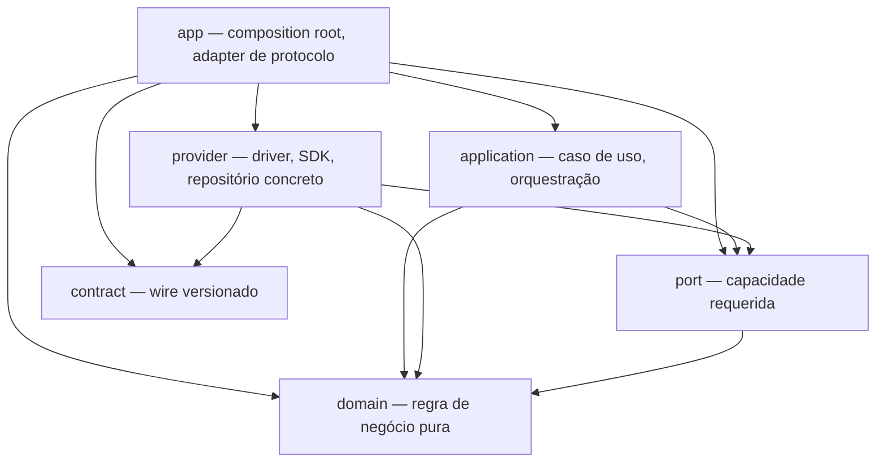
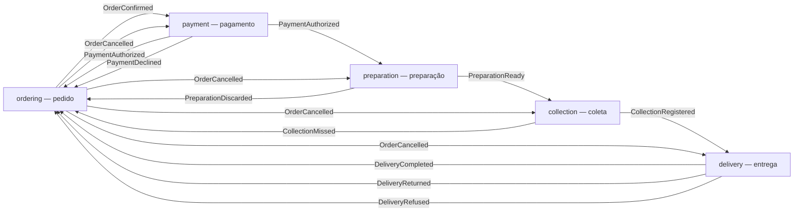
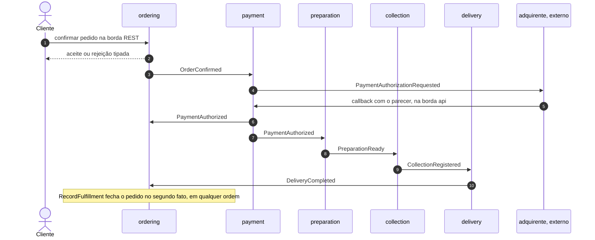
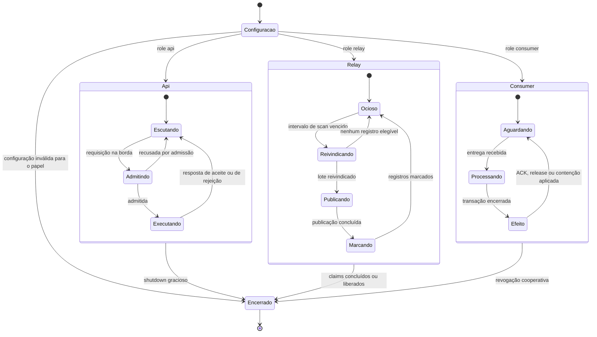
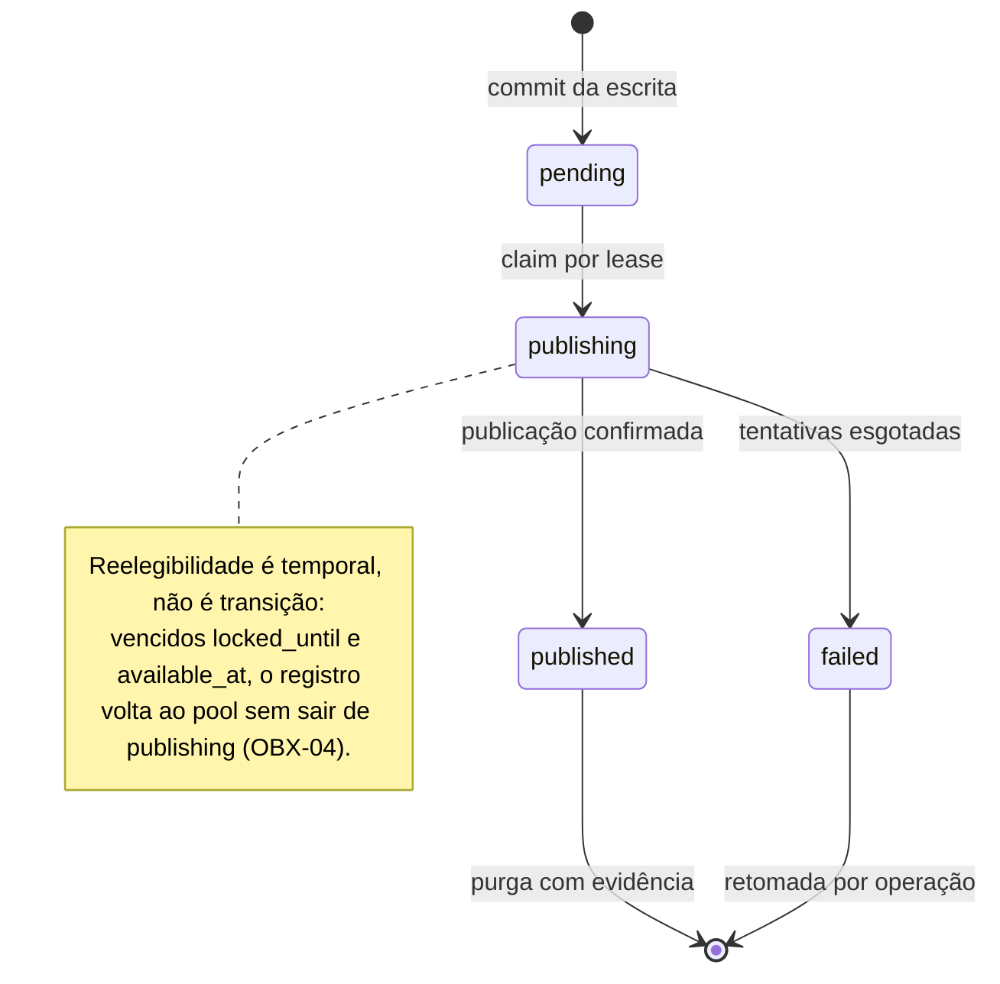
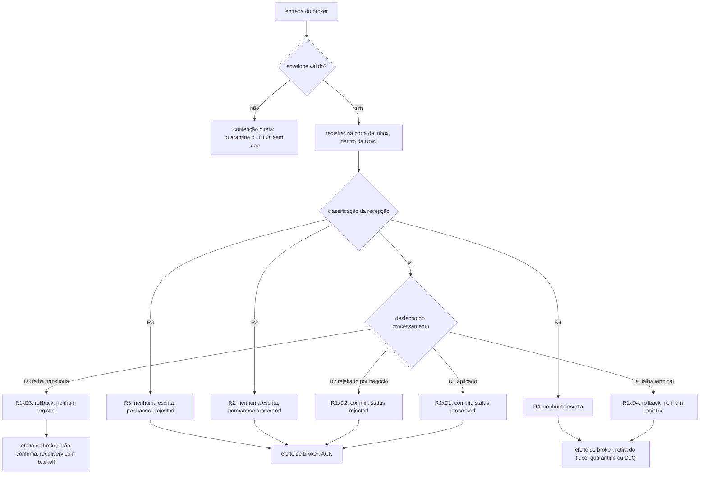

# Guia prático: começar uma implementação DMPF

Guia de **entrada** para quem vai construir um bounded context sobre o kernel
`DMPF` (Domain-and-Message Platform Foundation) deste workspace. Responde a
«por onde eu começo?», «o que preciso levantar antes da primeira linha?» e
«como as peças se encaixam?».

> **Não é normativo.** A norma mora em `docs/dmpf/`, e cada obrigação aqui
> aponta para o artefato e o ID que a definem. Quando este texto divergir da
> fonte, a fonte vence. Nenhum ID novo é criado aqui, e nenhum limiar numérico é
> inventado.

**Para quem é:** quem vai escrever ou revisar um bounded context Go no monorepo.
Pressupõe [`AGENTS.md`](../../AGENTS.md) e o
[workflow de desenvolvimento](./development-workflow.md). **O que não cobre:** o
rito do manifesto e do baseline, no [guia do `dmpf-units.json`](./dmpf-manifesto.md);
o setup da máquina, no [onboarding](../onboarding.md); e a norma em si, cujo mapa
de busca é a [navegação do acervo](../dmpf/navegacao.md).

## Índice

1. [Antes de começar](#1-antes-de-começar)
2. [O levantamento](#2-o-levantamento-o-que-descobrir-antes-de-codificar)
3. [Primeiros passos, em ordem executável](#3-primeiros-passos-em-ordem-executável)
4. [Arquitetura: os seis blocos](#4-arquitetura-os-seis-blocos)
5. [Os elementos do motor](#5-os-elementos-do-motor)
6. [Exemplo didático: cinco contextos](#6-exemplo-didático-cinco-contextos)
7. [Os três papéis: `api`, `relay`, `consumer`](#7-os-três-papéis-api-relay-consumer)
8. [Checklist final](#8-checklist-final)
9. [Fontes normativas](#9-fontes-normativas)

---

## 1. Antes de começar

### 1.1 Convenções de leitura

Todo identificador de regra tem a forma `PREFIXO-NN`, e o prefixo diz o
documento dono — `OBX-12` é de FND-04, `ENV-08` é de FND-05. A tabela de
prefixos está em [`navegacao.md`](../dmpf/navegacao.md#por-prefixo). Cite por
seção e por ID (`FND-04 §6.4`, `INB-08`), nunca por `arquivo:linha`. Os quatro
constraints **P0** da RFC não são relaxáveis por sub-spec nem por decisão de
contexto (RFC §2.3, §4, §6, §7):

| P0 | O que fixa |
| --- | --- |
| `P0-1` | Domínio sem I/O — nada de Protobuf, ORM, broker, SDK, HTTP, logger ou tracing |
| `P0-2` | Protobuf **apenas** no wire, nunca como modelo interno |
| `P0-3` | *At-least-once* com efeitos idempotentes; **nunca** *exactly-once* ponta a ponta |
| `P0-4` | A RFC é norma; kernels e providers de produção ficam fora dela |

### 1.2 Pré-requisitos técnicos

| Item | Onde está |
| --- | --- |
| Toolchain Go, Node, pnpm e Nx | [`AGENTS.md`](../../AGENTS.md), seção *Tooling* |
| Ambiente local (Postgres, Redpanda, observabilidade) | [`infra/README.md`](../../infra/README.md) |
| Setup da máquina e primeiro PR | [`docs/onboarding.md`](../onboarding.md) |
| Verificador de conformidade rodando local | [`dmpf-manifesto.md`](./dmpf-manifesto.md) |

O kernel que você vai consumir já existe — do `domain` ao
`testkit`, com inventário em [`AGENTS.md`](../../AGENTS.md), seção
*Libs*.

### 1.3 Pré-requisitos de processo

`RDY-01` diz que «Ready» é **estado verificado**, não declaração de documento.
Dos sete itens da *definition of ready* (FND-10 §7.1), quatro você resolve
escrevendo a spec — problema e resultado esperado (D1), decisões da RFC e ADRs
relacionadas (D2), dependências e artefatos de entrada (D4), critérios de aceite
verificáveis (D5). Owner e reviewers (D3) e estimativa (D7) são ato de terceiro;
D6 — não depender de decisão estrutural sem owner — é condicional (`RDY-02`).
Escreva a spec em [`docs/specs/`](../specs/README.md) antes de gerar módulo, e
resolva D2 lendo os ADRs que o contexto toca ([seção 9](#9-fontes-normativas)).

---

## 2. O levantamento: o que descobrir antes de codificar

Perguntas que, respondidas, tornam o código quase mecânico. Responda **por
bounded context**, nunca para o sistema inteiro de uma vez.

### 2.1 Atores, operações e agregado

| Pergunta | O que a resposta decide | Fonte |
| --- | --- | --- |
| Quem inicia cada operação? | Se `tenantid` é obrigatório ou **ausente** — nunca vazio nem `default` | `ENV-12` |
| Quais operações são escrita e quais são query? | Query não abre UoW de escrita nem grava outbox | `UOW-11` |
| Qual é o canal de entrada? | REST na borda, gRPC interno, ou consumo de mensagem | FND-06 §9–§12 |
| Qual é o agregado raiz e a sua **chave estável**? | A idempotência de efeito no consumo opera sobre chave natural do fato, não sobre o `message_id` | FND-04 §4.1, §7.2 |
| Quais invariantes o agregado protege? | Invariante é `domain`; validação de formato é `app` | RFC §4.6 |
| Quais são os estados e as transições? | Estado que só existe «enquanto processa» é sintoma: a inbox removeu `processing` porque a transação única não deixa meio-termo observável | `INB-02` |
| Quais são as UPRs e as rejeições de cada uma? | UPR é função determinística, sem estado retido, sem I/O: relógio, aleatoriedade e dados chegam como valor. Rejeição tem código estável `contexto/motivo`, não carrega status de protocolo, e sob `Rejected` nada muda e nada é emitido | `UPR-I01`..`I12`, `DEC-03`, `DEC-09`..`DEC-11` |

### 2.2 Dados, identidade e contexto

- Classificação de dado é de FND-07, prefixo `DAT`, e decide o que entra em log,
  em `metadata` da outbox e em `last_error`. `metadata` não carrega dado
  sensível, credencial nem segredo (`OBX-02`); `last_error` guarda diagnóstico
  **sanitizado** (`OBX-03`), porque a tabela é lida por operação.
- Sujeito autenticado e tenant **nunca** vêm de campo da entrada; divergência com
  o valor resolvido recusa a requisição (`CTX-06`).
- O contexto de execução tem **nove** campos — `request_id`, `correlation_id`,
  `causation_id`, `trace_context`, `authenticated_subject`, `tenant_id`,
  `permissions`, `deadline`, `locale` (`CTX-01`) —, com tipo declarado no `port`,
  instância montada no `app` (`CTX-02`) e chegada ao service como argumento
  explícito (`CTX-03`).

### 2.3 Contratos, eventos e consumidores

- Cada evento publicado tem um `.proto` cujo caminho espelha o pacote:
  `proto/<org>/<bounded_context>/<categoria>/<major>/<arquivo>.proto` (`REP-01`).
  O gerado vive em `gen/<stack>/` e **nunca** é editado à mão (`REP-02`). O nome
  é no passado, sem versão, sem transporte, na linguagem ubíqua do contexto
  (`MSG-N01`..`MSG-N04`).
- Todo canal assíncrono é **catalogado** antes de o provider operá-lo (`ASY-01`),
  com os sete itens de `ASY-02`: endereço concreto e transporte; tipo de evento e
  major do contrato; chave de ordenação (ou a declaração de que não há ordem);
  unidade de ordenação; `janela_redelivery` e a sua fórmula; destino de
  contenção; estratégia de retry e o seu efeito sobre a ordem. Um canal lógico
  tem **um** transporte por vez (`COE-01`).
- `consumer_name` é identidade **lógica e estável**: não é hostname, não é ID de
  instância, não muda em deploy nem em escala horizontal. A chave de
  deduplicação é `(consumer_name, message_id)`, com unicidade no schema
  (`INB-01`).

### 2.4 Prazos, resiliência e limiares

- Prazo de saída é o orçamento herdado menos a folga operacional (FND-08 §4), e
  retry só acontece sob a **conjunção** de `RES-27`: (1) erro classificado como
  retentável; (2) operação idempotente, ou efeito conhecidamente ausente na
  tentativa que falhou; (3) orçamento suficiente para a tentativa **e** para o
  backoff; (4) prazo remanescente suficiente para os dois. Retryability isolada
  não autoriza repetição (`RES-28`), e o indeterminado resolve para «não
  retentável» (`RES-29`).
- Borda exposta a chamador não controlado tem admissão por rota e por tenant,
  antes de decode e validação (`RES-16`), com recusa categorizada e observável
  (`RES-17`). Erro é sempre amostrado no tracing (`TRC-14`), e o relay expõe
  `pending`, `lag`, `attempts` e `failures` (`OBX-12`).
- Retenção da inbox: `retenção_inbox ≥ janela_redelivery` (`INB-14`). É a única
  invariante de retenção do mecanismo; a outbox não tem análoga, e a assimetria é
  deliberada (FND-04 §4.3).
- **Limiares.** `MET-05` diz que limiar é condicional — derivado de invariante
  onde possível, parâmetro local onde não — e `THR-01`..`THR-03` declaram o que a
  fundação não normatiza. Declare os seus valores (intervalo de scan, lote,
  lease, teto de tentativas, janela de redelivery) na configuração e na
  catalogação do canal. Nenhum valor concreto aparece neste guia de propósito.

### 2.5 Testes

A pirâmide tem **exatamente cinco camadas** — domínio, services, providers, apps
e fluxos distribuídos —, e todo teste pertence a exatamente uma, decidida pelo
escopo e nunca pelo diretório nem pelo bloco do SUT (`PIR-01`, `PIR-02`). A
camada de domínio não admite infraestrutura (`PIR-04`) nem duplo de teste
(`ORA-36`). O pipeline roda em estágios ordenados com gate por estágio
(`KIT-09`), herda de FND-05 os gates de contrato (`KIT-10`) e põe a camada
distribuída em pipeline separado (`KIT-11`). O instrumento pronto é o
[`testkit`](../../libs/backend/go/testkit/README.md), com roteiro na
skill [`testkit`](../../.agents/skills/dmpf-testkit/SKILL.md). Insumos de QA
(fixture de projeção e handoff): [playbook](./dmpf-qa-playbook.md) e
[workshop `orders`/`reservations`](./dmpf-qa-workshop-orders-reservations.md).

---

## 3. Primeiros passos, em ordem executável

Contrato e manifesto antes de código, domínio antes de infraestrutura,
composition root por último.

**1 — escreva a spec.** Em [`docs/specs/`](../specs/README.md): agregado, chave
estável, estados, UPRs, rejeições, eventos publicados e consumidos, critérios de
aceite. O QA versiona o aceite como fixture — [playbook](./dmpf-qa-playbook.md).

**2 — gere o esqueleto.** Um módulo Go por contexto em `apps/backend/<name>`,
um package por bloco, já com tags, `dmpf-units.json` e entrada no `go.work`:

```bash
pnpm nx g @mateusmacedo/dmpf-plugin:bounded-context ordering \
  --bounded-context ordering \
  --dry-run
```

Rode primeiro com `--dry-run`. O bloco `contract` fica **fora**: a fonte vive em
`contracts/` pelo rito Buf ([opções](../../tools/dmpf-plugin/README.md)).

**3 — classifique, em commit próprio.** Unidade nova é ato de classificação:
regrave o baseline e commite **só** o baseline, separado do código, aprovado por
revisor distinto do autor. Misturar os dois emite `DMPF-T002`; divergência entre
manifesto e baseline emite `DMPF-T001`.

```bash
go run ./tools/dmpf-conformance/cmd/conformance --root . --write-baseline
```

**4 — escreva o contrato.** Um `.proto` por evento publicado, no caminho de
`REP-01`, e os gates antes de qualquer consumidor
([`contracts/README.md`](../../contracts/README.md)):

```bash
pnpm nx run contracts:buf-lint
pnpm nx run contracts:buf-generate-check
NX_BASE=develop pnpm nx run contracts:buf-breaking
```

**5 a 10 — escreva o código, de dentro para fora.** A ordem importa porque cada
passo fecha as decisões do seguinte:

- **5, domínio:** agregado, estados, UPRs e rejeições, com testes em memória.
  Nada de porta, relógio, banco ou log — `domain` só admite capability `pure`, e
  **`domain` não importa `port`**, sem condicional e sem exceção (ADR-014).
- **6, portas:** só o que o caso de uso precisa e o kernel não oferece.
  `ports` já traz `UnitOfWork[R]`, `Repository`, `Reader`, `Outbox`,
  `Clock`, `IDGenerator`, `Instrumentation`, `Acknowledger`, `Containment` e a
  porta de inbox.
- **7, application service:** a sequência canônica de escrita (FND-04 §3.2,
  detalhada em [7.1](#71-modo-api)).
- **8, provider:** repositório com *optimistic locking*, mapeador do agregado e
  mapeador da outbox, com mapeamento e serialização dentro da transação
  (ADR-021).
- **9, consumo:** consumer adapter e service de consumo, se o contexto consome
  algo (FND-04 §6.3, detalhada em [7.3](#73-modo-consumer)).
- **10, composição:** a composition root é a única unidade que instancia provider
  concreto (ADR-015); use
  [`apps/backend/reservations`](../../apps/backend/reservations/README.md)
  como referência de forma, não como código a copiar.

**11 — valide.** A cadeia por módulo é a de [`AGENTS.md`](../../AGENTS.md), e é a
mesma que o [checklist](#8-checklist-final) cobra:

```bash
pnpm nx run <modulo>:fmt-check
pnpm nx run <modulo>:vet
pnpm nx run <modulo>:lint
pnpm nx run <modulo>:build
pnpm nx run <modulo>:test-race
pnpm nx run <modulo>:govulncheck
go run ./tools/dmpf-conformance/cmd/conformance --root .
```

O `govulncheck` roda sem cache porque consulta base remota — é o passo mais
lento da cadeia, e por isso costuma ser o último, mas não é opcional.

---

## 4. Arquitetura: os seis blocos

### 4.1 A classificação é total

Todo arquivo de produção pertence a **exatamente um** dos seis blocos (RFC §4),
e a classificação é **declarada** no `dmpf-units.json`, nunca inferida de
diretório (ADR-012).

| Bloco | Responsabilidade | Capabilities |
| --- | --- | --- |
| `domain` | Estado, invariantes, decisões, UPRs | só `pure` |
| `port` | Capacidade requerida, declarada pelo consumidor | só `pure` |
| `application` | Orquestração: sequência, autorização, transação, persistência por porta | `pure` e observabilidade |
| `provider` | Realização de porta com tecnologia concreta | qualquer, restrita à porta |
| `contract` | Wire versionado: schemas, tipos gerados, envelope | `pure` e `wire.codec` |
| `app` | Adapter de protocolo e composition root | qualquer |

Telemetria **nunca** entra em `domain` nem em `port`, ainda que a biblioteca
seja tecnicamente pura (RFC §6.2).

### 4.2 A regra de dependência

Uma aresta é permitida quando satisfaz **duas** condições cumulativas (RFC §7):

- **C1 — bloco.** A matriz 6×6.
- **C2 — contexto.** `same_bounded_context`, **ou** o predicado
  `public_integration_surface(destino)`, satisfeito de duas formas: o destino é
  um `contract package`, **ou** declara `public_integration_surface: true` no
  próprio manifesto.

Declarar `public_integration_surface: true` em unidade `domain` é inválido e
emite `DMPF-M002` — logo, `domain → domain` entre contextos é **sempre**
proibida. A designação de **shared kernel** estende C2 e é o que torna o kernel
consumível como SDK: vive no baseline, não no manifesto, e libera **apenas o
destino** — a unidade designada não ganha licença para importar de fora do
próprio contexto (ADR-042).



Toda aresta **entre blocos distintos** que não aparece no diagrama é proibida por
C1; as relações **reflexivas** — um bloco dependendo de outra unidade do mesmo
bloco — ficaram de fora do desenho por outro motivo: elas não são recusadas por
C1, e o que decide cada uma é C2 — como no `domain → domain` acima.

Duas arestas proibidas explicam a topologia dos módulos do kernel:
`application → contract` (célula 12) e `provider → application` (célula 26). É
por elas que o consumer adapter — que precisa decodificar o envelope **e**
invocar o caso de uso — vive num módulo `app` próprio.

### 4.3 A outbox atravessa três blocos

É o caso que mais tensiona a matriz, e a norma o resolve partindo a
responsabilidade — de modo que `application → provider` continua proibida e a
célula 11 permanece sem exceção:

| O quê | Bloco | Por quê |
| --- | --- | --- |
| **Escrita** na mesma transação | `application` | é parte do caso de uso, e é feita **por porta** (`BLK-01`) |
| **Persistência**, mapeamento e serialização | `provider` | é tecnologia (`BLK-03`) |
| **Drenagem** e publicação | `app` (relay) | é processo próprio, com lifecycle próprio (`BLK-02`) |

### 4.4 O manifesto

Cada módulo com produção carrega um `dmpf-units.json` na raiz; sem ele o
verificador emite `DMPF-U004` e **encerra**. Os quatro campos obrigatórios por
unidade são `id`, `block`, `bounded_context` e `include` — e `include` enumera
**import paths exatos**, não subárvores.

Os dezesseis diagnósticos estáveis se agrupam em cinco faixas: `DMPF-U001`..
`U004` para a unidade (cobertura, sobreposição, chave, manifesto ausente),
`DMPF-M001`..`M004` para o manifesto (campo obrigatório, valor, duplicidade,
designação), `DMPF-T001`..`T002` para o baseline (divergência, autorização),
`DMPF-D001`..`D002` para a dependência (C1 e C2) e `DMPF-E001`..`E004` para os
externals. O guia completo — `external[]`, `exceptions[]` e o rito de mudança de
classificação — é [`dmpf-manifesto.md`](./dmpf-manifesto.md).

### 4.5 A composition root

É o único lugar onde instanciar provider concreto é permissivo (ADR-015). Duas
consequências práticas: **nenhum default silencioso** — o kernel expõe
`NoInstrumentation()` e `AllowAll[C]()` para que «não observar» e «não
autorizar» sejam escolha explícita da raiz — e **configuração validada na
partida, por papel**, de modo que um processo mal configurado recusa subir em vez
de descobrir o problema no primeiro scan.

---

## 5. Os elementos do motor

Mapa de cada conceito da norma ao que já existe no kernel Go. O trecho abaixo é
**ilustrativo**: mostra a forma da API, não é recorte compilável.

### 5.1 Desfecho: `Decision` e `Outcome`

A UPR recebe tudo pronto e devolve o desfecho como par — o ramo de aceite por
valor, a rejeição como ponteiro:

```go
// Ilustrativo: a forma do desfecho, não um recorte compilável.
func (o *Order) Confirm(cmd ConfirmOrder, now Instant) (domain.Accepted[Confirmation], *domain.Rejection)
```

`Accepted[R]` carrega a resposta de domínio e a **sequência ordenada e fechada**
de eventos, copiada na construção (`DEC-05`..`DEC-08`, `DEC-13`); `Rejection`
carrega código estável `contexto/motivo`, mensagem em termos de domínio e
detalhes, e é imutável (`DEC-09`, `DEC-12`). O *porquê* do par está em
[ADR-032](../adr/032-realizacao-go-do-desfecho-da-upr.md).

Uma camada acima, o application service devolve `(Outcome[R], error)`: a
**rejeição de negócio viaja no `Outcome`, com `error == nil`**, e `error`
carrega só falha técnica. Confundir os dois faz recusa legítima parecer
indisponibilidade (`DEC-04`, [ADR-018](../adr/018-forma-do-desfecho-da-upr.md)).
A falha técnica chega **classificada**: `Failure` transporta uma das onze
categorias de FND-07 §5.3 e a retryability já resolvida em booleano no ponto da
classificação (`ERR-09`, `MAP-07`).

### 5.2 Unit of Work e repositório

`UnitOfWork[R]` é a fronteira de aplicação, genérica sobre o conjunto de
recursos `R` que o caso de uso declara. As portas transacionais chegam ao
callback **por `R`** — não pelo `context.Context` (`CTX-05`) e não por *lookup*
por nome (`UOW-03`). Das seis cláusulas de FND-04 §3.1–§3.3, a que mais pega
implementação é `UOW-09`: o callback é invocado **exatamente uma vez** e nunca
repetido, então retry não pertence à fronteira. As outras cinco cobrem contexto
já cancelado, retorno `nil`, retorno com erro, erro de commit e panic.

O repositório escreve com *optimistic locking*: `Save` grava como versão
`esperada+1` se, e somente se, a versão armazenada for a esperada; divergência
devolve conflito e **não escreve nada**. Retry de conflito é política explícita
do caso de uso, só para operação comprovadamente idempotente (`UOW-10`).

### 5.3 Outbox e inbox

A escrita entrega a **intenção de publicar** à porta, dentro da mesma transação
do estado (`UOW-07`). O que o service escreve é vocabulário de negócio:
identidade da mensagem, instante do fato, destino **lógico**, chave de partição,
origem no agregado e o evento. Tópico, ARN e endereço de broker não aparecem —
escolher o alvo físico é do provider e do relay (`BLK-04`). O registro nasce
elegível ao claim, com `status = pending` (`OBX-05`); os quatro estados e o
ciclo de drenagem estão em [7.2](#72-modo-relay).

Do outro lado, a recepção é classificada pela porta de inbox **dentro** da
transação, em sete disposições que [7.3](#73-modo-consumer) detalha. Aqui basta
guardar três coisas: a fronteira entre falha transitória e terminal é decidida
pela **classificação do erro**, não por inspeção ad hoc (`INB-09`); o status
admite exatamente `processed` e `rejected`, ambos terminais (`INB-02`), e a
tabela só contém processamento que commitou (`INB-03`); e a reentrega de uma
mensagem já rejeitada **não** reemite o rejection event (`INB-12`), porque o
aviso já está na outbox da primeira recepção e reemitir criaria um `message_id`
novo que o consumidor a jusante não deduplicaria.

### 5.4 Envelope e `payload_hash`

O envelope é o perfil DMPF do CloudEvents em Protobuf: quinze atributos de
`ENV-08`, modalidade `proto_data` apenas, atributo condicional representado por
ausência e nunca por valor de preenchimento (`ENV-12`), e conformidade
verificável **sem** desserializar o payload e **sem** acesso a rede (`ENV-13`).

O `payload_hash` separa reentrega legítima (R2, R3) de reutilização indevida do
identificador (R4), e tem duas propriedades obrigatórias (`INB-13`). **H1 —
estável sob serializações equivalentes:** sem ela, redelivery legítima vira R4 e
o efeito nunca se aplica. **H2 — restrito ao conteúdo de negócio:** metadados de
transporte, tracing e contador de tentativa ficam fora; sem ela, toda reentrega
tem hash diferente, R4 dispara sempre, e a deduplicação existe sem funcionar. A
realização toma os bytes do `Any` exatamente como transportados, porque
reserializar não satisfaz a propriedade (`ENV-18`).

### 5.5 Relay, consumer adapter e transportes

O **relay** e o **consumer adapter** são as duas pontas do trânsito, e
[7.2](#72-modo-relay) e [7.3](#73-modo-consumer) descrevem os seus ciclos. Duas
regras deles pertencem a esta seção porque restringem o que você escreve no
provider: o relay **não interpreta o payload** — se o registro existe, a decisão
já foi tomada no caso de uso (`OBX-14`) —, e a contenção preserva os bytes.
`GAR-07` exige preservar informação suficiente para um replay conforme, e
`ENV-24` fixa o critério: os bytes de `Any.value` contidos são **exatamente** os
publicados; truncar, reserializar, reordenar campos ou normalizar valores
desqualifica o replay.

| Transporte | Papel na norma |
| --- | --- |
| REST/JSON | borda externa (FND-06 §9); rota exige referência ao contrato publicado (`RST-04`) |
| gRPC | chamada síncrona interna (§10); prazo derivado do prazo de quem chama |
| Kafka | transporte-alvo do evento de domínio (§11); commit só do prefixo contíguo (`TRP-29`) |
| SNS/SQS | transporte normatizado do acervo (§12); Base64 aplicado **uma única vez** (`TRP-19`) |

Os quatro compartilham as primitivas de `transport`: orçamento de prazo,
catálogo de canal, metadado de tentativa, admissão e as três posições de
observabilidade de `RES-23`.

### 5.6 Contexto, observabilidade e instrumentos de prova

`CTX-11` exige que cada travessia de fronteira resolva, para **cada um dos nove
campos**, exatamente uma das quatro ações da matriz. Sujeito e permissões não
atravessam o *fan-out* como valor do contexto: a identidade com que este serviço
chama outro é a sua própria, e a do sujeito original é proveniência (`CTX-12`).
`observability` realiza FND-08 sobre OpenTelemetry
([ADR-037](../adr/037-observabilidade-otel-e-retry-por-conjuncao-em-go.md)).

Para provar o que você escreveu, **`testkit`** tem um kit por camada —
`domainkit`, `golden`, `serviceskit`, `providerkit` e `fitness` —, todos
devolvendo veredicto por valor
([README do módulo](../../libs/backend/go/testkit/README.md)); os harnesses
borda a borda e distribuído (`appkit`, `distkit`) são do contexto que os
exercita, em `apps/backend/reservations`. E
**`conformance`** é o gate *fail-closed* sobre o grafo real de imports:
exit 0 é aprovação, exit 1 é reprovação, exit 2 é falha de execução — que
**nunca** pode ser lida como conformidade.

---

## 6. Exemplo didático: cinco contextos

Exemplo **didático**, que não existe no código: serve para mostrar como cinco
contextos autônomos colaboram sem que nenhum importe o domínio do outro. Os
contextos de referência que existem no repositório — `orders` e `reservations`,
em `apps/backend` — são referência **técnica** do kernel, não modelagem a
copiar.

Os cinco são `ordering`, `payment`, `preparation`, `collection` e `delivery`.
Cada um é dono do próprio agregado, da própria inbox e da própria outbox: quem
escreve nessas tabelas é o caso de uso daquele contexto, e nenhum outro. **Onde
elas moram fisicamente** — instância, schema ou banco separados — é decisão de
contexto, que a fundação não fixa. A única coisa que atravessa a fronteira é o
evento publicado, pelo contrato versionado.

### 6.1 Mapa dos contextos



Nenhuma seta é import: cada uma é um canal lógico catalogado, com contrato
próprio (`ASY-01`, `ASY-02`). O exemplo satisfaz C2 pelo caminho do **`contract
package`**, que é a forma adotada aqui e não a única possível — C2 também é
satisfeita por `same_bounded_context`, por unidade que declare
`public_integration_surface: true` num bloco em que isso seja válido, e, no caso
do kernel, pela designação de shared kernel no baseline. A escolha é deliberada:
o contrato é o caminho que **nenhuma** unidade `domain` poderia tomar.

O mapa cobre só os cinco contextos, mas há um sexto consumidor no exemplo:
`payment` publica `PaymentAuthorizationRequested` e `PaymentReversalRequested`
para o **adquirente**, um sistema externo. Ele não aparece aqui por não ser
contexto do exemplo, e o fato de o canal atravessar a fronteira da organização
não muda nada — o contrato é publicado do mesmo jeito e o consumidor é declarado
do mesmo jeito (`REP-04`).

### 6.2 `ordering` — o pedido

| Aspecto | Valor |
| --- | --- |
| Agregado raiz | `Order` |
| Chave estável | `order_id`, gerado na confirmação e imutável |
| Estados | `draft`, `confirmed`, `in_fulfillment`, `completed`, `cancelled` |
| UPRs | `Confirm`, `RecordFulfillment`, `Cancel` |
| Rejeições | `ordering/empty-order`, `ordering/already-confirmed`, `ordering/fact-already-recorded`, `ordering/order-not-open`, `ordering/already-cancelled` |
| Publica | `OrderConfirmed`, `OrderCompleted`, `OrderCancelled` |
| Consome | `PaymentAuthorized`, `PaymentDeclined`, `PreparationDiscarded`, `CollectionMissed`, `DeliveryCompleted`, `DeliveryReturned`, `DeliveryRefused` |
| Papéis | `api` (borda REST do cliente), `relay`, `consumer` |

É onde a cadeia de causação **nasce**: a confirmação vem de requisição
autenticada, e é ali que `tenantid` é resolvido pela autenticação (`CTX-06`,
`ENV-12`); os contextos seguintes recebem esse valor no envelope e o propagam,
sem redecidir. `Cancel` é acionado por cinco eventos distintos, e quando dois
chegam — digamos `PaymentDeclined` e, mais tarde, `CollectionMissed` — o segundo
é recusado com `ordering/already-cancelled` e cai em `R1×D2`. A inbox não ajuda
aqui, porque são mensagens diferentes com `message_id` diferentes: quem fecha o
caso é a rejeição de domínio, e é por isso que ela precisa existir.

**`RecordFulfillment` é a UPR que não pode presumir ordem.** `PaymentAuthorized`
e `DeliveryCompleted` vêm de produtores diferentes, por canais diferentes: não
existe ordenação global entre eles, e a garantia de ordem que o transporte
oferece é por unidade de ordenação de **um** canal (`ASY-02`), nunca entre dois.
Uma UPR `Complete` que exigisse o pedido já em `in_fulfillment` travaria o fluxo
sempre que a entrega chegasse antes da autorização. A modelagem tolerante é
registrar cada fato de forma independente: `RecordFulfillment` recebe **qual
fato** ocorreu como valor, leva o pedido a `in_fulfillment` no primeiro deles e a
`completed` no segundo, em qualquer ordem — publicando `OrderCompleted` só no
segundo. O mesmo fato repetido é recusado com `ordering/fact-already-recorded`,
o que torna a UPR idempotente por fato e não por mensagem.

### 6.3 `payment` — o pagamento

| Aspecto | Valor |
| --- | --- |
| Agregado raiz | `Payment` |
| Chave estável | a referência do pedido recebida no contrato — chave natural permanente, e é ela que torna o consumo idempotente |
| Estados | `requested`, `authorized`, `declined`, `cancelled`, `reversal_requested`, `reversed` |
| UPRs | `Request`, `Settle`, `Cancel`, `RequestReversal`, `ConfirmReversal` |
| Rejeições | `payment/instrument-invalid`, `payment/already-requested`, `payment/already-settled`, `payment/nothing-to-reverse`, `payment/not-cancellable`, `payment/reversal-not-pending` |
| Publica | `PaymentAuthorizationRequested`, `PaymentAuthorized`, `PaymentDeclined`, `PaymentReversalRequested`, `PaymentReversed` |
| Consome | `OrderConfirmed`, `OrderCancelled` |
| Papéis | `api` (callbacks do adquirente), `relay`, `consumer` |

> O exemplo modela **apenas a autorização**. Captura, liquidação e reembolso não
> aparecem: desfazer uma autorização é uma **reversão**, não um estorno de valor
> movimentado.

`payment` é o contexto que mais ensina, porque é o único que precisa falar com um
sistema **fora** do exemplo: o adquirente. A inbox deduplica escritas na transação
local e nada além disso — efeito externo não é coberto por ela. Uma chamada ao
adquirente feita durante o consumo de `OrderConfirmed` aconteceria antes de a
recepção estar deduplicada e persistida, e seria repetida a cada redelivery e a
cada rollback, autorizando duas vezes.

A saída é não fazer chamada nenhuma. O consumo de `OrderConfirmed` executa
`Request`, que leva o pagamento a `requested` e grava
`PaymentAuthorizationRequested` na outbox — estado e intenção de publicar na mesma
transação (`UOW-07`), sem tocar na rede (`UOW-08`). O relay publica, como publica
qualquer outro evento. O adquirente é um **consumidor externo desse contrato**,
como qualquer outro consumidor declarado (`REP-04`), e devolve o parecer pela
borda `api` do próprio `payment`. São os mesmos três papéis, o mesmo outbox e o
mesmo relay dos outros quatro contextos; o que muda é só quem está do outro lado
do canal.

#### A chave de idempotência da intenção

O payload de `PaymentAuthorizationRequested` carrega um
**`authorization_request_id`**: identificador estável da *intenção de autorizar*,
derivado da chave estável do agregado e cunhado uma única vez, no commit de
`Request`. O contrato com o adquirente **exige** deduplicação por ele — a mesma
`authorization_request_id` recebida duas vezes produz no máximo uma autorização.
Sem essa cláusula, `P0-3` garante *at-least-once* e o resultado é autorização
duplicada, porque redelivery é normal e não é erro.

Essa chave não se confunde com o `message_id`:

| | `message_id` | `authorization_request_id` |
| --- | --- | --- |
| Onde vive | atributo do envelope (`ENV-08`) | campo do payload, no contrato |
| O que identifica | **a mensagem** — o mesmo valor em todas as reentregas dela | **a intenção de negócio** — o mesmo valor ainda que ela vá ao ar em outra mensagem |
| Quem deduplica | a inbox de um consumidor DMPF, por `(consumer_name, message_id)` (`INB-01`) | o adquirente, por cláusula de contrato |
| Entra no `payload_hash`? | não — é metadado de transporte, excluído por H2 (`INB-13`) | sim — é conteúdo de negócio |

O adquirente **recebe o envelope inteiro**, conforme o canal e o contrato
declarados (`ASY-02`, `COE-01`): o `message_id` chega até ele. O que ele não pode
é deduplicar o **efeito de negócio** por esse campo, e por dois motivos.

O primeiro é de alcance. `message_id` identifica a mensagem e cobre a reentrega
dela, mas não a **reemissão**: um registro de outbox que terminou em `failed` é
terminal (`OBX-06`), e a retomada por operação não o traz de volta — a mesma
intenção de autorizar volta ao ar em mensagem nova, com `message_id` novo. Dedup
por `message_id` deixaria essa segunda autorização passar; dedup por
`authorization_request_id` não.

O segundo é de fronteira. `(consumer_name, message_id)` é o mecanismo de inbox de
um consumidor DMPF, e o contrato não pode presumir que quem está do outro lado da
organização implemente um. A chave da intenção resolve os dois casos porque está
onde a obrigação é contratável: no payload, coberta pelo `payload_hash`, falando
do efeito e não do trânsito.

As duas saídas de `Settle` são **aceite**, porque as duas são fatos do domínio e
produzem evento. Recusa do meio de pagamento não é `Rejected`; `Rejected` é o que
não persiste nada e não enfileira evento de domínio (`UOW-05`, `DEC-11`), como
`payment/already-settled` — a rejeição que absorve o callback repetido, já que
`Settle` só age sobre pagamento cujo parecer ainda não foi registrado.

#### Cancelamento, corrida e compensação

Desfazer o que já foi autorizado é **compensação**, e compensação com sistema
externo tem a mesma forma da autorização: intenção persistida, evento publicado,
conclusão por callback. Por isso a reversão tem dois estados, e não um.

- **`OrderCancelled` com o pagamento em `requested`:** `Cancel` leva a
  `cancelled`, sem evento. Não há autorização para reverter.
- **`OrderCancelled` com o pagamento em `authorized`:** `RequestReversal` leva a
  `reversal_requested` e publica `PaymentReversalRequested`, com um
  **`reversal_request_id`** estável sob a mesma regra da chave de autorização. O
  adquirente consome idempotentemente por ela e, concluída a reversão, chama de
  volta a borda `api`; `ConfirmReversal` registra `reversed` e publica
  `PaymentReversed`. Enquanto o callback não chega, o pagamento fica em
  `reversal_requested` — estado que existe justamente para tornar a compensação
  pendente **observável**, em vez de otimista.
- **Callback favorável de autorização chegando depois do cancelamento:** é a
  corrida real, porque o adquirente recebeu a solicitação antes de o
  cancelamento existir. Recusar seria perder a autorização no ar. Em vez disso,
  `Settle` sobre `cancelled` **aceita**, registra a referência externa da
  autorização e leva o pagamento direto a `reversal_requested`, publicando
  `PaymentReversalRequested`. O que estava autorizado do lado de fora é
  reconciliado, não esquecido.
- **Callback desfavorável chegando depois do cancelamento:** aí não há nada a
  reverter, e a recusa é o desfecho correto — `payment/nothing-to-reverse`.

### 6.4 `preparation` — a preparação

| Aspecto | Valor |
| --- | --- |
| Agregado raiz | `PreparationOrder` |
| Chave estável | a referência do pedido recebida no contrato |
| Estados | `scheduled`, `ready`, `discarded` |
| UPRs | `Schedule`, `MarkReady`, `Discard` |
| Rejeições | `preparation/already-scheduled`, `preparation/already-ready`, `preparation/not-discardable` |
| Publica | `PreparationReady`, `PreparationDiscarded` |
| Consome | `PaymentAuthorized`, `OrderCancelled` |
| Papéis | `api` (painel de operação interno), `relay`, `consumer` |

`PaymentAuthorized` aciona `Schedule`, e só isso: a preparação entra na fila e
**nenhum evento é publicado**, porque agendar não interessa a outro contexto. Um
aceite sem evento é legítimo — a sequência de `Accepted` pode ser vazia
(`DEC-06`). `MarkReady` tem uma única porta de entrada, o painel do operador, e é
ela que publica `PreparationReady`.

### 6.5 `collection` — a coleta

| Aspecto | Valor |
| --- | --- |
| Agregado raiz | `Collection` |
| Chave estável | a referência do pedido recebida no contrato |
| Estados | `awaiting`, `collected`, `missed`, `cancelled` |
| UPRs | `Open`, `Register`, `ReportMissed`, `Cancel` |
| Rejeições | `collection/already-open`, `collection/window-expired`, `collection/already-registered`, `collection/not-open` |
| Publica | `CollectionRegistered`, `CollectionMissed` |
| Consome | `PreparationReady`, `OrderCancelled` |
| Papéis | `api` (painel do operador de coleta), `relay`, `consumer` |

### 6.6 `delivery` — a entrega

| Aspecto | Valor |
| --- | --- |
| Agregado raiz | `Delivery` |
| Chave estável | a referência do pedido recebida no contrato |
| Estados | `dispatched`, `delivered`, `returned`, `cancelled` |
| UPRs | `Dispatch`, `Complete`, `Return`, `Cancel` |
| Rejeições | `delivery/address-unreachable`, `delivery/already-dispatched`, `delivery/already-completed`, `delivery/not-cancellable` |
| Publica | `DeliveryCompleted`, `DeliveryReturned`, `DeliveryRefused` |
| Consome | `CollectionRegistered`, `OrderCancelled` |
| Papéis | `api` (webhook do parceiro logístico), `relay`, `consumer` |

Note o que **não** é rejeição aqui: «tentativas de entrega esgotadas» não
aparece na lista, porque contagem de tentativa é metadado de transporte e fica
fora do domínio — e fora do `payload_hash`, por H2 de `INB-13`.

### 6.7 Matriz entrada → UPR → estado → evento

Uma linha por caminho de execução dos cinco contextos, no **ramo de aceite**:
toda entrada tem UPR, toda UPR tem transição, e todo evento publicado tem
destino declarado — um consumidor, ou a declaração de que não há. O único evento
emitido em ramo de rejeição é `DeliveryRefused`, em
[6.8](#68-contratos-e-fluxo-ponta-a-ponta).

| Contexto | Entrada | UPR | Transição de estado | Evento publicado |
| --- | --- | --- | --- | --- |
| `ordering` | `POST` de confirmação (api) | `Confirm` | `draft` → `confirmed` | `OrderConfirmed` |
| `ordering` | `PaymentAuthorized` **ou** `DeliveryCompleted`, o que chegar primeiro | `RecordFulfillment` | `confirmed` → `in_fulfillment` | — |
| `ordering` | o segundo dos dois fatos, em qualquer ordem | `RecordFulfillment` | `in_fulfillment` → `completed` | `OrderCompleted` |
| `ordering` | cancelamento pelo cliente (api) | `Cancel` | `confirmed` → `cancelled` | `OrderCancelled` |
| `ordering` | `PaymentDeclined`, `PreparationDiscarded`, `CollectionMissed`, `DeliveryReturned`, `DeliveryRefused` | `Cancel` | qualquer não terminal → `cancelled` | `OrderCancelled` |
| `payment` | `OrderConfirmed` | `Request` | inexistente → `requested` | `PaymentAuthorizationRequested` |
| `payment` | callback de autorização, favorável (api) | `Settle` | `requested` → `authorized` | `PaymentAuthorized` |
| `payment` | callback de autorização, desfavorável (api) | `Settle` | `requested` → `declined` | `PaymentDeclined` |
| `payment` | `OrderCancelled`, pagamento em `requested` | `Cancel` | `requested` → `cancelled` | — |
| `payment` | `OrderCancelled`, pagamento em `authorized` | `RequestReversal` | `authorized` → `reversal_requested` | `PaymentReversalRequested` |
| `payment` | callback de autorização favorável, pagamento já em `cancelled` | `Settle` | `cancelled` → `reversal_requested` | `PaymentReversalRequested` |
| `payment` | callback de conclusão da reversão (api) | `ConfirmReversal` | `reversal_requested` → `reversed` | `PaymentReversed` |
| `preparation` | `PaymentAuthorized` | `Schedule` | inexistente → `scheduled` | — |
| `preparation` | painel do operador (api) | `MarkReady` | `scheduled` → `ready` | `PreparationReady` |
| `preparation` | `OrderCancelled` | `Discard` | `scheduled` → `discarded` | `PreparationDiscarded` |
| `collection` | `PreparationReady` | `Open` | inexistente → `awaiting` | — |
| `collection` | leitura do operador (api) | `Register` | `awaiting` → `collected` | `CollectionRegistered` |
| `collection` | janela vencida, painel (api) | `ReportMissed` | `awaiting` → `missed` | `CollectionMissed` |
| `collection` | `OrderCancelled` | `Cancel` | `awaiting` → `cancelled` | — |
| `delivery` | `CollectionRegistered` | `Dispatch` | inexistente → `dispatched` | — |
| `delivery` | webhook: entregue (api) | `Complete` | `dispatched` → `delivered` | `DeliveryCompleted` |
| `delivery` | webhook: devolvida (api) | `Return` | `dispatched` → `returned` | `DeliveryReturned` |
| `delivery` | `OrderCancelled` | `Cancel` | `dispatched` → `cancelled` | — |

Duas coisas que a matriz expõe. `OrderCompleted` e `PaymentReversed` são
publicados **sem consumidor** — existem para auditoria e para consumidores
futuros, e declarar isso é parte de `REP-04`, não uma lacuna. E cada transição
tem um estado de partida exigido, o que significa que a mesma entrada é aceita
ou recusada conforme onde o agregado esteja — o cancelamento não «volta atrás»
por conta própria: onde há efeito a desfazer, ele vira uma transição declarada,
como a reversão de `payment`.

Compensação, portanto, o exemplo modela — e só ela. `preparation`, `collection`
e `delivery` encerram sem desfazer o que já produziram, porque o exemplo não
modela reagendamento, nova tentativa de coleta nem redespacho; e `payment` para
na reversão da autorização, sem captura, liquidação ou reembolso. São recortes
do exemplo, não limites do DMPF: cada um deles seria mais estados e mais UPRs
nos mesmos cinco contextos.

### 6.8 Contratos e fluxo ponta a ponta

Cada evento publicado tem um `.proto` cujo caminho espelha o pacote (`REP-01`),
e o `type` do envelope segue a forma de `PTB-03`:

```text
contracts/proto/company/ordering/event/v1/order_confirmed.proto
  package company.ordering.event.v1;
  message OrderConfirmed { ... }
  # type do envelope: com.company.ordering.order-confirmed.v1
```

O mesmo padrão vale para `company.payment.event.v1`,
`company.preparation.event.v1`, `company.collection.event.v1` e
`company.delivery.event.v1`; o documento de canal referencia o contrato, nunca o
duplica (`ASY-03`). No caminho feliz abaixo, cada seta de evento é três coisas:
uma linha commitada na outbox do produtor, uma publicação do relay, e uma linha
na inbox do consumidor.



**Rejeição na borda.** O cliente confirma um pedido vazio. `Confirm` devolve
`Rejected` com `ordering/empty-order`, os passos 6 e 7 da sequência de escrita
**não ocorrem**, e o passo 8 commita uma transação sem efeito (`UOW-05`,
`UOW-06`). O cliente recebe a rejeição tipada, e nenhum dos outros quatro
contextos fica sabendo que houve tentativa.

**Cancelamento.** `payment` publica `PaymentDeclined`; `ordering` consome,
executa `Cancel`, chega a `cancelled` e publica `OrderCancelled`. A assimetria é
deliberada: `payment` não «avisa `preparation` para não começar» — ele publica o
fato, e os **quatro** consumidores decidem cada um por si, pelas transições da
matriz: `preparation` descarta com `Discard`, `collection` e `delivery` encerram
com `Cancel`, e `payment` ramifica pelo próprio estado — `Cancel` para
`cancelled` se ainda estava em `requested`, `RequestReversal` para
`reversal_requested` se já estava em `authorized`. Fora do estado que cada
transição exige, todos recusam: `preparation/not-discardable`,
`collection/not-open`, `delivery/not-cancellable` e `payment/not-cancellable`.

Duas consequências. Que `payment` consuma o `OrderCancelled` nascido do seu
próprio `PaymentDeclined` **não** é ciclo: o pagamento está `declined`, a UPR
recusa, e o fluxo para ali. E nenhuma dessas recusas é erro: cada uma é `R1×D2`,
commita com `status = rejected` e confirma.

Note que só `payment` fica com trabalho pendente depois do cancelamento. Os
outros três encerram na própria transação, porque o efeito deles é local; a
reversão atravessa a fronteira da organização e só termina quando o adquirente
responder. É a diferença entre desfazer estado e **compensar** um efeito
externo, e é o que justifica `reversal_requested` existir.

**Rejeição no consumo (`R1×D2`).** `delivery` consome `CollectionRegistered` para
um endereço permanentemente inservível. Isso é regra de negócio do contexto, não
falha técnica: `Dispatch` devolve `Rejected` com `delivery/address-unreachable`,
a transação **commita** com `status = rejected`, o adapter confirma (ACK), e o
caso de uso emite na mesma transação o rejection event `DeliveryRefused`, que
`ordering` consome para cancelar o pedido. Se a mensagem for reentregue depois, a
inbox a classifica `R3` e **não** reemite o evento (`INB-12`).

**Falha técnica terminal (`R1×D4`).** Caso distinto do anterior, e é o que
justifica a distinção existir. O provider de `delivery` falha ao reconstruir o
agregado a partir do registro persistido e devolve `Failure` de categoria
`Unexpected` com retryability resolvida em `false`. Repetir não muda o desfecho:
o consumo cai em `R1×D4`, a transação faz rollback — **nada** é gravado na inbox
— e o adapter retira a mensagem para quarentena, sem loop. A retomada é operação,
com evidência; insistir só produziria *poison message* bloqueando o consumo
(FND-04 §6.4, §7.4).

---

## 7. Os três papéis: `api`, `relay`, `consumer`

Três **processos distintos**, com ciclos de vida distintos, ainda que possam
compartilhar binário e imagem. A separação não é organizacional: `UOW-08` proíbe
que a sequência de escrita publique no broker, e `BLK-02` põe a drenagem num
bloco próprio.



### 7.1 Modo `api`

É a borda: autentica, valida formato, monta o contexto e invoca o service. A
admissão por rota e por tenant acontece **antes** de decode e validação
(`RES-16`), com recusa categorizada e observável (`RES-17`).

A sequência canônica de escrita tem **nove** passos (FND-04 §3.2):

```text
1. valida autorização    2. resolve tempo e identificadores   (fora da transação)
3. abre a UoW, recebendo as portas vinculadas à transação    ──┐
4. carrega ou cria o agregado                                  │
5. executa a UPR e recebe a Decision                           │  mesma
6. sob Accepted, persiste o agregado com optimistic locking    │  transação
7. sob Accepted, entrega o evento à porta da outbox            │
   Sob Rejected, 6 e 7 não ocorrem — mas 8 commita mesmo assim │
8. commit                                                    ──┘
9. devolve a response de aplicação — de aceite ou de rejeição
```

Três pontos decidem se a implementação é conforme. **Os passos 1 e 2 ficam fora
da transação**, porque uma reexecução cunharia identidade nova para o mesmo fato
(*rationale* de `UOW-09` e `UOW-10`). **O ramo do desfecho decide os passos 6 e
7**: sob `Rejected` nada persiste e nenhum evento de domínio é enfileirado, e
ainda assim o passo 8 **commita** — abortar a UoW faria a rejeição de negócio
ficar indistinguível de falha técnica para o chamador (`DEC-04`, `UOW-06`). A
única escrita admitida nesse ramo é o **rejection event derivado pela
aplicação**, quando o caso de uso escolhe registrar a própria rejeição: FND-04
§3.2 põe esse registro na mesma transação, e §6.4 o prevê na disposição `R1×D2`.
E **nenhum passo publica no broker** (`UOW-08`).

### 7.2 Modo `relay`

O relay drena a outbox em transações curtas separadas por I/O de rede. A
sequência é numerada **à parte** da de escrita — outro bloco, outro processo,
outro ciclo de vida (FND-04 §5.4):

```text
1. claim por lease de um lote elegível, em transação curta
2. publica no broker, fora de qualquer transação de banco
3. marca o registro, condicionalmente ao claim ainda ser seu:
   3a. sucesso              -> published, published_at
   3b. falha transitória    -> permanece publishing; available_at recalculado
                               por backoff E locked_until liberado no mesmo commit
   3c. tentativas esgotadas -> failed
```



O que o diagrama não diz:

- **Reelegibilidade não muda o estado.** Um registro `publishing` cujo prazo
  venceu volta a ser reivindicável pela **comparação de prazos**, e continua
  `publishing` o tempo todo: não existe transição de volta para `pending`
  (`OBX-04`), porque um relay que dependa de varredura de «desbloqueio» cria um
  segundo caminho de escrita sobre o estado, e é esse caminho que a norma fecha.
  No passo 3b, `locked_until` é liberado **junto** com o recálculo de
  `available_at` (`OBX-18`): sem isso, um backoff menor que o lease seria inerte.
- Entre os passos 2 e 3 há uma janela em que a mensagem já foi publicada e o
  registro ainda não foi marcado. Falha ali produz **republicação** no ciclo
  seguinte: é a origem concreta do *at-least-once*, e quem a absorve é o
  consumidor.
- `failed` é terminal para o ciclo automático, e **não é purgável** por ele,
  porque é o registro de uma contenção (`OBX-06`, FND-04 §4.3). *Graceful
  shutdown* é parar de reivindicar, concluir ou liberar os claims vivos, e só
  então encerrar (`OBX-13`).
- Polling com leasing é o mecanismo **padrão**; CDC é extensão, não substituição,
  e não altera nenhuma garantia de entrega (`OBX-15`,
  [ADR-020](../adr/020-relay-polling-leasing-e-cdc-extensao.md)).

### 7.3 Modo `consumer`

A sequência canônica de consumo tem **sete** passos (FND-04 §6.3):

```text
1. o adapter valida envelope e payload — inválido NÃO entra na UoW: contenção
   direta, e os passos 2 a 7 não ocorrem
2. o adapter invoca um application service específico de consumo
3. o service abre a UoW, incluindo a porta de inbox              ──┐
4. registra (consumer_name, message_id, payload_hash) na porta    │  mesma
   de inbox e RECEBE a classificação da recepção                  │  transação
5. ramifica pela classificação e, sob R1, pelo desfecho           │
6. encerra a transação                                           ──┘
7. o adapter aplica o efeito de broker, sempre depois do passo 6
```



O passo 5 é o **único** ponto de ramificação, e é exaustivo: toda mensagem que
chega ao passo 4 sai por exatamente uma das sete disposições, e o passo 6 é
consequência mecânica do ramo. A ordem do passo 7 separa duplicidade de perda:
**o efeito de broker vem depois do desfecho da transação, nunca antes**
(`INB-08`). Confirmar antes do commit troca duplicidade — que o sistema absorve
— por perda — que ele não absorve.

**Reprocessamento.** O que volta ao fluxo volta por caminhos declarados:

| Situação | Caminho de volta |
| --- | --- |
| Falha transitória (`R1×D3`) | redelivery com backoff e jitter; a próxima recepção é R1 de novo, porque o rollback não deixou registro |
| Crash entre commit e ACK | redelivery; a inbox classifica R2 e o adapter confirma |
| Duplicata concorrente | as duas transações chamam a porta: uma recebe R1 e aplica, a outra recebe R2 e curto-circuita; ambas permanecem vivas |
| Falha terminal (`R1×D4`) ou colisão (`R4`) | quarentena ou DLQ; retomada é **operação**, com evidência |
| Registro `failed` na outbox | retomada é operação; não volta ao pool sozinho |

---

## 8. Checklist final

### Modelagem

- [ ] Agregado raiz, chave estável e estados declarados na spec; toda entrada tem UPR, toda UPR tem transição, todo evento tem consumidor declarado.
- [ ] Toda UPR é determinística, sem estado retido e sem I/O (`UPR-I01`..`UPR-I12`), e toda rejeição tem código estável `contexto/motivo` (`DEC-09`).
- [ ] Sob `Rejected`, nada persiste e **nenhum evento de domínio da UPR** entra na outbox (`DEC-10`, `DEC-11`, `UOW-06`) — o rejection event que a aplicação escolhe derivar é exceção declarada, e entra na mesma transação (FND-04 §3.2 e §6.4, `R1×D2`).
- [ ] Nomes de evento no passado, sem versão e sem transporte (`MSG-N01`..`MSG-N03`).

### Arquitetura

- [ ] `dmpf-units.json` em todo módulo de produção, com os quatro campos por unidade e `include` enumerando import paths **exatos**.
- [ ] Nenhuma dependência externa fora da allowlist, com as quatro chaves.
- [ ] Verificador `conformance` verde (exit 0) na raiz.
- [ ] Provider concreto instanciado **só** na composition root (ADR-015), e nenhum import de domínio entre bounded contexts.

### Mecanismo

- [ ] Estado e outbox commitam na mesma transação (`UOW-07`), e nenhum passo do caso de uso publica no broker (`UOW-08`).
- [ ] Escrita com *optimistic locking*; retry de conflito é política explícita (`UOW-10`).
- [ ] Relay não mantém lock durante o I/O (`OBX-07`) e libera `locked_until` no backoff (`OBX-18`).
- [ ] `consumer_name` é identidade lógica e estável (`INB-01`), e o efeito de broker é aplicado **depois** do desfecho da transação (`INB-08`).
- [ ] Envelope inválido tratado como contenção, não como `D4` (`INB-10`); contenção preserva os bytes de `Any.value` sem reserializar (`GAR-07`, `ENV-24`).
- [ ] `payload_hash` satisfaz H1 e H2 (`INB-13`), e `retenção_inbox ≥ janela_redelivery` (`INB-14`).

### Contrato

- [ ] Caminho do `.proto` espelha o pacote (`REP-01`); `gen/` nunca editado (`REP-02`).
- [ ] Gates Buf verdes: format, lint, breaking e dupla geração.
- [ ] Canal catalogado com os sete itens de `ASY-02`, com um transporte por canal lógico (`COE-01`).

### Operação e testes

- [ ] Retry só sob a conjunção de quatro fatores (`RES-27`); admissão na borda por rota e tenant (`RES-16`, `RES-17`).
- [ ] Relay expõe `pending`, `lag`, `attempts` e `failures` (`OBX-12`); `metadata` e `last_error` sem dado sensível (`OBX-02`, `OBX-03`).
- [ ] Cada teste em exatamente uma das cinco camadas (`PIR-01`, `PIR-02`), com vetor positivo **e** *red control* por regra provada.
- [ ] Cadeia do módulo verde, na ordem do [passo 11](#3-primeiros-passos-em-ordem-executável): `fmt-check`, `vet`, `lint`, `build`, `test-race`, `govulncheck`.

---

## 9. Fontes normativas

### O acervo DMPF

| Documento | Assunto |
| --- | --- |
| [RFC v0.1](../dmpf/rfc-dmpf-foundation-v0.1.md) | Blocos, regra de dependência, capabilities, manifesto, diagnósticos |
| [FND-03](../dmpf/upr-decision-mensagens.md) | UPR, desfecho da decisão, nomenclatura de mensagens |
| [FND-04](../dmpf/uow-inbox-outbox.md) | UoW, outbox, relay, inbox, disposições, garantias |
| [FND-05](../dmpf/cloudevents-protobuf-buf.md) | Envelope, Protobuf, Buf, layout do repositório de contratos |
| [FND-06](../dmpf/politicas-transporte.md) | REST, gRPC, Kafka, SNS/SQS, AsyncAPI, coexistência |
| [FND-07](../dmpf/contexto-erros-seguranca.md) | Contexto de execução, identidade, erros, classificação de dado |
| [FND-08](../dmpf/resiliencia-observabilidade.md) | Timeout, retry, métricas, tracing, log, runbook |
| [FND-09](../dmpf/testes-interop.md) | Pirâmide, cenários, fixtures, oráculos, kits, fitness |
| [FND-10](../dmpf/governanca-bom-pilotos.md) | Governança, BOM, adoção, pilotos, prontidão |
| [Navegação](../dmpf/navegacao.md) | Mapa de busca por prefixo, documento e pergunta |
| [Diagramas](../dmpf/diagramas-metodologia.md) | Vistas derivadas de fluxos, processos e estados |
| [Resumos](../dmpf/resume/) | Leitura rápida, não normativa |

### ADRs de referência

| ADR | Decisão |
| --- | --- |
| [012](../adr/012-classificacao-por-metadado-declarado.md), [017](../adr/017-bounded-context-declarado-superficie-publica.md), [042](../adr/042-shared-kernel.md) | Classificação declarada, condição C2 e shared kernel |
| [014](../adr/014-proibir-aresta-domain-port.md), [015](../adr/015-capabilities-externas-por-bloco.md) | `domain → port` proibida; capabilities externas por bloco |
| [018](../adr/018-forma-do-desfecho-da-upr.md), [032](../adr/032-realizacao-go-do-desfecho-da-upr.md) | Forma do desfecho da UPR e a sua realização Go |
| [020](../adr/020-relay-polling-leasing-e-cdc-extensao.md), [038](../adr/038-drenagem-da-outbox-lease-e-envelope-na-publicacao.md) | Polling com leasing, CDC como extensão, drenagem por lease |
| [021](../adr/021-mapeamento-no-provider-serializacao-na-escrita.md), [035](../adr/035-realizacao-postgres-da-outbox.md) | Mapeamento no provider e realização Postgres da outbox |
| [022](../adr/022-codec-cloudevents-proto-data-e-payload-hash.md) | Codec CloudEvents `proto_data` e `payload_hash` |
| [031](../adr/031-verificador-de-conformidade-dmpf-em-go.md) | Verificador de conformidade em Go |
| [034](../adr/034-fronteira-de-uow-em-go.md), [036](../adr/036-classificacao-de-recepcao-e-fronteira-pending.md) | Fronteira de UoW e classificação de recepção |
| [037](../adr/037-observabilidade-otel-e-retry-por-conjuncao-em-go.md), [039](../adr/039-providers-de-transporte-sink-e-gesto-de-release.md) | Observabilidade OTel, retry por conjunção e transportes |
| [040](../adr/040-test-kits-golden-e-fitness-function-em-go.md), [041](../adr/041-sdk-de-referencia-generator-e-bom-certificado.md) | Test kits, fitness function, SDK de referência e generator |

### Guias e código

| Recurso | Para quê |
| --- | --- |
| [`dmpf-manifesto.md`](./dmpf-manifesto.md) | Escrever o `dmpf-units.json` e o rito do baseline |
| [`development-workflow.md`](./development-workflow.md) | Branches, commits, PRs e validação local |
| [`tools/dmpf-plugin/README.md`](../../tools/dmpf-plugin/README.md) | Generator do esqueleto de bounded context |
| [`contracts/README.md`](../../contracts/README.md) | Árvore de contratos e rito Buf |
| [`apps/backend/bff/README.md`](../../apps/backend/bff/README.md) | BFF REST público da topologia de referência |
| [`apps/backend/orders/README.md`](../../apps/backend/orders/README.md) | Contexto `orders`: `api` gRPC e `relay` |
| [`apps/backend/reservations/README.md`](../../apps/backend/reservations/README.md) | Contexto `reservations`: `api` gRPC, `relay` e `consumer` |
| [`libs/backend/go/app/README.md`](../../libs/backend/go/app/README.md) | Consumer adapter e relay |
| [`libs/backend/go/testkit/README.md`](../../libs/backend/go/testkit/README.md) | Kits de teste por camada |
| [`dmpf-qa-playbook.md`](./dmpf-qa-playbook.md) | Insumos de QA: template de projeção e checklist de handoff |
| [`dmpf-qa-workshop-orders-reservations.md`](./dmpf-qa-workshop-orders-reservations.md) | Workshop no exemplo `orders` / `reservations` |
| [`infra/README.md`](../../infra/README.md) | Ambiente local e manifestos |
