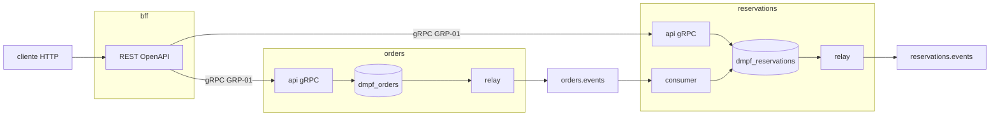

# SPEC-ACYKBF9V: DMPF — BFF REST público e contextos orders e reservations com gRPC interno

## Resumo

Substitui o composition root único `apps/backend/reference` por três:
`bff`, a única borda REST/JSON pública, e
`orders` e `reservations`, cada um com
papéis `api` (servidor gRPC), `relay` e, em `reservations`, `consumer`. O BFF
fala com os contextos por gRPC e Protobuf (ADR-024, FND-06 §10); o contexto
`reservations` ganha comandos síncronos `Reserve`, `Cancel` e `Find`, o estado
terminal `Canceled` e o evento `ReservationCancelled`. A cadeia
`correlationid`/`causationid`/`traceparent` e o deadline seguem íntegros do REST
do BFF até `ReservationConfirmed`, sob os gates DMPF fail-closed.

Como usuário de uma squad, quero ver como uma borda pública chama contextos
internos sem importar o domínio deles, e como cada contexto drena só a própria
outbox — e copiar.

## Contexto

- **Problema**: `reference` mistura a borda HTTP de `orders` com o consumo
  de `reservations` num binário só, serve REST direto do contexto e não
  exercita gRPC, que FND-06 §10 fixa como transporte síncrono interno. O
  `reservations` só existe como consumidor assíncrono: não tem caso de uso
  síncrono, reader nem estado de cancelamento.
- **Impacto**: a referência passa a mostrar a topologia-alvo de FND-06 (REST na
  borda externa, gRPC interno, Kafka assíncrono), com seis processos, e dá ao
  golden path um exemplo de contexto exposto por gRPC — hoje inexistente no
  repositório.
- **Insumo**: plano de execução `.cursor/plans/reservations-context-completo_aa478b5f.plan.md`
  (fora do versionamento), cujas decisões foram conferidas contra o código; as
  divergências estão na tabela abaixo.
- **Links relevantes**:
  - `SPEC-6QT9SBAS` — o composition root que esta spec substitui
  - `SPEC-8HWBWJCB` e `SPEC-YRJRADY9` — guarda-chuvas do SDK de referência e do kernel; esta entrega consome, não reabre
  - `SPEC-ZHE7DN1H` — os nove passos de FND-04 §3.2 em `ordersapp`
  - `SPEC-ANZX2WPG` — `reservationsapp.Service.Consume` e as sete disposições
  - `SPEC-EAGAXQN1` — `grpc.Dial`, `NewServer`, `Admission`, `HTTPStatus`; `http.Route`
  - `SPEC-XMNBMY50` — shared kernel (ADR-042)
  - `SPEC-AHPRBZCT` — `bookings`, precedente de `Cancel` no harness

### Divergências entre o plano e o repositório

| O plano diz | O repositório tem | O que esta spec adota |
| --- | --- | --- |
| Decisão registrada em ADR-041, "próximo livre" | ADR-041, ADR-042 e ADR-043 já existem | **ADR-044** |
| Stubs gRPC no bloco `contract` de `contracts` | `capabilityPolicy` permite só `pure` e `wire.codec` ao `contract` (`conformance/internal/rule/capability.go:48`); `google.golang.org/grpc` é `io.network` (`grpc/dmpf-units.json`); `buf.gen.yaml` só tem `protoc-gen-go` | O `.proto` de `service` gera **só mensagens e descriptor** pelo `protoc-gen-go` já pinado. O binding gRPC (`grpc.ServiceDesc` no servidor, `ClientConn.Invoke` no cliente) é escrito no bloco `app` de cada composition root, com o nome do método derivado do descriptor gerado. Sem `protoc-gen-go-grpc`, sem mudança em `buf.gen.yaml` nem em `gate_pins` |
| Relay não compartilhado; cada contexto drena só o próprio destino | `OutboxStore.Claim(ctx, claimID, limit, lease)` não filtra por destino (`postgres/claim.go:120`) | **Banco por contexto**: `orders` e `reservations` têm `DMPF_PG_DSN` próprios, e cada relay drena a outbox do próprio banco. Kernel inalterado |
| Contextos com `--role api\|relay\|consumer`; consumer de `orders` "sem canal inbound" | `orders` não consome nenhum canal | `orders` aceita `api\|relay`; `--role consumer` sai com exit 2 nomeando a ausência de canal inbound. `reservations` aceita os três |
| Fechar `metadata = "{}"` é condição de drenagem | `encodeMetadata` grava `"{}"` com contexto zero (`outbox.go:96-98`); o relay exige as três chaves (`relay/record.go:67-88`) | O interceptor de servidor gRPC do contexto grava `ports.WithMessageContext` antes de chamar o caso de uso; `MessageContextFor` só preenche `causationid` quando vazio |
| First-wins; cancelamento terminal | `Reservation` só tem `Pending` e `Confirmed`, e `Confirmed` já é terminal; `bookings.Cancel` rejeita cancelamento repetido | `Pending → Confirmed` por `Reserve` ou `Pending → Canceled` por `Cancel`; a primeira decisão persistida vence e as seguintes são rejeitadas com código próprio |
| E2e no BFF | E2e atual importa os pacotes do app e sobe os papéis em goroutines | E2e caixa-preta no módulo do BFF: compila os três binários e sobe seis processos do SO, sem import Go dos contextos |

### Fontes normativas

| Fonte | O que fixa |
| --- | --- |
| ADR-024, `RST-01`..`RST-04` | REST/JSON só na borda externa; POST idempotente só com chave; rota referencia contrato publicado |
| `GRP-01`, `GRP-02`, `GRP-04`..`GRP-09`, `GRP-14`, `GRP-16`, `GRP-17` | gRPC puro interno; deadline propagado e nunca reiniciado; prazo por método menor que o do chamador; retry só em método idempotente |
| ADR-015, ADR-017, ADR-042 | Provider concreto só no composition root; `bounded_context` declarado; shared kernel unidirecional (C2, `DMPF-D002`) |
| ADR-012, ADR-013, `docs/guides/dmpf-manifesto.md` | Classificação declarada; manifesto e baseline em commit próprio (`DMPF-T001`, `DMPF-T002`); aprovação distinta da autoria |
| FND-04 §3.2, `UOW-08`, `UOW-09`, `UOW-11`, `RES-25` | Nove passos; outbox na mesma transação; sem retry do caso de uso; leitura fora da UoW |
| FND-04 §6, `INB-08`, `BLK-02`, `GAR-01`, P0-3 | Efeito de broker após o commit; relay em processo próprio; at-least-once com efeito idempotente |
| `CTX-07`, `CTX-08`, `CTX-28`, `ENV-08` | Correlação preservada ou cunhada na borda; causação nunca igual ao próprio id; contexto reconstruído no consumo |
| `CTR-01`..`CTR-07`, ADR-019, ADR-021 | Três níveis de contrato; conversão domínio → wire fora da UPR, no provider |
| `REP-01`, `REP-06`, `PTB-06`, `PTB-09`, `BUF-08`, `BUF-12`, `INT-02` | Caminho do `.proto` espelha o pacote; OpenAPI registrado sem gate Buf; enum `_UNSPECIFIED`; breaking FILE; gates não-advisory; fixture por evento |
| FND-08, ADR-037, `TRC-02`, `TRC-05`, `TRC-07`, `TRC-14`..`TRC-16` | Span na borda antes da validação; span do transporte distinto do caso de uso; allowlist de atributos; nada de trace em `domain` e `port` |
| FND-09, ADR-040, `KIT-07`, `KIT-08`, `ORA-30` | Kits, determinismo, duplos fora do domínio, fixture de projeção |

<constraints>
- [P0] NUNCA importar pacote de `domain` ou `application` dos exemplos no BFF: ele declara `bounded_context` `bff` e só alcança a superfície `contract` e o shared kernel; qualquer outra aresta é `DMPF-D002`.
- [P0] NUNCA colocar `google.golang.org/grpc` em unidade `contract`: o binding gRPC vive no bloco `app` (capability `io.network` fora de `capabilityPolicy[BlockContract]`).
- [P0] NUNCA servir REST nos contextos nem transcodificar gRPC-JSON: a única borda HTTP pública é o BFF (`RST-01`, `GRP-02`).
- [P0] NUNCA chamar RPC sem deadline, nem reiniciar o prazo recebido: o BFF deriva o prazo da rota e o contexto recusa chamada sem deadline antes do handler (`GRP-04`, `GRP-05`, `GRP-17`).
- [P0] NUNCA retentar `AddItem`, `PlaceOrder`, `Reserve` ou `Cancel`: só `FindOrder` e `FindReservation` são declarados idempotentes (`GRP-08`, `GRP-09`).
- [P0] NUNCA gravar registro de outbox sem `correlationid`, `causationid` e `traceparent`: o interceptor do contexto popula o `MessageContext` antes do caso de uso.
- [P0] NUNCA compartilhar banco entre `orders` e `reservations`: cada relay drena só a outbox do próprio contexto.
- [P0] NUNCA declarar exactly-once em código, contrato ou documentação: o e2e reentrega a mesma mensagem e prova idempotência pela inbox (P0-3, varredura do `buf-lint`).
- [P0] NUNCA misturar manifesto ou baseline com código no mesmo commit (`DMPF-T002`), nem relaxar célula, capability ou gate; nada de `--no-verify`.
- [P1] Todo span novo usa só atributos de `observability/tracing` (`TRC-15`); nenhum span em `domain` ou `port` (`TRC-16`).
</constraints>

## Requisitos

### Funcionais

**Contratos**

- [ ] **[P0] Serviços gRPC**: `contracts/proto/company/orders/service/v1/orders_service.proto` (`OrdersService`: `AddItem`, `PlaceOrder`, `FindOrder`) e `contracts/proto/company/reservations/service/v1/reservations_service.proto` (`ReservationsService`: `Reserve`, `Cancel`, `FindReservation`), com `<Rpc>Request`/`<Rpc>Response` (STANDARD). Respostas de comando usam `oneof result` entre a resposta aceita e `Rejection{code, message}`, declarado em cada pacote; falha técnica é status gRPC. Enum `ReservationStatus` com `RESERVATION_STATUS_UNSPECIFIED = 0`, `CONFIRMED = 1`, `CANCELED = 2` (`PTB-09`). Campos das respostas de `orders` espelham os schemas `ItemAccepted`, `PlacedResponse` e `Order` do OpenAPI atual.
- [ ] **[P0] Evento `ReservationCancelled`**: `contracts/proto/company/reservations/event/v1/reservation_cancelled.proto` com `order_id`; tipo `com.company.reservations.reservation-cancelled.v1`; fixture `contracts/fixtures/reservations/event/v1/reservation-cancelled.golden` gerada por `reservation_cancelled_fixture_test.go` e registrada em `specs` (`INT-02`, `FIX-*`).
- [ ] **[P0] Geração e manifesto**: o `include` de `contracts/gen` ganha `gen/go/company/orders/service/v1` e `gen/go/company/reservations/service/v1` antes de `buf generate`; o gerado entra versionado; `buf-lint`, `buf-pins`, `buf-generate-check` e `NX_BASE=develop buf-breaking` passam sem mudança de pin nem de gate (mudança aditiva).
- [ ] **[P0] OpenAPI público**: `contracts/openapi/reservations/v1/openapi.yaml` (3.1) com `GET /reservations/{order_id}`, `POST /reservations/{order_id}/reserve` (corpo `{item_count}`) e `POST /reservations/{order_id}/cancel`; POST com `Idempotency-Key` obrigatório e `X-Correlation-ID` opcional; respostas 200, 400, 404, 409, 422, 429, 503, 504 conforme a operação. `contracts/openapi/orders/v1/openapi.yaml` passa a descrever o BFF como servidor e ganha 503 e 504.

**Domínio e aplicação de `reservations`**

- [ ] **[P0] UPR `Cancel` e estado `Canceled`**: `messages.go` acrescenta `Canceled` depois de `Confirmed` (valores persistidos estáveis), `Cancel{At}`, `ReservationCancelled{Order, At}` com `EventName() "reservations.reservation-cancelled"` e `CancelledResponse{Order}`; `cancel.go` aceita só em `Pending` e emite um evento; rejeita `Confirmed` com `CodeAlreadyReserved` e `Canceled` com `CodeAlreadyCanceled`. `Reserve` passa a rejeitar `Canceled` com `CodeReservationCanceled` e mantém `CodeAlreadyReserved` para `Confirmed`. Testes de tabela, snapshot e determinismo cobrem os ramos novos; os casos existentes ficam intactos.
- [ ] **[P0] Casos de uso síncronos**: `reservationsapp.Service` ganha `Reader`, `Instrumentation` e os comandos `Reserve{Order, Items}` e `Cancel{Order}`; `Reserve` e `Cancel` seguem os nove passos com `loadOrCreate` e `enqueueAll` na mesma transação, e `FindReservation` lê por `Reader` fora da UoW (`UOW-11`). `Consume` continua igual e rejeita por domínio uma reserva já cancelada (disposição `StatusRejected`, `Ack`).
- [ ] **[P0] Persistência**: `reservationspg.Mapper` mapeia `ReservationCancelled`; `reservationspg.NewReader(pool)` no molde de `orderspg.NewReader`, com teste de integração provando leitura sem `BEGIN` e `ErrNotFound` para id ausente.
- [ ] **[P1] Fixture de projeção**: `contracts/fixtures/reservations/projection/v1/reservation.golden` ganha os casos de `Cancel` e de `Reserve` sobre `Canceled` (`ORA-30`), exercitados pelo `domainkit`.

**Contextos (`orders`, `reservations`)**

- [ ] **[P0] Módulos e projetos**: `apps/backend/orders` e `apps/backend/reservations`, diretório igual ao nome do projeto Nx; `go.mod` sem `require` de irmão; entrada no `go.work`; tags `type:app`, `scope:backend`, `stack:go`, `layer:apps`; targets `fmt-check`, `vet`, `build`, `test-race` (`cache: false`), `govulncheck` e `serve-<papel>`; `package.json` `private: true`; `Dockerfile` por app; `dmpf-units.json` com unidade `app`, `bounded_context` `kernel`, `include` por import path exato e `external` só com o que os providers cabeados exigem.
- [ ] **[P0] Papel `api` gRPC**: `grpc.NewServer` com `Services` declarados e health `SERVING` só após o `Migrate` opcional e o pool prontos; interceptors de servidor na ordem span de servidor → `grpc.Admission` → `deadline.Require` (sem deadline: `INVALID_ARGUMENT` antes do handler) → contexto de mensagem → handler. O handler decodifica o Protobuf, chama o caso de uso e mapeia `ErrNotFound` → `NOT_FOUND`, conflito de versão → `ABORTED`, prazo → `DEADLINE_EXCEEDED`, demais → `INTERNAL` sem mensagem interna. `orders` serve `AddItem`, `PlaceOrder` e `FindOrder`; `reservations` serve `Reserve`, `Cancel` e `FindReservation`.
- [ ] **[P0] Papéis assíncronos**: `orders --role relay` drena `orders.events`; `reservations --role relay` drena `reservations.events`; `reservations --role consumer` consome `orders.events` pela inbox, com `MaxAttempts` lido do `channel.Catalog` (ADR-039). Cada catálogo tem só os canais do próprio contexto.
- [ ] **[P0] Configuração**: `DMPF_PG_DSN` obrigatória em todo papel; `api` lê `DMPF_GRPC_ADDR` (default `:9090`) e exige `DMPF_GRPC_INSECURE=true` ou `DMPF_GRPC_TLS_CERT_FILE` e `DMPF_GRPC_TLS_KEY_FILE`; relay e consumer leem `DMPF_KAFKA_BROKERS`, `DMPF_KAFKA_ORDERS_TOPIC`/`_DLQ`, `DMPF_KAFKA_RESERVATIONS_TOPIC`/`_DLQ` e `DMPF_KAFKA_GROUP` conforme o papel. Papel ausente, desconhecido ou variável obrigatória ausente → exit 2 nomeando-a; um runtime OTel por processo; graceful shutdown em 10 s.

**BFF (`bff`)**

- [ ] **[P0] Módulo e projeto**: `apps/backend/bff`, mesmas convenções dos contextos; unidade `bff/app`, bloco `app`, `bounded_context` `bff`; `external` sem `pgx` nem `franz-go`. Recebe os targets de infraestrutura hoje em `reference-go` (`infra-up`, `observability-up`, `infra-down`, `infra-budget`, `k8s-render`).
- [ ] **[P0] Borda REST**: um processo (`serve`); rotas `POST /orders/{id}/items`, `POST /orders/{id}/place`, `GET /orders/{id}`, `GET /reservations/{order_id}`, `POST /reservations/{order_id}/reserve`, `POST /reservations/{order_id}/cancel`, cada uma um `http.Route` validado na construção com `ContractRef` para o OpenAPI do contexto (`RST-04`); middleware na ordem `Admission` (`RES-17`) → span de servidor e contexto (`TRC-02`) → prazo da requisição derivado do `Budget` da rota → `Idempotency-Key` nos POST (400 sem) → handler; CORS opcional por `DMPF_CORS_ORIGINS`; serve os dois OpenAPI em `/openapi/orders/v1/openapi.yaml` e `/openapi/reservations/v1/openapi.yaml`.
- [ ] **[P0] Cliente gRPC**: dois `grpc.Dial` (`DMPF_ORDERS_GRPC_TARGET`, `DMPF_RESERVATIONS_GRPC_TARGET`, obrigatórias; transporte por `DMPF_GRPC_INSECURE=true` só em desenvolvimento ou `DMPF_GRPC_CA_FILE` com `DMPF_GRPC_SERVER_NAME` opcional, e sem nenhum dos dois → exit 2) com `MethodPolicy` por método — `FindOrder` e `FindReservation` idempotentes com `UNAVAILABLE` retentável, os demais sem retry — e `Budget` com folga menor que a da rota (`GRP-16`, `GRP-17`). JSON ↔ Protobuf no handler; `Rejection` → 422 com `{code, message}`; status gRPC → HTTP pela tabela de `grpc.HTTPStatus`. O breaker de cada dependência conta como falha só indisponibilidade (`UNAVAILABLE`, `DEADLINE_EXCEEDED`, `RESOURCE_EXHAUSTED`, `INTERNAL`, `UNKNOWN`, `DATA_LOSS` e erro de transporte): `NOT_FOUND` e os demais desfechos de negócio não o abrem (`RES-10`, `RES-12`). A classificação vive no kernel — classificador de falha no `resilience.Breaker`, repassado por `transport/compose` e aplicado por padrão no `grpc` —, sem contorno no BFF.

**Correlação, deadline e observabilidade**

- [ ] **[P0] Cadeia de contexto**: o BFF preserva `X-Correlation-ID` válido ou cunha um (`CTX-07`), gera `request_id` próprio e envia em metadata `x-correlation-id`, `x-causation-id` (o `request_id` do BFF) e `traceparent` W3C do span de cliente gRPC. O contexto gera o próprio `request_id` e grava `MessageContext{CorrelationID, CausationID: request_id do contexto, Traceparent: span de servidor}` (`CTX-08`); o consumer mantém o contexto do envelope (`CausationID` = id do `OrderPlaced`).
- [ ] **[P0] Spans**: BFF com span HTTP de servidor e o span de cliente de `grpc`; contexto com span gRPC de servidor filho do `traceparent` recebido, span de caso de uso distinto (`TRC-05`) e span de banco por `pgx.QueryTracer` no pool, sem SQL nem argumentos; erro sempre amostrado (`TRC-14`).
- [ ] **[P1] Consumo**: o `Sink` de `reservations` abre span de consumo com pai remoto extraído do `traceparent` do envelope quando presente (`TRC-07`).
- [ ] **[P1] Painéis**: `infra/observability/grafana/dashboards/reference.json` passa a filtrar pelos três serviços.

**Topologia, remoção e documentação**

- [ ] **[P0] Infra local**: `infra/local/compose/reference.yml` sobe seis serviços (`dmpf-bff`, `dmpf-orders-api`, `dmpf-orders-relay`, `dmpf-reservations-api`, `dmpf-reservations-relay`, `dmpf-reservations-consumer`) no profile `dmpf`, só o BFF publicado no host, `DMPF_MIGRATE=true` só nos `api`; o Postgres cria os bancos `dmpf_orders` e `dmpf_reservations` na inicialização; o Swagger UI aponta para os dois OpenAPI do BFF; `infra-budget` continua aprovando.
- [ ] **[P0] Kubernetes**: `infra/k8s/base/reference-{bff,orders,reservations}` substituem `base/reference`; `NetworkPolicy` só admite gRPC nos `api` vindo do BFF; overlays `dev` e `hmg` com imagens e `Secret` por app; `k8s-render` passa.
- [ ] **[P0] Remoção**: `apps/backend/reference`, a entrada do `go.work` e `infra/k8s/base/reference` saem por `trash`; a unidade `kernel/reference-app` sai do baseline no commit de classificação; `testkit/project.json` troca o `dependsOn` para os novos projetos; o subject `reference` do `dmpf-evidence` passa a listar os três módulos. `bom/dmpf/0.1.0.json` e `bom/evidence/0.1.0/` ficam intactos (release histórica).
- [ ] **[P0] Classificação**: manifestos novos, `include` de `contracts/gen` e `units-baseline.json` regravado em commit próprio, sem código (`DMPF-T001`, `DMPF-T002`); a aprovação por revisor distinto do autor é registrada como pendência de revisão.
- [ ] **[P1] ADR-044 e documentos**: ADR-044 registra a topologia, o binding gRPC no bloco `app`, o banco por contexto e as alternativas descartadas, sem alterar as decisões do ADR-041; `docs/adr/README.md`, `AGENTS.md` (árvore, Apps, tabela `layer:*`, Comandos), `infra/README.md`, os README dos três apps, `libs/backend/go/app/{README.md,doc.go}`, `libs/backend/go/testkit/README.md`, `docs/guides/{dmpf-arch-review,dmpf-composicao,dmpf-implementation}.md` e `.agents/skills/dmpf-bounded-context/references/{golden-path,armadilhas}.md` apontam para os novos apps. Specs e ADRs históricos não são editados.

### Não-funcionais

- [ ] Conformidade: `conformance` sem diagnóstico; `tools/dmpf-gate-check.sh` e `tools/dmpf-cell-check.sh` verdes; nenhuma exceção nova de manifesto.
- [ ] Cadeia verde nos projetos Go afetados: `fmt-check`, `vet`, `build`, `test-race`, `govulncheck`; `biome ci`; `adr-verify`.
- [ ] Sem dependência Go nova fora das já declaradas por providers do kernel (`grpc`, `pgx`, `franz-go`, `otel`).
- [ ] Segurança: DSN, brokers e certificados só por variável de ambiente; nenhuma mensagem de erro interna atravessa gRPC ou HTTP (FND-07).

## Camadas afetadas

| Camada (bloco DMPF) | Afetada? | O que muda |
| --- | --- | --- |
| `domain` | [x] | `domain/example/reservations`: `Canceled`, `Cancel`, `ReservationCancelled`, códigos |
| `application` | [x] | `application/example/reservations`: `Reserve`, `Cancel`, `FindReservation`, `Reader` |
| `port` | [ ] | — |
| `contract` | [x] | protos de `service` e `ReservationCancelled`, gerado, fixtures, OpenAPI |
| `provider` | [x] | `postgres/example/reservations`: mapper e reader |
| `app` | [x] | três composition roots novos; `reference` removido |
| Workspace | [x] | `go.work`, baseline, infra, testkit, ADR-044, documentação |

## Localização de código

```text
contracts/proto/company/orders/service/v1/orders_service.proto              — NOVO
contracts/proto/company/reservations/service/v1/reservations_service.proto  — NOVO
contracts/proto/company/reservations/event/v1/reservation_cancelled.proto   — NOVO
contracts/fixtures/reservations/event/v1/reservation-cancelled.golden       — NOVO
contracts/fixtures/reservations/projection/v1/reservation.golden            — MODIFICAR
contracts/openapi/reservations/v1/openapi.yaml                              — NOVO
contracts/openapi/orders/v1/openapi.yaml                                    — MODIFICAR
libs/backend/go/contracts/gen/go/company/{orders,reservations}/...     — GERADO
libs/backend/go/contracts/golden/reservation_cancelled_fixture_test.go — NOVO
libs/backend/go/contracts/dmpf-units.json                              — MODIFICAR (commit de classificação)
libs/backend/go/domain/example/reservations/{messages,reserve,rejections}.go, cancel.go e testes
libs/backend/go/application/example/reservations/{service,reserve,cancel,find_reservation}.go e testes
libs/backend/go/postgres/example/reservations/{mapper,reader}.go e testes
apps/backend/orders/                                      — NOVO
  config.go, ports.go, catalog.go, wiring.go, telemetry.go, dbtrace.go
  rpc/{service.go, interceptors.go, errors.go}                              — ServiceDesc, contexto de mensagem, status
  cmd/orders/main.go
apps/backend/reservations/                                — NOVO (mesma forma + sink.go)
apps/backend/bff/                                         — NOVO
  config.go, wiring.go, telemetry.go
  api/{routes.go, handlers_orders.go, handlers_reservations.go, middleware.go}
  rpc/{clients.go, metadata.go}                                             — Invoke, MethodPolicy, metadata de contexto
  cmd/bff/main.go
  e2e_test.go, harness_test.go                                              — integration: seis processos
apps/backend/reference/                                                — REMOVER
infra/local/compose/{reference,postgres}.yml, infra/local/.env.example — MODIFICAR
infra/k8s/base/reference-{bff,orders,reservations}/, overlays/{dev,hmg} — NOVO/MODIFICAR; base/reference REMOVER
infra/observability/grafana/dashboards/reference.json                  — MODIFICAR
libs/backend/go/testkit/{project.json, cmd/evidence/main.go}      — MODIFICAR
go.work, tools/dmpf-baseline/units-baseline.json                            — MODIFICAR
docs/adr/044-bff-rest-e-contextos-grpc-de-referencia.md, docs/adr/README.md — NOVO/MODIFICAR
```

## Design

### Topologia



Seis processos. O BFF não tem banco, outbox, relay nem consumer.

### Fluxo 1 — escrita, drenagem e consumo

1. `POST /orders/{id}/place` chega ao BFF: `Admission` decide; o span de
   servidor abre e o contexto é cunhado; sem `Idempotency-Key`, 400.
2. O handler monta `PlaceOrderRequest` e chama `Invoke` com o prazo de
   `deadline.Outgoing`; a metadata leva correlação, causação e `traceparent`.
3. O contexto `orders` abre o span de servidor, admite, exige deadline, grava o
   `MessageContext` e chama `ordersapp.Service.PlaceOrder`, que grava o estado e
   o `OrderPlaced` na mesma transação.
4. `orders --role relay` publica em `orders.events`; `reservations --role
   consumer` reserva pela inbox e enfileira `ReservationConfirmed`, que o relay
   de `reservations` publica em `reservations.events`.

### Fluxo 2 — first-wins entre cancelamento e reserva

1. `POST /reservations/o-1/cancel` antes do `OrderPlaced`: `Cancel` faz
   `loadOrCreate`, decide sobre `Pending`, persiste `Canceled` e enfileira
   `ReservationCancelled`.
2. O `OrderPlaced` de `o-1` chega: `Reserve` sobre `Canceled` é rejeitado com
   `CodeReservationCanceled`; a disposição é `StatusRejected` e o `Ack` vem
   depois do commit.
3. No caminho inverso, `Cancel` sobre `Confirmed` devolve 422 com
   `CodeAlreadyReserved`. Corridas simultâneas terminam em conflito de versão
   (`ABORTED` → 409) para quem chega depois.

### Fluxo 3 — leitura

`GET /reservations/{order_id}` → `FindReservation` → `Reader.Load` por
`pool.QueryRow`, sem transação e sem outbox (`UOW-11`); ausente → `NOT_FOUND` → 404.

### Cadeia de correlação e deadline

| Salto | `correlationid` | `causationid` | `request_id` | `traceparent` | Deadline |
| --- | --- | --- | --- | --- | --- |
| REST no BFF | header válido ou cunhado | ausente | `RB` | raiz ou recebido | instante da rota |
| gRPC BFF → contexto | preservado | `RB` na metadata | `RO`/`RR` no contexto | span de cliente | `Outgoing`, decrescido pela folga |
| Outbox do contexto | preservado | `RO`/`RR` | — | span de servidor | — |
| Kafka → consumer | do envelope | id do `OrderPlaced` em `ReservationConfirmed` | próprio (`CTX-28`) | do envelope | política do consumer |

### Onde cada regra é provada

| Regra | Instrumento | Onde |
| --- | --- | --- |
| C2, ADR-015, capability do `contract` | `conformance` sobre os três apps e `contracts` | CI, Gates DMPF |
| `RST-02`, `RST-04`, `RES-17` | `api/routes_test.go` do BFF | `test-race` |
| `GRP-04`, `GRP-05`, `GRP-17` | teste por `bufconn`: contexto observa prazo menor que o do BFF; chamada sem prazo recusada antes do handler | `test-race` |
| `GRP-09` | teste de `MethodPolicy`: só os `Find*` são idempotentes | `test-race` |
| `TRC-02`, `TRC-05`, `TRC-15` | exportador em memória: span HTTP → cliente gRPC → servidor gRPC → caso de uso → banco | `test-race` |
| Cadeia de contexto | e2e lê `metadata` das outbox e envelopes dos tópicos | `test-race` (integration) |
| First-wins | testes de domínio e e2e cancelar-antes-de-reservar | `test-race` |
| `INB-*`, P0-3 | e2e reentrega o `OrderPlaced` e prova `DuplicateIgnored` | `test-race` (integration) |
| `INT-02`, `BUF-08` | fixture nova; `buf-breaking` contra `develop` | gates Buf |
| `DMPF-T002` | commit de classificação sem código | CI, Gates DMPF |

## Decisões técnicas

- **Binding gRPC no bloco `app` com mensagens geradas** porque o bloco
  `contract` não admite `io.network`; o descriptor gerado continua sendo a
  fonte do nome de serviço e método. Alternativas descartadas:
  `protoc-gen-go-grpc` no `contract` (viola `capabilityPolicy`), gerar o
  binding dentro de cada app (código gerado fora de `contracts`, contra
  `REP-02`) e lib compartilhada de binding (composition fora do composition
  root, ADR-015).
- **Banco por contexto** porque `Claim` não filtra destino e contexto que
  divide tabela de outbox divide o relay. Alternativa descartada: filtro por
  destino no `OutboxStore`, que muda a porta do kernel por causa de um exemplo.
- **Rejeição de domínio no corpo da resposta** porque `Outcome` separa canal de
  negócio do técnico e o status gRPC sem detalhes perderia o código;
  `google.rpc.Status` com detalhes exigiria `deps` Buf (`BUF-02`).
- **First-wins sobre `Pending`** porque `Confirmed` já é terminal no kernel:
  `Canceled` vira o segundo estado terminal e nenhuma transição existente muda.
- **E2e caixa-preta com processos do SO** porque importar os pacotes dos
  contextos no módulo do BFF cruzaria `bounded_context`, e seis processos são a
  topologia que se quer provar.
- **`orders` sem papel `consumer`** porque um processo sem canal não tem o que
  fazer; `BLK-02` pede um processo por papel que existe.
- **BFF em `bounded_context` próprio** para que o verificador prove que ele só
  depende de contrato e shared kernel.

## Verificação e testes

### Critérios de aceite

- [ ] A cadeia de gates fecha verde, nesta ordem: `contracts:buf-lint`, `buf-pins`, `buf-generate-check`, `NX_BASE=develop buf-breaking`; `tools/dmpf-gate-check.sh`; `tools/dmpf-cell-check.sh`; `conformance` com baseline atualizado; `fmt-check`, `vet`, `test-race`, `build` e `govulncheck` nos projetos Go afetados; `k8s-render`, `infra-budget`, `biome ci`, `adr-verify`.
- [x] `pnpm nx show projects --projects=tag:layer:apps` lista `app`, `bookings` e os três novos; `reference-go` não existe mais.
- [x] O e2e, falando só HTTP com o BFF, leva `POST items` → `POST place` até `ReservationConfirmed` em `reservations.events` com o mesmo `correlationid` enviado, `causationid` igual ao id do `OrderPlaced` e o mesmo trace id do `traceparent` gravado na outbox de `orders`.
- [x] O e2e cancela uma reserva antes do `OrderPlaced` e termina com `Canceled`, `ReservationCancelled` publicado e nenhum `ReservationConfirmed`.
- [x] A reentrega do mesmo `OrderPlaced` termina em `DuplicateIgnored`, com uma reserva e um registro de inbox.
- [x] A outbox de `dmpf_orders` só tem destino `orders.events` e a de `dmpf_reservations` só `reservations.events`.
- [x] Nenhum arquivo do BFF importa `domain`, `application` nem os pacotes dos contextos; nenhum pacote gerado importa `google.golang.org/grpc`.
- [ ] ADR-044 criado; `AGENTS.md` e os guias apontam para os três apps; nenhuma referência viva a `apps/backend/reference/` fora de specs, ADRs e BOM históricos.

### Cenários de teste

**Domínio (`domain/example/reservations`)**

- Dado reserva `Pending`, quando `Cancel`, então `Canceled`, um `ReservationCancelled` e snapshot novo.
- Dado reserva `Confirmed`, quando `Cancel`, então `CodeAlreadyReserved` e agregado inalterado.
- Dado reserva `Canceled`, quando `Reserve{Items: 2}`, então `CodeReservationCanceled` e agregado inalterado.
- Dado reserva `Canceled`, quando `Cancel`, então `CodeAlreadyCanceled`.

**Contexto gRPC (`rpc`, por `bufconn`)**

- Dado chamada sem deadline, quando `Reserve`, então `INVALID_ARGUMENT` e o caso de uso não é chamado.
- Dado metadata com correlação `C` e `traceparent` `T`, quando `PlaceOrder` é aceito, então o registro de outbox tem `correlationid` `C`, `causationid` igual ao `request_id` do contexto e `traceparent` com o trace id de `T`.
- Dado `FindReservation` de id ausente, quando chamado, então `NOT_FOUND`.

**BFF (`api`, com servidores gRPC falsos por `bufconn`)**

- Dado `POST /reservations/o-1/cancel` sem `Idempotency-Key`, então 400 e nenhum RPC.
- Dado resposta com `Rejection{code: "reservations/already-reserved"}`, então 422 com o mesmo código.
- Dado servidor que responde `DEADLINE_EXCEEDED`, então 504; dado `UNAVAILABLE` em `FindOrder`, então uma nova tentativa e, persistindo, 503.
- Dado `Reserve` com `UNAVAILABLE`, então nenhuma nova tentativa.
- Dado exportador em memória, quando `GET /orders/o-1`, então o span de cliente gRPC é filho do span HTTP e a metadata enviada carrega o `traceparent` do span de cliente.

**Fim a fim (`bff/e2e_test.go`, integration)**

- Dado seis processos sobre Postgres e Redpanda, quando `POST items` e `POST place`, então `ReservationConfirmed` chega a `reservations.events` com a cadeia de contexto do critério de aceite.
- Dado cancelamento antes do `OrderPlaced`, então `ReservationCancelled` publicado e o consumo termina rejeitado por domínio.
- Dado o mesmo `OrderPlaced` republicado, então `DuplicateIgnored`.
- Dado `DMPF_PG_DSN` ausente com `CI` definida, então o e2e falha nomeando a variável; sem `CI`, `t.Skip`.

**Papéis (`cmd/*/main_test.go`)**

- Dado `orders --role consumer`, então exit 2 nomeando a ausência de canal inbound.
- Dado `bff` sem `DMPF_ORDERS_GRPC_TARGET`, então exit 2 nomeando a variável.

<critical_constraints>
- [P0] NUNCA importar pacote de `domain` ou `application` dos exemplos no BFF: ele declara `bounded_context` `bff` e só alcança a superfície `contract` e o shared kernel; qualquer outra aresta é `DMPF-D002`.
- [P0] NUNCA colocar `google.golang.org/grpc` em unidade `contract`: o binding gRPC vive no bloco `app` (capability `io.network` fora de `capabilityPolicy[BlockContract]`).
- [P0] NUNCA servir REST nos contextos nem transcodificar gRPC-JSON: a única borda HTTP pública é o BFF (`RST-01`, `GRP-02`).
- [P0] NUNCA chamar RPC sem deadline, nem reiniciar o prazo recebido: o BFF deriva o prazo da rota e o contexto recusa chamada sem deadline antes do handler (`GRP-04`, `GRP-05`, `GRP-17`).
- [P0] NUNCA retentar `AddItem`, `PlaceOrder`, `Reserve` ou `Cancel`: só `FindOrder` e `FindReservation` são declarados idempotentes (`GRP-08`, `GRP-09`).
- [P0] NUNCA gravar registro de outbox sem `correlationid`, `causationid` e `traceparent`: o interceptor do contexto popula o `MessageContext` antes do caso de uso.
- [P0] NUNCA compartilhar banco entre `orders` e `reservations`: cada relay drena só a outbox do próprio contexto.
- [P0] NUNCA declarar exactly-once em código, contrato ou documentação: o e2e reentrega a mesma mensagem e prova idempotência pela inbox (P0-3, varredura do `buf-lint`).
- [P0] NUNCA misturar manifesto ou baseline com código no mesmo commit (`DMPF-T002`), nem relaxar célula, capability ou gate; nada de `--no-verify`.
- [P1] Todo span novo usa só atributos de `observability/tracing` (`TRC-15`); nenhum span em `domain` ou `port` (`TRC-16`).
</critical_constraints>

## Escopo fora

- **Replay persistido de resposta por `Idempotency-Key`**: exige store próprio; `RST-02` não o exige do servidor. O BFF repassa a chave em metadata só para log.
- **mTLS e identidade de serviço entre BFF e contextos**: matéria de FND-07; aqui TLS de servidor ou modo inseguro de desenvolvimento.
- **Connect e transcodificação gRPC-JSON**: `GRP-02` os reserva a outros clientes; o BFF é o tradutor.
- **Filtro por destino no `OutboxStore`**: mudança de porta do kernel; o banco por contexto resolve sem ela.
- **Nova release do BOM**: `bom/dmpf/0.1.0.json` é histórico; certificar a nova topologia é o rito da próxima release.
- **SQS e SNS**: um transporte assíncrono por processo, decisão da guarda-chuva.
- **Autenticação de usuário final no BFF**: `Authorize` continua `AllowAll`, como no composition root substituído.
