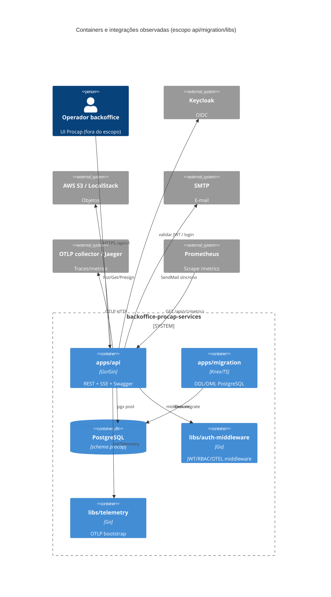
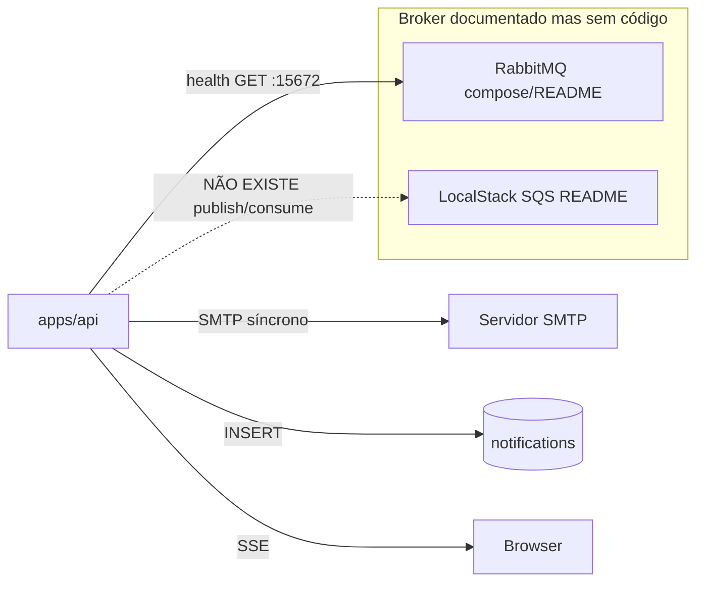
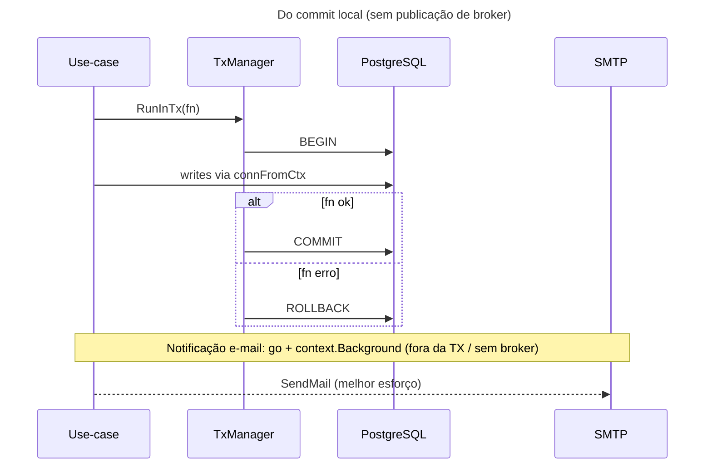

# Inventário AS-IS — backoffice-procap-services

- **Repositório**: `git@gitea.lidercap.com.br:lidercap-apps/backoffice-procap-services.git` (local: `/home/mmanjos/work/repositories/procap/backoffice-procap-services`)
- **Escopo inspecionado**: `apps/api/**`, `apps/migration/**`, `libs/**` (manifestos raiz, CI e docs citados só como contexto; `apps/procap-frontend*` fora do corte profundo)
- **Commit inspecionado**: `fab7c8ec` (`fab7c8ec3cbee714c81038fce0ea326158edd518`)
- **Data do levantamento**: 2026-08-13
- **Responsável pelo levantamento**: agente (asset `prompt-inventario-repositorio.md` / SPEC-K9H204F1)
- **Stack**: ambas — **Go** (`go 1.25.9` em `go.work` / `apps/api`) + **TypeScript/Node** (migrations Knex; design system React)

## 1. Sumário executivo

- `Fato`: monorepo Nx (`@lideranca-sites/source`) para o **backoffice Procap** — `README.md:1-3`.
- `Fato`: API principal em **Go + Gin**, Clean Architecture em 4 camadas (`domain` / `application` / `infrastructure` / `presentation`), porta **8081** — `apps/api/main.go`, `README.md:32-35`.
- `Fato`: schema PostgreSQL evolui via app **`apps/migration`** (Knex 3.2.10 + `pg`), **121** migrations TypeScript — não TypeORM/GORM AutoMigrate.
- `Fato`: mensageria de broker (**SQS/Kafka/AMQP producer/consumer**) **NÃO EXISTE** no código do escopo; README e compose citam RabbitMQ/LocalStack SQS, mas o uso observado é health-check HTTP e S3 — `health-handler.go:118-126`, `apps/api/go.mod` (só `service/s3`).
- `Fato`: contratos HTTP = **Swagger 2.0** (`swag` → `apps/api/docs/`); **NÃO EXISTE** `.proto` / AsyncAPI / JSON Schema versionado no escopo.
- `Fato`: transação = `ITxManager.RunInTx` (pgx Begin/Commit) em fluxos de campanha/calendário/aprovação; **NÃO EXISTE** outbox/inbox.
- `Fato`: observabilidade = **OpenTelemetry** (`libs/telemetry`) + **Prometheus** (`/api/v1/metrics`) + **gologger** + correlation ID; New Relic **NÃO EXISTE** no escopo.
- `Fato`: auth = **Keycloak OIDC/JWT** via `libs/auth-middleware`; storage de documentos = **AWS S3** (SDK v2); e-mail = **SMTP** síncrono (`net/smtp`).
- `Fato`: ownership formal (`CODEOWNERS`) **NÃO EXISTE**; CI completo está em workflows `*.bck` — ativos: CD + Semgrep.
- `Inferência` (média): forte candidato a referência de **domínio sem I/O** e OTEL no golden path; fraco como piloto de **mensageria at-least-once** (broker documentado, não implementado).

## 2. Evidências consultadas

- Manifestos: `package.json`, `pnpm-workspace.yaml`, `go.work`, `apps/api/go.mod`, `apps/migration/package.json` / `knexfile.ts`, `libs/*/go.mod` / `package.json`, `README.md`, `.env.example`
- API: `apps/api/main.go`, `src/{domain,application,infrastructure,presentation,config}/**`, `docs/swagger.yaml`, `Dockerfile`, `Makefile`
- Migration: `apps/migration/src/migrations/**` (contagem), `src/seeds/**`, `Dockerfile`, `docker-compose.yml`
- Libs: `libs/auth-middleware/**`, `libs/telemetry/src/infrastructure/config.go`, `libs/procap-design-system/package.json` + `src/index.ts`
- CI/ops: `.github/workflows/` (ativos + `.bck`), `monitoring/prometheus/alert_rules.yml` (contexto)
- Buscas: `outbox|inbox|exactly-once|sqs|kafka|amqp|rabbit|*.proto|RunInTx|swaggertype|connFromCtx`
- Comandos: `git rev-parse`, `find`/`rg` sob o escopo; contagens de entidades/managers/repos/handlers/migrations

## 3. Estrutura do repositório

Escopo deste relatório — árvore simplificada:

```text
backoffice-procap-services/
├── apps/
│   ├── api/                         # API REST Go (Gin) :8081
│   │   ├── main.go                  # bootstrap, DI manual, rotas
│   │   ├── docs/                    # Swagger gerado (swag)
│   │   ├── templates/               # e-mail + documentos
│   │   ├── docker/, Dockerfile
│   │   └── src/
│   │       ├── domain/              # entities (~61), interfaces (~49), errors
│   │       ├── application/         # use-cases (*-manager), services, utils
│   │       ├── infrastructure/      # repositories (pgx), s3, logger, metrics
│   │       ├── presentation/        # handlers, routes, dtos
│   │       ├── config/              # DB, Keycloak, logger
│   │       └── shared/types/        # FlexibleDate
│   └── migration/                   # Knex migrate/seed (Node)
│       ├── knexfile.ts
│       ├── src/migrations/          # 121 arquivos .ts
│       └── src/seeds/               # 4 seeds
├── libs/
│   ├── auth-middleware/             # Go — JWT/OIDC, RBAC, OTEL gin, rate limit
│   ├── telemetry/                   # Go — Init OTLP traces/metrics
│   └── procap-design-system/        # React/Next UI (fora dos eixos backend DMPF)
├── go.work                          # api + auth-middleware + telemetry
├── package.json / pnpm-workspace.yaml
└── (contexto) README, .github/workflows, monitoring/, docker-compose*
```

`Fato` — listagem de diretórios e contagens no commit inspecionado.

Fora do corte profundo: `apps/procap-frontend`, `apps/procap-frontend-e2e`, demais apps Node do monorepo.

## 4. Arquitetura observada

`Inferência` (alta): **Clean Architecture** explícita na API Go, com ports em `domain/interfaces` e adapters em `infrastructure` / `presentation`. Wiring **manual** em `main.go` (sem framework de DI).

`Fato`: pasta `domain/` existe e concentra entidades + contratos de repositório/serviço — estrutura em `apps/api/src/domain/`.

`Fato`: schema DB é responsabilidade de app Node separado (`apps/migration`); a API usa **SQL raw via pgx**, não ORM.

`Inferência` (alta): notificações em tempo real via **SSE** HTTP (`text/event-stream`), não via broker — `notification-handler.go:236-253`, `docs.go` path `/notifications/events`.



## 5. Padrões vigentes

### 5.1 Mensageria

| Item | Situação | Rótulo | Evidência |
|---|---|---|---|
| Cliente SQS/SNS/Kafka/AMQP | **NÃO EXISTE** | `Fato` | `rg` no escopo; `apps/api/go.mod` sem `service/sqs` / AMQP |
| Producer/consumer de fila | **NÃO EXISTE** | `Fato` | busca `consumer|producer|Publish|Subscribe` sem implementação de broker |
| RabbitMQ | Apenas health HTTP management `:15672` se `RABBITMQ_HOST` setado | `Fato` | `health-handler.go:118-126` |
| Documentação vs código | README lista RabbitMQ e LocalStack SQS como serviços | `Fato` | `README.md:38-39`, `README.md:518-535` |
| Notificações | Persistência em tabela `notifications` + e-mail SMTP; SSE para push | `Fato` | migration notifications; `email-repository.go:34-47`; `notification-handler.go:253` |
| Assíncrono ad hoc | `go m.sendNotificationEmails(context.Background(), ...)` sem fila/retry/DLQ | `Fato` | `notification-manager.go:183` |
| Stub de notificação | `log.Printf` sem entrega | `Fato` | `notification-service.go:17-19` |
| Retry/DLQ/outbox de mensagens | **NÃO EXISTE** | `Fato` | busca `outbox|inbox|dlq` sem hits de mensageria |



### 5.2 Contratos

| Item | Situação | Rótulo | Evidência |
|---|---|---|---|
| OpenAPI/Swagger | Swagger **2.0**, gerado por swag, servido em `/swagger/*any` | `Fato` | `apps/api/docs/swagger.yaml:1` (`basePath: /api/v1`); `docs.go` `"swagger": "2.0"`; `auth-routes.go:31-33` |
| Protobuf | **NÃO EXISTE** `.proto` | `Fato` | `find` → 0 no escopo |
| AsyncAPI | **NÃO EXISTE** | `Fato` | busca vazia |
| JSON Schema versionado | **NÃO EXISTE** | `Fato` | busca `*schema*.json` vazia |
| Versionamento / breaking-change gate | **NÃO MEDIDO** no CI ativo | `Lacuna` | CI ativo não inclui contrato check; `ci-*.yml.bck` também sem Buf/oasdiff observado |
| Dono do contrato | Anotações nos handlers Go + artefatos em `apps/api/docs/` | `Inferência` (média) | time da API; sem CODEOWNERS |

### 5.3 Transação (UoW)

| Item | Situação | Rótulo | Evidência |
|---|---|---|---|
| Fronteira TX | `ITxManager.RunInTx` → `pgxpool.Begin` / `Commit` / `Rollback` | `Fato` | `domain/interfaces/tx-manager.go:7-11`; `tx-manager.go:28-45` |
| Propagação | TX no `context`; repos via `connFromCtx` | `Fato` | `tx-manager.go:35-36`; 7 repos + `conn.go` |
| Uso em application | `campaign-manager`, `campaign-approval-manager`, `calendar-manager` | `Fato` | ex.: `campaign-manager.go:129,284,419,761,949` |
| Outbox / Inbox | **NÃO EXISTE** | `Fato` | busca sem implementação |
| Entre commit e publicação de evento | **NÃO APLICÁVEL** a broker (não há publish pós-commit) | `Inferência` (alta) | e-mail dispara em goroutine após persistência de notificação, fora de TX de broker |



### 5.4 Observabilidade

| Item | Situação | Rótulo | Evidência |
|---|---|---|---|
| Tracing | OTLP HTTP traces via `libs/telemetry` | `Fato` | `config.go:80-96`; bootstrap `main.go` |
| Metrics OTLP | Opcional se `OTEL_EXPORTER_OTLP_METRICS_ENDPOINT` setado | `Fato` | `config.go:57-62,105-121` |
| Prometheus | `http_requests_total`, duração, memória, DB pool; `GET /api/v1/metrics` | `Fato` | `infrastructure/metrics/prometheus.go`; `auth-routes.go:34-42` |
| Logs | gologger (golibs) + Gin middleware + slog audit | `Fato` | `config/logger.go`; `gin_logger_middleware.go`; `audit-logger.go` |
| Correlation | `X-Correlation-ID` + attrs no span | `Fato` | `auth-middleware` telemetry middleware |
| Propagação async | Goroutine de e-mail **sem** context/trace | `Fato` | `notification-manager.go:183` |
| New Relic | **NÃO EXISTE** | `Fato` | busca vazia no escopo |
| Disable | `OTEL_SDK_DISABLED=true` | `Fato` | `config.go:40-42` |

## 6. Aderência às constraints

| Constraint | Situação | Rótulo | Evidência | Observação |
|---|---|---|---|---|
| Domínio sem I/O | **adere** (com ressalvas menores) | `Fato` | `rg` em `apps/api/src/domain/**/*.go`: sem gin/pgx/aws/smtp/otel; só `uuid` + stdlib + `shared/types` | Tag `swaggertype` em `briefing.go:22-23` acopla doc OpenAPI à entidade |
| Protobuf apenas no wire | **não aplicável** | `Fato` | 0 arquivos `.proto` | Wire HTTP = JSON/Swagger; sem tipos gerados protobuf no domínio |
| At-least-once | **não aplicável** (sem consumo de fila) | `Fato` / `Inferência` | Sem broker consumer; 0 ocorrências de `exactly-once`/`at-least-once` no código escopo | README menciona filas; implementação ausente — descasamento §8 |

## 7. Inventário técnico

### 7.1 Libs e componentes

| Componente | Versão | Papel | Owner | Fonte do owner | Rótulo |
|---|---|---|---|---|---|
| `apps/api` (módulo `api`) | go 1.25.9 | API REST backoffice | `Lacuna` | sem CODEOWNERS | `Fato` |
| `apps/migration` | knex 3.2.10, pg 8.21.0 | Migrations/seeds PostgreSQL | `Lacuna` | — | `Fato` |
| `auth-middleware` | go 1.25.0 (módulo local) | JWT/OIDC, RBAC, OTEL gin, rate limit | `Lacuna` | template docs cita `@architecture-team` | `Fato` / `Lacuna` |
| `telemetry` | go 1.25.0 | Bootstrap OTLP | `Lacuna` | — | `Fato` |
| `@lideranca-sites/procap-design-system` | 0.0.1 | UI React/Next | `Lacuna` | — | `Fato` |
| Gin | v1.11.0 | HTTP | — | `apps/api/go.mod:13` | `Fato` |
| pgx/v5 | v5.8.0 | Driver PostgreSQL | — | `go.mod:16` | `Fato` |
| AWS SDK v2 S3 | service/s3 v1.71.1 | Documentos | — | `go.mod:8-11` | `Fato` |
| Prometheus client | v1.23.2 | Métricas scrape | — | `go.mod:18` | `Fato` |
| OTEL | v1.41.0 | Traces/metrics | — | `go.mod` + `libs/telemetry` | `Fato` |
| gologger (golibs) | v0.1.0 | Logging | lidercap-apps/golibs | `go.mod:7` | `Fato` |
| swag / gin-swagger | v1.16.6 / v1.6.0 | OpenAPI | — | `go.mod:20-22` | `Fato` |
| Nx (raiz) | 22.7.5 | Orquestração monorepo | — | `package.json` | `Fato` |
| Node engines (raiz) | `>=20.11 <21`, pnpm 9.15.0 | Tooling TS | — | `package.json:134-142` | `Fato` |

### 7.2 Dependências e integrações

**Upstream (de quem o escopo depende):**

| Integração | Uso | Evidência |
|---|---|---|
| PostgreSQL | Persistência; schema `procap` | `config/database.go`; `knexfile.ts` |
| Keycloak | OIDC/JWT, roles | `main.go`; README; health Keycloak |
| AWS S3 / LocalStack | Upload/download/presign documentos | `s3-service.go` |
| SMTP | E-mail de notificação | `email-repository.go` |
| OTLP collector / Jaeger | Export traces (e metrics opcional) | `libs/telemetry` |
| Prometheus | Scrape métricas | `/api/v1/metrics`; `monitoring/` |
| golibs/gologger | Logger estruturado | `go.mod` |

**Downstream (quem depende deste escopo):** `Inferência` (média) — frontends do monorepo (`procap-frontend` etc.) e operadores via API; não mapeados contrato a contrato neste corte.

**Documentado mas sem cliente no escopo:** RabbitMQ (só health), SQS/SNS LocalStack (README/compose).

### 7.3 NFRs e restrições

| Item | Valor observado | Evidência | Rótulo |
|---|---|---|---|
| Meta cobertura testes | 80%+ camadas críticas | `README.md:609` | `Fato` |
| Alerta erro HTTP | rate 5xx > 0.1 / 5m | `monitoring/prometheus/alert_rules.yml:13+` | `Fato` |
| Alerta latência | p95 > 1s | `alert_rules.yml:22+` | `Fato` |
| Portainer API limits | 512M RAM / 0.5 CPU (stack) | `deploy/portainer/...` (contexto CI agent) | `Inferência` |
| SLO formal versionado | **NÃO EXISTE** | busca SLO | `Lacuna` / `Fato` |
| Security gate CI | Semgrep ativo | `.github/workflows/semgrep.yml` | `Fato` |
| CI lint/test/build | Arquivos `*.bck` (não ativos como yml) | `.github/workflows/ci-develop.yml.bck` | `Fato` |
| Deploy | CD on-prem ECR+Portainer (api, migration, frontend) | `cd-dev-hmg.yaml`, `cd-prod.yaml` | `Fato` |

### 7.4 Métricas atuais

| Métrica | Medida hoje? | Onde | Valor de referência | Rótulo |
|---|---|---|---|---|
| `http_requests_total` | Instrumentado | Prometheus endpoint | **NÃO MEDIDO** (sem scrape live neste levantamento) | `Fato` |
| `http_request_duration_seconds` | Instrumentado | idem | **NÃO MEDIDO** | `Fato` |
| Traces OTLP | Instrumentado | Jaeger local documentado | **NÃO MEDIDO** em ambiente compartilhado | `Fato` |
| Cobertura % real | Declarada em README | README tabela | **NÃO MEDIDO** neste commit | `Lacuna` |
| Taxa DLQ / lag fila | N/A | — | **NÃO EXISTE** fila | `Fato` |

## 8. Achados fora do escopo priorizado

1. `Fato` — **Descasamento README ↔ código**: RabbitMQ e SQS apresentados como parte da stack (`README.md:38-39`, `518-535`), mas API só faz health de RabbitMQ e usa S3; sem publish/consume.
2. `Fato` — Health Quick Start documenta `http://localhost:8081/health`, código registra `/api/v1/health` — `README.md:33` vs `auth-routes.go`.
3. `Fato` — CI principal (`ci-develop.yml` etc.) está com sufixo **`.bck`**; pipelines ativos observados: CD + Semgrep — risco de gap de qualidade no caminho feliz de PR.
4. `Fato` — `package.json` declara `repository.url` GitHub `lideranca-sites/...` enquanto `git remote` é Gitea `lidercap-apps/...` — metadado desalinhado.
5. `Fato` — `libs/procap-design-system` é frontend-only (`'use client'`); irrelevante aos eixos DMPF de mensageria/UoW, mas dilui o escopo “libs” se inventário misturar UI e backend.
6. `Inferência` (média) — e-mail em goroutine com `context.Background()` é ponto frágil de observabilidade e entrega (sem retry/fila).
7. `Fato` — tag `swaggertype` em entidade de domínio (`briefing.go:22-23`) — acoplamento leve documentação↔domínio.

## 9. Pontos críticos para manutenção

| Área | Risco | Impacto | Evidência | Rótulo |
|---|---|---|---|---|
| Mensageria documentada ausente | Operação assume filas que o código não usa | Incidentes / onboarding enganoso | README vs `go.mod` / health-only | `Fato` |
| CI `.bck` | Regressões podem chegar ao CD sem gate local ativo | Qualidade em develop/release | `.github/workflows/*.bck` | `Fato` |
| Ownership | Sem CODEOWNERS | Review/escalonamento ambíguo | `find CODEOWNERS` vazio | `Fato` |
| Tx parcial | Só parte dos repos usa `connFromCtx` | Composição TX incompleta se novos writes não aderirem | 7 repos + conn.go | `Inferência` (média) |
| Async e-mail | Sem fila/retry/trace | Perda silenciosa de notificação | `notification-manager.go:183` | `Fato` |

## 10. Candidato a piloto

**Parcial / sim com ressalva** — útil como piloto de **domínio sem I/O + OTEL + TxManager explícito**; **não** como piloto de mensageria at-least-once (broker ausente no código). Decisão final: `SPEC-VVR1X71Q`.

## 11. Lacunas e perguntas em aberto

| O que | Por que não foi possível levantar | Quem pode responder |
|---|---|---|
| Owner oficial do serviço/libs | Sem CODEOWNERS / CODEOWNER metadata | Time Procap / Plataforma |
| Plano real para RabbitMQ/SQS | Só docs/compose; sem código | Arquitetura / autores do README |
| Valores de métricas em prod/hmg | Sem acesso a dashboards live | SRE / Observabilidade |
| Matriz completa role→endpoint | ~28 route files; não tabulada endpoint a endpoint | Time API |
| Estado do CI (`.bck` intencional?) | Workflows renomeados sem ADR lido neste corte | Time DevEx / donos do repo |
| Cobertura % atual por camada | README declara meta; relatório de coverage não reexecutado | Time API |

## 12. Resumo de confiança

| Área | Confiança | Justificativa |
|---|---|---|
| Arquitetura | Alta | Estrutura de pastas + `main.go` + contagens verificadas |
| Mensageria | Alta | Ausência confirmada por `go.mod` + grep; descasamento README explícito |
| Contratos | Alta | Swagger presente; proto/AsyncAPI ausentes |
| Transação | Alta | `TxManager` lido; usos em managers localizados |
| Observabilidade | Alta | `libs/telemetry` + Prometheus + middlewares lidos |
| Ownership | Baixa | Sem CODEOWNERS; só inferência de docs de template |
