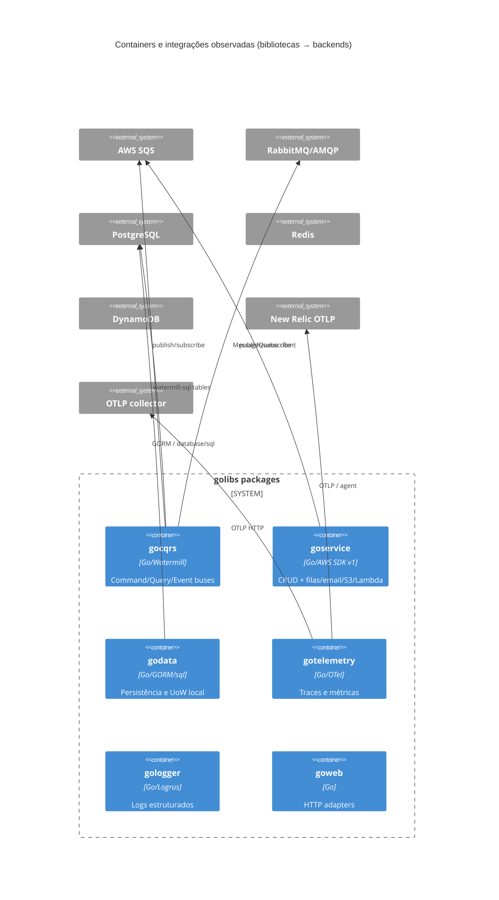
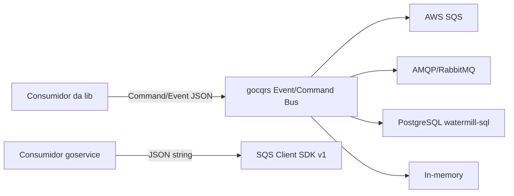
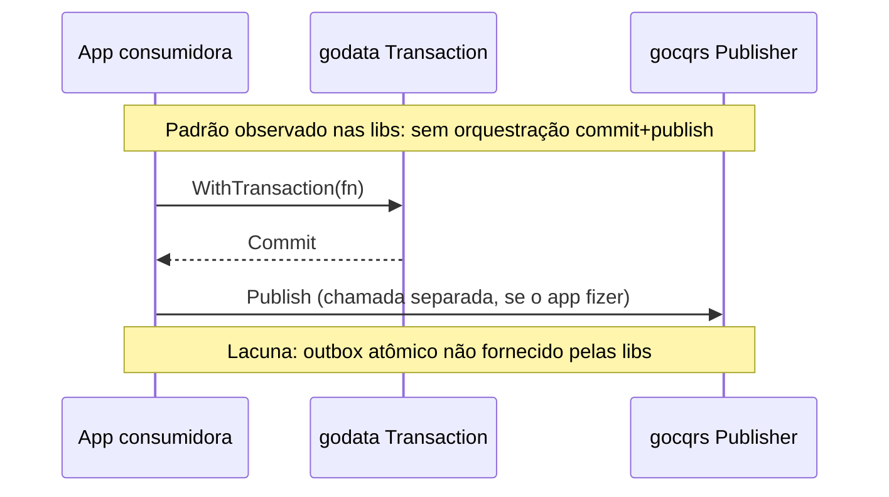

# Inventário AS-IS — golibs

- **Repositório**: `https://gitea.lidercap.com.br/lidercap-apps/golibs.git` (local: `/home/mmanjos/work/repositories/plataform/golibs`)
- **Commit inspecionado**: `9106941` (`91069418dd5111a24050f2f4d0374e00faa27e76`)
- **Data do levantamento**: 2026-08-13
- **Responsável pelo levantamento**: agente (Cursor) sob pedido em `lidercap-platform` / SPEC-K9H204F1
- **Stack**: Go (monorepo Nx + `go.work`; tooling Node só para Nx/release)

## 1. Sumário executivo

- Biblioteca compartilhada Go da organização: **15 módulos** em `packages/*`, workspace Go `1.25.0` (`go.work:1`).
- Não é um serviço de runtime: não há apps, brokers próprios nem topologia de tópicos de produção neste repositório — entrega **kernels/adapters** para consumidores.
- Padrão dominante declarado: Clean Architecture por pacote (`domain` / `ports` / `application` / `infra`) — `CLAUDE.md:69-79`.
- Mensageria concentrada em `gocqrs` (Watermill) com adapters **AMQP, SQS, SQL (PostgreSQL), in-memory**; Kafka aparece só como exemplo de README, sem adapter versionado.
- Segundo caminho de fila: `goservice/infra/aws/sqs` com **AWS SDK v1**, paralelo ao SQS do `gocqrs` (SDK v2 + Watermill).
- Contratos wire: **JSON** no adapter Watermill; **NÃO EXISTE** `.proto`, Buf, AsyncAPI ou Schema Registry neste repo.
- Transação: helpers em `godata` (`database/sql` e GORM); **NÃO EXISTE** outbox/inbox nomeado nem UoW acoplado a publicação.
- Observabilidade: `gotelemetry` (OTel + New Relic) e `gologger` (Logrus, formato alinhado a Pino, correlation ID HTTP); propagação OTLP TraceContext/Baggage no bootstrap.
- Ownership formal: **NÃO EXISTE** `CODEOWNERS`; tags Nx `scope:internal` + `scope:<pkg>`.
- Candidato a piloto: **parcial** — útil como fonte de kernels Go, mas o inventário DMPF precisa de um serviço consumidor para medir E2E.

## 2. Evidências consultadas

- `go.work`, `package.json`, `nx.json`, `.github/workflows/release.yml`
- `CLAUDE.md`, `AGENTS.md`, `docs/CONSUMERS.md`
- `packages/*/go.mod`, `packages/*/README.md`, `packages/*/project.json`
- `packages/gocqrs/**` (domain, ports, infra/watermill/{amqp,sqs,sql,inmemory}, types/policies.go, adapter.go)
- `packages/goservice/ports/storage.go`, `packages/goservice/infra/aws/sqs/client.go`, `packages/goservice/domain/domain.go`
- `packages/godata/infra/persistence/entity.go`, `packages/godata/infra/gorm/transaction.go`
- `packages/goresilience/**` (retry/circuit breaker)
- `packages/gotelemetry/**` (bootstrap OTLP, middleware HTTP, New Relic)
- `packages/gologger/**` (correlation middleware)
- `packages/goweb/domain/http_request.go`, `packages/goweb/infra/swagger/**`
- Buscas: `*.proto`, Kafka/SNS/outbox/inbox/exactly-once/CODEOWNERS (ausências registradas)
- Comandos: `git rev-parse`, listagem de `packages/`, `rg` por eixos DMPF

## 3. Estrutura do repositório

```text
golibs/
├── go.work                 # use + replace dos 15 packages
├── packages/
│   ├── goauth/             # OAuth2/OIDC, JWT, middlewares Gin/Echo
│   ├── gocache/            # Memory / Redis / DynamoDB
│   ├── gocli/              # Cobra CLI
│   ├── goconfig/           # config type-safe
│   ├── gocore/             # utilitários / UUID / crypto helpers
│   ├── gocqrs/             # CQRS + Watermill (mensageria)
│   ├── godata/             # DDD helpers + persistência GORM/sql
│   ├── godi/               # DI (uber/dig)
│   ├── gologger/           # logging estruturado
│   ├── gopipeline/         # pipelines / stages / retry stage
│   ├── goresilience/       # retry, CB, timeout, bulkhead
│   ├── goservice/          # CRUD/business + AWS S3/SQS/SES/Lambda
│   ├── gotelemetry/        # OTel / New Relic
│   ├── govalidation/       # Specification pattern
│   └── goweb/              # HTTP framework-agnostic + Gin/Fiber/Mux
├── docs/                   # CONSUMERS.md, stories/
├── tools/                  # sync go.work
└── .github/workflows/      # release.yml (Nx release em master)
```

`Fato` — árvore e módulos: `go.work:3-18`, listagem de `packages/`.

## 4. Arquitetura observada

`Inferência` (alta confiança): monorepo de **bibliotecas horizontais** com Clean Architecture repetida por pacote; não há bounded context de negócio de produto — o “domínio” de cada lib é o domínio da própria capability (auth, cache, CQRS, etc.).



## 5. Padrões vigentes

### 5.1 Mensageria

**O que existe**

| Item | Evidência | Rótulo |
|------|-----------|--------|
| Broker abstrato via Watermill | `gocqrs` deps: watermill, watermill-amqp, watermill-aws, watermill-sql — `packages/gocqrs/go.mod` | Fato |
| Adapter SQS (SDK v2) | `packages/gocqrs/infra/watermill/sqs/*`; defaults visibility 30s, long poll 20s, max 10 msgs — `sqs/config.go:46-58` | Fato |
| Adapter AMQP/RabbitMQ | `packages/gocqrs/infra/watermill/amqp/config.go:1-55` (exchange topic, durable, reconnect 5s) | Fato |
| Adapter SQL (PostgreSQL) | `packages/gocqrs/infra/watermill/sql/*`; publisher/subscriber Watermill SQL — `sql/event_bus.go:49-72` | Fato |
| Adapter in-memory | `packages/gocqrs/infra/watermill/inmemory/*` | Fato |
| Cliente SQS paralelo (SDK v1) | `packages/goservice/infra/aws/sqs/client.go`; porta `MessageQueue` — `ports/storage.go:46-58` | Fato |
| Formato de mensagem | JSON (`encoding/json`) + metadata `cqrs_*` — `adapter.go:37-107` | Fato |
| Retry de handler CQRS | `types/policies.go:9-32` (MaxRetries default 3) + decorator `infra/decorators/retryable_handler.go` + `goresilience` | Fato |
| Retry genérico de serviço | `goservice/.../service.go:190+` `WithRetry` | Fato |

**O que não existe**

| Item | Rótulo |
|------|--------|
| Adapter Kafka versionado neste repo (só exemplo README `gocqrs/README.md:348+`; `watermill-kafka` **ausente** do `go.mod`) | Fato — NÃO EXISTE no módulo |
| SNS / Kafka como dependência direta | Fato — NÃO EXISTE |
| Política DLQ / poison message explícita no código das libs | Lacuna / NÃO EXISTE (nomeado) |
| Topologia de tópicos de produção (nomes reais upstream/downstream) | Lacuna — libs usam prefixo default `"cqrs"` (`sqs/config.go:50`) |
| Promessa exactly-once E2E em código/docs das libs | Fato — NÃO EXISTE (únicos “exactly one” são comentários de *um handler por command/query* em `command.go`/`query.go`) |



### 5.2 Contratos

| Item | Situação | Rótulo | Evidência |
|------|----------|--------|-----------|
| Protobuf / `.proto` | NÃO EXISTE | Fato | `find` sem resultados |
| Buf / breaking-change check | NÃO EXISTE | Fato | ausência de configs Buf |
| AsyncAPI / OpenAPI de mensagens | NÃO EXISTE para mensageria | Fato | — |
| OpenAPI/Swagger HTTP | Existe suporte em `goweb` | Fato | `packages/goweb/infra/swagger/*`, deps swaggo |
| Contrato de mensagem CQRS | Envelope JSON ad hoc + metadata | Fato | `adapter.go:81-107` |
| Versionamento de contrato de mensagem | Sem schema registry; versionamento do módulo Go via tags Nx `packages/{project}/v{version}` | Fato / Inferência | `nx.json` releaseTagPattern; `docs/CONSUMERS.md` |
| Dono do contrato | Lacuna | Lacuna | sem CODEOWNERS / ADR de contrato |

### 5.3 Transação (UoW)

| Item | Situação | Rótulo | Evidência |
|------|----------|--------|-----------|
| UoW `database/sql` | `TransactionFactory.WithTransaction` commit/rollback/panic | Fato | `godata/infra/persistence/entity.go:104-164` |
| UoW GORM | `GORMTransactionManager.WithTransaction` | Fato | `godata/infra/gorm/transaction.go:9-34` |
| Outbox / Inbox | NÃO EXISTE (termo e padrão) | Fato | busca sem matches de implementação |
| Fronteira commit → publish | NÃO MEDIDO / não padronizado na lib | Lacuna | SQL EventBus persiste mensagens via Watermill-SQL, mas **não** amarra publish ao mesmo `WithTransaction` do godata |
| EventStore (ES) | Interface em ports; store concreto de eventos **não** encontrado além de MessageStore in-memory | Inferência | `ports/event_sourcing.go`; `infra/stores/memory_store.go` |



### 5.4 Observabilidade

| Item | Situação | Rótulo | Evidência |
|------|----------|--------|-----------|
| Tracing / métricas | `gotelemetry` OTel + New Relic + console + noop | Fato | `gotelemetry/README.md`, `go.mod` otel v1.39.0, newrelic agent |
| Propagação HTTP | TraceContext + Baggage | Fato | `infra/bootstrap/otlp/bootstrap.go:102-104` |
| Middleware HTTP tracing | Existe | Fato | `infra/middleware/http_middleware.go` |
| Logging | Logrus; formato alinhado a Pino; correlation ID `X-Correlation-Id` | Fato | `gologger/README.md`; `infra/inbound/http/http_middleware.go:21-29` |
| Logs → OTLP | Deps otlplog em `gologger/go.mod` | Fato | go.mod require otel log exporters |
| Trace no salto assíncrono (SQS/AMQP) | NÃO MEDIDO / sem instrumentação Watermill↔OTel evidente no pacote | Lacuna | sem matches de inject/extract em `gocqrs/infra/watermill` |
| Dashboards / SLOs versionados | NÃO EXISTE no repo | Fato | — |

## 6. Aderência às constraints

| Constraint | Situação | Rótulo | Evidência | Observação |
|---|---|---|---|---|
| Domínio sem I/O | **mista** — adere na maioria; viola em casos de lib | Fato / Inferência | Domínios de `goauth`, `gocache`, `gocqrs`, `godata` etc. sem imports de broker/ORM; `goweb/domain/http_request.go:6` importa `net/http`; `goservice/domain` define `EventPublisher` (porta no domínio) | Em libs de framework, o “domínio” modela HTTP — não é domínio de produto DMPF |
| Protobuf apenas no wire | **não aplicável** (sem Protobuf) | Fato | nenhum `.proto` | Wire atual é JSON |
| At-least-once | **adere por omissão / não contradiz** | Inferência | SQS/Watermill tipicamente at-least-once; sem promessa exactly-once E2E; retry de handler default 3 | Semântica oficial não documentada como NFR da lib; depende do broker + app |

## 7. Inventário técnico

### 7.1 Libs e componentes

| Componente | Versão | Papel | Owner | Fonte do owner | Rótulo |
|---|---|---|---|---|---|
| Workspace Go | 1.25.0 | runtime | Lacuna | `go.work:1` | Fato (versão) / Lacuna (owner) |
| Nx | 22.7.5 | monorepo tasks/release | Lacuna | `package.json` | Fato |
| `@nx-go/nx-go` | 4.0.0 | plugin Go | Lacuna | `package.json` | Fato |
| goauth … goweb (15 pkgs) | package.json `0.0.0`; tags release `packages/<nome>/v*` | kernels internos | Lacuna | `project.json` tags `scope:internal` | Fato / Lacuna |
| Watermill | v1.5.1 (+ amqp/aws/sql) | mensageria CQRS | Lacuna | `gocqrs/go.mod` | Fato |
| aws-sdk-go-v2 / sqs | v1.41.1 / v1.42.21 | SQS no gocqrs | Lacuna | `gocqrs/go.mod` | Fato |
| aws-sdk-go (v1) | v1.55.8 | SQS/S3/SES/Lambda no goservice | Lacuna | `goservice/go.mod` | Fato |
| GORM + postgres | gorm v1.31.1 | persistência | Lacuna | `godata/go.mod` | Fato |
| go-redis | v9.17.2 | cache | Lacuna | `gocache/go.mod` | Fato |
| OTel | v1.39.0 | telemetria | Lacuna | `gotelemetry/go.mod` | Fato |
| New Relic agent | v3.43.3 | telemetria | Lacuna | `gotelemetry/go.mod` | Fato |
| Logrus | v1.9.3 | logging | Lacuna | `gologger/go.mod` | Fato |
| Gin / Echo / Fiber / Mux | várias | HTTP | Lacuna | goauth/goweb/gologger | Fato |

### 7.2 Dependências e integrações

**Upstream (libs dependem de)**

- Brokers/APIs: SQS, AMQP, Redis, DynamoDB, PostgreSQL, AWS S3/SES/Lambda, OTLP/New Relic.
- Frameworks HTTP: Gin, Echo, Fiber, Mux (adapters).

**Downstream (quem depende destas libs)**

- Documentado em `docs/CONSUMERS.md` como padrão de consumo via tags; **lista concreta de serviços consumidores NÃO está neste repo** → Lacuna (squads Go / inventário consolidado).

### 7.3 NFRs e restrições

| Item | Valor observado | Evidência | Rótulo |
|---|---|---|---|
| Go mínimo declarado em badges README | 1.24+ (workspace efetivo 1.25) | READMEs; `go.work` | Fato |
| Registry privado | `gitea.lidercap.com.br/lidercap-apps/*` | `docs/CONSUMERS.md`, `.env` GOPRIVATE | Fato |
| Release | Nx independent versioning em push `master` | `.github/workflows/release.yml` | Fato |
| Broker adotado na org (neste repo) | SQS + AMQP suportados; Kafka só exemplo | adapters + README | Fato / Inferência |
| Segurança | Cliente SQS aceita AccessKey/Secret no builder | `sqs/client.go:389-394` | Fato (capacidade); uso em prod = Lacuna |
| Compliance / SLO | NÃO EXISTE | — | Fato |
| CODEOWNERS | NÃO EXISTE | busca | Fato |

### 7.4 Métricas atuais

| Métrica | Medida hoje? | Onde | Valor de referência | Rótulo |
|---|---|---|---|---|
| Latência E2E messaging | NÃO MEDIDO | — | — | Fato |
| Taxa de retry / DLQ | NÃO MEDIDO | — | — | Fato |
| Hit ratio cache | Capacidade na lib (`gocache` stats) | código da lib | NÃO MEDIDO em produção neste repo | Inferência |
| Traces/metrics export | Capacidade via gotelemetry | OTLP/NR | NÃO MEDIDO (sem dashboard no repo) | Fato |

## 8. Achados fora do escopo priorizado

1. **Dois stacks SQS** (`gocqrs` Watermill+SDK v2 vs `goservice` SDK v1) — risco de divergência de semântica e manutenção. `Fato` — go.mods e paths citados.
2. **Kafka no README sem dependência** — documentação pode induzir suporte que o módulo não empacota. `Fato` — `README.md:348+` vs `go.mod`.
3. **EventStore port sem implementação persistente óbvia** — ES declarado, store in-memory para messages. `Inferência` — `ports/event_sourcing.go` + `infra/stores`.
4. **`goweb/domain` acoplado a `net/http`** — domínio da lib HTTP não é “puro”. `Fato` — `http_request.go:6`.
5. **Sem graphify-out** no momento da inspeção — grafo de conhecimento local não disponível. `Fato`.
6. **`.env` versionado** com GOPRIVATE/GONOSUMDB (sem segredos de cloud no trecho visto) — presença de env no tree. `Fato` — `.env` (valores não reproduzidos aqui).

## 9. Pontos críticos para manutenção

| Área | Risco | Impacto | Evidência | Rótulo |
|---|---|---|---|---|
| Mensageria dual SQS | Duas APIs/comportamentos | Apps escolhem stacks diferentes; inventário DMPF fragmenta | gocqrs vs goservice | Fato |
| Sem outbox na lib | App pode publicar fora da transação | Inconsistência commit/publish | ausência outbox + UoW só em godata | Inferência |
| Sem contrato Protobuf/schema | Evolução JSON ad hoc | Breaking changes silenciosos entre produtores/consumidores | adapter JSON; sem .proto | Fato |
| Ownership ausente | Sem CODEOWNERS | Escalação e accountability do baseline | busca CODEOWNERS | Fato |
| Trace async | Sem bridge Watermill↔OTel visível | Quebra de correlação no salto de fila | ausência em gocqrs watermill | Inferência / Lacuna |

## 10. Candidato a piloto

**Não (como piloto E2E isolado); Sim (como kernel Go de referência).**  
Justificativa: repositório de libs, sem topologia de produção nem métricas E2E — serve de baseline de adapters (CQRS/SQS/AMQP/OTel), mas o piloto DMPF precisa de um serviço consumidor.

## 11. Lacunas e perguntas em aberto

| O que | Por que não foi possível levantar | Quem pode responder |
|---|---|---|
| Lista de serviços que consomem cada package em produção | Não há inventário de consumers no repo | Plataforma / squads Go |
| Owner por package | Sem CODEOWNERS / metadado de time | Eng. Manager / CODEOWNERS futuro |
| Semântica de entrega adotada (ack, DLQ, idempotência) nos serviços | Libs não fixam política de poison/DLQ | Autores gocqrs + times consumidores |
| Uso real de watermill-sql como outbox | Código permite persistência SQL de mensagens, mas não documenta padrão outbox | Autores gocqrs |
| Dashboards New Relic / Grafana atuais | Não versionados aqui | SRE / Observabilidade |
| Decisão Kafka vs SQS vs AMQP na org | Repo suporta SQS+AMQP; Kafka só exemplo | Arquitetura / ARQ-436 |

## 12. Resumo de confiança

| Área | Confiança | Justificativa |
|---|---|---|
| Arquitetura | Alta | Estrutura e docs alinhados; padrão CA repetido |
| Mensageria | Alta (capacidades da lib) / Baixa (topo prod) | Adapters claros; sem topologia real |
| Contratos | Alta | Ausência de Protobuf/schema é verificável |
| Transação | Alta (helpers) / Média (padrão app) | UoW existe; integração publish não padronizada |
| Observabilidade | Alta (API) / Baixa (async + métricas reais) | OTel/NR presentes; bridge fila e dashboards ausentes |
| Ownership | Baixa | Sem CODEOWNERS nem owner declarado |

---

*Gerado para SPEC-K9H204F1 / ARQ-438. Sem TO-BE. Artefato de trabalho em `plans/references/` (fora do versionamento do inventário consolidado).*
