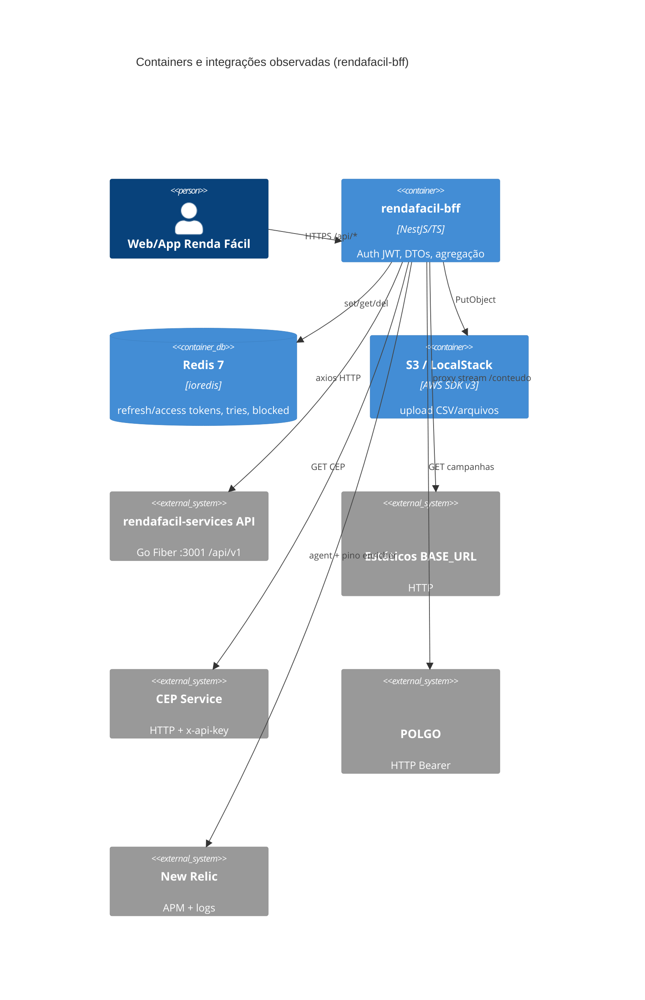
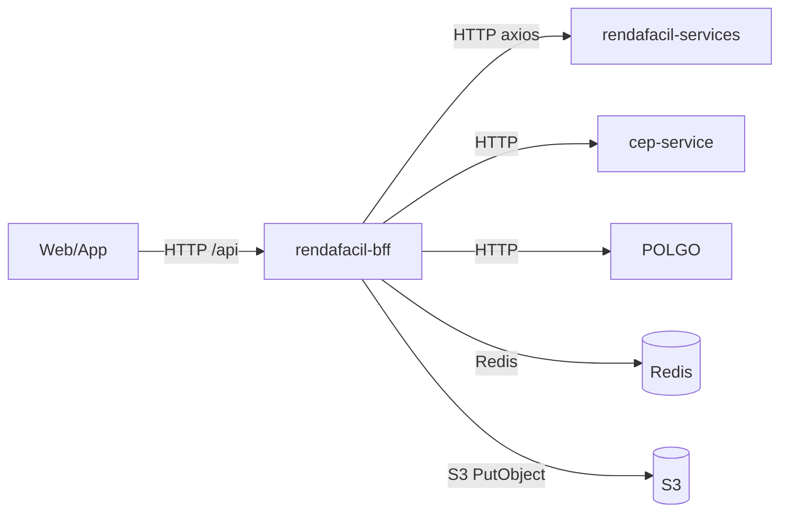

# Inventário AS-IS — rendafacil-bff

- **Repositório**: `git@gitea.lidercap.com.br:lidercap-apps/rendafacil-bff.git` (local: `/home/mmanjos/work/repositories/canais/rendafacil-bff`)
- **Escopo inspecionado**: `src/**` (manifestos raiz, README, Dockerfile, workflows e artifacts citados só como contexto)
- **Commit inspecionado**: `e345066` (`e345066759635dbd9f154b74a834623579e80913`)
- **Data do levantamento**: 2026-08-13
- **Responsável pelo levantamento**: agente (asset `prompt-inventario-repositorio.md` / SPEC-K9H204F1)
- **Stack**: TypeScript / NestJS (`@nestjs/common@12.0.0-alpha.5`, Node imagem Docker `node:20-alpine`)

## 1. Sumário executivo

- `Fato`: BFF NestJS do **Renda Fácil** — fachada entre web/app e a API Go (`rendafacil-services`), estáticos HTTP, Redis e S3 — `README.md:1-11`.
- `Fato`: organização por **feature modules** sob `src/` (~266 `.ts`, ~79 specs, ~27 modules, ~26 controllers, ~25 services); **NÃO EXISTE** pasta `domain/`.
- `Fato`: **NÃO EXISTE** mensageria (SQS/SNS/Kafka/Bull/AMQP/outbox/inbox) em `src/` — busca sem matches; transporte = **HTTP síncrono** (axios direto) + Redis + S3.
- `Fato`: contratos = DTOs Nest + **Swagger** em runtime (`/api/docs`) + coleção Postman; **NÃO EXISTE** `.proto`, AsyncAPI, Buf ou verificação automática de breaking change.
- `Fato`: **NÃO EXISTE** unidade de trabalho / transação de banco no BFF — sem TypeORM/Prisma/Sequelize; persistência local = Redis (tokens/sessão) e upload S3.
- `Fato`: observabilidade = **nestjs-pino** + **New Relic** (`import "newrelic"` em `main.ts:1`, enricher em `app.module.ts`); **NÃO EXISTE** OpenTelemetry no `package.json`.
- `Fato`: ownership formal (`CODEOWNERS`) **NÃO EXISTE**; `package.json` tem `"author": ""`.
- `Fato`: CI ativo aparente = `deploy-stg.yaml`, `deploy-prod.yaml`, `semgrep.yml`; quality-gate/image/build estão como `*.bck`.
- `Fato`: README declara NestJS 11 e health com Redis/API/S3; código usa Nest **12 alpha** e `/health` retorna apenas `{ status: "Ok" }` — descasamento doc ↔ código.
- `Inferência` (alta): candidato a piloto DMPF **fraco** nos eixos mensageria/UoW/Protobuf (não aplicáveis ou ausentes); útil como exemplo de BFF HTTP + sessão Redis, não como piloto do golden path de mensageria.

## 2. Evidências consultadas

- Manifestos: `package.json`, `pnpm-lock.yaml`, `pnpm-workspace.yaml` (só `allowBuilds`), `package-lock.json` (coexistente), `.npmrc`, `tsconfig.json`, `nest-cli.json`, `biome.json`, `Dockerfile`, `docker-compose.yml`, `.env.example`
- Docs: `README.md`, `NEWRELIC.md`, `CORRECAO-TESTES.md`, `.changeset/`
- Bootstrap: `src/main.ts`, `src/app.module.ts`, `src/newrelic.ts`, `src/config/config.module.ts`
- Integrações: `src/redis/redis.service.ts`, `src/s3/s3.service.ts`, `src/cep/cep.service.ts`, `src/promocoes/promocoes.service.ts` (POLGO), `src/auth/auth.service.ts`, `src/products/` (+ `adapters/`)
- Cross-cutting: `src/common/{filters,interceptors,middlewares,utils,helpers,dto,decorators}`
- Saúde: `src/healthcheck/healthcheck.controller.ts`, `src/ping/`
- CI: `.github/workflows/{deploy-stg,deploy-prod,semgrep}.yml` + vários `*.bck`
- Artefatos: `artifacts/postman/Renda Facil - BFF - Nestjs.postman_collection.json`
- Buscas: `sqs|sns|kafka|bullmq|outbox|inbox|exactly-once|dlq|*.proto|typeorm|prisma|opentelemetry|axios|newrelic|Redis|Swagger`
- Comandos: `git rev-parse`, contagem `find src -name '*.ts'|wc -l` (266 / 79 specs / 27 modules)

## 3. Estrutura do repositório

Escopo profundo — árvore simplificada de `src/`:

```text
rendafacil-bff/
├── src/
│   ├── main.ts                 # bootstrap: newrelic, Swagger, ValidationPipe, proxy /conteudo
│   ├── app.module.ts           # LoggerModule (pino+NR), feature modules
│   ├── newrelic.ts             # export config NR (sem newrelic.js na raiz)
│   ├── config/                 # NestConfigModule (.env global)
│   ├── common/                 # filters, interceptors, middlewares, dto, utils, helpers
│   ├── auth/                   # login/refresh, guards JWT/x-token, Redis tokens
│   ├── redis/, s3/             # clientes ioredis e AWS SDK v3
│   ├── cep/, checkout/, comissao/, consulta/, contas-bancarias/
│   ├── content/, policies/, terms/, promocoes/, faq/, reference/
│   ├── products/               # service + adapters (ex.: telesena)
│   ├── pdv/, distribuidor/, qr-code/, relatorio/, selling-link/
│   ├── register/, forgot-password/, get-user/, token/, manutencao/
│   ├── healthcheck/, ping/, notifications/
│   └── types/
├── test/                       # e2e Jest
├── artifacts/postman/          # coleção de contratos manuais
├── scripts/                    # sonar-local.sh, patch-auth-guard-tests.js
├── Dockerfile                  # multi-stage node:20-alpine → :3000
└── docker-compose.yml          # app + redis:7 (porta host 3001→3000)
```

`Fato` — listagem de diretórios e contagens acima.

Contexto fora do corte profundo de lógica: `node_modules/`, locks, `tr.json`, workflows `*.bck`, `.claude/`.

## 4. Arquitetura observada

`Inferência` (alta): **BFF / API Gateway leve** — um processo NestJS que autentica, mapeia DTOs e faz *proxy/agregação* HTTP para upstreams. Não há camada de domínio isolada; regra de negócio permanece majoritariamente na API Go.

`Fato`: módulos Nest por feature (`*.module.ts` + `*.controller.ts` + `*.service.ts` + `dto/` + `mappers/` + `__tests__/`).

`Fato`: cliente HTTP = **axios importado diretamente** nos services (pelo menos 24 arquivos de produção), sem `@nestjs/axios` / `HttpModule` no `package.json`.

`Inferência` (média): o “contrato canônico” do BFF para o front é o conjunto de DTOs + mappers + Swagger; o contrato com a API Go é implícito (URLs montadas com `RENDA_FACIL_API` + `RENDA_FACIL_PREFIX`).



## 5. Padrões vigentes

### 5.1 Mensageria

- `Fato`: **NÃO EXISTE** broker, fila, tópico, consumidor ou produtor assíncrono em `src/` (busca `sqs|sns|kafka|bullmq|amqp|outbox|inbox|dlq` sem matches em código-fonte).
- `Fato`: matches de termos de fila nos lockfiles (`package-lock.json` / `pnpm-lock.yaml`) são transitivos — não indicam uso no BFF.
- `Fato`: comunicação com domínio = **request/response HTTP** via axios.



### 5.2 Contratos

- `Fato`: OpenAPI gerado em runtime por `@nestjs/swagger` — `DocumentBuilder` + `SwaggerModule.setup("docs", ...)` em `src/main.ts:34-98`, prefixo global `api` (`main.ts:32`).
- `Fato`: coleção Postman versionada em `artifacts/postman/Renda Facil - BFF - Nestjs.postman_collection.json` (`README.md:214-215`).
- `Fato`: validação de entrada = `ValidationPipe` global (`whitelist`, `forbidNonWhitelisted`, `transform`) — `main.ts:23-28`.
- `Fato`: **NÃO EXISTE** arquivo `.proto` no repositório (fora `node_modules`).
- `Fato`: **NÃO EXISTE** AsyncAPI, Schema Registry, Buf ou job de compatibilidade de contrato no CI ativo.
- `Inferência` (média): evolução do contrato BFF↔front é manual (Swagger + Postman + DTOs); quebras com a API Go só aparecem em runtime/teste.

### 5.3 Transação (UoW)

- `Fato`: **NÃO EXISTE** ORM ou fronteira transacional de banco no BFF (sem TypeORM/Prisma/etc. em deps e `src/`).
- `Fato`: estado mutável local = Redis (`set`/`setex`/`get`/`del` em `src/redis/redis.service.ts:16-31`) e S3 (`PutObjectCommand` em `src/s3/s3.service.ts:59-66`).
- `Fato`: auth grava `refreshToken:{documento}`, `accessToken:{documento}`, `tries:{doc}`, `blocked:{doc}` — `src/auth/auth.service.ts:68-72`, `250-324`.
- `Fato`: **NÃO EXISTE** outbox/inbox.
- `Inferência` (alta): UoW de negócio (pagamento, comissão, venda) vive no upstream Go; o BFF não participa de commit distribuído.

Não há diagrama commit→publish aplicável (sem publicação assíncrona).

### 5.4 Observabilidade

- `Fato`: logs estruturados via `nestjs-pino` / `LoggerModule.forRoot` com `@newrelic/pino-enricher` — `src/app.module.ts:1`, `44-59`; nível `PINO_LOG_LEVEL`.
- `Fato`: `LoggingInterceptor` global registra método, URL e duração — `src/common/interceptors/logging.interceptor.ts:15-31`.
- `Fato`: New Relic carregado como primeira importação de `main.ts:1`; config exportada em `src/newrelic.ts` (distributed tracing `enabled: true`, exclusão de headers sensíveis).
- `Fato`: **NÃO EXISTE** `newrelic.js` na raiz do repo; `NEWRELIC.md` documenta `newrelic.js`, enquanto `.env.example` usa `NEW_RELIC_NO_CONFIG_FILE` — descasamento doc ↔ artefatos.
- `Fato`: `@newrelic/pino-enricher@1.1.1` marcado **deprecated** no lock (`pnpm-lock.yaml`).
- `Fato`: health = `GET /health` retorna `{ status: "Ok" }` sem checar Redis/API/S3 — `src/healthcheck/healthcheck.controller.ts:31-33` (contrasta `README.md:228`, `273`).
- `Fato`: **NÃO EXISTE** OpenTelemetry / Prometheus client nas dependencies.
- `Lacuna`: valores atuais de APM/SLO no New Relic dashboard — **NÃO MEDIDO** neste levantamento (sem acesso ao painel).

## 6. Aderência às constraints

| Constraint | Situação | Rótulo | Evidência | Observação |
|---|---|---|---|---|
| Domínio sem I/O | não aplicável | Inferência | ausência de `src/**/domain`; services importam `axios`, `ioredis`, AWS SDK | Não há camada de domínio identificável; I/O vive nos services Nest |
| Protobuf apenas no wire | não aplicável | Fato | nenhum `.proto`; wire = JSON HTTP + DTOs | BFF não usa Protobuf |
| At-least-once | não aplicável | Fato | sem broker/consumidor em `src/` | Sem promessa exactly-once E2E no BFF; entrega HTTP síncrona |

## 7. Inventário técnico

### 7.1 Libs e componentes

| Componente | Versão | Papel | Owner | Fonte do owner | Rótulo |
|---|---|---|---|---|---|
| NestJS (`@nestjs/common` etc.) | `12.0.0-alpha.5` | framework HTTP | Lacuna | `package.json` author vazio; sem CODEOWNERS | Fato |
| TypeScript | `5.7.3` | linguagem | Lacuna | idem | Fato |
| axios | `1.16.1` | cliente HTTP upstream | Lacuna | idem | Fato |
| ioredis | `5.11.0` | sessão/tokens | Lacuna | idem | Fato |
| `@aws-sdk/client-s3` | `3.1057.0` | upload S3 | Lacuna | idem | Fato |
| `@aws-sdk/s3-request-presigner` | `3.1057.0` | presign | Lacuna | idem | Fato |
| nestjs-pino / pino | `4.6.1` / `10.3.1` | logging | Lacuna | idem | Fato |
| newrelic | `14.0.0` | APM | Lacuna | idem | Fato |
| `@newrelic/pino-enricher` | `1.1.1` (deprecated) | correlacionar logs↔NR | Lacuna | lock | Fato |
| `@nestjs/swagger` | `12.0.0-alpha.2` | OpenAPI UI | Lacuna | idem | Fato |
| passport-jwt / `@nestjs/jwt` | `4.0.1` / `11.0.2` | auth JWT | Lacuna | idem | Fato |
| class-validator / class-transformer | `0.15.1` / `0.5.1` | validação DTO | Lacuna | idem | Fato |
| Biome | `2.4.16` | lint/format | Lacuna | idem | Fato |
| Jest + `@swc/jest` | `30.4.2` / `0.2.39` | testes | Lacuna | idem | Fato |
| Changesets | `3.0.0-next.5` | versionamento | Lacuna | `.changeset/` | Fato |

Runtime container: `Fato` — `FROM node:20-alpine` (`Dockerfile:1`, `76`); `engines` no `package.json` **NÃO EXISTE**.

### 7.2 Dependências e integrações

**Upstream (este BFF depende de):**

| Integração | Papel | Evidência | Rótulo |
|---|---|---|---|
| API Renda Fácil (Go) | regras/dados | `RENDA_FACIL_API` + `RENDA_FACIL_PREFIX`; axios em dezenas de services | Fato |
| Redis | tokens/bloqueio/tentativas | `REDIS_HOST`/`PORT`; `RedisService` | Fato |
| S3 | arquivos | `S3Service` + env AWS_* (README; parcialmente ausentes em `.env.example`) | Fato |
| BASE_URL (estáticos) | proxy `/conteudo` | `main.ts:143-163` | Fato |
| CEP Service | consulta CEP | `CEP_SERVICE_URL`/`KEY`; `cep.service.ts:38-41` | Fato |
| POLGO | campanhas | `POLGO_BASE_URL`/`TOKEN`; `promocoes.service.ts:195-199` | Fato |
| New Relic | APM/logs | deps + env `NEW_RELIC_*` | Fato |
| Tele Sena (JSON público) | adapter produtos | URL hardcoded em `products/adapters/telesena.adapter.ts` | Fato |

**Downstream (quem depende deste BFF):**

| Consumidor | Evidência | Rótulo |
|---|---|---|
| Front web/app Renda Fácil | `README.md:3-4`, diagramas | Inferência (alta) — app front não está neste repo |
| Deploy ECS STG/PROD | `deploy-stg.yaml` / `deploy-prod.yaml` → `actions-templates` deploy-ecs, ECR `rendafacil-bff` | Fato |

### 7.3 NFRs e restrições

| Item | Valor observado | Evidência | Rótulo |
|---|---|---|---|
| Cloud / deploy | AWS ECS + ECR; OIDC (`id-token: write`) | `deploy-stg.yaml:6-20` | Fato |
| Segurança supply-chain | Semgrep CI em PR | `semgrep.yml` | Fato |
| Auth | JWT bearer + headers `x-token` / `x-token-admin` | Swagger security (`main.ts:51-77`); guards em `src/auth/` | Fato |
| Validação entrada | ValidationPipe estrito | `main.ts:23-28` | Fato |
| Secrets | via env; Docker build com secret `npmrc` | `Dockerfile:61`; `.env.example` | Fato |
| Node runtime | 20 (Docker); README diz Node 20+ | `Dockerfile`, `README.md:94` | Fato |
| Paginação | `PAGE_LIMIT_MIN` documentado no README | `README.md:109,166` — **ausente** em `.env.example` inspecionado | Fato (descasamento) |
| License | Proprietary (Swagger) | `main.ts:47` | Fato |

### 7.4 Métricas atuais

| Métrica | Medida hoje? | Onde | Valor de referência | Rótulo |
|---|---|---|---|---|
| Latência/erro HTTP BFF | Inferência: sim em NR se `NEW_RELIC_ENABLED=1` | New Relic APM | NÃO MEDIDO (sem dashboard) | Lacuna |
| Cobertura de testes | possível via `test:cov` | Jest local/CI | NÃO MEDIDO neste levantamento | Lacuna |
| Health de dependências | NÃO | `/health` stub | NÃO MEDIDO | Fato |
| SLO/SLA versionado no repo | NÃO EXISTE | — | NÃO MEDIDO | Fato |
| Métricas Prometheus | NÃO EXISTE | — | NÃO MEDIDO | Fato |

## 8. Achados fora do escopo priorizado

1. `Fato`: **dois lockfiles** (`pnpm-lock.yaml` + `package-lock.json`) — risco de drift de instalação; Docker usa `pnpm install --frozen-lockfile`.
2. `Fato`: NestJS em **alpha** (`12.0.0-alpha.5`) enquanto README cita NestJS 11 — risco de estabilidade/upgrade.
3. `Fato`: workflows de quality-gate / image-build / push / snapshot / IA review estão **renomeados para `*.bck`** — CI de qualidade aparentemente desativado no path ativo.
4. `Fato`: `docker-compose` publica app em host **3001→3000**, mesma porta padrão documentada da API Go (`3001`) — potencial colisão local (`docker-compose.yml:6-7` vs `README.md:96`).
5. `Fato`: README descreve chave Redis `session:{sub}`; código usa `refreshToken:` / `accessToken:` / `tries:` / `blocked:` — doc desatualizada (`README.md:242` vs `auth.service.ts`).
6. `Fato`: `.env.example` omite várias vars documentadas no README (`AWS_*`, `S3_BUCKET_NAME`, `POLGO_*`, `FILE_SECRET_KEY`, `PAGE_LIMIT_MIN`, `INERNAL_TOKEN`).
7. `Fato`: URL de staging Tele Sena **hardcoded** no adapter (`telesena.adapter.ts`) — acoplamento de ambiente no código.
8. `Fato`: `sonar-project.properties` **NÃO EXISTE** na raiz (README cita; script `scripts/sonar-local.sh` existe).
9. `Inferência` (média): tipagem frouxa frequente (`Promise<any>`, `s3Config: any`) — dívida que afeta manutenibilidade, não os eixos DMPF de mensageria.

## 9. Pontos críticos para manutenção

| Área | Risco | Impacto | Evidência | Rótulo |
|---|---|---|---|---|
| Contrato implícito com API Go | Quebra silenciosa de payload/URL | Front e BFF quebram juntos em runtime | axios + strings de path nos services | Inferência (alta) |
| Auth/sessão só em Redis | Indisponibilidade Redis = login/refresh falham | Interrupção de canal | `RedisService` + `auth.service.ts` | Fato |
| Nest alpha + dual lockfile | Builds não reproduzíveis / regressões | Deploy e onboarding | `package.json`, locks | Fato |
| CI quality em `.bck` | Regressões sem gate automático | Qualidade | `.github/workflows/*` | Fato |
| Health stub | Orquestrador marca healthy sem deps | Tráfego para instância degradada | `healthcheck.controller.ts:31-33` | Fato |
| Ownership ausente | Sem CODEOWNERS/author | Escalação e review | ausência de `CODEOWNERS` | Fato |

## 10. Candidato a piloto

**Não** (rascunho): BFF sem mensageria, sem UoW/outbox e sem Protobuf — pouco exercício das constraints centrais do golden path DMPF; melhor como consumidor/fronteira HTTP do piloto na API Go (`rendafacil-services`).

## 11. Lacunas e perguntas em aberto

| O que | Por que não foi possível levantar | Quem pode responder |
|---|---|---|
| Time owner / CODEOWNERS | Arquivo e campo author ausentes | Plataforma / donos do canal Renda Fácil |
| SHA completo estável vs tags de release | Apenas SHA curto do working tree local | Release/CI |
| Métricas NR reais (p95, error rate) | Sem acesso ao dashboard | Ops / New Relic admin |
| Se `src/newrelic.ts` é de fato carregado em prod | Não há `newrelic.js`; depende de `NEW_RELIC_NO_CONFIG_FILE` e layout do artefato ECS | Time que mantém task definition |
| Front(s) exatos e versões de contrato | Fora deste repositório | Time frontend Renda Fácil |
| Estado real dos workflows `.bck` (temporário vs abandonado) | Só nomes de arquivo | Time DevOps canal |

## 12. Resumo de confiança

| Área | Confiança | Justificativa |
|---|---|---|
| Arquitetura | Alta | README + `app.module` + padrão controller/service/axios consistente |
| Mensageria | Alta | Ausência confirmada por busca em `src/` e deps |
| Contratos | Alta | Swagger + DTOs + Postman observados; sem proto |
| Transação | Alta | Sem ORM; Redis/S3 claros |
| Observabilidade | Média | Código NR/pino claros; efetividade em prod e wiring de config NR não verificados no runtime |
| Ownership | Baixa | Sem CODEOWNERS nem author preenchido |
