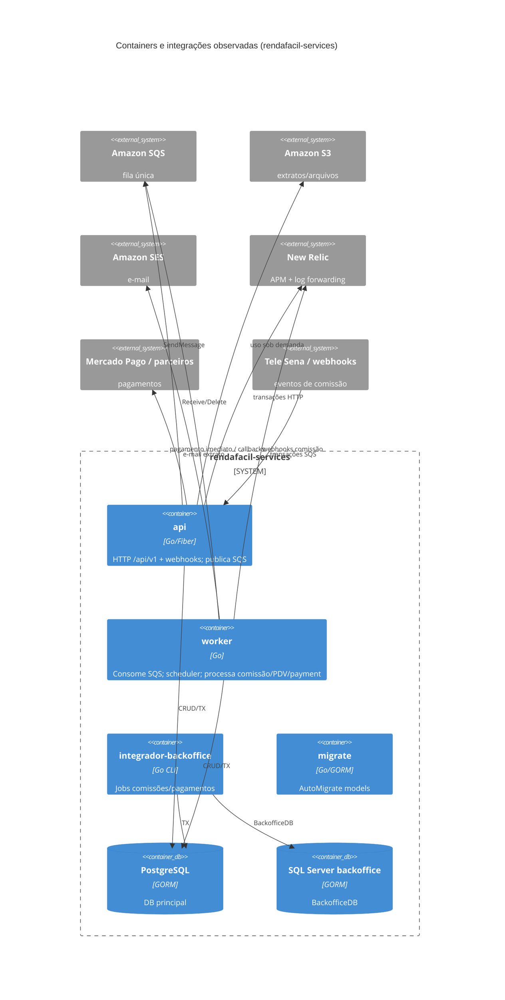
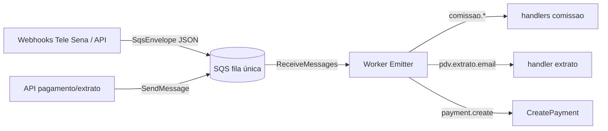
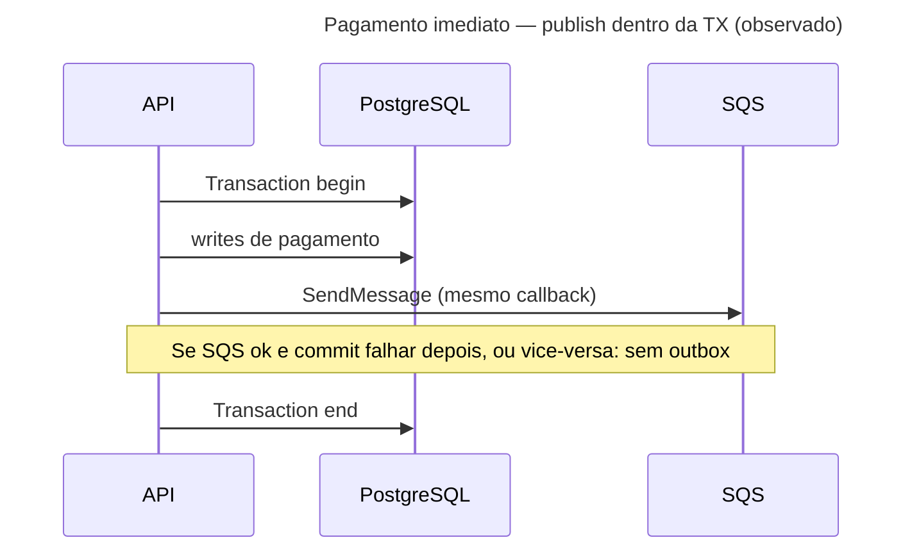

# Inventário AS-IS — rendafacil-services

- **Repositório**: `git@gitea.lidercap.com.br:lidercap-apps/rendafacil-services.git` (local: `/home/mmanjos/work/repositories/canais/rendafacil-services`)
- **Escopo inspecionado**: `apps/**`, `pkg/**`, `migrations/**`, `scripts/**` (manifestos raiz e docs citados só como contexto)
- **Commit inspecionado**: `78886b1` (`78886b1752574d92b25d45ca3c3a84db8d3817d0`)
- **Data do levantamento**: 2026-08-13
- **Responsável pelo levantamento**: agente (asset `prompt-inventario-repositorio.md` / SPEC-K9H204F1)
- **Stack**: Go (`go 1.24.0`, módulo único `rendafacil-services`)

## 1. Sumário executivo

- `Fato`: serviço de afiliados **Renda Fácil** (Tele Sena) modernizado de JS+MSSQL procedures para **Go + PostgreSQL**, com regras na aplicação — `README.md:1-34`.
- `Fato`: quatro binários em `apps/`: **api** (Fiber HTTP), **worker** (consumidor SQS + scheduler), **integrador-backoffice** (CLI/jobs contra Postgres e SQL Server backoffice), **migrate** (GORM AutoMigrate).
- `Fato`: mensageria = **uma fila SQS** multiplexada por campo JSON `event`; cliente em `pkg/sqs` (AWS SDK **v1**); produtores na API, consumidor no worker.
- `Fato`: contratos wire assíncronos = envelope JSON ad hoc (`SqsEnvelope`); HTTP documentado via **Swagger/swag**; **NÃO EXISTE** `.proto`, AsyncAPI, Buf ou Schema Registry no escopo.
- `Fato`: transação = `gorm.DB.Transaction` / `Begin`/`Commit` locais; **NÃO EXISTE** outbox/inbox nomeado; há caso de `SendMessage` **dentro** da callback de `Transaction` (pagamento imediato).
- `Fato`: observabilidade = **New Relic APM** + Logrus JSON (`nrlogrus`); **NÃO EXISTE** OpenTelemetry no `go.mod` / código do escopo.
- `Fato`: pasta `migrations/` contém apenas `migration.log` (histórico de AutoMigrate); evolução de schema é código em `apps/migrate` + models em `pkg/database/models` (~68 arquivos).
- `Fato`: **NÃO EXISTE** pasta `domain/` nem camada de domínio isolada; módulos seguem `controller` / `features` / `repository` / `dto`.
- `Fato`: ownership formal (`CODEOWNERS`) **NÃO EXISTE**; README lista autores por e-mail (`README.md` seção Autores).
- `Inferência` (média): candidato a piloto DMPF **forte** no eixo mensageria SQS at-least-once real, porém longe do golden path (sem domínio puro, sem Protobuf, publish acoplado a TX).

## 2. Evidências consultadas

- Manifestos: `go.mod`, `go.sum`, `README.md`, `NEWRELIC.md`, `.github/workflows/` (listagem)
- Apps: `apps/api/main.go`, `apps/api/infra/server/setup.go`, módulos `comissao`, `pdv`, `vendas`, `vendedor`, `qr_code`, `conta_bancaria`, `usuarios`, `relatorios`, `pedido_extrato*`, docs Swagger
- Worker: `apps/worker/main.go`, `events/{consumer,emitter,processor,context}.go`, `modules/{comissao,pdv,payments}`, `scheduler/`
- Integrador: `apps/integrador-backoffice/main.go`, `commands/`, `jobs/`, `services/`, `integrations/`
- Migrate: `apps/migrate/main.go`, `apps/migrate/README.md`
- Pkg: `pkg/sqs/connection.go`, `pkg/s3/connection.go`, `pkg/AWS/`, `pkg/database/connection.go`, `pkg/database/models/`, `pkg/database/node/`
- Scripts: `scripts/localstack-init.sh`, `scripts/localstack-init.ps1`, `scripts/generate-swagger.sh`
- Migrations: `migrations/migration.log`
- Buscas: `sqs|sns|kafka|outbox|inbox|exactly-once|dlq|Transaction|newrelic|opentelemetry|*.proto`
- Comandos: `git rev-parse`, `find`/`rg` sob o escopo; contagem ~426 arquivos `.go` em `apps`+`pkg`

## 3. Estrutura do repositório

Escopo deste relatório — árvore simplificada:

```text
rendafacil-services/
├── apps/
│   ├── api/                    # HTTP Fiber :3001
│   │   ├── infra/              # server, middleware, validation
│   │   ├── modules/            # bancos, comissao, conta_bancaria, health,
│   │   │                       # pdv, pedido_extrato*, produto, qr_code,
│   │   │                       # relatorios, shared, termos, usuarios,
│   │   │                       # vendas, vendedor
│   │   ├── docs/               # swagger gerado (também apidocs/ na raiz)
│   │   └── pkg/pagination/
│   ├── worker/                 # consumidor SQS + cron/scheduler
│   │   ├── events/             # consumer, emitter, processor
│   │   ├── modules/            # comissao, payments, pdv
│   │   └── scheduler/
│   ├── integrador-backoffice/  # CLI: comissões/pagamentos ↔ backoffice
│   │   ├── commands/, jobs/, services/, integrations/
│   └── migrate/                # AutoMigrate GORM
├── pkg/
│   ├── AWS/                    # SES/email templates; client AWS
│   ├── database/               # Connect Postgres + Backoffice SQL Server; models; node/
│   ├── enums/, errors/, excel/, parceiros/, utils/
│   ├── s3/                     # cliente S3 (SDK v1)
│   └── sqs/                    # cliente SQS (SDK v1)
├── migrations/                 # apenas migration.log
└── scripts/                    # swagger + bootstrap LocalStack (SQS/SES)
```

`Fato` — listagem de diretórios e contagem de models/arquivos Go.

Contexto fora do corte profundo: `Artifacts/`, `apidocs/`, `docker-compose.yml`, `tests/`, Dockerfiles, workflows CI.

## 4. Arquitetura observada

`Inferência` (alta): monólito modular multi-binário — API síncrona, worker assíncrono na mesma fila, integrador batch/CLI e migrate separado. Organização por **feature folders** (`modules/<bounded-ish>`), não Clean Architecture com domínio isolado.

`Fato`: não há diretório `domain/` sob `apps` ou `pkg` (busca por pasta `domain` vazia).

`Inferência` (média): o “domínio” de negócio vive misturado em `features`, `repository` e models GORM (`pkg/database/models`), com DTOs de API como contrato HTTP.



## 5. Padrões vigentes

### 5.1 Mensageria

**O que existe**

| Item | Detalhe | Rótulo | Evidência |
|---|---|---|---|
| Broker | Amazon SQS | Fato | `pkg/sqs/connection.go:13-19`, `70-89` |
| Fila | Uma `QueueURL`/`SQS_QUEUE_NAME` (dev LocalStack: `rendafacil-services-queue-dev`) | Fato | `pkg/sqs/connection.go:72-85`; `scripts/localstack-init.sh:13-18` |
| Formato | JSON `{ "event": "<nome>", "data": <T> }` (`SqsEnvelope`) | Fato | `apps/api/modules/comissao/dto/sqs.dto.go:3-7` |
| Produção | API enfileira após webhook/feature | Fato | `distribuir_webhook.go:75-89`; `provisionamento_webhook.go`; `pagamento-imediato.features.go:220-234`; `distribuidor_consultar.go:281+` |
| Consumo | Worker long-poll 10 msgs / 20s | Fato | `apps/worker/events/consumer.go:28-29` |
| Roteamento | `Emitter.Register` por nome de evento | Fato | `emitter.go:27-36`; `comissao/events.go:8-13` |
| Retry | `ErrReprocessar` → **não** deleta mensagem (volta após visibility) | Fato | `consumer.go:77-79`; `apps/worker/infra/utils/erros.go:6` |
| Erro definitivo | qualquer outro `err` → **deleta** mensagem | Fato | `consumer.go:80-84` |
| Sucesso | deleta mensagem | Fato | `consumer.go:85-89` |

Eventos registrados observados (`Fato`):

| Evento | Origem típica |
|---|---|
| `comissao.telesena.distribuir` | webhook distribuir |
| `comissao.telesena.estornar` | webhook distribuir (REFUNDED) |
| `comissao.telesena.provisionamento.reprocessar` | webhook provisionamento |
| `comissao.pagamento.imediato` | feature pagamento imediato |
| `comissao.telesena.imediato.callback` | callback MP |
| `pdv.extrato.email` | consulta extrato PDV |
| `payment.create` | módulo payments (worker) |

**O que NÃO EXISTE** (no escopo): SNS, Kafka, RabbitMQ, Watermill, DLQ/código de dead-letter, `ChangeMessageVisibility`, política de exactly-once, Schema Registry.



`Inferência` (média): sem DLQ explícita no código, mensagens com falha “definitiva” são descartadas (delete); falhas `ErrReprocessar` dependem do visibility timeout da fila (config AWS, não versionada no escopo).

### 5.2 Contratos

| Tipo | Situação | Rótulo | Evidência |
|---|---|---|---|
| Protobuf | **NÃO EXISTE** | Fato | `find *.proto` vazio |
| AsyncAPI / schema fila | **NÃO EXISTE** | Fato | busca sem arquivos |
| Envelope SQS | structs Go + JSON tags; sem versionamento de schema | Fato | `sqs.dto.go` |
| OpenAPI HTTP | Swagger via swag (`apps/api/docs`, `apidocs/`, script `generate-swagger.sh`) | Fato | `scripts/generate-swagger.sh:19`; `apps/api/main.go` anotações |
| Compatibilidade breaking | **NÃO EXISTE** verificação automática | Lacuna | quem opera o contrato de fila é o time (README Autores) |
| Owner do contrato | não declarado formal | Lacuna | sem CODEOWNERS |

### 5.3 Transação (UoW)

**O que existe**

- Fronteira local via GORM: `database.DB.Transaction(...)`, `Begin`/`Commit`/`Rollback` em repositórios e controllers (`comissao`, `pdv`, `qr_code`, `conta_bancaria`, `vendas`, `usuarios`, worker `comissao.repositories`, integrador `services`).
- Dois bancos: Postgres (`DB`) e SQL Server backoffice (`BackofficeDB`) — `pkg/database/connection.go:62-67`, `269+`; integrador usa `BackofficeDB.Transaction` em `backoffice-pagamentos.service.go`.

**O que NÃO EXISTE**

- Outbox / inbox / transactional messaging nomeados.
- UoW compartilhado API↔worker além do estado no Postgres.

**Commit × publicação**



`Fato`: em `pagamento-imediato.features.go`, o `return client.SendMessage(...)` ocorre **dentro** do `repository.Transaction` (trecho ~linha 234 no callback).

`Inferência` (alta): webhooks `distribuir` / `provisionamento` publicam SQS **sem** TX de domínio prévia (apenas parse + enqueue) — `distribuir_webhook.go:45-89`.

### 5.4 Observabilidade

| Capacidade | Situação | Rótulo | Evidência |
|---|---|---|---|
| APM | New Relic go-agent v3 | Fato | `go.mod` require; `apps/api/main.go:167-176`; `apps/worker/main.go:106-115` |
| Logs | Logrus JSON; `nrlogrus` quando NR ativo | Fato | `main.go` api/worker |
| Trace HTTP | NR transaction por path | Fato | `apps/api/infra/server/setup.go` (StartTransaction) |
| Trace SQS | NR transaction `SQS: ProcessMessage` + atributos | Fato | `consumer.go:46-53`; `processor.go:34-36` |
| OTel | **NÃO EXISTE** | Fato | sem deps/código OTel no escopo |
| Propagação E2E assíncrona | NR context no consume; **sem** injection explícita de headers W3C/NR no `SendMessage` | Inferência | `SendMessage` só envia body string (`connection.go:91-96`) |
| Flag NR | código habilita se `NEW_RELIC_ENABLED == "1"` | Fato | `apps/api/main.go:166-167` |
| Doc NR | `NEWRELIC.md` afirma semântica invertida (`true` desativa) | Fato | `NEWRELIC.md:48-53` vs código — **descasamento doc/código** |

Métricas de produto/SLO versionadas no repo: **NÃO MEDIDO** / **NÃO EXISTE** no escopo.

## 6. Aderência às constraints

| Constraint | Situação | Rótulo | Evidência | Observação |
|---|---|---|---|---|
| Domínio sem I/O | viola / não aplicável (sem camada domínio) | Inferência + Fato | ausência de `domain/`; features/repos importam GORM, SQS, HTTP | Não há fronteira domínio↔infra para auditar imports |
| Protobuf apenas no wire | não aplicável | Fato | zero `.proto` | Wire async/HTTP é JSON |
| At-least-once | adere (de fato) | Inferência | delete só após sucesso ou erro “definitivo”; `ErrReprocessar` reentrega | Sem promessa exactly-once no código; risco de reprocessamento e de perda em delete-on-error |

## 7. Inventário técnico

### 7.1 Libs e componentes

| Componente | Versão | Papel | Owner | Fonte do owner | Rótulo |
|---|---|---|---|---|---|
| Go | 1.24.0 | runtime | Lacuna formal | `go.mod:3` | Fato (versão) |
| Fiber | v2.52.10 | HTTP API | — | `go.mod` | Fato |
| GORM | v1.31.1 | ORM / TX | — | `go.mod` | Fato |
| gorm postgres | v1.6.0 | driver PG | — | `go.mod` | Fato |
| gorm sqlserver | v1.6.3 | backoffice | — | `go.mod` | Fato |
| aws-sdk-go (v1) | v1.55.8 | SQS + S3 | — | `go.mod:102`; `pkg/sqs`, `pkg/s3` | Fato |
| aws-sdk-go-v2 | v1.41.0 (+ ses, lambda, config) | SES/Lambda/creds | — | `go.mod` | Fato |
| newrelic go-agent | v3.42.0 | APM | — | `go.mod` | Fato |
| logrus | v1.9.3 | logging | — | `go.mod` | Fato |
| swaggo/swag | v1.16.6 | OpenAPI gen | — | `go.mod` | Fato |
| excelize | v2.10.1 | export Excel | — | `go.mod` | Fato |
| `pkg/sqs` | interno | cliente fila | autores README | README Autores | Inferência |
| `pkg/database` | interno | conexão + models | idem | README | Inferência |

### 7.2 Dependências e integrações

**Upstream (de quem depende)**

- PostgreSQL (principal)
- SQL Server (backoffice, integrador)
- Amazon SQS, S3, SES (LocalStack em dev via scripts)
- New Relic
- Mercado Pago / APIs de pagamento (handlers/services comissão)
- Webhooks Tele Sena (entrada)
- OAuth/APIs backoffice (`integrador-backoffice/integrations`)

**Downstream (quem depende dele)** — `Lacuna`: consumidores externos da API (apps mobile/web BFF) não estão neste repositório; há referência a `rendafacil-bff` no workspace multi-root, não inspecionada aqui.

### 7.3 NFRs e restrições

| Item | Valor observado | Evidência | Rótulo |
|---|---|---|---|
| Banco alvo declarado | PostgreSQL (migração de MSSQL legado) | `README.md:1-34` | Fato |
| Broker adotado | SQS | código + LocalStack scripts | Fato |
| Porta API | `:3001` | `apps/api/main.go:237` | Fato |
| NR obrigatório em production | fatal se init falha e `ENV=production` | `apps/api/main.go:179-181` | Fato |
| SSL DB | `sslmode=disable` no DSN | `connection.go:286` | Fato |
| Dual AWS SDK | v1 (SQS/S3) + v2 (SES/Lambda) | `go.mod` + imports | Fato |
| Sem CODEOWNERS | ownership informal | ausência de arquivo | Fato |

### 7.4 Métricas atuais

| Métrica | Medida hoje? | Onde | Valor de referência | Rótulo |
|---|---|---|---|---|
| Latência API / worker | presumível no New Relic | dashboard NR (fora do repo) | NÃO MEDIDO neste levantamento | Lacuna |
| Taxa de erro SQS / DLQ depth | NÃO MEDIDO | — | NÃO MEDIDO; DLQ **NÃO EXISTE** no código | Fato/Lacuna |
| Lag de fila | NÃO MEDIDO | — | NÃO MEDIDO | Lacuna |
| SLO documentado | NÃO EXISTE no escopo | — | — | Fato |

## 8. Achados fora do escopo priorizado

1. `Fato` — **Descasamento NEWRELIC.md × código**: doc diz `NEW_RELIC_ENABLED=true` desativa; código só ativa com `"1"`. Impacta operação e onboarding.
2. `Fato` — **README do migrate** aponta `cmd/migrate/main.go`; binário real é `apps/migrate/main.go`.
3. `Fato` — **SDK AWS duplicado** (v1 e v2) aumenta superfície e inconsistência de config (LocalStack paths diferentes).
4. `Fato` — `GetSQSQueueURL` em helper de comissão monta URL com account id hardcoded `157274943963` (`apps/api/modules/comissao/helpers/common.helpers.go:43`) — paralelo ao `pkg/sqs` via env.
5. `Fato` — Inicialização S3 na API está **comentada** (`apps/api/main.go:227-231`), mas pacote e usos em PDV/extrato existem.
6. `Inferência` — Delete-on-error no consumer pode **descartar** mensagens com bug/transitório mal classificado (sem DLQ).
7. `Fato` — `migrations/` não versiona SQL incremental; schema = AutoMigrate + log local.
8. `Fato` — Workflows CI: vários `*.bck` e `semgrep.yml` / `deploy-*.yaml` em `.github/workflows` (fora do escopo profundo, mas indica pipeline parcialmente arquivado).

## 9. Pontos críticos para manutenção

| Área | Risco | Impacto | Evidência | Rótulo |
|---|---|---|---|---|
| Publish dentro de TX | inconsistência commit↔fila | comissão/pagamento duplicado ou perdido | `pagamento-imediato.features.go` SendMessage in Transaction | Fato |
| Sem DLQ / delete on error | perda de evento | reprocessamento manual difícil | `consumer.go:80-84` | Fato |
| Contrato fila só em código | drift produtor/consumidor | eventos “não registrados” | `emitter.go:33-34` | Fato |
| Sem camada domínio | acoplamento GORM/SQS nas features | custo alto para golden path DMPF | estrutura modules | Inferência |
| Doc NR invertida | observabilidade “desligada” por engano | buraco de telemetria | `NEWRELIC.md` vs mains | Fato |
| Dual DB + integrador | acoplamento legado MSSQL | falhas de sync comissões | `BackofficeDB` | Fato |

## 10. Candidato a piloto

**Sim (parcial/forte no eixo SQS)** — já exerce producer/consumer SQS at-least-once com New Relic no salto assíncrono; porém exige esforço alto para constraints de domínio/Protobuf/outbox. Rascunho: decisão formal em `SPEC-VVR1X71Q`.

## 11. Lacunas e perguntas em aberto

| O que | Por que não foi possível levantar | Quem pode responder |
|---|---|---|
| Visibility timeout, redrive policy, DLQ na AWS | só código/scripts locais; IaC da fila não no escopo | time ops / autores README |
| Dashboards/SLO New Relic e valores atuais | credenciais/UI fora do repo | plataforma observabilidade |
| Consumidores HTTP (BFF/apps) e contratos de versão API | fora do escopo `apps/pkg/migrations/scripts` | time Canais / `rendafacil-bff` |
| Ownership de squad oficial | sem CODEOWNERS / service catalog | liderança Canais |
| Se `payment.create` ainda é produzido em produção | registro no worker; produtores pouco evidentes neste corte | autores módulo payments |
| Política real de idempotência de comissão | há logs/models de mensageria; não auditado fluxo a fluxo | time comissão |

## 12. Resumo de confiança

| Área | Confiança | Justificativa |
|---|---|---|
| Arquitetura | Alta | Estrutura multi-app clara; ausência de domain confirmada |
| Mensageria | Alta | Cliente, consumer, eventos e envelope lidos com âncora |
| Contratos | Alta | Swagger presente; proto/AsyncAPI ausentes |
| Transação | Média | Muitos usos GORM; padrão commit↔publish amostrado (pagamento imediato), não todos os fluxos |
| Observabilidade | Média-Alta | Código NR claro; métricas/SLO e dashboards não medidos; doc divergente |
| Ownership | Baixa | Só lista de autores no README; sem CODEOWNERS |
