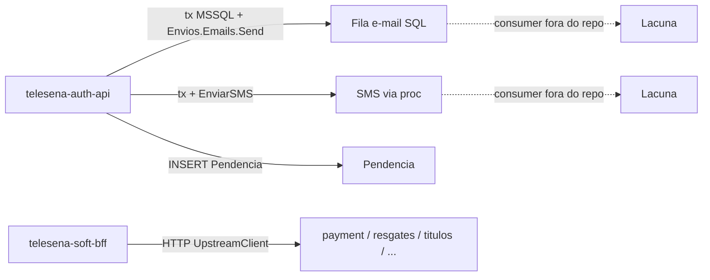
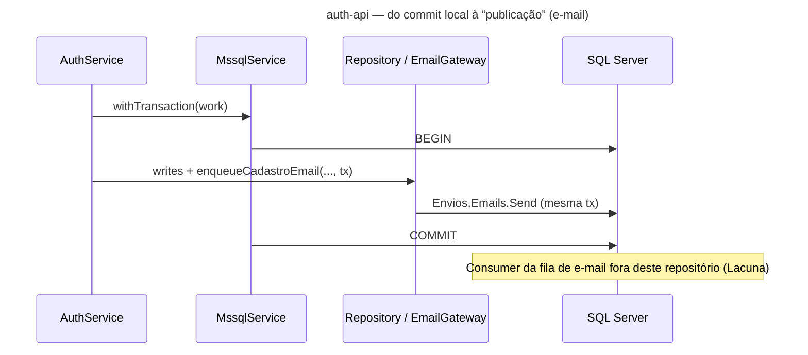

# Inventário AS-IS — telesena-monorepo (apps + libs)

- **Repositório**: `git@gitea.lidercap.com.br:lidercap-apps/telesena-monorepo.git` (local: `/home/mmanjos/work/repositories/modernização/auth/telesena-monorepo`)
- **Escopo inspecionado**: `apps/**`, `libs/**` (manifestos raiz, ADRs e README citados só como contexto)
- **Commit inspecionado**: `4a9c659` (`4a9c6591417d37803e0ed8622a9efd8abf3e6031`)
- **Data do levantamento**: 2026-08-13
- **Responsável pelo levantamento**: agente (asset `prompt-inventario-repositorio.md` / SPEC-K9H204F1)
- **Stack**: TypeScript / Node.js (NestJS)

## 1. Sumário executivo

- `Fato`: monorepo Nx focado em backend Tele Sena — duas apps NestJS (`telesena-auth-api`, `telesena-soft-bff`) + dois projetos e2e placeholder + 6 libs ativas sob `@telesena-monorepo/*` (`package.json:44-48`, `pnpm-workspace.yaml:1-4`, `libs/**/package.json`).
- `Fato`: `telesena-auth-api` autentica (login, 2FA, OTP, termos, atendimento e-mail) contra **SQL Server** via driver `mssql@11.0.1`, com transações manuais `withTransaction` (`apps/telesena-auth-api/package.json:17`, `mssql.service.ts:41-56`).
- `Fato`: `telesena-soft-bff` é BFF proxy HTTP 1:1 para 6 upstreams, documentado em ADR-005 e README do app (`docs/adr/005-port-nestjs-bff.md`, `apps/telesena-soft-bff/README.md`).
- `Fato`: **não há** broker de mensageria (Kafka/Rabbit/SQS/BullMQ/NATS/`@nestjs/microservices`) em `apps/**` nem `libs/**` — busca por esses termos retornou zero ocorrências relevantes.
- `Fato`: assíncrono no auth-api é via **stored procedures SQL** (`Envios.Emails.Send`, `TSVirtual.Notificacoes.EnviarSMS`) dentro da mesma transação MSSQL — não outbox/inbox (`email.gateway.ts:17-23`).
- `Fato`: contratos wire formais (`.proto`, OpenAPI/AsyncAPI YAML versionados) **NÃO EXISTEM** no escopo; Swagger é gerado em runtime; soft-bff tem contract tests Jest + `@telesena-monorepo/backend-contracts`.
- `Fato`: observabilidade assimétrica — soft-bff com Pino + New Relic + health de upstreams; auth-api com `Logger` Nest + correlation ALS, sem APM/OTEL.
- `Fato`: libs são infra transversal (auth JWT, HTTP client com retry/CB, health, observability NR, contracts TS, money) — sem camada `domain/` isolada e sem helpers de UoW/outbox.
- `Fato`: ownership (`CODEOWNERS`) **NÃO EXISTE** no repositório.
- `Inferência` (média): do ponto de vista DMPF, este corte é **HTTP síncrono + SQL legado**, com paridade de rotas BFF como eixo de qualidade — não um sistema event-driven.

## 2. Evidências consultadas

- Manifestos: `package.json` (raiz), `pnpm-workspace.yaml`, `nx.json`, `tsconfig.base.json`, `apps/*/package.json`, `libs/**/package.json`, Dockerfiles das apps
- Docs: `README.md`, `CONTRIBUTING.md`, `AGENTS.md`, `docs/adr/001`–`006`, READMEs de apps e libs
- Apps: `telesena-auth-api/src/**` (mssql, auth, atendimento, terms, filters, common), `telesena-soft-bff/src/**` (modules, services, interceptors, newrelic-preload, contract specs), `*-e2e/**`
- Libs: `backend-{auth,contracts,health,http-client,observability}`, `shared-money` (exports, ports, retry-policy, route-protection.registry)
- Buscas: `kafka|bullmq|sqs|outbox|opentelemetry|exactly-once|.proto|CODEOWNERS` em `apps`/`libs`
- Comandos: `git rev-parse HEAD`; `find` de `package.json` e `.proto`; `rg` ancorado
- `graphify-out/graph.json`: **NÃO EXISTE** (pasta `graphify-out/` presente só com `cache`)

## 3. Estrutura do repositório

Escopo deste relatório — árvore simplificada:

```text
apps/
├── telesena-auth-api/          # NestJS — auth + MSSQL
├── telesena-auth-api-e2e/      # Jest e2e (boilerplate)
├── telesena-soft-bff/          # NestJS — BFF proxy
└── telesena-soft-bff-e2e/      # Jest e2e (it.todo)
libs/
├── backend/
│   ├── auth/                   # JWT HS256 + guard
│   ├── contracts/              # envelopes + ROUTE_PROTECTION_REGISTRY + testing/
│   ├── health/                 # Terminus liveness/readiness
│   ├── http-client/            # UpstreamClient + retry + circuit breaker
│   └── observability/          # ObservabilityPort → New Relic | Noop
├── frontend/                   # placeholders (.gitkeep) — sem pacote Nx
│   ├── angular/src/
│   └── ui/src/
└── shared/
    └── money/                  # Money VO + MoneyService (decimal.js)
```

Contexto monorepo (fora do escopo de implementação inventariada em profundidade): `docs/adr/`, `.github/workflows/`, `tools/`, `go.work` (sem módulos Go no escopo apps/libs).

`Fato`: README raiz lista só soft-bff e omite `telesena-auth-api` e `backend-health` (`README.md` árvore) — descompasso doc×código.

## 4. Arquitetura observada

`Inferência` (média): duas arquiteturas colocalizadas no monorepo:

1. **auth-api** — Nest modular por feature, regra e SQL colocalizados (controller → service → repository/gateway → MSSQL). Sem pasta `domain/`.
2. **soft-bff** — BFF fino: controller/DTO → service → `UpstreamClient` (lib). Lógica de negócio nos upstreams; libs carregam auth, resiliência HTTP e contratos de rota.

`Fato`: libs backend usam port/adapter (`TokenVerifier`, `ObservabilityPort`, `HealthContributor`, `UpstreamConfigReader`) com tokens DI Symbol.

```mermaid
C4Container
title Containers e integrações observadas (apps + libs)

Person(user, "Cliente / Soft")
System_Boundary(mono, "telesena-monorepo") {
  Container(bff, "telesena-soft-bff", "NestJS", "Proxy HTTP + JWT + Pino/NR")
  Container(authapi, "telesena-auth-api", "NestJS", "Login/2FA/OTP/termos")
  ContainerDb(mssql, "SQL Server", "MSSQL", "TSVirtual / Envios / ClientesGSS")
  Container(libs, "libs/backend + shared-money", "TS", "auth, http-client, health, obs, contracts, money")
}
System_Ext(pay, "payment-service / payment-api")
System_Ext(resg, "resgates")
System_Ext(tit, "titulos")
System_Ext(pp, "palavra-premiada")
System_Ext(hc, "hCaptcha")

user --> bff
user --> authapi
bff --> libs
authapi --> libs
authapi --> mssql
authapi --> hc
bff --> pay
bff --> resg
bff --> tit
bff --> pp
bff --> authapi
```

## 5. Padrões vigentes

### 5.1 Mensageria

| Item | Situação | Rótulo | Evidência |
|---|---|---|---|
| Broker (Kafka/Rabbit/SQS/BullMQ/NATS) | **NÃO EXISTE** | Fato | `rg` em `apps`/`libs` sem matches |
| `@nestjs/microservices` / MessagePattern | **NÃO EXISTE** | Fato | idem |
| E-mail async | Stored proc na mesma tx MSSQL | Fato | `email.gateway.ts:17-23` (`Envios.Emails.Send`) |
| SMS async | Stored proc + log SMS na tx | Fato | `auth.repository.ts` (`EnviarSMS`, `LogsSMS`) |
| Tabela `Pendencia` | INSERT em tx | Fato | `auth.repository.ts` (`insertPendencia*`) |
| Consumer das procs/pendências | Fora do escopo apps/libs | Lacuna | processamento presumido em worker/SQL externo |
| Redis | Cache HTTP opcional no BFF (não fila) | Fato | `telesena-soft-bff` CacheModule + `@keyv/redis` |
| Retry HTTP upstream | GET/HEAD com `idempotent`; POST/PATCH hard-stop 0 retries | Fato | `retry-policy.ts:3-32`, serviços BFF |
| DLQ / outbox / inbox | **NÃO EXISTE** | Fato | busca sem resultados |



### 5.2 Contratos

| Item | Situação | Rótulo | Evidência |
|---|---|---|---|
| `.proto` / gRPC | **NÃO EXISTE** | Fato | `find` zero arquivos |
| OpenAPI YAML versionado | **NÃO EXISTE** | Fato | Swagger só runtime |
| Swagger runtime | Ambas apps; off por default | Fato | `SWAGGER_ENABLED`, paths `/auth/v1/docs`, `/bff/v1/docs` |
| Versionamento path | `/auth/v1`, `/bff/v1` | Fato | `main.ts` / ADRs 003–005 |
| Contratos TypeScript | `backend-contracts` (envelopes, `AUTH_MESSAGES`, registry 65 rotas) | Fato | `route-protection.registry.ts:67+`, specs |
| Contract tests | soft-bff: matchers `backend-contracts/testing`; auth-api: 3 `*.contract.spec.ts` sem a lib | Fato | package.json / specs |
| Pact / breaking-change CI | **NÃO EXISTE** no escopo | Lacuna | — |
| AsyncAPI | **NÃO EXISTE** | Fato | — |

### 5.3 Transação (UoW)

| Item | Situação | Rótulo | Evidência |
|---|---|---|---|
| UoW formal / lib compartilhada | **NÃO EXISTE** | Fato | libs sem helper de tx |
| `withTransaction` MSSQL | auth-api: begin/commit/rollback | Fato | `mssql.service.ts:41-56` |
| E-mail/SMS na mesma tx | Sim (enqueue via proc) | Fato | `email.gateway.ts:11-23` |
| Atendimento sem tx | Comentário explícito | Fato | `atendimento.repository.ts` |
| soft-bff | Stateless; sem tx local | Fato | proxy HTTP |
| Outbox / inbox | **NÃO EXISTE** | Fato | — |



### 5.4 Observabilidade

| Dimensão | auth-api | soft-bff | Libs |
|---|---|---|---|
| Logging | Nest `Logger` | `nestjs-pino` + `LoggingInterceptor` | `UpstreamClient` Logger com redação PII |
| Correlation | ALS `x-request-id` / `x-correlation-id` | `genReqId` + headers | — |
| APM | **NÃO EXISTE** | New Relic condicional | `backend-observability` (`ObservabilityPort`) |
| OTEL / Prometheus | **NÃO EXISTE** | **NÃO EXISTE** | **NÃO EXISTE** |
| Health | `/health`, `/health/ready` via `backend-health` | idem + probe de upstreams | `HealthModule.forRoot` |
| PII | mask CPF/e-mail/código | redaction headers; auto-log pino-http off | `redactPath` no http-client |

`Fato`: toggle NR em `NEW_RELIC_ENABLED` (`env.validation.ts:61-74`, `observability.module.ts`).

## 6. Aderência às constraints

| Constraint | Situação | Rótulo | Evidência | Observação |
|---|---|---|---|---|
| Domínio sem I/O | viola / não aplicável (sem camada domain isolada) | Fato + Inferência | Sem pasta `domain/`; services/repos importam Nest + `mssql` / `UpstreamClient` | `Money` VO em `shared-money` é o trecho mais puro (`decimal.js` só) |
| Protobuf apenas no wire | não aplicável | Fato | Zero `.proto` no escopo | Justificativa: sem Protobuf |
| At-least-once | não aplicável (sem broker); HTTP retry parcial | Inferência | `retry-policy.ts:17-22` (POST nunca retry); webhook pagamento sem idempotência | Sem promessa exactly-once E2E documentada |

## 7. Inventário técnico

### 7.1 Libs e componentes

| Componente | Versão | Papel | Owner | Fonte do owner | Rótulo |
|---|---|---|---|---|---|
| Node.js | `>=24 <25` | runtime | — | `package.json:46-48` | Fato |
| pnpm | `11.9.0` | package manager | — | `package.json:45` | Fato |
| Nx | `22.7.5` | monorepo | — | `package.json:33` | Fato |
| NestJS (catalog) | `11.1.24` | framework | — | `pnpm-workspace.yaml:24-28` | Fato |
| Biome | `2.4.16` | lint/format | — | `package.json:3` | Fato |
| `telesena-auth-api` | app | autenticação + MSSQL | Lacuna | sem CODEOWNERS | Fato |
| `telesena-soft-bff` | app | BFF proxy | Lacuna | sem CODEOWNERS | Fato |
| `@telesena-monorepo/backend-auth` | `0.0.1` | JWT HS256 + guard | Lacuna | — | Fato |
| `@telesena-monorepo/backend-contracts` | `0.0.1` | envelopes + registry rotas + matchers | Lacuna | — | Fato |
| `@telesena-monorepo/backend-health` | `0.0.1` | health Nest/Terminus | Lacuna | — | Fato |
| `@telesena-monorepo/backend-http-client` | `0.0.1` | UpstreamClient + retry + CB | Lacuna | — | Fato |
| `@telesena-monorepo/backend-observability` | `0.0.1` | port APM New Relic | Lacuna | — | Fato |
| `@telesena-monorepo/shared-money` | `0.0.1` | aritmética monetária | Lacuna | — | Fato |
| `mssql` | `11.0.1` | driver SQL Server (auth-api) | — | `apps/telesena-auth-api/package.json:17` | Fato |
| `newrelic` | `14.0.0` | APM (BFF + lib) | — | `package.json` app/lib | Fato |
| `nestjs-pino` | `4.6.1` | logging BFF | — | `apps/telesena-soft-bff/package.json:119` | Fato |
| `decimal.js` | `10.6.0` | money | — | `libs/shared/money/package.json` | Fato |

### 7.2 Dependências e integrações

**Upstream (de quem o escopo depende)**

| Integração | Consumidor | Tipo | Evidência |
|---|---|---|---|
| SQL Server | auth-api | DB | schemas `TSVirtual`, `Envios`, `ClientesGSS`, `Config` |
| hCaptcha | auth-api | HTTP | `login-captcha.guard.ts` |
| payment-service / payment-api | soft-bff | HTTP | `UpstreamTargetName` + env `PAYMENT_*` |
| resgates / titulos / palavra-premiada | soft-bff | HTTP | `upstream-target.ts:14-21` |
| auth (opcional validate) | soft-bff → auth-api | HTTP | `AUTH_BASE_URL` |
| Redis (opcional) | soft-bff | cache | `REDIS_URL` |
| New Relic | soft-bff | APM | `NEW_RELIC_*` |

**Downstream (quem depende deste escopo)**

| Consumidor | Observação | Rótulo |
|---|---|---|
| Soft / canais Tele Sena | Inferido pelo papel do BFF e auth-api | Inferência |
| Outros repositórios | Não medido neste corte | Lacuna |

**Grafo interno libs → apps**

- soft-bff consome: auth, contracts, health, http-client, observability, money
- auth-api consome: health (apenas)
- Única dep workspace entre libs: `backend-auth` → `backend-contracts`

### 7.3 NFRs e restrições

| Item | Valor observado | Evidência | Rótulo |
|---|---|---|---|
| Prefixo API versionado | `/auth/v1`, `/bff/v1` | ADRs 003/005, main.ts | Fato |
| Auth BFF | JWT HS256; fallback deprecated `x-token` | `backend-auth` README | Fato |
| Rate limit | `@nestjs/throttler` no BFF | soft-bff package.json | Fato |
| Helmet | presente no BFF | soft-bff package.json | Fato |
| Health k8s | fora do global prefix | `backend-health`, READMEs | Fato |
| Graceful shutdown + flush NR | BFF | `ShutdownService` | Fato |
| Paridade com legado | eixo explícito em ADRs/READMEs | ADR-003, contracts README | Fato |
| Module-boundaries ESLint no CI | não enforced (débito) | `README.md:15` | Fato |
| CD EKS | workflow citado no README BFF | `.github/workflows/cd-dev-hmg.yml` (contexto) | Fato |

### 7.4 Métricas atuais

| Métrica | Medida hoje? | Onde | Valor de referência | Rótulo |
|---|---|---|---|---|
| Latência/erro APM BFF | Condicional (se NR ligado) | New Relic | NÃO MEDIDO neste levantamento | Lacuna |
| Métricas Prometheus | NÃO MEDIDO / NÃO EXISTE export | — | NÃO MEDIDO | Fato |
| SLOs versionados no repo | NÃO EXISTE | — | NÃO MEDIDO | Fato |
| Cobertura de testes | Existe suite Jest; valor % não coletado | CI/local | NÃO MEDIDO | Lacuna |
| Throughput filas SQL e-mail/SMS | NÃO MEDIDO no app | externo | NÃO MEDIDO | Lacuna |

## 8. Achados fora do escopo priorizado

- `Fato`: README raiz desatualizado — omite `telesena-auth-api`, `backend-health` e e2e do auth (`README.md` árvore vs filesystem).
- `Fato`: projetos `*-e2e` são placeholders (`it.todo` / boilerplate); cobertura de contrato vive nos `*.contract.spec.ts` dos apps.
- `Fato`: `UserAwareCacheInterceptor` no soft-bff existe com spec mas não está wired em controllers.
- `Fato`: `libs/frontend/**` só `.gitkeep` — sem pacotes Nx.
- `Fato`: doc QA referenciado pelo auth-api (`docs/qa/TSM-1662-1664-auth-api-qa.md`) **NÃO EXISTE** no monorepo (glob 0).
- `Fato`: 4 rotas com desvios de paridade documentados em `backend-contracts` README (pendências F3).
- `Inferência`: risco de segurança operacional concentrado em secrets JWT, API keys de atendimento/palavra-premiada e webhook de pagamento sem auth/idempotência — padrões visíveis no código, sem CVE inventariada aqui.
- `Fato`: `go.work` na raiz sem módulos Go sob `apps`/`libs` inspecionados — roadmap multistack, não runtime atual do escopo.

## 9. Pontos críticos para manutenção

| Área | Risco | Impacto | Evidência | Rótulo |
|---|---|---|---|---|
| Auth-api ↔ SQL legado | Acoplamento a procs/schemas `TSVirtual`/`Envios` | Mudança de schema ou proc quebra fluxos de login/2FA/e-mail | repositories + `email.gateway.ts` | Fato |
| Assíncrono opaco | Consumer de e-mail/SMS/Pendencia fora do repo | Falha de entrega invisível ao app | procs na tx sem outbox | Inferência |
| Assimetria de observabilidade | auth-api sem APM/Pino | Incidentes de auth mais difíceis de correlacionar que no BFF | contraste §5.4 | Fato |
| Paridade BFF | 65 rotas + desvios documentados | Regressão de contrato com soft legado | `ROUTE_PROTECTION_REGISTRY` | Fato |
| Ownership | Sem CODEOWNERS | Escalação/revisão sem dono explícito | busca CODEOWNERS vazia | Fato |
| Webhook pagamento | Sem auth e sem idempotência no proxy | Replay/efeito colateral no upstream | `pagamento.service.ts` (comentário + flags) | Fato |

## 10. Candidato a piloto

**Não** (rascunho): o escopo é HTTP+SQL legado sem broker nem outbox — útil como baseline de BFF/auth, mas fraco como piloto do golden path de mensageria/transação da fundação DMPF. A decisão formal é de `SPEC-VVR1X71Q`.

## 11. Lacunas e perguntas em aberto

| O que | Por que não foi possível levantar | Quem pode responder |
|---|---|---|
| Consumer real de `Envios.Emails.Send` / SMS / `Pendencia` | Fora de `apps`/`libs` (proc/worker externo) | Time Tele Sena / DBA TSVirtual |
| Ownership de time | Sem CODEOWNERS nem metadado de serviço | Plataforma / liderança do monorepo |
| SLOs e dashboards NR em produção | Sem acesso a dashboard neste levantamento | SRE / quem opera o BFF |
| Uso de `AUTH_BASE_URL` (BFF→auth-api) em cada ambiente | Só env/exemplo | DevOps / donos do deploy |
| Por que auth-api não usa as libs de auth/contracts/obs | Não documentado no escopo | Autores TSM / ADRs futuros |
| Métricas de cobertura CI atuais | Não consultado o artefato de coverage | Pipeline Gitea |

## 12. Resumo de confiança

| Área | Confiança | Justificativa |
|---|---|---|
| Arquitetura | Alta | Estrutura Nest + libs clara; ADRs e READMEs batem com o código do BFF |
| Mensageria | Alta | Ausência de broker verificável; assíncrono SQL bem ancorado |
| Contratos | Alta | Swagger runtime + registry TS + contract tests localizados |
| Transação | Alta | `withTransaction` e ausência de outbox evidentes |
| Observabilidade | Média | BFF bem coberto; auth-api e valor real de métricas NR não medidos em runtime |
| Ownership | Baixa | Nenhuma fonte de ownership no repositório |
