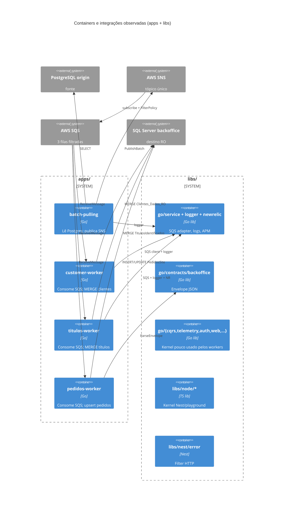
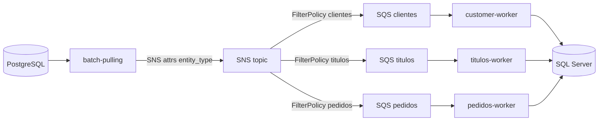
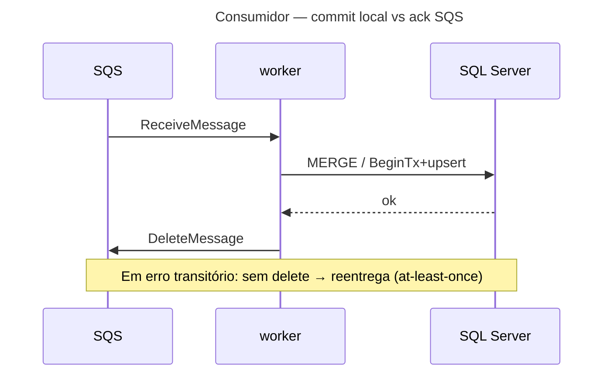

# Inventário AS-IS — shared-ro-sync-services (apps + libs)

- **Repositório**: `git@gitea.lidercap.com.br:lidercap-apps/shared-ro-sync-services.git`
- **Escopo inspecionado**: `apps/**` + `libs/**` (infra/, scripts raiz e playground Nest documentado mas ausente — ver §8)
- **Commit inspecionado**: `82fae7f`
- **Data do levantamento**: 2026-08-13
- **Responsável pelo levantamento**: agente (asset `prompt-inventario-repositorio.md` / SPEC-K9H204F1)
- **Stack**: ambas (Go workers + libs Go; TypeScript/Node libs + Nest filter)
- **Cortes irmãos**: detalhe de `libs/node` em [`inventario-shared-ro-sync-services-libs-node.md`](./inventario-shared-ro-sync-services-libs-node.md)

## 1. Sumário executivo

- `Fato`: monorepo Nx híbrido cujo fluxo de sync RO é PostgreSQL → `batch-pulling` (SNS) → SQS filtrada → workers (`customer-worker`, `titulos-worker`, `pedidos-worker`) → SQL Server backoffice (`CLAUDE.md:9`).
- `Fato`: sob `apps/` existem **apenas 4 apps Go**; `apps/nest/playground` citado em `CLAUDE.md:100` e `README.md` **NÃO EXISTE** no working tree inspecionado.
- `Fato`: topologia local de mensageria definida em `topics-queues.sh:10-42` — tópico único `filantropia-backoffice-topic-dev` + 3 filas com `FilterPolicy` por `entity_type` e `RawMessageDelivery: true`.
- `Fato`: contrato wire do sync é **JSON envelope** (`libs/go/contracts/backoffice/envelope.go:11-18`); **zero** arquivos `.proto` no repositório.
- `Fato`: outbox/inbox/`UnitOfWork` nomeado e promessas `exactly-once` **NÃO EXISTEM** em `apps/` nem `libs/` (`rg` vazio).
- `Fato`: idempotência de efeito no destino via MERGE/upsert SQL; transporte SQS assume reentrega (delete só após sucesso).
- `Fato`: libs Go no `go.work` são 18 módulos; uso efetivo pelos workers é **estreito** (`logger`, `service/sqs`, `newrelic`, `contracts/backoffice`).
- `Fato`: `libs/node` (17 pacotes) e `libs/nest/error` (1 pacote) não participam do caminho SNS→SQS dos workers Go.
- `Fato`: ownership por time/pessoa **NÃO DECLARADO** (`CODEOWNERS` ausente).
- `Inferência` (média): o monorepo carrega um kernel de plataforma (auth/web/cqrs/telemetry) pouco acoplado ao sync RO; o valor DMPF deste repo está nos 4 workers + contrato JSON + adapter SQS.

## 2. Evidências consultadas

- Manifestos: `go.work`, `package.json`, `pnpm-workspace.yaml`, `nx.json`, `tsconfig.base.json`, `apps/*/go.mod`, `libs/go/*/go.mod`, `libs/node/*/package.json`, `libs/nest/error/package.json`
- Docs: `CLAUDE.md`, `README.md`, `DEVELOPMENT.md`, `docs/contracts/backoffice-streaming-envelope-and-pedido.md`, READMEs dos workers
- Scripts/infra (contexto de topologia): `topics-queues.sh`
- Código apps: `cmd/*/main.go`, use cases de pull/processamento, adapters SNS/SQS, repositórios MSSQL/Postgres, parsers de envelope
- Código libs: `libs/go/contracts/backoffice`, `libs/go/service/infra/aws/sqs`, `libs/go/logger`, `libs/go/newrelic`, `libs/go/telemetry`, `libs/go/data`, `libs/go/cqrs`, `libs/nest/error`; resumo de `libs/node` via inventário irmão
- Buscas: `sns|sqs|kafka|outbox|inbox|protobuf|\.proto|opentelemetry|newrelic|UnitOfWork|exactly-once|idempoten|DLQ`
- Comandos: `git rev-parse --short HEAD`; `find`/`ls`/`rg` sob `apps` e `libs`
- Graphify: `graphify-out/graph.json` **ausente** neste repositório — consulta pulada

## 3. Estrutura do repositório

Árvore simplificada do escopo:

```text
shared-ro-sync-services/
├── apps/
│   ├── batch-pulling/          # Go — pull Postgres → SNS
│   ├── customer-worker/        # Go — SQS clientes → SQL Server RO
│   ├── pedidos-worker/         # Go — SQS pedidos → SQL Server
│   └── titulos-worker/         # Go — SQS títulos → SQL Server
├── libs/
│   ├── go/                     # ~18 módulos (auth, cache, cli, config, contracts,
│   │                           # core, cqrs, data, di, keycloak-admin, logger,
│   │                           # newrelic, pipeline, resilience, service,
│   │                           # telemetry, validation, web)
│   ├── node/                   # 17 pacotes @lideranca-sites/node-*
│   ├── nest/error/             # DomainExceptionFilter (Nest ↔ node-error)
│   └── .gitkeep
├── topics-queues.sh            # LocalStack: SNS + SQS + FilterPolicy
├── go.work                     # workspace Go 1.24.4
└── (fora do corte profundo) infra/, docs/, scripts/, .github/
```

Layout típico de worker Go (`CLAUDE.md:110-124`):

```text
apps/<worker>/
├── cmd/<entrypoint>/main.go
└── internal/
    ├── domain/
    ├── application/usecases/
    ├── ports/{inbound,outbound}/
    └── infra/{config,database,sqs|sns,server,...}
```

## 4. Arquitetura observada

`Inferência` (alta): padrão dominante nos workers é **hexagonal / ports & adapters**, com composition root em `main.go`.

`Fato`: o sync RO é **event-driven fan-out** SNS→SQS com filtro por atributo `entity_type`, não CQRS Watermill dos workers (`libs/go/cqrs` não é importado pelos apps).

`Fato`: `CLAUDE.md:100` e onboarding do `README.md` descrevem `apps/nest/playground`; diretório `apps/nest` **ausente** no commit `82fae7f` — descasamento doc↔código.

`Inferência` (média): `libs/go` + `libs/node` formam um kernel espelhado multi-runtime; o caminho crítico DMPF deste inventário é o pipeline dos 4 apps Go.



## 5. Padrões vigentes

### 5.1 Mensageria

| Item | Situação | Rótulo | Evidência |
|---|---|---|---|
| Broker | SNS (produtor) + SQS (consumidores); Kafka **NÃO EXISTE** | `Fato` | `topics-queues.sh`; `apps/batch-pulling/.../sns`; adapters SQS nos workers |
| Tópico | Um tópico; roteamento por `MessageAttributes.entity_type` | `Fato` | `topics-queues.sh:10-16,36-39`; `run_puller_loop.go:226-228` |
| Filas (dev) | `filantropia-{clientes,titulos,pedidos}-backoffice-queue-dev` | `Fato` | `topics-queues.sh:12-15` |
| Formato | JSON envelope; raw delivery SNS→SQS | `Fato` | `topics-queues.sh:37`; `envelope.go:10-18` |
| Produtor | `PublishBatch` (chunks de 10) | `Fato` | `run_puller_loop.go:23,169` |
| Retry consumo | visibility timeout + `ApproximateReceiveCount` vs `maxRetries` (customer/titulos); pedidos: retryable não-delete / inválido visibility 0 | `Fato` | `customer-worker/.../main.go:283-290`; consumer pedidos |
| DLQ no repo | Script LocalStack **não** cria redrive; customer/titulos deletam após maxRetries (comentário DLQ/dev) | `Fato` / `Lacuna` | `topics-queues.sh`; `main.go:283` customer |
| Idempotência de fila | Sem store de dedup por `dispatch_key` nos apps; efeito idempotente no DB | `Fato` | ausência de inbox; MERGE nos repositórios |
| Libs: porta SQS | `libs/go/service` `MessageQueue` + client aws-sdk v1 | `Fato` | `libs/go/service/ports/storage.go`; `infra/aws/sqs/client.go` |
| Libs: CQRS Watermill SQS/AMQP/SQL | Existe em `libs/go/cqrs`; **não** usado pelos 4 apps | `Fato` | `go.work` + ausência de import nos apps |
| Libs Node: fila | Porta `INotificationQueue` + in-memory | `Fato` | inventário irmão `libs/node` |



### 5.2 Contratos

| Item | Situação | Rótulo | Evidência |
|---|---|---|---|
| `.proto` | **NÃO EXISTEM** | `Fato` | `find` vazio no repo |
| Envelope compartilhado | `libs/go/contracts/backoffice.Envelope` | `Fato` | `envelope.go:11-18` |
| Campos mínimos validados | `dispatch_key` + `payload`; `schema_version` **não** rejeitada | `Fato` | `envelope.go:27-32` |
| Doc de contrato | `docs/contracts/backoffice-streaming-envelope-and-pedido.md` (v lógica 0.1.0) | `Fato` | arquivo presente |
| Consumo da lib | Só `pedidos-worker` importa a lib; customer/titulos mantêm struct local | `Fato` | imports pedidos; `titulo_handler.go` / `cliente_handler.go` |
| Drift produtor | batch-pulling publica também `routing_key`, `tenant` (attrs/envelope) além do struct da lib | `Fato` | `run_puller_loop.go:226-228` vs `envelope.go:11-18` |
| Breaking-change CI | **NÃO EXISTE** (sem buf/pact/spectral) | `Lacuna` | apenas testes unitários do envelope |
| Doc drift | `CLAUDE.md:146` cita `correlation_id` no envelope; struct real **não tem** esse campo | `Fato` | `envelope.go:11-18` vs `CLAUDE.md:146` |

### 5.3 Transação (UoW)

| Item | Situação | Rótulo | Evidência |
|---|---|---|---|
| Outbox / inbox | **NÃO EXISTEM** | `Fato` | `rg` vazio em apps/libs |
| batch-pulling | Leitura Postgres → publish SNS **sem** marcar origem / sem outbox | `Fato` | `run_puller_loop.go:169`; README batch-pulling (origem não marcada) |
| customer / titulos | `MERGE` (GORM Raw) por mensagem; delete SQS após sucesso | `Fato` | repositórios MSSQL dos workers |
| pedidos | `BeginTx` + `UPDLOCK,HOLDLOCK` + commit; depois delete SQS | `Fato` | `mssql_pedido_repository.go` |
| Libs `go/data` | `Transaction` / `WithTransaction` existem; sem outbox | `Fato` | `libs/go/data/infra/persistence/` |
| Fronteira commit↔publish (produtor) | Publicação independente do estado da origem | `Fato` | puller não atualiza flag de publicado |

```mermaid
sequenceDiagram
  title Produtor — commit local vs publicação
  participant PG as PostgreSQL
  participant BP as batch-pulling
  participant SNS as SNS
  BP->>PG: SELECT lote
  PG-->>BP: linhas
  BP->>SNS: PublishBatch(envelopes)
  Note over PG,SNS: Sem outbox; origem não marcada como publicada
```



### 5.4 Observabilidade

| Item | Situação | Rótulo | Evidência |
|---|---|---|---|
| Logger estruturado | `libs/go/logger` em batch/customer/titulos; `slog` em pedidos | `Fato` | imports nos `main.go` |
| New Relic | Integrado em batch-pulling e titulos-worker; config NR em pedidos **sem wiring** no main | `Fato` | `titulos-worker/cmd/worker/main.go`; pedidos config vs main |
| Prometheus | `pedidos-worker` expõe métricas (`/metrics`) | `Fato` | `internal/infra/metrics/metrics.go:5-32` |
| OTel (`libs/go/telemetry`, `libs/node/telemetry`) | Libs existem; **workers Go não importam** `go/telemetry` | `Fato` | ausência de import nos apps |
| Propagação de trace no salto SNS→SQS | **NÃO EXISTE** no envelope nem no adapter SQS usado | `Inferência` / `Fato` | envelope sem trace fields; sem inject/extract observado |
| Health HTTP | customer/titulos/pedidos sobem `/health` (e variantes); batch-pulling README promete health/metrics **não** wired no `main` inspecionado | `Fato` | mains dos workers; gap batch README vs main |
| Métricas de baseline em dashboard | **NÃO MEDIDO** neste corte | `Lacuna` | sem acesso a Grafana/NR prod |

## 6. Aderência às constraints

| Constraint | Situação | Rótulo | Evidência | Observação |
|---|---|---|---|---|
| Domínio sem I/O | **adere** nos domains de customer/titulos/batch; **mista** em libs (`go/web/domain` importa `net/http`); pedidos sem domínio rico | `Fato` | `cliente.go` / `titulo.go` (só stdlib); `libs/go/web/domain/http_request.go` | `apps/nest` ausente — N/A Nest domain |
| Protobuf apenas no wire | **não aplicável / adere por ausência** | `Fato` | 0 `.proto`; wire = JSON | protobuf só transitivo em go.mod |
| At-least-once | **adere** (transporte SQS + efeitos idempotentes; sem exactly-once E2E) | `Fato` / `Inferência` | delete-após-sucesso; sem outbox; `rg` sem `exactly-once` | Doc CLAUDE descreve redrive/DLQ alinhado a at-least-once |

## 7. Inventário técnico

### 7.1 Libs e componentes

| Componente | Versão | Papel | Owner | Fonte do owner | Rótulo |
|---|---|---|---|---|---|
| Go toolchain | 1.24.x (`go.work` 1.24.4) | runtime workers/libs Go | **NÃO DECLARADO** | — | `Fato` / `Lacuna` |
| Node / pnpm (workspace) | Node 20.11+ / pnpm 10+ (README) | libs TS + tooling Nx | **NÃO DECLARADO** | — | `Fato` / `Lacuna` |
| `batch-pulling` | módulo apps | produtor SNS | **NÃO DECLARADO** | — | `Lacuna` |
| `customer-worker` | módulo apps | consumer clientes | **NÃO DECLARADO** | — | `Lacuna` |
| `titulos-worker` | módulo apps | consumer títulos | **NÃO DECLARADO** | — | `Lacuna` |
| `pedidos-worker` | módulo apps | consumer pedidos | **NÃO DECLARADO** | — | `Lacuna` |
| `libs/go/logger` | módulo local | logging estruturado | tags Nx `scope:internal` | `project.json` | `Fato` |
| `libs/go/service` | módulo local | porta/adapter SQS (e outros AWS) | tags Nx | `project.json` | `Fato` |
| `libs/go/newrelic` | módulo local | APM NR | tags Nx | `project.json` | `Fato` |
| `libs/go/contracts/backoffice` | módulo local (sem `project.json`) | envelope JSON | **NÃO DECLARADO** | — | `Fato` / `Lacuna` |
| `libs/go/cqrs` | módulo local | CQRS + Watermill (não usado pelos apps) | tags Nx | `project.json` | `Fato` |
| `libs/go/telemetry` | módulo local | OTel (não wired nos workers) | tags Nx | `project.json` | `Fato` |
| `libs/go/{auth,cache,cli,config,core,data,di,keycloak-admin,pipeline,resilience,validation,web}` | módulos locais | kernel plataforma | tags Nx | `project.json` | `Fato` |
| `libs/node/*` (17) | `0.0.0` típico | kernel TS | tags Nx | inventário irmão | `Fato` |
| `@lideranca-sites/nest-error` | pacote nest | filter HTTP de domain errors | **NÃO DECLARADO** | `package.json` | `Fato` / `Lacuna` |
| AWS SNS/SQS SDK | v1 (via `go/service`) e v2 (batch SNS; pedidos SQS) | mensageria | — | go.mod apps | `Fato` |
| GORM / database/sql + mssql | conforme app | persistência | — | go.mod | `Fato` |

### 7.2 Dependências e integrações

**Upstream (de quem o escopo depende):**

| Integração | Usado por | Evidência | Rótulo |
|---|---|---|---|
| PostgreSQL (origin) | batch-pulling | config/DB setup | `Fato` |
| AWS SNS | batch-pulling | `SNS_TOPIC_ARN` | `Fato` |
| AWS SQS | 3 workers | `SQS_QUEUE_URL` | `Fato` |
| SQL Server | 3 workers | tabelas RO / ProdCap | `Fato` |
| New Relic | batch-pulling, titulos-worker | agent no main | `Fato` |
| LocalStack (dev) | topologia SNS/SQS | `topics-queues.sh` | `Fato` |

**Downstream (quem depende deste escopo):**

| Consumidor | Relação | Rótulo |
|---|---|---|
| Backoffice SQL Server (tabelas RO) | destino dos upserts | `Fato` |
| Repositórios externos consumindo `@lideranca-sites/node-*` | **NÃO MEDIDO** | `Lacuna` |
| Playground Nest | documentado; app **ausente** no tree | `Fato` |

Tabelas-alvo observadas (amostra):

| Worker | Destino | Rótulo |
|---|---|---|
| customer-worker | `RegistrosOficiais.dbo.Clientes_Dados_RO` | `Fato` |
| titulos-worker | `ProdCap.dbo.TitulosIdentificados` | `Fato` |
| pedidos-worker | `ProdCap.TSV.PedidosSite` (configurável) | `Fato` |

### 7.3 NFRs e restrições

| Item | Valor observado | Evidência | Rótulo |
|---|---|---|---|
| Broker adotado | SNS + SQS | `topics-queues.sh`, código apps | `Fato` |
| Semântica de entrega | at-least-once no transporte; upsert no destino | padrões de delete/MERGE | `Fato` / `Inferência` |
| Concorrência default | 10 (customer/pedidos/batch publish); 20 (titulos) | configs/mains | `Fato` |
| Graceful shutdown | 30s customer; 60s titulos | mains | `Fato` |
| Segurança / secrets | env-based; sem CODEOWNERS | configs | `Fato` / `Lacuna` |
| Compliance / SLO versionado | **NÃO ENCONTRADO** no escopo | busca docs apps/libs | `Lacuna` |
| Descasamento doc↔código | playground Nest ausente; `correlation_id` no CLAUDE; health batch; UpsertSkip pedidos | ver §8 | `Fato` |

### 7.4 Métricas atuais

| Métrica | Medida hoje? | Onde | Valor de referência | Rótulo |
|---|---|---|---|---|
| Mensagens processadas / erro (pedidos) | Instrumentação existe | Prometheus no pedidos-worker | **NÃO MEDIDO** (sem scrape prod) | `Fato` / `Lacuna` |
| APM NR (titulos/batch) | Agent wired | New Relic | **NÃO MEDIDO** | `Fato` / `Lacuna` |
| Lag de fila SQS | **NÃO MEDIDO** neste repo | — | **NÃO MEDIDO** | `Lacuna` |
| Taxa de republish do puller | **NÃO MEDIDO** | origem não marcada | **NÃO MEDIDO** | `Lacuna` |
| Trace E2E SNS→SQS→DB | **NÃO EXISTE** wiring | — | **NÃO MEDIDO** | `Fato` |

## 8. Achados fora do escopo priorizado

1. `Fato`: `apps/nest/playground` documentado e ausente — onboarding/README/`CLAUDE.md` desatualizados em relação ao tree.
2. `Fato`: envelope triplicado (outbound batch, inbound local customer/titulos, lib `contracts`) — risco de drift.
3. `Fato`: dual stack SQS nas libs (`go/service` aws-sdk v1 vs `go/cqrs` Watermill v2) enquanto apps misturam SDKs.
4. `Fato`: `UpsertSkip` / stale-skip de pedidos documentado/contratado na porta mas implementação do repo não compara timestamps de forma equivalente ao customer-worker (gap doc/código apontado na inspeção dos apps).
5. `Fato`: dependência de ordem clientes→títulos via FK 547 com retry SQS (acoplamento temporal entre filas).
6. `Fato`: grande superfície de libs Go/Node no workspace com baixo uso pelos workers de sync — custo de manutenção vs valor no caminho crítico.
7. `Inferência`: binários `*-worker` / `batch-pulling` na raiz do repo parecem artefatos de build versionados ou locais — potencial ruído de release (não aprofundado).

## 9. Pontos críticos para manutenção

| Área | Risco | Impacto | Evidência | Rótulo |
|---|---|---|---|---|
| Publish sem outbox | Duplicatas / republicação indefinida da origem | Carga nas filas; depende 100% do upsert destino | puller + README batch | `Fato` |
| Contrato fragmentado | Incompatibilidade silenciosa entre produtor e consumers | Falhas de parse / campos ignorados | envelope local vs lib vs attrs | `Fato` |
| DLQ/redrive fora do repo | Comportamento de poison message depende de IaC externo | Mensagens órfãs ou delete defensivo em dev | `topics-queues.sh` sem DLQ | `Fato` / `Lacuna` |
| Observabilidade heterogênea | NR / Prometheus / slog / lacunas por app | Diagnóstico E2E difícil | §5.4 | `Fato` |
| Doc drift (playground, correlation_id, health batch) | Baseline otimista se alguém confiar só na doc | Decisões DMPF enviesadas | `CLAUDE.md` vs tree | `Fato` |
| Ownership ausente | Sem dono claro de contrato/libs | Mudanças sem gate organizacional | sem CODEOWNERS | `Lacuna` |

## 10. Candidato a piloto

**Sim (com ressalvas)** — justifica: já opera o padrão SNS→SQS + envelope versionável + consumers com upsert idempotente, cobrindo os quatro eixos DMPF com gaps explícitos (outbox, protobuf, OTel E2E). Ressalva: superfície de libs não usadas e doc drift aumentam o ruído do piloto. Decisão formal: `SPEC-VVR1X71Q`.

## 11. Lacunas e perguntas em aberto

| O que | Por que não foi possível levantar | Quem pode responder |
|---|---|---|
| Ownership (time/pessoa) | Sem CODEOWNERS / AUTHORS | Plataforma / donos do monorepo |
| ARNs/URLs e DLQ de produção | Só `env.example` + LocalStack no repo | DevOps / IaC AWS |
| Destino do playground Nest | Removido? Nunca mergeado? Doc legado? | Autores do README/CLAUDE |
| Uso externo de `libs/node` e `libs/go` | Fora do escopo apps+libs deste monorepo | Consumidores / registry npm interno |
| Valores reais de métricas/SLO | Sem acesso a dashboards | Ops / New Relic / Grafana |
| Intenção da dual stack SQS (service vs cqrs) | Sem ADR no escopo lido | Autores das libs Go |

## 12. Resumo de confiança

| Área | Confiança | Justificativa |
|---|---|---|
| Arquitetura | Alta | Estrutura dos 4 apps e fluxo SNS→SQS evidenciados em código + script |
| Mensageria | Alta | Produtor, filas, filtros e consumers lidos com âncoras |
| Contratos | Alta | Envelope e doc US-002 lidos; ausência de protobuf verificada |
| Transação | Alta | Padrão puller/consumers claro; ausência de outbox verificada |
| Observabilidade | Média | Wiring por app divergente; valores de dashboard não medidos |
| Ownership | Baixa | Nenhuma fonte de dono humano no repositório |

Confiança baixa em ownership não é falha do levantamento: indica onde o baseline precisa de confirmação humana antes de sustentar decisão.
