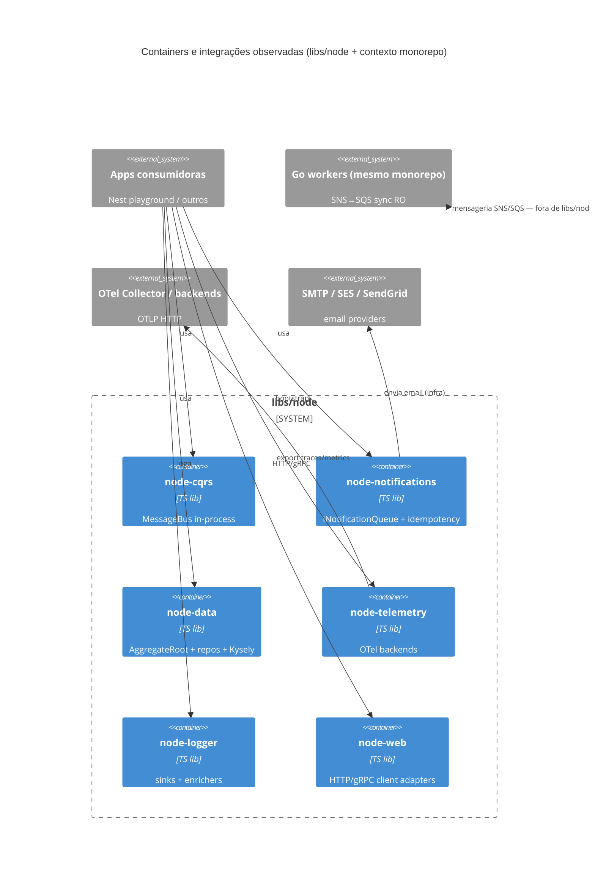
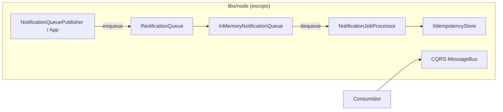
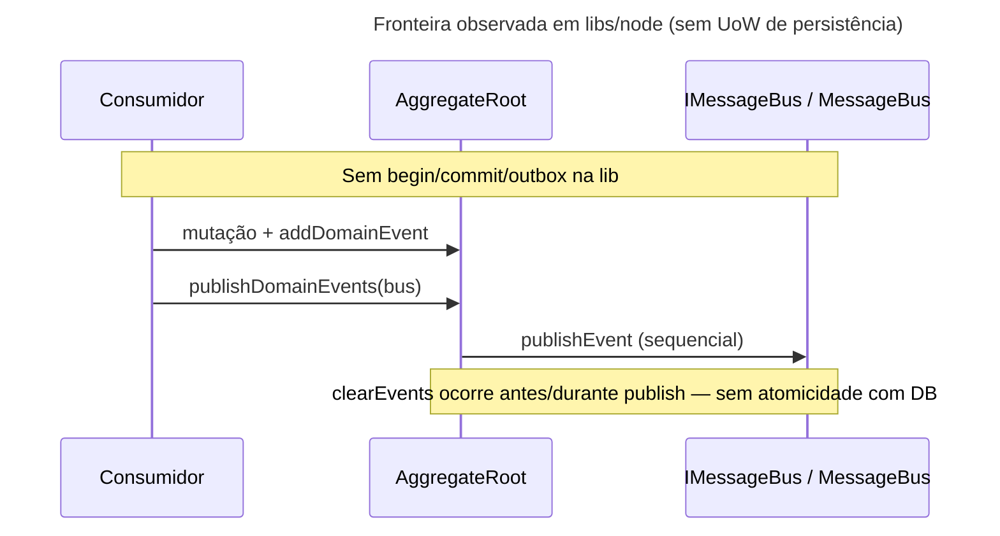

# Inventário AS-IS — shared-ro-sync-services / libs/node

- **Repositório**: `git@gitea.lidercap.com.br:lidercap-apps/shared-ro-sync-services.git`
- **Escopo inspecionado**: `libs/node/**` (17 pacotes `@lideranca-sites/node-*`); metadados do monorepo usados só como contexto
- **Commit inspecionado**: `82fae7f`
- **Data do levantamento**: 2026-08-13
- **Responsável pelo levantamento**: agente (asset `prompt-inventario-repositorio.md` / SPEC-K9H204F1)
- **Stack**: TypeScript / Node.js

## 1. Sumário executivo

- `Fato`: `libs/node` é um conjunto de **17 bibliotecas framework-agnostic** sob o escopo npm `@lideranca-sites/node-*`, organizadas em Clean Architecture (`domain` / `application` / `ports` / `infra`) — ver `tsconfig.base.json:34-54` e tags em cada `project.json`.
- `Fato`: o monorepo pai é híbrido (Go workers + Nest playground + libs Go/Node/Nest); o fluxo de sync RO descrito em `CLAUDE.md:9` usa SNS/SQS nos **workers Go**, não nestas libs Node.
- `Fato`: **não há** implementação de broker (SNS/SQS/Kafka/BullMQ) em `libs/node`; mensageria aparece como **porta abstrata** (`INotificationQueue`, `MessageBus` CQRS, `IMessageBus` no AggregateRoot) com adapters in-memory.
- `Fato`: observabilidade é o eixo mais maduro no escopo: `@lideranca-sites/node-telemetry` (OTel SDK/exporters) + `@lideranca-sites/node-logger` (enricher de `trace_id`/`span_id`).
- `Fato`: contratos wire (`.proto`, OpenAPI, AsyncAPI) **NÃO EXISTEM** sob `libs/node`; gRPC só como cliente genérico que recebe path de `.proto` do consumidor (`GrpcJsClientAdapter`).
- `Fato`: fronteira transacional (UoW/outbox/inbox) **NÃO EXISTE** como API em `libs/node/data`; `IDataSourceConnection` só cobre connect/disconnect/isConnected.
- `Fato`: idempotência e retry de fila existem no domínio de **notifications** (`IdempotencyKey`, `JobMetadata`, `IIdempotencyStore`), sem broker real no pacote.
- `Fato`: ownership por pessoa/time **NÃO EXISTE** (`CODEOWNERS` ausente); há tags Nx (`scope:internal` / `scope:shared`, `layer:*`).
- `Inferência` (baixa incerteza): estas libs são o “kernel TS” compartilhado do monorepo, espelhando `libs/go`, e não o lugar onde a topologia SNS→SQS do sync é implementada.
- `Lacuna`: uso efetivo destas libs pelos apps Nest/Go do mesmo repo e por repositórios consumidores externos não foi medido neste corte (só `libs/node`).

## 2. Evidências consultadas

- Manifestos: `package.json` (raiz), `pnpm-workspace.yaml`, `go.work`, `tsconfig.base.json`, `nx.json`, `sonar-project.properties`, `libs/node/*/package.json`, `libs/node/*/project.json`
- Docs: `README.md`, `CLAUDE.md`, READMEs de `notifications`, `telemetry`, `cqrs`, `data`, `web`
- Código (amostra ancorada): `aggregate-root.ts`, `bus.interface.ts`, `notification-queue.interface.ts`, `idempotency-store.interface.ts`, `notification-job-processor.service.ts`, `job-metadata.vo.ts`, `in-memory-notification-queue.ts`, `data-source.interface.ts`, `middleware-config.ts`, `otel-log-enricher.ts`, `node-telemetry-bootstrap.ts`, `grpc-js-client.adapter.ts`, `domain-event.ts` (`node-service`)
- Buscas: padrões `kafka|sqs|sns|outbox|inbox|protobuf|opentelemetry|UnitOfWork|exactly-once|at-least-once` em `libs/node`
- Contexto monorepo (fora do escopo de implementação Node): `topics-queues.sh`, `CLAUDE.md` (fluxo SNS/SQS)
- Comandos: `git rev-parse --short HEAD`; `find`/`rg` sob `libs/node`

## 3. Estrutura do repositório

Escopo deste relatório — árvore simplificada:

```text
libs/node/
├── auth/            # JWT / OIDC
├── cache/           # cache (peers: DynamoDB, node-cache)
├── config/          # config tipada (dotenv, zod peers)
├── cqrs/            # CQRS agnóstico (commands/queries/events/bus)
├── data/            # DDD entities, AggregateRoot, repos, Kysely QB
├── di/              # DI (tsyringe)
├── error/           # hierarquia de erros
├── keycloak-admin/  # admin Keycloak
├── logger/          # logging estruturado + correlação/trace
├── notifications/   # canais, fila (porta), idempotência
├── pipeline/        # pipeline (rxjs peer)
├── resilience/      # retry/CB/bulkhead/timeout (cockatiel, p-limit)
├── service/         # ServiceDomainEvent base
├── telemetry/       # plataforma OTel vendor-agnostic
├── types/           # Result, ApiResponse, etc.
├── validation/      # specs / validação
└── web/             # HTTP client/server, GraphQL, gRPC client
```

Cada pacote tipicamente: `src/lib/{domain,application,ports,infra}` + `src/index.ts` + `project.json` + `README.md`.

Contexto monorepo (não inventariado em profundidade): `apps/` (workers Go + playground Nest), `libs/go`, `libs/nest`, `infra/`.

## 4. Arquitetura observada

`Inferência` (média): padrão dominante em `libs/node` é **Clean Architecture + ports/adapters**, com camadas `domain` → `ports` ← `infra` / `application`. Tags Nx `layer:domain|application|infrastructure` reforçam a intenção (`libs/node/*/project.json`).

`Fato`: não há app Nest/Express dentro de `libs/node`; são libs consumíveis. A integração Nest vive em `libs/nest` (fora do escopo).

`Inferência` (alta): do ponto de vista DMPF, este corte é **biblioteca de plataforma**, não serviço com topologia de mensageria própria. A topologia SNS/SQS do sync RO está nos workers Go + `topics-queues.sh` do monorepo.



## 5. Padrões vigentes

### 5.1 Mensageria

| Item | Situação | Rótulo | Evidência |
|---|---|---|---|
| Broker SNS/SQS/Kafka em `libs/node` | **NÃO EXISTE** | `Fato` | `rg` sem hits de cliente AWS SNS/SQS/Kafka em código de produção das libs; peers de notifications são SES/SendGrid/nodemailer |
| Fila abstrata (notifications) | Existe porta + adapter in-memory | `Fato` | `notification-queue.interface.ts:35-68` (comenta BullMQ/RabbitMQ/In-Memory); `in-memory-notification-queue.ts:26+` |
| CQRS MessageBus | In-process (commands/queries/events) | `Fato` | `cqrs/.../bus.interface.ts:21+`; infra: `in-memory-message-store.ts`, `retryable-handler.ts` |
| Domain events → bus | AggregateRoot publica via `IMessageBus` | `Fato` | `aggregate-root.ts:18-20`, `74-80` |
| Retry de job | Metadados + processor | `Fato` | `job-metadata.vo.ts:7-54` (`maxRetries` default 3); `notification-job-processor.service.ts:34-40` |
| Idempotência de consumo | Porta + in-memory store | `Fato` | `idempotency-store.interface.ts:22-41`; `in-memory-idempotency-store.ts`; processor `25-51` |
| DLQ / poison message | **NÃO EXISTE** no código das libs | `Fato` | sem referências a DLQ em `libs/node` (exceto conceitos genéricos de reject/nack na porta) |
| Topologia SNS→SQS do monorepo | Fora de `libs/node` | `Fato` | `topics-queues.sh:1-40`; `CLAUDE.md:9` |



`Inferência` (média): a semântica implícita da porta (`acknowledge` / `reject` + retries + idempotency store) é compatível com **at-least-once + efeitos idempotentes**, mas isso não está documentado como contrato normativo do pacote.

### 5.2 Contratos

| Item | Situação | Rótulo | Evidência |
|---|---|---|---|
| Arquivos `.proto` em `libs/node` | **NÃO EXISTEM** | `Fato` | `find libs/node -name '*.proto'` vazio |
| OpenAPI / AsyncAPI em `libs/node` | **NÃO EXISTEM** | `Fato` | busca por openapi/asyncapi vazia |
| Contratos TypeScript (ports) | Existem, versionados com a lib (`0.0.0`) | `Fato` | interfaces em `ports/`; versionamento monorepo via Nx release-publish nos `project.json` |
| gRPC | Cliente genérico; `.proto` do consumidor | `Fato` | `grpc-js-client.adapter.ts:13-14` (exemplo `./proto/service.proto`); peers `@grpc/grpc-js`, `@grpc/proto-loader` |
| Verificação automática de breaking change | **NÃO EXISTE** no escopo | `Lacuna` / `Fato` | sem buf/spectral/pact/contract tests observados em `libs/node` |
| Ownership de contrato | **NÃO DECLARADO** | `Lacuna` | sem CODEOWNERS; tags Nx não nomeiam time |

### 5.3 Transação (UoW)

| Item | Situação | Rótulo | Evidência |
|---|---|---|---|
| Unit of Work / API de transação | **NÃO EXISTE** | `Fato` | `rg` de `transaction|UnitOfWork|outbox|inbox` em `libs/node/data/src` sem hits em TS de produção |
| Data source | connect/disconnect apenas | `Fato` | `data-source.interface.ts:34-54` |
| AggregateRoot e consistência | Comentário menciona “consistência transacional”; publicação de eventos é pós-fila em memória, sem commit DB | `Fato` | `aggregate-root.ts:30-31`, `74-80` |
| Outbox / inbox | **NÃO EXISTEM** | `Fato` | busca sem ocorrências em `libs/node` |
| Relação commit ↔ publish | **NÃO MEDIDO** / não modelado na lib | `Lacuna` | consumidor precisaria orquestrar; lib não define a fronteira |



### 5.4 Observabilidade

| Item | Situação | Rótulo | Evidência |
|---|---|---|---|
| Tracing / metrics OTel | Existe plataforma + bootstrap NodeSDK | `Fato` | `node-telemetry/package.json` deps OTel; `node-telemetry-bootstrap.ts`; README telemetria |
| Logs estruturados | Logger com sinks (pino/winston peers) e enrichers | `Fato` | `node-logger` peers; `otel-log-enricher.ts:20-42` (`trace_id`, `span_id`) |
| Correlation ID | Porta dedicada | `Fato` | `correlation-id-provider.interface.ts` em ports outbound do logger |
| Propagação de trace em salto assíncrono (fila) | **NÃO EXISTE** na lib de notifications | `Fato` / `Inferência` | `NotificationJob` / `JobMetadata` não carregam trace context; só retry/idempotency |
| Métricas de negócio exportadas por default | Depende de wiring do consumidor | `Inferência` | telemetria é lib; valores de dashboard **NÃO MEDIDOS** neste corte |
| Stack de monitoring no monorepo | Grafana/Prometheus/Loki/Tempo/OTel Collector no profile Docker | `Fato` | `README.md:93` (infra monorepo; não é código de `libs/node`) |

## 6. Aderência às constraints

| Constraint | Situação | Rótulo | Evidência | Observação |
|---|---|---|---|---|
| Domínio sem I/O | **viola** (pontual) / maioria adere | `Fato` | `web/.../middleware-config.ts:9` importa `express` na pasta `domain`; demais domains inspecionados importam só peers internos/`node:crypto` | Violação clara em `node-web` domain. Outras libs com pasta `domain` tipicamente sem ORM/broker/HTTP |
| Protobuf apenas no wire | **não aplicável** / adere por ausência | `Fato` | nenhum `.proto` nem tipos gerados em `libs/node`; gRPC carrega proto no adapter de infra | Não há modelo de domínio protobuf |
| At-least-once | **não aplicável** como broker; padrão de fila abstrata sugere at-least-once + idempotência | `Inferência` | sem menção a `exactly-once`/`at-least-once` no código (`rg` vazio); processor + `IIdempotencyStore` | Sem promessa E2E exactly-once encontrada |

## 7. Inventário técnico

### 7.1 Libs e componentes

| Componente | Versão | Papel | Owner | Fonte do owner | Rótulo |
|---|---|---|---|---|---|
| `@lideranca-sites/node-auth` | 0.0.0 | JWT/JWKS auth | **NÃO DECLARADO** | tags Nx `scope:internal` | `Fato`/`Lacuna` |
| `@lideranca-sites/node-cache` | 0.0.0 | Cache (DynamoDB / node-cache peers) | NÃO DECLARADO | idem | `Fato`/`Lacuna` |
| `@lideranca-sites/node-config` | 0.0.0 | Config tipada | NÃO DECLARADO | idem | `Fato`/`Lacuna` |
| `@lideranca-sites/node-cqrs` | 0.0.0 | CQRS in-process | NÃO DECLARADO | idem | `Fato`/`Lacuna` |
| `@lideranca-sites/node-data` | 0.0.0 | DDD + query builder | NÃO DECLARADO | idem | `Fato`/`Lacuna` |
| `@lideranca-sites/node-di` | 0.0.0 | DI tsyringe | NÃO DECLARADO | idem | `Fato`/`Lacuna` |
| `@lideranca-sites/node-error` | 0.0.0 | Erros de domínio | NÃO DECLARADO | `layer:domain` | `Fato`/`Lacuna` |
| `@lideranca-sites/node-keycloak-admin` | 0.0.0 | Admin Keycloak | NÃO DECLARADO | idem | `Fato`/`Lacuna` |
| `@lideranca-sites/node-logger` | 0.0.0 | Logging | NÃO DECLARADO | idem | `Fato`/`Lacuna` |
| `@lideranca-sites/node-notifications` | 0.0.0 | Notificações + fila abstrata | NÃO DECLARADO | idem | `Fato`/`Lacuna` |
| `@lideranca-sites/node-pipeline` | 0.0.0 | Pipeline | NÃO DECLARADO | idem | `Fato`/`Lacuna` |
| `@lideranca-sites/node-resilience` | 0.0.0 | Resiliência | NÃO DECLARADO | idem | `Fato`/`Lacuna` |
| `@lideranca-sites/node-service` | 0.0.0 | Base de serviço / domain events | NÃO DECLARADO | idem | `Fato`/`Lacuna` |
| `@lideranca-sites/node-telemetry` | 0.0.0 | Telemetria OTel | NÃO DECLARADO | `scope:shared` | `Fato`/`Lacuna` |
| `@lideranca-sites/node-types` | 0.0.0 | Tipos / Result | NÃO DECLARADO | `layer:domain` | `Fato`/`Lacuna` |
| `@lideranca-sites/node-validation` | 0.0.0 | Validação | NÃO DECLARADO | `layer:domain` | `Fato`/`Lacuna` |
| `@lideranca-sites/node-web` | 0.0.0 | HTTP/GraphQL/gRPC | NÃO DECLARADO | idem | `Fato`/`Lacuna` |
| Runtime Node (raiz) | `>=20.11 <21` | engine do monorepo | — | `package.json` engines | `Fato` |
| TypeScript (raiz) | 6.0.3 | toolchain | — | `package.json` | `Fato` |

Dependências externas relevantes (peers/deps declarados nos pacotes):

- Persistência/query: `kysely@0.29.2`, `class-validator`, `class-transformer`, `papaparse`
- Cache: `@aws-sdk/client-dynamodb`, `node-cache` (README da raiz cita Redis — ver §8)
- HTTP/gRPC: `express`, `axios`, `@grpc/grpc-js`, `graphql-request`, `helmet`, `cors`, `compression`
- Obs: stack `@opentelemetry/*` (api 1.9.1, sdk 0.218.0, etc.)
- Log: `pino`, `winston`
- Resilience: `cockatiel`, `p-limit`
- Auth: `jsonwebtoken`, `jwks-rsa`; Keycloak admin client
- Notifications: `@aws-sdk/client-ses`, `@sendgrid/mail`, `nodemailer`, `handlebars`

### 7.2 Dependências e integrações

**Upstream (de quem `libs/node` depende):** Node 20.11, TypeScript, peers listados acima; Verdaccio/`publishConfig` para publicação interna.

**Downstream (quem depende destas libs):** `Inferência` — apps Nest do monorepo e possivelmente outros repos via packages publicados; **NÃO MEDIDO** o grafo de consumidores neste corte.

**Integrações de runtime típicas (via adapters):** SMTP/SES/SendGrid, DynamoDB cache, Keycloak, OTLP HTTP exporters, HTTP/gRPC remotos.

**Mensageria do domínio de sync RO (contexto monorepo, não libs/node):** SNS topic `filantropia-backoffice-topic-dev` → filas SQS filtradas por `entity_type` (`topics-queues.sh:12-16`).

### 7.3 NFRs e restrições

| Item | Valor observado | Evidência | Rótulo |
|---|---|---|---|
| Node engine | `>=20.11 <21` | `package.json` engines | `Fato` |
| Qualidade estática | SonarQube `lideranca-sites` | `sonar-project.properties:5-8` | `Fato` |
| Boundaries Nx | tags `type/scope/runtime/layer` | `project.json` de cada lib | `Fato` |
| Observabilidade local | profile Docker monitoring | `README.md:93` | `Fato` |
| SLO versionado em `libs/node` | **NÃO EXISTE** | busca | `Fato` |
| Compliance/security policy em lib | **NÃO EXISTE** (além de helmet/cors config no web) | `middleware-config.ts` | `Fato` |
| Broker oficial do monorepo | SNS + SQS (LocalStack/AWS) nos workers Go | `CLAUDE.md`, `topics-queues.sh` | `Fato` |

### 7.4 Métricas atuais

| Métrica | Medida hoje? | Onde | Valor de referência | Rótulo |
|---|---|---|---|---|
| Latência/erro de filas Node | **NÃO MEDIDO** | — | — | `Fato` |
| Cobertura de testes por lib | **NÃO MEDIDO** neste corte | Jest configs existem em várias libs | — | `Lacuna` |
| Cardinalidade de spans/metrics OTel | **NÃO MEDIDO** | depende de backend do consumidor | — | `Fato` |
| Dashboards Grafana do profile monitoring | **NÃO MEDIDO** (infra não consultada ao vivo) | `README.md` declara stack | — | `Lacuna` |

## 8. Achados fora do escopo priorizado

1. `Fato` — **Descasamento README vs package**: raiz lista `cache` como “Redis, in-memory” (`README.md:247`), mas `node-cache/package.json` peers são DynamoDB + `node-cache` (sem ioredis no pacote da lib). Importa porque calibra errado o inventário de adapters.
2. `Fato` — **Descasamento validation**: README raiz diz “Validação (Zod)” (`README.md:260`), peers de `node-validation` são `@brazilian-utils/brazilian-utils` e `class-validator` (Zod aparece em `node-config`).
3. `Fato` — **Pasta `domain` em lib de infraestrutura web importa Express** (`middleware-config.ts:9`): tensiona a constraint “domínio sem I/O” e a própria regra documentada em telemetry README (“domain → não depende de NADA”).
4. `Fato` — **Adapter de fila de produção ausente**: interface cita BullMQ/RabbitMQ, só `InMemoryNotificationQueue` implementado em `infra/queue/`.
5. `Fato` — **Comentário desatualizado** em `aggregate-root.ts:16` (“placeholder até que o módulo CQRS seja criado”) enquanto `node-cqrs` já existe — dívida documental.
6. `Inferência` — Espelhamento Go/Node sugere padrão organizacional de dual-runtime; inventário Go (`libs/go`) é candidato natural ao próximo relatório do mesmo monorepo.
7. `Lacuna` — Binários grandes na raiz do repo (`batch-pulling`, `*-worker` executáveis) e `package-lock.json` + pnpm sugerem histórico misto de package managers; impacto em build de `libs/node` não aprofundado.

## 9. Pontos críticos para manutenção

| Área | Risco | Impacto | Evidência | Rótulo |
|---|---|---|---|---|
| Mensageria Node | Portas sem adapter de broker real | Consumidor reimplementa integração SNS/SQS/Bull sem contrato compartilhado | `INotificationQueue` + só in-memory | `Fato` |
| Transação | Sem UoW/outbox na lib de dados | Publicação de domain events sem atomicidade com persistência | `aggregate-root.ts`, ausência de transaction API | `Fato` |
| Ownership | Sem CODEOWNERS | Mudanças em libs “shared” sem dono explícito | `find CODEOWNERS` vazio | `Fato` |
| Domain I/O leak | Express no domain de web | Dificulta adoção da constraint DMPF sem refatoração | `middleware-config.ts:9` | `Fato` |
| Docs vs código | Redis/Zod anunciados indevidamente | Baseline falso para etapas seguintes | `README.md:247,260` vs package.json | `Fato` |
| Trace em async | Jobs de notificação sem contexto OTel | Quebra de correlação no salto fila | `JobMetadata` sem trace fields | `Inferência` |

## 10. Candidato a piloto

**Não** (como piloto de mensageria/UoW E2E): `libs/node` é biblioteca, não serviço com broker; não exercita SNS/SQS nem outbox.  
**Sim parcial** (como piloto de **kernel TS / ports de fila + OTel + Clean Architecture**): já materializa ports de idempotência/retry e telemetria vendor-agnostic úteis à fundação normativa — decisão formal fica em `SPEC-VVR1X71Q`.

## 11. Lacunas e perguntas em aberto

| O que | Por que não foi possível levantar | Quem pode responder |
|---|---|---|
| Owner de cada pacote `@lideranca-sites/node-*` | Sem CODEOWNERS / campo de ownership | Time Plataforma / autores do monorepo |
| Quais apps/repos publicam e consomem cada lib em produção | Escopo limitado a `libs/node`; sem inventário de dependents | Nx graph + time de release |
| Valores reais de métricas/SLOs | Sem acesso a dashboards Grafana/Prometheus no levantamento | Ops / donos do profile monitoring |
| Há adapter BullMQ/SNS planejado para `INotificationQueue` | Só comentário na interface | Mantenedores de `node-notifications` |
| Relação entre `node-cqrs` MessageBus e workers Go SNS | Domínios paralelos no monorepo; integração não vista em `libs/node` | Arquitetura do sync RO |
| Inventário equivalente de `libs/go` e apps | Fora do escopo pedido (`libs/node`) | Próxima execução do prompt |

## 12. Resumo de confiança

| Área | Confiança | Justificativa |
|---|---|---|
| Arquitetura | Alta | Estrutura de pastas, tags Nx e READMEs consistentes com Clean Architecture |
| Mensageria | Alta (no escopo libs/node) | Ausência de broker e presença de portas/in-memory verificáveis; topologia SNS só contextual |
| Contratos | Alta | Ausência de proto/OpenAPI/AsyncAPI verificável; ports TS claros |
| Transação | Alta | Ausência de UoW/outbox verificável em `node-data` |
| Observabilidade | Média-Alta | Código OTel/logger robusto; métricas operacionais e propagação async não medidas |
| Ownership | Baixa | Só tags Nx; sem pessoa/time |

---

> **Nota de escopo**: este relatório cobre **apenas** `libs/node`. O inventário completo do repositório `shared-ro-sync-services` (workers Go, `libs/go`, apps Nest, infra) exige execuções adicionais do mesmo prompt.
