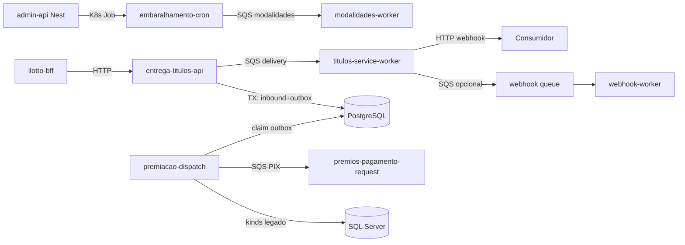
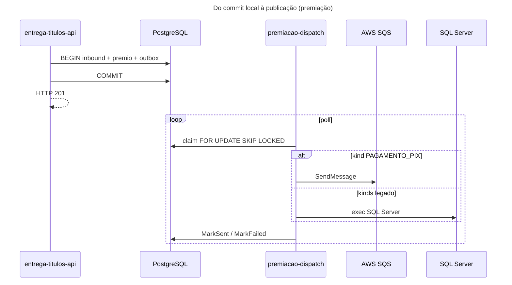

# Inventário AS-IS — shared-titulos-services (apps + libs)

- **Repositório**: `git@gitea.lidercap.com.br:lidercap-apps/shared-titulos-services.git` (local: `/home/mmanjos/work/repositories/filantropia/shared-titulos-services`)
- **Escopo inspecionado**: `apps/**` e `libs/**` (metadados do monorepo e `docs/` usados como evidência transversal)
- **Commit inspecionado**: `a11348ac` (`a11348acdd505d20d04290aa340692c78c2b9cc7`)
- **Data do levantamento**: 2026-08-13
- **Responsável pelo levantamento**: agente (asset `prompt-inventario-repositorio.md` / SPEC-K9H204F1)
- **Stack**: ambas (TypeScript/NestJS + Go)

## 1. Sumário executivo

- `Fato`: monorepo Nx híbrido (`@lideranca-sites/source`) com **pnpm@10.22.0**, Node `>=20.11 <21`, Go **1.25.0** — `package.json:144-152`, `go.work:1`, `CLAUDE.md:7-11`.
- `Fato`: **18 apps** sob `apps/` (12 Go no `go.work`, 3 Nest de produção, `migration` Knex, playgrounds, placeholder `api-premios`) e **6 libs** (`database`, `database-mssql`, `utils-go`, `utils-nest`, `utils-node`, `biome-base`) — `go.work:3-17`, `CLAUDE.md:24-55`, `tsconfig.base.json:20-25`.
- `Fato`: domínio de negócio = **títulos de capitalização / filantropia** (pauta, estoque, entrega, virada de campanha, premiação, sync legado MSSQL) — `README.md`, `docs/SYSTEM_FLOW.md`, `CLAUDE.md:24-48`.
- `Fato`: mensageria dominante = **AWS SQS** (LocalStack em dev); **Kafka/Rabbit/BullMQ/Watermill NÃO EXISTEM** no código de `apps/`/`libs/` — `docs/architecture/05-integracoes-seguranca-observabilidade.md:14-15`, `libs/utils-go/service/infra/aws/sqs/`.
- `Fato`: padrão **Transactional Outbox** (`backoffice_outbox`) + inbox (`inbound_event`) no Postgres; workers `premiacao-dispatch` / `pedido-site-dispatch` despacham para SQS ou SQL Server legado — `docs/architecture/premiacao-execucao-e2e.md:9-24`, migration baseline `apps/migration/.../20260401120000_baseline_schema.ts:650+`.
- `Fato`: contratos wire = **OpenAPI/Swagger** (Nest + swag Go); **`.proto` / AsyncAPI NÃO EXISTEM** no código-fonte; payloads SQS **sem schema formal** — `docs/architecture/05-integracoes-seguranca-observabilidade.md:29-34`.
- `Fato`: observabilidade primária = **New Relic** (Go agent + Nest interceptors); worker de entrega também expõe **Prometheus** `:2112/metrics`; logger TS via Pino (`utils-node`), Go via Logrus — `docs/architecture/05-integracoes-seguranca-observabilidade.md:122-146`.
- `Fato`: ADR 0004 declara **at-least-once** via outbox/SQS e estratégias de idempotência (Redis SetNX, unique constraints, memory store) — **sem promessa exactly-once E2E** — `docs/adr/0004-estrategias-de-idempotencia.md:10-45`, `docs/architecture/05-integracoes-seguranca-observabilidade.md:39`.
- `Fato`: ownership formal via `CODEOWNERS` **NÃO EXISTE**; doc CI lista como pendência — `docs/ci-cd/BRANCH_PROTECTION_CONFIG.md` (referência a criar CODEOWNERS).
- `Inferência` (alta): do ponto de vista DMPF, este repositório é o **sistema de produto** mais completo entre os inventariados até agora (APIs + workers + outbox + SQS + dual DB), portanto candidato forte a piloto E2E — com ressalva de complexidade e dívida de contratos SQS.

## 2. Evidências consultadas

- Manifestos: `package.json`, `pnpm-workspace.yaml`, `go.work`, `tsconfig.base.json`, `nx.json`, `CLAUDE.md`, `README.md`, `libs/*/package.json`, `libs/utils-go/go.mod`, `apps/*/project.json`, `apps/*/go.mod`
- Arquitetura/ops: `docs/architecture/05-integracoes-seguranca-observabilidade.md`, `06-riscos-debitos-rastreabilidade.md`, `premiacao-execucao-e2e.md`, `docs/SYSTEM_FLOW.md`, `docs/operations/NOC-MONITORING-PLAN.md`, `docs/adr/0004-estrategias-de-idempotencia.md`, `docs/contracts/webhook-entrega-titulos.md`
- Código (amostra ancorada): SQS clients (`entrega-titulos-api/infra/sqs`, `embaralhamento-cron/.../sqs-modalidades-update-queue.adapter.ts`, `utils-go/.../sqs`), workers (`titulos-service-worker/cmd/worker/main.go`, `webhook-worker`, `modalidades-worker`), outbox models/processors, migrations Knex, libs database/utils-*
- Buscas: `sqs|outbox|inbox|kafka|exactly-once|DLQ|.proto|CODEOWNERS` em `apps`/`libs`/`docs`
- Comandos: `git rev-parse --short HEAD`; listagem `apps/`/`libs/`; `rg`/`find`

## 3. Estrutura do repositório

Escopo deste relatório — árvore simplificada:

```text
shared-titulos-services/
├── apps/
│   ├── titulos-service-admin-api/          # Nest — API admin / virada
│   ├── titulos-service-admin-api-go/       # Go — espelho parcial admin
│   ├── titulos-service-customer-api/       # Go — clientes / ficha
│   ├── titulos-service-entrega-titulos-api/# Go — entrega + premiação API
│   ├── titulos-service-financeiro-api/     # Go — financeiro / pedidos
│   ├── titulos-service-worker/             # Go — consumer SQS entrega
│   ├── titulos-service-webhook-worker/     # Go — consumer SQS webhook
│   ├── titulos-service-modalidades-worker/ # Go — consumer SQS modalidades
│   ├── titulos-service-embaralhamento-cron/# Nest — batch + publish SQS
│   ├── titulos-service-pauta-reader/       # Nest — ingestão pauta S3
│   ├── titulos-service-pedido-site-dispatch/  # Go — outbox → legado
│   ├── titulos-service-premiacao-dispatch/    # Go — outbox → SQS/legado
│   ├── titulos-service-sync-ro-cron/       # Go — sync RO MSSQL
│   ├── ilotto-bff/                         # Go — BFF canal iLotto
│   ├── migration/                          # Knex migrations PostgreSQL
│   ├── playground-nest/ | playground-golang/
│   └── titulos-service-api-premios/        # placeholder (quase vazio)
├── libs/
│   ├── database/           # @lideranca-sites/database (Knex PG)
│   ├── database-mssql/     # @lideranca-sites/database-mssql (Knex MSSQL)
│   ├── utils-node/         # @lideranca-sites/utils-node
│   ├── utils-nest/         # @lideranca-sites/utils-nest
│   ├── utils-go/           # módulo Go compartilhado
│   └── biome-base/         # preset Biome
├── docs/                   # ADRs, architecture, contracts, ops
├── docker/ | scripts/ | load-tests/ | .github/workflows/
└── go.work | package.json | pnpm-workspace.yaml
```

`Fato` — inventário de dirs: listagem de `apps/` e `libs/`; `go.work:3-17`; `CLAUDE.md:24-55`.

## 4. Arquitetura observada

`Inferência` (alta): sistema **multi-serviço no mesmo monorepo**, com BFF + APIs HTTP + jobs Nest CLI + workers SQS/outbox, banco **PostgreSQL compartilhado** e **SQL Server legado** (ProdCap). Comunicação síncrona HTTP (BFF→APIs) e assíncrona SQS; orquestração de virada também via **Kubernetes Jobs** a partir do admin-api.

`Inferência` (média): padrões mistos — workers recentes tendem a **hexagonal** (`internal/domain|application|ports|infra`); APIs Go frequentemente **modular feature-folder** (`modules/*/usecases`) com GORM nos use cases; Nest de produção usa ports/adapters com domínio mais limpo (ex.: pauta-reader).

```mermaid
C4Container
title Containers e integrações observadas (apps + libs)

Person(ops, "Operação / Admin")
Person(canal, "Canal iLotto")

System_Boundary(sts, "shared-titulos-services") {
  Container(bff, "ilotto-bff", "Go", "Entrada HTTP canal")
  Container(admin, "admin-api Nest", "NestJS", "Virada, OAuth, jobs K8s")
  Container(entrega, "entrega-titulos-api", "Go", "Entrega / premiação")
  Container(fin, "financeiro-api", "Go", "Pedidos / financeiro")
  Container(cust, "customer-api", "Go", "Clientes")
  Container(worker, "titulos-service-worker", "Go", "Consumer SQS entrega")
  Container(wh, "webhook-worker", "Go", "Consumer SQS webhook")
  Container(modw, "modalidades-worker", "Go", "Consumer SQS modalidades")
  Container(emb, "embaralhamento-cron", "Nest", "Batch + SQS publish")
  Container(pauta, "pauta-reader", "Nest", "Pauta S3 → PG")
  Container(pod, "pedido-site-dispatch", "Go", "Outbox → MSSQL")
  Container(prd, "premiacao-dispatch", "Go", "Outbox → SQS/MSSQL")
  Container(sync, "sync-ro-cron", "Go", "Sync RO legado")
  ContainerDb(pg, "PostgreSQL", "Knex/GORM/pgx", "SOR + outbox/inbox")
  ContainerDb(mssql, "SQL Server legado", "GORM/Knex", "ProdCap")
  Container(libs, "libs/*", "TS+Go", "database, utils-*, biome")
}

System_Ext(sqs, "AWS SQS", "Filas + DLQ")
System_Ext(s3, "AWS S3", "Pautas")
System_Ext(k8s, "Kubernetes API", "Jobs virada")
System_Ext(nr, "New Relic", "APM/logs")
System_Ext(wh_ext, "Webhook consumidor", "HTTP")

Rel(canal, bff, "HTTP JWT")
Rel(ops, admin, "HTTP API Key/JWT")
Rel(bff, entrega, "HTTP")
Rel(bff, fin, "HTTP")
Rel(bff, cust, "HTTP")
Rel(admin, k8s, "dispara Jobs")
Rel(k8s, emb, "roda cron")
Rel(k8s, pauta, "roda CLI")
Rel(emb, sqs, "modalidades update")
Rel(modw, sqs, "consome modalidades")
Rel(entrega, sqs, "delivery / premio request")
Rel(entrega, pg, "inbound + outbox")
Rel(worker, sqs, "consome delivery")
Rel(worker, wh_ext, "webhook HTTP")
Rel(worker, sqs, "opcional publish webhook queue")
Rel(wh, sqs, "consome webhook")
Rel(prd, pg, "claim outbox")
Rel(prd, sqs, "PAGAMENTO_PIX")
Rel(prd, mssql, "kinds legado")
Rel(pod, mssql, "dispatch site")
Rel(pauta, s3, "lê PTA")
Rel(pauta, pg, "titulos/estoque")
Rel(sync, mssql, "lê/escreve RO")
Rel(emb, mssql, "sync eventos")
Rel(sts, nr, "APM")
Rel(apps_impl, libs, "dependem")
```

## 5. Padrões vigentes

### 5.1 Mensageria

| Item | Situação | Rótulo | Evidência |
|---|---|---|---|
| Broker | **AWS SQS** (SDK Go v1 em utils-go; AWS SDK v3 `@aws-sdk/client-sqs` no root Nest) | `Fato` | `libs/utils-go/go.mod:6`; `package.json:5`; `libs/utils-go/service/infra/aws/sqs/` |
| Kafka / Rabbit / BullMQ / Watermill | **NÃO EXISTE** em apps/libs | `Fato` | `rg` sem clientes; doc lista só SQS (`05-integracoes...md:14-15`) |
| Fila entrega | `titulos-delivery-request` / `titulos-delivery-queue` / worker queue HMG | `Fato` | `entrega-titulos-api/.env-example:67-69`; `worker/README.md:115-140` |
| Fila premiação | `premios-pagamento-request` (+ DLQ) | `Fato` | `.env-example:79-81`; `premiacao-dispatch/docker-compose.yml:49` |
| Fila modalidades | URL via `SQS_MODALIDADES_UPDATE_QUEUE_URL`; exemplo `filantropia-titulos-modalidades-update-queue` | `Fato` | `embaralhamento-cron/.../env.ts:132`; `modalidades-worker/README.md:15` |
| Fila webhook | `WEBHOOK_QUEUE_URL` / worker dedicado | `Fato` | `worker/cmd/worker/main.go:124-156`; `webhook-worker/README.md:101` |
| Producers | entrega-api, embaralhamento-cron, worker (publish webhook), premiacao-dispatch (kind PIX) | `Fato` | `05-integracoes...md:14-15`; `premiacao-execucao-e2e.md:141` |
| Consumers | worker, webhook-worker, modalidades-worker | `Fato` | READMEs + `cmd/worker/main.go` |
| Retry | `MAX_RETRIES` default 3; visibility/ChangeMessageVisibility | `Fato` | `worker/README.md:118`; `webhook-worker/README.md:20-32` |
| DLQ / poison | RedrivePolicy AWS + `SQS_DLQ_URL` / SendToDLQ na API | `Fato` | `entrega-titulos-api/infra/sqs/client.go:98-146`; `worker/README.md:123,164`; `worker/cmd/worker/main.go:301-305` |
| Formato mensagem | JSON informal (sem AsyncAPI) | `Fato` | `05-integracoes...md:34`; `06-riscos...md:24` (débito L2) |
| Orquestração sem fila | admin-api → K8s Jobs → crons Nest | `Fato` | `05-integracoes...md:16`; subagente admin `jobs.service.ts` |



### 5.2 Contratos

| Item | Situação | Rótulo | Evidência |
|---|---|---|---|
| OpenAPI Nest | Runtime `@nestjs/swagger` em admin-api | `Fato` | `05-integracoes...md:32`; admin `main.ts` (Swagger `/docs`) |
| OpenAPI Go | `swag` + `docs/swagger.yaml` por API | `Fato` | `ilotto-bff/docs/swagger.yaml`; `entrega-titulos-api/docs/`; `05-integracoes...md:31` |
| OpenAPI estático | Premiação + parceiros multi-tenant | `Fato` | `docs/openapi-titulos-service-entrega-titulos-api-premiacao.yaml`; `docs/integrations/openapi-parceiros-multitenancy.v1.yaml` |
| Contrato webhook | Markdown | `Fato` | `docs/contracts/webhook-entrega-titulos.md` |
| Protobuf / Buf / Schema Registry | **NÃO EXISTE** no código-fonte apps/libs | `Fato` | `find` sem `.proto` fora de `node_modules` |
| AsyncAPI / catálogo SQS | **NÃO EXISTE** (débito documentado) | `Fato` | `06-riscos-debitos-rastreabilidade.md:24,68` |
| Versionamento / breaking-change gate | **NÃO MEDIDO** pipeline específico de contrato | `Lacuna` | CI presente (`cd-*.yaml`, semver workflows) sem evidência de compat checker de schema |
| Ownership de contrato | **NÃO DECLARADO** (sem CODEOWNERS) | `Lacuna` | ausência de CODEOWNERS |

### 5.3 Transação (UoW)

| Item | Situação | Rótulo | Evidência |
|---|---|---|---|
| Outbox table | `backoffice_outbox` no Postgres | `Fato` | migration baseline `...baseline_schema.ts:650+`; `libs/utils-go/database/models/backoffice_outbox.go:10` |
| Inbox | `inbound_event` + unique `event_key` | `Fato` | ADR 0004:41-43; migrations core tables |
| Fronteira TX premiação | inbound + premio_pagamento + outbox **mesma transação**; 201 só após commit | `Fato` | `premiacao-execucao-e2e.md:21,100,176` |
| Claim outbox | batch + `FOR UPDATE SKIP LOCKED` (doc); MarkSent/MarkFailed + backoff | `Fato` / `Inferência` | `premiacao-execucao-e2e.md:125-152`; `05-integracoes...md:39,110`; `06-riscos...md:138-140` |
| Workers outbox | `premiacao-dispatch`, `pedido-site-dispatch` | `Fato` | `premiacao-dispatch/infra/server/setup.go:11`; dirs `internal/outbox/` |
| Knex TX (Nest) | `db.transaction` em pauta-reader estoque | `Fato` | `pauta-reader/.../estoque.repository.ts:27-28` (subagente) |
| UoW helper nas libs TS database | **NÃO EXISTE** API UoW — só pool Knex | `Fato` | `libs/database` exports `db`/`destroy` |
| Entre commit e publish | Worker assíncrono lê outbox **depois** do commit da API | `Fato` | `premiacao-execucao-e2e.md:115-119` |



### 5.4 Observabilidade

| Item | Situação | Rótulo | Evidência |
|---|---|---|---|
| APM | New Relic (Go agent + Nest NR interceptors/filters) | `Fato` | `utils-go/go.mod:22-28`; `utils-nest` `nr`/`telemetry`; `05-integracoes...md:136-146` |
| Logs Go | Logrus + enrichers; correlation_id em fluxos | `Fato` | `05-integracoes...md:128`; `premiacao-execucao-e2e.md:163-166` |
| Logs TS | Pino via `utils-node` + NR application logging | `Fato` | `05-integracoes...md:129-130` |
| Métricas Prometheus | Worker entrega `:2112/metrics` + sidecar remote write NR | `Fato` | `05-integracoes...md:136-139` |
| Tracing OTel nativo | **Não é o primário**; enricher OTEL aparece via gologger indireto | `Inferência` | `05-integracoes...md:141-144` (NR Distributed Tracing); deps OTEL indirect em go.mod workers |
| Propagação async | correlation_id / deliveryRequestId documentados; trace E2E SQS **parcial** | `Inferência` | `05-integracoes...md:36-40`; `premiacao-execucao-e2e.md:163-166` |
| Alertas as-code | **NÃO EXISTE** no repo | `Fato` | `05-integracoes...md:157` |
| Health | `GET /health` nas APIs | `Fato` | `05-integracoes...md:150` |

## 6. Aderência às constraints

| Constraint | Situação | Rótulo | Evidência | Observação |
|---|---|---|---|---|
| Domínio sem I/O | **viola / parcial** | `Fato` + `Inferência` | Workers hexagonais: domain puro (`worker/internal/domain/entities/pedido.go` — só stdlib). APIs Go modulares: usecases importam GORM (`admin-api-go/.../virar_campanha.usecase.go`). Nest pauta-reader/embaralhamento: domain sem I/O produtivo. | Não há camada de domínio única no monorepo; aderência depende do app. |
| Protobuf apenas no wire | **não aplicável** | `Fato` | Zero `.proto` em apps/libs | Wire = JSON/OpenAPI/SQS JSON. Sem protobuf, constraint não se aplica; não há violação por uso interno de tipos gerados. |
| At-least-once, nunca exactly-once E2E | **adere** | `Fato` | ADR 0004 + `05-integracoes...md:39` (“at-least-once delivery”); retries SQS + idempotência no destino; `rg` sem “exactly-once” | Estratégias de idempotência complementares, não exactly-once ponta a ponta. |

## 7. Inventário técnico

### 7.1 Libs e componentes

| Componente | Versão | Papel | Owner | Fonte do owner | Rótulo |
|---|---|---|---|---|---|
| `@lideranca-sites/database` | 0.0.1 (private) | Knex PostgreSQL singleton | **NÃO DECLARADO** | — | `Fato` / `Lacuna` owner |
| `@lideranca-sites/database-mssql` | 0.0.1 (private) | Knex MSSQL (+ backoffice) | **NÃO DECLARADO** | — | `Fato` / `Lacuna` owner |
| `@lideranca-sites/utils-node` | 0.4.0 | auth, cache, config, cqrs, data, logger, resilience, web | **NÃO DECLARADO** | — | `Fato` / `Lacuna` owner |
| `@lideranca-sites/utils-nest` | 0.2.2 | auth, health, logger, nr, swagger, telemetry Nest | **NÃO DECLARADO** | — | `Fato` / `Lacuna` owner |
| `@lideranca-sites/base-biome` | 0.1.0 | preset Biome | **NÃO DECLARADO** | — | `Fato` / `Lacuna` owner |
| `libs/utils-go` | 0.3.0 (`package.json`); Go 1.25 | auth, config, database/GORM, SQS/S3/SES, telemetry NR, web, resilience | **NÃO DECLARADO** | — | `Fato` / `Lacuna` owner |
| AWS SQS (SDK) | aws-sdk-go v1.55.8; `@aws-sdk/client-sqs` 3.1057.0 | mensageria | — | `go.mod` / `package.json` | `Fato` |
| GORM | 1.31.1 | persistência Go | — | `utils-go/go.mod:45` | `Fato` |
| Knex / pg / tedious | knex 3.2.10; pg 8.21.0; tedious 19.2.1 | persistência TS | — | `package.json` | `Fato` |
| New Relic | go-agent v3.42.0; `newrelic` 14.0.0 (npm) | APM | — | `go.mod` / `package.json` | `Fato` |
| NestJS | 12.0.0-alpha.5 | APIs/jobs TS | — | `package.json` | `Fato` |
| Redis / ioredis | go-redis v8; ioredis 5.11.0 | sequências / idempotência BFF | — | `go.mod` / `package.json` | `Fato` |

### 7.2 Dependências e integrações

**Upstream (de quem o sistema depende)**

| Integração | Uso | Evidência |
|---|---|---|
| PostgreSQL | SOR títulos/eventos/outbox/inbox | `CLAUDE.md` bancos; migrations |
| SQL Server (ProdCap) | legado sync/dispatch | `05-integracoes...md:23-25` |
| AWS SQS | filas + DLQ | seções 5.1 |
| AWS S3 | pautas | `05-integracoes...md:26-27` |
| Kubernetes API | jobs virada | `05-integracoes...md:16` |
| New Relic | APM/logs/metrics | `05-integracoes...md:122-146` |
| Redis | sequências título / idempotência BFF | ADR 0004:17-26; pauta-reader Redis adapter |

**Downstream (quem depende / consumidores)**

| Consumidor | Relação | Evidência |
|---|---|---|
| Canal iLotto / parceiros | HTTP via BFF + webhooks | `SYSTEM_FLOW.md`; `contracts/webhook-entrega-titulos.md` |
| Operação interna | admin-api | README admin |
| Consumidor fila `premios-pagamento-request` | externo à API (não inventariado aqui) | `premiacao-execucao-e2e.md:141` |
| `Lacuna` | inventário de repositórios externos consumidores das libs | não medido neste corte |

### 7.3 NFRs e restrições

| Item | Valor observado | Evidência | Rótulo |
|---|---|---|---|
| SLA entrega HTTP 202 | **< 500 ms** | `docs/operations/NOC-MONITORING-PLAN.md:57` | `Fato` |
| SLA webhook entrega | **< 3 s** (timeout worker configurável) | `NOC-MONITORING-PLAN.md:80,182` | `Fato` |
| SLA virada campanha | **< 70 min** | `NOC-MONITORING-PLAN.md:152` | `Fato` |
| SLA consulta eventos | **< 200 ms** | `NOC-MONITORING-PLAN.md:169` | `Fato` |
| Consistência PG↔MSSQL | eventual via outbox | `05-integracoes...md:117-118` | `Fato` |
| Idempotência transversal | obrigatória (ADR) | `docs/adr/0004-...md:10-15` | `Fato` |
| Multiparceiro / RLS | feature flags + RLS PG | `05-integracoes...md:56-81` | `Fato` |
| Runtime Node | `>=20.11 <21` | `package.json:144-146` | `Fato` |
| Runtime Go | 1.25.0 | `go.work:1` | `Fato` |
| Segredos | env + GitHub Secrets; host RDS hardcoded em workflows de migration (alerta doc) | `05-integracoes...md:99-101` | `Fato` |

### 7.4 Métricas atuais

| Métrica | Medida hoje? | Onde | Valor de referência | Rótulo |
|---|---|---|---|---|
| Latência entrega / webhook / virada | Documentada como SLA, não como medição exportada neste repo | NOC plan + New Relic (externo) | SLAs §7.3 | `Fato` (SLA) / `NÃO MEDIDO` (valor runtime) |
| Prometheus worker | Endpoint existe | `:2112/metrics` | **NÃO MEDIDO** valor | `Fato` |
| Depth SQS / DLQ | Documentado como fonte NR | webhook-worker README | **NÃO MEDIDO** | `Inferência` |
| Dashboards Grafana as-code | **NÃO EXISTE** | `05-integracoes...md:156` | — | `Fato` |

## 8. Achados fora do escopo priorizado

1. `Fato` — **Duplicação admin Nest vs Go** (`titulos-service-admin-api` e `titulos-service-admin-api-go`): risco de drift de comportamento; evidência: ambos listados em `CLAUDE.md:26-27` e `go.work`.
2. `Fato` — **Débito AsyncAPI / catálogo SQS** já registrado pela própria arquitetura (`06-riscos-debitos-rastreabilidade.md:24,68`) — afeta adoção de contratos DMPF.
3. `Fato` — Placeholder `titulos-service-api-premios` quase vazio (`pkg/models/.gitkeep`) — ruído no inventário de apps.
4. `Fato` — Scripts operacionais fora de apps/libs (`scripts/queue-publisher`, `scripts/dlq-delivery-worker-resolver`, `load-tests/`) reforçam uso real de SQS/DLQ.
5. `Inferência` — Persistência dual (Knex TS vs GORM/pgx Go) sobre o **mesmo Postgres** aumenta risco de inconsistência de mapeamento; evidência de stacks paralelas em `CLAUDE.md` + libs.
6. `Fato` — Feature flags multiparceiro default `false` (`05-integracoes...md:68-74`) — comportamento produção pode divergir do código “novo” até rollout.
7. `Lacuna` — `titulos-service-api-premios` e playgrounds: não há evidência de deploy produtivo.

## 9. Pontos críticos para manutenção

| Área | Risco | Impacto | Evidência | Rótulo |
|---|---|---|---|---|
| Contratos SQS informais | Mudança de payload quebra produtores/consumidores sem gate | Alto | `05-integracoes...md:34`; `06-riscos...md:24` | `Fato` |
| Outbox → legado MSSQL | Falha/retry no dispatch afeta consistência eventual | Alto | `premiacao-execucao-e2e.md`; outbox workers | `Fato` |
| DLQ depende de RedrivePolicy infra | Sem DLQ na fila, mensagem pode ficar em loop ou sumir do fluxo operacional | Alto | `worker/cmd/worker/main.go:467-471`; README worker DLQ | `Fato` |
| Banco Postgres compartilhado | Acoplamento forte entre serviços; migração errada afeta todos | Alto | `SYSTEM_FLOW.md`; migrations core | `Inferência` |
| Sem CODEOWNERS | Mudanças sem dono claro em libs/apps críticos | Médio | ausência CODEOWNERS | `Fato` |
| Admin Nest + Go duplicados | Correção em um lado não propaga | Médio | `CLAUDE.md:26-27` | `Inferência` |
| Redis na numeração de títulos | Indisponibilidade Redis impacta pauta/sequência | Médio | `05-integracoes...md:118` | `Fato` |

## 10. Candidato a piloto

**Sim (forte)** — cobre os quatro eixos DMPF em runtime real (SQS, outbox/inbox, OpenAPI, New Relic/Prometheus) com domínio de produto e dual-stack. Justificativa em uma linha: melhor laboratório E2E de at-least-once + UoW do que libs isoladas (`golibs` / `libs/node` de outros repos). Decisão formal cabe a `SPEC-VVR1X71Q`.

## 11. Lacunas e perguntas em aberto

| O que | Por que não foi possível levantar | Quem pode responder |
|---|---|---|
| Owners por app/lib | Sem CODEOWNERS / CODEOWNER metadata | Time Plataforma / Eng. Filantropia |
| Valores atuais de métricas NR/Grafana | Dashboards fora do repo; sem acesso runtime | NOC / SRE |
| Schema canônico de cada fila SQS | Só inferível pelo código; sem AsyncAPI | Donos de worker/API |
| Topologia Terraform das filas/DLQ | Infra em outro repositório (`lidercap-infra` citado em docs) | DevOps |
| Uso externo das libs `@lideranca-sites/*` | Corte limitado a este monorepo | Consumidores org |
| Paridade funcional admin Nest vs Go | Não comparado endpoint a endpoint | Time títulos |
| Status produtivo de `api-premios` | Pasta placeholder | Product/Eng |

## 12. Resumo de confiança

| Área | Confiança | Justificativa |
|---|---|---|
| Arquitetura | Alta | Docs architecture + CLAUDE + estrutura apps alinhados; C4 baseado em integrações confirmadas |
| Mensageria | Alta | Código SQS + envs + READMEs + diagramas docs; nomes de fila variam por env (atenção) |
| Contratos | Média | OpenAPI evidenciado; contratos SQS só por inferência de código |
| Transação | Alta | Outbox/inbox em migrations + doc E2E premiação + ADR idempotência |
| Observabilidade | Média-Alta | NR/Prometheus documentados e presentes em deps; valores runtime NÃO MEDIDOS |
| Ownership | Baixa | CODEOWNERS ausente; ownership só inferível por autor histórico / time implícito |

Confiança baixa em ownership não é falha do levantamento: é sinal de que o baseline DMPF precisa de confirmação humana antes de amarrar decisões de responsabilidade.
