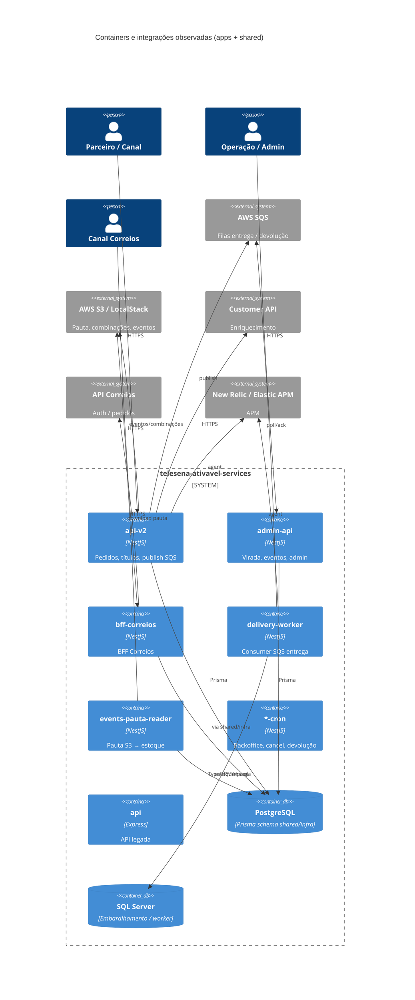
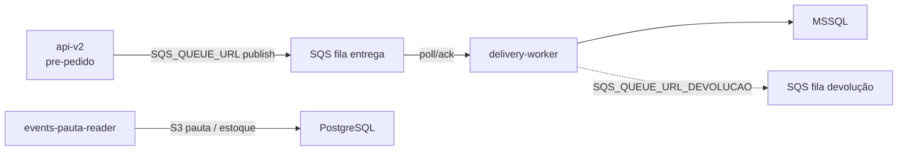

# Inventário AS-IS — telesena-ativavel-services (apps + shared)

- **Repositório**: `git@gitea.lidercap.com.br:lidercap-apps/telesena-ativavel-services.git` (local: `/home/mmanjos/work/repositories/modernização/telesena-ativavel-services`)
- **Escopo inspecionado**: `apps/**` e `shared/**` (metadados do monorepo, `docker-compose.yml`, `.github/workflows/` e `.env.example` usados como evidência transversal)
- **Commit inspecionado**: `d7d7f0f8` (`d7d7f0f8553689df0b963e7d36e03e0cd45c7a3e`)
- **Data do levantamento**: 2026-08-13
- **Responsável pelo levantamento**: agente (asset `prompt-inventario-repositorio.md` / SPEC-K9H204F1)
- **Stack**: TypeScript (NestJS + Express legado + Node-RED + Locust/Python no load-test)

## 1. Sumário executivo

- `Fato`: monorepo **pnpm workspace** (`apps/*`, `shared/*`) com **Nx 19.8.0**, **pnpm@9.1.0**, Biome 1.9.2 — `package.json:43`, `pnpm-workspace.yaml:1-3`, `nx.json:1-19`.
- `Fato`: domínio de produto = **Tele Sena Ativável** (pedidos físicos/digitais, estoque, pauta, embaralhamento, resgate, devolução Correios, virada de campanha, entrega de títulos) — modelos Prisma e apps de pedido/worker/cron.
- `Fato`: **11 apps** sob `apps/` e **2 libs** sob `shared/` (`core`, `infra`) — listagem de diretórios; `shared/*/package.json`.
- `Fato`: mensageria dominante = **AWS SQS** via `@lidercap-apps/message-broker@0.1.4`; **Kafka/Rabbit/BullMQ NÃO EXISTEM** no escopo — `shared/core/src/adapters/queue/sqs.client.ts`, deps em `shared/core` / `delivery-worker` / `events-pauta-reader` / `api-v2`.
- `Fato`: persistência principal = **PostgreSQL + Prisma** (`shared/infra/prisma/schema.prisma`, 622 linhas, ~30 models); **MSSQL** paralelo (embaralhamento / delivery-worker TypeORM) — `docker-compose.yml`, `shared/infra/.env.example:23-32`, `apps/delivery-worker/src/config/configuration.ts:41-81`.
- `Fato`: **Transactional Outbox / Inbox NÃO EXISTEM** no schema Prisma nem em nomes de tabelas — busca `outbox|inbox` no schema → vazio.
- `Fato`: contratos wire HTTP = **OpenAPI/Swagger** Nest (`api-v2`, `admin-api`, `bff-correios`); payloads SQS = classes TS que implementam `Payload` do message-broker; **`.proto` / AsyncAPI NÃO EXISTEM**.
- `Fato`: observabilidade mista — **New Relic** (`import "newrelic"`) em `api-v2`, `bff-correios`, `delivery-worker` + **elastic-apm-node** (toggle `APM_ENABLED`) em vários apps; logger Nest via **Pino** / `@newrelic/pino-enricher`.
- `Fato`: `CODEOWNERS` **NÃO EXISTE**; author do root package = Thomas Bouasli — `package.json:4-7`.
- `Inferência` (alta): padrão declarado de **ports/adapters** em `shared/core` + Nest modules em `shared/infra`, mas a pasta `domain` **importa Prisma, TypeORM e message-broker** — distância material às constraints DMPF de domínio sem I/O.

## 2. Evidências consultadas

- Manifestos: `package.json`, `pnpm-workspace.yaml`, `nx.json`, `shared/core/package.json`, `shared/infra/package.json`, `apps/*/package.json`
- Persistência: `shared/infra/prisma/schema.prisma`, migrations sob `shared/infra/prisma/migrations/`, `docker-compose.yml`, `shared/infra/.env.example`
- Mensageria: `shared/core/src/adapters/queue/sqs.client.ts`, `shared/core/src/ports/queue/IQueue.client.ts`, `shared/core/src/domain/order.ts`, `apps/api-v2/.../pre-pedido.service.ts`, `apps/delivery-worker/src/config/configuration.ts`, `apps/delivery-worker/src/core/worker/worker.service.ts`, testes de `events-pauta-reader`
- Observabilidade: `apps/api-v2/src/main.ts`, `apps/api-v2/src/apm.ts`, `apps/*/src/apm.ts`, `apps/delivery-worker/src/infra/logger/pino.logger.ts`
- Domínio/constraints: imports em `shared/core/src/domain/**` (`@prisma/client`, `typeorm`, `@lidercap-apps/message-broker`)
- CI/CD: listagem `.github/workflows/` (maioria `*.bck`; ativos aparentes: `deploy-hmg.yaml`, `deploy-prod.yaml`, `deploy-backoffice-cron-hmg.yaml`, `deploy-backoffice-cron-prod.yaml`, `semgrep.yml`)
- Comandos: `git rev-parse HEAD`; listagens; `rg` em `apps`/`shared`

## 3. Estrutura do repositório

Escopo deste relatório — árvore simplificada:

```text
telesena-ativavel-services/
├── apps/
│   ├── api/                        # Express + tsyringe + Prisma local (legado)
│   ├── api-v2/                     # Nest — API principal (pedidos, títulos, SQS publish)
│   ├── admin-api/                  # Nest — admin / virada de campanha / eventos
│   ├── bff-correios/               # Nest — BFF canal Correios
│   ├── delivery-worker/            # Nest — consumer SQS → MSSQL/entrega
│   ├── events-pauta-reader/        # Nest CLI — ingestão pauta S3 → estoque
│   ├── backoffice-cron/            # Nest Commander — exports / embaralhamento / filtros
│   ├── cancel-pedido-cron/         # Nest — cancelamento de pedidos pendentes
│   ├── devolucao-cron/             # Nest — devoluções
│   ├── mock-integrations-api/      # Express + Node-RED (mocks)
│   └── delivery-titulos-load-test/ # Python/Locust (carga)
├── shared/
│   ├── core/                       # ports, domain/entities, SqsClient, guards, interceptors
│   └── infra/                      # Prisma, repositories, Nest modules, S3, MSSQL, use-cases
├── docker-compose.yml              # postgres, sqlserver, localstack (S3)
├── Dockerfile*                     # api-v2, delivery-worker, backoffice-cron, etc.
├── package.json | pnpm-workspace.yaml | nx.json | biome.json
└── .github/workflows/              # deploys (muitos .bck) + semgrep
```

`Fato` — inventário de dirs: listagem de `apps/` e `shared/`; `pnpm-workspace.yaml:1-3`.

## 4. Arquitetura observada

`Inferência` (alta): monorepo de **produto ativável** com API Nest moderna (`api-v2`) + BFF + worker SQS + crons batch, compartilhando libs `core`/`infra`. Há **API legada** (`apps/api`, Express/tsyringe) ainda no tree. Dual-write/read entre **Postgres (Prisma)** e **SQL Server** (legado/embaralhamento/worker).

`Inferência` (média): intenção hexagonal em `shared/core` (`ports/`, `adapters/`, `domain/`), mas uso-cases e módulos Nest concentram-se em `shared/infra` e nas apps — fronteira domínio/aplicação/infra **porosa**.



## 5. Padrões vigentes

### 5.1 Mensageria

| Item | Situação | Rótulo | Evidência |
|---|---|---|---|
| Broker | AWS SQS via `@lidercap-apps/message-broker` (`SQSMessageBroker`) | Fato | `shared/core/src/adapters/queue/sqs.client.ts:2-38` |
| Porta | `IQueueClient` com `publishMessage` / `pollMessage` | Fato | `shared/core/src/ports/queue/IQueue.client.ts:3-9` |
| Produtores | `api-v2` (`sendPayloadsToQueue` → `publishMessage`) | Fato | `pre-pedido.service.ts:777-789` |
| `events-pauta-reader` vs fila | Dep `message-broker` + testes esperam `publishMessage`, mas o `PautaService` atual **não injeta** `IQueueClient` (fluxo S3/pauta → estoque) — teste/código dessincronizados | Fato | `events-pauta-reader/package.json:23`; `tests/pauta.service.spec.ts:48-115`; `src/services/pauta.service.ts` (ctors só repos/S3) |
| Consumidor | `delivery-worker` faz poll e ack/delete após processar | Fato | `worker.service.ts:33-188` |
| Filas (env) | `SQS_QUEUE_URL`, `SQS_QUEUE_URL_DEVOLUCAO`; região/`visibilityTimeout`/`maxRetries`/`backoff` | Fato | `delivery-worker/.../configuration.ts:23-39`; `api-v2/.../configuration.ts:33-36` |
| Formato | `OrderMessage` / `MessageBrokerMessage` implementam `Payload` (`id`, `when`, `event`, `apmTraceId?`, `tipo?`) | Fato | `shared/core/src/domain/order.ts:118-131` |
| Retry / DLQ | Retry/backoff configuráveis no worker; **DLQ nomeada no código: NÃO EXISTE** (pode existir só na infra AWS) | Fato / Lacuna | config worker; busca `DLQ` sem achado de política no repo |
| Outbox/Inbox | **NÃO EXISTE** | Fato | schema Prisma sem models outbox/inbox |
| Kafka/Rabbit/BullMQ | **NÃO EXISTEM** | Fato | deps e buscas no escopo |
| LocalStack | Compose sobe LocalStack com **SERVICES=s3** apenas — **SQS local NÃO** no compose | Fato | `docker-compose.yml` (serviço `localstack`) |



`Inferência` (média): publicação SQS ocorre **depois** da montagem de payloads no fluxo de envio de títulos (`sendTitulosToEcommerce` → `sendPayloadsToQueue`), **fora** de uma UoW outbox; falha de publish é logada e engolida no `catch` do loop — risco de **pedido persistido sem mensagem** (ou o inverso, a depender do ponto de chamada no fluxo maior). Evidência parcial: `pre-pedido.service.ts:638-807`.

### 5.2 Contratos

| Item | Situação | Rótulo | Evidência |
|---|---|---|---|
| OpenAPI/Swagger | Presente em `api-v2`, `admin-api`, `bff-correios` | Fato | `apps/api-v2/src/main.ts:35-41`; `admin-api/src/main.ts:29-37`; `bff-correios/src/main.ts:36-52` |
| Validação HTTP | `class-validator` / Joi / `ValidationPipe` Nest | Fato | deps packages; `api-v2/src/main.ts` ValidationPipe |
| Protobuf | **NÃO EXISTE** (nenhum `.proto`) | Fato | `find` / busca |
| AsyncAPI | **NÃO EXISTE** | Fato | busca |
| Schema SQS | Classes TS + `Payload`; **sem verificação de breaking change** | Fato / Inferência | `order.ts`; ausência de CI de contrato de mensagem |
| Ownership de contrato | **Lacuna** — sem CODEOWNERS nem doc de dono de schema | Lacuna | CODEOWNERS ausente |

### 5.3 Transação (UoW)

| Item | Situação | Rótulo | Evidência |
|---|---|---|---|
| Fronteira Prisma | `prisma.$transaction` em repositórios (`pedidos`, `eventos-resgate`, `titulos-venda-digital`, etc.) | Fato | `shared/infra/src/adapters/database/pedidos.repository.ts:225`; outros `$transaction` |
| Outbox | **NÃO EXISTE** | Fato | schema |
| Commit → publish | Publish SQS em serviço de aplicação **após** lógica de pedido, sem outbox; erros de publish apenas logados | Inferência (alta) | `pre-pedido.service.ts:777-806` |
| Worker / MSSQL | Consumer usa TypeORM/mssql; ack SQS condicionado a títulos vinculados (venda digital) | Fato | `worker.service.ts:77-188`; config MSSQL |

```mermaid
sequenceDiagram
title Do commit local à publicação (fluxo observado em api-v2)
participant API as api-v2
participant PG as PostgreSQL
participant SQS as AWS SQS
API->>PG: writes Prisma (pedido/títulos)
API->>SQS: publishMessage(payload)
Note over API,SQS: Sem outbox; falha de publish é catch+log
```

### 5.4 Observabilidade

| Item | Situação | Rótulo | Evidência |
|---|---|---|---|
| New Relic | Agent em `api-v2`, `bff-correios`, `delivery-worker`; enricher Pino | Fato | `import "newrelic"` nos `main.ts`; `@newrelic/pino-enricher` |
| Elastic APM | `elastic-apm-node` com `APM_ENABLED===1` em vários apps | Fato | `apps/api-v2/src/apm.ts:1-14`; `apps/*/src/apm.ts` |
| Logs | Pino / nestjs-pino; correlationId manual no worker | Fato | `worker.service.ts:41`; logger delivery-worker |
| Trace cross-async | Campo `apmTraceId` no payload SQS | Fato | `order.ts:122-126` |
| Prometheus | **NÃO EXISTE** no escopo apps/shared (sem endpoint `/metrics` típico encontrado nas buscas prioritárias) | Inferência (média) | ausência nas deps principais |
| Dual APM | Mesmo app (`api-v2`) carrega New Relic **e** pode iniciar Elastic APM | Fato | `main.ts:1` + `start()` de `apm.ts` |

## 6. Aderência às constraints

| Constraint | Situação | Rótulo | Evidência | Observação |
|---|---|---|---|---|
| Domínio sem I/O | **viola** | Fato | `shared/core/src/domain/order.ts:1` (`Payload` message-broker); `domain/pauta.ts:2`; `domain/types/*.ts` importam `@prisma/client`; `worker-titulos.entity.ts` / `worker-estoque.entity.ts` importam `typeorm` | Pasta `domain` não está isolada de ORM/broker |
| Protobuf apenas no wire | **não aplicável** | Fato | nenhum `.proto` no escopo | Justificativa: repositório não usa Protobuf |
| At-least-once | **adere** (comportamento SQS + ack pós-processamento); sem promessa exactly-once E2E encontrada | Inferência (alta) / Fato | `worker.service.ts` ack/delete após sucesso; busca `exactly-once` sem hits de política | Visibilidade timeout + reentrega implícita do SQS |

## 7. Inventário técnico

### 7.1 Libs e componentes

| Componente | Versão | Papel | Owner | Fonte do owner | Rótulo |
|---|---|---|---|---|---|
| `@telesena-ativavel-services/core` | 1.0.0 | Ports, domain/entities, SqsClient, guards | Lacuna | — | Fato (versão) / Lacuna (owner) |
| `@telesena-ativavel-services/infra` | 1.0.0 | Prisma repos, Nest modules, S3, MSSQL, use-cases | Lacuna | — | Fato / Lacuna |
| `@lidercap-apps/message-broker` | 0.1.4 | Cliente SQS compartilhado org | Lacuna (pacote externo) | package.json deps | Fato |
| `@lidercap-apps/logger` | 0.1.3 | Logger (delivery-worker / pauta-reader) | Lacuna | package.json | Fato |
| `@prisma/client` / `prisma` | 5.19.1 | ORM Postgres | Lacuna | shared/*/package.json | Fato |
| NestJS | ^10.x | Framework apps Nest | Lacuna | package.json apps | Fato |
| `newrelic` | ^12–^13 | APM | Lacuna | api-v2 / delivery-worker | Fato |
| `elastic-apm-node` | ^4.7.3 | APM alternativo/legado | Lacuna | vários apps | Fato |
| `typeorm` / `mssql` | ^0.3.20 / ^11 | Acesso SQL Server | Lacuna | core/infra/worker | Fato |
| Nx | 19.8.0 | Task runner/cache | Lacuna | root package.json | Fato |
| pnpm | 9.1.0 | Package manager | Lacuna | `packageManager` | Fato |
| Biome | 1.9.2 | Lint/format | Lacuna | root | Fato |
| Node runtime | **NÃO DECLARADO** (sem `engines` / `.nvmrc` / `.node-version`) | — | Lacuna | busca engines/nvmrc | Lacuna |
| Root author | Thomas Bouasli `<tbouasli@lidercap.com.br>` | metadado npm | — | `package.json:4-7` | Fato |

### 7.2 Dependências e integrações

**Upstream (de quem depende):**

- PostgreSQL (Prisma)
- Microsoft SQL Server (embaralhamento / delivery-worker)
- AWS SQS (`@lidercap-apps/message-broker`)
- AWS S3 (`@aws-sdk/client-s3`, `aws-sdk` v2 ainda presente em infra)
- API Correios (`CORREIOS_*` em `.env.example`)
- Customer API 2 (`CUSTOMER_API_2_*`)
- URL shortener / API digital (`URL_API_2_*`)
- New Relic / Elastic APM
- LocalStack (dev, S3)

**Downstream (quem depende deste monorepo):**

- `Lacuna` no código — não há manifesto de consumidores externos; `Inferência` (baixa): canais Correios, parceiros e ecommerce/títulos-service via webhook/fila (`titulosServiceWebhookEnable` vs SQS em `pre-pedido.service.ts:668-670`)

### 7.3 NFRs e restrições

| Item | Valor observado | Evidência | Rótulo |
|---|---|---|---|
| Broker adotado | SQS | sqs.client / configs | Fato |
| Cloud | AWS (S3/SQS); LocalStack S3 em dev | docker-compose / env | Fato |
| Dual database | Postgres + MSSQL obrigatórios no compose/env | docker-compose; `.env.example` | Fato |
| Segurança de entrada | ValidationPipe com `whitelist: false` / `forbidNonWhitelisted: false` em api-v2 | `api-v2/src/main.ts` | Fato |
| Secrets no repo | `.env.example` com placeholders; **senha SA no docker-compose** (`SqlServer2019!`) | `docker-compose.yml` sqlserver | Fato |
| CODEOWNERS | NÃO EXISTE | listagem | Fato |
| README raiz | NÃO EXISTE | listagem | Fato |
| Semgrep | workflow presente | `.github/workflows/semgrep.yml` | Fato |

### 7.4 Métricas atuais

| Métrica | Medida hoje? | Onde | Valor de referência | Rótulo |
|---|---|---|---|---|
| Latência/erro API | NÃO MEDIDO no repo | New Relic/APM externos | — | Lacuna |
| Lag/DLQ SQS | NÃO MEDIDO no repo | — | — | Lacuna |
| Cobertura de testes | Parcial (scripts `test`/`test:cov` por app; valores agregados NÃO MEDIDOS) | Jest configs | — | Lacuna |
| SLO versionado | NÃO EXISTE | — | — | Fato |

## 8. Achados fora do escopo priorizado

1. `Fato`: coexistência de **API legada** (`apps/api`, Express/tsyringe + Prisma próprio) e **api-v2** Nest — risco de divergência de comportamento.
2. `Fato`: **observabilidade dual** New Relic + Elastic APM no mesmo serviço (`api-v2`) — custo e ambiguidade de fonte da verdade de traces.
3. `Fato`: workflows de deploy majoritariamente com sufixo `.bck`; ativos aparentes concentrados em HMG/PROD genéricos e backoffice-cron — processo CI “vivo” vs arquivado ambíguo.
4. `Fato`: `delivery-titulos-load-test` em Python/Locust fora do toolchain pnpm/Nest — inventário de runtime misto.
5. `Fato`: `mock-integrations-api` + `node-red` no root dependencies — superfície de mock/integração acoplada ao monorepo.
6. `Inferência` (média): worker pode **não ack** mensagem quando pedido digital sem títulos (deleta pedido e “mantém na fila”) — potencial loop de reprocessamento até visibility/DLQ AWS (`worker.service.ts:126-145`).
7. `Fato`: constraint de domínio violada de forma sistêmica em `shared/core` (Prisma/TypeORM/broker no `domain/`) — dívida estrutural para adoção do golden path DMPF.
8. `Fato`: `events-pauta-reader` — testes ainda mockam `IQueueClient.publishMessage`, mas o serviço atual não publica na fila (descompasso teste×implementação).

## 9. Pontos críticos para manutenção

| Área | Risco | Impacto | Evidência | Rótulo |
|---|---|---|---|---|
| Publish sem outbox | Pedido persistido sem mensagem (ou inconsistência) | Entrega de títulos / experiência canal | `pre-pedido.service.ts:777-806` | Inferência (alta) |
| Domínio acoplado a ORM/broker | Refactors DMPF caros; tipos Prisma vazam | Evolução de contratos e testes | imports em `shared/core/src/domain/**` | Fato |
| Dual DB + dual APM | Diagnóstico e ops fragmentados | MTTR / onboarding | NR+APM; Postgres+MSSQL | Fato |
| Ack condicional no worker | Reprocessamento / pedidos deletados + mensagem retida | Consistência estoque/pedido | `worker.service.ts:126-145` | Fato |
| Ownership ausente | Sem CODEOWNERS / README raiz | Accountability | ausência de arquivos | Fato |
| API legada + v2 | Comportamentos paralelos | Regressões silenciosas | `apps/api` vs `apps/api-v2` | Inferência (média) |

## 10. Candidato a piloto

**Sim (com ressalvas)** — tem mensageria SQS real, ports/adapters declarados, monorepo Nest e dual-path commit→publish úteis para medir distância ao golden path; ressalvas: domínio contaminado por I/O, sem outbox, dual DB/APM e ausência de contratos formais de mensagem. Decisão formal: `SPEC-VVR1X71Q`.

## 11. Lacunas e perguntas em aberto

| O que | Por que não foi possível levantar | Quem pode responder |
|---|---|---|
| Nome/ARN exatos das filas SQS e DLQ em HMG/PRD | Só URLs via env; sem IaC no escopo apps/shared | Time de plataforma / dono do serviço |
| Node.js runtime oficial | Sem `engines` / `.nvmrc` | Time mantenedor |
| Ownership (team/CODEOWNERS) | Arquivo inexistente | Eng. manager / arquitetura |
| Status da API legada (`apps/api`) — ainda em produção? | Sem doc de depreciação | Time produto ativável |
| Consumers externos da fila / webhook títulos-service | Flags no código; topologia externa fora do repo | Time títulos / canais |
| Métricas/SLOs New Relic | Dashboards fora do repositório | NOC / SRE |
| Intenção de `events-pauta-reader` quanto a SQS | Dep + testes sugerem publish histórico; serviço atual é S3→DB | Mantenedor pauta-reader |

## 12. Resumo de confiança

| Área | Confiança | Justificativa |
|---|---|---|
| Arquitetura | Alta | Tree, packages e wiring Nest/Prisma/SQS inspecionados |
| Mensageria | Alta | Cliente SQS, producers/consumer e configs lidos |
| Contratos | Média | Swagger evidente; contratos SQS só tipados em TS |
| Transação | Média | `$transaction` e ausência de outbox claros; ordem exata de todos os fluxos não auditada E2E |
| Observabilidade | Alta | Agents e flags presentes no código |
| Ownership | Baixa | Sem CODEOWNERS; só author npm do root |
