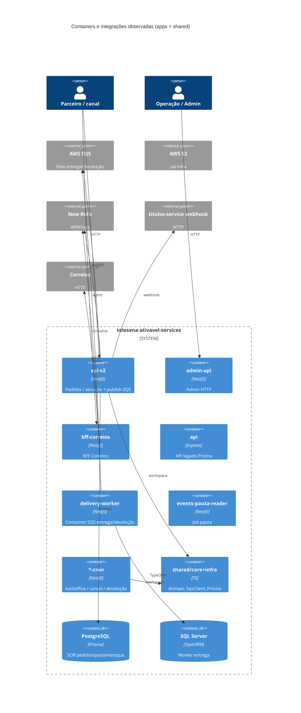
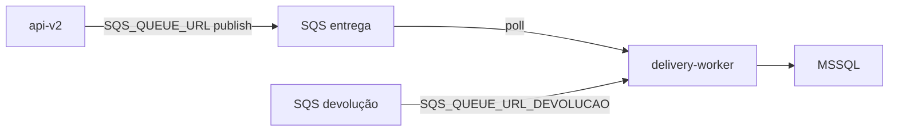
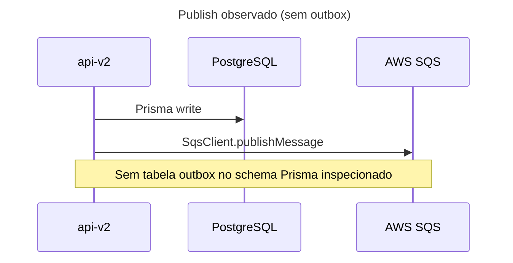

# Inventário AS-IS — telesena-ativavel-services (apps)

- **Repositório**: `git@gitea.lidercap.com.br:lidercap-apps/telesena-ativavel-services.git` (local: `/home/mmanjos/work/repositories/modernização/telesena-ativavel-services`)
- **Escopo inspecionado**: `apps/**` (metadados do monorepo e `shared/core` + `shared/infra` usados como evidência transversal — os apps dependem deles via `workspace:*`)
- **Commit inspecionado**: `d7d7f0f8` (`d7d7f0f8553689df0b963e7d36e03e0cd45c7a3e`)
- **Data do levantamento**: 2026-08-13
- **Responsável pelo levantamento**: agente (asset `prompt-inventario-repositorio.md` / SPEC-K9H204F1)
- **Stack**: TypeScript (NestJS 10 dominante; Express+tsyringe em `apps/api`; Node-RED em `mock-integrations-api`; Locust Python em load-test)

## 1. Sumário executivo

- `Fato`: monorepo pnpm (`packageManager: pnpm@9.1.0`) com Nx `19.8.0` só em `targetDefaults` (**sem `project.json`** em apps), workspace `apps/*` + `shared/*` — `package.json:39`, `pnpm-workspace.yaml`, `nx.json`.
- `Fato`: **11 apps** sob `apps/` — APIs Nest (`admin-api`, `api-v2`, `bff-correios`), API Express legado (`api`), crons Nest (`backoffice-cron`, `cancel-pedido-cron`, `devolucao-cron`), workers (`delivery-worker`, `events-pauta-reader`), mock Node-RED (`mock-integrations-api`) e load-test Locust (`delivery-titulos-load-test`) — listagem de `apps/`.
- `Fato`: domínio de produto = **Tele Sena Ativável** (pedidos, títulos, estoque, pauta, entrega/devolução, integração Correios) — modelos Prisma em `shared/infra/prisma/schema.prisma` (`Pedido`, `Pauta`, `Estoque`, `TitulosResgate`, etc.).
- `Fato`: mensageria = **AWS SQS** via `@lidercap-apps/message-broker@0.1.4`; `api-v2` publica `{ id, tipo, event }`; `delivery-worker` consome com poll + ack/delete — `pre-pedido.service.ts:858-862`, `worker.service.ts:28-175`, `shared/core/src/adapters/queue/sqs.client.ts`.
- `Fato`: **outbox / inbox / DLQ / exactly-once** como termos no código **NÃO EXISTEM**; at-least-once é **inferido** do ciclo SQS poll→process→delete.
- `Fato`: contratos wire HTTP = **Swagger** em `admin-api`, `api-v2`, `bff-correios`; Postman legado em `apps/api/artifacts/postman/`; **`.proto` / AsyncAPI NÃO EXISTEM**.
- `Fato`: persistência dual — **PostgreSQL/Prisma** (`shared/infra` + `apps/api/prisma`) e **MSSQL** no `delivery-worker` — `configuration.ts:41-81`, `pedidos.db.ts`.
- `Fato`: observabilidade dual — **New Relic + Pino** (`api-v2`, `bff-correios`, `delivery-worker`) e **Elastic APM** na maioria dos apps Nest/cron + API legado.
- `Fato`: ownership formal via `CODEOWNERS` **NÃO EXISTE**; author `Thomas Bouasli` / `tbouasli@lidercap.com.br` — `package.json:4-7`; README só em `.github/README.md`.
- `Inferência` (alta): camada `shared/core/src/domain` **não é domínio puro** — importa Prisma, TypeORM e `Payload` do message-broker (ver §6).

## 2. Evidências consultadas

- Manifestos: `package.json`, `pnpm-workspace.yaml`, `nx.json`, `apps/*/package.json`, `shared/core/package.json`, `shared/infra/package.json`
- Config/runtime: `apps/api-v2/src/config/configuration.ts`, `apps/delivery-worker/src/config/configuration.ts`, Dockerfiles raiz (`Dockerfile`, `Dockerfile.api-v2`, `Dockerfile-delivery-worker`, `Dockerfile.backoffice-cron`)
- Domínio/ports: `shared/core/src/domain/**`, `shared/core/src/ports/queue/IQueue.client.ts`, `shared/core/src/adapters/queue/sqs.client.ts`
- Observabilidade: `apps/*/src/main.ts`, `apps/delivery-worker/src/infra/logger/**`, `apps/*/package.json` (newrelic)
- Persistência: `shared/infra/prisma/schema.prisma`, `apps/api/prisma/schema.prisma`
- CI: `.github/workflows/` (maioria `*.bck`; ativos: `deploy-hmg.yaml`, `deploy-prod.yaml`, `deploy-backoffice-cron-*.yaml`, `semgrep.yml`)
- Buscas: `sqs|sns|kafka|bullmq|outbox|inbox|exactly-once|at-least-once|newrelic|SwaggerModule|.proto|CODEOWNERS` em `apps`/`shared`
- Comandos: `git rev-parse` / `git log -1`; listagem `apps/`/`shared/`; `rg`/`find`

## 3. Estrutura do repositório

Escopo deste relatório — árvore simplificada:

```text
telesena-ativavel-services/
├── apps/
│   ├── admin-api/                 # Nest — API admin + Swagger
│   ├── api/                       # Express + Prisma + tsyringe (legado)
│   ├── api-v2/                    # Nest — API principal + SQS publish + New Relic
│   ├── backoffice-cron/           # Nest CLI cron
│   ├── bff-correios/              # Nest BFF Correios + New Relic + Swagger
│   ├── cancel-pedido-cron/        # Nest cron cancelamento
│   ├── delivery-titulos-load-test/# Python Locust — carga webhook títulos
│   ├── delivery-worker/           # Nest worker SQS → MSSQL TSVirtual
│   ├── devolucao-cron/            # nest-commander (stubs parcial)
│   ├── events-pauta-reader/       # Nest cron — pautas S3 → estoque PG
│   └── mock-integrations-api/     # Node-RED + Express (:1880)
├── shared/                        # fora do escopo de apps/, mas dependência direta
│   ├── core/                      # domain, ports, adapters (SqsClient, entities)
│   └── infra/                     # Prisma schema/migrations + adapters
├── package.json | pnpm-workspace.yaml | nx.json
└── .github/workflows/
```

`Fato` — inventário de dirs: listagem de `apps/` e `shared/`; `pnpm-workspace.yaml`.

## 4. Arquitetura observada

`Inferência` (alta): sistema **multi-serviço no mesmo monorepo**, com API Nest (`api-v2`) como entrada de pedidos/ativação, BFF Correios, crons de backoffice/cancelamento/devolução, e worker de entrega consumindo SQS e gravando em MSSQL. Pacotes `shared/core` + `shared/infra` concentram domínio compartilhado e Prisma.

`Inferência` (média): intenção de ports/adapters em `shared/core` (`ports/` + `adapters/`), mas a pasta `domain/` mistura entidades de negócio com imports de ORM e tipagem de mensagem do broker.



## 5. Padrões vigentes

### 5.1 Mensageria

- `Fato`: broker = **AWS SQS**; cliente = `@lidercap-apps/message-broker` (`SQSMessageBroker`) encapsulado por `SqsClient` — `shared/core/src/adapters/queue/sqs.client.ts:1-74`, `shared/core/package.json` / `apps/delivery-worker/package.json` (`@lidercap-apps/message-broker: 0.1.4`).
- `Fato`: porta abstrata `IQueueClient` com `publishMessage` / `pollMessage` — `shared/core/src/ports/queue/IQueue.client.ts:3-8`.
- `Fato`: `api-v2` exige `SQS_QUEUE_URL` e publica via `PrePedidoService.sendPayloadsToQueue` — `apps/api-v2/src/config/configuration.ts:31-36`, `pre-pedido.service.ts:777-789,858-862`.
- `Fato`: `delivery-worker` configura `SQS_QUEUE_URL`, `SQS_QUEUE_URL_DEVOLUCAO`, `visibilityTimeout` (default 30), `maxRetries` (default 3), backoff — `apps/delivery-worker/src/config/configuration.ts:23-39`.
- `Fato`: fila HMG versionada no deploy — `https://sqs.us-east-1.amazonaws.com/009160062822/ativavel_order_payment_queue_homolog` — `deploy-hmg.yaml:63`.
- `Fato`: fila PROD no workflow aponta URL **LocalStack** (`.../localstack.cloud:4566/.../order-payment-queue`) — `deploy-prod.yaml:32` (possível misconfig).
- `Fato`: Kafka / RabbitMQ / BullMQ / SNS / DLQ **NÃO EXISTEM** no código de apps.
- `Fato`: `events-pauta-reader` declara `message-broker` mas **não registra `IQueueClient`** no `app.module` atual — `events-pauta-reader/src/app.module.ts:14-33`.
- `Fato`: `devolucao-cron.sendPedidoParaFila` é stub (`return` vazio) — `devolucao.service.ts:27-30`.



### 5.2 Contratos

- `Fato`: OpenAPI/Swagger gerado em runtime para `admin-api`, `api-v2`, `bff-correios` — `apps/admin-api/src/main.ts:29-37`, `apps/api-v2/src/main.ts:35-41`, `apps/bff-correios/src/main.ts:36-52`.
- `Fato`: payloads SQS tipados como classes que implementam `Payload` (`OrderMessage`, `MessageBrokerMessage`) e wire ad-hoc `{ id, tipo, event }` — `shared/core/src/domain/order.ts`, `pre-pedido.service.ts:858-862`.
- `Fato`: Postman legado em `apps/api/artifacts/postman/` — collection + envs.
- `Fato`: **`.proto` / AsyncAPI NÃO EXISTEM**; breaking-change check de contratos SQS **NÃO EXISTE**.
- `Lacuna`: dono formal dos contratos HTTP/SQS (além do author do `package.json`).

### 5.3 Transação (UoW)

- `Fato`: Prisma `$transaction` / `withTransaction` em API legado e backoffice-cron — amostragem `registros-vendas.pg.repository.ts:87`, `embaralhamento-numeros.service.ts`.
- `Fato`: MSSQL no delivery-worker via inserts raw (sem `$transaction` visível no adapter amostrado) — `pedidos.db.ts:20-38`.
- `Fato`: padrão **Transactional Outbox / Inbox NÃO EXISTE**.
- `Fato`: publish SQS em `api-v2` é direto (`publishMessage`) após fluxo de pedido — `pre-pedido.service.ts:789`.



### 5.4 Observabilidade

- `Fato`: New Relic + Pino em `api-v2`, `bff-correios`, `delivery-worker` — `apps/api-v2/src/main.ts:1`, `delivery-worker/src/main.ts:1`.
- `Fato`: Elastic APM também presente na maioria dos apps Nest/cron e na API legado — `*/src/apm.ts`, `apps/api/src/infra/server/main.ts`.
- `Fato`: HMG seta `APM_ENABLED=1` e `NEW_RELIC_ENABLED=false`; PROD seta `NEW_RELIC_ENABLED=true` — `deploy-hmg.yaml:28-31`, `deploy-prod.yaml:28-30`.
- `Fato`: OpenTelemetry / Prometheus / Datadog **NÃO EXISTEM** nos apps.
- `Lacuna`: dashboards/SLOs versionados no repositório **NÃO EXISTEM** (`NÃO MEDIDO`).

## 6. Aderência às constraints

| Constraint | Situação | Rótulo | Evidência | Observação |
|---|---|---|---|---|
| Domínio sem I/O | viola | Fato | `shared/core/src/domain/order.ts:1` (`Payload` de `@lidercap-apps/message-broker`); `shared/core/src/domain/entities/*.ts` importam `@prisma/client` e `typeorm` | Pasta `domain/` acoplada a ORM e tipagem de broker |
| Protobuf apenas no wire | não aplicável | Fato | `find apps -name '*.proto'` vazio | Sem Protobuf no escopo |
| At-least-once | adere (implícito) | Inferência | SQS + `visibilityTimeout`/`maxRetries` em `delivery-worker` config; ausência de promessa `exactly-once` no código | Sem declaração explícita `at-least-once`; comportamento típico SQS |

## 7. Inventário técnico

### 7.1 Libs e componentes

| Componente | Versão | Papel | Owner | Fonte do owner | Rótulo |
|---|---|---|---|---|---|
| pnpm | 9.1.0 | package manager | Lacuna | `package.json:39` | Fato (versão) |
| nx | 19.8.0 | monorepo tasks | Lacuna | `package.json:37` | Fato |
| @nestjs/* | ^10.x | runtime apps Nest | Lacuna | `apps/*/package.json` | Fato |
| @telesena-ativavel-services/core | workspace:* | domain/ports/adapters | Lacuna | `shared/core/package.json` | Fato |
| @telesena-ativavel-services/infra | workspace:* | Prisma/adapters | Lacuna | `shared/infra/package.json` | Fato |
| @lidercap-apps/message-broker | 0.1.4 | SQS client | Lacuna (lib plataforma) | `apps/delivery-worker/package.json`, `shared/core/package.json` | Fato |
| @lidercap-apps/logger | 0.1.3 | logging (worker/pauta) | Lacuna | `apps/delivery-worker/package.json`, `apps/events-pauta-reader/package.json` | Fato |
| @prisma/client / prisma | 5.19.1 (shared); ^5.21.0 (api legado) | ORM Postgres | Lacuna | `shared/core/package.json`, `apps/api/package.json` | Fato |
| typeorm | ^0.3.20 | ORM (shared + worker MSSQL) | Lacuna | `shared/core/package.json`, worker config | Fato |
| newrelic | ^12.22.0 / ^13.2.1 | APM | Lacuna | `apps/api-v2`, `bff-correios`, `delivery-worker` package.json | Fato |
| Thomas Bouasli | — | author manifesto | declarado | `package.json:4-7` | Fato |
| CODEOWNERS | — | ownership path-based | NÃO EXISTE | busca `CODEOWNERS` | Fato |

### 7.2 Dependências e integrações

**Upstream (de quem depende):**

- Canal Correios → `bff-correios` → `api-v2`
- Pautas S3 → `events-pauta-reader`
- AWS SQS, S3, PostgreSQL (Prisma), MSSQL (delivery-worker / backoffice)
- Customer API v2, Gamification API (bff), webhook títulos
- Pacotes `@lidercap-apps/message-broker`, `@lidercap-apps/logger`

**Downstream (quem depende deste sistema):**

- MSSQL TSVirtual (inserts do delivery-worker)
- Titulos Service Webhook (`TITULOS_SERVICE_WEBHOOK_URL`)
- Canais/parceiros via APIs HTTP (admin/api-v2/bff) — detalhamento externo = `Lacuna`

### 7.3 NFRs e restrições

| Item | Valor observado | Evidência | Rótulo |
|---|---|---|---|
| Broker adotado | AWS SQS | configs + message-broker | Fato |
| Cloud | AWS | configs + deploy workflows | Fato |
| CI ativo neste commit | 4 workflows deploy/semgrep; **20× `.bck`** | `.github/workflows/` | Fato |
| Segurança | `ADMIN_KEY`, JWT Nest, credenciais AWS via env | `api-v2` config | Fato |
| SLO/SLA versionado | NÃO EXISTE | ausência em docs | Fato |
| Engines Node fixos | NÃO EXISTE | busca `.nvmrc`/`.node-version` | Fato |
| Nx como orquestrador | mínimo (cache); builds via scripts pnpm root | `nx.json`, `package.json:11-18` | Fato |

### 7.4 Métricas atuais

| Métrica | Medida hoje? | Onde | Valor de referência | Rótulo |
|---|---|---|---|---|
| Latência/erro API | NÃO MEDIDO no repo | New Relic (externo) | — | Lacuna |
| Lag/fila SQS | NÃO MEDIDO no repo | — | — | Lacuna |
| Throughput entrega | NÃO MEDIDO no repo | load-test Python existe, sem baseline versionado | — | Lacuna |

## 8. Achados fora do escopo priorizado

- `Fato`: convivência de **API legado Express** (`apps/api`, Prisma local) com **api-v2 Nest** (shared Prisma) — risco de drift de migração.
- `Fato`: CI ativo só para **api-v2** e **backoffice-cron** (+ semgrep); **20 workflows `.bck`** — admin/bff/worker/mock fora do deploy versionado neste commit.
- `Fato`: `cancel-pedido-cron` duplica caminho Nest batch + `lambda-cron/index.js` com SQL pg direto.
- `Fato`: `delivery-worker` com ack condicional — pedido sem títulos **não** faz ack (reprocessa) — `worker.service.ts:127-145`.
- `Fato`: load-test Locust e mock Node-RED colocalizados no monorepo TS.
- `Fato`: tipagem fraca na porta de fila (`publishMessage(payload: any)`) — `IQueue.client.ts:4-5`.

## 9. Pontos críticos para manutenção

| Área | Risco | Impacto | Evidência | Rótulo |
|---|---|---|---|---|
| SQS PROD no workflow = LocalStack | Misconfig de deploy | Alto | `deploy-prod.yaml:32` | Fato |
| Sem idempotência/DLQ no consumer | Reprocessamento duplicado | Alto | `worker.service.ts`; grep idempoten → 0 | Fato / Inferência |
| `devolucao-cron` stub | Comportamento incompleto | Alto | `devolucao.service.ts:27-30` | Fato |
| Publish sem outbox | Falha entre commit e publish | Alto | `pre-pedido.service.ts:789` | Inferência |
| Domínio acoplado a Prisma/broker | Migração DMPF cara | Alto | `shared/core/src/domain/**` | Fato |
| Dual stack API + dual DB | Drift e fronteiras cruzadas | Médio/Alto | `apps/api` vs `api-v2`; PG+MSSQL | Fato |
| 20 workflows CI desativados | Deploy out-of-band | Médio | `*.bck` | Fato |
| Ownership ausente | Governança | Médio | CODEOWNERS ausente | Fato |

## 10. Candidato a piloto

**Sim** — `Inferência`: candidatos naturais AS-IS = **`api-v2`** (CI ativo, Swagger, producer SQS) + **`delivery-worker`** (consumer isolado, New Relic) e, em menor escopo, **`events-pauta-reader`** (S3→PG). Complexidade e domínio acoplado a I/O elevam custo. Decisão formal em `SPEC-VVR1X71Q`.

## 11. Lacunas e perguntas em aberto

| O que | Por que não foi possível levantar | Quem pode responder |
|---|---|---|
| SQS PROD real vs URL LocalStack no workflow | Workflow suspeito; runtime não inspecionado | Plataforma / dono do serviço |
| DLQ/redrive policy AWS | Não referenciada no repo | SRE / infra |
| Uso real de SQS em `events-pauta-reader` | Dep presente, módulo sem `IQueueClient` | Mantenedores do app |
| Estado de deploy de admin/bff/worker/mock | Só workflows `.bck` neste commit | Plataforma |
| Consumidores externos e SLOs | Não versionados | Produto / NOC |
| Engines Node canônicos | Sem `.nvmrc`/`engines` | Plataforma |

## 12. Resumo de confiança

| Área | Confiança | Justificativa |
|---|---|---|
| Arquitetura | Alta | Apps, shared e configs inspecionados com âncoras |
| Mensageria | Alta | SQS + producer/consumer + URLs de deploy |
| Contratos | Média | Swagger/Postman ok; wire SQS informal |
| Transação | Média | Prisma claro; MSSQL e ordem publish amostrados |
| Observabilidade | Alta | NR + Elastic + flags de deploy |
| Ownership | Baixa | Só author no package.json; sem CODEOWNERS |
| Deploy AWS real | Baixa | workflows parciais; SQS prod LocalStack |
