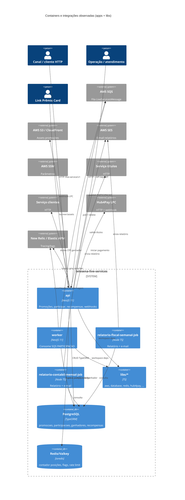
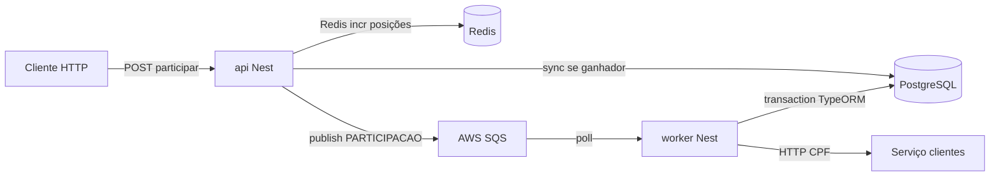
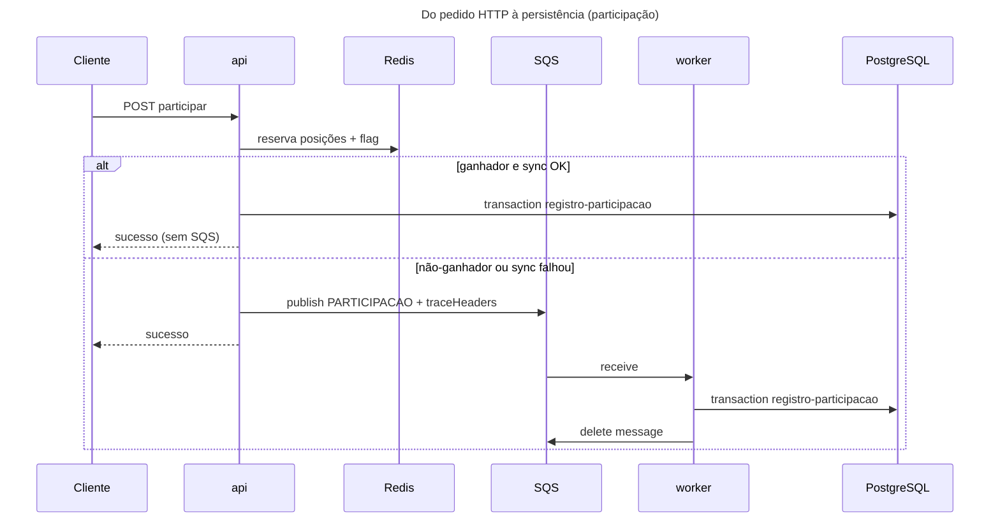

# Inventário AS-IS — telesena-live-services (apps + libs)

- **Repositório**: `git@gitea.lidercap.com.br:lidercap-apps/telesena-live-services.git` (local: `/home/mmanjos/work/repositories/modernização/telesena-live-services`)
- **Escopo inspecionado**: `apps/**` e `libs/**` (metadados do monorepo, `docs/`, `.github/workflows/` e Dockerfiles usados como evidência transversal)
- **Commit inspecionado**: `dd50a92` (`dd50a9268a1f16028a746ff83a1a1e2163e01eed`)
- **Data do levantamento**: 2026-08-13
- **Responsável pelo levantamento**: agente (asset `prompt-inventario-repositorio.md` / SPEC-K9H204F1)
- **Stack**: TypeScript (NestJS 11 + jobs Node)

## 1. Sumário executivo

- `Fato`: monorepo **pnpm workspace** (`@telesena-live-services/root`), **pnpm@11.20.0**, Nest pinado em **11.1.28**, imagens Docker em **Node 23.11-alpine**; workflow de migrations usa **Node 22** — `package.json:1-17`, `pnpm-workspace.yaml:11-13`, `apps/api/Dockerfile:1`, `.github/workflows/migrations.yaml:131`.
- `Fato`: **4 apps** (`api`, `worker`, `relatorio-fiscal-semanal-job`, `relatorio-contabil-mensal-job`) e **11 libs** (`apm`, `aws`, `clientes`, `database`, `file`, `hub4pay`, `mailer`, `picpay`, `redis`, `registro-participacao`, `titulos`) — listagem de `apps/`/`libs/` e `*/package.json`.
- `Fato`: domínio de produto = **Tele Sena ao vivo** — promoções, reserva de posições, participações/ganhadores, recompensas (voucher) e webhook de pagamento Link Prêmio Card — `apps/api/README.md:1-8`, `apps/api/src/setup.ts:14-16`.
- `Fato`: mensageria = **AWS SQS** via `@lidercap-apps/message-broker@0.2.0` (publish) + `@aws-sdk/client-sqs` (poll raw no worker); **Kafka / Rabbit / BullMQ NÃO EXISTEM** em `apps/`/`libs/` — `libs/aws/package.json`, `libs/aws/src/sqs/sqs.service.ts:2-29`, `rg` sem matches.
- `Fato`: **Transactional Outbox / Inbox NÃO EXISTEM**; publicação SQS ocorre **fora** de fronteira DB (após tentativa síncrona de persistir ganhador, ou direto para não-ganhador) — `apps/api/.../participacoes.service.ts` (`salvarParticipacoes`), `rg outbox|inbox` vazio.
- `Fato`: contratos wire HTTP = **Swagger Nest** em `/live-service/v1/docs`; payloads SQS tipados em TS (`LiveServicesMessage`); **`.proto` / AsyncAPI NÃO EXISTEM** — `apps/api/src/setup.ts:12-22`, `libs/aws/src/sqs/sqs.types.ts`, `find *.proto` = 0.
- `Fato`: observabilidade = **New Relic** (default) ou **Elastic APM** via `libs/apm`, com propagação de `traceHeaders` na mensagem SQS; logs **Pino** (`nestjs-pino`) — `libs/apm/src/index.ts:1-40`, `apps/worker/.../sqs-consumer.service.ts:56`.
- `Fato`: ownership formal via `CODEOWNERS` **NÃO EXISTE** — ausência em raiz e `.github/`.
- `Inferência` (média): candidato a piloto **parcial** para DMPF — fluxo SQS + Postgres + idempotência por unique index e guard de participação são concretos, mas sem outbox e com contrato de fila só em TypeScript.

## 2. Evidências consultadas

- Manifestos: `package.json`, `pnpm-workspace.yaml`, `.npmrc`, `apps/*/package.json`, `libs/*/package.json`, `apps/*/Dockerfile`
- Docs: `apps/api/README.md`, `apps/worker/README.md`, `docs/specs/SPEC-JCVYBFKW-teste-carga-k6.md`
- CI: `.github/workflows/deploy-dev-hmg.yaml`, `deploy-prod.yaml`, `migrations.yaml`
- Código ancorado: `libs/aws` (SQS/SQSRaw), `libs/apm`, `libs/database` (entities/migrations), `libs/registro-participacao`, `apps/api` (application/infra/domain), `apps/worker/src/sqs-consumer`, jobs de relatório
- Buscas: `sqs|outbox|inbox|kafka|exactly-once|DLQ|.proto|CODEOWNERS|transaction|idempot` em `apps`/`libs`/`docs`
- Comandos: `git rev-parse HEAD`; listagens `apps/`/`libs/`; `rg`/`find`

## 3. Estrutura do repositório

Escopo deste relatório — árvore simplificada:

```text
telesena-live-services/
├── apps/
│   ├── api/                              # Nest — HTTP /live-service/v1
│   ├── worker/                           # Nest — consumer SQS
│   ├── relatorio-fiscal-semanal-job/     # script TS — relatório + e-mail SES
│   └── relatorio-contabil-mensal-job/    # script TS — relatório + e-mail SES
├── libs/
│   ├── apm/                   # New Relic / Elastic APM + enricher Pino
│   ├── aws/                   # S3, CloudFront, SES, SSM, SQS, SQSRaw
│   ├── clientes/              # HTTP cliente → serviço de clientes
│   ├── database/              # TypeORM PG + entities + migrations
│   ├── file/                  # utilitário de arquivo (jobs)
│   ├── hub4pay/               # Link Prêmio Card (pagamento recompensa)
│   ├── mailer/                # Nodemailer + SES
│   ├── picpay/                # cliente PicPay (lib presente; não referenciada por apps*)
│   ├── redis/                 # ioredis wrapper
│   ├── registro-participacao/ # use case compartilhado API + worker
│   └── titulos/               # HTTP cliente → validação/consulta títulos
├── docs/specs/                # SPEC-JCVYBFKW (k6) — fora do escopo apps/libs
├── utils/{redis,valkey}/      # docker-compose local (fora do escopo apps/libs)
├── .github/workflows/         # CD + migrations
└── package.json | pnpm-workspace.yaml
```

\* `Fato`: import `@telesena-live-services/picpay` **não aparece** em código de `apps/` (só README e o próprio `libs/picpay/package.json`) — `rg '@telesena-live-services/picpay'`.

`Fato` — inventário de dirs: listagem de `apps/` e `libs/`; `pnpm-workspace.yaml:1-3`.

## 4. Arquitetura observada

`Inferência` (alta): sistema **API + worker SQS + jobs batch** no mesmo monorepo, com **PostgreSQL** (TypeORM) como SOR e **Redis/Valkey** para contador de posições, cache de participação e rate limit. Integrações síncronas HTTP com serviços de **títulos** e **clientes**; pagamento de recompensa via **Hub4Pay / Link Prêmio Card** + webhook.

`Inferência` (média): a API organiza pastas em `domain` / `application` / `infra`, mas a pasta `domain` contém sobretudo **DTOs Swagger** (não um modelo de domínio puro). A lógica de negócio vive em `application/services` e em libs compartilhadas (`registro-participacao`, `database` entities).



## 5. Padrões vigentes

### 5.1 Mensageria

| Item | Situação | Rótulo | Evidência |
|---|---|---|---|
| Broker | **AWS SQS** | `Fato` | `apps/worker/package.json:3,21`; `libs/aws/src/sqs*`; `apps/api/README.md:94,142` |
| Kafka / Rabbit / BullMQ | **NÃO EXISTE** | `Fato` | `rg` sem matches em `apps`/`libs` |
| Fila | URL via `SQS_QUEUE_URL` (única fila observada no código) | `Fato` | `apps/worker/src/config/environment.ts:5-17`; `apps/api/src/infra/config/environment.ts:14,54` |
| Producer | `api` → `SQSService.getQueueInstance(...).publish` (`@lidercap-apps/message-broker`) | `Fato` | `libs/aws/src/sqs/sqs.service.ts:2-29`; `participacoes.service.ts:350` |
| Consumer | `worker` → `SQSRawService.pollForMessagesAndProcess` (long poll + delete on success) | `Fato` | `apps/worker/.../sqs-consumer.service.ts:32-47`; `libs/aws/src/sqs-raw/sqs-raw.service.ts:21-55` |
| Tipos de mensagem | `PARTICIPACAO`, `TESTE` | `Fato` | `libs/aws/src/sqs/sqs.types.ts:13-16` |
| Formato | JSON (`LiveServicesMessage`: `id`, `type`, `params`, `traceHeaders?`) | `Fato` | `libs/aws/src/sqs/sqs.types.ts:18-29` |
| Retry | Em falha de processamento, **não deleta** a mensagem → reaparece após `VisibilityTimeout` (default 30s) | `Fato` | `sqs-raw.service.ts:46-50`; `environment.ts:20` |
| DLQ / poison | **NÃO MEDIDO no código** — sem `SendToDLQ` / `SQS_DLQ_URL`; depende de RedrivePolicy da fila AWS (fora do repo) | `Lacuna` | `rg DLQ` sem implementação de envio; só log "Will be retried" |
| Duplicata consumo | Guard: se participação CPF+promo já existe, worker **retorna sem erro** (ack implícito via delete após process) | `Fato` | `registro-participacao.service.ts:48-56` |
| Unique DB | Índice único `(promocao, posicao)` para corrida de reserva | `Fato` | migration `1785958178536-...:8` `UQ_PARTICIPACAO_PROMOCAO_POSICAO` |



### 5.2 Contratos

| Item | Situação | Rótulo | Evidência |
|---|---|---|---|
| OpenAPI HTTP | Swagger runtime Nest em `/live-service/v1/docs` | `Fato` | `apps/api/src/setup.ts:12-22` |
| Prefixo API | `/live-service/v1` | `Fato` | `setup.ts:12` |
| DTOs | `class-validator` + `@nestjs/swagger` `ApiProperty` em `apps/api/src/domain/**/types` | `Fato` | imports em `domain/participacoes/types/...:1-2` |
| Contrato SQS | Tipo TS `LiveServicesMessage` na lib `aws` — **sem schema versionado** (sem `.proto`/AsyncAPI) | `Fato` | `sqs.types.ts`; `find *.proto` = 0 |
| Compatibilidade breaking | **NÃO EXISTE** verificação automatizada de contrato de fila | `Fato` | ausência de tooling/CI dedicado |
| Webhook LPC | Body DTO + Bearer secret; idempotência por `webhookId` no histórico | `Fato` | `apps/api/README.md:41-47`; `linkpremio-card-webhook.service.ts:129-131` |
| Owner do contrato | **NÃO DECLARADO** (`CODEOWNERS` ausente) | `Lacuna` | ausência de CODEOWNERS |

### 5.3 Transação (UoW)

| Item | Situação | Rótulo | Evidência |
|---|---|---|---|
| Fronteira DB | `connection.transaction` / `manager.transaction` / `dataSource.transaction` em vários serviços | `Fato` | `registro-participacao.service.ts:75`; `participacoes.service.ts:375`; `recompensas.service.ts:90,177`; `promocoes.service.ts:141+`; webhook LPC `:117` |
| Outbox / Inbox | **NÃO EXISTE** | `Fato` | `rg outbox|inbox` vazio em `apps`/`libs` |
| Participar → fila | Fluxo: Redis reserva → (se ganhador) tenta persistência síncrona → se não persistiu / não-ganhador → **publish SQS**; falha de publish aborta confirmação | `Fato` | `participacoes.service.ts:313-358` (`salvarParticipacoes`) |
| Worker UoW | Uma transação cobre participações + ganhadores + recompensas + histórico | `Fato` | `registro-participacao.service.ts:75-103` |
| Entre commit e publish | Para não-ganhador: **não há commit local antes do publish** no caminho async — a persistência ocorre no worker; risco de mensagem sem persistência se worker falhar até DLQ AWS | `Inferência` (alta) | ausência de outbox + publish-first async path |
| Compensação Redis | Em falha após reserva: `decrementByIfUnchanged` + delete flag participação | `Fato` | `participacoes.service.ts:275+` (catch após reserva) |



### 5.4 Observabilidade

| Item | Situação | Rótulo | Evidência |
|---|---|---|---|
| APM | New Relic (default) ou Elastic APM; gate `APM_ENABLED=1` | `Fato` | `libs/apm/src/index.ts:4-18,172-178` |
| Libs APM | `newrelic@14.0.0`, `elastic-apm-node@4.15.0`, `@newrelic/pino-enricher@1.1.1` | `Fato` | `libs/apm/package.json` |
| Logs | Pino via `nestjs-pino`; redact de `authorization` | `Fato` | `apps/api/src/infra/modules/app.module.ts:16-44` |
| Trace async | `getAPMTraceHeaders()` no publish; `startAPMTransaction(..., traceHeaders)` no consumer | `Fato` | `participacoes.service.ts:340`; `sqs-consumer.service.ts:56`; `libs/apm/src/index.ts:213-231` |
| Métricas Prometheus / OTel | **NÃO EXISTE** instrumentação Prometheus/OpenTelemetry no código inspecionado | `Fato` | `rg prometheus|opentelemetry` sem hits de uso em apps/libs (além de allowBuilds protobufjs) |
| Dashboards / SLO versionados | **NÃO EXISTE** no repositório | `Lacuna` | só `docs/specs` de k6 em planejamento |

## 6. Aderência às constraints

| Constraint | Situação | Rótulo | Evidência | Observação |
|---|---|---|---|---|
| Domínio sem I/O | **viola** / camada frágil | `Fato` | `apps/api/src/domain/**/types/*.ts` importam `@nestjs/swagger` e enums de `@telesena-live-services/database` | Pasta `domain` = DTOs de API, não domínio isolado; I/O real está em `application` + entities TypeORM |
| Protobuf apenas no wire | **não aplicável** | `Fato` | `find *.proto` = 0 | Sem Protobuf; wire SQS = JSON tipado em TS |
| At-least-once | **adere** (comportamento SQS) | `Inferência` (alta) | `sqs-raw.service.ts:46-50` (não delete em erro); sem menção a exactly-once | `rg exactly-once` vazio; idempotência parcial via unique index + guard de participação existente |

## 7. Inventário técnico

### 7.1 Libs e componentes

| Componente | Versão | Papel | Owner | Fonte do owner | Rótulo |
|---|---|---|---|---|---|
| `@telesena-live-services/api` | 1.0.0 | App Nest HTTP | `Lacuna` | — | `Fato` (versão) / `Lacuna` (owner) |
| `@telesena-live-services/worker` | 1.0.0 | Consumer SQS Nest | `Lacuna` | — | idem |
| `@telesena-live-services/relatorio-*-job` | 1.0.0 | Jobs batch relatório/e-mail | `Lacuna` | — | idem |
| `@telesena-live-services/apm` | 1.0.0 | APM New Relic/Elastic | `Lacuna` | — | `Fato` |
| `@telesena-live-services/aws` | 1.0.0 | AWS SDK wrappers + message-broker | `Lacuna` | — | `Fato` |
| `@telesena-live-services/database` | 1.0.0 | TypeORM PG + migrations | `Lacuna` | — | `Fato` |
| `@telesena-live-services/redis` | 1.0.0 | ioredis | `Lacuna` | — | `Fato` |
| `@telesena-live-services/registro-participacao` | 1.0.0 | Persistência participação/ganhador | `Lacuna` | — | `Fato` |
| `@telesena-live-services/hub4pay` | 1.0.0 | Pagamento LPC | `Lacuna` | — | `Fato` |
| `@telesena-live-services/titulos` | 1.0.0 | Cliente HTTP títulos | `Lacuna` | — | `Fato` |
| `@telesena-live-services/clientes` | 1.0.0 | Cliente HTTP clientes | `Lacuna` | — | `Fato` |
| `@telesena-live-services/mailer` / `file` | 1.0.0 | Jobs relatório | `Lacuna` | — | `Fato` |
| `@telesena-live-services/picpay` | 1.0.0 | Cliente PicPay (legado/doc) | `Lacuna` | — | `Fato` — **sem consumidor em apps** |
| `@nestjs/*` | 11.1.28 (pin) | Framework | — | `pnpm-workspace.yaml:11-13` | `Fato` |
| `typeorm` | 0.3.31 | ORM | — | `libs/database/package.json` | `Fato` |
| `@lidercap-apps/message-broker` | 0.2.0 | Publish SQS | — | `libs/aws/package.json:8`; `pnpm-workspace.yaml:31` | `Fato` |
| `@aws-sdk/client-*` | 3.1057.0 | AWS | — | manifests aws/api/worker | `Fato` |
| Runtime Node (imagem) | 23.11-alpine | Docker | — | `apps/*/Dockerfile:1` | `Fato` |
| Runtime Node (migrations CI) | 22 | GHA template | — | `migrations.yaml:131` | `Fato` |

### 7.2 Dependências e integrações

**Upstream (de quem este sistema depende)**

| Integração | Papel | Evidência | Rótulo |
|---|---|---|---|
| PostgreSQL | SOR promoções/participações/recompensas | `libs/database` (`pg`, TypeORM) | `Fato` |
| Redis/Valkey | Contador posições, cache, rate limit | `libs/redis`; `utils/redis|valkey` | `Fato` |
| AWS SQS | Fila assíncrona participação | env `SQS_QUEUE_URL` | `Fato` |
| AWS S3 / CloudFront / SSM / SES | Assets, config, e-mail | `libs/aws`; jobs | `Fato` |
| Serviço títulos | Validação/consulta títulos elegíveis | `libs/titulos`; módulo participações | `Fato` |
| Serviço clientes | Dados do CPF (ganhador) | `libs/clientes`; `registro-participacao` | `Fato` |
| Hub4Pay / Link Prêmio Card | Pagamento voucher + webhook | `libs/hub4pay`; `recompensas.module.ts:12-15` | `Fato` |
| New Relic / Elastic APM | Tracing | `libs/apm` | `Fato` |
| Verdaccio / `@lidercap-apps/message-broker` | Lib org de broker | `pnpm-workspace.yaml:27-31` | `Fato` |

**Downstream (quem depende deste sistema)**

| Consumidor | Observação | Rótulo |
|---|---|---|
| Canais / frontends Tele Sena Live | HTTP `/live-service/v1` (não há clientes listados no repo) | `Lacuna` — callers externos não versionados aqui |
| LPC (webhook) | Callback para status de pagamento | `Fato` — `POST /webhooks/link-premio-card` |

### 7.3 NFRs e restrições

| Item | Valor observado | Evidência | Rótulo |
|---|---|---|---|
| Auth API | Guards `x-api-key` / JWT (`@nestjs/jwt`) | `apps/api/src/infra/http/guards/` | `Fato` |
| Webhook secret | `LINKPREMIO_WEBHOOK_SECRET` opcional; sem secret → 503 no endpoint | `apps/api/README.md:43-44` | `Fato` |
| Rate limit | Redis `incrementAndExpire`; fail-open se Redis falhar | `rate-limiter.utils.ts:12-29` | `Fato` |
| ignore-scripts pnpm | `ignore-scripts=true`; allowBuilds lista New Relic nativos como `false` | `.npmrc`; `pnpm-workspace.yaml:18-25` | `Fato` |
| Cloud | AWS (SQS/S3/SES/SSM) implícito | libs aws + Docker CD | `Fato` |
| SLO / RPO / RTO | **NÃO EXISTE** declaração no repo | — | `Lacuna` |
| Descascamento doc×código | README da API ainda documenta PicPay como processador; código de recompensas usa **Hub4Pay** | `apps/api/README.md:107,141` vs `recompensas.service.ts:15` | `Fato` |

### 7.4 Métricas atuais

| Métrica | Medida hoje? | Onde | Valor de referência | Rótulo |
|---|---|---|---|---|
| Latência / erro API | NÃO MEDIDO no repo | APM externo se habilitado | — | `Lacuna` |
| Lag / age fila SQS | NÃO MEDIDO no repo | CloudWatch (fora) | — | `Lacuna` |
| Taxa participação / conflito unique | NÃO MEDIDO | — | — | `Lacuna` |
| Suite k6 | Planejada (SPEC), não entregue como artefato estável no escopo apps/libs | `docs/specs/SPEC-JCVYBFKW-...` stage `planning` | — | `Fato` |

## 8. Achados fora do escopo priorizado

1. `Fato`: lib `@telesena-live-services/picpay` existe e o README da API a cita, mas **nenhum app importa** o pacote — dívida/doc desatualizada (`rg` + `apps/api/README.md:107`).
2. `Fato`: jobs de relatório têm `"test": "echo \"Error: no test specified\" && exit 1"` — sem suite — `apps/relatorio-*/package.json`.
3. `Fato`: runtime Docker **Node 23.11** vs migrations CI **Node 22** — divergência de toolchain — Dockerfiles vs `migrations.yaml:131`.
4. `Inferência` (média): caminho “publish SQS sem outbox” + compensação Redis best-effort é ponto sensível sob carga (a própria SPEC-JCVYBFKW de k6 existe por causa da corrida de posições).
5. `Fato`: mensagem de tipo desconhecido no worker é apenas logada como warn; ainda assim o fluxo de poll **deleta após `process` retornar sem throw** — `sqs-consumer.service.ts:68` + `sqs-raw.service.ts:39-45` → risco de **perda silenciosa** de tipos desconhecidos.
6. `Fato`: monorepo **não é Nx** (sem `nx.json` / `project.json`); packaging é pnpm workspace puro.

## 9. Pontos críticos para manutenção

| Área | Risco | Impacto | Evidência | Rótulo |
|---|---|---|---|---|
| Publish sem outbox | Mensagem enfileirada sem garantia atômica com estado Redis/DB; compensação best-effort | Participação perdida ou posição “fantasma” até intervenção | `salvarParticipacoes`; catch Redis | `Inferência` (alta) |
| DLQ só na infra AWS | Sem política explícita no código; poison message depende de config externa | Mensagens travadas / reprocessamento infinito se Redrive ausente | `sqs-raw.service.ts:46-50` | `Lacuna` / `Inferência` |
| Domínio = DTOs Swagger | Fronteira domínio/aplicação pouco nítida para golden path DMPF | Adoção de “domínio sem I/O” exige redesenho | `apps/api/src/domain/**` | `Fato` |
| Contrato SQS só em TS | Mudança de shape API↔worker sem gate de breaking change | Falhas em runtime no consumer | `sqs.types.ts` | `Fato` |
| Ownership ausente | Sem CODEOWNERS | Escalação / review ownership indefinidos | ausência de arquivo | `Fato` |
| Doc PicPay vs Hub4Pay | Onboarding/ops podem configurar integração errada | Erro operacional | README vs `hub4pay` | `Fato` |

## 10. Candidato a piloto

**Parcial / condicional — não como piloto E2E completo da fundação.** Justificativa: tem SQS + Postgres + idempotência parcial e stack Nest alinhada à org, mas carece de outbox, contratos formais de fila e camada de domínio limpa; melhor como **caso de estudo de at-least-once sem outbox** do que como golden path de referência.

## 11. Lacunas e perguntas em aberto

| O que | Por que não foi possível levantar | Quem pode responder |
|---|---|---|
| Nome/URL real da fila SQS e RedrivePolicy/DLQ | Só `SQS_QUEUE_URL` via env; infra fora do repo | Time de plataforma / quem mantém Terraform/CloudFormation |
| Ownership do serviço | Sem CODEOWNERS / metadado de time | Eng. manager / Gitea teams |
| Callers downstream (quais apps consomem a API) | Não há catálogo de consumidores no repo | Time de canais Tele Sena |
| Valores atuais de SLO/latência/erro | Sem dashboard versionado; APM externo | Observabilidade / New Relic account owners |
| Status da lib PicPay (deprecada?) | Código morto aparente vs README ativo | Autores do módulo recompensas |
| Ambiente padrão de APM em prod (NR vs Elastic) | Só config por env | Ops / valores SSM |

## 12. Resumo de confiança

| Área | Confiança | Justificativa |
|---|---|---|
| Arquitetura | Alta | Estrutura apps/libs e fluxos API→SQS→worker lidos no código |
| Mensageria | Alta | Implementação SQS publish/poll ancorada; DLQ AWS é lacuna externa |
| Contratos | Alta | Swagger + tipos TS observados; ausência de proto/AsyncAPI confirmada |
| Transação | Alta | Transactions TypeORM e ausência de outbox confirmadas |
| Observabilidade | Média | Código APM/Pino claro; efetividade em prod depende de env externo |
| Ownership | Baixa | Nenhum artefato de dono no repositório |
