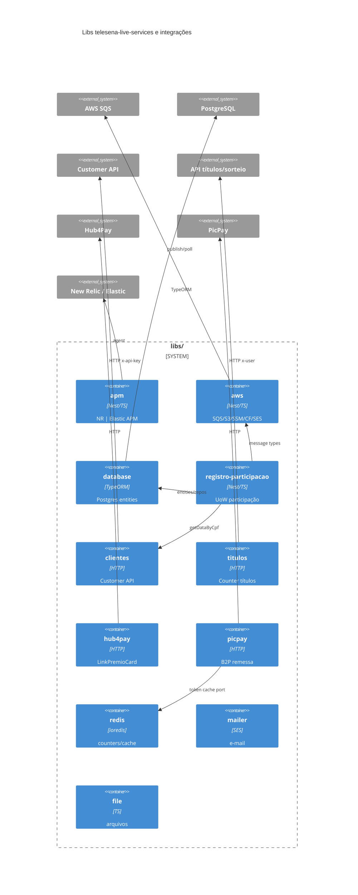
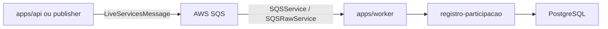
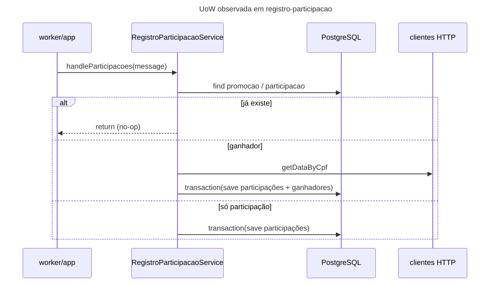

# Inventário AS-IS — telesena-live-services (libs)

- **Repositório**: `git@gitea.lidercap.com.br:lidercap-apps/telesena-live-services.git` (local: `/home/mmanjos/work/repositories/modernização/telesena-live-services`)
- **Escopo inspecionado**: `libs/**` (11 pacotes `@telesena-live-services/*`); metadados do monorepo e `apps/**` usados só como contexto de consumo
- **Commit inspecionado**: `dd50a92` (`dd50a9268a1f16028a746ff83a1a1e2163e01eed`)
- **Data do levantamento**: 2026-08-13
- **Responsável pelo levantamento**: agente (asset `prompt-inventario-repositorio.md` / SPEC-K9H204F1)
- **Stack**: TypeScript / NestJS 11

## 1. Sumário executivo

- `Fato`: monorepo pnpm (`packageManager: pnpm@11.20.0`) com workspace `apps/*` + `libs/*`, Nest pinado em `11.1.28` via `pnpm-workspace.yaml` overrides — `package.json`, `pnpm-workspace.yaml`.
- `Fato`: **11 libs** Nest modules sob `libs/`: `apm`, `aws`, `clientes`, `database`, `file`, `hub4pay`, `mailer`, `picpay`, `redis`, `registro-participacao`, `titulos` — todas version `1.0.0` nos `package.json`.
- `Fato`: domínio de produto no monorepo = **Tele Sena Live** (promoções, participações, ganhadores, recompensas) — entities TypeORM em `libs/database/src/postgres/entities/` (`promocao`, `participacao`, `ganhador`, `ganhador-recompensa`, `historico-recompensa`, `promocao-premio`).
- `Fato`: mensageria nas libs = **AWS SQS** via `@lidercap-apps/message-broker` (`SQSService`) **e** cliente raw `@aws-sdk/client-sqs` (`SQSRawService`) — `libs/aws/src/sqs/sqs.service.ts`, `libs/aws/src/sqs-raw/sqs-raw.service.ts`, `libs/aws/package.json` (`message-broker: 0.2.0`).
- `Fato`: contrato de mensagem tipado em TS (`LiveServicesMessage` / `PARTICIPACAO`) em `libs/aws/src/sqs/sqs.types.ts` — **sem** `.proto` / AsyncAPI / OpenAPI sob `libs/`.
- `Fato`: UoW explícita em `RegistroParticipacaoService` via `connection.transaction(...)` (TypeORM); **outbox/inbox NÃO EXISTEM** nas libs — `libs/registro-participacao/src/service/registro-participacao.service.ts:75+`, busca `outbox|inbox` vazia.
- `Fato`: observabilidade encapsulada em `@telesena-live-services/apm` — New Relic (default) ou Elastic APM, com `getAPMTraceHeaders` / `startAPMTransaction` para propagação — `libs/apm/src/index.ts:1-100`.
- `Fato`: ownership formal (`CODEOWNERS`) e README/CLAUDE na raiz **NÃO EXISTEM** — buscas sem matches.
- `Inferência` (alta): estas libs são o kernel de integração do monorepo Live; a topologia de filas e o consumo real vivem nos apps (`api`, `worker`, jobs de relatório), que importam as libs via `workspace:*`.
- `Lacuna`: uso de `picpay` pelos apps do monorepo **não aparece** nos `package.json` de `apps/` inspecionados (só `hub4pay`/`mailer`/`aws`/etc.).

## 2. Evidências consultadas

- Manifestos: `package.json` (raiz), `pnpm-workspace.yaml`, `libs/*/package.json`, `apps/*/package.json` (consumo)
- Código ancorado: `libs/aws/src/{index,aws.module,sqs/*,sqs-raw/*}.ts`, `libs/apm/src/index.ts`, `libs/database/src/postgres/**`, `libs/registro-participacao/src/service/registro-participacao.service.ts`, `libs/clientes/src/services/get-customer-data.service.ts`, `libs/titulos/src/counter/service/titulos-counter.service.ts`, `libs/hub4pay/src/services/*`, `libs/picpay/src/domain/ports/persistence-service.port.ts`, `libs/redis/src/service/redis.service.ts`
- CI: `.github/workflows/{deploy-dev-hmg,deploy-prod,migrations}.yaml`
- Buscas: `sqs|outbox|inbox|exactly-once|at-least-once|DLQ|newrelic|opentelemetry|UnitOfWork|.proto|CODEOWNERS` em `libs/`
- Comandos: `git log -1`; listagem `libs/`; `rg`/`find`

## 3. Estrutura do repositório

Escopo deste relatório — árvore simplificada:

```text
libs/
├── apm/                    # New Relic | Elastic APM bootstrap + trace headers
├── aws/                    # S3, SSM, CloudFront, SES, SQS (broker + raw)
├── clientes/               # HTTP client → Customer API (CPF)
├── database/               # TypeORM Postgres (entities + 18 migrations)
├── file/                   # pacote mínimo (index.ts na raiz)
├── hub4pay/                # HTTP LinkPremioCard v1/v2
├── mailer/                 # SES (index.ts na raiz do pacote)
├── picpay/                 # B2P + domain types/ports + Redis cache token
├── redis/                  # ioredis wrapper (incr/scripts Lua)
├── registro-participacao/  # orquestra participação/ganhador (usa aws+clientes+database)
└── titulos/                # HTTP counter de títulos por CPF/evento
```

`Fato` — listagem `libs/`; estruturas `src/` por pacote.

Contexto monorepo (fora do escopo de implementação, só consumo):

```text
apps/
├── api/                              # consome apm, aws, clientes, database, hub4pay, redis, registro-participacao, titulos
├── worker/                           # consome apm, aws, database, registro-participacao
├── relatorio-contabil-mensal-job/    # aws, database, file, mailer
└── relatorio-fiscal-semanal-job/     # aws, database, file, mailer
```

## 4. Arquitetura observada

`Inferência` (alta): libs organizadas como **módulos Nest de infraestrutura e integração**, não como bounded contexts DDD completos. Há pastas `domain/` finas (tipos/ports) em `clientes`, `titulos`, `picpay`; a orquestração de negócio de participação está em `registro-participacao` (service layer + TypeORM).

`Inferência` (média): padrão emergente = lib façade Nest (`*Module`) + ConfigService namespaced (`aws-lib.*`, `clientes-lib.*`, `hub4pay-lib.*`, `titulos-lib.*`).



## 5. Padrões vigentes

### 5.1 Mensageria

- `Fato`: `SQSService.getQueueInstance` cria `SQSMessageBroker` por `queueUrl` + region `aws-lib.region` — `libs/aws/src/sqs/sqs.service.ts:20-28`.
- `Fato`: `SQSRawService` faz long-poll (`ReceiveMessage`), processa, `DeleteMessage` em sucesso; em erro loga e **não deleta** (retry por visibility) — `libs/aws/src/sqs-raw/sqs-raw.service.ts:92-125`.
- `Fato`: payload canônico `LiveServicesMessage` com `type: PARTICIPACAO | TESTE`, `params` (cpf, idPromocao, posicoes, idCampanhaProvedor) e `traceHeaders?` — `libs/aws/src/sqs/sqs.types.ts:1-69`.
- `Fato`: Kafka/Rabbit/BullMQ **NÃO EXISTEM** nas libs.
- `Fato`: menções a `outbox`, `inbox`, `DLQ`, `exactly-once`, `at-least-once` nas libs **NÃO EXISTEM** (busca vazia).
- `Inferência` (alta): semântica efetiva = **at-least-once** via SQS (delete só após process OK no raw client).



### 5.2 Contratos

- `Fato`: contrato de fila = **tipos TypeScript** em `sqs.types.ts` (sem schema JSON Schema/Protobuf versionado).
- `Fato`: contratos HTTP externos são URLs/configs (`clientes-lib.baseUrl`, `titulos-lib.baseUrl`, `hub4pay-lib.*`) — sem OpenAPI colocalizado nas libs.
- `Fato`: `.proto` sob `libs/` **NÃO EXISTE**.
- `Fato`: verificação automática de breaking change **NÃO EXISTE**.
- `Lacuna`: dono do contrato `LiveServicesMessage` e processo de evolução.

### 5.3 Transação (UoW)

- `Fato`: `handleParticipacoes` abre `connection.transaction` e dentro salva participações + ganhadores — `libs/registro-participacao/src/service/registro-participacao.service.ts:174-240`.
- `Fato`: idempotência parcial por leitura prévia (`participacao` já existe → return) — mesmo arquivo ~L185-193.
- `Fato`: lib `database` exporta TypeORM module/entities/migrations (18 arquivos) — sem API de UnitOfWork genérica além do que o TypeORM oferece.
- `Fato`: outbox/inbox **NÃO EXISTE**.



### 5.4 Observabilidade

- `Fato`: `APM_ENABLED=1` liga agent; `APM_AGENT` escolhe New Relic (default) ou Elastic — `libs/apm/src/index.ts:9-28`.
- `Fato`: `setupAPMLoggerProps` retorna enricher New Relic para Pino — L33-42.
- `Fato`: `getAPMTraceHeaders` / `startAPMTransaction` suportam distributed tracing NR e `traceparent` Elastic — L45-100.
- `Fato`: OpenTelemetry **NÃO EXISTE** como SDK nas libs (só NR/Elastic).
- `Fato`: `LiveServicesMessage.traceHeaders` prevê carregar headers na mensagem SQS — `sqs.types.ts:62-68`.
- `Lacuna`: métricas de negócio/SLO versionadas no repositório = `NÃO MEDIDO`.

## 6. Aderência às constraints

| Constraint | Situação | Rótulo | Evidência | Observação |
|---|---|---|---|---|
| Domínio sem I/O | parcial / misto | Inferência | `libs/picpay/src/domain/**` só types/ports; `registro-participacao` mistura domínio e TypeORM/HTTP no service | Não há camada domain rica isolada na maioria das libs |
| Protobuf apenas no wire | não aplicável | Fato | `find libs -name '*.proto'` vazio | Sem Protobuf |
| At-least-once | adere (implícito) | Inferência | `SQSRawService` só deleta após `process` OK; sem `exactly-once` no código | Sem declaração textual da constraint |

## 7. Inventário técnico

### 7.1 Libs e componentes

| Componente | Versão | Papel | Owner | Fonte do owner | Rótulo |
|---|---|---|---|---|---|
| @telesena-live-services/apm | 1.0.0 | APM NR/Elastic | Lacuna | `libs/apm/package.json` | Fato |
| @telesena-live-services/aws | 1.0.0 | AWS SQS/S3/SSM/CF/SES | Lacuna | `libs/aws/package.json` | Fato |
| @telesena-live-services/clientes | 1.0.0 | Client HTTP customer | Lacuna | `libs/clientes/package.json` | Fato |
| @telesena-live-services/database | 1.0.0 | TypeORM PG + migrations | Lacuna | `libs/database/package.json` | Fato |
| @telesena-live-services/file | 1.0.0 | util arquivo (mínimo) | Lacuna | `libs/file/package.json` | Fato |
| @telesena-live-services/hub4pay | 1.0.0 | premiação Hub4Pay | Lacuna | `libs/hub4pay/package.json` | Fato |
| @telesena-live-services/mailer | 1.0.0 | e-mail SES | Lacuna | `libs/mailer/package.json` | Fato |
| @telesena-live-services/picpay | 1.0.0 | PicPay B2P | Lacuna | `libs/picpay/package.json` | Fato |
| @telesena-live-services/redis | 1.0.0 | cache/counters | Lacuna | `libs/redis/package.json` | Fato |
| @telesena-live-services/registro-participacao | 1.0.0 | UoW participação | Lacuna | `libs/registro-participacao/package.json` | Fato |
| @telesena-live-services/titulos | 1.0.0 | counter títulos HTTP | Lacuna | `libs/titulos/package.json` | Fato |
| @lidercap-apps/message-broker | 0.2.0 | SQS broker | Lacuna (plataforma) | `libs/aws/package.json` | Fato |
| newrelic | 14.0.0 | APM | Lacuna | `libs/apm/package.json` | Fato |
| typeorm / @nestjs/typeorm | 0.3.31 / 11.0.1 | persistência | Lacuna | `libs/database/package.json` | Fato |
| ioredis | 5.11.0 | Redis | Lacuna | `libs/redis/package.json` | Fato |
| CODEOWNERS | — | ownership | NÃO EXISTE | busca | Fato |

### 7.2 Dependências e integrações

**Upstream (libs dependem de):**

- AWS (SQS, S3, SSM, CloudFront, SES)
- PostgreSQL (TypeORM)
- Redis (ioredis)
- Customer API HTTP (`clientes`)
- API de títulos/sorteio HTTP (`titulos`)
- Hub4Pay HTTP
- PicPay HTTP (lib presente; consumo em apps deste monorepo = lacuna)
- New Relic / Elastic APM
- `@lidercap-apps/message-broker`

**Downstream (quem consome as libs — mesmo monorepo):**

| App | Libs |
|---|---|
| `apps/api` | apm, aws, clientes, database, hub4pay, redis, registro-participacao, titulos |
| `apps/worker` | apm, aws, database, registro-participacao |
| `apps/relatorio-contabil-mensal-job` | aws, database, file, mailer |
| `apps/relatorio-fiscal-semanal-job` | aws, database, file, mailer |

`Fato` — âncoras em `apps/*/package.json` (deps `workspace:*`).

### 7.3 NFRs e restrições

| Item | Valor observado | Evidência | Rótulo |
|---|---|---|---|
| Nest pinado 11.1.28 | overrides workspace | `pnpm-workspace.yaml` | Fato |
| ignore-scripts / allowBuilds | hardening supply-chain | `pnpm-workspace.yaml` allowBuilds | Fato |
| Broker | AWS SQS | `libs/aws` | Fato |
| APM dual | NR default + Elastic opcional | `libs/apm` | Fato |
| CODEOWNERS | NÃO EXISTE | busca | Fato |
| README raiz | NÃO EXISTE (doc em `.github/README.md`) | listagem raiz + `.github/README.md` | Fato |
| Nx / project.json | NÃO EXISTE sob `libs/` | `find`/`ls` | Fato |
| Engines Node | NÃO EXISTE (`.nvmrc`/`.node-version` ausentes) | busca | Fato |

### 7.4 Métricas atuais

| Métrica | Medida hoje? | Onde | Valor de referência | Rótulo |
|---|---|---|---|---|
| Trace E2E API→SQS→worker | parcialmente instrumentável | `traceHeaders` + APM helpers | NÃO MEDIDO no repo | Inferência / Lacuna |
| Taxa de participação / erro fila | NÃO MEDIDO | — | — | Lacuna |
| Lag SQS | NÃO MEDIDO | — | — | Lacuna |
| Cobertura de testes nas libs | parcial | 8 `*.spec.ts` em `libs/` | ~8/11 libs com spec | Inferência |

## 8. Achados fora do escopo priorizado

- `Fato`: `libs/file` e `libs/mailer` são classes plain TS (entrada `index.ts` na raiz), sem módulo Nest — diferente das demais libs.
- `Fato`: `picpay` tem porta `PersistenceServicePort` e domain types, mas **nenhum app** do monorepo declara `@telesena-live-services/picpay` — lib órfã neste repo.
- `Fato`: unique de participação aparece em migration (`1785958178536-add-unique-participacao-promocao-posicao.ts`) — reforça idempotência no banco além do check em memória do service.
- `Fato`: `SQSRawService.pollForMessagesAndProcess` reentra via `setImmediate` sem backoff configurável — `libs/aws/src/sqs-raw/sqs-raw.service.ts:125`.
- `Fato`: duplicação SES — `libs/aws` (Nest `SESService`) e `libs/mailer` (Nodemailer+SES).
- `Fato`: entidades de negócio (`Promocao`, `Participacao`, `Ganhador`…) vivem em `libs/database` (infra), não em lib de domínio.
- `Fato`: CI de migrate/deploy existe (`.github/workflows/migrations.yaml`, deploy hmg/prod).

## 9. Pontos críticos para manutenção

| Área | Risco | Impacto | Evidência | Rótulo |
|---|---|---|---|---|
| Contrato SQS só em TS | Drift produtor/consumidor silencioso | Alto | `sqs.types.ts` sem schema formal | Fato |
| Sem outbox | Publicação e commit desacoplados nos apps | Alto (efeito nos consumidores das libs) | ausência outbox nas libs | Fato |
| HTTP externo antes da UoW | `getDataByCpf` **antes** de `connection.transaction` | Médio (falha externa após validações) | `registro-participacao.service.ts` ~L198-212 | Fato |
| SQS raw poll | loop `setImmediate` sem backoff | Médio (CPU / thundering herd) | `sqs-raw.service.ts:125` | Fato |
| `picpay` órfã | drift / manutenção sem consumidor | Médio | grep apps sem dep | Fato |
| Ownership ausente | Sem CODEOWNERS | Médio | ausência | Fato |
| Libs finas file/mailer | Superfície pouco clara | Baixo/Médio | estrutura mínima | Fato |

## 10. Candidato a piloto

**Sim, no conjunto apps+libs** — `Inferência`: monorepo compacto (11 libs, 4 apps), SQS já via `@lidercap-apps/message-broker`, APM dual e UoW identificável em `registro-participacao`. Isolar só `libs/` mede adapters; o piloto útil é o fluxo E2E. Decisão formal em `SPEC-VVR1X71Q`.

## 11. Lacunas e perguntas em aberto

| O que | Por que não foi possível levantar | Quem pode responder |
|---|---|---|
| Quem publica `LiveServicesMessage` e qual fila URL | Escopo limitado a `libs/`; publisher nos apps | Mantenedores `apps/api` / `worker` |
| Consumo real de `picpay` | Sem dep nos apps do monorepo | Time Live / busca em outros repos |
| DLQ/redrive policy | Não versionada nas libs | Plataforma AWS |
| Node engines canônico | Sem `.nvmrc`/`engines` | Plataforma |
| Owners por lib | Sem CODEOWNERS | Engenharia |

## 12. Resumo de confiança

| Área | Confiança | Justificativa |
|---|---|---|
| Arquitetura | Alta | Estrutura das 11 libs e grafo de consumo apps→libs claros |
| Mensageria | Alta | SQSService + SQSRaw + types ancorados |
| Contratos | Média | Tipagem TS presente; sem schema/wire formal |
| Transação | Alta | `connection.transaction` e entities evidenciados |
| Observabilidade | Alta | `libs/apm` completo o suficiente para o eixo |
| Ownership | Baixa | Sem CODEOWNERS/docs de dono |
