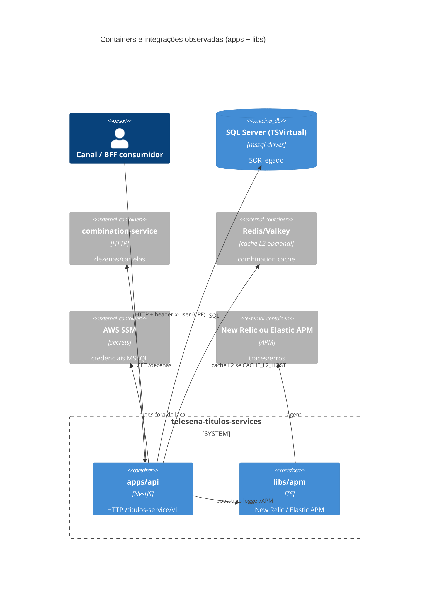
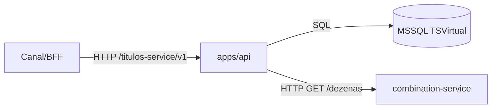
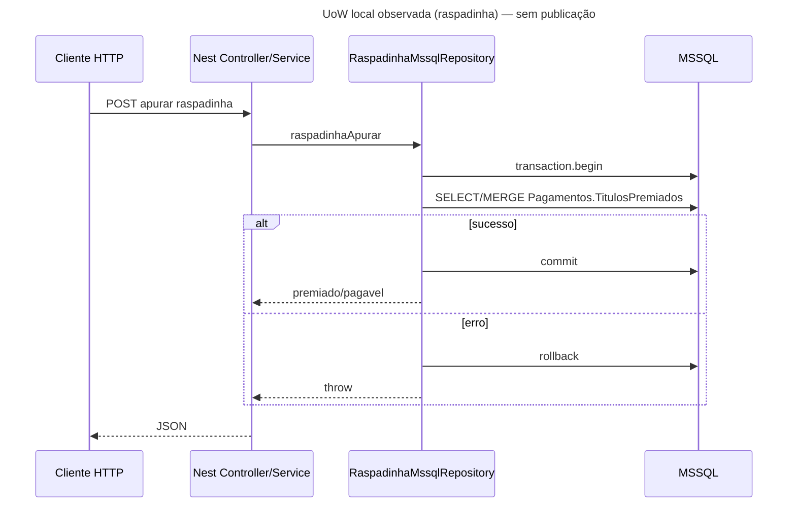

# Inventário AS-IS — telesena-titulos-services (apps + libs)

- **Repositório**: `git@gitea.lidercap.com.br:lidercap-apps/telesena-titulos-services.git` (local: `/home/mmanjos/work/repositories/modernização/telesena-titulos-services`)
- **Escopo inspecionado**: `apps/api/**` e `libs/**` (metadados do monorepo, `docs/`, `.github/`, `Dockerfile` e `sonar-project.properties` usados como evidência transversal)
- **Commit inspecionado**: `0cbfdb4` (`0cbfdb4c30b0ea029279f3ad6436c28e48104192`, 2026-06-18)
- **Data do levantamento**: 2026-08-13
- **Responsável pelo levantamento**: agente (asset `prompt-inventario-repositorio.md` / SPEC-K9H204F1)
- **Stack**: TypeScript (NestJS)

## 1. Sumário executivo

- `Fato`: monorepo Nx (`@telesena-titulos-services/root`) com **pnpm@9.1.0**, **uma app** (`apps/api`) e **uma lib** (`libs/apm`) — `package.json:14-15`, `pnpm-workspace.yaml:1-4`, listagem de `apps/` e `libs/`.
- `Fato`: domínio de negócio = **títulos TeleSena** (listagem/abertura, raspadinha, cupom, cartelas, giro da sorte, prêmios, quiz, promoções, apuração) — `apps/api/src/setup.ts:12-15`, controllers sob `apps/api/src/infra/http/controllers/`.
- `Fato`: persistência primária = **SQL Server** via driver `mssql@12.5.5` (schemas `TSVirtual.*`); **sem ORM** (TypeORM/Prisma/Knex) — `apps/api/package.json:26`, `apps/api/src/infra/db/mssql/mssql.service.ts`.
- `Fato`: mensageria (**SQS/Kafka/Rabbit/BullMQ**) **NÃO EXISTE** em `apps/api` nem `libs` — busca sem matches; API é **HTTP síncrona** com prefixo `/titulos-service/v1` — `apps/api/src/setup.ts:10`.
- `Fato`: contratos wire = **OpenAPI/Swagger** em runtime (`@nestjs/swagger`); **`.proto` / AsyncAPI NÃO EXISTEM** no repositório — `apps/api/src/setup.ts:12-20`, `find '*.proto'` vazio.
- `Fato`: observabilidade = lib `@telesena-titulos-services/apm` (New Relic default ou Elastic APM) + **Pino** (`nestjs-pino`); funções de trace distribuído (`getAPMTraceHeaders` / `startAPMTransaction`) **existem na lib e não são chamadas** pela app — `libs/apm/src/index.ts`, `apps/api/src/main.ts:1-16`, `apps/api/src/infra/modules/app.module.ts:15-20`.
- `Fato`: UoW local MSSQL aparece em **raspadinha** e **quiz** (`connection.transaction()`); **outbox/inbox NÃO EXISTEM** — `titulos-raspadinha.repository.ts:230+`, `quiz.repository.ts:300`, busca `outbox|inbox` vazia.
- `Fato`: ownership formal via `CODEOWNERS` **NÃO EXISTE**; `package.json` root declara autor `Thomas Bouasli <tbouasli@lidercap.com.br>` — listagem CODEOWNERS falhou; `package.json:2-5`.
- `Fato`: workflows de CI/CD em `.github/workflows/` estão majoritariamente com sufixo `.bck`; workflow ativo observado = `semgrep.yml` — listagem de `.github/workflows/`.
- `Inferência` (alta): do ponto de vista DMPF, é uma **API de leitura/escrita sobre legado MSSQL** com camadas `domain/application/infra` parcialmente aplicadas; útil como amostra de **aderência (ou não) às constraints de domínio**, mas **fraco como piloto de mensageria/outbox** (eixos 1 e 3 vazios por ausência de broker).

## 2. Evidências consultadas

- Manifestos: `package.json` (root), `apps/api/package.json`, `libs/apm/package.json`, `pnpm-workspace.yaml`, `nx.json`, `Dockerfile`, `.npmrc`, `sonar-project.properties`, `biome.json`
- Código: `apps/api/src/main.ts`, `setup.ts`, `infra/modules/*`, `infra/db/mssql/mssql.service.ts`, `infra/config/environment.ts`, `infra/config/secrets.ts`, `infra/cloud/aws/ssm.service.ts`, `infra/http/**`, `infra/adapters/**`, `application/services/**`, `domain/**`, `libs/apm/src/index.ts`
- Docs: `apps/api/README.md` (boilerplate Nest), `apps/api/VARIAVEIS_AMBIENTE_ANALISE.md`, `docs/reports/codebase-diff-feat-combination-vs-master.md`
- CI: `.github/workflows/*`, `.github/README.md`
- Buscas: `sqs|kafka|bullmq|amqp|outbox|inbox|exactly-once|at-least-once|.proto|CODEOWNERS|beginTransaction|\.transaction\(|ApiProperty|getAPMTraceHeaders`
- Comandos: `git rev-parse HEAD`; `find` em `apps/api/src` e `libs`; `rg`

## 3. Estrutura do repositório

Escopo deste relatório — árvore simplificada:

```text
telesena-titulos-services/
├── apps/
│   └── api/                          # @telesena-titulos-services/api (NestJS)
│       ├── src/
│       │   ├── main.ts / setup.ts
│       │   ├── domain/               # combination, promocoes, quiz, titulos
│       │   ├── application/services/ # orquestração por feature
│       │   ├── docs/swagger/         # decorators OpenAPI
│       │   └── infra/
│       │       ├── http/             # controllers, validation, filters
│       │       ├── adapters/db/mssql/# repositórios SQL
│       │       ├── adapters/combination/http/
│       │       ├── cache/            # memory + multi-level (Redis L2)
│       │       ├── cloud/aws/        # SSM
│       │       ├── config/
│       │       ├── db/mssql/
│       │       └── modules/
│       ├── test/integration/         # Testcontainers MSSQL + Redis
│       └── package.json
├── libs/
│   └── apm/                          # @telesena-titulos-services/apm
│       └── src/index.ts              # New Relic / Elastic APM helpers
├── docs/reports/                     # 1 relatório de diff de feature
├── scripts/
├── .github/workflows/                # semgrep + vários *.bck
├── Dockerfile
├── nx.json
├── package.json
└── pnpm-workspace.yaml
```

`Fato` — inventário de dirs: listagem de `apps/`, `libs/`, `find apps/api/src/domain -type d`.

## 4. Arquitetura observada

`Inferência` (alta): **API NestJS monolítica** organizada em pastas `domain` / `application` / `infra` (hexagonal parcial). A borda HTTP autentica identidade do usuário via header `x-user` (CPF). Persistência é SQL cru no MSSQL legado; integração externa síncrona com **combination-service** (HTTP) e cache opcional L1/L2 (memória + Redis/Valkey). Sem workers, sem filas, sem dual-write assíncrono.

`Inferência` (média): a aplicação **injeta classes concretas** `*MssqlRepository` / `CombinationHttpRepository` em vez de tokens de porta — ports existem no `domain`, mas o acoplamento application→infra é direto (ex.: `titulos.service.ts:14-25`, `apuracao.service.ts:7-22`).



## 5. Padrões vigentes

### 5.1 Mensageria

- `Fato`: **NÃO EXISTE** broker, tópico, fila, DLQ, consumer ou publisher em `apps/api` nem `libs` — `rg -l 'sqs|kafka|bullmq|amqp|outbox|inbox'` sem matches no escopo.
- `Fato`: transporte observado = **HTTP/Express** (Nest platform-express) — `apps/api/package.json:10`, `main.ts`.
- Topologia assíncrona: **NÃO EXISTE**.



### 5.2 Contratos

- `Fato`: contrato HTTP gerado em runtime por `@nestjs/swagger` e exposto em `/docs` — `apps/api/src/setup.ts:12-20`.
- `Fato`: decorators OpenAPI colocalizados em `apps/api/src/docs/swagger/*.ts` e também **dentro de tipos/entidades de `domain/`** via `ApiProperty` (12 arquivos) — `rg -l ApiProperty apps/api/src/domain`.
- `Fato`: **`.proto` NÃO EXISTE**; **AsyncAPI NÃO EXISTE**; schema JSON de mensagem **NÃO EXISTE** (não há mensageria).
- `Lacuna`: não há evidência de verificação automática de breaking change (Pact, oasdiff, buf, etc.) no repositório — workflows de CI relevantes estão em `.bck`.
- `Inferência` (média): o “dono” do contrato é o próprio time da API; versionamento aparenta ser o prefixo de path `v1` — `setup.ts:10` — sem política documentada de evolução.

### 5.3 Transação (UoW)

- `Fato`: pool MSSQL único (`MssqlService`); fronteira transacional explícita em:
  - `TitulosRaspadinhaMssqlRepository.raspadinhaApurar` / `raspadinhaApurarTodas` — `begin` → queries/MERGE → `commit`/`rollback` — `titulos-raspadinha.repository.ts:230-301`, `:309+`
  - `QuizMssqlRepository` — `quiz.repository.ts:300` (`connection.transaction()`)
- `Fato`: **outbox / inbox / transactional messaging NÃO EXISTEM**.
- `Inferência` (alta): demais operações (listagens, abertura de título, leituras) rodam em auto-commit por request HTTP, sem UoW compartilhada application-level.
- Diagrama commit→publicação: **NÃO APLICÁVEL** (não há publicação assíncrona).



### 5.4 Observabilidade

- `Fato`: `libs/apm` inicia New Relic (`newrelic@14.0.0` + `@newrelic-labs/mssql`) ou Elastic APM (`elastic-apm-node@4.15.0`) conforme `APM_AGENT` / `APM_ENABLED` — `libs/apm/src/index.ts:9-31`, `libs/apm/package.json:5-9`.
- `Fato`: app usa `setupAPMLoggerProps()` no `LoggerModule` (enricher Pino do New Relic) e `bufferLogs` quando APM ativo — `app.module.ts:15-20`, `main.ts:8-16`.
- `Fato`: `getAPMTraceHeaders`, `startAPMTransaction` e `apmCaptureError` **só aparecem definidos em `libs/apm`**; **nenhuma chamada** em `apps/api/src` — `rg` limitado à definição.
- `Fato`: logs via `nestjs-pino` / `Logger` Nest; filter global loga path + stack — `exception.filter.ts:205-206`.
- `Fato`: health endpoints `/health/info` e `/health/ping` (liveness superficial, sem probe de DB) — `health.controller.ts:17-28`.
- `Fato`: SonarQube configurado (`sonar.projectKey=telesena-titulos-service-api`) — `sonar-project.properties:5-7`.
- `Lacuna`: métricas de negócio / RED / SLO versionados no repositório **NÃO EXISTEM** (`NÃO MEDIDO` no código).
- Propagação de trace em salto assíncrono: **NÃO APLICÁVEL** (sem salto assíncrono); em salto HTTP outbound para combination-service, headers APM **não são injetados** no código inspecionado (`combination.repository.ts:27-40`).

## 6. Aderência às constraints

| Constraint | Situação | Rótulo | Evidência | Observação |
|---|---|---|---|---|
| Domínio sem I/O | viola | Fato | `domain/**/*.ts` importa `@nestjs/swagger` (`ApiProperty`) em 12 arquivos; `domain/quiz/ports/quiz-repository.port.ts:8` importa `IResult, Request` de `mssql` | Camada `domain/` existe, mas vaza framework HTTP e tipos do driver SQL |
| Protobuf apenas no wire | não aplicável | Fato | `find '*.proto'` vazio no repositório | Sem Protobuf; modelo interno = classes/types TS + shapes SQL |
| At-least-once | não aplicável | Fato | ausência de broker/outbox; `rg` `exactly-once\|at-least-once\|idempoten` sem matches em apps/libs/docs | Sem delivery assíncrono para classificar; merges SQL locais podem ser idempotentes por chave, mas isso não é política E2E de messaging |

## 7. Inventário técnico

### 7.1 Libs e componentes

| Componente | Versão | Papel | Owner | Fonte do owner | Rótulo |
|---|---|---|---|---|---|
| `@telesena-titulos-services/api` | `0.0.0` (private) | API Nest de títulos TeleSena | Lacuna (sem CODEOWNERS) | — | Fato (`apps/api/package.json:82-98`) |
| `@telesena-titulos-services/apm` | `1.0.0` | Bootstrap APM + helpers de trace/logger | Lacuna | — | Fato (`libs/apm/package.json:23-34`) |
| NestJS (`@nestjs/*`) | `12.0.0-alpha.5` (vários) | Framework HTTP | — | package.json | Fato |
| `mssql` | `12.5.5` | Driver SQL Server | — | package.json | Fato |
| `nestjs-pino` / `pino` | `4.6.1` / `10.3.1` | Logging | — | package.json | Fato |
| `newrelic` | `14.0.0` | APM default | — | libs/apm | Fato |
| `elastic-apm-node` | `4.15.0` | APM alternativo | — | libs/apm + api | Fato |
| `@aws-sdk/client-ssm` | `3.1057.0` | Secrets | — | api package.json | Fato |
| `@keyv/redis` / `cache-manager` | alphas / `7.2.8` | Cache L2 / Nest cache | — | package.json | Fato |
| `nx` | `22.7.5` | monorepo tooling | — | root package.json | Fato |
| Node (Docker) | `22.13-alpine` | runtime imagem | — | `Dockerfile:1` | Fato |
| pnpm | `9.1.0` | package manager | — | root `packageManager` | Fato |

### 7.2 Dependências e integrações

**Upstream (de quem depende):**

| Integração | Tipo | Evidência | Rótulo |
|---|---|---|---|
| SQL Server (`TSVirtual.*`) | DB | repositórios em `infra/adapters/db/mssql/**`; `encrypt: false` em `mssql.service.ts:53` | Fato |
| `COMBINATION_SERVICE_URL` | HTTP | `combination.repository.ts:19-40`; env obrigatória `environment.ts:73` | Fato |
| Redis/Valkey (opcional) | Cache L2 | `multi-level-cache.factory.ts:28-72`; `CACHE_L2_HOST` | Fato |
| AWS SSM | Secrets | `secrets.ts:138-156` path `/{NODE_ENV}/titulos-services-api` | Fato |
| New Relic / Elastic APM | Observabilidade | `libs/apm` | Fato |

**Downstream (quem depende dele):**

| Consumidor | Evidência | Rótulo |
|---|---|---|
| Canais/BFF que chamam `/titulos-service/v1` com `x-user` | prefixo em `setup.ts:10`; decorator `cpf.decorator.ts:3-11` | Inferência (alta) — consumidores concretos **não** estão neste repositório |

### 7.3 NFRs e restrições

| Item | Valor observado | Evidência | Rótulo |
|---|---|---|---|
| Prefixo API | `/titulos-service/v1` | `setup.ts:10` | Fato |
| Identidade do usuário | header `x-user` = CPF 11 dígitos | `cpf.decorator.ts:5-8` | Fato |
| Validação de entrada | `ValidationPipe` whitelist + forbidNonWhitelisted | `setup.ts:7` | Fato |
| TLS no MSSQL driver | `encrypt: false` | `mssql.service.ts:53` | Fato |
| Secrets em não-local | SSM Parameter Store | `secrets.ts:138-156` | Fato |
| Segurança estática CI | Semgrep workflow presente | `.github/workflows/semgrep.yml` | Fato |
| CI build/test | workflows principais em `.bck` | listagem `.github/workflows/` | Fato |
| README de produto | boilerplate Nest genérico | `apps/api/README.md` | Fato |
| SLO / error budget | NÃO EXISTE no repo | busca docs | Lacuna |
| Engines Node no package.json | NÃO DECLARADO (só Docker pin) | root/api package.json sem `engines` | Fato |

### 7.4 Métricas atuais

| Métrica | Medida hoje? | Onde | Valor de referência | Rótulo |
|---|---|---|---|---|
| Latência/erro HTTP | Inferência: via APM se `APM_ENABLED=1` | New Relic / Elastic | NÃO MEDIDO no repo | Inferência (média) |
| Métricas de negócio (títulos abertos, apurações) | NÃO | — | NÃO MEDIDO | Fato |
| Cobertura de testes | configurável (Jest + Sonar lcov) | `sonar-project.properties:124-125` | NÃO MEDIDO neste levantamento | Lacuna |
| Health de dependências (DB/Redis) | NÃO no `/health` | `health.controller.ts` | NÃO MEDIDO | Fato |

## 8. Achados fora do escopo priorizado

- `Fato`: **application layer acoplada a infra concreta** — serviços importam `*MssqlRepository` / `CombinationHttpRepository` diretamente (lista em `rg` sob `application/services`). Ports no domain existem, mas DI não usa tokens de porta de forma consistente (exceção parcial: tipagem `TitulosRepository` com `@Inject(TitulosMssqlRepository)` em `titulos.service.ts:2-25`).
- `Fato`: **README da app é o starter Nest**, sem descrição do domínio TeleSena — `apps/api/README.md`.
- `Fato`: **CI operacional aparenta estar desabilitado/arquivado** (arquivos `.bck`); risco de qualidade/regressão sem gate no forge — listagem `.github/workflows/`.
- `Fato`: conexão MSSQL com **`encrypt: false`** — superfície de segurança visível — `mssql.service.ts:53`.
- `Fato`: Nest e Swagger em **versões alpha** (`12.0.0-alpha.*`) — `apps/api/package.json:6-11`.
- `Fato`: `.npmrc` com `before=2026-05-31T23:59:59Z` e `ignore-scripts=true` — restrição temporal de pacotes — `.npmrc`.
- `Inferência` (média): `pnpm-workspace.yaml` inclui `www`, mas diretório `www` **não** aparece na listagem da raiz — possível residual.
- `Fato`: autenticação/autorização além do header CPF **não** foi encontrada (sem guards JWT/API key no código inspecionado dos controllers).

## 9. Pontos críticos para manutenção

| Área | Risco | Impacto | Evidência | Rótulo |
|---|---|---|---|---|
| Domínio vazado (Swagger/mssql) | Refactors de contrato/HTTP alteram “domínio”; ports vazam driver | Alto para adoção golden path “domínio sem I/O” | `domain/**` + `quiz-repository.port.ts:8` | Fato |
| SQL legado embutido | Regras de premiação/MERGE no repositório; schemas `TSVirtual` | Alto acoplamento a ProdCap/legado | `titulos-raspadinha.repository.ts:259-278` | Fato |
| CI em `.bck` | Pouca garantia automatizada no forge | Médio/alto em regressões | `.github/workflows/*.bck` | Fato |
| Trace outbound ausente | Chamadas ao combination-service sem headers APM | Médio — buraco de observabilidade E2E | `combination.repository.ts` vs `getAPMTraceHeaders` não usado | Fato |
| `encrypt: false` | Tráfego DB sem TLS no client | Alto (segurança) | `mssql.service.ts:53` | Fato |
| Ownership informal | Sem CODEOWNERS; só author no package.json | Médio para governança DMPF | ausência CODEOWNERS | Fato |

## 10. Candidato a piloto

**Não** (como piloto E2E de mensageria/outbox/contratos async): repositório sem broker e sem outbox — os eixos 1 e 3 do golden path não têm superfície real.

`Inferência` (média): **sim como amostra estreita** de API Nest com pastas domain/application/infra + constraint “domínio sem I/O”, se a etapa de piloto quiser medir dívida de camada em serviço síncrono legado — decisão cabe a `SPEC-VVR1X71Q`.

## 11. Lacunas e perguntas em aberto

| O que | Por que não foi possível levantar | Quem pode responder |
|---|---|---|
| Time owner oficial / CODEOWNERS | Arquivo inexistente; author no package.json não prova ownership de produto | Plataforma / líder do canal TeleSena |
| Consumidores concretos da API (BFFs/apps) | Fora deste repositório; só contrato HTTP implícito | Time de canais (ex.: rendafacil-bff / sites) |
| Dashboards New Relic / SLOs em produção | Sem link versionado no repo; APM condicional a env | SRE / observabilidade |
| Estado real do CI (por que `.bck`) | Histórico operacional não documentado no código | Time que manteve os workflows |
| Cobertura % atual e quality gate Sonar | Levantamento não executou scanner nem consultou Sonar | Pipeline / Sonar `telesena-titulos-service-api` |
| Política de versionamento do contrato `v1` | Só prefixo de path; sem ADR | Arquitetura / time da API |
| Combination-service: repo, contrato e ownership | Só URL via env | Time dono do combination-service |

## 12. Resumo de confiança

| Área | Confiança | Justificativa |
|---|---|---|
| Arquitetura | Alta | Estrutura de pastas e módulos Nest inspecionados; padrão hexagonal parcial evidente |
| Mensageria | Alta | Ausência confirmada por busca ampla no escopo |
| Contratos | Alta | Swagger runtime + ausência de proto/AsyncAPI confirmadas; consumidores externos são lacuna |
| Transação | Alta | Transactions MSSQL localizadas; outbox inexistente |
| Observabilidade | Média | Lib APM e Pino claros; uso em produção e dashboards não verificados; helpers de DT não usados na app |
| Ownership | Baixa | Sem CODEOWNERS; apenas author no manifesto root |
