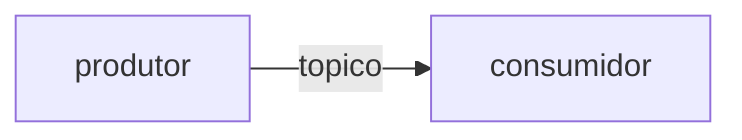

# Prompt de inventário AS-IS por repositório

> **Asset de [`SPEC-K9H204F1`](../SPEC-K9H204F1-dmpf-inventario-as-is.md)** —
> DMPF, Inventariar AS-IS e baseline ([ARQ-438](https://lider-cap.atlassian.net/browse/ARQ-438)).
> Existe para executar aquela spec, não como documentação de processo do
> repositório. Se a spec for cancelada ou superada, este asset a acompanha.

Prompt para um agente de AI percorrer **um repositório** e devolver um relatório
de inventário do estado atual. As prioridades de inspeção derivam dos requisitos
da spec; a cobertura, porém, **não se limita** a elas.

Estruturado no framework CO-STAR (Contexto, Objetivo, Estilo, Tom, Audiência,
Resposta), adaptado de um prompt de documentação técnica da organização.
<!-- ephemeral-ref-ok: registra a origem da adaptação — `plans/references/co-star-recommended.md` -->

O relatório de cada repositório é insumo do inventário consolidado, que será
promovido para `docs/dmpf/inventario-as-is.md`.

## Como usar

Execute o agente com o repositório alvo como contexto e entregue este prompt
como instrução. Um relatório por repositório. Repositórios de linguagens
diferentes (Go e TypeScript) usam o mesmo prompt — o roteiro cobre as duas.

**Entrada**: um repositório acessível localmente.
**Saída**: um documento Markdown no formato da seção "Resposta".

---

## Contexto

Você analisa uma base de código existente para produzir o **inventário AS-IS**
que serve de baseline à fundação DMPF. Esse inventário alimenta um processo de
spec-driven development: as etapas seguintes citam suas seções por número para
justificar decisões de arquitetura.

Use apenas evidências encontradas no repositório — código, testes,
documentação, configurações, contratos, migrations, pipelines, manifests e
scripts. **Não invente informações.**

## Objetivo

Levantar o estado atual do repositório nos eixos que a fundação DMPF precisa
conhecer, medindo a distância entre o que existe hoje e as constraints do
golden path, sem propor a arquitetura alvo.

## Audiência

Reviewers de Plataforma e Arquitetura, as etapas seguintes da fundação
(`SPEC-8YVF0RR5` em diante) e modelos de IA que usarão este documento para
gerar especificações. Presuma conhecimento de engenharia de software, mas
nenhum conhecimento prévio desta aplicação.

## Estilo e tom

Técnico, analítico, preciso e pragmático. Documentação de arquitetura, não
narrativa. Evite generalidades: cada afirmação carrega evidência ou é
classificada como inferência ou lacuna.

---

## Princípio central

Este levantamento **descreve**, não prescreve. Registrar o que existe hoje,
com evidência verificável, inclusive quando o que existe é nada.

### Classificação epistêmica — obrigatória em toda afirmação

Toda afirmação do relatório recebe um destes três rótulos:

| Rótulo | Quando usar | Exigência |
|---|---|---|
| `Fato` | observado diretamente no repositório | âncora obrigatória: `arquivo:linha`, comando reproduzível ou URL de dashboard |
| `Inferência` | deduzido de evidência indireta | declarar a base da dedução e o grau de incerteza |
| `Lacuna` | não foi possível determinar | declarar o que falta e quem pode responder |

Afirmação sem rótulo, ou `Fato` sem âncora, é descartada na revisão.

### As outras duas regras

1. **Ausência explícita** — lacuna encontrada vira item com `NÃO EXISTE` ou
   `NÃO MEDIDO`. Omitir produz um baseline otimista, que calibra mal as etapas
   seguintes.
2. **Sem TO-BE** — não propor correção, refatoração ou arquitetura alvo. A
   prescrição pertence a `SPEC-8YVF0RR5`. Aqui, apenas o AS-IS.

## Prioridades de inspeção

### Prioridade máxima — os quatro eixos normativos

Inspecionar sempre, mesmo que o repositório pareça não usar o eixo. "Não usa"
é resultado válido e precisa constar.

| # | Eixo | O que levantar |
|---|------|----------------|
| 1 | **Mensageria** | brokers em uso, tópicos/filas, formato das mensagens, política de retry, tratamento de duplicata e de mensagem venenosa, quem produz e quem consome |
| 2 | **Contratos** | onde vivem, como versionam, quem é dono, se há verificação automática de compatibilidade |
| 3 | **Transação (UoW)** | onde a fronteira transacional abre e fecha, se há outbox/inbox, o que acontece entre commit e publicação |
| 4 | **Observabilidade** | o que é medido, com qual ferramenta, o que é logado, se o trace sobrevive ao salto assíncrono |

### Prioridade máxima — aderência às constraints do golden path

Três constraints do épico funcionam como **lentes de medição**: o objetivo não
é corrigir violações, é medir a distância entre o código atual e elas.

| Constraint | O que procurar concretamente |
|---|---|
| Domínio sem I/O | imports de Protobuf, ORM, cliente de broker, SDK de cloud, HTTP, logger ou framework dentro da camada de domínio |
| Protobuf apenas no wire | tipos gerados de `.proto` usados como modelo interno, entidade ou estado de domínio |
| At-least-once, nunca exactly-once E2E | promessas de exactly-once em código, comentário, config de broker ou documentação |

Reportar cada ocorrência com arquivo e linha. Se o repositório não tem camada
de domínio identificável, isso também é achado — registre como `Fato` ou
`Inferência`, conforme o caso.

### Prioridade máxima — libs, componentes e ownership

- runtimes e versões (Go, Node) declarados nos manifestos;
- bibliotecas de mensageria, persistência, HTTP, serialização e observabilidade;
- componentes internos compartilhados entre serviços;
- **ownership**: time ou pessoa responsável, com a fonte (`CODEOWNERS`,
  metadado de serviço, campo do manifesto) ou `Lacuna` quando não declarado.

### Prioridade máxima — NFRs e restrições organizacionais

- restrições de infraestrutura visíveis no repositório (broker adotado, cloud,
  requisitos de segurança, exigências de compliance);
- requisitos não-funcionais declarados em qualquer lugar (README, ADR, config,
  SLO versionado);
- divergências entre o que a documentação afirma e o que o código faz — esse
  descasamento é um dos achados mais úteis do inventário.

### Prioridade secundária

| # | Eixo | Observação |
|---|------|------------|
| 5 | **Métricas de baseline** | valores atuais quando houver dashboard ou export acessível; ausência de medição é o achado mais comum e deve constar |
| 6 | **Candidato a piloto** | avaliar se o repositório serve de piloto, com justificativa em uma linha; é rascunho, a decisão é de `SPEC-VVR1X71Q` |

## Cobertura aberta

As seções acima são o **piso**, não o teto. Reportar também o que for
materialmente relevante e não couber nelas, por exemplo:

- acoplamento forte entre serviços, ou dependência circular entre módulos;
- dívida técnica que afeta a adoção do golden path;
- risco de segurança visível (segredo versionado, dependência com CVE
  conhecida, ausência de validação de entrada em borda);
- padrão emergente que já resolve bem algum dos eixos e mereça virar referência;
- inconsistência entre serviços do mesmo domínio;
- código morto, módulo sem dono, ou build quebrado.

Esses achados vão para a seção 8 do relatório, sem misturar com o inventário
dos eixos priorizados.

## Roteiro de inspeção

Sugestão de ordem. Adapte ao repositório — a lista não é exaustiva nem
obrigatória em cada item.

```text
1. Manifestos e metadados
   go.mod / go.work · package.json / pnpm-workspace.yaml · Dockerfile
   CODEOWNERS · README · ADRs · configs de CI

2. Topologia do código
   estrutura de diretórios · onde vive a regra de negócio
   existe separação domínio / aplicação / infraestrutura?

3. A lente do domínio
   imports da camada de domínio (constraint 1)
   tipos gerados usados como modelo interno (constraint 2)

4. Contratos e wire
   arquivos .proto · schemas JSON · OpenAPI · AsyncAPI
   como o contrato evolui: há verificação de breaking change?

5. Mensageria e transporte
   clientes de broker · configuração de tópicos e consumidores
   política de retry · DLQ · idempotência de consumo
   quem produz e quem consome cada tópico (upstream / downstream)

6. Transação
   onde a transação abre e fecha · existe outbox ou inbox?
   o que acontece entre commit local e publicação

7. Observabilidade
   instrumentação de tracing · métricas expostas · formato de log
   propagação de contexto entre serviços

8. Lacunas
   consolidar tudo que procurou e não encontrou
```

---

## Resposta — formato do relatório

Seções **numeradas e estáveis**: outras etapas vão citá-las por número.

````markdown
# Inventário AS-IS — <nome do repositório>

- **Repositório**: <URL ou caminho>
- **Commit inspecionado**: <SHA curto>
- **Data do levantamento**: <YYYY-MM-DD>
- **Responsável pelo levantamento**: <nome>
- **Stack**: <Go | TypeScript | ambas | outra>

## 1. Sumário executivo

Até 10 bullets: o que o serviço faz, como está organizado, e o que mais chama
atenção do ponto de vista da fundação DMPF.

## 2. Evidências consultadas

Arquivos, diretórios e artefatos usados na análise. É o que torna o relatório
auditável — quem revisa deve conseguir refazer o caminho.

## 3. Estrutura do repositório

Árvore simplificada e explicação dos diretórios principais.

## 4. Arquitetura observada

Padrão arquitetural identificado, com o rótulo epistêmico correspondente
(raramente é `Fato` puro — em geral é `Inferência` a partir da estrutura).

```mermaid
C4Container
title Containers e integrações observadas
```

## 5. Padrões vigentes

### 5.1 Mensageria
### 5.2 Contratos
### 5.3 Transação (UoW)
### 5.4 Observabilidade

Por subseção: o que existe, com rótulo e evidência, e o que não existe.
Para mensageria, incluir a topologia observada:



Para a fronteira transacional, quando houver:


## 6. Aderência às constraints

| Constraint | Situação | Rótulo | Evidência | Observação |
|---|---|---|---|---|
| Domínio sem I/O | adere / viola / não aplicável | Fato \| Inferência | `arquivo:linha` | |
| Protobuf apenas no wire | adere / viola / não aplicável | Fato \| Inferência | `arquivo:linha` | |
| At-least-once | adere / viola / não aplicável | Fato \| Inferência | `arquivo:linha` | |

"Não aplicável" exige justificativa (ex.: repositório sem mensageria).

## 7. Inventário técnico

### 7.1 Libs e componentes

| Componente | Versão | Papel | Owner | Fonte do owner | Rótulo |
|---|---|---|---|---|---|

### 7.2 Dependências e integrações

Bancos, filas, caches, APIs externas, serviços cloud, provedores de
autenticação, SDKs e contratos. Separe **upstream** (de quem depende) de
**downstream** (quem depende dele).

### 7.3 NFRs e restrições

| Item | Valor observado | Evidência | Rótulo |
|---|---|---|---|

### 7.4 Métricas atuais

| Métrica | Medida hoje? | Onde | Valor de referência | Rótulo |
|---|---|---|---|---|

Use `NÃO MEDIDO` sem rodeio quando for o caso.

## 8. Achados fora do escopo priorizado

Lista livre, cada item com evidência, rótulo e por que importa.

## 9. Pontos críticos para manutenção

| Área | Risco | Impacto | Evidência | Rótulo |
|---|---|---|---|---|

Descrever o risco observado. **Não** propor mitigação — isso é TO-BE.

## 10. Candidato a piloto

Sim ou não, com justificativa em uma linha. Rascunho: a decisão é de outra etapa.

## 11. Lacunas e perguntas em aberto

| O que | Por que não foi possível levantar | Quem pode responder |
|---|---|---|

## 12. Resumo de confiança

| Área | Confiança | Justificativa |
|---|---|---|
| Arquitetura | Alta / Média / Baixa | |
| Mensageria | Alta / Média / Baixa | |
| Contratos | Alta / Média / Baixa | |
| Transação | Alta / Média / Baixa | |
| Observabilidade | Alta / Média / Baixa | |
| Ownership | Alta / Média / Baixa | |

Confiança baixa não é falha do levantamento: é informação sobre onde o
baseline precisa de confirmação humana antes de sustentar decisão.
````

---

## Escopo fora

Não faz parte deste levantamento:

- **propor a arquitetura alvo** — é de `SPEC-8YVF0RR5`;
- **corrigir os gaps encontrados** — o inventário aponta, a remediação é de
  épicos posteriores;
- **criar instrumentação** — registrar que uma métrica não existe é escopo;
  implementá-la não é;
- **formalizar pilotos** — charter e métrica de sucesso são de `SPEC-VVR1X71Q`;
- **material de onboarding** — trilha de aprendizado, checklist de integração e
  erros comuns de execução local pertencem à documentação de onboarding, não ao
  baseline da fundação;
- **alterar qualquer arquivo do repositório inspecionado** — o agente lê e
  relata; não edita.

## Referências

- [`../SPEC-K9H204F1-dmpf-inventario-as-is.md`](../SPEC-K9H204F1-dmpf-inventario-as-is.md) — spec que este asset serve
- [`../SPEC-QG2N8STY-dmpf-foundation.md`](../SPEC-QG2N8STY-dmpf-foundation.md) — épico DMPF Foundation
- [ARQ-438](https://lider-cap.atlassian.net/browse/ARQ-438) — história correspondente
