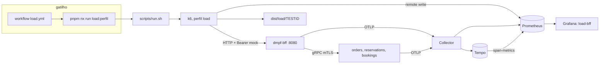

# SPEC-XJWRJPVZ: Suíte de carga k6 pela borda do BFF, com remote write e dashboard de correlação

## Resumo

Criar uma suíte de teste de carga em k6 que exercita a topologia de referência
só pela borda pública — o BFF —, com seis perfis de carga (smoke, carga média,
estresse, pico, resistência e ruptura) e um perfil de admissão, sobre jornadas
de negócio de `orders`, `reservations` e `bookings`. A suíte roda por target Nx
na máquina local ou por um workflow manual parametrizável; os dois caminhos
passam pelo mesmo script. As métricas do k6 seguem por Prometheus remote write
para o Prometheus da topologia e aparecem no Grafana num dashboard que as
correlaciona com as séries de serviço do kernel. O objetivo é medir latência,
erro técnico e ponto de ruptura antes de cada release.

## Contexto

- **Problema**: a topologia não tem medição de desempenho sob carga. Os testes
  existentes (unitários, integração e o `TestTopologyEndToEnd` do BFF,
  `apps/backend/bff/app/e2e_test.go:40`) provam correção, não capacidade: não
  dizem a partir de que taxa a borda responde 429, 500, 503 ou 504, nem quanto a
  convergência de `reservations` atrasa sob pressão.
- **Impacto**: regressão de desempenho só aparece em ambiente compartilhado; o
  prazo de rota e os limites de admissão não têm verificação empírica.
- **Borda do BFF** (única borda HTTP, ADR-044):
  - 11 rotas de negócio (`apps/backend/bff/app/api/routes.go:77-91`), mais
    `/livez` e `/readyz` sem credencial (`api/health.go:12-13`); `/readyz`
    responde 204 ou 503 e cacheia o resultado por 1 s (`health.go:16`).
  - Com `AUTH_DEV_MOCK=true` (`libs/backend/go/authn/config.go:31`), já ligado
    no compose (`apps/backend/bff/deploy/compose.yml:21`), a credencial é
    `Authorization: Bearer <JSON cru {"sub","tenant","permissions"}>`
    (`libs/backend/go/authn/identity.go:22-76`). A permissão da rota precisa
    constar literalmente do array. `X-Subject-ID`, `X-Tenant-ID` ou `tenant_id`
    divergentes dão 403 `identity-mismatch`
    (`libs/backend/go/http/identity.go:63-92`).
  - Todo POST exige `Idempotency-Key` casando `^[A-Za-z0-9._-]{1,128}$`
    (`api/middleware.go:35`). A borda não deduplica: a repetição cai na regra de
    domínio (422 ou 409). `X-Correlation-ID` com a mesma regex é preservado e
    devolvido (`middleware.go:30`, `:60`).
  - Ids de path e de corpo casam `^[A-Za-z0-9._:-]{1,128}$` (`api/handlers.go:22`).
    Corpo limitado a 64 KiB, e campo desconhecido dá 400 (`handlers.go:17`, `:53-65`).
- **Admissão**:
  - Limite fixo `PerSecond: 50, Burst: 100, Concurrency: 32`
    (`apps/backend/bff/app/config.go:91`), sem variável de ambiente.
  - O bucket é por par (padrão de rota, tenant cru)
    (`libs/backend/go/transport/admission/admission.go:124-133`; teste
    `admission_test.go:113-135`). `METRIC_TENANTS` só limita o label, e tenant
    fora dele sai como `other`.
  - Teto de 64 chaves (`controller.go:11`): com o teto cheio, o bucket ocioso
    menos recente é evictado e renasce com burst cheio; sem ocioso, a recusa é
    `saturated` (`admission.go:179-207`). Com 11 rotas, 5 tenants usam 55 chaves
    e 6 usam 66.
  - A recusa é 429 `admission-refused` com `Retry-After: 1`
    (`libs/backend/go/http/admission.go:73-74`). A admissão roda depois da
    autenticação (`routes.go:152-153`). Os contextos repetem o limite por método gRPC e tenant, e a recusa deles chega pela borda como 429 `admission-refused` sem `Retry-After`, com a mensagem "the context refused the call; retry later" (`apps/backend/bff/app/rpc/errors.go:36`).
- **Prazos e resiliência**:
  - Rota com 2 s (`config.go:92-98`); método gRPC com 1,5 s
    (`app/rpc/clients.go:28-30`); estouro dá 504 `deadline-exceeded`.
  - Retry só nas quatro leituras e só em `UNAVAILABLE` (`clients.go:97-115`).
  - Bulkhead (pool 16, fila 16) e breaker por contexto. Breaker aberto e
    bulkhead cheio não são status gRPC e saem como 500 `internal-failure`
    (`app/rpc/errors.go:49-65`).
- **Fluxos assíncronos e dados**:
  - `place` grava `OrderPlaced` na outbox; o relay de `orders` publica
    `orders.events` a cada 500 ms (`apps/backend/orders/app/config.go:117`); o
    consumer de `reservations` cria a reserva `confirmed`. Até lá,
    `GET /reservations/{order_id}` responde 404, e o e2e faz polling
    (`e2e_test.go:205-209`).
  - `ITEM_LIMIT` default 10 itens por pedido
    (`apps/backend/orders/deploy/compose.yml:23`).
  - `ReserveBooking` não consulta `resources`
    (`apps/backend/bookings/application/reserve_booking.go:12-54`); o mesmo
    `bookingId` repetido dá 409; `GET /bookings/booking?resourceId=` de recurso
    sem reserva responde 200 com `[]`.
- **Métricas do kernel**:
  - Os serviços não expõem `/metrics`: exportam OTLP ao Collector, que grava no
    Prometheus.
  - Catálogo em `libs/backend/go/observability/metrics/catalog.go:41-55`:
    MET-08 `dmpf_service_request_duration_seconds`, MET-09
    `dmpf_service_requests_total`, MET-10 `dmpf_service_errors_total`, MET-12
    `dmpf_service_admission_rejections_total` e as séries `dmpf_dependency_*`.
  - O BFF emite MET-08/09/10 por chamada gRPC aos contextos, não por rota HTTP.
    Por rota HTTP só existem o span `HTTP <padrão>` (`api/middleware.go:51`) e as
    `traces_spanmetrics_*` que o Tempo deriva dele. O compose amostra 100% dos
    traces (`TRACE_SAMPLE_RATE: '1'`, `infra/local/compose/app-base.yml:11`).
- **Infra local**:
  - Projeto Compose `dmpf-local` (`infra/local/docker-compose.yml:8`), rede
    `default`, BFF no serviço `dmpf-bff:8080`. A pilha sobe com
    `docker compose -f infra/local/docker-compose.yml --profile dmpf up -d --build`
    (`infra/README.md:54`), e toda variável dos composes tem default.
  - Prometheus `v3.14.0` com `--web.enable-remote-write-receiver`
    (`infra/local/compose/prometheus.yml:3`, `:8-13`). Ingere native histograms
    por remote write sem flag desde a 3.9.0.
  - Grafana `13.2.1` carrega `infra/observability/grafana/dashboards/` a cada
    30 s (`infra/observability/grafana/dashboards.yaml:7-15`), com o Prometheus
    no uid `prometheus`. O único dashboard é `reference.json`.
  - Exporters: cAdvisor, postgres-exporter e scrape de `redpanda:9644/public_metrics`
    (`infra/observability/prometheus/prometheus.yaml:25-80`). Lag de consumer
    group não é coletado: as séries de offset de grupo do Redpanda dependem da
    propriedade de cluster `enable_consumer_group_metrics`.
  - `tools/infra-budget.sh` soma só os perfis `all` e `dmpf` (`:11`). Num host de
    8 vCPU, a soma dos limites de CPU já é igual ao teto (4,80 vCPU).
  - BFF e cada `api` têm limite de 0,15 vCPU e 192M; relay e consumer, 0,10 vCPU
    e 128M (`app-base.yml:29-58`).
- **Nx e CI**:
  - `type:e2e` e `stack:universal` são valores válidos
    (`docs/nx-reference/tasks.md:88-90`).
  - Nenhum release group casa `type:e2e` (`nx.json:78-138`), nem o filtro de
    release Docker `tag:type:app,!tag:stack:go` (`.github/workflows/nx-release.yml:174`).
  - O CI roda `nx affected` com `lint`, `typecheck`, `test`, `build` e `e2e`
    (`.github/workflows/ci.yml:62-71`, `:395`), e `biome ci .` (`:59`).
  - Os workflows usam `runs-on: ubuntu-26.04`, actions fixadas por SHA e o
    composite `./.github/actions/setup-node-pnpm` (`.github/workflows/dmpf-evidence.yml`).
- **k6**: não instalado no host. A versão estável é a 2.3.0 (2026-09-21), com a
  imagem `grafana/k6:2.3.0@sha256:9c2dee7f8ed74d317e4027c06a10f169b625638189de8d4555d0b3486a5aeb34`,
  que roda como usuário 12345.
- **Referências externas**:
  - Tipos de teste: <https://grafana.com/docs/k6/latest/testing-guides/test-types/>
  - Executors: <https://grafana.com/docs/k6/latest/using-k6/scenarios/executors/>
  - Thresholds: <https://grafana.com/docs/k6/latest/using-k6/thresholds/>
  - `expectedStatuses`: <https://grafana.com/docs/k6/latest/javascript-api/k6-http/expected-statuses/>
  - Remote write: <https://grafana.com/docs/k6/latest/results-output/real-time/prometheus-remote-write/>
  - Resumo customizado: <https://grafana.com/docs/k6/latest/results-output/end-of-test/custom-summary/>

<constraints>
- [P0] A suíte fala só HTTP com o BFF. Nenhum cenário chama o gRPC dos contextos, o Postgres ou o Kafka.
- [P0] Nenhuma mudança no código ou na configuração do BFF, dos contextos e dos serviços Compose existentes: admissão, prazos, autenticação, amostragem de trace e nível de log ficam como estão.
- [P0] O k6 roda só sob o perfil Compose `load`, fora de `all` e `dmpf`: `bff:infra-budget` e `infrasync --check` passam sem mudança de teto.
- [P0] O script recusa alvo fora da allowlist (`dmpf-bff`, `localhost`, `127.0.0.1`, esquema `http`). O mock forja qualquer identidade; o workflow mira só a topologia do próprio runner, nunca `dev` ou `hmg`.
- [P0] Nenhum label enviado ao Prometheus carrega id de recurso: a tag `name` é o template da rota e `url` fica fora de `systemTags`.
- [P0] O pool de tenants tem no máximo 5 (11 rotas × 5 = 55 chaves, abaixo do teto de 64): acima disso a evicção devolve burst cheio e mascara a admissão.
- [P1] O projeto `load` não entra em release group e não declara `test`, `build`, `typecheck` nem `e2e`. O workflow só dispara por `workflow_dispatch`.
- [P1] Imagem do k6 fixada por tag e digest; actions fixadas por SHA.
</constraints>

## Requisitos

### Funcionais

#### Projeto e execução

- [ ] **[P0] Projeto Nx `load`**: criar `apps/backend/load/project.json` com `name: load`, tags `type:e2e`, `scope:backend`, `stack:universal`, e `"lint": {}` (o `biome lint` vem de `targetDefaults`, `nx.json:195-202`). Sem `package.json`: o projeto não publica nada nem tem dependência npm.
- [ ] **[P0] Targets por perfil**: `smoke`, `average`, `stress`, `spike`, `soak`, `breakpoint` e `admission`, cada um `nx:run-commands` com `cache: false`, `cwd: {workspaceRoot}` e `bash apps/backend/load/scripts/run.sh <perfil>`.
- [ ] **[P0] Script único de execução** (`apps/backend/load/scripts/run.sh`):
  - Valida o perfil e os parâmetros pelas regras da tabela; com `--check`, só valida e sai (0 ou 2), sem tocar no Docker. Sem `--check`, gera `TESTID=<perfil>-<UTC yyyymmddThhmmss>` e cria `dist/load/<TESTID>/`. Execução com `TESTID` já existente em `dist/load/` é recusada com saída 2.
  - Roda `docker compose -f infra/local/docker-compose.yml --profile load run --rm --user "$(id -u):$(id -g)" k6 run --tag testid=<TESTID> /load/src/main.js`, repassando só as variáveis da tabela de parâmetros.
  - Imprime o `TESTID` e a URL `http://localhost:3000/d/load-bff?var-testid=<TESTID>`.
  - Sai com o código do k6 (99 quando um threshold falha).
- [ ] **[P0] Serviço Compose `k6`**: criar `infra/local/compose/k6.yml` e incluí-lo em `infra/local/docker-compose.yml`.
  - Imagem `grafana/k6:2.3.0@sha256:9c2dee7f8ed74d317e4027c06a10f169b625638189de8d4555d0b3486a5aeb34`, só no perfil `load`.
  - Monta `apps/backend/load` em `/load` somente leitura e `dist/load` em `/results`.
  - `deploy.resources.limits` de `1.00` vCPU e `1024M`. Sem `depends_on`: a topologia sobe antes, por comando próprio.
- [ ] **[P0] Parâmetros por variável de ambiente**, iguais nos dois gatilhos:

  | Variável | Default | Validação |
  | --- | --- | --- |
  | `RATE` | `10` | iterações de jornada por segundo, inteiro de 1 a 1000 |
  | `DURATION` | do perfil | platô, `^[0-9]+[smh]$` |
  | `TENANTS` | `4` | inteiro de 1 a 5 |
  | `WEIGHTS` | `orders=30,reservations=25,bookings=35,reads=10` | soma 100 |
  | `CANCEL_RATIO` | `0.2` | de 0 a 1; somado a `RESERVE_RATIO`, no máximo 1 |
  | `RESERVE_RATIO` | `0.2` | de 0 a 1 |
  | `CONVERGENCE_TIMEOUT` | `10s` | `^[0-9]+s$` |
  | `SEED` | `1` | inteiro |
  | `BASE_URL` | `http://dmpf-bff:8080` | allowlist |

  Valor inválido aborta no `init` com mensagem que nomeia a variável.

#### Workflow manual

- [ ] **[P0] `.github/workflows/load.yml`**, só com `workflow_dispatch`. Inputs:
  - `profile`: `choice` com os sete perfis, default `smoke`.
  - `rate`, `duration`, `tenants`, `weights`: `string`, com os defaults da tabela (vazio usa o default do perfil).
  - `runner`: `string`, default `ubuntu-26.04`.
- [ ] **[P0] Job `load`** com `runs-on: ${{ inputs.runner }}`, `timeout-minutes: 360` (teto dos runners hospedados, para caber um `soak` longo), `permissions: contents: read` e `concurrency` por runner sem cancelamento. Passos:
  1. `actions/checkout` fixado pelo SHA de `dmpf-evidence.yml` e `./.github/actions/setup-node-pnpm`.
  2. Validar os inputs com `bash apps/backend/load/scripts/run.sh --check <profile>`, com os valores passados por `env` e nunca interpolados em `run`.
  3. Subir `--profile dmpf` com `up -d --build --wait`.
  4. Rodar `pnpm nx run load:<profile>` com os inputs em `env`.
  5. Publicar `dist/load/` como artifact (`actions/upload-artifact` fixado por SHA, retenção de 14 dias) e anexar `summary.md` a `$GITHUB_STEP_SUMMARY`.
  6. Em `always()`: `docker compose ... --profile all --profile dmpf --profile load down -v`.

  O job falha quando o k6 sai com código diferente de 0.

#### Identidade, cabeçalhos e dados

- [ ] **[P0] Pool de tenants e identidade**: tenants `load-t1..load-t<TENANTS>`, distribuídos em round-robin por VU. O Bearer de cada VU é `{"sub":"load-vu-<vu>","tenant":"<tenant>","permissions":[...]}` com as seis permissões `orders:read`, `orders:write`, `reservations:read`, `reservations:write`, `bookings:read` e `bookings:write`. Nenhuma requisição envia `X-Subject-ID`, `X-Tenant-ID` ou `tenant_id`.
- [ ] **[P0] Cabeçalhos**: todo POST leva `Idempotency-Key` UUID v4 novo; toda requisição leva `X-Correlation-ID: load-<TESTID>-<vu>-<iteração>`.
- [ ] **[P0] Ids gerados no cliente**: `o-<TESTID>-<vu>-<iteração>` para pedido e reserva, `b-...` para booking e `r-...` para recurso. O `TESTID` no id evita colisão com execuções anteriores sem limpar o banco.
- [ ] **[P0] `setup()`**:
  - Aplica a allowlist a `BASE_URL`.
  - Espera `GET /readyz` responder 204, com teto de 60 s.
  - Cria `10` pedidos colocados por tenant para a jornada `reads` e espera a reserva de cada um convergir.
  - Usa `setupTimeout: '120s'`. Falha no `setup()` encerra o teste sem cenários.

#### Jornadas

- [ ] **[P0] `orders`**: `POST /orders/{id}/items` de 1 a 3 vezes (201) → `POST /orders/{id}/place` (200) → `GET /orders/{id}` (200 com `status == "placed"`).
- [ ] **[P0] `reservations`**, com três variantes sorteadas numa faixa única (`CANCEL_RATIO`, depois `RESERVE_RATIO`, e o restante):
  - Cancelamento antecipado (`CANCEL_RATIO`): `POST /reservations/{id}/cancel` num id novo (200) → `POST /orders/{id}/items` (201) → `place` (200) → `GET /reservations/{id}` (200, `canceled`). A primeira decisão vence (DEC-10, `apps/backend/reservations/domain/cancel.go:5-13`): o `OrderPlaced` posterior é rejeitado pelo consumer, e cancelar reserva já confirmada daria 422 `reservations/already-reserved`.
  - Síncrona (`RESERVE_RATIO`): `POST /reservations/{id}/reserve` com `items` de 1 a 3 num id novo (200) → `GET /reservations/{id}` (200, `confirmed`).
  - Assíncrona (restante): `POST /orders/{id}/items` (201) → `place` (200) → `GET /reservations/{id}` a cada 250 ms (404 esperado) até 200 ou `CONVERGENCE_TIMEOUT`.
- [ ] **[P0] `bookings`**: `POST /bookings/resource` (201) → `POST /bookings/booking` com `quantity` de 1 a 5 no recurso novo (201) → `GET /bookings/booking/{id}` (200) → `GET /bookings/booking?resourceId=` (200, 1 elemento) → `POST /bookings/booking/{id}/cancel` na fração `CANCEL_RATIO` (200). O recurso novo por iteração mantém a listagem com tamanho constante.
- [ ] **[P1] `reads`**: `GET /orders/{id}` e `GET /reservations/{id}` (200) sobre os pedidos do `setup()` do próprio tenant.
- [ ] **[P0] Um cenário k6 por jornada**, com `exec` próprio, tag `journey` e taxa `RATE × peso / 100` expressa em `timeUnit: '1m'`, para aceitar pesos que não dão inteiro por segundo.
- [ ] **[P0] Tags por requisição**: `name` igual ao template da rota (ex.: `/orders/{id}/items`) e `kind` em `write`, `read` ou `poll`. `systemTags` fica em `status`, `method`, `name`, `group`, `check`, `error_code`, `scenario` e `expected_response`.

#### Perfis, classificação e thresholds

- [ ] **[P0] Perfis**: os sete da tabela em Design, selecionados pelo target. Alocação de VUs por cenário: `preAllocatedVUs = ceil(taxa de pico em it/s × 4)`, porque a cauda das iterações chegou a ~3 s no `average` e o k6 descarta a iteração enquanto inicializa um VU extra; `maxVUs = ceil(taxa de pico em it/s × (CONVERGENCE_TIMEOUT + 2 s))`, porque a iteração assíncrona pode durar até `CONVERGENCE_TIMEOUT` mais as requisições.
- [ ] **[P0] Classificação**:
  - `http.setResponseCallback(http.expectedStatuses({ min: 200, max: 499 }))`: `http_req_failed` conta só 5xx e erro de transporte (status 0), que é o erro técnico.
  - Toda requisição das jornadas usa `timeout: '10s'`: um BFF travado vira status 0, contado como falha técnica, em vez de prender a iteração pelos 60 s do default do k6.
  - Cada requisição tem um `check` do status esperado da etapa, que aceita também 429.
  - 429 alimenta a `Rate` `admission_rejections` e encerra a iteração. O 429 da borda (mensagem iniciada por `admission refused:`) tem de trazer `Retry-After: 1`; o do contexto soma também no `Counter` `context_admission_rejections`, sem essa checagem.
  - 4xx inesperado reprova o `check` e encerra a iteração.
- [ ] **[P0] Thresholds por perfil** conforme Design; `breakpoint` com `abortOnFail: true` e `delayAbortEval: '30s'`.
- [ ] **[P1] Convergência**: `Trend` `reservation_convergence` com `isTime` (do fim do `place` à primeira leitura 200) e `Counter` `reservation_convergence_timeouts`.
- [ ] **[P1] Resumo**: `handleSummary` grava `/results/<TESTID>/summary.json` (objeto `data` completo) e `summary.md`, e devolve o mesmo markdown em `stdout`, sem import remoto. O `summary.md` traz:
  - os thresholds, com ok ou falhou;
  - as requisições por `status`;
  - o p95 e o p99 por `kind`;
  - o tempo decorrido;
  - no `breakpoint`, a taxa-alvo do instante do abort, calculada pela tabela de stages.

#### Observabilidade

- [ ] **[P0] Remote write**:
  - Saída `-o experimental-prometheus-rw` com `K6_PROMETHEUS_RW_SERVER_URL=http://prometheus:9090/api/v1/write`.
  - `K6_FEATURES=native-histograms`, `K6_PROMETHEUS_RW_STALE_MARKERS=true` e `K6_PROMETHEUS_RW_PUSH_INTERVAL=2s`, para o dashboard (refresh de 5 s) ficar dentro de 10 s do terminal.
  - `K6_PROMETHEUS_RW_LABELS=profile=<perfil>` e a tag `testid`.
- [ ] **[P1] Dashboard `infra/observability/grafana/dashboards/load-bff.json`**, com uid `load-bff`, datasource uid `prometheus` e variável `testid` (`label_values(k6_http_reqs_total, testid)`). Linhas, todas no intervalo do painel:
  1. k6: `k6_vus`; taxa por `journey` e `name`; p95 e p99 por `name` com `histogram_quantile` sobre `k6_http_req_duration_seconds`; falha técnica e fração de 429 calculadas por `status` em `k6_http_reqs_total`, sem `/readyz` (as gauges `k6_*_rate` do remote write acumulam desde o início e não servem para janela); `k6_context_admission_rejections_total`; `k6_dropped_iterations_total`; p95 de `k6_reservation_convergence_seconds`.
  2. Borda do BFF: taxa e p95 por `span_name` de `traces_spanmetrics_calls_total` e `traces_spanmetrics_latency_bucket`, com `service="bff"`. Painel da razão k6 ÷ borda por rota, com `label_join` de `method` e `name` casando `span_name`.
  3. BFF para os contextos: MET-08, MET-09 e MET-10 com `service_name="bff"` por `operation` e `outcome_category`; `dmpf_dependency_breaker_state`, `_bulkhead_rejections_total`, `_retries_total` e `_deadline_exceeded_total` por `dependency`.
  4. Contextos: MET-08, MET-09 e MET-10 de `orders`, `reservations` e `bookings`; MET-12 por `service_name` e `route`.
  5. Recursos: CPU e memória do cAdvisor dos containers `dmpf-local-dmpf-.*` e conexões do postgres-exporter por banco.
- [ ] **[P2] Lag do grupo `reservations`** no `load-bff`: `redpanda_kafka_max_offset` menos `redpanda_kafka_consumer_group_committed_offset`. Sem `enable_consumer_group_metrics`, o painel fica sem dados, e o README documenta o `rpk cluster config set` que o liga.

#### Documentação

- [ ] **[P1] `apps/backend/load/README.md`**: como subir a topologia, os perfis e as perguntas que cada um responde, os parâmetros, os dois gatilhos, como ler o `load-bff`, códigos de saída e as limitações do Design.
- [ ] **[P2] Índices**: `infra/README.md` (perfil `load` e `k6.yml` na árvore de `compose/`), `docs/ci-cd/README.md` (linha do `load.yml` na tabela de workflows, `:92-103`) e `AGENTS.md` (uma linha na visão geral).

### Não-funcionais

- [ ] **Cardinalidade**: nenhum label com id; `testid` é o único label novo por execução; a retenção de 7 dias do Prometheus (`prometheus.yml:8`) limita o acúmulo.
- [ ] **Reprodutibilidade**: todo valor sorteado vem de um PRNG com semente `SEED + hash(cenário, VU, iteração)`.
- [ ] **Isolamento**: tenants e sujeitos com prefixo `load-`; ids com o `TESTID`; reset por `down -v`.
- [ ] **Gerador**: teto de 1,00 vCPU no serviço `k6`; `dropped_iterations` acima de 0 indica gerador ou pool de VUs saturado, não o alvo. O perfil pode pré-alocar no máximo 1200 VUs no total (medido: 881 MiB no `breakpoint` com `RATE=10`), validado no `--check` e no `init`.
- [ ] **Estilo**: JavaScript em ES modules, aprovado por `pnpm biome ci .`; dashboard JSON formatado pelo Biome.

## Camadas afetadas

| Camada | Impacto |
| --- | --- |
| **Projeto Nx `load`** (novo) | `project.json`, sete targets de perfil e `lint`; fora de release groups e dos targets do CI além de `lint` |
| **Scripts k6** (novos) | `src/` com opções, perfis, jornadas, cliente HTTP, identidade, guard e resumo |
| **Infra local (Compose)** | `compose/k6.yml` novo no perfil `load`; `docker-compose.yml` ganha um `include` |
| **Observabilidade** | Dashboard `load-bff.json` novo; Prometheus, Grafana e exporters sem mudança de configuração |
| **CI/CD** | Workflow `load.yml` novo, só `workflow_dispatch`; `ci.yml` sem mudança |
| **Documentação** | README do projeto, `infra/README.md`, `docs/ci-cd/README.md`, `AGENTS.md` |

Nenhuma camada de produto é afetada: BFF, contextos, contratos, bancos e tópicos
ficam intactos.

## Localização de código

```text
apps/backend/load/
  project.json          — projeto Nx e targets
  README.md             — uso e limitações
  scripts/run.sh        — ponto de entrada único dos dois gatilhos
  src/main.js           — options, cenários, setup e handleSummary
  src/profiles.js       — tabela de perfis, stages e thresholds
  src/params.js         — leitura e validação das variáveis
  src/journeys/{orders,reservations,bookings,reads}.js
  src/lib/{identity,http,guard,ids,random,summary}.js
infra/local/compose/k6.yml
infra/observability/grafana/dashboards/load-bff.json
.github/workflows/load.yml
```

**Arquivos a modificar**:
- `infra/local/docker-compose.yml`: `include` de `compose/k6.yml`.
- `infra/README.md`, `docs/ci-cd/README.md`, `AGENTS.md`: referências à suíte.

## Design

### Arquitetura



### Fluxo principal

1. A topologia sobe com `--profile dmpf` (máquina local ou passo do workflow).
2. O target chama `run.sh <perfil>`, que gera o `TESTID` e roda o k6 no container `k6`.
3. O `init` valida os parâmetros; o `setup()` aplica o guard, espera `/readyz` e cria a massa de `reads`.
4. Um cenário por jornada, com o executor do perfil; as métricas vão ao Prometheus a cada 2 s.
5. `handleSummary` grava o resumo; o processo sai com 0, ou 99 quando um threshold falha.

### Perfis

`RATE` é a taxa total de iterações de jornada por segundo; cada iteração faz de
2 a 6 requisições (mais o polling). O teto de admissão por rota é
`TENANTS × 50` req/s.

| Perfil | Executor | Forma (stages) | Duração default | Pergunta |
| --- | --- | --- | --- | --- |
| `smoke` | `constant-vus` | 1 VU por jornada | 1 min | script e topologia funcionam? |
| `average` | `ramping-arrival-rate` | 0 → `RATE` em 2 min; platô 10 min; 0 em 1 min | 13 min | latência e erro na carga esperada |
| `stress` | `ramping-arrival-rate` | 2×`RATE` em 2 min; platô 10 min; 3×`RATE` em 2 min; platô 5 min; 0 em 1 min | 20 min | quanto degrada acima do esperado |
| `spike` | `ramping-arrival-rate` | `RATE` por 1 min; 8×`RATE` em 30 s; platô 1 min; `RATE` em 30 s; platô 2 min | 5 min | a borda volta ao normal depois do pico? |
| `soak` | `constant-arrival-rate` | `RATE` constante | 60 min | degradação ou vazamento ao longo do tempo |
| `breakpoint` | `ramping-arrival-rate` | 0 → 30×`RATE` linear, `TENANTS=5`, sem descida | até 30 min | onde a topologia rompe |
| `admission` | `constant-arrival-rate` | 80 req/s em `GET /bookings/booking?resourceId=load-admission`, 1 tenant | 2 min | a admissão recusa acima de 50/s? |

`DURATION` substitui o platô de `average`, `stress` (os dois platôs), `soak` e
`admission`; em `smoke`, `spike` e `breakpoint` é ignorada.

### Thresholds

| Perfil | Condições |
| --- | --- |
| `smoke` | `http_req_failed` `rate==0`; `checks` `rate==1`; `admission_rejections` `rate==0` |
| `average`, `soak` | `http_req_failed` `rate<0.01`; `http_req_duration{kind:read}` `p(95)<300`, `p(99)<800`; `http_req_duration{kind:write}` `p(95)<500`, `p(99)<1500`; `checks` `rate>0.99`; `admission_rejections` `rate<0.001`; `reservation_convergence` `p(95)<5000`; `reservation_convergence_timeouts` `count==0`; `dropped_iterations` `count==0` |
| `stress` | `http_req_failed` `rate<0.05`; `http_req_duration` `p(99)<2000`; `checks` `rate>0.95` |
| `spike` | `http_req_failed` `rate<0.10` (sem abort: o perfil mede a recuperação) |
| `breakpoint` | com abort: `http_req_failed` `rate<0.05`; `http_req_duration` `p(99)<2000`; `admission_rejections` `rate<0.10` |
| `admission` | `admission_rejections` `rate>0.30` e `rate<0.45`; `http_req_failed` `rate==0`; `checks` `rate==1` |

Os valores de `average` e `soak` são metas iniciais: a primeira execução de
`average` numa máquina de referência vira baseline, e qualquer ajuste entra por
PR nesta tabela. O teto `p(99)<2000` acompanha o prazo de rota. A faixa de
`admission` sai da conta 80 req/s × 120 s = 9600 requisições, das quais cerca de
100 + 50 × 120 = 6100 são admitidas, com recusa esperada de 36%.

### Pseudocódigo

```text
request(etapa):
  res = http.request(etapa.método, url, corpo, {tags: {name, kind}, headers})
  if res.status == 429:
    admission_rejections.add(true); check(res, Retry-After == "1"); abortar iteração
  admission_rejections.add(false)
  ok = check(res, res.status in etapa.esperados)
  if not ok: abortar iteração

guard(base_url):
  u = parse(base_url)
  if u.scheme != "http" or u.host not in {dmpf-bff, localhost, 127.0.0.1}: throw
```

## Decisões técnicas

1. **Um script, dois gatilhos**: o workflow chama o mesmo target Nx que a máquina
   local. Alternativa descartada: um job com o k6 declarado inline, que
   duplicaria parâmetros, validação e montagem de volumes.
2. **Native histograms, não trend stats**: o Prometheus 3.14 ingere sem flag, e o
   `histogram_quantile` agrega por jornada, rota e janela no dashboard. Trend
   stats não se agregam entre séries e geraram cerca de 7 vezes mais séries no
   teste da pesquisa. Custo aceito: `native-histograms` é flag experimental do
   k6, e por isso a imagem é fixada por digest. O número de aceite vem do
   `summary.json`, calculado sobre a execução inteira.
3. **Dashboard próprio, sem vendorar o 19665 nem o 18030**: o 19665 exige trend
   stats, e o `load-bff` já cobre os painéis do k6 junto com o kernel. O README
   indica o import do 18030 pelo ID no Grafana, para quem quiser a visão
   genérica.
4. **k6 como serviço Compose de perfil próprio**: herda rede e DNS do
   `dmpf-local` e fica fora do `infra-budget`, que não tem folga de CPU.
5. **Pool de até 5 tenants, sem `METRIC_TENANTS`**: a admissão já é por tenant
   cru; o pool só multiplica o teto e fica abaixo das 64 chaves. Declarar o pool
   em `METRIC_TENANTS` exigiria mudar o compose do BFF, e o label `route` da
   MET-12 basta para ler a recusa.
6. **429 fora de `http_req_failed`**: recusa de admissão é proteção em
   funcionamento. Misturar as duas esconderia a ruptura real em `spike` e
   `breakpoint`, que leem a recusa pela `Rate` própria. A recusa do contexto fica visível em contador próprio porque a borda não propaga `Retry-After` nela.
7. **Recurso novo por iteração em `bookings`**: o código não exige recurso
   registrado, mas registrar exercita a 11ª rota e mantém a listagem com um
   elemento, sem crescer ao longo do `soak`.
8. **Workflow só manual, no próprio runner**: carga não entra no caminho do PR.
   O input `runner` permite um runner dedicado quando a comparação entre
   execuções exigir hardware estável.
9. **JavaScript sem bundler nem `package.json`**: o k6 executa ES modules
   direto, e a suíte não tem dependência npm nem import remoto.

## Regras relacionadas

- ADR-002: não redeclarar targets que `targetDefaults` já fornece (`lint`).
- ADR-044: o BFF é a única borda HTTP.
- ADR-045: nome do projeto igual ao basename do diretório.
- `docs/nx-reference/tasks.md`: taxonomia de tags.
- `.claude/rules/git-safety.md`: segredos fora do repositório (a suíte não usa nenhum).

## Verificação e testes

### Critérios de aceite

- [ ] Com `--profile dmpf` recém-subido, `pnpm nx run load:smoke` sai com 0, com `http_req_failed` 0 e as 11 rotas presentes na tag `name` do `summary.json`.
- [ ] Antes do merge: o `actionlint` (imagem Docker fixada por digest) aprova o `load.yml`. Depois do merge em `master`, onde o `workflow_dispatch` passa a disparar, o workflow com `profile=smoke` termina verde, publica o artifact com `summary.json` e `summary.md` e mostra o resumo no job.
- [ ] `TENANTS=6 bash apps/backend/load/scripts/run.sh --check smoke` sai com código diferente de 0 e nomeia a variável, sem subir container; é o mesmo passo que reprova um input inválido no workflow antes de subir a topologia.
- [ ] Durante `load:average`, o `load-bff` filtrado pelo `testid` mostra a execução com atraso de no máximo 10 s em relação ao terminal.
- [ ] No mesmo intervalo, a taxa de `k6_http_reqs_total` e a de `traces_spanmetrics_calls_total{service="bff"}` diferem em no máximo 5% por rota.
- [ ] `load:admission` sai com 0, com `admission_rejections` entre 30% e 45%, nenhum 5xx e `Retry-After: 1` em todo 429 da borda; recusas do contexto aparecem em `context_admission_rejections`.
- [ ] `load:breakpoint` aborta por threshold, com o k6 saindo com 99 (o `run.sh` reporta o código; o `pnpm nx run` o normaliza para 1), e o `summary.md` registra o tempo decorrido e a taxa-alvo no abort.
- [ ] Com `BASE_URL` fora da allowlist, ou `TENANTS=6`, o teste sai com código diferente de 0 sem enviar requisição ao BFF.
- [ ] Depois de qualquer perfil, `count(last_over_time({__name__=~"k6_.*", url!=""}[1h]))` e `count(last_over_time({__name__=~"k6_.*", name=~".*(o|b|r)-.*"}[1h]))` voltam vazios no Prometheus; `last_over_time` é necessário porque os stale markers encerram as séries ao fim do teste.
- [ ] `pnpm nx show project load --json` lista só os sete perfis e `lint`, e o projeto não casa nenhum release group do `nx.json` nem o filtro do `nx-release.yml`.
- [ ] `pnpm biome ci .`, `pnpm nx run bff:infra-budget`, `go run ./tools/dmpf-conformance/cmd/infrasync --root . --check` e `go run ./tools/dmpf-conformance/cmd/conformance --root . --base develop` passam.
- [ ] Todo painel das linhas 1 a 5 do `load-bff` retorna série não vazia durante `load:average`.

### Cenários de teste

1. **Caminho feliz**: DADO a topologia `dmpf` no ar e `TENANTS=4`, QUANDO
   `load:smoke` roda, ENTÃO as quatro jornadas completam, `checks` fica em
   100% e o k6 sai com 0.
2. **Admissão saturada**: DADO um único tenant, QUANDO `load:admission` envia
   80 req/s por 2 min a uma rota, ENTÃO a recusa fica entre 30% e 45%, as
   requisições admitidas respondem 200 e `http_req_failed` não conta os 429.
3. **Contexto fora do ar**: DADO `load:average` em execução, QUANDO
   `dmpf-bookings-api` para, ENTÃO a jornada `bookings` recebe 503 ou 500,
   `http_req_failed` cruza o threshold e o k6 sai com 99, enquanto
   `http_req_failed{journey:orders}` segue abaixo de 1%.
4. **Convergência travada**: DADO `dmpf-reservations-consumer` parado, QUANDO a
   jornada `reservations` roda, ENTÃO `reservation_convergence_timeouts` cresce,
   o 404 do polling não entra em `http_req_failed` e o threshold de
   `reservation_convergence_timeouts` reprova (a Trend só recebe as convergências que aconteceram, e o p95 dela não sobe).
5. **Alvo proibido**: DADO `BASE_URL=http://bff.hmg.example:8080`, QUANDO
   qualquer perfil roda, ENTÃO o `setup()` falha antes da primeira requisição.

<critical_constraints>
- [P0] A suíte fala só HTTP com o BFF. Nenhum cenário chama o gRPC dos contextos, o Postgres ou o Kafka.
- [P0] Nenhuma mudança no código ou na configuração do BFF, dos contextos e dos serviços Compose existentes: admissão, prazos, autenticação, amostragem de trace e nível de log ficam como estão.
- [P0] O k6 roda só sob o perfil Compose `load`, fora de `all` e `dmpf`: `bff:infra-budget` e `infrasync --check` passam sem mudança de teto.
- [P0] O script recusa alvo fora da allowlist (`dmpf-bff`, `localhost`, `127.0.0.1`, esquema `http`). O mock forja qualquer identidade; o workflow mira só a topologia do próprio runner, nunca `dev` ou `hmg`.
- [P0] Nenhum label enviado ao Prometheus carrega id de recurso: a tag `name` é o template da rota e `url` fica fora de `systemTags`.
- [P0] O pool de tenants tem no máximo 5 (11 rotas × 5 = 55 chaves, abaixo do teto de 64): acima disso a evicção devolve burst cheio e mascara a admissão.
- [P1] O projeto `load` não entra em release group e não declara `test`, `build`, `typecheck` nem `e2e`. O workflow só dispara por `workflow_dispatch`.
- [P1] Imagem do k6 fixada por tag e digest; actions fixadas por SHA.
</critical_constraints>

## Escopo fora

- **Carga em `dev` ou `hmg` do Kubernetes**: exige OIDC real e um emissor de token de teste; o mock é proibido fora da topologia local.
- **Dashboard no Kubernetes**: `grafana/kustomization.yaml:25-27` lista os JSON um a um, e a suíte só roda no Compose.
- **Disparo automático por PR, push ou agenda**: carga fica fora do caminho do merge; o workflow é manual.
- **Persistir as séries do Prometheus do runner**: o artifact leva o resumo; o dashboard serve à execução local.
- **Custo da verificação OIDC sob carga**: fora da pergunta desta suíte.
- **Carga direta em gRPC, Kafka ou Postgres**: contorna admissão e prazo de rota.
- **Dimensionamento absoluto de produção**: gerador e alvo dividem o host, e os limites de CPU são os da topologia local; os números comparam versões.
- **Mudar a observabilidade para a carga** (nível de log, amostragem, `enable_consumer_group_metrics`): a suíte mede a topologia como ela é configurada.
- **Extensões xk6, Grafana Cloud k6 e `k6/browser`**: exigem build customizado ou serviço externo, e não há frontend.
